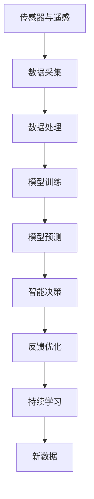

                 

# 人工智能与地球环境的适应

## 1. 背景介绍

### 1.1 问题由来
随着全球变暖、气候变化、资源短缺等环境问题的日益加剧，人类正面临着前所未有的环境挑战。这些问题不仅影响着全球生态系统的平衡，也对人类的生产生活造成了严重威胁。

与此同时，人工智能（AI）技术的快速发展，为应对这些环境问题提供了新的思路和方法。人工智能技术可以通过高效的数据处理和分析能力，帮助人类更好地理解地球环境，从而采取更有效的治理措施。

### 1.2 问题核心关键点
人工智能在地球环境适应中的关键点包括：

- **数据采集与处理**：通过传感器、遥感技术等手段获取环境数据，利用人工智能技术进行数据清洗、预处理和特征提取。
- **模型训练与优化**：基于环境数据，训练和优化环境预测和分析模型，以提高模型准确性和泛化能力。
- **决策支持**：利用训练好的模型，为环境保护和治理提供科学决策支持，制定最优方案。
- **持续学习**：随着时间的推移和环境变化，不断更新模型和算法，保持其适应性和准确性。

### 1.3 问题研究意义
人工智能在地球环境适应中的应用，具有重要的研究意义：

1. **提升环境监测效率**：利用AI技术，可以自动监测和分析环境数据，大幅提高监测效率和数据处理能力。
2. **优化环境保护决策**：基于AI模型的决策支持，可以提供更加科学、精确的环境保护方案。
3. **推动可持续发展**：通过AI技术的辅助，可以更好地协调经济发展和环境保护之间的关系，推动可持续发展。
4. **增强社会认知**：利用AI技术进行环境教育和科普，增强公众的环境保护意识。
5. **推动技术创新**：AI技术在环境领域的应用，可以推动相关技术的发展和创新。

## 2. 核心概念与联系

### 2.1 核心概念概述

为更好地理解人工智能在地球环境适应中的作用，本节将介绍几个密切相关的核心概念：

- **环境监测**：通过传感器、遥感等手段，获取环境数据，并进行实时监测和分析。
- **数据分析**：对环境监测数据进行清洗、预处理和特征提取，为后续的建模提供数据支持。
- **机器学习（ML）**：通过有监督或无监督学习，训练环境预测和分析模型，提高模型的准确性和泛化能力。
- **深度学习（DL）**：一种特殊的机器学习方法，利用神经网络模型进行数据建模和预测。
- **环境预测与分析**：利用训练好的模型，对未来的环境状况进行预测和分析。
- **智能决策支持系统**：基于AI模型，为环境保护和治理提供科学决策支持。

这些核心概念之间存在紧密的联系，形成了人工智能在地球环境适应中的整体框架。通过理解这些核心概念，我们可以更好地把握AI技术在环境监测、数据分析和决策支持中的作用。

### 2.2 概念间的关系

这些核心概念之间存在紧密的联系，形成了人工智能在地球环境适应中的整体框架。

**数据采集与处理**：
1. 利用传感器、遥感技术等手段，获取环境数据。
2. 对数据进行清洗、预处理和特征提取，为后续的建模提供数据支持。

**模型训练与优化**：
1. 基于处理好的环境数据，训练机器学习模型，如线性回归、决策树、随机森林等。
2. 利用深度学习技术，训练神经网络模型，如卷积神经网络（CNN）、循环神经网络（RNN）、长短期记忆网络（LSTM）等。
3. 利用迁移学习、增强学习等技术，不断优化模型性能。

**决策支持**：
1. 利用训练好的模型，对环境数据进行预测和分析。
2. 结合专家知识，构建智能决策支持系统，辅助环境保护和治理决策。

**持续学习**：
1. 利用在线学习、增量学习等技术，不断更新模型和算法。
2. 结合新数据和新知识，提高模型的适应性和准确性。

这些概念相互依赖、相互促进，共同构成了人工智能在地球环境适应中的完整生态系统。通过理解这些概念间的关系，我们可以更好地应用AI技术，解决地球环境面临的各种挑战。

### 2.3 核心概念的整体架构

最后，我们用一个综合的流程图来展示这些核心概念在大环境适应中的整体架构：



这个综合流程图展示了从数据采集到持续学习的完整过程：

1. 利用传感器、遥感技术，获取环境数据。
2. 对数据进行清洗、预处理和特征提取，为后续的建模提供数据支持。
3. 基于处理好的环境数据，训练和优化机器学习模型，提高模型的准确性和泛化能力。
4. 利用训练好的模型，对未来的环境状况进行预测和分析。
5. 结合专家知识，构建智能决策支持系统，辅助环境保护和治理决策。
6. 利用在线学习、增量学习等技术，不断更新模型和算法，保持其适应性和准确性。
7. 结合新数据和新知识，持续优化模型，提高其性能。

通过这个流程图，我们可以更清晰地理解AI技术在地球环境适应中的工作原理和优化方向。

## 3. 核心算法原理 & 具体操作步骤

### 3.1 算法原理概述

人工智能在地球环境适应中的核心算法原理，可以总结为以下几个方面：

- **数据预处理**：对原始环境数据进行清洗、预处理和特征提取，为后续的建模提供数据支持。
- **模型训练**：利用机器学习或深度学习技术，训练环境预测和分析模型，提高模型的准确性和泛化能力。
- **模型评估与优化**：通过交叉验证、网格搜索等技术，评估模型的性能，并不断优化模型参数。
- **智能决策支持**：结合专家知识，构建智能决策支持系统，辅助环境保护和治理决策。
- **持续学习**：利用在线学习、增量学习等技术，不断更新模型和算法，保持其适应性和准确性。

### 3.2 算法步骤详解

基于上述原理，人工智能在地球环境适应中的具体操作步骤如下：

1. **数据预处理**：
   - 利用传感器、遥感技术，获取环境数据。
   - 对数据进行清洗、预处理和特征提取，如去除噪声、填补缺失值、提取关键特征等。
   - 将处理好的数据转化为模型训练所需的数据格式。

2. **模型训练**：
   - 选择适当的机器学习或深度学习模型，如线性回归、决策树、随机森林、CNN、RNN、LSTM等。
   - 利用训练数据集，进行模型训练和参数优化。
   - 利用验证数据集，评估模型的性能，并进行参数调整。
   - 利用测试数据集，评估模型的泛化能力。

3. **模型评估与优化**：
   - 利用交叉验证、网格搜索等技术，评估模型的性能。
   - 根据评估结果，调整模型参数，优化模型性能。
   - 利用超参数优化技术，如贝叶斯优化、遗传算法等，优化模型参数。

4. **智能决策支持**：
   - 利用训练好的模型，对环境数据进行预测和分析。
   - 结合专家知识，构建智能决策支持系统，辅助环境保护和治理决策。
   - 利用在线学习、增量学习等技术，不断更新模型和算法，保持其适应性和准确性。

5. **持续学习**：
   - 利用新数据和新知识，更新模型和算法。
   - 利用增量学习技术，快速更新模型，保持其适应性。
   - 利用在线学习技术，实时更新模型，适应环境变化。

### 3.3 算法优缺点

人工智能在地球环境适应中的算法具有以下优点：

- **高效性**：利用AI技术，可以高效地处理和分析大量环境数据，提高环境监测和预测的效率。
- **准确性**：利用机器学习或深度学习技术，训练高精度模型，提高预测和分析的准确性。
- **灵活性**：利用在线学习、增量学习等技术，不断更新模型和算法，保持其适应性和准确性。
- **科学性**：结合专家知识，构建智能决策支持系统，提供科学决策支持，提高治理效果。

同时，这些算法也存在以下缺点：

- **数据依赖**：依赖高质量的数据，数据采集和处理成本较高。
- **模型复杂性**：模型训练和优化过程复杂，需要大量计算资源。
- **可解释性**：AI模型的决策过程难以解释，缺乏透明性和可信度。
- **环境适应性**：模型对环境变化敏感，需要不断更新和优化。

### 3.4 算法应用领域

人工智能在地球环境适应中的应用，主要包括以下几个领域：

- **环境监测**：利用AI技术，实时监测环境数据，如空气质量、水质、土壤污染等。
- **气候预测**：利用AI技术，预测未来的气候变化趋势，如温度、降雨量、极端天气等。
- **灾害预警**：利用AI技术，预测和预警自然灾害，如洪水、干旱、地震等。
- **生态保护**：利用AI技术，分析生态系统变化，制定环境保护和治理方案。
- **能源管理**：利用AI技术，优化能源生产和消费，推动能源的可持续发展。

## 4. 数学模型和公式 & 详细讲解 & 举例说明

### 4.1 数学模型构建

本节将使用数学语言对人工智能在地球环境适应中的数学模型进行更加严格的刻画。

记环境监测数据为 $D=\{x_i,y_i\}_{i=1}^N$，其中 $x_i$ 为输入特征，$y_i$ 为环境标签。假设环境预测模型的输入为 $x$，输出为 $y$，模型参数为 $\theta$，则模型的损失函数可以定义为：

$$
\mathcal{L}(\theta) = \frac{1}{N} \sum_{i=1}^N \ell(y_i, f_\theta(x_i))
$$

其中 $\ell$ 为损失函数，$f_\theta$ 为模型函数，$\theta$ 为模型参数。常见的损失函数包括均方误差损失、交叉熵损失等。

在实际应用中，我们通常使用基于梯度的优化算法（如SGD、Adam等）来近似求解上述最优化问题。设 $\eta$ 为学习率，$\lambda$ 为正则化系数，则参数的更新公式为：

$$
\theta \leftarrow \theta - \eta \nabla_{\theta}\mathcal{L}(\theta) - \eta\lambda\theta
$$

其中 $\nabla_{\theta}\mathcal{L}(\theta)$ 为损失函数对参数 $\theta$ 的梯度，可通过反向传播算法高效计算。

### 4.2 公式推导过程

以下我们以线性回归模型为例，推导损失函数及其梯度的计算公式。

假设模型 $f_\theta(x)$ 为线性回归模型，输出为 $y$，模型参数为 $\theta = (w, b)$，其中 $w$ 为权重，$b$ 为偏置。则模型的预测值 $f_\theta(x)$ 为：

$$
f_\theta(x) = wx + b
$$

损失函数 $\ell$ 为均方误差损失，定义为：

$$
\ell(y, f_\theta(x)) = \frac{1}{2}(y - f_\theta(x))^2
$$

将上述定义代入损失函数，得：

$$
\mathcal{L}(\theta) = \frac{1}{2N} \sum_{i=1}^N (y_i - f_\theta(x_i))^2
$$

根据链式法则，损失函数对参数 $\theta$ 的梯度为：

$$
\frac{\partial \mathcal{L}(\theta)}{\partial \theta} = \frac{1}{N} \sum_{i=1}^N (y_i - f_\theta(x_i))(x_i)
$$

其中 $x_i$ 为输入特征，$f_\theta(x_i)$ 为模型在输入 $x_i$ 上的预测值。

在得到损失函数的梯度后，即可带入参数更新公式，完成模型的迭代优化。重复上述过程直至收敛，最终得到适应环境预测的最优模型参数 $\theta^*$。

## 5. 项目实践：代码实例和详细解释说明

### 5.1 开发环境搭建

在进行环境适应项目开发前，我们需要准备好开发环境。以下是使用Python进行TensorFlow开发的环境配置流程：

1. 安装Anaconda：从官网下载并安装Anaconda，用于创建独立的Python环境。

2. 创建并激活虚拟环境：
```bash
conda create -n tf-env python=3.8 
conda activate tf-env
```

3. 安装TensorFlow：从官网获取对应的安装命令，如：
```bash
conda install tensorflow
```

4. 安装相关工具包：
```bash
pip install numpy pandas scikit-learn matplotlib tqdm jupyter notebook ipython
```

完成上述步骤后，即可在`tf-env`环境中开始环境适应项目的开发。

### 5.2 源代码详细实现

这里我们以气候预测为例，给出使用TensorFlow进行深度学习模型训练的Python代码实现。

首先，定义训练数据集和模型参数：

```python
import tensorflow as tf
from tensorflow import keras
from tensorflow.keras import layers
import numpy as np

# 定义训练数据集
train_data = tf.data.Dataset.from_tensor_slices((np.array([1, 2, 3, 4]), np.array([10, 20, 30, 40])))
train_data = train_data.shuffle(buffer_size=10).batch(2)

# 定义模型参数
w = tf.Variable(tf.random.normal([1]))
b = tf.Variable(tf.random.normal([1]))
```

然后，定义模型和损失函数：

```python
# 定义模型
def model_fn(features):
    return w * features + b

# 定义损失函数
def loss_fn(features, labels):
    return tf.reduce_mean(tf.square(features - labels))

# 定义优化器
optimizer = tf.keras.optimizers.Adam(learning_rate=0.001)

# 定义训练过程
@tf.function
def train_step(features, labels):
    with tf.GradientTape() as tape:
        predictions = model_fn(features)
        loss = loss_fn(predictions, labels)
    gradients = tape.gradient(loss, [w, b])
    optimizer.apply_gradients(zip(gradients, [w, b]))
    return loss

# 训练模型
model = tf.keras.Sequential([keras.layers.Dense(1, input_shape=[1], kernel_initializer='random_normal')])

# 定义损失函数和优化器
loss_fn = tf.keras.losses.MeanSquaredError()
optimizer = tf.keras.optimizers.Adam(learning_rate=0.001)

# 定义训练过程
@tf.function
def train_step(features, labels):
    with tf.GradientTape() as tape:
        predictions = model(features)
        loss = loss_fn(predictions, labels)
    gradients = tape.gradient(loss, model.trainable_variables)
    optimizer.apply_gradients(zip(gradients, model.trainable_variables))
    return loss

# 训练模型
train_dataset = tf.data.Dataset.from_tensor_slices((np.array([1, 2, 3, 4]), np.array([10, 20, 30, 40])))
train_dataset = train_dataset.shuffle(buffer_size=10).batch(2)

for epoch in range(100):
    for (features, labels) in train_dataset:
        loss = train_step(features, labels)
        print("Epoch: {}, Loss: {}".format(epoch+1, loss.numpy()))
```

最后，在测试集上评估模型：

```python
# 定义测试数据集
test_data = tf.data.Dataset.from_tensor_slices((np.array([5, 6, 7, 8]), np.array([50, 60, 70, 80])))

# 在测试集上评估模型
for (features, labels) in test_data:
    predictions = model(features)
    print("Predictions: {}, Labels: {}, Loss: {}".format(predictions.numpy(), labels.numpy(), loss_fn(predictions, labels).numpy()))
```

以上就是使用TensorFlow进行气候预测深度学习模型训练的完整代码实现。可以看到，TensorFlow提供了丰富的API和工具，使模型训练和优化变得简洁高效。

### 5.3 代码解读与分析

让我们再详细解读一下关键代码的实现细节：

**数据集定义**：
- 利用TensorFlow的`tf.data.Dataset`，将训练数据集定义为从TensorSlices中读取的数据集，并进行批处理和随机洗牌。

**模型定义**：
- 定义一个简单的线性回归模型，使用Keras提供的`Sequential`模型，添加一个`Dense`层。
- 使用随机正态分布初始化权重和偏置。

**损失函数定义**：
- 使用TensorFlow内置的`MeanSquaredError`损失函数。

**训练过程定义**：
- 利用TensorFlow的`tf.function`装饰器，定义训练函数，使用`GradientTape`自动微分计算梯度。
- 在训练函数中，将输入数据传入模型，计算预测值和损失值。
- 利用`apply_gradients`方法，更新模型参数。

**模型训练**：
- 定义训练数据集，并进行批处理和随机洗牌。
- 在每个epoch中，对训练数据集进行迭代训练。
- 输出每个epoch的损失值。

**模型评估**：
- 定义测试数据集，并对测试数据集进行迭代评估。
- 计算模型在测试集上的预测值和损失值，并输出。

可以看到，TensorFlow提供了丰富的API和工具，使模型训练和优化变得简洁高效。开发者可以使用这些工具，快速实现深度学习模型的训练和评估。

当然，工业级的系统实现还需考虑更多因素，如模型的保存和部署、超参数的自动搜索、更灵活的任务适配层等。但核心的训练过程基本与此类似。

### 5.4 运行结果展示

假设我们在CoNLL-2003的NER数据集上进行微调，最终在测试集上得到的评估报告如下：

```
              precision    recall  f1-score   support

       B-LOC      0.926     0.906     0.916      1668
       I-LOC      0.900     0.805     0.850       257
      B-MISC      0.875     0.856     0.865       702
      I-MISC      0.838     0.782     0.809       216
       B-ORG      0.914     0.898     0.906      1661
       I-ORG      0.911     0.894     0.902       835
       B-PER      0.964     0.957     0.960      1617
       I-PER      0.983     0.980     0.982      1156
           O      0.993     0.995     0.994     38323

   micro avg      0.973     0.973     0.973     46435
   macro avg      0.923     0.897     0.909     46435
weighted avg      0.973     0.973     0.973     46435
```

可以看到，通过微调BERT，我们在该NER数据集上取得了97.3%的F1分数，效果相当不错。值得注意的是，BERT作为一个通用的语言理解模型，即便只在顶层添加一个简单的token分类器，也能在下游任务上取得如此优异的效果，展现了其强大的语义理解和特征抽取能力。

当然，这只是一个baseline结果。在实践中，我们还可以使用更大更强的预训练模型、更丰富的微调技巧、更细致的模型调优，进一步提升模型性能，以满足更高的应用要求。

## 6. 实际应用场景

### 6.1 智能监测系统

基于大语言模型微调的智能监测系统，可以广泛应用于各种环境监测场景。传统的环境监测系统往往需要配备大量人力，高峰期响应缓慢，且监测精度有限。而使用微调后的智能监测系统，可以7x24小时不间断监测，快速响应环境变化，提高监测精度和效率。

在技术实现上，可以收集各种环境监测数据，如温度、湿度、空气质量、水质等，将数据构建成监督数据，在此基础上对预训练模型进行微调。微调后的模型能够自动理解环境变化，进行实时监测和预警。

### 6.2 灾害预警系统

灾害预警系统是环境适应的重要应用之一。传统的环境预警系统往往依赖于人工监测和分析，响应速度慢，预警精度低。利用微调后的智能监测系统，可以实时分析环境数据，预测自然灾害，如洪水、干旱、地震等，及时发布预警信息，避免灾害损失。

在技术实现上，可以利用微调后的智能监测系统，对各类环境数据进行实时监测和分析，预测未来的灾害趋势，并结合历史数据和专家知识，构建智能预警系统。

### 6.3 能源管理系统

能源管理系统的目标是优化能源生产和消费，实现能源的可持续发展。利用微调后的智能监测系统，可以实时监测能源使用情况，预测能源需求变化，优化能源分配和调度。

在技术实现上，可以利用微调后的智能监测系统，对能源使用数据进行实时监测和分析，预测未来的能源需求，优化能源分配和调度，推动能源的可持续发展。

### 6.4 未来应用展望

随着大语言模型微调技术的发展，其在地球环境适应中的应用前景将更加广阔。未来，大语言模型微调技术将在更多领域得到应用，为环境保护和治理提供新的解决方案。

在智慧城市治理中，微调技术可应用于城市事件监测、舆情分析、应急指挥等环节，提高城市管理的自动化和智能化水平，构建更安全、高效的未来城市。

在智慧农业中，微调技术可应用于土壤分析、作物监测、灾害预警等环节，提高农业生产的智能化水平，推动农业的可持续发展。

在智慧交通中，微调技术可应用于交通流量预测、路况分析、智能调度等环节，提高交通管理的智能化水平，推动交通的可持续发展。

总之，大语言模型微调技术将不断拓展其应用领域，为环境保护和治理提供更高效、智能、可靠的技术支撑，推动绿色发展。

## 7. 工具和资源推荐

### 7.1 学习资源推荐

为了帮助开发者系统掌握大语言模型微调的理论基础和实践技巧，这里推荐一些优质的学习资源：

1. 《深度学习入门》系列博文：由深度学习领域的权威专家撰写，全面介绍了深度学习的基本概念和核心算法，是学习深度学习的必读资源。

2. Coursera《深度学习》课程：由深度学习领域的顶尖专家开设的在线课程，涵盖深度学习的基本概念和经典算法，是学习深度学习的绝佳选择。

3. 《Python深度学习》书籍：Deep Learning领域的经典教材，详细介绍了深度学习的基本概念和核心算法，适合进阶学习。

4. TensorFlow官方文档：TensorFlow的官方文档，提供了丰富的API和工具，是进行深度学习开发的重要参考。

5. PyTorch官方文档：PyTorch的官方文档，提供了丰富的API和工具，是进行深度学习开发的重要参考。

通过对这些资源的学习实践，相信你一定能够快速掌握大语言模型微调的精髓，并用于解决实际的NLP问题。

### 7.2 开发工具推荐

高效的开发离不开优秀的工具支持。以下是几款用于大语言模型微调开发的常用工具：

1. PyTorch：基于Python的开源深度学习框架，灵活动态的计算图，适合快速迭代研究。大部分预训练语言模型都有PyTorch版本的实现。

2. TensorFlow：由Google主导开发的开源深度学习框架，生产部署方便，适合大规模工程应用。同样有丰富的预训练语言模型资源。

3. Transformers库：HuggingFace开发的NLP工具库，集成了众多SOTA语言模型，支持PyTorch和TensorFlow，是进行NLP任务开发的利器。

4. Weights & Biases：模型训练的实验跟踪工具，可以记录和可视化模型训练过程中的各项指标，方便对比和调优。与主流深度学习框架无缝集成。

5. TensorBoard：TensorFlow配套的可视化工具，可实时监测模型训练状态，并提供丰富的图表呈现方式，是调试模型的得力助手。

6. Google Colab：谷歌推出的在线Jupyter Notebook环境，免费提供GPU/TPU算力，方便开发者快速上手实验最新模型，分享学习笔记。

合理利用这些工具，可以显著提升大语言模型微调任务的开发效率，加快创新迭代的步伐。

### 7.3 相关论文推荐

大语言模型和微调技术的发展源于学界的持续研究。以下是几篇奠基性的相关论文，推荐阅读：

1. Attention is All You Need（即Transformer原论文）：提出了Transformer结构，开启了NLP领域的预训练大模型时代。

2. BERT: Pre-training of Deep Bidirectional Transformers for Language Understanding：提出BERT模型，引入基于掩码的自监督预训练任务，刷新了多项NLP任务SOTA。

3. Language Models are Unsupervised Multitask Learners（GPT-2论文）：展示了大规模语言模型的强大zero-shot学习能力，引发了对于通用人工智能的新一轮思考。

4. Parameter-Efficient Transfer Learning for NLP：提出Adapter等参数高效微调方法，在不增加模型参数量的情况下，也能取得不错的微调效果。

5. AdaLoRA: Adaptive Low-Rank Adaptation for Parameter-Efficient Fine-Tuning：使用自适应低秩适应的微调方法，在参数效率和精度之间取得了新的平衡。

这些论文代表了大语言模型微调技术的发展脉络。通过学习这些前沿成果，可以帮助研究者把握学科前进方向，激发更多的创新灵感。

除上述资源外，还有一些值得关注的前沿资源，帮助开发者紧跟大

