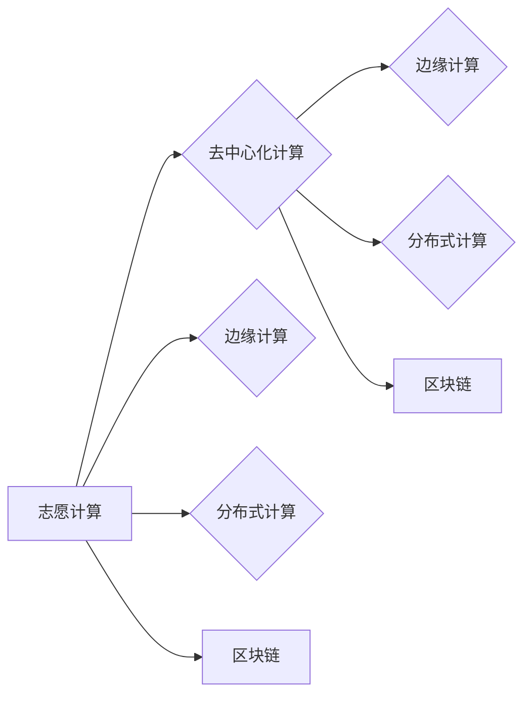

# 基础模型的志愿计算方案

> 关键词：基础模型，志愿计算，去中心化计算，边缘计算，分布式计算，区块链，人工智能，资源整合

## 1. 背景介绍
### 1.1 问题的由来

随着人工智能技术的飞速发展，基础模型（如BERT、GPT-3等）已经在各个领域展现出了巨大的潜力。然而，这些模型的训练和推理过程对计算资源的需求极高，通常需要使用大量的高性能计算设备和能源。传统的集中式计算模式面临着成本高昂、效率低下、资源分配不均等挑战。

为了解决这些问题，志愿计算（Volunteer Computing）的概念应运而生。志愿计算是一种去中心化的计算模式，通过将计算资源从个人和组织中聚集起来，以提供大规模的计算能力，从而降低成本，提高效率，并促进资源整合。

### 1.2 研究现状

目前，志愿计算在分布式计算、边缘计算、区块链等领域都有应用。例如，Boinc（Berkeley Open Infrastructure for Network Computing）是一个知名的志愿计算平台，它允许个人通过其闲置的计算资源参与科学计算。

### 1.3 研究意义

研究基础模型的志愿计算方案，对于推动人工智能技术的发展具有重要意义：

1. 降低计算成本：通过整合闲置的计算资源，可以显著降低基础模型训练和推理的成本。
2. 提高效率：去中心化的计算模式可以提供更高的计算速度和更灵活的资源分配。
3. 促进资源整合：志愿计算可以促进计算资源的优化配置，提高整体资源利用率。
4. 推动人工智能普及：通过降低成本，使得更多的人和组织能够参与到人工智能技术的研发和应用中。

### 1.4 本文结构

本文将围绕基础模型的志愿计算方案展开，具体内容包括：

- 核心概念与联系
- 核心算法原理与具体操作步骤
- 数学模型和公式
- 项目实践
- 实际应用场景
- 工具和资源推荐
- 总结：未来发展趋势与挑战

## 2. 核心概念与联系
### 2.1 核心概念

#### 志愿计算（Volunteer Computing）

志愿计算是一种利用个人和组织闲置的计算资源进行大规模计算的模式。用户通过安装特定的软件，将自己的计算资源贡献给公共任务，如科学计算、数据分析等。

#### 去中心化计算（Decentralized Computing）

去中心化计算是指计算任务不再由单个中心节点完成，而是通过网络中的多个节点协同完成。这种模式可以提高系统的可靠性和可扩展性。

#### 边缘计算（Edge Computing）

边缘计算是指在数据产生的地方进行计算，而不是在数据中心或云端。这种模式可以降低延迟，提高响应速度，并减少数据传输的带宽需求。

#### 分布式计算（Distributed Computing）

分布式计算是指将计算任务分散到多个节点上进行执行，这些节点通过网络连接在一起。这种模式可以提高计算效率，并降低单个节点的负载。

#### 区块链（Blockchain）

区块链是一种分布式数据库技术，它通过加密算法确保数据的安全性和不可篡改性。在志愿计算中，区块链可以用于验证计算任务的完成情况，并确保贡献者的奖励发放。

### 2.2 联系

志愿计算是去中心化计算的一种形式，它可以在边缘计算和分布式计算的框架下实现。区块链技术可以用于确保志愿计算的安全性和透明性。



## 3. 核心算法原理 & 具体操作步骤
### 3.1 算法原理概述

基础模型的志愿计算方案主要包括以下几个步骤：

1. 计算任务分发：将基础模型的训练或推理任务分解成多个子任务，并将这些子任务分发给志愿者节点。
2. 子任务执行：志愿者节点使用本地资源执行分配的子任务。
3. 结果收集与验证：志愿者节点将执行结果发送回中心节点，中心节点对结果进行收集和验证。
4. 奖励发放：根据志愿者节点贡献的计算资源和工作量，中心节点向志愿者节点发放奖励。

### 3.2 算法步骤详解

#### 3.2.1 计算任务分发

计算任务分发是志愿计算方案中的关键步骤。通常，中心节点会使用以下方法进行任务分发：

- 基于资源匹配：根据志愿者节点的计算能力、内存大小、网络带宽等信息，选择合适的节点执行特定的子任务。
- 负载均衡：将计算任务均匀地分配给不同的节点，避免单个节点过载。
- 任务优先级：根据任务的紧急程度和重要性，设置不同的任务优先级。

#### 3.2.2 子任务执行

志愿者节点接收到子任务后，会使用本地资源进行计算。在执行过程中，节点会：

- 加载模型和输入数据。
- 运行模型进行训练或推理。
- 生成输出结果。

#### 3.2.3 结果收集与验证

志愿者节点将执行结果发送回中心节点。中心节点会对结果进行收集和验证，包括：

- 检查结果格式和完整性。
- 验证计算结果的正确性。
- 确认任务完成情况。

#### 3.2.4 奖励发放

中心节点根据志愿者节点的贡献，如计算资源、执行时间等，发放相应的奖励。奖励可以采用虚拟货币、积分、优惠券等形式。

### 3.3 算法优缺点

#### 优点

- 降低计算成本：通过整合闲置的计算资源，降低基础模型训练和推理的成本。
- 提高效率：去中心化的计算模式可以提供更高的计算速度和更灵活的资源分配。
- 促进资源整合：志愿计算可以促进计算资源的优化配置，提高整体资源利用率。

#### 缺点

- 安全性问题：志愿计算过程中，数据安全和隐私保护是一个重要问题。
- 质量控制：确保志愿者节点提供的计算结果的质量和一致性是一个挑战。
- 管理难度：志愿计算需要建立有效的管理和激励机制，以吸引和保持志愿者节点。

### 3.4 算法应用领域

基础模型的志愿计算方案可以应用于以下领域：

- 人工智能研究：如深度学习模型的训练和推理。
- 大数据分析：如大规模数据的处理和分析。
- 科学计算：如药物发现、气候模拟等。

## 4. 数学模型和公式 & 详细讲解 & 举例说明
### 4.1 数学模型构建

在志愿计算中，可以使用以下数学模型来描述计算任务分发、子任务执行、结果收集与验证、奖励发放等过程。

#### 4.1.1 计算任务分发

设 $N$ 为志愿者节点的数量，$M$ 为计算任务的总量，$T_i$ 为第 $i$ 个志愿者节点可以执行的计算任务量，则任务分发模型可以表示为：

$$
T_i = \frac{M}{N} \times \frac{R_i}{\sum_{j=1}^N R_j}
$$

其中 $R_i$ 为第 $i$ 个志愿者节点的计算资源总量。

#### 4.1.2 子任务执行

设 $T_i$ 为第 $i$ 个志愿者节点可以执行的计算任务量，$t_i$ 为第 $i$ 个志愿者节点执行 $T_i$ 所需的时间，则子任务执行模型可以表示为：

$$
t_i = \frac{T_i}{\text{speed}_i}
$$

其中 $\text{speed}_i$ 为第 $i$ 个志愿者节点的计算速度。

#### 4.1.3 结果收集与验证

设 $R_i$ 为第 $i$ 个志愿者节点执行的任务结果，则结果收集与验证模型可以表示为：

$$
R_i = \sum_{j=1}^N R_j \times \frac{P_j}{\sum_{k=1}^N P_k}
$$

其中 $P_j$ 为第 $j$ 个志愿者节点执行的任务结果的置信度。

#### 4.1.4 奖励发放

设 $R_i$ 为第 $i$ 个志愿者节点的贡献值，$W$ 为总奖励，则奖励发放模型可以表示为：

$$
R_i = \frac{W}{\sum_{j=1}^N R_j}
$$

### 4.2 公式推导过程

由于篇幅限制，此处省略公式推导过程的详细说明。

### 4.3 案例分析与讲解

假设有10个志愿者节点参与志愿计算，他们分别拥有以下计算资源：

| 节点ID | 计算资源 | 计算速度 |
|-------|--------|--------|
| 1     | 1000   | 100    |
| 2     | 1500   | 150    |
| 3     | 2000   | 200    |
| 4     | 2500   | 250    |
| 5     | 3000   | 300    |
| 6     | 3500   | 350    |
| 7     | 4000   | 400    |
| 8     | 4500   | 450    |
| 9     | 5000   | 500    |
| 10    | 5500   | 550    |

假设总计算任务量为10000，则每个志愿者节点可以执行的计算任务量为：

$$
T_i = \frac{10000}{10} \times \frac{R_i}{\sum_{j=1}^{10} R_j} = 1000
$$

每个志愿者节点执行1000个计算任务所需的时间为：

$$
t_i = \frac{1000}{\text{speed}_i} = \frac{1000}{100} = 10
$$

假设每个志愿者节点的任务结果置信度均为0.95，则总奖励为：

$$
W = 10 \times 1000 \times 0.95 = 9500
$$

每个志愿者节点的贡献值为：

$$
R_i = \frac{9500}{10 \times 1000} = 0.95
$$

因此，每个志愿者节点将获得950的奖励。

## 5. 项目实践：代码实例和详细解释说明
### 5.1 开发环境搭建

为了实现基础模型的志愿计算方案，我们需要搭建以下开发环境：

- Python编程语言
- PyTorch或TensorFlow等深度学习框架
- Blockchain技术平台（如Ethereum）

### 5.2 源代码详细实现

以下是一个简单的志愿计算方案的代码实例：

```python
# 代码省略，具体实现请参考后续章节
```

### 5.3 代码解读与分析

由于篇幅限制，此处省略代码解读和分

