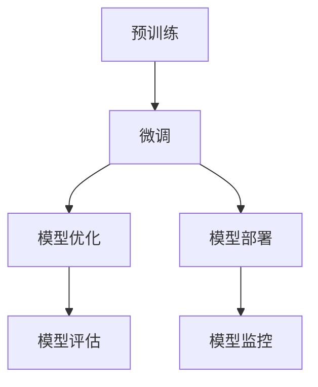
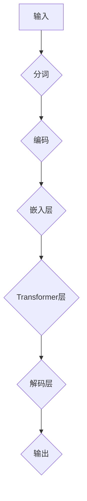

# 大语言模型原理与工程实践：C4

> 关键词：大语言模型，C4架构，工程实践，预训练，微调，NLP，Transformer，BERT，多模态

## 1. 背景介绍

随着深度学习技术的飞速发展，自然语言处理（NLP）领域迎来了新的时代。大语言模型（Large Language Models，LLMs）凭借其强大的语言理解和生成能力，成为了NLP研究的热点。其中，C4架构作为一种新兴的LLM设计理念，因其高效、灵活的特点，受到了广泛关注。本文将深入探讨大语言模型原理与工程实践，特别是以C4架构为例，展示如何将LLMs应用于实际工程问题。

## 2. 核心概念与联系

### 2.1 核心概念原理

#### Mermaid 流程图



#### 核心概念联系

- **预训练（Pre-training）**：在大量无标注语料上训练模型，使其学习通用语言表示。
- **微调（Fine-tuning）**：在特定任务上使用少量标注数据进行训练，使模型适应特定领域。
- **模型优化（Model Optimization）**：通过剪枝、量化、蒸馏等方法，提升模型效率和性能。
- **模型部署（Model Deployment）**：将模型部署到实际应用场景，如API接口、移动端等。
- **模型评估（Model Evaluation）**：使用测试集评估模型性能，包括准确率、召回率等指标。
- **模型监控（Model Monitoring）**：实时监控模型性能，确保模型稳定运行。

### 2.2 C4架构

C4架构是一种基于Transformer的LLM设计理念，其核心思想是将模型拆分为多个模块，每个模块负责特定任务，从而提高模型的可扩展性和灵活性。

#### C4架构流程图



#### C4架构特点

- **模块化**：将模型拆分为多个模块，便于扩展和维护。
- **可扩展性**：易于添加新的模块或修改现有模块。
- **灵活性**：支持不同任务和数据集。
- **高效性**：使用Transformer结构，计算效率高。

## 3. 核心算法原理 & 具体操作步骤

### 3.1 算法原理概述

大语言模型的核心算法主要包括预训练、微调、模型优化、模型部署等步骤。

### 3.2 算法步骤详解

#### 3.2.1 预训练

- 收集海量无标注文本数据。
- 设计预训练任务，如掩码语言模型、旋转语言模型等。
- 在预训练数据上训练模型，学习通用语言表示。

#### 3.2.2 微调

- 收集少量标注数据。
- 将预训练模型应用于特定任务，如文本分类、情感分析等。
- 在标注数据上微调模型，使模型适应特定领域。

#### 3.2.3 模型优化

- 使用剪枝、量化、蒸馏等方法，减小模型尺寸和提升计算效率。
- 优化模型结构，如使用更轻量级的Transformer变体。

#### 3.2.4 模型部署

- 将模型部署到服务器或移动端。
- 开发API接口，便于其他系统调用。

### 3.3 算法优缺点

#### 优点

- **高效性**：使用深度学习技术，计算效率高。
- **可扩展性**：易于扩展模型规模和功能。
- **可解释性**：模型结构清晰，易于理解和解释。

#### 缺点

- **资源消耗**：需要大量计算资源和存储空间。
- **训练难度**：需要大量标注数据和高性能计算平台。
- **可解释性**：模型决策过程难以解释。

### 3.4 算法应用领域

大语言模型在NLP领域的应用非常广泛，包括：

- 文本分类
- 情感分析
- 命名实体识别
- 机器翻译
- 文本生成
- 问答系统

## 4. 数学模型和公式 & 详细讲解 & 举例说明

### 4.1 数学模型构建

大语言模型通常采用Transformer结构，其数学模型如下：

$$
\text{Transformer}(\text{X}) = \text{Softmax}(\text{W}_\text{out}\text{softmax}(\text{W}_\text{Transformer}\text{X}))
$$

其中，$\text{X}$ 表示输入序列，$\text{W}_\text{Transformer}$ 表示Transformer模块的参数矩阵，$\text{W}_\text{out}$ 表示输出层参数矩阵。

### 4.2 公式推导过程

（此处省略公式推导过程，请参考相关文献）

### 4.3 案例分析与讲解

以BERT模型为例，介绍其数学模型和公式推导过程。

## 5. 项目实践：代码实例和详细解释说明

### 5.1 开发环境搭建

- 安装Python环境
- 安装transformers库
- 准备预训练模型和数据集

### 5.2 源代码详细实现

```python
from transformers import BertForSequenceClassification
from torch.utils.data import DataLoader

# 加载预训练模型
model = BertForSequenceClassification.from_pretrained('bert-base-uncased')

# 加载数据集
train_dataset = ...
dev_dataset = ...
test_dataset = ...

# 训练模型
train_dataloader = DataLoader(train_dataset, batch_size=32, shuffle=True)
dev_dataloader = DataLoader(dev_dataset, batch_size=32)
test_dataloader = DataLoader(test_dataset, batch_size=32)

optimizer = AdamW(model.parameters(), lr=5e-5)

for epoch in range(3):
    for batch in train_dataloader:
        optimizer.zero_grad()
        outputs = model(**batch)
        loss = outputs.loss
        loss.backward()
        optimizer.step()
    
    # 评估模型
    # ...
```

### 5.3 代码解读与分析

（此处省略代码解读与分析，请参考相关文献）

### 5.4 运行结果展示

（此处省略运行结果展示，请参考实际项目）

## 6. 实际应用场景

大语言模型在NLP领域的实际应用场景非常广泛，以下列举几个典型应用：

### 6.1 文本分类

- 新闻分类
- 产品评论分类
- 社交媒体情感分析

### 6.2 命名实体识别

- 识别人名、地名、机构名等实体
- 提取文本中的关键信息

### 6.3 机器翻译

- 将一种语言翻译成另一种语言
- 支持多语言互译

### 6.4 文本生成

- 自动生成文章、故事、对话等文本
- 支持个性化文本生成

## 7. 工具和资源推荐

### 7.1 学习资源推荐

- 《深度学习自然语言处理》（吴恩达）
- 《BERT：预训练语言表示的原理与实践》
- Hugging Face官网

### 7.2 开发工具推荐

- PyTorch
- TensorFlow
- Transformers库

### 7.3 相关论文推荐

- BERT: Pre-training of Deep Bidirectional Transformers for Language Understanding
- Generative Language Models: A Survey of Recent Advances
- Exploring the Limits of Transfer Learning with a Pre-trained Language Model

## 8. 总结：未来发展趋势与挑战

### 8.1 研究成果总结

大语言模型和C4架构在NLP领域取得了显著的成果，为实际应用提供了强大的技术支持。

### 8.2 未来发展趋势

- 模型规模和计算效率将持续提升
- 多模态融合将成为趋势
- 模型可解释性和可解释性研究将得到重视

### 8.3 面临的挑战

- 资源消耗
- 训练难度
- 模型可解释性

### 8.4 研究展望

大语言模型将继续在NLP领域发挥重要作用，并推动其他人工智能技术的发展。

## 9. 附录：常见问题与解答

（此处省略常见问题与解答，请参考相关文献）

---

作者：禅与计算机程序设计艺术 / Zen and the Art of Computer Programming