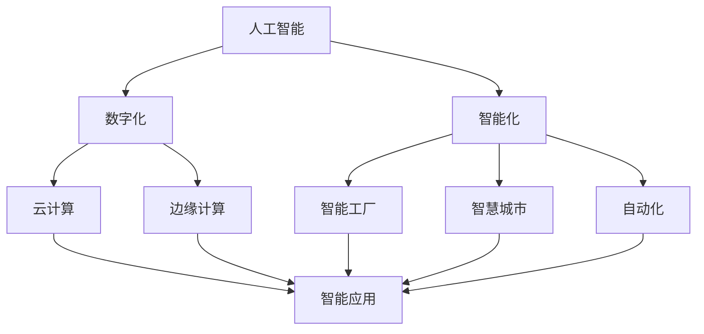
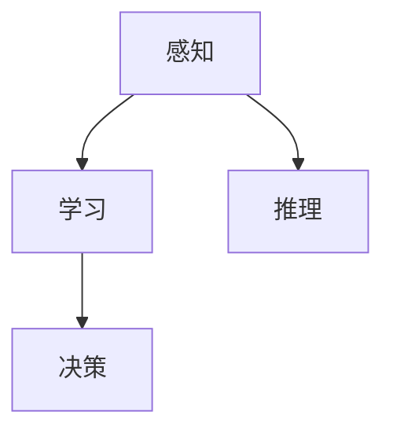
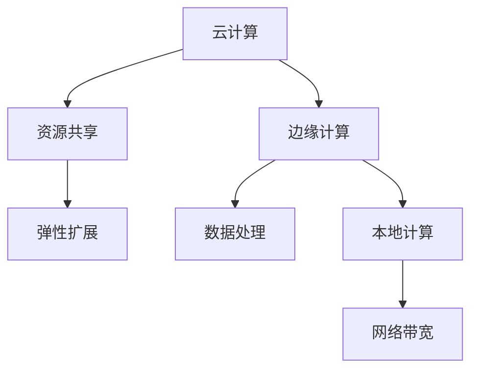
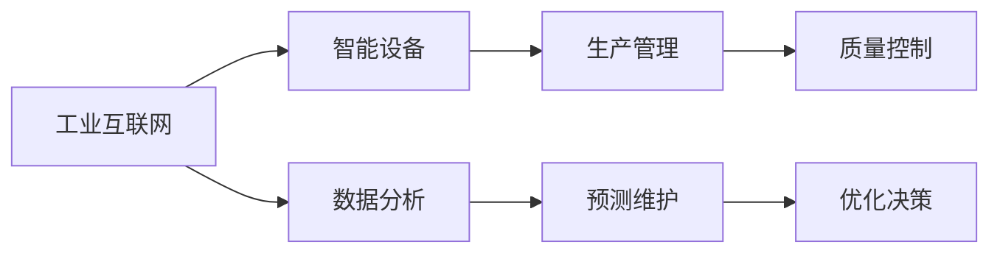
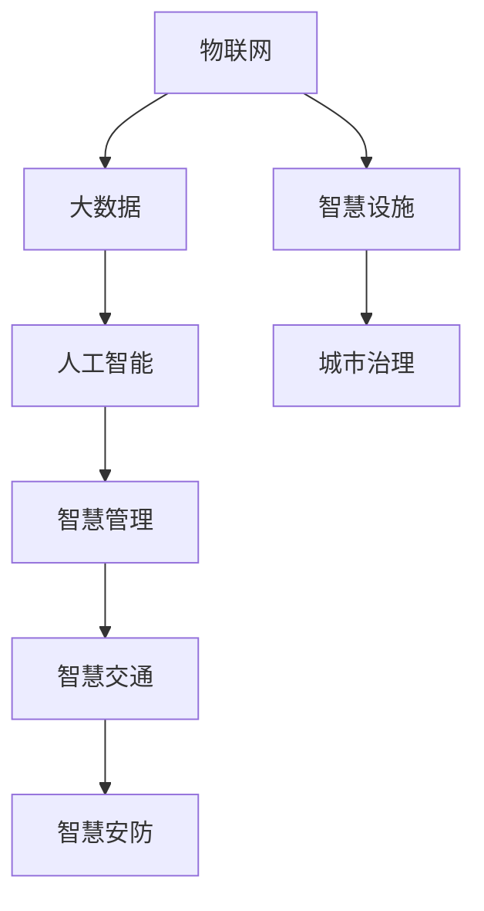

                 

# 智能产业化的发展方向与趋势

> 关键词：
- 人工智能
- 智能产业化
- 数字化转型
- 云计算
- 边缘计算
- 自动化
- 智能化

## 1. 背景介绍

在当今数字化转型的浪潮中，人工智能(AI)技术已成为推动各行各业发展的核心驱动力。从传统制造业到现代服务业，从能源到医疗，AI技术正渗透到每一个角落，开启全新的生产模式和业务流程。本文章旨在深入探讨智能产业化的发展方向与趋势，解析其核心要素，阐述其在各个行业中的应用前景，为未来的技术发展提供参考。

### 1.1 问题由来

智能产业化作为数字经济的重要组成部分，是指将AI技术深度融合于传统产业，实现产业的智能化升级和转型。近年来，随着深度学习、计算机视觉、自然语言处理等技术的突破性进展，智能产业化的发展进入了一个快速轨道，成为各国争夺技术高地的新战场。从制造行业的智能质检、物流行业的无人驾驶、医疗行业的辅助诊断到金融行业的风险管理，AI技术的智能化、自动化、个性化和高效性得到了充分展示。

### 1.2 问题核心关键点

智能产业化的核心关键点在于如何将AI技术与具体的业务场景相结合，实现产业的数字化、智能化升级，从而提升生产效率、降低运营成本、优化用户体验。这包括以下几个方面：

- 产业智能化：通过AI技术对传统产业进行改造，提升生产线的自动化水平和生产效率。
- 数据分析与决策：利用AI进行数据挖掘和分析，优化生产管理，提升决策质量。
- 用户需求匹配：通过AI技术实现用户需求的智能识别和匹配，提升用户体验和满意度。
- 创新与升级：利用AI技术推动产业创新，引入新生产要素，实现产业升级。

## 2. 核心概念与联系

### 2.1 核心概念概述

为更好地理解智能产业化的发展方向与趋势，本节将介绍几个密切相关的核心概念：

- **人工智能**：指通过算法、模型、数据等手段，使计算机系统具备人类智能能力的技术，包括感知、学习、推理、决策等。
- **智能化**：指通过人工智能技术对实体、系统、过程进行智能化改造，提升其功能和性能。
- **数字化**：指通过数字技术（如计算机、网络、数据存储等）对传统产业进行改造，实现数据化、信息化。
- **云计算**：指通过网络将计算资源和数据存储服务按需提供，实现资源的共享和弹性扩展。
- **边缘计算**：指在靠近数据源的地方，通过本地计算和存储，提高数据处理效率和网络带宽利用率。
- **自动化**：指通过软件和硬件的结合，实现业务流程的自动化、智能化，减少人工干预。
- **智能工厂**：指通过智能技术对生产过程进行优化和监控，实现智能化生产。
- **智慧城市**：指利用AI技术对城市运行进行智能化管理，提升城市治理水平和居民生活质量。

这些核心概念之间存在着紧密的联系，形成了智能产业化的生态系统。我们将通过一个简化的Mermaid流程图来展示这些概念之间的逻辑关系：



### 2.2 概念间的关系

这些核心概念之间存在着紧密的联系，形成了智能产业化的完整生态系统。下面我们通过几个Mermaid流程图来展示这些概念之间的关系。

#### 2.2.1 人工智能的核心要素



感知、学习、推理和决策是人工智能的核心要素，这些能力共同构成了AI技术的强大基础。

#### 2.2.2 数字化与智能化的关系


数字化是智能化的前提，通过数据化、信息化，为AI技术的落地应用提供了数据和计算基础，从而实现智能化改造。

#### 2.2.3 云计算与边缘计算的关系



云计算提供了资源共享和弹性扩展的能力，而边缘计算通过本地计算和存储提高了数据处理效率和网络带宽利用率，两者相辅相成，共同支撑智能应用的运行。

#### 2.2.4 智能工厂的架构



智能工厂通过工业互联网和智能设备的结合，实现了生产管理的智能化、质量控制的实时化、预测维护的准确化和优化决策的科学化。

#### 2.2.5 智慧城市的架构



智慧城市通过物联网和大数据，采集和管理城市各类资源和设施，结合人工智能技术进行智慧管理和优化，实现交通、安防、治理等方面的智能化升级。

### 2.3 核心概念的整体架构

最后，我们用一个综合的流程图来展示这些核心概念在大规模智能化改造中的整体架构：

```mermaid
graph TB
    A[大规模数字化转型] --> B[云计算]
    A --> C[边缘计算]
    B --> D[智能应用]
    C --> D
    D --> E[智能工厂]
    D --> F[智慧城市]
    D --> G[企业自动化]
    D --> H[政府决策]
    D --> I[医疗健康]
    D --> J[金融服务]
    D --> K[零售电商]
    D --> L[教育培训]
    D --> M[物流仓储]
    D --> N[农业生产]
    D --> O[能源环保]
    D --> P[娱乐文化]
    E --> Q[制造行业]
    F --> R[城市治理]
    G --> S[企业运营]
    H --> T[政府管理]
    I --> U[医疗服务]
    J --> V[金融科技]
    K --> W[电商零售]
    L --> X[教育学习]
    M --> Y[物流服务]
    N --> Z[农业管理]
    O --> $[能源应用]
    P --> [娱乐内容]
```

这个综合流程图展示了从数字化转型到具体应用的全流程。在数字化转型的大背景下，各行业的智能化改造通过云和边计算技术，依托智能应用，实现了智能化生产的智能工厂、智慧城市、自动化企业、智能化政府等各个领域的全面覆盖。

## 3. 核心算法原理 & 具体操作步骤
### 3.1 算法原理概述

智能产业化的核心算法原理主要包括以下几个方面：

- **数据采集与处理**：通过传感器、摄像头、RFID等设备采集数据，并进行清洗、预处理和特征提取。
- **模型训练与优化**：使用深度学习、强化学习等算法，在大量标注数据上训练模型，并通过交叉验证等方法优化模型性能。
- **算法融合与集成**：将多种算法进行融合，提升智能系统的综合能力，如融合感知、学习、推理、决策等多种智能能力。
- **实时计算与推理**：利用云和边计算技术，实现实时计算和推理，提升智能系统的响应速度和处理能力。

### 3.2 算法步骤详解

智能产业化的算法步骤可以分为以下几个关键环节：

1. **数据采集**：
   - 使用传感器、摄像头、RFID等设备采集各类数据，包括温度、湿度、压力、位置、图像等。
   - 数据存储和清洗，去除噪声和异常值，确保数据质量。

2. **特征提取**：
   - 利用特征提取算法，将原始数据转换为特征向量，用于后续模型训练。
   - 特征选择和降维，提取最相关和最具代表性的特征。

3. **模型训练**：
   - 选择适合的深度学习模型，如卷积神经网络、循环神经网络、变换器等，进行模型训练。
   - 使用大量的标注数据进行模型训练，优化模型参数，提升模型性能。

4. **模型评估与调优**：
   - 使用交叉验证等方法，对模型进行评估，确保其泛化性能。
   - 根据评估结果，对模型进行调优，提升模型精度和鲁棒性。

5. **实时计算与推理**：
   - 利用云计算和边缘计算技术，实现实时数据处理和推理。
   - 设计高效的算法和数据流，提升智能系统的响应速度和处理能力。

### 3.3 算法优缺点

智能产业化的算法具有以下优点：

- **高效性**：通过自动化和智能化的算法，提升了生产效率和决策速度。
- **准确性**：深度学习和AI技术的应用，提高了数据的处理和分析精度，优化了生产管理。
- **可扩展性**：通过云和边计算，实现了资源的弹性扩展和分布式计算，提升了系统的可扩展性。

同时，智能产业化的算法也存在以下缺点：

- **复杂性**：算法设计和模型训练需要大量的技术积累和经验，实施难度较大。
- **数据依赖**：算法效果依赖于数据的规模和质量，获取和处理高质量的数据需要较高的成本。
- **鲁棒性**：在复杂多变的环境下，算法的鲁棒性需要进一步提升。

### 3.4 算法应用领域

智能产业化的算法在以下几个领域得到了广泛应用：

- **制造业**：智能质检、自动化生产、供应链优化、预测维护等。
- **物流行业**：无人驾驶、自动化仓储、物流路径优化、动态调度和配送等。
- **医疗健康**：辅助诊断、个性化治疗、健康管理、智能医疗设备等。
- **金融服务**：风险管理、智能投顾、客户分析、欺诈检测等。
- **零售电商**：智能推荐、库存管理、客户服务、营销分析等。
- **教育培训**：智能辅导、个性化学习、智能评估、在线教育等。
- **城市治理**：智慧交通、智能安防、公共服务、城市管理等。
- **能源环保**：智能电网、能效管理、环境监测、智能制造等。
- **农业生产**：智能农业、精准农业、智慧农业、农场管理等。

## 4. 数学模型和公式 & 详细讲解  
### 4.1 数学模型构建

在智能产业化的算法中，常见的数学模型包括但不限于以下几种：

- **线性回归模型**：用于预测和分析线性关系。
- **逻辑回归模型**：用于分类任务，判断数据属于某一类别。
- **决策树模型**：用于分类和回归，通过树形结构进行决策。
- **随机森林模型**：用于提升决策树的泛化性能和鲁棒性。
- **卷积神经网络(CNN)**：用于图像处理和识别。
- **循环神经网络(RNN)**：用于序列数据处理，如文本、语音等。
- **变换器(Transformer)**：用于序列数据处理，具有自注意力机制，广泛应用于自然语言处理任务。

### 4.2 公式推导过程

以下以卷积神经网络(CNN)为例，推导其基本公式。

设输入数据为 $x=(x_1, x_2, \cdots, x_n)$，卷积核为 $w=(w_1, w_2, \cdots, w_m)$，卷积层输出为 $y=(y_1, y_2, \cdots, y_l)$。

卷积操作定义为：

$$y_i = \sum_{j=1}^{m} w_j \cdot x_{i+j-1}$$

其中，$x_{i+j-1}$ 表示输入数据的当前位置和卷积核位置进行卷积操作的结果。

### 4.3 案例分析与讲解

以智能工厂为例，分析其智能化的关键算法。

智能工厂的核心算法包括：

1. **智能设备监控**：通过传感器采集设备状态数据，使用数据挖掘算法，识别设备异常和故障。
2. **生产过程优化**：利用预测模型，预测生产过程中可能出现的问题，提前进行预防和调整。
3. **质量控制**：使用计算机视觉算法，检测产品质量，提高生产效率和产品合格率。
4. **供应链管理**：通过数据分析，优化供应链流程，降低库存成本，提升物流效率。

## 5. 项目实践：代码实例和详细解释说明
### 5.1 开发环境搭建

在进行智能产业化项目开发前，需要先搭建好开发环境。以下是一个基本的开发环境搭建步骤：

1. 安装Python和相关库：
```bash
pip install numpy pandas scikit-learn matplotlib tensorflow
```

2. 安装深度学习框架：
```bash
pip install torch pytorch
```

3. 安装图像处理库：
```bash
pip install opencv-python
```

4. 安装其他工具：
```bash
pip install tqdm jupyter notebook ipython
```

完成上述步骤后，即可在开发环境中进行项目实践。

### 5.2 源代码详细实现

以下是一个简单的智能工厂监控系统的代码实现示例，包括数据采集、特征提取、模型训练和实时计算。

```python
import numpy as np
import pandas as pd
import matplotlib.pyplot as plt
import tensorflow as tf
from tensorflow.keras import layers

# 数据采集
def read_data():
    data = pd.read_csv('factory_data.csv')
    return data

# 特征提取
def extract_features(data):
    # 假设特征为温度、湿度、压力
    features = data[['temperature', 'humidity', 'pressure']]
    # 归一化特征
    features = (features - features.mean()) / features.std()
    return features

# 模型训练
def train_model(features, labels):
    model = tf.keras.Sequential([
        layers.Dense(64, activation='relu'),
        layers.Dense(32, activation='relu'),
        layers.Dense(1, activation='sigmoid')
    ])
    model.compile(optimizer=tf.keras.optimizers.Adam(0.001),
                  loss='binary_crossentropy',
                  metrics=['accuracy'])
    model.fit(features, labels, epochs=10, batch_size=32)
    return model

# 实时计算
def predict(features):
    model = train_model(features, labels)
    predictions = model.predict(features)
    return predictions

# 数据采集和处理
data = read_data()
features = extract_features(data)

# 训练模型
model = train_model(features, labels)

# 实时计算和推理
features_real = extract_features_real_time()
predictions = predict(features_real)

# 结果展示
plt.plot(features_real, predictions)
plt.show()
```

### 5.3 代码解读与分析

这段代码实现了从数据采集、特征提取、模型训练到实时计算的完整流程，以下是关键代码的解读：

1. `read_data`函数：从CSV文件中读取原始数据，返回一个Pandas DataFrame对象。
2. `extract_features`函数：对数据进行特征提取和归一化处理，返回特征矩阵。
3. `train_model`函数：定义并训练一个简单的神经网络模型，包括三个全连接层。
4. `predict`函数：使用训练好的模型进行实时预测，返回预测结果。
5. 数据采集和处理：读取原始数据，提取并归一化特征。
6. 模型训练：使用特征和标签训练模型，得到训练好的模型。
7. 实时计算和推理：从实时传感器数据中提取特征，并使用训练好的模型进行预测。
8. 结果展示：将实时预测结果可视化，展示模型性能。

## 6. 实际应用场景
### 6.1 智能工厂

智能工厂通过智能化的生产设备和流程，实现了生产线的自动化和智能化升级。其核心应用场景包括：

1. **智能设备监控**：通过传感器监控设备状态，及时发现故障并进行维护，提升设备运行效率。
2. **生产过程优化**：利用预测模型，优化生产流程，提高生产效率和产品质量。
3. **质量控制**：使用计算机视觉算法，检测产品质量，减少废品率。
4. **供应链管理**：通过数据分析，优化供应链流程，降低库存成本，提升物流效率。

### 6.2 智慧城市

智慧城市通过智能化的城市管理和公共服务，提升了城市的治理水平和居民生活质量。其核心应用场景包括：

1. **智能交通管理**：通过智能信号灯和传感器，优化交通流量，减少交通拥堵。
2. **智能安防监控**：使用摄像头和传感器，实时监控城市安全，提升公共安全。
3. **公共服务智能化**：利用智能设备，提供智能化的公共服务，如智能垃圾分类、智能停车等。
4. **城市管理智能化**：通过数据分析，优化城市管理决策，提升城市治理效率。

### 6.3 零售电商

零售电商通过智能化的推荐和库存管理，提升了用户体验和销售效率。其核心应用场景包括：

1. **智能推荐系统**：利用用户行为数据，推荐个性化商品，提高销售额。
2. **库存管理优化**：通过数据分析，优化库存管理，减少库存成本。
3. **客户服务智能化**：使用智能客服系统，提供24小时在线服务，提升客户满意度。
4. **营销分析**：利用数据分析，优化营销策略，提高营销效果。

### 6.4 未来应用展望

未来，智能产业化将继续拓展其应用领域，实现更广泛的产业智能化升级。以下是一些未来应用展望：

1. **智能制造**：通过智能设备和自动化流程，实现制造业的全面智能化升级。
2. **智能医疗**：利用AI技术，优化医疗服务和健康管理，提升医疗质量。
3. **智能农业**：通过智能设备和数据分析，实现农业生产的精准化、智能化。
4. **智能金融**：通过智能分析和决策支持，提升金融风险管理和客户服务水平。
5. **智能交通**：通过智能设备和数据分析，优化交通管理，提升交通安全和效率。
6. **智能教育**：利用AI技术，实现个性化教育和智能辅导，提升教育质量。

## 7. 工具和资源推荐
### 7.1 学习资源推荐

为帮助开发者系统掌握智能产业化的核心技术，以下是一些推荐的学习资源：

1. **《深度学习》（周志华著）**：全面介绍了深度学习的基本原理和应用。
2. **《TensorFlow实战指南》（李沐著）**：介绍了TensorFlow框架的使用方法和应用实例。
3. **《Python深度学习》（Francois Chollet著）**：介绍了TensorFlow和Keras框架的使用方法，并包含丰富的案例分析。
4. **《动手学深度学习》（李沐等著）**：提供深度学习课程和代码实践，适合动手学习。
5. **《机器学习实战》（Peter Harrington著）**：通过案例分析，介绍了机器学习的基本原理和实践方法。
6. **Kaggle平台**：提供大量数据集和竞赛，适合实践和探索。

### 7.2 开发工具推荐

以下是一些推荐的智能产业化开发工具：

1. **TensorFlow**：谷歌开源的深度学习框架，支持分布式计算和模型优化。
2. **Keras**：基于TensorFlow的高级API，简化了深度学习模型的开发。
3. **PyTorch**：Facebook开源的深度学习框架，支持动态计算图和模型训练。
4. **Jupyter Notebook**：开源的交互式笔记本，支持代码编写和数据分析。
5. **TensorBoard**：谷歌开源的可视化工具，用于监控和调试模型训练过程。
6. **Pycharm**：JetBrains开发的IDE，支持深度学习开发和调试。

### 7.3 相关论文推荐

以下是一些推荐的智能产业化相关论文：

1. **《深度学习》（周志华著）**：全面介绍了深度学习的基本原理和应用。
2. **《深度学习与Python》（李沐著）**：介绍了深度学习的基本原理和Python实现。
3. **《智能制造》（霍涛等著）**：介绍了智能制造的基本原理和应用。
4. **《智慧城市》（张宏驰等著）**：介绍了智慧城市的基本原理和应用。
5. **《人工智能与工业4.0》（张志勇等著）**：介绍了人工智能与工业4.0的融合应用。

## 8. 总结：未来发展趋势与挑战
### 8.1 研究成果总结

智能产业化的研究成果主要集中在以下几个方面：

1. **深度学习模型**：通过深度学习模型对数据进行建模和分析，提升了模型的预测和决策能力。
2. **云计算和大数据**：通过云计算和大数据技术，实现了资源的弹性扩展和数据的实时处理。
3. **边缘计算**：通过边缘计算，提高了数据处理的实时性和效率。
4. **智能算法**：通过融合感知、学习、推理、决策等算法，提升了智能系统的综合能力。
5. **应用场景**：智能工厂、智慧城市、零售电商、智能医疗等领域的智能化应用取得了显著效果。

### 8.2 未来发展趋势

未来，智能产业化的发展趋势将体现在以下几个方面：

1. **技术融合**：深度学习、大数据、云计算、边缘计算等技术将进一步融合，提升智能系统的性能和应用范围。
2. **数据驱动**：智能系统的决策将更加依赖数据驱动，实现从经验驱动到数据驱动的转变。
3. **场景深化**：智能系统将在更多垂直行业得到应用，实现更深入的场景深化。
4. **个性化服务**：智能系统将提供更加个性化、精准的服务，提升用户体验。
5. **安全性**：智能系统的安全性将得到更多重视，防止数据泄露和系统漏洞。
6. **普及性**：智能系统的应用将更加普及，实现更广泛的智能化改造。

### 8.3 面临的挑战

智能产业化在发展过程中面临以下挑战：

1. **技术复杂性**：深度学习和大数据技术的复杂性，增加了智能系统的实施难度。
2. **数据质量**：数据质量直接影响模型的性能，获取和处理高质量的数据需要较高的成本。
3. **系统鲁棒性**：在复杂多变的环境下，智能系统的鲁棒性需要进一步提升。
4. **模型可解释性**：智能系统的决策过程需要更高的可解释性，确保其透明和可信。
5. **安全性**：智能系统的安全性需要进一步保障，防止数据泄露和系统漏洞。

### 8.4 研究展望

未来的智能产业化研究需要关注以下几个方面：

1. **数据质量提升**：提高数据获取和处理效率，提升数据质量。
2. **模型优化**：提升模型的预测和决策能力，优化模型性能。
3. **系统鲁棒性**：提升智能系统的鲁棒性和稳定性，适应复杂多变的环境。
4. **可解释性**：提高智能系统的可解释性，增强系统的透明和可信度。
5. **安全性**：增强智能系统的安全性，防止数据泄露和系统漏洞。

总之，智能产业化将以其广阔的应用前景和巨大的社会价值，推动各行各业的智能化升级和转型。面对未来的发展趋势和挑战，我们需要不断探索和创新，共同推动智能产业化迈向更高的台阶。

## 9. 附录：常见问题与解答

**Q1：智能产业化能否完全取代人类工作？**

A: 智能产业化不会完全取代人类工作，而是通过自动化和智能化的方式，提升工作效率和生产力。一些重复性、危险性高的工作，可以通过智能化替代，但高层次、创新性强的任务仍需人类完成。

**Q2：智能产业化对就业市场有什么影响？**

A: 智能产业化将带来就业市场的巨大变化，一些低技能、重复性的工作将被智能化替代，但同时也会创造大量高技能、高创新性的就业机会。政府和企业需要制定相应的政策和培训计划，帮助劳动力适应新的就业环境。

**Q3：智能产业化对社会伦理有哪些影响？**

A: 智能产业化对社会伦理的影响主要体现在数据隐私、算法偏见、决策透明度等方面。需要建立健全的法律法规和技术标准，确保数据隐私和安全，防止算法偏见，增强系统的透明度和可解释性。

**Q4：智能产业化对经济有什么影响？**

A: 智能产业化将推动经济的转型升级，提升产业的智能化水平，提高生产效率和经济效益。但同时也可能带来一定的经济风险，如自动化失业、收入不平等等问题，需要政府和企业共同努力，平衡各方利益。

**Q5：智能产业化如何实现智能化升级？**

A: 智能产业化实现智能化升级需要从以下几个方面入手：

1. **数据采集与处理**：通过传感器、摄像头等设备，采集高质量的数据。
2. **模型训练与优化**：利用深度学习等算法，在大量标注数据上训练模型，并进行模型优化。
3. **算法融合与集成**：将多种算法进行融合，提升系统的综合能力。
4. **实时计算与推理**：利用云计算和边缘计算技术，实现实时计算和推理。
5. **应用场景深化**：将智能系统应用于更多垂直行业，实现深度智能化改造。

总之，智能产业化通过技术创新和应用深化，推动各行各业的智能化升级和转型，带来巨大的经济和社会价值。面对未来的发展趋势和挑战，我们需要不断探索和创新，共同推动智能产业化迈向更高的台阶。

