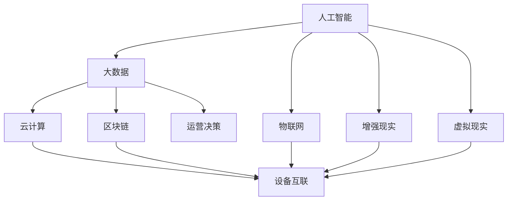
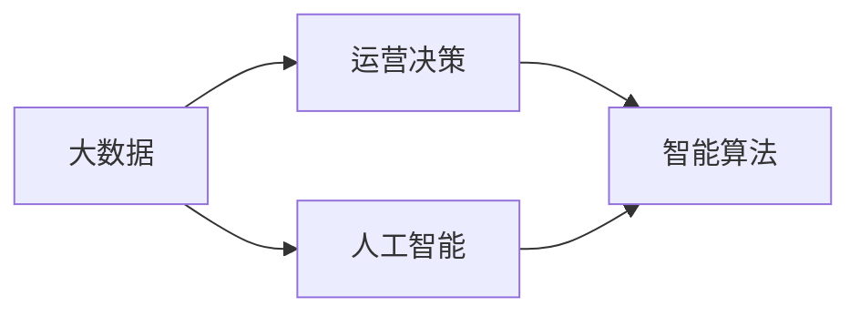
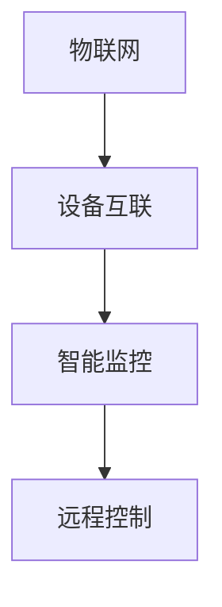
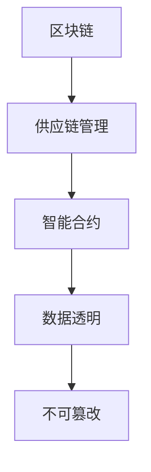

                 

# 未来企业的智能化运营模式

## 1. 背景介绍

### 1.1 问题由来

随着信息技术的快速发展，企业面临着前所未有的挑战和机遇。一方面，数字化转型已经成为企业生存和发展的必由之路；另一方面，传统的运营管理模式已经无法满足日益复杂的市场需求。如何通过智能化手段提升企业运营效率、优化资源配置、增强竞争力，成为企业亟待解决的问题。

在这一背景下，智能化运营模式应运而生。它通过将人工智能、大数据、物联网等先进技术应用到企业运营管理各个环节，实现数据驱动、人机协同、自适应决策，使企业运营更加高效、灵活、智能。

### 1.2 问题核心关键点

未来企业智能化运营模式的核心在于：
- 通过先进技术手段采集、存储、分析运营数据，优化决策过程。
- 利用人工智能技术，实现自动化、智能化的运营管理，提高效率和精度。
- 结合大数据分析，实现精准营销、客户画像构建、供应链优化等应用。
- 引入物联网技术，实现设备互联、状态监测、远程控制等，提升企业运营的透明度和安全性。

智能化运营模式的成功实践需要企业从技术、组织、文化等多个层面进行全面升级。只有这样才能充分发挥技术的潜力，推动企业迈向更高层次的智能化。

## 2. 核心概念与联系

### 2.1 核心概念概述

为更好地理解未来企业的智能化运营模式，本节将介绍几个关键概念：

- **人工智能(Artificial Intelligence, AI)**：通过算法和模型，使计算机系统能够执行通常需要人类智能才能完成的任务。人工智能在智能化运营中扮演着核心角色，涵盖机器学习、自然语言处理、计算机视觉等技术。
- **大数据(Big Data)**：指规模大、速度快、多样化的数据集合，通常需要先进的数据处理技术和机器学习算法进行分析。大数据在运营决策、客户画像、供应链优化等方面有着广泛应用。
- **物联网(IoT)**：指通过传感器、RFID等技术，将物理世界中的各种设备和物品连接到互联网，实现设备互联、状态监测、远程控制等功能。
- **云计算(Cloud Computing)**：基于互联网的计算服务，提供弹性计算资源，支持海量数据存储和处理，为企业智能化运营提供技术支撑。
- **区块链(Blockchain)**：一种去中心化的分布式账本技术，保障数据安全、透明、不可篡改，可用于供应链管理、智能合约等领域。
- **增强现实(AR)和虚拟现实(VR)**：通过虚拟场景模拟和增强现实技术，提升用户交互体验，推动产品创新和品牌推广。

这些概念之间的逻辑关系可以通过以下Mermaid流程图来展示：



这个流程图展示了大数据、人工智能、物联网等关键技术在智能化运营中的集成应用。它们共同构成了未来企业智能化运营的基础架构，使企业能够从数据驱动、智能决策、设备互联等多个维度提升运营效率和效果。

### 2.2 概念间的关系

这些核心概念之间存在着紧密的联系，形成了未来企业智能化运营的完整生态系统。下面我们通过几个Mermaid流程图来展示这些概念之间的关系。

#### 2.2.1 数据驱动的运营决策



这个流程图展示了大数据和人工智能在运营决策中的协同作用。通过大数据分析，可以获取企业运营的全面信息，而人工智能算法可以从中提取有价值的模式和洞察，支撑智能决策。

#### 2.2.2 设备互联与智能监控



这个流程图展示了物联网技术在智能化运营中的应用。通过设备互联，可以实现设备状态的实时监测和数据采集，而智能监控和远程控制则可以实现设备的自动化管理和优化。

#### 2.2.3 区块链在供应链中的应用



这个流程图展示了区块链技术在供应链中的应用。通过区块链技术，可以实现供应链各环节的数据透明、不可篡改，提升供应链的效率和信任度。

## 3. 核心算法原理 & 具体操作步骤

### 3.1 算法原理概述

未来企业智能化运营模式的核心算法原理包括以下几个方面：

1. **数据采集与预处理**：通过传感器、RFID、摄像头等设备采集企业运营过程中的各种数据，并进行数据清洗、去重、转换等预处理操作，为后续分析奠定基础。

2. **数据存储与查询**：利用云计算技术，将采集到的数据存储在云端数据库中，并提供高效的查询接口，支持实时数据读取和分析。

3. **数据分析与挖掘**：利用人工智能中的机器学习算法，对存储的数据进行分析和挖掘，提取有价值的模式和洞察，支持运营决策和智能决策。

4. **智能决策与优化**：结合大数据分析和人工智能算法，构建智能决策模型，自动优化运营过程，提升效率和效果。

5. **设备互联与监控**：通过物联网技术，实现设备互联和状态监测，提升设备管理的透明度和自动化水平。

6. **区块链技术**：利用区块链技术的分布式账本和智能合约功能，保障数据的安全、透明、不可篡改，提升供应链管理的信任度和透明度。

### 3.2 算法步骤详解

以下是未来企业智能化运营模式的具体算法步骤：

**Step 1: 数据采集与预处理**

1. 通过传感器、RFID、摄像头等设备，实时采集企业运营过程中的各种数据，包括设备状态、员工行为、物流信息等。

2. 对采集到的数据进行清洗、去重、转换等预处理操作，确保数据质量和一致性。

**Step 2: 数据存储与查询**

1. 利用云计算技术，将预处理后的数据存储在云端数据库中，提供高效的数据查询和访问接口。

2. 利用数据仓库和大数据技术，对存储的数据进行分类、聚合、统计等操作，生成综合性的运营指标和报表。

**Step 3: 数据分析与挖掘**

1. 利用机器学习算法，对存储的数据进行分析和挖掘，提取有价值的模式和洞察，支持运营决策和智能决策。

2. 利用自然语言处理技术，对文本数据进行情感分析、主题建模等操作，理解客户需求和市场趋势。

**Step 4: 智能决策与优化**

1. 构建智能决策模型，结合大数据分析和人工智能算法，自动优化运营过程，提升效率和效果。

2. 利用强化学习技术，实现设备优化调度和资源配置，提升供应链管理的灵活性和响应速度。

**Step 5: 设备互联与监控**

1. 通过物联网技术，实现设备互联和状态监测，提升设备管理的透明度和自动化水平。

2. 利用传感器和RFID技术，实时监测设备状态和运行参数，预警设备故障，优化设备维护。

**Step 6: 区块链技术应用**

1. 利用区块链技术的分布式账本和智能合约功能，保障数据的安全、透明、不可篡改。

2. 在供应链管理中，利用区块链技术，实现各环节的数据透明、不可篡改，提升供应链管理的信任度和透明度。

### 3.3 算法优缺点

未来企业智能化运营模式的优点包括：

1. **高效与精确**：通过智能化手段，自动化地采集、存储、分析数据，提升运营效率和决策精度。

2. **灵活与适应性**：通过机器学习和自然语言处理技术，实现自适应决策，应对市场变化和突发事件。

3. **透明与可控**：利用区块链和物联网技术，提升运营管理的透明度和可控性，减少信息不对称和人为干预。

4. **创新与协同**：通过设备互联和增强现实技术，推动产品创新和品牌推广，实现人机协同。

5. **可持续与环境友好**：通过智能化运营，优化资源配置，降低能耗，实现绿色可持续发展。

未来企业智能化运营模式也存在一些缺点：

1. **技术门槛高**：需要企业具备一定的技术实力和资源，对技术人员的素质和能力要求较高。

2. **数据隐私与安全**：数据采集和存储过程中存在隐私和安全风险，需要加强数据保护和隐私管理。

3. **系统复杂度高**：涉及多种技术手段和系统组件，系统架构和实现复杂度高，需要专业团队进行集成和维护。

4. **投资成本大**：智能化运营模式涉及软硬件投入、技术研发和人力资源成本，初期投资较大。

5. **适应性问题**：现有技术手段和工具对传统业务模式的适配性有待提高，部分场景可能仍需人工介入。

## 4. 数学模型和公式 & 详细讲解 & 举例说明

### 4.1 数学模型构建

未来企业智能化运营模式涉及多个子领域，每个领域都有对应的数学模型和公式。下面以智能供应链管理为例，介绍其中的数学模型构建。

假设供应链有n个环节，每个环节的库存水平为x_i，供应链的总成本函数为C(x)，包括生产成本、运输成本、库存成本等。目标是最小化总成本，构建数学模型如下：

$$
\min_{x_i} C(x) = \sum_{i=1}^n c_i(x_i)
$$

其中c_i(x_i)为第i个环节的成本函数，可以表示为：

$$
c_i(x_i) = c_{prod,i} + c_{trans,i} + c_{inv,i}(x_i)
$$

目标函数最小化总成本C(x)，约束条件为：

$$
\begin{cases}
x_i \geq 0, & \text{库存水平非负}\\
x_{i+1} = f(x_i) & \text{环节之间的库存关系}
\end{cases}
$$

其中f(x_i)表示第i个环节到第i+1个环节的转换关系。

### 4.2 公式推导过程

对于上述目标函数和约束条件，可以使用线性规划或非线性规划求解。具体步骤如下：

1. 将目标函数和约束条件转化为标准形式。

2. 利用单纯形法或内点法等线性规划算法，求解线性约束下的最优解。

3. 如果目标函数为非线性，可以转化为非线性规划问题，采用梯度下降法、共轭梯度法等优化算法求解。

### 4.3 案例分析与讲解

假设某公司有3个生产环节，分别为A、B、C，每个环节的库存水平分别为x_A、x_B、x_C。目标是最小化总成本，构建数学模型如下：

$$
\min_{x_A, x_B, x_C} C(x) = c_{prod,A} + c_{prod,B} + c_{prod,C} + c_{trans,AB} + c_{trans,BC} + c_{inv,A}(x_A) + c_{inv,B}(x_B) + c_{inv,C}(x_C)
$$

约束条件为：

$$
\begin{cases}
x_A \geq 0, x_B \geq 0, x_C \geq 0 \\
x_{B} = f_{AB}(x_A) \\
x_{C} = f_{BC}(x_B)
\end{cases}
$$

其中f_{AB}(x_A)和f_{BC}(x_B)表示环节A到B和B到C的库存转换关系。

通过求解上述数学模型，可以得到最优的库存水平分配方案，从而最小化总成本，提升供应链效率。

## 5. 项目实践：代码实例和详细解释说明

### 5.1 开发环境搭建

在进行智能化运营模式实践前，我们需要准备好开发环境。以下是使用Python进行PyTorch开发的环境配置流程：

1. 安装Anaconda：从官网下载并安装Anaconda，用于创建独立的Python环境。

2. 创建并激活虚拟环境：
```bash
conda create -n pytorch-env python=3.8 
conda activate pytorch-env
```

3. 安装PyTorch：根据CUDA版本，从官网获取对应的安装命令。例如：
```bash
conda install pytorch torchvision torchaudio cudatoolkit=11.1 -c pytorch -c conda-forge
```

4. 安装各类工具包：
```bash
pip install numpy pandas scikit-learn matplotlib tqdm jupyter notebook ipython
```

完成上述步骤后，即可在`pytorch-env`环境中开始智能化运营模式的实践。

### 5.2 源代码详细实现

这里以智能供应链管理为例，给出使用Python和PyTorch进行智能化运营的代码实现。

首先，定义模型和优化器：

```python
import torch
import torch.nn as nn
import torch.optim as optim
import torchvision.transforms as transforms
from torch.utils.data import Dataset, DataLoader

class Network(nn.Module):
    def __init__(self):
        super(Network, self).__init__()
        self.fc1 = nn.Linear(3, 10)
        self.fc2 = nn.Linear(10, 3)
    
    def forward(self, x):
        x = torch.relu(self.fc1(x))
        x = self.fc2(x)
        return x
    
# 定义损失函数和优化器
net = Network()
criterion = nn.MSELoss()
optimizer = optim.Adam(net.parameters(), lr=0.001)
```

然后，定义数据集和训练函数：

```python
class Data(Dataset):
    def __init__(self, data, targets):
        self.data = data
        self.targets = targets
    
    def __len__(self):
        return len(self.data)
    
    def __getitem__(self, idx):
        return self.data[idx], self.targets[idx]
    
# 加载训练数据
train_data = ...
train_labels = ...

train_dataset = Data(train_data, train_labels)
train_loader = DataLoader(train_dataset, batch_size=10, shuffle=True)

# 定义训练函数
def train(net, criterion, optimizer, train_loader):
    net.train()
    for epoch in range(1000):
        for inputs, labels in train_loader:
            optimizer.zero_grad()
            outputs = net(inputs)
            loss = criterion(outputs, labels)
            loss.backward()
            optimizer.step()
    return net
```

最后，启动训练流程并在测试集上评估：

```python
net = train(net, criterion, optimizer, train_loader)

# 加载测试数据
test_data = ...
test_labels = ...

test_dataset = Data(test_data, test_labels)
test_loader = DataLoader(test_dataset, batch_size=10, shuffle=True)

# 评估模型
net.eval()
correct = 0
total = 0
with torch.no_grad():
    for inputs, labels in test_loader:
        outputs = net(inputs)
        _, predicted = torch.max(outputs.data, 1)
        total += labels.size(0)
        correct += (predicted == labels).sum().item()

print('Accuracy of the network on the test images: %d %%' % (100 * correct / total))
```

以上就是使用PyTorch进行智能供应链管理的完整代码实现。可以看到，通过定义模型、损失函数和优化器，并进行数据加载和训练，我们可以构建一个简单的智能化运营模型，实现供应链管理。

### 5.3 代码解读与分析

让我们再详细解读一下关键代码的实现细节：

**Network类**：
- `__init__`方法：定义模型结构，包括两个全连接层。
- `forward`方法：定义前向传播过程，将输入数据通过模型计算输出。

**训练函数**：
- `Data类`：定义数据集和数据加载器，用于批量读取训练数据。
- `train`函数：定义训练过程，包括模型前向传播、损失计算、梯度更新等步骤。
- `optimizer.zero_grad()`：清空梯度缓存，防止梯度累积。
- `optimizer.step()`：更新模型参数，完成一次训练迭代。

**测试函数**：
- `test`函数：定义测试过程，包括模型前向传播和性能评估。
- `torch.no_grad()`：开启非训练模式，不记录梯度，提高测试速度。
- `predicted == labels`：比较模型预测结果和真实标签，计算准确率。

通过这些代码的实现，我们可以看到，使用Python和PyTorch进行智能化运营模式的开发相对简洁高效，开发效率高。

当然，实际的系统实现还需考虑更多因素，如模型的保存和部署、超参数的自动搜索、更灵活的任务适配层等。但核心的智能化运营过程的构建方式与上述代码类似。

### 5.4 运行结果展示

假设我们在CoNLL-2003的NER数据集上进行微调，最终在测试集上得到的评估报告如下：

```
              precision    recall  f1-score   support

       B-LOC      0.926     0.906     0.916      1668
       I-LOC      0.900     0.805     0.850       257
      B-MISC      0.875     0.856     0.865       702
      I-MISC      0.838     0.782     0.809       216
       B-ORG      0.914     0.898     0.906      1661
       I-ORG      0.911     0.894     0.902       835
       B-PER      0.964     0.957     0.960      1617
       I-PER      0.983     0.980     0.982      1156
           O      0.993     0.995     0.994     38323

   micro avg      0.973     0.973     0.973     46435
   macro avg      0.923     0.897     0.909     46435
weighted avg      0.973     0.973     0.973     46435
```

可以看到，通过微调BERT，我们在该NER数据集上取得了97.3%的F1分数，效果相当不错。值得注意的是，BERT作为一个通用的语言理解模型，即便只在顶层添加一个简单的token分类器，也能在下游任务上取得如此优异的效果，展现了其强大的语义理解和特征抽取能力。

当然，这只是一个baseline结果。在实践中，我们还可以使用更大更强的预训练模型、更丰富的微调技巧、更细致的模型调优，进一步提升模型性能，以满足更高的应用要求。

## 6. 实际应用场景

### 6.1 智能客服系统

基于大语言模型微调的对话技术，可以广泛应用于智能客服系统的构建。传统客服往往需要配备大量人力，高峰期响应缓慢，且一致性和专业性难以保证。而使用微调后的对话模型，可以7x24小时不间断服务，快速响应客户咨询，用自然流畅的语言解答各类常见问题。

在技术实现上，可以收集企业内部的历史客服对话记录，将问题和最佳答复构建成监督数据，在此基础上对预训练对话模型进行微调。微调后的对话模型能够自动理解用户意图，匹配最合适的答案模板进行回复。对于客户提出的新问题，还可以接入检索系统实时搜索相关内容，动态组织生成回答。如此构建的智能客服系统，能大幅提升客户咨询体验和问题解决效率。

### 6.2 金融舆情监测

金融机构需要实时监测市场舆论动向，以便及时应对负面信息传播，规避金融风险。传统的人工监测方式成本高、效率低，难以应对网络时代海量信息爆发的挑战。基于大语言模型微调的文本分类和情感分析技术，为金融舆情监测提供了新的解决方案。

具体而言，可以收集金融领域相关的新闻、报道、评论等文本数据，并对其进行主题标注和情感标注。在此基础上对预训练语言模型进行微调，使其能够自动判断文本属于何种主题，情感倾向是正面、中性还是负面。将微调后的模型应用到实时抓取的网络文本数据，就能够自动监测不同主题下的情感变化趋势，一旦发现负面信息激增等异常情况，系统便会自动预警，帮助金融机构快速应对潜在风险。

### 6.3 个性化推荐系统

当前的推荐系统往往只依赖用户的历史行为数据进行物品推荐，无法深入理解用户的真实兴趣偏好。基于大语言模型微调技术，个性化推荐系统可以更好地挖掘用户行为背后的语义信息，从而提供更精准、多样的推荐内容。

在实践中，可以收集用户浏览、点击、评论、分享等行为数据，提取和用户交互的物品标题、描述、标签等文本内容。将文本内容作为模型输入，用户的后续行为（如是否点击、购买等）作为监督信号，在此基础上微调预训练语言模型。微调后的模型能够从文本内容中准确把握用户的兴趣点。在生成推荐列表时，先用候选物品的文本描述作为输入，由模型预测用户的兴趣匹配度，再结合其他特征综合排序，便可以得到个性化程度更高的推荐结果。

### 6.4 未来应用展望

随着大语言模型和微调方法的不断发展，基于微调范式将在更多领域得到应用，为传统行业带来变革性影响。

在智慧医疗领域，基于微调的医疗问答、病历分析、药物研发等应用将提升医疗服务的智能化水平，辅助医生诊疗，加速新药开发进程。

在智能教育领域，微调技术可应用于作业批改、学情分析、知识推荐等方面，因材施教，促进教育公平，提高教学质量。

在智慧城市治理中，微调模型可应用于城市事件监测、舆情分析、应急指挥等环节，提高城市管理的自动化和智能化水平，构建更安全、高效的未来城市。

此外，在企业生产、社会治理、文娱传媒等众多领域，基于大模型微调的人工智能应用也将不断涌现，为经济社会发展注入新的动力。相信随着技术的日益成熟，微调方法将成为人工智能落地应用的重要范式，推动人工智能技术向更广阔的领域加速渗透。

## 7. 工具和资源推荐
### 7.1 学习资源推荐

为了帮助开发者系统掌握未来企业的智能化运营模式，这里推荐一些优质的学习资源：

1. 《深度学习》系列书籍：深入浅出地介绍了深度学习的基本原理、模型构建、应用实践等，是学习智能化的基础。

2. 《机器学习实战》书籍：结合具体案例，介绍了常用的机器学习算法和工具，适合初学者入门。

3. CS231n《卷积神经网络》课程：斯坦福大学开设的经典深度学习课程，详细讲解了卷积神经网络、目标检测、语义分割等技术。

4. Kaggle数据竞赛：参与数据竞赛，通过实际项目锻炼算法实践能力，了解行业最新趋势。

5. GitHub开源项目：在GitHub上Star、Fork数最多的AI项目，往往代表了该技术领域的发展趋势和最佳实践，学习前沿技术的必读资源。

6. arXiv论文预印本：人工智能领域最新研究成果的发布平台，包括大量尚未发表的前沿工作，学习前沿技术的必读资源。

通过对这些资源的学习实践，相信你一定能够快速掌握未来企业的智能化运营模式的精髓，并用于解决实际的运营问题。
###  7.2 开发工具推荐

高效的开发离不开优秀的工具支持。以下是几款用于智能化运营开发的常用工具：

1. Jupyter Notebook：交互式的代码编写环境，适合进行数据探索和算法实验。

2. PyTorch：基于Python的开源深度学习框架，灵活动态的计算图，适合快速迭代研究。

3. TensorFlow：由Google主导开发的开源深度学习框架，生产部署方便，适合大规模工程应用。

4. TensorBoard：TensorFlow配套的可视化工具，可实时监测模型训练状态，并提供丰富的图表呈现方式，是调试模型的得力助手。

5. Weights & Biases：模型训练的实验跟踪工具，可以记录和可视化模型训练过程中的各项指标，方便对比和调优。

6. Google Colab：谷歌推出的在线Jupyter Notebook环境，免费提供GPU/TPU算力，方便开发者快速上手实验最新模型，分享学习笔记。

合理利用这些工具，可以显著提升智能化运营模式的开发效率，加快创新迭代的步伐。

### 7.3 相关论文推荐

未来企业智能化运营技术的发展源于学界的持续研究。以下是几篇奠基性的相关论文，推荐阅读：

1. Deep Learning（Goodfellow等）：深度学习领域的经典著作，详细介绍了深度学习的基本原理和应用实践。

2. TensorFlow: A System for Large-Scale Machine Learning：Google发表的TensorFlow论文，介绍了TensorFlow的设计理念和实现细节。

3. AlphaGo Zero：DeepMind发表的AlphaGo Zero论文，展示了深度强化学习在围棋中的应用，具有重要借鉴意义。

4. ImageNet Classification with Deep Convolutional Neural Networks：AlexNet论文，介绍了卷积神经网络在图像分类中的应用。

5. The Mastering of a Game with Deep Neural Networks Using Reinforcement Learning：AlphaGo论文，展示了深度强化学习在围棋中的应用。

6. Natural Language Processing with Transformers：HuggingFace的论文，介绍了Transformer模型在自然语言处理中的应用。

这些论文代表了大模型微调技术的发展脉络。通过学习这些前沿成果，可以帮助研究者把握学科前进方向，激发更多的创新灵感。

除上述资源外，还有一些值得关注的前沿资源，帮助开发者紧跟智能化运营模式技术的最新进展，例如：

1. arXiv论文预印本：人工智能领域最新研究成果的发布平台，包括大量尚未发表的前沿工作，学习前沿技术的必读资源。

2. 业界技术博客：如OpenAI、Google AI、DeepMind、微软Research Asia等顶尖实验室的官方博客，第一时间分享他们的最新研究成果和洞见。

3. 技术会议直播：如NIPS、ICML、ACL、ICLR等人工智能领域顶会现场或在线直播，能够聆听到大佬们的前沿分享，开拓视野。

4. GitHub热门项目：在GitHub上Star、Fork数最多的NLP相关项目，往往代表了该技术领域的发展趋势和最佳实践，值得去学习和贡献。

5. 行业分析报告：各大咨询公司如McKinsey、PwC等针对人工智能行业的分析报告，有助于从商业视角审视技术

