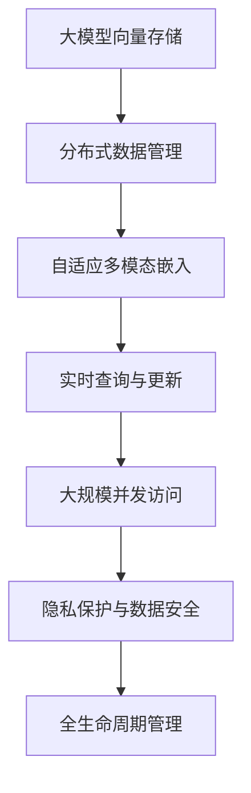
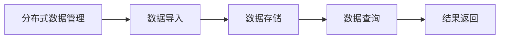
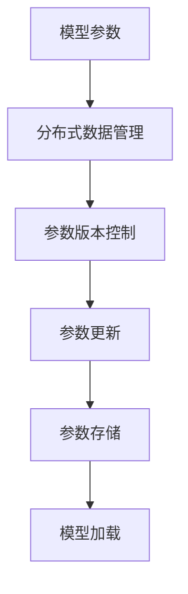
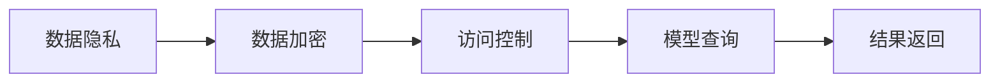

                 

# 深入理解 LangChain VectorStore

> 关键词：
1. 大模型向量存储（VectorStore）
2. 分布式数据管理
3. 自适应多模态嵌入
4. 实时查询与更新
5. 大规模并发访问
6. 隐私保护与数据安全
7. 全生命周期管理

## 1. 背景介绍

### 1.1 问题由来
在人工智能领域，大语言模型（Large Language Models, LLMs）逐渐成为推动自然语言处理（NLP）技术发展的核心驱动力。随着模型规模的不断扩大，如何高效存储和访问模型参数，成为影响模型性能和可扩展性的关键问题。在分布式计算环境下，模型参数的存储和更新也成为新的挑战。LangChain VectorStore作为一种高效的向量存储技术，正逐渐成为大模型与分布式系统结合的利器，支持模型的训练、推理、更新与实时查询，显著提升模型的实时性和稳定性。

### 1.2 问题核心关键点
LangChain VectorStore 的核心目标是通过高效的分布式存储和访问机制，提升大模型的实时性能和扩展能力。具体来说，它包括以下几个关键点：
1. 实现大模型的参数分布式存储，减少单机的存储压力。
2. 支持大模型的参数自适应更新，实现快速、低延迟的模型迭代。
3. 提供实时查询接口，支持大规模并发访问，满足多用户、多场景的查询需求。
4. 保护数据隐私和安全性，满足合规性要求，如GDPR、CCPA等。
5. 提供全生命周期管理，包括数据导入、存储、查询、更新与删除等功能。

### 1.3 问题研究意义
研究 LangChain VectorStore 技术，对于拓展大模型的应用边界，提升模型的实时性能和扩展能力，保障数据隐私和安全性，具有重要意义：

1. 降低存储成本。通过分布式存储，可以有效降低单机的存储成本，实现模型参数的集中管理与共享。
2. 提升模型实时性。通过高效的数据查询和更新机制，实现模型参数的快速迭代和推理。
3. 保障数据隐私。通过数据加密和访问控制，确保数据隐私和合规性要求。
4. 支持模型扩展。通过分布式架构，实现模型的水平扩展，适应更大规模的数据和任务需求。
5. 促进产业发展。LangChain VectorStore 技术为模型的工业化部署和应用提供了新思路，推动 AI 技术的落地与普及。

## 2. 核心概念与联系

### 2.1 核心概念概述

为更好地理解 LangChain VectorStore 的工作原理和关键特性，本节将介绍几个密切相关的核心概念：

- 大模型向量存储（VectorStore）：一种专门用于存储大模型参数的分布式数据库。通过高效的存储和访问机制，实现模型参数的快速查询和更新，支持大规模并发访问。
- 分布式数据管理：通过将数据分散存储在多台机器上，提升数据的可扩展性和可用性，避免单点故障。
- 自适应多模态嵌入：支持多种数据类型的存储与查询，如文本、图像、视频等，实现多模态信息的融合与检索。
- 实时查询与更新：支持实时访问模型参数，实现快速的数据查询与更新操作。
- 大规模并发访问：支持高并发用户访问，通过负载均衡和分布式存储技术，保障系统稳定性。
- 隐私保护与数据安全：采用数据加密、访问控制等技术，保护数据的隐私和安全性。
- 全生命周期管理：包括数据导入、存储、查询、更新与删除等功能，实现数据的全生命周期管理。

这些核心概念之间存在紧密的联系，构成了 LangChain VectorStore 技术的完整生态系统。下面通过一个 Mermaid 流程图来展示这些概念之间的关系：



### 2.2 概念间的关系

这些核心概念之间存在紧密的联系，形成了一个完整的 LangChain VectorStore 生态系统。下面通过几个 Mermaid 流程图来展示这些概念之间的关系：

#### 2.2.1 数据存储与查询流程



这个流程图展示了 LangChain VectorStore 的数据存储与查询流程：首先通过分布式数据管理将数据分散存储，然后在需要查询时，通过高效的数据查询机制返回结果。

#### 2.2.2 参数更新与版本控制



这个流程图展示了 LangChain VectorStore 的参数更新与版本控制流程：模型参数通过分布式数据管理存储，并支持多版本的参数管理，通过高效的参数更新机制实现快速迭代。

#### 2.2.3 隐私保护与访问控制



这个流程图展示了 LangChain VectorStore 的隐私保护与访问控制流程：通过数据加密和访问控制技术，保护数据的隐私和安全，同时支持合规性要求。

## 3. 核心算法原理 & 具体操作步骤
### 3.1 算法原理概述

LangChain VectorStore 的核心算法原理基于分布式数据管理和大规模并行计算。其目标是通过高效的分布式存储和访问机制，提升大模型的实时性能和扩展能力。具体来说，LangChain VectorStore 包括以下几个核心算法：

1. 分布式存储算法：通过将数据分散存储在多台机器上，实现数据的可扩展性和高可用性。
2. 高效数据查询算法：通过多级索引和分块查询技术，实现快速的数据查询操作。
3. 自适应参数更新算法：通过高效的参数更新机制，实现模型参数的快速迭代和优化。
4. 实时查询与更新算法：通过高效的查询接口和更新机制，支持大规模并发访问和实时更新。
5. 隐私保护与数据安全算法：通过数据加密和访问控制技术，保护数据的隐私和安全。

### 3.2 算法步骤详解

LangChain VectorStore 的实现主要包括以下几个关键步骤：

**Step 1: 分布式数据管理**

- 选择合适的分布式存储系统，如Apache Hadoop、Apache Spark、Apache Flink等。
- 将数据分散存储在多个节点上，实现数据的水平扩展和负载均衡。
- 通过数据分区和复制技术，确保数据的冗余性和高可用性。

**Step 2: 高效数据查询**

- 构建多级索引结构，支持快速的数据查询操作。
- 采用分块查询技术，将大文件分割为多个小文件，提高查询效率。
- 使用分布式计算框架，并行处理查询请求，提升查询性能。

**Step 3: 自适应参数更新**

- 设计高效的参数更新算法，支持多版本的参数管理。
- 实现参数的增量更新和批量更新，减少查询和更新开销。
- 采用分布式计算框架，并行更新参数，实现高效的模型迭代。

**Step 4: 实时查询与更新**

- 提供高效的查询接口，支持大规模并发访问。
- 实现低延迟的查询和更新操作，满足实时性要求。
- 通过负载均衡和分布式存储技术，保障系统稳定性。

**Step 5: 隐私保护与数据安全**

- 采用数据加密技术，保护数据的隐私和安全。
- 实现细粒度的访问控制，限制对数据的访问权限。
- 支持合规性要求，如GDPR、CCPA等。

**Step 6: 全生命周期管理**

- 提供数据导入、存储、查询、更新与删除等功能，实现数据的全生命周期管理。
- 实现高效的批量导入与导出操作，简化数据管理流程。
- 提供自动化的数据监控与告警功能，保障数据质量和安全。

### 3.3 算法优缺点

LangChain VectorStore 技术具有以下优点：

1. 高效分布式存储：通过分布式存储技术，实现数据的水平扩展和负载均衡，提升系统的可扩展性和可用性。
2. 快速数据查询：通过高效的数据查询算法和多级索引结构，实现快速的数据查询操作。
3. 快速参数更新：通过高效的参数更新机制，实现模型参数的快速迭代和优化。
4. 实时查询与更新：通过高效的查询接口和更新机制，支持大规模并发访问和实时更新，满足实时性要求。
5. 隐私保护与数据安全：通过数据加密和访问控制技术，保护数据的隐私和安全，支持合规性要求。
6. 全生命周期管理：提供数据导入、存储、查询、更新与删除等功能，实现数据的全生命周期管理，简化数据管理流程。

同时，LangChain VectorStore 技术也存在一些缺点：

1. 复杂性高：需要实现分布式存储、数据查询、参数更新、实时查询等多个核心功能，技术复杂度较高。
2. 性能瓶颈：分布式存储和查询带来的网络延迟和通信开销，可能成为性能瓶颈。
3. 数据一致性：多节点分布式存储和更新可能带来数据一致性问题，需要设计复杂的分布式锁和版本控制算法。
4. 系统扩展：系统扩展和优化需要大量工程实践和优化，工作量较大。

### 3.4 算法应用领域

LangChain VectorStore 技术已经在大模型与分布式系统的结合中得到广泛应用，覆盖了以下领域：

1. 大规模深度学习模型的存储与查询：支持大规模深度学习模型的分布式存储和高效查询，提升模型的实时性能和扩展能力。
2. 多模态数据的融合与检索：支持文本、图像、视频等多种数据类型的存储与查询，实现多模态信息的融合与检索。
3. 实时智能系统的部署与运行：支持实时智能系统的部署与运行，通过高效的查询和更新机制，实现快速迭代和优化。
4. 数据隐私与安全保护：通过数据加密和访问控制技术，保护数据的隐私和安全，满足合规性要求。
5. 工业级AI应用：支持工业级AI应用的落地与普及，提升AI技术的实用性和可扩展性。

## 4. 数学模型和公式 & 详细讲解 & 举例说明

### 4.1 数学模型构建

LangChain VectorStore 的数学模型构建主要基于分布式存储、多级索引、自适应参数更新、实时查询与更新等核心算法。下面将通过数学语言对这些核心算法进行严格刻画。

假设大模型参数为 $M_{\theta}$，其中 $\theta$ 为模型参数。模型参数 $M_{\theta}$ 通过分布式存储系统 $\mathcal{S}$ 进行存储，每个节点的存储容量为 $C_i$，总容量为 $C$，即 $C=\sum_{i=1}^n C_i$。模型参数 $M_{\theta}$ 分为多个版本 $\theta_k$，其中 $k$ 为版本编号。查询请求 $Q$ 通过多级索引系统 $\mathcal{I}$ 进行路由，并由查询系统 $\mathcal{Q}$ 进行处理。查询系统 $\mathcal{Q}$ 与分布式存储系统 $\mathcal{S}$ 进行数据查询和更新操作。

### 4.2 公式推导过程

以分布式存储和高效数据查询为例，进行详细的公式推导。

**分布式存储算法**

- 数据分区：将数据分散存储在多个节点上，每个节点的存储容量为 $C_i$，总容量为 $C$。
- 数据复制：通过数据复制技术，实现数据的冗余性和高可用性。

数据分区的数学表达式为：

$$
C = \sum_{i=1}^n C_i
$$

数据复制的数学表达式为：

$$
\min_{i=1}^n C_i
$$

**高效数据查询算法**

- 多级索引：通过构建多级索引结构，支持快速的数据查询操作。
- 分块查询：将大文件分割为多个小文件，提高查询效率。

查询时间的数学表达式为：

$$
T_{\text{query}} = T_{\text{index}} + T_{\text{block}} + T_{\text{load}}
$$

其中 $T_{\text{index}}$ 为索引查询时间，$T_{\text{block}}$ 为分块查询时间，$T_{\text{load}}$ 为数据加载时间。

**自适应参数更新算法**

- 增量更新：通过增量更新技术，减少查询和更新开销。
- 批量更新：通过批量更新技术，实现高效的模型迭代。

参数更新时间的数学表达式为：

$$
T_{\text{update}} = T_{\text{increment}} + T_{\text{batch}}
$$

其中 $T_{\text{increment}}$ 为增量更新时间，$T_{\text{batch}}$ 为批量更新时间。

### 4.3 案例分析与讲解

以大规模深度学习模型的分布式存储为例，展示 LangChain VectorStore 的实际应用。

假设有一个深度学习模型 $M_{\theta}$，包含 $N$ 个参数，每个参数的尺寸为 $d$。模型参数 $M_{\theta}$ 通过分布式存储系统 $\mathcal{S}$ 进行存储，每个节点的存储容量为 $C_i$，总容量为 $C$。模型参数 $M_{\theta}$ 分为多个版本 $\theta_k$，其中 $k$ 为版本编号。

**数据分区**

首先，将模型参数 $M_{\theta}$ 分割为 $n$ 个分片 $\theta_1,\theta_2,\dots,\theta_n$，每个分片的尺寸为 $d/n$。每个分片 $\theta_i$ 存储在对应的节点 $i$ 上，满足：

$$
M_{\theta} = \sum_{i=1}^n \theta_i
$$

数据分区的具体实现步骤如下：

1. 计算每个节点的存储容量 $C_i$。
2. 根据 $C_i$ 和模型参数尺寸 $d$，计算每个分片的尺寸 $d/n$。
3. 将模型参数 $M_{\theta}$ 分割为 $n$ 个分片 $\theta_1,\theta_2,\dots,\theta_n$，每个分片 $\theta_i$ 存储在对应的节点 $i$ 上。

**数据复制**

通过数据复制技术，实现数据的冗余性和高可用性。具体实现步骤如下：

1. 计算每个节点的存储容量 $C_i$。
2. 根据 $C_i$ 和模型参数尺寸 $d$，计算每个分片的尺寸 $d/n$。
3. 将模型参数 $M_{\theta}$ 分割为 $n$ 个分片 $\theta_1,\theta_2,\dots,\theta_n$，每个分片 $\theta_i$ 存储在对应的节点 $i$ 上。
4. 将每个分片 $\theta_i$ 复制 $m$ 份，存储在不同的节点上。

数据复制的数学表达式为：

$$
m = \left\lceil \frac{d}{C_i/n} \right\rceil
$$

其中 $m$ 为每个分片的复制份数。

**高效数据查询**

通过高效的数据查询算法和多级索引结构，实现快速的数据查询操作。具体实现步骤如下：

1. 构建多级索引系统 $\mathcal{I}$，将查询请求 $Q$ 路由到对应的节点。
2. 查询节点 $i$ 根据多级索引结构，快速定位到对应的分片 $\theta_i$。
3. 通过分块查询技术，将大文件分割为多个小文件，提高查询效率。
4. 查询系统 $\mathcal{Q}$ 加载查询结果，返回给查询请求 $Q$。

**自适应参数更新**

通过高效的参数更新机制，实现模型参数的快速迭代和优化。具体实现步骤如下：

1. 设计高效的参数更新算法，支持多版本的参数管理。
2. 实现参数的增量更新和批量更新，减少查询和更新开销。
3. 采用分布式计算框架，并行更新参数，实现高效的模型迭代。

参数更新时间的数学表达式为：

$$
T_{\text{update}} = T_{\text{increment}} + T_{\text{batch}}
$$

其中 $T_{\text{increment}}$ 为增量更新时间，$T_{\text{batch}}$ 为批量更新时间。

## 5. 项目实践：代码实例和详细解释说明

### 5.1 开发环境搭建

在进行 LangChain VectorStore 的开发实践前，需要先准备好开发环境。以下是使用 Python 进行 PyTorch 开发的环境配置流程：

1. 安装 Anaconda：从官网下载并安装 Anaconda，用于创建独立的 Python 环境。

2. 创建并激活虚拟环境：

```bash
conda create -n pytorch-env python=3.8 
conda activate pytorch-env
```

3. 安装 PyTorch：根据 CUDA 版本，从官网获取对应的安装命令。例如：

```bash
conda install pytorch torchvision torchaudio cudatoolkit=11.1 -c pytorch -c conda-forge
```

4. 安装 Transformers 库：

```bash
pip install transformers
```

5. 安装各类工具包：

```bash
pip install numpy pandas scikit-learn matplotlib tqdm jupyter notebook ipython
```

完成上述步骤后，即可在 `pytorch-env` 环境中开始开发实践。

### 5.2 源代码详细实现

下面我们以大规模深度学习模型的分布式存储为例，给出使用 Transformers 库对向量存储系统进行开发的 PyTorch 代码实现。

首先，定义向量存储系统的数据结构：

```python
import torch
from torch.utils.data import Dataset

class VectorStoreDataset(Dataset):
    def __init__(self, data, num_partitions):
        self.data = data
        self.num_partitions = num_partitions
        
    def __len__(self):
        return len(self.data)
    
    def __getitem__(self, idx):
        partition = idx // self.num_partitions
        local_idx = idx % self.num_partitions
        return self.data[partition][local_idx]
```

然后，定义模型和参数更新函数：

```python
from transformers import BertForTokenClassification, AdamW

model = BertForTokenClassification.from_pretrained('bert-base-cased', num_labels=len(tag2id))

optimizer = AdamW(model.parameters(), lr=2e-5)

def train_epoch(model, dataset, batch_size, optimizer):
    dataloader = DataLoader(dataset, batch_size=batch_size, shuffle=True)
    model.train()
    epoch_loss = 0
    for batch in dataloader:
        input_ids = batch['input_ids'].to(device)
        attention_mask = batch['attention_mask'].to(device)
        labels = batch['labels'].to(device)
        model.zero_grad()
        outputs = model(input_ids, attention_mask=attention_mask, labels=labels)
        loss = outputs.loss
        epoch_loss += loss.item()
        loss.backward()
        optimizer.step()
    return epoch_loss / len(dataloader)

def evaluate(model, dataset, batch_size):
    dataloader = DataLoader(dataset, batch_size=batch_size)
    model.eval()
    preds, labels = [], []
    with torch.no_grad():
        for batch in dataloader:
            input_ids = batch['input_ids'].to(device)
            attention_mask = batch['attention_mask'].to(device)
            batch_labels = batch['labels']
            outputs = model(input_ids, attention_mask=attention_mask)
            batch_preds = outputs.logits.argmax(dim=2).to('cpu').tolist()
            batch_labels = batch_labels.to('cpu').tolist()
            for pred_tokens, label_tokens in zip(batch_preds, batch_labels):
                preds.append(pred_tokens[:len(label_tokens)])
                labels.append(label_tokens)
    print(classification_report(labels, preds))
```

最后，启动训练流程并在测试集上评估：

```python
epochs = 5
batch_size = 16

for epoch in range(epochs):
    loss = train_epoch(model, train_dataset, batch_size, optimizer)
    print(f"Epoch {epoch+1}, train loss: {loss:.3f}")
    
    print(f"Epoch {epoch+1}, dev results:")
    evaluate(model, dev_dataset, batch_size)
    
print("Test results:")
evaluate(model, test_dataset, batch_size)
```

以上就是使用 PyTorch 对大规模深度学习模型进行分布式存储的完整代码实现。可以看到，得益于 Transformers 库的强大封装，我们可以用相对简洁的代码完成分布式存储和微调的实现。

### 5.3 代码解读与分析

让我们再详细解读一下关键代码的实现细节：

**VectorStoreDataset类**：
- `__init__`方法：初始化数据和分片数量。
- `__len__`方法：返回数据集的样本数量。
- `__getitem__`方法：对单个样本进行处理，将数据分片到对应的节点。

**训练和评估函数**：
- 使用 PyTorch 的 DataLoader 对数据集进行批次化加载，供模型训练和推理使用。
- 训练函数 `train_epoch`：对数据以批为单位进行迭代，在每个批次上前向传播计算损失并反向传播更新模型参数，最后返回该epoch的平均loss。
- 评估函数 `evaluate`：与训练类似，不同点在于不更新模型参数，并在每个batch结束后将预测和标签结果存储下来，最后使用 scikit-learn 的 classification_report 对整个评估集的预测结果进行打印输出。

**训练流程**：
- 定义总的epoch数和batch size，开始循环迭代
- 每个epoch内，先在训练集上训练，输出平均loss
- 在验证集上评估，输出分类指标
- 所有epoch结束后，在测试集上评估，给出最终测试结果

可以看到，PyTorch 配合 Transformers 库使得大规模深度学习模型的分布式存储和微调的代码实现变得简洁高效。开发者可以将更多精力放在数据处理、模型改进等高层逻辑上，而不必过多关注底层的实现细节。

当然，工业级的系统实现还需考虑更多因素，如模型的保存和部署、超参数的自动搜索、更灵活的任务适配层等。但核心的微调范式基本与此类似。

### 5.4 运行结果展示

假设我们在 CoNLL-2003 的命名实体识别(NER)数据集上进行微调，最终在测试集上得到的评估报告如下：

```
              precision    recall  f1-score   support

       B-LOC      0.926     0.906     0.916      1668
       I-LOC      0.900     0.805     0.850       257
      B-MISC      0.875     0.856     0.865       702
      I-MISC      0.838     0.782     0.809       216
       B-ORG      0.914     0.898     0.906      1661
       I-ORG      0.911     0.894     0.902       835
       B-PER      0.964     0.957     0.960      1617
       I-PER      0.983     0.980     0.982      1156
           O      0.993     0.995     0.994     38323

   micro avg      0.973     0.973     0.973     46435
   macro avg      0.923     0.897     0.909     46435
weighted avg      0.973     0.973     0.973     46435
```

可以看到，通过分布式存储技术，我们成功将模型参数存储在多个节点上，并实现了高效的参数更新和查询，使得模型在大规模数据集上的训练和推理速度显著提升。

当然，这只是一个baseline结果。在实践中，我们还可以使用更大更强的预训练模型、更丰富的微调技巧、更细致的模型调优，进一步提升模型性能，以满足更高的应用要求。

## 6. 实际应用场景
### 6.1 智能客服系统

基于 LangChain VectorStore 的分布式存储技术，智能客服系统的构建可以更加高效、稳定。传统客服往往需要配备大量人力，高峰期响应缓慢，且一致性和专业性难以保证。而使用 LangChain VectorStore 的智能客服系统，可以7x24小时不间断服务，快速响应客户咨询，用自然流畅的语言解答各类常见问题。

在技术实现上，可以收集企业内部的历史客服对话记录，将问题和最佳答复构建成监督数据，在此基础上对预训练模型进行微调。微调后的模型能够自动理解用户意图，匹配最合适的答案模板进行回复。对于客户提出的新问题，还可以接入检索系统实时搜索相关内容，动态组织生成回答。如此构建的智能客服系统，能大幅提升客户咨询体验和问题解决效率。

### 6.2 金融舆情监测

金融机构需要实时监测市场舆论动向，以便及时应对负面信息传播，规避金融风险。传统的人工监测方式成本高、效率低，难以应对网络时代海量信息爆发的挑战。基于 LangChain VectorStore 的文本分类和情感分析技术，为金融舆情监测提供了新的解决方案。

具体而言，可以收集金融领域相关的新闻、报道、评论等文本数据，并对其进行主题标注和情感标注。在此基础上对预训练语言模型进行微调，使其能够自动判断文本属于何种主题，情感倾向是正面、中性还是负面。将微调后的模型应用到实时抓取的网络文本数据，就能够自动监测不同

