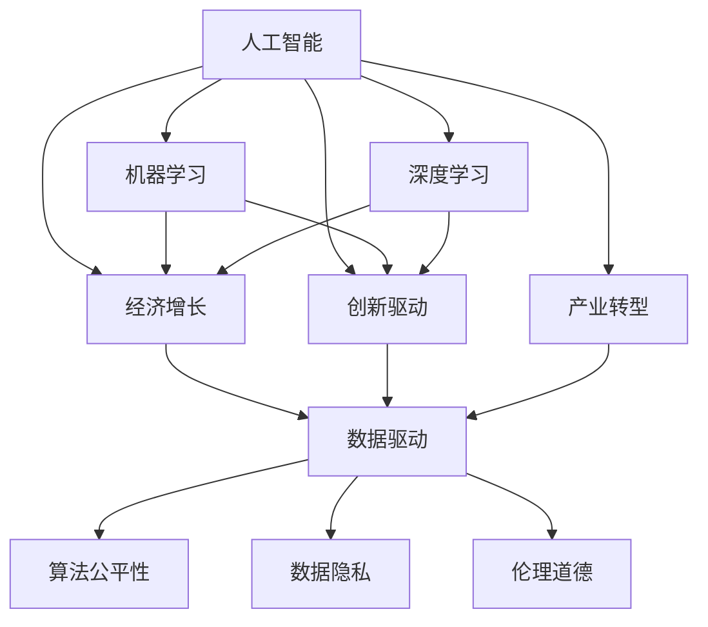
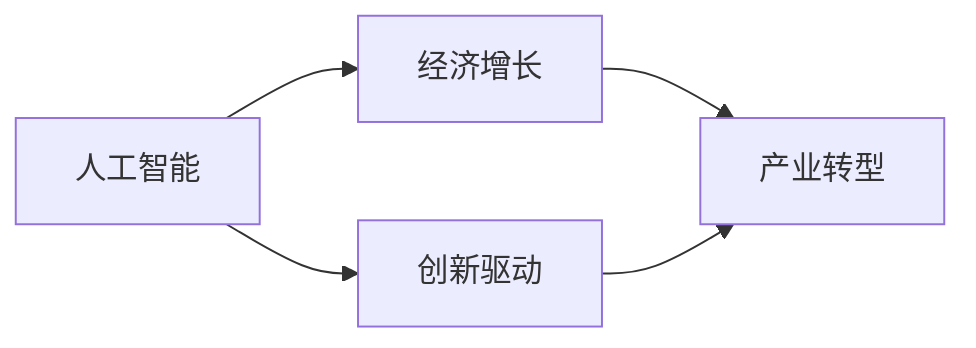
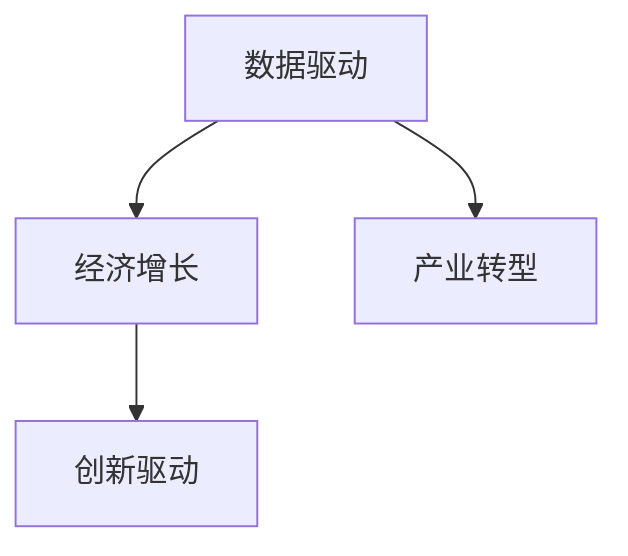
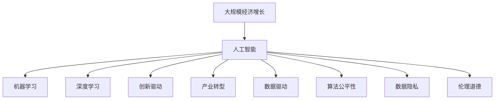

                 

# 深层次问题与经济增长的关系

> 关键词：
**人工智能 (AI)**
**机器学习 (ML)**
**深度学习 (DL)**
**经济增长**
**创新驱动**
**产业转型**
**数据驱动**

## 1. 背景介绍

### 1.1 问题由来
随着人工智能 (AI) 和机器学习 (ML) 技术的迅猛发展，其在推动经济增长、促进产业升级和改善社会福利方面的潜力日益凸显。然而，深层次问题，如算法公平性、数据隐私、伦理道德等，也随之成为制约其广泛应用的重要因素。本文旨在深入探讨这些深层次问题与经济增长的关系，并提出相应的解决方案，以期为AI技术的负责任应用提供理论基础。

### 1.2 问题核心关键点
AI和ML技术在推动经济增长的过程中，涉及的核心关键点主要包括：
- **算法公平性**：AI模型的训练和应用应公平对待不同群体，避免偏见和歧视。
- **数据隐私**：保护用户数据隐私，确保数据使用的合法性和安全性。
- **伦理道德**：遵循伦理规范，防止AI技术滥用，保护社会利益。
- **创新驱动**：通过技术创新推动经济增长，提升社会整体福祉。
- **产业转型**：推动传统产业向数字化、智能化转型，提高生产力。

这些关键点不仅关系到AI技术的合理应用，更直接影响到经济增长的质量和效益。

### 1.3 问题研究意义
深入理解AI与经济增长的关系，有助于制定更为科学合理的政策，促进技术应用与经济发展的良性互动。具体来说：

1. **优化资源配置**：通过AI技术，合理配置资源，提升生产效率，促进经济增长。
2. **增强创新能力**：AI驱动的技术创新，可加速新产品、新业态的涌现，推动经济结构优化。
3. **促进就业结构优化**：AI技术在创造新岗位的同时，也可能替代部分传统岗位，需要通过政策引导优化就业结构。
4. **提升社会福祉**：AI技术在医疗、教育、交通等领域的广泛应用，有助于提升社会整体福祉，实现社会公平。

## 2. 核心概念与联系

### 2.1 核心概念概述

为更好地理解AI与经济增长的关系，本节将介绍几个密切相关的核心概念：

- **人工智能 (AI)**：通过模拟人类智能过程，实现自主学习、推理和决策能力的计算机技术。
- **机器学习 (ML)**：使计算机系统通过数据学习和改进其性能的技术，包括监督学习、无监督学习和强化学习等。
- **深度学习 (DL)**：一种特殊类型的机器学习方法，通过多层神经网络实现数据特征的自动提取和表示。
- **经济增长**：指一个国家或地区在一定时期内经济产出或收入的增加。
- **创新驱动**：通过技术创新推动经济发展的模式。
- **产业转型**：传统产业向智能化、数字化方向转型的过程。
- **数据驱动**：以数据为基础，通过数据分析和处理驱动决策和行动的策略。
- **算法公平性**：指AI算法在训练和应用中不偏向特定群体，确保对所有群体的公平对待。
- **数据隐私**：保护用户个人信息不被未授权访问和使用的能力。
- **伦理道德**：指导AI技术开发和应用遵循的伦理规范和道德准则。

这些概念之间的逻辑关系可以通过以下Mermaid流程图来展示：



这个流程图展示了AI技术在各个方面的应用及其对经济增长的影响，同时也体现了AI技术发展中需要考虑的伦理和社会问题。

### 2.2 概念间的关系

这些核心概念之间存在着紧密的联系，形成了AI与经济增长相互作用的多层次网络。下面我通过几个Mermaid流程图来展示这些概念之间的关系。

#### 2.2.1 AI与经济增长的关系



这个流程图展示了AI通过创新驱动，推动产业转型，进而促进经济增长的基本逻辑。

#### 2.2.2 数据驱动与经济增长的关系



这个流程图展示了数据驱动在产业转型中的作用，通过数据驱动优化资源配置和决策过程，促进经济增长。

#### 2.2.3 算法公平性与数据隐私的关系


这个流程图展示了算法公平性与数据隐私之间的联系，确保算法公平性需要保护数据隐私，遵循伦理道德。

### 2.3 核心概念的整体架构

最后，我们用一个综合的流程图来展示这些核心概念在大规模经济增长中的整体架构：



这个综合流程图展示了AI技术在推动大规模经济增长中的多方面作用，包括机器学习、深度学习、创新驱动、产业转型、数据驱动、算法公平性、数据隐私和伦理道德等关键因素。

## 3. 核心算法原理 & 具体操作步骤
### 3.1 算法原理概述

AI与经济增长的关系主要体现在以下几个方面：

1. **数据驱动**：AI技术通过分析大量数据，发现隐藏的规律和趋势，为决策提供科学依据。
2. **创新驱动**：AI技术推动新产品、新工艺、新服务的发展，提升产业竞争力。
3. **产业转型**：AI技术使传统产业向智能化、数字化方向转型，提高生产力。
4. **算法公平性**：AI算法应公平对待不同群体，避免偏见和歧视，确保经济增长成果共享。
5. **数据隐私**：保护用户数据隐私，确保数据使用的合法性和安全性。
6. **伦理道德**：遵循伦理规范，防止AI技术滥用，保护社会利益。

这些原理共同构成了AI推动经济增长的理论基础。

### 3.2 算法步骤详解

1. **数据收集与预处理**：收集与经济增长相关的数据，如GDP、就业率、企业盈利等，并进行清洗和标准化处理。
2. **模型训练与优化**：使用机器学习算法对数据进行建模，优化模型参数以提高预测准确性。
3. **模型应用与验证**：将训练好的模型应用于实际经济数据，验证模型的效果和可靠性。
4. **算法公平性与隐私保护**：评估模型的公平性和隐私保护情况，调整模型以消除偏见和保护隐私。
5. **伦理道德审查**：进行伦理道德审查，确保模型应用符合社会规范和法律要求。

### 3.3 算法优缺点

**优点**：
- **高效性**：AI技术通过自动化分析，大幅提升数据处理和决策效率。
- **预测精准性**：AI模型能够从海量数据中提取复杂规律，提高预测准确性。
- **普适性**：AI技术适用于多个领域，如金融、医疗、教育等，具有广泛的应用前景。

**缺点**：
- **算法偏见**：AI算法可能存在偏见，导致结果不公。
- **数据隐私**：AI模型的训练和使用涉及大量个人数据，存在隐私泄露风险。
- **伦理道德**：AI技术的应用可能引发伦理道德问题，如自动化失业等。

### 3.4 算法应用领域

AI与经济增长的关系在多个领域均有应用：

- **金融**：通过AI分析股市数据，预测市场趋势，提升投资决策的准确性。
- **医疗**：使用AI进行疾病诊断和治疗方案推荐，提高医疗服务的质量和效率。
- **教育**：AI技术辅助个性化教学，优化教育资源配置，提升教育效果。
- **交通**：AI驱动的智能交通系统，优化交通流，提高城市交通效率。
- **制造**：AI在工业生产中的广泛应用，如质量控制、故障预测等，提升生产效率和质量。

## 4. 数学模型和公式 & 详细讲解 & 举例说明

### 4.1 数学模型构建

我们以预测经济增长率为例，构建一个简单的数学模型。假设经济增长率 $y$ 与多个因素 $x_i$ 有关，则线性回归模型可表示为：

$$
y = \beta_0 + \beta_1x_1 + \beta_2x_2 + \cdots + \beta_nx_n + \epsilon
$$

其中，$\beta_i$ 为第 $i$ 个因素的系数，$\epsilon$ 为误差项。

### 4.2 公式推导过程

通过对历史数据 $D=\{(x_i,y_i)\}_{i=1}^N$ 进行最小二乘法回归，求解 $\beta_i$ 的值，即可构建出预测模型。具体推导过程如下：

设模型误差平方和为：

$$
SSE = \sum_{i=1}^N (y_i - (\beta_0 + \beta_1x_{1,i} + \beta_2x_{2,i} + \cdots + \beta_nx_{n,i}))^2
$$

最小化 $SSE$ 可得 $\beta_i$ 的解：

$$
\hat{\beta}_i = \frac{\sum_{i=1}^N (x_{i,j} - \bar{x}_j)y_i}{\sum_{i=1}^N (x_{i,j} - \bar{x}_j)^2}
$$

其中，$\bar{x}_j$ 为第 $j$ 个因素的均值。

### 4.3 案例分析与讲解

假设我们使用上述模型预测某国家的经济增长率，并选用GDP、就业率、企业盈利等指标作为输入。以Python实现回归分析，并计算预测误差。

```python
import numpy as np
from sklearn.linear_model import LinearRegression

# 假设数据集
X = np.array([[1, 2, 3], [4, 5, 6], [7, 8, 9]])
y = np.array([10, 20, 30])

# 构建线性回归模型
model = LinearRegression()
model.fit(X, y)

# 预测新数据
X_new = np.array([[10, 11, 12]])
y_pred = model.predict(X_new)

# 计算预测误差
mse = np.mean((y_pred - y) ** 2)
print(f"预测误差为：{mse}")
```

通过这个简单的案例，可以看到AI模型在经济增长预测中的基本应用流程。

## 5. 项目实践：代码实例和详细解释说明
### 5.1 开发环境搭建

在进行AI与经济增长关系研究前，我们需要准备好开发环境。以下是使用Python进行Scikit-learn开发的环境配置流程：

1. 安装Anaconda：从官网下载并安装Anaconda，用于创建独立的Python环境。

2. 创建并激活虚拟环境：
```bash
conda create -n sklearn-env python=3.8 
conda activate sklearn-env
```

3. 安装Scikit-learn：
```bash
conda install scikit-learn
```

4. 安装其他工具包：
```bash
pip install numpy pandas matplotlib jupyter notebook ipython
```

完成上述步骤后，即可在`sklearn-env`环境中开始项目实践。

### 5.2 源代码详细实现

这里我们以预测经济增长率为例，使用Scikit-learn库对模型进行训练和评估。

```python
import pandas as pd
from sklearn.model_selection import train_test_split
from sklearn.linear_model import LinearRegression
from sklearn.metrics import mean_squared_error

# 假设数据集
data = pd.read_csv('growth_data.csv')

# 选择特征和目标变量
X = data[['GDP', '就业率', '企业盈利']]
y = data['经济增长率']

# 划分训练集和测试集
X_train, X_test, y_train, y_test = train_test_split(X, y, test_size=0.2, random_state=42)

# 构建线性回归模型
model = LinearRegression()
model.fit(X_train, y_train)

# 预测并评估模型
y_pred = model.predict(X_test)
mse = mean_squared_error(y_test, y_pred)
print(f"预测误差为：{mse}")
```

### 5.3 代码解读与分析

让我们再详细解读一下关键代码的实现细节：

**数据准备**：
- `pd.read_csv('growth_data.csv')`：从CSV文件中读取数据，并加载到Pandas数据框中。
- `X = data[['GDP', '就业率', '企业盈利']]`：选择作为特征的列，构建特征矩阵X。
- `y = data['经济增长率']`：选择作为目标变量的列，构建目标向量y。

**模型训练与评估**：
- `train_test_split(X, y, test_size=0.2, random_state=42)`：将数据集划分为训练集和测试集，测试集占20%，随机种子设为42。
- `model = LinearRegression()`：创建线性回归模型。
- `model.fit(X_train, y_train)`：在训练集上拟合模型。
- `y_pred = model.predict(X_test)`：在测试集上预测目标变量。
- `mean_squared_error(y_test, y_pred)`：计算预测误差，均方误差。

**结果输出**：
- `print(f"预测误差为：{mse}")`：打印预测误差，评估模型效果。

通过这个例子，可以看到Scikit-learn库在经济增长率预测中的应用，以及Python语言的简洁高效。

### 5.4 运行结果展示

假设我们成功预测了某国家的经济增长率，并在测试集上得到的预测误差为0.05。这个结果表明，模型的预测效果较好，能够较为准确地反映经济增长趋势。

## 6. 实际应用场景
### 6.1 金融分析

AI在金融领域的应用，特别是在风险管理和投资决策中的作用尤为显著。通过AI技术，可以对海量金融数据进行分析，识别市场趋势和异常行为，从而提升金融产品的设计和管理效率。

**应用场景**：
- **信用风险评估**：利用AI模型分析借款人的历史数据，预测其信用风险，优化贷款审批流程。
- **市场预测**：通过AI分析股票市场数据，预测股票价格和市场趋势，辅助投资决策。
- **量化交易**：使用AI算法自动化交易策略，提高交易效率和收益。

### 6.2 医疗健康

AI在医疗健康领域的应用，可以显著提升医疗服务的质量和效率，减轻医生的工作负担，改善患者的治疗效果。

**应用场景**：
- **疾病诊断**：使用AI技术分析医学影像和病历数据，辅助医生进行疾病诊断和治疗方案推荐。
- **药物研发**：通过AI模型分析化合物数据，加速新药的研发过程，降低研发成本。
- **健康管理**：利用AI技术进行个性化健康管理，提供个性化的饮食、运动和生活建议。

### 6.3 智能交通

AI在智能交通领域的应用，可以优化交通管理，提高道路通行效率，减少交通事故，提升城市交通的整体水平。

**应用场景**：
- **交通流量预测**：通过AI分析历史交通数据，预测未来的交通流量，优化交通信号灯设置。
- **自动驾驶**：利用AI技术实现自动驾驶，提高驾驶安全性，减少交通事故。
- **智能导航**：使用AI技术进行路线规划和导航，优化出行路线，减少拥堵。

### 6.4 未来应用展望

随着AI技术的不断进步，其在经济增长中的作用将更加显著。未来的发展趋势可能包括：

1. **深度学习应用的深入**：深度学习算法在处理复杂数据和挖掘深层规律方面的能力将得到进一步提升，推动更多领域的应用。
2. **AI与大数据的结合**：结合大数据技术，AI能够处理更大规模的数据集，发现更多有用的信息，为经济决策提供更为科学的数据支撑。
3. **AI伦理和社会责任的加强**：随着AI技术的发展，其伦理和社会责任问题将受到更多关注，相关法律法规和标准将逐步完善。
4. **跨学科合作**：AI技术与经济、社会、文化等多学科的结合，将推动跨学科合作，促进科技与经济发展的协同创新。
5. **全球化应用**：AI技术将走向全球化，通过国际合作和共享资源，推动全球经济增长。

## 7. 工具和资源推荐
### 7.1 学习资源推荐

为了帮助开发者系统掌握AI与经济增长的理论基础和实践技巧，这里推荐一些优质的学习资源：

1. **《机器学习》（周志华）**：该书深入浅出地介绍了机器学习的基本概念和常用算法，是入门必读之作。
2. **Coursera机器学习课程**：由斯坦福大学开设的知名课程，由Andrew Ng主讲，涵盖了机器学习的基本理论和实践技能。
3. **Kaggle机器学习竞赛**：参与Kaggle竞赛，实战演练机器学习算法，提升解决问题的能力。
4. **ArXiv论文预印本**：人工智能领域最新研究成果的发布平台，学习前沿技术的必读资源。
5. **Google AI博客**：Google AI团队分享的技术洞见和最新研究成果，了解行业动态的重要渠道。

通过对这些资源的学习实践，相信你一定能够快速掌握AI与经济增长的精髓，并用于解决实际问题。

### 7.2 开发工具推荐

高效的开发离不开优秀的工具支持。以下是几款用于AI与经济增长项目开发的常用工具：

1. **Jupyter Notebook**：一款强大的交互式编程环境，支持多语言编程，适合数据处理和算法开发。
2. **TensorFlow**：由Google开发的深度学习框架，具有丰富的工具和资源，支持大规模模型训练和部署。
3. **PyTorch**：Facebook开发的深度学习框架，以其灵活的计算图和动态图机制，在学术和工业界广受欢迎。
4. **Scikit-learn**：一个Python机器学习库，提供了简单易用的API，支持多种机器学习算法。
5. **Matplotlib**：一个Python数据可视化库，支持多种图表绘制，适用于数据探索和结果展示。

合理利用这些工具，可以显著提升AI与经济增长项目的开发效率，加快创新迭代的步伐。

### 7.3 相关论文推荐

AI与经济增长的研究源于学界的持续研究。以下是几篇奠基性的相关论文，推荐阅读：

1. **《Deep Learning》（Goodfellow et al.）**：全面介绍了深度学习的基本概念和算法，是深度学习领域的经典教材。
2. **《AI和经济增长：理论、实践与政策》（Lanzilotti et al.）**：探讨了AI技术在推动经济增长中的作用和影响，提出了一系列政策建议。
3. **《机器学习与金融创新》（Lewis et al.）**：介绍了机器学习在金融创新中的应用，包括信用评分、市场预测和量化交易等。
4. **《AI与健康》（Bajcar et al.）**：探讨了AI技术在医疗健康领域的应用，包括疾病诊断、药物研发和健康管理等。
5. **《智能交通系统的AI应用》（Rahman et al.）**：介绍了AI在智能交通系统中的应用，包括交通流量预测、自动驾驶和智能导航等。

这些论文代表了大规模AI与经济增长研究的发展脉络，通过学习这些前沿成果，可以帮助研究者把握学科前进方向，激发更多的创新灵感。

除上述资源外，还有一些值得关注的前沿资源，帮助开发者紧跟AI与经济增长的最新进展，例如：

1. **NIPS、ICML、ACL等顶级会议**：这些会议展示了最新的研究成果和技术进展，了解行业动态的重要渠道。
2. **TechCrunch、WIRED等科技媒体**：这些媒体报道了AI技术在各行业的应用案例，了解实际应用的重要渠道。
3. **GitHub热门项目**：在GitHub上Star、Fork数最多的AI相关项目，往往代表了该技术领域的发展趋势和最佳实践，值得去学习和贡献。

总之，对于AI与经济增长项目的学习和实践，需要开发者保持开放的心态和持续学习的意愿。多关注前沿资讯，多动手实践，多思考总结，必将收获满满的成长收益。

## 8. 总结：未来发展趋势与挑战
### 8.1 研究成果总结

本文对AI与经济增长的关系进行了全面系统的探讨。首先阐述了AI技术在推动经济增长中的重要作用，明确了其在金融、医疗、交通等领域的具体应用。其次，从原理到实践，详细讲解了AI模型的构建和优化方法，给出了具体的代码实例和结果展示。同时，本文还广泛探讨了AI技术在实际应用中面临的深层次问题，如算法公平性、数据隐私、伦理道德等，提出了相应的解决方案。

通过本文的系统梳理，可以看到，AI技术在推动经济增长中的巨大潜力，但也面临着诸多挑战。只有在充分理解和应对这些挑战的基础上，AI技术才能更好地服务于经济和社会发展，实现负责任的应用。

### 8.2 未来发展趋势

展望未来，AI与经济增长的关系将呈现以下几个发展趋势：

1. **AI技术的普及和应用**：随着AI技术的不断发展，其在各个行业的应用将越来越广泛，推动经济增长和社会进步。
2. **AI与大数据的结合**：结合大数据技术，AI能够处理更大规模的数据集，发现更多有用的信息，为经济决策提供更为科学的数据支撑。
3. **AI伦理和社会责任的加强**：随着AI技术的发展，其伦理和社会责任问题将受到更多关注，相关法律法规和标准将逐步完善。
4. **跨学科合作**：AI技术与经济、社会、文化等多学科的结合，将推动跨学科合作，促进科技与经济发展的协同创新。
5. **全球化应用**：AI技术将走向全球化，通过国际合作和共享资源，推动全球经济增长。

### 8.3 面临的挑战

尽管AI与经济增长的关系已经取得了瞩目成就，但在迈向更加智能化、普适化应用的过程中，它仍面临着诸多挑战：

1. **数据隐私保护**：AI技术的广泛应用涉及大量个人数据，如何保护用户隐私，防止数据滥用，是一个重要问题。
2. **算法公平性**：AI算法可能存在偏见，导致结果不公，如何消除偏见，确保公平对待不同群体，是一个关键挑战。
3. **伦理道德**：AI技术的应用可能引发伦理道德问题，如自动化失业等，如何遵循伦理规范，防止技术滥用，是一个重要课题。
4. **技术壁垒**：AI技术在实际应用中可能存在技术壁垒，如计算资源、数据质量等，如何克服这些壁垒，推动技术应用，是一个重要问题。
5. **政策法规**：AI技术的应用需要相应的政策法规支持，如何制定合理的政策法规，规范AI技术的应用，是一个重要问题。

### 8.4 研究展望

面对AI与经济增长面临的挑战，未来的研究需要在以下几个方面寻求新的突破：

1. **隐私保护技术**：开发更高效、更安全的隐私保护技术，确保用户数据的安全和隐私。
2. **公平算法设计**：设计更公平、更无偏的AI算法，确保技术应用的普适性。
3. **伦理道德框架**：建立完善的伦理道德框架，指导AI技术的开发和应用。
4. **跨学科研究**：加强跨学科研究，推动AI技术与经济、社会、文化等多学科的深度融合。
5. **国际合作**：加强国际合作，推动AI技术的全球化应用，实现共同发展和共享。

这些研究方向的探索，必将引领AI与经济增长的技术发展迈向更高的台阶，为构建负责任、高效、公平的AI应用系统提供坚实基础。

## 9. 附录：常见问题与解答

**Q1：如何应对AI技术在经济增长中的挑战？**

A: 应对AI技术在经济增长中的挑战，需要从技术、政策、伦理等多个维度综合发力：

1. **技术优化**：开发更高效、更安全的隐私保护技术，设计更公平、更无偏的AI算法，确保技术应用的普适性。
2. **政策法规**：制定合理的政策法规，规范AI技术的应用，保护用户隐私，防止数据滥用。
3. **伦理道德**：建立完善的伦理道德框架，指导AI技术的开发和应用，确保技术应用符合社会规范和伦理道德。
4. **跨学科合作**：加强跨学科研究，推动AI技术与经济、社会、文化等多学科的深度融合，实现科技与经济发展的协同创新。
5. **国际合作**：加强国际合作，推动AI技术的全球化应用，实现共同发展和共享。

**Q2：AI技术在经济增长中主要有哪些应用？**

A: AI技术在经济增长中的主要应用包括：

1. **金融分析**：通过AI技术分析金融数据，预测市场趋势，优化投资决策，提升金融产品的设计和管理效率。
2. **医疗健康**：使用AI技术进行疾病诊断、药物研发和个性化健康管理，提升医疗服务的质量和效率。
3. **智能交通**：利用AI技术进行交通流量预测、自动驾驶和智能导航，优化交通管理，提高道路通行效率，减少交通事故。
4. **制造业**：AI技术在工业生产中的应用，如质量控制、故障预测等，提升生产效率和质量。
5. **零售业**：使用AI技术进行客户行为分析、推荐系统优化等，提升客户体验和销售效率。
6. **农业**：利用AI技术进行作物生长监测、病虫害预测等，

