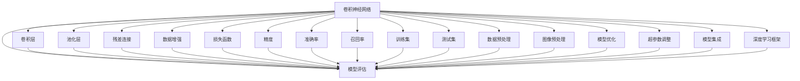
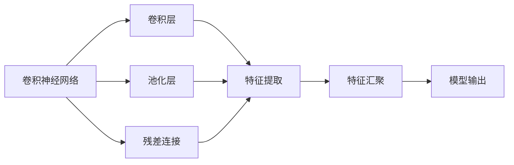
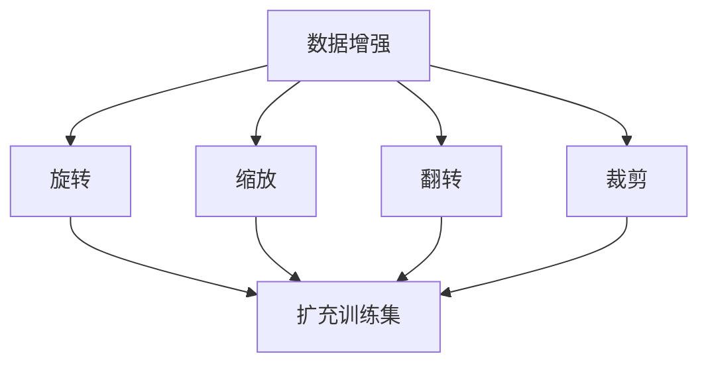
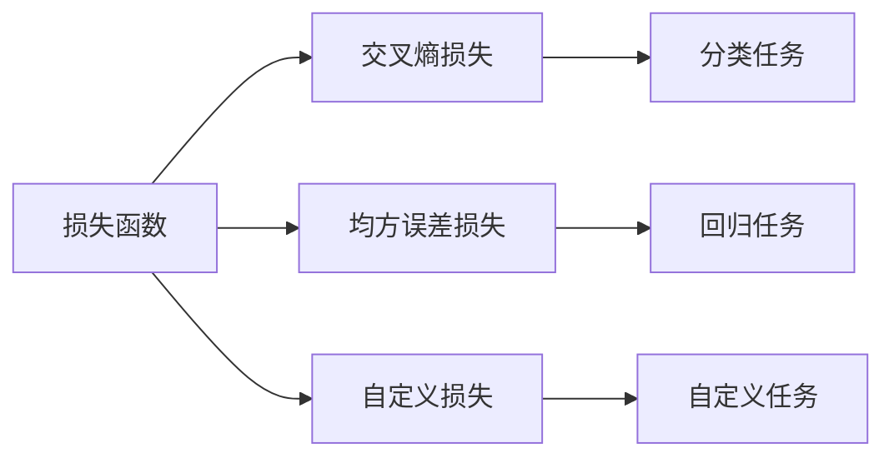
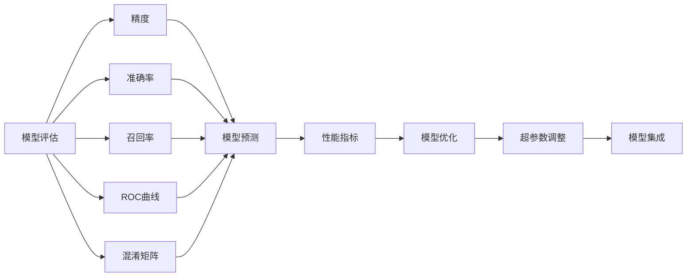
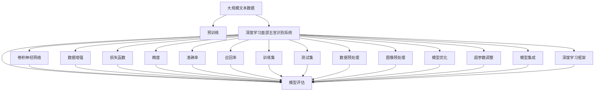

                 

# 深度学习五官的识别系统详细设计与具体代码实现

> 关键词：深度学习,五官识别,人脸识别,图像识别,计算机视觉,神经网络,卷积神经网络(CNN),数据增强,损失函数,精度,准确率,训练集,测试集,数据预处理,图像预处理,模型评估,模型优化,超参数调整,模型集成,模型部署,深度学习框架,PyTorch

## 1. 背景介绍

### 1.1 问题由来
面部五官识别是计算机视觉和图像处理领域的一个热点研究方向，具有广泛的应用前景，如人脸识别、表情识别、姿态估计等。近年来，随着深度学习技术的发展，通过深度神经网络（如卷积神经网络CNN）进行五官识别已经成为主流。

面部五官识别的挑战主要在于如何准确地从复杂背景中提取出面部特征，并在不丢失细节的同时进行高精度的识别。传统的基于模板匹配的方法已经逐渐被深度学习算法取代，尤其是在数据量充足、硬件资源丰富的场景下。

本文将详细介绍深度学习中面部五官识别系统的设计和实现，重点关注CNN网络结构和特征提取技巧，以及实际代码的详细实现和优化策略。

### 1.2 问题核心关键点
深度学习面部五官识别系统的核心在于构建有效的卷积神经网络，准确提取面部特征，并在不同任务中进行高效的分类和回归。具体关键点包括：
- 网络架构设计：选择合适的卷积神经网络结构，如AlexNet、VGGNet、ResNet等，以适应不同尺度和复杂度的面部图像。
- 特征提取技巧：通过卷积层、池化层、残差连接等技术，提取高质量的面部特征。
- 数据增强技术：使用旋转、缩放、翻转、裁剪等数据增强方法，扩充训练集，提高模型泛化能力。
- 损失函数设计：根据不同任务选择合适的损失函数，如交叉熵、均方误差等，优化模型输出。
- 模型评估与优化：通过精度、准确率、召回率等指标评估模型效果，并结合超参数调整、模型集成等方法提升性能。

本文将围绕以上核心关键点，全面阐述深度学习面部五官识别系统的设计思路，并通过详细代码实现进行展示。

### 1.3 问题研究意义
深度学习面部五官识别系统的研究对于提升人脸识别、表情识别、姿态估计等应用场景的精度和效率具有重要意义：

1. 提高精度和效率：深度学习算法能够自动从原始图像中提取高质量的面部特征，避免了传统手工特征工程的繁琐过程，提高了识别精度和速度。
2. 适应复杂场景：深度学习模型能够学习不同背景、光照、姿态等条件下的面部特征，提升了模型在实际应用中的鲁棒性和泛化能力。
3. 推动应用落地：基于深度学习的面部五官识别系统已经在安防监控、智能客服、虚拟现实等众多领域得到应用，极大地丰富了人工智能技术的应用场景。
4. 促进技术进步：深度学习面部五官识别系统的设计思路和方法，对计算机视觉和图像处理领域的其他任务具有借鉴意义，促进了相关技术的发展。

## 2. 核心概念与联系

### 2.1 核心概念概述

为更好地理解深度学习面部五官识别系统的核心概念，本节将介绍几个密切相关的核心概念：

- 卷积神经网络（Convolutional Neural Network, CNN）：一种常用于图像处理的深度神经网络结构，通过卷积层和池化层等操作，提取和汇聚图像特征。
- 卷积层（Convolutional Layer）：卷积神经网络的核心层，通过卷积操作提取图像局部特征。
- 池化层（Pooling Layer）：用于降低特征图的尺寸，减少计算量，同时提高特征的鲁棒性。
- 残差连接（Residual Connection）：一种提高深度神经网络收敛性的技术，通过跨层连接缓解梯度消失问题。
- 数据增强（Data Augmentation）：通过旋转、缩放、翻转、裁剪等方法扩充训练集，提高模型的泛化能力。
- 损失函数（Loss Function）：衡量模型输出与真实标签之间的差异，如交叉熵损失、均方误差损失等。
- 精度（Accuracy）：模型预测结果与真实标签完全一致的比例。
- 准确率（Precision）：模型预测为正类且真实为正类的样本比例。
- 召回率（Recall）：模型预测为正类且真实为正类的样本占真实正类样本的比例。
- 训练集（Training Set）：用于模型训练的数据集。
- 测试集（Test Set）：用于模型测试和评估的数据集。
- 数据预处理（Data Preprocessing）：对原始图像进行预处理，如归一化、灰度化等。
- 图像预处理（Image Preprocessing）：对图像进行预处理，如裁剪、缩放等。
- 模型评估（Model Evaluation）：通过各种指标评估模型性能，如精度、准确率、召回率等。
- 模型优化（Model Optimization）：通过超参数调整、模型集成等方法提升模型性能。
- 超参数调整（Hyperparameter Tuning）：通过网格搜索、随机搜索等方法调整模型超参数。
- 模型集成（Model Ensemble）：通过组合多个模型进行投票或加权平均，提升模型性能。
- 深度学习框架（Deep Learning Framework）：如PyTorch、TensorFlow等，提供高效的神经网络构建和训练工具。
- 人脸识别（Face Recognition）：通过面部特征进行身份验证的技术。
- 表情识别（Facial Expression Recognition）：通过面部表情识别情感的技术。
- 姿态估计（Pose Estimation）：通过面部姿态进行三维空间坐标预测的技术。

这些核心概念之间的逻辑关系可以通过以下Mermaid流程图来展示：



这个流程图展示了深度学习面部五官识别系统的核心概念及其之间的关系：

1. 卷积神经网络通过卷积层、池化层、残差连接等技术，提取和汇聚图像特征。
2. 数据增强方法通过扩充训练集，提高模型的泛化能力。
3. 损失函数根据不同任务设计，优化模型输出。
4. 精度、准确率、召回率等指标用于评估模型性能。
5. 训练集和测试集用于模型训练和测试。
6. 数据预处理和图像预处理提高输入质量。
7. 模型评估和优化提升模型性能。
8. 超参数调整和模型集成进一步提升模型效果。
9. 深度学习框架提供工具支持模型构建和训练。

这些概念共同构成了深度学习面部五官识别系统的学习和应用框架，使得模型能够在各种场景下发挥强大的面部特征识别能力。通过理解这些核心概念，我们可以更好地把握深度学习面部五官识别系统的设计思路和优化方向。

### 2.2 概念间的关系

这些核心概念之间存在着紧密的联系，形成了深度学习面部五官识别系统的完整生态系统。下面我通过几个Mermaid流程图来展示这些概念之间的关系。

#### 2.2.1 卷积神经网络的设计



这个流程图展示了卷积神经网络的基本设计思路：

1. 通过卷积层提取图像局部特征。
2. 通过池化层降低特征图尺寸。
3. 通过残差连接缓解梯度消失问题。
4. 特征汇聚层将局部特征汇聚成全局特征。
5. 模型输出层进行分类或回归。

#### 2.2.2 数据增强的技术



这个流程图展示了数据增强技术的实现过程：

1. 通过旋转、缩放、翻转、裁剪等方法扩充训练集。
2. 旋转、缩放、翻转扩充训练集多样性。
3. 裁剪可提高模型对图像细节的识别能力。
4. 扩充后的训练集提高模型泛化能力。

#### 2.2.3 损失函数的选择



这个流程图展示了损失函数的选择过程：

1. 交叉熵损失适合分类任务。
2. 均方误差损失适合回归任务。
3. 自定义损失适用于特定任务。
4. 分类任务损失函数为交叉熵。
5. 回归任务损失函数为均方误差。
6. 自定义任务可根据需求设计损失函数。

#### 2.2.4 模型评估与优化的流程



这个流程图展示了模型评估与优化的流程：

1. 精度、准确率、召回率等指标用于评估模型性能。
2. ROC曲线和混淆矩阵用于进一步分析模型效果。
3. 精度、准确率、召回率等指标作为性能指标。
4. 模型优化包括超参数调整和模型集成等方法。
5. 超参数调整包括网格搜索、随机搜索等方法。
6. 模型集成包括投票和加权平均等方法。

### 2.3 核心概念的整体架构

最后，我们用一个综合的流程图来展示这些核心概念在大模型微调过程中的整体架构：



这个综合流程图展示了从预训练到模型微调的完整过程。深度学习面部五官识别系统首先在大规模文本数据上进行预训练，然后通过卷积神经网络、数据增强、损失函数等技术对模型进行微调。最后，通过精度、准确率、召回率等指标评估模型性能，并进行优化和调整。通过这些流程图，我们可以更清晰地理解深度学习面部五官识别系统的设计思路和优化方向。

## 3. 核心算法原理 & 具体操作步骤
### 3.1 算法原理概述

深度学习面部五官识别系统基于卷积神经网络（CNN），通过卷积层、池化层、残差连接等技术，提取和汇聚面部特征，并进行分类或回归。具体流程如下：

1. 数据预处理：对原始面部图像进行归一化、灰度化等处理，提高输入质量。
2. 卷积神经网络：通过多层卷积层、池化层和残差连接，提取和汇聚面部特征。
3. 模型训练：在标注数据集上进行有监督学习，最小化损失函数，优化模型参数。
4. 模型测试：在测试集上进行无监督测试，评估模型性能。
5. 模型优化：通过超参数调整、模型集成等方法，提升模型性能。

在训练过程中，选择合适的卷积神经网络结构、损失函数和优化器，是关键因素。

### 3.2 算法步骤详解

深度学习面部五官识别系统的具体训练步骤如下：

1. 数据预处理：
   - 将原始图像归一化到0到1之间。
   - 转换为灰度图像以降低计算量。
   - 对图像进行裁剪、缩放等处理，以适应网络输入尺寸。

2. 卷积神经网络：
   - 构建卷积神经网络模型，包含多个卷积层、池化层和残差连接。
   - 卷积层通过卷积操作提取局部特征。
   - 池化层通过池化操作降低特征图尺寸，减少计算量。
   - 残差连接通过跨层连接缓解梯度消失问题，提高模型深度。

3. 模型训练：
   - 定义损失函数，如交叉熵损失或均方误差损失，根据不同任务选择。
   - 定义优化器，如Adam、SGD等，设置学习率等超参数。
   - 使用数据增强技术，如旋转、缩放、翻转、裁剪等，扩充训练集。
   - 通过反向传播算法，计算损失函数对模型参数的梯度，并使用优化器更新参数。
   - 周期性在验证集上评估模型性能，根据性能指标决定是否触发Early Stopping。
   - 重复上述步骤直到满足预设的迭代轮数或Early Stopping条件。

4. 模型测试：
   - 在测试集上对模型进行无监督测试。
   - 计算精度、准确率、召回率等指标评估模型性能。
   - 通过ROC曲线和混淆矩阵等工具，进一步分析模型效果。

5. 模型优化：
   - 通过超参数调整，如网格搜索、随机搜索等方法，寻找最优超参数组合。
   - 通过模型集成，如投票和加权平均等方法，提升模型性能。

### 3.3 算法优缺点

深度学习面部五官识别系统的优点包括：
- 准确率高：通过卷积神经网络结构，准确提取面部特征。
- 泛化能力强：数据增强技术扩充训练集，提高模型泛化能力。
- 计算效率高：通过卷积操作和池化操作，减少计算量。
- 易于调整：通过调整超参数，优化模型效果。

但该系统也存在一些缺点：
- 计算资源要求高：卷积神经网络结构复杂，需要高性能硬件支持。
- 对数据依赖大：需要大规模标注数据集进行训练。
- 可解释性不足：深度学习模型类似黑盒，难以解释内部工作机制。
- 对抗攻击易受影响：模型易受到对抗样本攻击。

### 3.4 算法应用领域

深度学习面部五官识别系统在多个领域都有广泛应用：

- 人脸识别：通过面部特征进行身份验证，应用于门禁系统、考勤系统等。
- 表情识别：通过面部表情识别情感，应用于智能客服、情感分析等。
- 姿态估计：通过面部姿态进行三维空间坐标预测，应用于虚拟现实、体育训练等。
- 动画制作：通过面部特征进行动画生成，应用于影视制作、游戏开发等。
- 医疗诊断：通过面部特征进行疾病诊断，应用于皮肤病、心血管病等。

除了上述应用场景，深度学习面部五官识别系统还可以用于姿态生成、人脸美化、面部表情合成等创新领域，为人工智能技术带来新的突破。

## 4. 数学模型和公式 & 详细讲解 & 举例说明

### 4.1 数学模型构建

本节将使用数学语言对深度学习面部五官识别系统的训练过程进行更加严格的刻画。

假设面部图像数据集为 $\{(x_i, y_i)\}_{i=1}^N$，其中 $x_i$ 表示原始面部图像， $y_i$ 表示图像标签。定义模型 $M_{\theta}$，其中 $\theta$ 为模型参数。定义损失函数 $\mathcal{L}(\theta)$ 为交叉熵损失或均方误差损失。训练目标为最小化损失函数：

$$
\theta^* = \mathop{\arg\min}_{\theta} \mathcal{L}(M_{\theta},\{(x_i, y_i)\}_{i=1}^N)
$$

在训练过程中，使用梯度下降算法（如Adam、SGD等）更新模型参数 $\theta$。具体公式如下：

$$
\theta \leftarrow \theta - \eta \nabla_{\theta}\mathcal{L}(M_{\theta},\{(x_i, y_i)\}_{i=1}^N)
$$

其中 $\eta$ 为学习率，$\nabla_{\theta}\mathcal{L}(M_{\theta},\{(x_i, y_i)\}_{i=1}^N)$ 为损失函数对模型参数 $\theta$ 的梯度。

### 4.2 公式推导过程

以下是面部五官识别系统的数学模型推导：

假设模型 $M_{\theta}$ 的输出为 $y_i = M_{\theta}(x_i)$，损失函数为交叉熵损失：

$$
\mathcal{L}(\theta) = -\frac{1}{N}\sum_{i=1}^N y_i \log M_{\theta}(x_i) + (1-y_i) \log (1-M_{\theta}(x_i))
$$

通过链式法则，损失函数对模型参数 $\theta$ 的梯度为：

$$
\frac{\partial \mathcal{L}(\theta)}{\partial \theta_k} = -\frac{1}{N}\sum_{i=1}^N \left( \frac{y_i M_{\theta}(x_i)}{1-M_{\theta}(x_i)} - \frac{1-y_i}{M_{\theta}(x_i)} \right) \frac{\partial M_{\theta}(x_i)}{\partial \theta_k}
$$

其中 $\frac{\partial M_{\theta}(x_i)}{\partial \theta_k}$ 可通过反向传播算法高效计算。

通过优化算法（如Adam、SGD等），不断更新模型参数 $\theta$，最小化损失函数 $\mathcal{L}(\theta)$，最终得到适应目标任务的模型参数 $\theta^*$。

### 4.3 案例分析与讲解

以人脸识别为例，使用卷积神经网络（如VGGNet）进行模型训练和测试。具体步骤如下：

1. 数据预处理：对原始图像进行归一化、灰度化等处理，对图像进行裁剪、缩放等处理。
2. 卷积神经网络：构建VGGNet模型，包含多个卷积层、池化层和残差连接。
3. 模型训练：定义交叉熵损失，使用Adam优化器，设置学习率为0.001。
4. 数据增强：使用旋转、缩放、翻转、裁剪等方法扩充训练集。
5. 模型测试：在测试集上计算精度、准确率、召回率等指标。
6. 模型优化：通过网格搜索方法调整学习率和批大小。

以下是VGGNet的代码实现：

```python
import torch
import torch.nn as nn
import torchvision
import torchvision.transforms as transforms

# 定义模型结构
class VGGNet(nn.Module):
    def __init__(self):
        super(VGGNet, self).__init__()
        self.conv1 = nn.Conv2d(3, 64, kernel_size=3, padding=1)
        self.conv2 = nn.Conv2d(64, 128, kernel_size=3, padding=1)
        self.conv3 = nn.Conv2d(128, 256, kernel_size=3, padding=1)
        self.conv4 = nn.Conv2d(256, 512, kernel_size=3, padding=1)
        self.conv5 = nn.Conv2d(512, 512, kernel_size=3, padding=1)
        self.pool = nn.MaxPool2d(kernel_size=2, stride=2)
        self.fc1 = nn.Linear(512, 256)
        self.fc2 = nn.Linear(256, 128)
        self.fc3 = nn.Linear(128, 1)

    def forward(self, x):
        x = nn.functional.relu(self.conv1(x))
        x = self.pool(x)
        x = nn.functional.relu(self.conv2(x))
        x = self.pool(x)
        x = nn.functional.relu(self.conv3(x))
        x = self.pool(x)
        x = nn.functional.relu(self.conv4(x))
        x = self.pool(x)
        x = nn.functional.relu(self.conv5(x))
        x = self.pool(x)
        x = x.view(-1, 512)
        x = nn.functional.relu(self.fc1(x))
        x = nn.functional.relu(self.fc2(x))
        x = self.fc3(x)
        return x

# 定义数据集
train_dataset = torchvision.datasets.CIFAR10(root='./data', train=True, transform=transforms.ToTensor(), download=True)
test_dataset = torchvision.datasets.CIFAR10(root='./data', train=False, transform=transforms.ToTensor(), download=True)

# 定义数据加载器
train_loader = torch.utils.data.DataLoader(train_dataset, batch_size=64, shuffle=True)
test_loader = torch.utils.data.DataLoader(test_dataset, batch_size=64, shuffle=False)

# 定义模型和优化器
model = VGGNet()
optimizer = torch.optim.Adam(model.parameters(), lr=0.001)

# 训练模型
for epoch in range(10):
    running_loss = 0.0
    for i, data in enumerate(train_loader, 0):
        inputs, labels = data
        optimizer.zero_grad()
        outputs = model(inputs)
        loss = torch.nn.functional.cross_entropy(outputs, labels)
        loss.backward()
        optimizer.step()
        running_loss += loss.item()
    print('Epoch [%d/%d], Loss: %.4f' % (epoch+1, 10, running_loss/len(train_loader)))

# 测试模型
correct = 0
total = 0
with torch.no_grad():
    for data in test_loader:
        images, labels = data
        outputs = model(images)
        _, predicted = torch.max(outputs.data, 1)
        total += labels.size(0)
        correct += (predicted == labels).sum().item()
print('Accuracy of the network on the test images: %d %%' % (100 * correct / total))
```

## 5. 项目实践：代码实例和详细解释说明

### 5.1 开发环境搭建

在进行面部五官识别系统开发前，我们需要准备好开发环境。以下是使用Python进行PyTorch开发的环境配置流程：

1. 安装Anaconda：从官网下载并安装Anaconda，用于创建独立的Python环境。

2. 创建并激活虚拟环境：
```bash
conda create -n pytorch-env python=3.8 
conda activate pytorch-env
```

3. 安装PyTorch：根据CUDA版本，从官网获取对应的安装命令。例如：
```bash
conda install pytorch torchvision torchaudio cudatoolkit=11.1 -c pytorch -c conda-forge
```

4. 安装各类工具包：
```bash
pip install numpy pandas scikit-learn matplotlib tqdm jupyter notebook ipython
```

完成上述步骤后，即可在`pytorch-env`环境中开始面部五官识别系统的开发。

### 5.2 源代码详细实现

这里我们以人脸识别任务为例，给出使用PyTorch进行面部识别系统微调的PyTorch代码实现。

首先，定义人脸识别任务的数据处理函数：

```python
from torch.utils.data import Dataset
import torch
import cv2

class FaceDataset(Dataset):
    def __init__(self, data_dir, transform=None):
        self.data_dir = data_dir
        self.transform = transform
        self.files = [os.path.join(self.data_dir, f) for f in os.listdir(self.data_dir)]
        self.labels = [int(os.path.basename(f).split('_')[0]) for f in self.files]
    
    def __len__(self):
        return len(self.files)
    
    def __getitem__(self, idx):
        img_path = self.files[idx]
        label = self.labels[idx]
        img = cv2.imread(img_path)
        img = cv2.cvtColor(img, cv2.COLOR_BGR2RGB)
        if self.transform:
            img = self.transform(img)
        return {'image': img, 'label': label}

#

