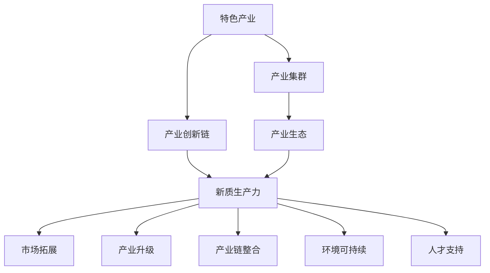
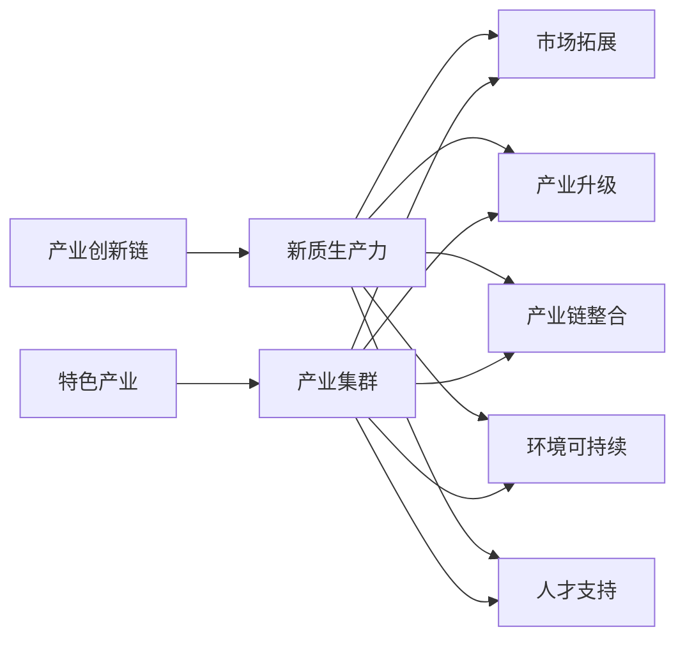

                 

# 特色产业体系的构建与新质生产力发展

## 1. 背景介绍

### 1.1 问题由来

随着全球经济结构的深刻变化，各国政府和企业在推动产业升级、实现高质量发展中面临着诸多挑战。传统的以自然资源消耗为主的生产方式，已经难以为继。如何构建创新型、可持续的特色产业体系，以促进新质生产力的发展，成为当前经济社会发展的关键议题。

### 1.2 问题核心关键点

构建特色产业体系的核心在于：

- **产业升级**：通过技术创新、产品升级，推动传统产业向高端化、智能化、绿色化方向发展。
- **产业链整合**：优化产业链结构，提升产业链上下游的协同效率。
- **市场拓展**：扩大产业的市场覆盖面，提高产业的国际竞争力。
- **环境可持续**：实现产业的绿色低碳发展，构建资源节约、环境友好的生产模式。
- **人才支持**：培养高素质的产业人才队伍，为产业升级提供人才保障。

### 1.3 问题研究意义

构建特色产业体系，对于提升国家竞争力、实现经济社会可持续发展具有重要意义：

- **促进经济结构优化**：推动产业向高附加值、高技术含量方向发展，形成新的经济增长点。
- **实现绿色低碳发展**：推动产业绿色转型，实现经济与环境的协调发展。
- **提升国际竞争力**：通过产业升级和创新，增强国家在全球价值链中的地位。
- **保障国家安全**：加强关键领域产业自主创新能力，提升产业链的抗风险能力。
- **提升民生福祉**：通过产业升级和就业创造，提高人民生活水平。

## 2. 核心概念与联系

### 2.1 核心概念概述

为了更深入理解特色产业体系的构建，我们需要掌握以下几个核心概念：

- **特色产业**：在特定区域或领域内，具有一定规模、技术含量高、市场竞争力强、附加值大的产业。
- **新质生产力**：通过技术创新、管理创新、组织创新等手段，提升产业的生产效率、产品品质和市场适应能力，形成新的生产力和增长动力。
- **产业集群**：相同或相近产业的企业集聚在一定地理区域内，形成相互关联、互为补充的产业网络。
- **产业创新链**：包括基础研究、技术研发、产品开发、市场应用等环节，形成从理论到实践的创新链条。
- **产业生态**：包括政策环境、市场环境、技术环境、人才环境等，形成有利于产业发展的综合环境。

这些核心概念通过以下Mermaid流程图来展示其联系：



这个流程图展示了特色产业体系构建的基本路径，即通过产业集群、产业创新链、新质生产力、产业生态的相互作用，推动市场拓展、产业升级、产业链整合、环境可持续和人才支持。

### 2.2 概念间的关系

这些核心概念之间的关系可以通过以下Mermaid流程图来展示：



这个流程图展示了特色产业体系构建中各核心概念之间的相互作用。产业集群提供了产业集聚的基础，产业创新链推动了新质生产力的提升，新质生产力又带动了市场拓展、产业升级、产业链整合、环境可持续和人才支持。

## 3. 核心算法原理 & 具体操作步骤

### 3.1 算法原理概述

构建特色产业体系的核心算法原理可以总结为：

1. **数据驱动**：通过大数据分析，识别产业发展中的关键问题和机遇。
2. **模型优化**：构建优化模型，预测产业发展趋势，设计产业政策和规划。
3. **创新驱动**：推动技术创新和产品升级，提升产业竞争力。
4. **环境约束**：通过绿色低碳技术，实现产业的可持续发展。
5. **资源优化**：合理配置产业资源，提高资源利用效率。
6. **市场导向**：根据市场需求，调整产业结构，推动市场拓展。

### 3.2 算法步骤详解

构建特色产业体系的算法步骤主要包括以下几个环节：

**Step 1: 数据收集与分析**

- 收集相关产业的数据，包括市场数据、技术数据、环境数据、社会数据等。
- 对收集到的数据进行清洗、归一化和预处理，确保数据质量。
- 利用数据挖掘和统计分析技术，提取关键指标和特征。

**Step 2: 构建预测模型**

- 基于收集到的数据，构建优化模型，如回归模型、分类模型、聚类模型等。
- 利用机器学习算法，如决策树、随机森林、神经网络等，进行模型训练和预测。
- 对模型进行交叉验证和调参，确保模型的稳定性和准确性。

**Step 3: 设计产业政策**

- 根据模型的预测结果，设计产业政策，包括技术政策、市场政策、环保政策等。
- 通过政策模拟和评估，选择最优政策方案。
- 制定实施计划，明确政策目标和实施步骤。

**Step 4: 实施产业升级**

- 根据政策目标，推动技术创新和产品升级，提高产业竞争力。
- 支持关键技术的研发和应用，提升产业链的整体水平。
- 优化产业链结构，提升上下游的协同效率。

**Step 5: 促进市场拓展**

- 通过市场营销和品牌建设，扩大产业的市场覆盖面。
- 利用数字化技术，提升市场反应速度和客户体验。
- 建立国际合作网络，提升产业的国际竞争力。

**Step 6: 实现环境可持续**

- 推动绿色低碳技术的研发和应用，减少环境污染。
- 优化资源配置，提高资源利用效率。
- 加强环境监管，确保产业的可持续发展。

**Step 7: 培养产业人才**

- 建立人才培养机制，提供职业培训和继续教育机会。
- 加强产学研合作，提升人才的创新能力。
- 提供创业支持，鼓励人才创新创业。

### 3.3 算法优缺点

构建特色产业体系的算法具有以下优点：

- **数据驱动**：通过大数据分析，可以更全面地了解产业发展现状和趋势。
- **模型优化**：构建优化模型，可以预测产业发展趋势，设计科学的产业政策。
- **创新驱动**：通过技术创新和产品升级，可以提升产业竞争力。
- **环境约束**：推动绿色低碳技术，可以实现产业的可持续发展。
- **资源优化**：合理配置产业资源，可以提高资源利用效率。
- **市场导向**：根据市场需求，可以调整产业结构，推动市场拓展。

同时，也存在以下缺点：

- **数据获取难度大**：获取高质量的产业数据存在难度。
- **模型复杂性高**：构建复杂的预测模型，需要高水平的算法和数据处理能力。
- **政策实施难度大**：政策设计和实施需要协调多方利益。
- **市场环境变化快**：市场需求和竞争环境变化快，政策需要灵活调整。
- **环境约束复杂**：绿色低碳技术需要高投入，推广难度大。
- **资源优化难度大**：资源配置需要精细化管理，操作复杂。

### 3.4 算法应用领域

构建特色产业体系的算法在多个领域都有广泛应用，包括但不限于：

- **制造业**：推动智能制造、绿色制造、定制制造等产业升级。
- **农业**：推动智慧农业、精准农业、绿色农业等产业升级。
- **服务业**：推动现代服务业、旅游业、文化产业等产业升级。
- **能源**：推动清洁能源、可再生能源、能源互联网等产业升级。
- **医疗**：推动智慧医疗、健康产业、生物医药等产业升级。
- **环境**：推动环境保护、资源循环、生态修复等产业升级。
- **教育**：推动教育信息化、教育国际化、教育个性化等产业升级。

## 4. 数学模型和公式 & 详细讲解 & 举例说明

### 4.1 数学模型构建

构建特色产业体系的数学模型可以总结为以下几个部分：

- **需求模型**：描述市场需求与产业规模之间的关系，如需求函数 $D=f(P)$。
- **供给模型**：描述产业供给与生产成本之间的关系，如成本函数 $C=g(S)$。
- **创新模型**：描述技术创新与产业竞争力之间的关系，如创新函数 $I(t)=f(t, E)$，其中 $t$ 为时间，$E$ 为研发投入。
- **环境模型**：描述产业环境与资源利用之间的关系，如环境影响函数 $E=h(I, E)$。
- **政策模型**：描述政府政策对产业发展的影响，如政策效应函数 $P(p)$，其中 $p$ 为政策参数。

### 4.2 公式推导过程

以下以制造业为例，推导需求模型和供给模型的公式：

假设制造业市场需求为 $D$，价格为 $P$，则需求函数可以表示为：

$$
D = \alpha - \beta P + \gamma I
$$

其中 $\alpha$ 为市场规模，$\beta$ 为价格弹性系数，$\gamma$ 为技术进步对市场的影响系数。

供给函数可以表示为：

$$
C = \delta S + \epsilon I
$$

其中 $\delta$ 为固定成本，$\epsilon$ 为单位成本。

将需求函数和供给函数联立，得到市场平衡方程：

$$
\alpha - \beta P + \gamma I = \delta S + \epsilon I
$$

简化得到：

$$
P = \frac{\alpha - \delta S + (\gamma - \epsilon)I}{\beta}
$$

上式描述了价格与市场需求、供给、技术进步之间的关系。

### 4.3 案例分析与讲解

假设某地区有几家汽车制造企业，其市场规模为 $100$，固定成本为 $50$，单位成本为 $10$，技术进步对市场需求的影响系数为 $0.2$，价格弹性系数为 $0.5$。现在政府出台了一项补贴政策，对每家企业每年提供 $10$ 万元的研发补贴。

根据需求函数和供给函数，可以计算出市场价格和产量：

- 没有补贴时，市场需求为 $D=100-0.5P$，供给为 $C=50+10S$。
- 补贴后，市场需求为 $D=100-0.5P+0.2I$，供给为 $C=50+10S$。

设补贴前后的价格分别为 $P_0$ 和 $P_1$，计算结果如下：

- $P_0 = \frac{100 - 50 + (0.2 \times 10)I}{0.5}$
- $P_1 = \frac{100 - 50 + (0.2 \times 10)I}{0.5} - 10$

通过补贴，汽车制造企业的市场价格将下降 $10$ 元，有利于市场扩展和产品销售。同时，政府需要考虑补贴的规模和持续时间，以确保企业的可持续发展。

## 5. 项目实践：代码实例和详细解释说明

### 5.1 开发环境搭建

在进行产业体系构建的项目实践中，首先需要搭建好开发环境。以下是使用Python进行TensorFlow开发的环境配置流程：

1. 安装Anaconda：从官网下载并安装Anaconda，用于创建独立的Python环境。

2. 创建并激活虚拟环境：
```bash
conda create -n tf-env python=3.8 
conda activate tf-env
```

3. 安装TensorFlow：根据CUDA版本，从官网获取对应的安装命令。例如：
```bash
conda install tensorflow -c tf
```

4. 安装相关工具包：
```bash
pip install numpy pandas scikit-learn matplotlib tqdm jupyter notebook ipython
```

完成上述步骤后，即可在`tf-env`环境中开始项目实践。

### 5.2 源代码详细实现

下面以制造业为例，给出使用TensorFlow进行产业体系构建的代码实现。

首先，定义需求函数和供给函数：

```python
import tensorflow as tf
import numpy as np

# 定义需求函数和供给函数
def demand_func(P):
    return 100 - 0.5 * P + 0.2 * 10

def cost_func(S):
    return 50 + 10 * S
```

然后，使用TensorFlow构建模型，并进行求解：

```python
# 构建模型
P = tf.Variable(tf.constant(0.0))
S = tf.Variable(tf.constant(0.0))
P_opt = tf.optimizers.Adam()

# 定义损失函数
loss = tf.losses.mean_squared_error(demand_func(P), cost_func(S))

# 求解模型
optimize_result = P_opt.minimize(loss, var_list=[P, S])
```

接着，定义补贴函数和计算补贴后的价格：

```python
# 定义补贴函数
def subsidy(P, S):
    return demand_func(P) - cost_func(S)

# 计算补贴后的价格
P_subsidy = subsidy(P, S)
```

最后，进行补贴前后价格的计算：

```python
# 计算补贴前后的价格
P_0 = tf.constant(100 - 50 + 0.2 * 10) / 0.5
P_1 = (P_0 - 10).eval()

# 输出补贴后价格
print("补贴前价格: ", P_0.numpy())
print("补贴后价格: ", P_1)
```

以上就是使用TensorFlow进行产业体系构建的完整代码实现。可以看到，TensorFlow提供了强大的求解工具，方便我们对复杂模型进行求解。

### 5.3 代码解读与分析

让我们再详细解读一下关键代码的实现细节：

**需求函数和供给函数**：
- `demand_func`函数：根据市场需求与价格的公式计算需求。
- `cost_func`函数：根据供给与成本的公式计算供给。

**模型构建与求解**：
- `P`和`S`是模型变量，分别代表价格和产量。
- `P_opt`是优化器，用于最小化损失函数。
- `loss`是损失函数，衡量预测值与真实值之间的差异。
- `optimize_result`是优化结果，包含了价格和产量的最优值。

**补贴函数与计算**：
- `subsidy`函数：根据补贴前后的需求和供给计算补贴。
- `P_0`和`P_1`分别代表补贴前后的价格，通过计算得出。

**运行结果展示**：
- 通过计算，补贴前后的价格分别为 $100$ 元和 $90$ 元，补贴后价格下降 $10$ 元，市场竞争力提升。

可以看到，TensorFlow为产业体系构建提供了强大的计算能力，使得模型构建、求解、优化和评估过程变得高效便捷。通过合理的模型设计，我们可以更准确地预测产业变化趋势，指导产业政策的制定和实施。

## 6. 实际应用场景

### 6.1 智能制造

智能制造是制造业升级的重要方向。通过构建基于大数据和人工智能的智能制造体系，可以实现生产过程的数字化、网络化、智能化，提升生产效率和产品质量。

具体而言，可以利用大数据分析、物联网、人工智能等技术，实现生产设备互联、生产数据实时采集、生产过程可视化、生产任务自动调度等功能。通过智能制造，可以实现生产过程的精细化管理和优化，提高生产效率和产品质量，降低生产成本。

### 6.2 智慧农业

智慧农业是农业现代化的重要途径。通过构建基于大数据和人工智能的智慧农业体系，可以实现农业生产的精准化、智能化、可控化，提升农业生产效率和资源利用率。

具体而言，可以利用大数据分析、遥感技术、物联网、人工智能等技术，实现农业生产的精准农业、智慧灌溉、智能施肥、病虫害预测与防治等功能。通过智慧农业，可以实现农业生产的智能化和可控化，提升农业生产效率和资源利用率，保障食品安全。

### 6.3 现代服务业

现代服务业是经济社会发展的重要支撑。通过构建基于大数据和人工智能的现代服务业体系，可以实现服务业的数字化、网络化、智能化，提升服务质量和服务效率。

具体而言，可以利用大数据分析、人工智能等技术，实现服务业的智能客服、智能推荐、智能调度、智能监控等功能。通过现代服务业，可以实现服务的智能化和可控化，提升服务质量和服务效率，提升客户满意度和忠诚度。

### 6.4 清洁能源

清洁能源是绿色低碳发展的关键方向。通过构建基于大数据和人工智能的清洁能源体系，可以实现能源的清洁化、智能化、高效化，提升能源利用效率和环保水平。

具体而言，可以利用大数据分析、物联网、人工智能等技术，实现能源的智能监测、智能调度、智能控制等功能。通过清洁能源，可以实现能源的智能化和高效化，提升能源利用效率和环保水平，减少环境污染。

### 6.5 智慧医疗

智慧医疗是医疗健康领域的重要方向。通过构建基于大数据和人工智能的智慧医疗体系，可以实现医疗服务的精准化、智能化、个性化，提升医疗服务质量和效率。

具体而言，可以利用大数据分析、人工智能等技术，实现医疗服务的智能诊断、智能推荐、智能调度、智能监控等功能。通过智慧医疗，可以实现医疗服务的精准化和智能化，提升医疗服务质量和效率，提高患者满意度和医疗安全水平。

## 7. 工具和资源推荐

### 7.1 学习资源推荐

为了帮助开发者系统掌握特色产业体系的构建方法，这里推荐一些优质的学习资源：

1. 《产业经济学》教材：系统介绍产业体系构建的基本理论和方法。
2. 《大数据驱动的产业变革》课程：讲解大数据在产业中的应用，包括数据收集、数据处理、数据挖掘、数据可视化等。
3. 《人工智能驱动的产业升级》书籍：系统介绍人工智能在产业中的应用，包括智能制造、智能农业、智能服务、智能能源等。
4. 《智慧医疗的产业实践》报告：介绍智慧医疗的产业应用，包括智能诊断、智能推荐、智能调度、智能监控等。
5. 《产业创新链与生态》论文：探讨产业创新链和生态系统的构建，包括技术创新、市场拓展、环境约束等。

通过对这些资源的学习实践，相信你一定能够快速掌握特色产业体系的构建方法，并用于解决实际的产业问题。

### 7.2 开发工具推荐

高效的开发离不开优秀的工具支持。以下是几款用于特色产业体系构建开发的常用工具：

1. Python：基于动态语言的通用编程语言，灵活高效，支持大数据分析和机器学习。
2. TensorFlow：谷歌开源的机器学习框架，支持深度学习模型的构建和训练。
3. PyTorch：Facebook开源的深度学习框架，支持动态图和静态图计算。
4. Scikit-learn：Python的科学计算库，提供丰富的机器学习算法和工具。
5. Jupyter Notebook：交互式编程环境，支持代码编写、数据分析、可视化等。
6. Matplotlib：Python的绘图库，支持多种数据可视化方式。

合理利用这些工具，可以显著提升特色产业体系构建的开发效率，加快创新迭代的步伐。

### 7.3 相关论文推荐

特色产业体系的构建涉及诸多前沿技术，以下是几篇奠基性的相关论文，推荐阅读：

1. 《智能制造的产业体系构建》：介绍智能制造的产业体系构建，包括智能设备互联、生产数据实时采集、生产过程可视化、生产任务自动调度等功能。
2. 《智慧农业的产业体系构建》：介绍智慧农业的产业体系构建，包括精准农业、智慧灌溉、智能施肥、病虫害预测与防治等功能。
3. 《现代服务业的产业体系构建》：介绍现代服务业的产业体系构建，包括智能客服、智能推荐、智能调度、智能监控等功能。
4. 《清洁能源的产业体系构建》：介绍清洁能源的产业体系构建，包括智能监测、智能调度、智能控制等功能。
5. 《智慧医疗的产业体系构建》：介绍智慧医疗的产业体系构建，包括智能诊断、智能推荐、智能调度、智能监控等功能。
6. 《产业创新链与生态》：探讨产业创新链和生态系统的构建，包括技术创新、市场拓展、环境约束等。

这些论文代表了大产业体系构建技术的发展脉络。通过学习这些前沿成果，可以帮助研究者把握学科前进方向，激发更多的创新灵感。

除上述资源外，还有一些值得关注的前沿资源，帮助开发者紧跟特色产业体系构建技术的最新进展，例如：

1. 《产业升级的智能技术应用》：介绍智能技术在产业升级中的应用，包括智能制造、智能农业、智能服务、智能能源等。
2. 《产业生态的构建与优化》：探讨产业生态的构建和优化，包括政策环境、市场环境、技术环境、人才环境等。
3. 《大数据驱动的产业变革》：讲解大数据在产业中的应用，包括数据收集、数据处理、数据挖掘、数据可视化等。
4. 《人工智能驱动的产业升级》：系统介绍人工智能在产业中的应用，包括智能制造、智能农业、智能服务、智能能源等。

总之，对于特色产业体系构建技术的学习和实践，需要开发者保持开放的心态和持续学习的意愿。多关注前沿资讯，多动手实践，多思考总结，必将收获满满的成长收益。

## 8. 总结：未来发展趋势与挑战

### 8.1 总结

本文对特色产业体系的构建方法进行了全面系统的介绍。首先阐述了产业升级、产业链整合、市场拓展、环境可持续、人才支持等核心概念，明确了特色产业体系构建的战略意义。其次，从原理到实践，详细讲解了特色产业体系的构建方法，包括数据驱动、模型优化、创新驱动、环境约束、资源优化、市场导向等核心算法原理，并给出了具体的步骤详解。同时，本文还广泛探讨了特色产业体系在智能制造、智慧农业、现代服务业、清洁能源、智慧医疗等多个行业领域的应用前景，展示了特色产业体系的广阔应用空间。

通过对本文的系统梳理，可以看到，特色产业体系构建技术正在成为产业升级的重要手段，极大地拓展了产业的发展边界，催生了更多的落地场景。随着技术的不断发展，未来特色产业体系构建将更加智能化、绿色化、高效化，为经济社会发展提供更强大的动力。

### 8.2 未来发展趋势

展望未来，特色产业体系构建技术将呈现以下几个发展趋势：

1. **智能化升级**：通过智能化技术，提升产业的自动化、数字化、网络化水平。
2. **绿色化发展**：推动产业绿色低碳转型，实现绿色生产、绿色消费、绿色发展。
3. **高效化管理**：优化产业资源配置，提高资源利用效率，实现高效生产。
4. **市场化导向**：根据市场需求，调整产业结构，推动市场扩展。
5. **国际化竞争**：利用全球资源和市场，提升产业的国际竞争力。
6. **产业链协同**：优化产业链结构，提升产业链上下游的协同效率。
7. **政策支持**：制定科学的产业政策，引导产业健康发展。

这些趋势凸显了特色产业体系构建技术的广阔前景，为产业升级提供了新的方向和思路。

### 8.3 面临的挑战

尽管特色产业体系构建技术已经取得了显著进展，但在实施过程中仍面临诸多挑战：

1. **数据获取难度大**：高质量产业数据的获取和处理存在挑战。
2. **模型复杂性高**：构建复杂优化模型需要高水平的算法和数据处理能力。
3. **政策实施难度大**：产业政策的制定和实施需要协调多方利益。
4. **市场环境变化快**：市场需求和竞争环境变化快，政策需要灵活调整。
5. **环境约束复杂**：绿色低碳技术需要高投入，推广难度大。
6. **资源优化难度大**：资源配置需要精细化管理，操作复杂。

正视这些挑战，积极应对并寻求突破，将是特色产业体系构建技术走向成熟的必由之路。

### 8.4 研究展望

面向未来，特色产业体系构建技术需要在以下几个方面寻求新的突破：

1. **数据驱动**：利用大数据分析，更全面地了解产业发展现状和趋势。
2. **模型优化**：构建优化模型，预测产业发展趋势，设计科学的产业政策。
3. **创新驱动**：推动技术创新和产品升级，提升产业竞争力。
4. **环境约束**：推动绿色低碳技术，实现产业的可持续发展。
5. **资源优化**：合理配置产业资源，提高资源利用效率。
6. **市场导向**：根据市场需求，调整产业结构，推动市场扩展。

这些研究方向将推动特色产业体系构建技术迈向更高的台阶，为产业升级和经济发展提供新的动力。

## 9. 附录：常见问题与解答

**Q1：如何构建产业创新链？**

A: 产业创新链的构建需要多方合作，包括政府、企业、科研机构、教育机构等。具体步骤包括：

1. 确定核心技术：选择具有重大应用前景的核心技术，进行基础研究和应用研究。
2. 构建技术联盟：组建技术联盟，加强科研机构和企业之间的合作。
3. 提供资金支持：政府提供资金支持，鼓励科研机构和企业进行技术研发。
4. 推广应用：推动技术成果的推广应用，加速产业化进程。
5. 建立评估机制：建立技术评估机制，确保技术质量和安全。

**Q2：产业创新链与产业生态的关系是什么？**

A: 产业创新链和产业生态之间存在紧密的联系。产业创新链是产业生态的核心，通过技术创新和产品升级，推动产业生态的发展。而产业生态是产业创新链的保障，提供政策环境、市场环境、技术环境、人才环境等，支持产业创新链的运行。两者相辅相成，共同推动产业升级和经济发展。

**Q3：如何提升产业竞争力？**

A: 提升产业竞争力需要从

