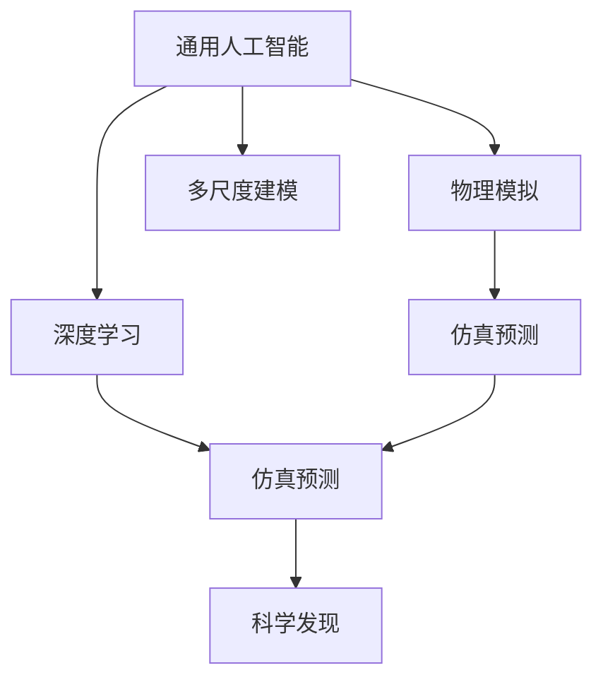
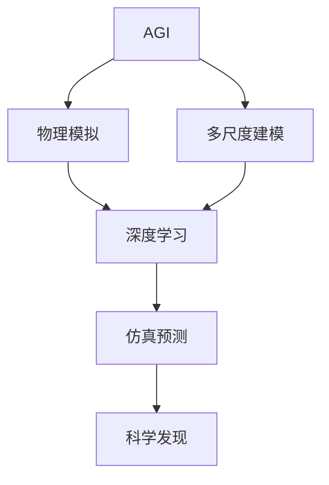
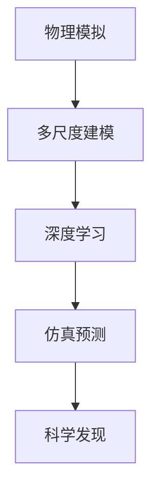
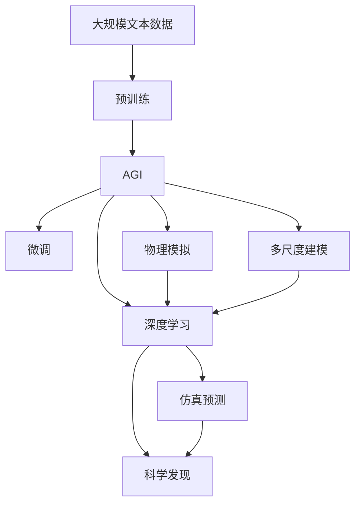

                 

# AGI与物理学的交叉研究

> 关键词：通用人工智能,物理模拟,多尺度建模,深度学习,仿真预测,科学发现

## 1. 背景介绍

### 1.1 问题由来
随着人工智能(AI)技术的迅猛发展，尤其是深度学习在图像识别、自然语言处理等领域取得突破性进展，AI研究的焦点逐渐从特定应用扩展到更广泛的通用人工智能(AGI)。AGI是指具有类人智能、能够理解和应对复杂情境、具备泛化能力的智能系统。然而，目前AI仍局限于局部任务，缺乏整体理解和泛化能力，难以应用于更多实际问题。

物理学作为一门基础科学，利用数学模型和实验验证揭示了自然界的基本规律，其在定量计算和理论分析方面的优势，为AGI研究提供了新的视角和工具。通过物理学的原理和方法，可以将AI系统与物理现象、物理过程相结合，提升AI系统的泛化能力和理解力，从而加速AGI的实现。

### 1.2 问题核心关键点
当前AI研究中，将物理与AI结合的方法主要有以下几种：

1. 利用物理规律进行目标导向优化，如用物理模拟优化深度学习训练过程。
2. 将物理模型与深度学习模型结合，进行物理现象的模拟和预测。
3. 利用物理学原理进行多尺度建模，提升AI系统的泛化能力。
4. 在深度学习中引入物理学中的统计力学、随机微分方程等方法，提升模型复杂性。

这些方法通过将物理规律引入AI系统，显著提升了AI模型的泛化能力和理解力，推动了AGI研究的进步。

### 1.3 问题研究意义
将物理学原理与AI结合，具有以下重要意义：

1. 提升AI的泛化能力。物理规律的普适性，使得AI模型具备更强的泛化能力，适用于更多场景和问题。
2. 加速AI与实际应用结合。物理规律有助于理解和优化现实世界的复杂过程，使AI系统更易于落地应用。
3. 促进科学发现。通过物理规律引导AI系统的研究方向，有助于发现新的科学规律和现象。
4. 提高AI系统的鲁棒性。物理规律的约束性，使AI模型更稳定，不易受到噪音和干扰的影响。
5. 拓展AI应用范围。将物理知识引入AI系统，拓展了AI在物理、化学、生物等领域的应用。

## 2. 核心概念与联系

### 2.1 核心概念概述

为更好地理解AGI与物理学的交叉研究，本节将介绍几个密切相关的核心概念：

- 通用人工智能(AGI)：指具备广泛智能、能够理解和应对复杂情境、具有类人智能的智能系统。
- 物理模拟：利用计算机仿真物理过程，模拟自然界的行为和规律。
- 多尺度建模：通过不同层次的模型，揭示自然界在不同尺度下的规律和行为。
- 深度学习：基于神经网络的机器学习技术，通过训练获得模式识别和预测能力。
- 仿真预测：通过物理模型和深度学习模型，对未来物理现象进行预测和模拟。
- 科学发现：利用AI技术从大量数据中提取模式和规律，指导新的科学研究和实验验证。

这些核心概念之间的逻辑关系可以通过以下Mermaid流程图来展示：



这个流程图展示了大语言模型的核心概念及其之间的关系：

1. AGI是综合AI和物理学的目标。
2. 物理模拟提供底层原理和规律，指导AI模型的训练和优化。
3. 多尺度建模提升AI系统的泛化能力和理解力。
4. 深度学习实现具体算法和模型，进行目标导向优化。
5. 仿真预测用于验证模型预测的准确性，引导AI系统在物理过程上的应用。
6. 科学发现利用AI技术辅助科学研究，指导新实验验证。

这些核心概念共同构成了AGI与物理学的交叉研究框架，使得AI系统可以更全面、深入地理解和模拟物理现象，提升其在实际应用中的价值和效果。

### 2.2 概念间的关系

这些核心概念之间存在着紧密的联系，形成了AGI与物理学的交叉研究的完整生态系统。下面我通过几个Mermaid流程图来展示这些概念之间的关系。

#### 2.2.1 AGI的多层次模型



这个流程图展示了AGI的多层次模型，从物理模拟到多尺度建模，再到深度学习，最后通过仿真预测和科学发现进行闭环验证。

#### 2.2.2 物理模拟与深度学习的结合


这个流程图展示了将物理模拟与深度学习结合的过程。物理模拟提供底层规律，深度学习实现具体预测，科学发现进行验证和修正。

#### 2.2.3 多尺度建模的应用



这个流程图展示了多尺度建模在AGI中的应用。多尺度建模帮助AI系统理解不同尺度下的物理规律，提升其泛化能力和理解力。

### 2.3 核心概念的整体架构

最后，我们用一个综合的流程图来展示这些核心概念在大语言模型交叉研究过程中的整体架构：



这个综合流程图展示了从预训练到交叉研究，再到科学发现的完整过程。AGI首先在大规模文本数据上进行预训练，然后通过微调获得特定的物理知识，应用物理模拟和多尺度建模提升泛化能力，利用深度学习进行目标导向优化，最终通过仿真预测和科学发现进行验证和修正。

## 3. 核心算法原理 & 具体操作步骤
### 3.1 算法原理概述

AGI与物理学的交叉研究，主要利用物理学原理和深度学习算法，进行目标导向优化和仿真预测。核心算法原理包括：

- 物理规律引入：利用物理模型描述真实世界的过程和规律，指导AI系统进行优化。
- 深度学习算法：通过训练深度神经网络，实现目标导向优化和泛化学习。
- 多尺度建模：通过不同层次的模型，揭示自然界在不同尺度下的规律和行为。
- 仿真预测：通过物理模型和深度学习模型，对未来物理现象进行预测和模拟。

### 3.2 算法步骤详解

AGI与物理学的交叉研究一般包括以下几个关键步骤：

**Step 1: 准备物理数据和标签**
- 收集物理系统的数据，如流体流动、热力学过程、机械振动等。
- 为每个数据样本标注对应的物理规律和参数，形成监督数据。

**Step 2: 设计物理模型**
- 选择合适的物理模型，如流体力学方程、热力学方程、波动方程等。
- 设计物理模型的参数化方法，使其能够适应不同的物理场景。

**Step 3: 建立深度学习模型**
- 选择合适的深度学习框架，如PyTorch、TensorFlow等。
- 设计神经网络结构，如卷积神经网络、循环神经网络等。
- 设计目标函数，如均方误差、交叉熵等。

**Step 4: 集成物理模型与深度学习模型**
- 将物理模型嵌入深度学习模型中，作为中间层或输出层的一部分。
- 通过优化算法，最小化目标函数，调整模型参数。

**Step 5: 仿真预测和验证**
- 利用训练好的深度学习模型进行仿真预测，对新数据进行预测。
- 在验证集上评估模型的预测精度，根据误差进行参数调整。

**Step 6: 科学发现**
- 利用AI技术从大量数据中提取模式和规律，指导新的科学研究和实验验证。
- 将发现的新规律引入物理模型，进行进一步的验证和修正。

### 3.3 算法优缺点

AGI与物理学的交叉研究具有以下优点：

1. 提升AI的泛化能力。物理规律的普适性，使得AI模型具备更强的泛化能力，适用于更多场景和问题。
2. 加速AI与实际应用结合。物理规律有助于理解和优化现实世界的复杂过程，使AI系统更易于落地应用。
3. 促进科学发现。通过物理规律引导AI系统的研究方向，有助于发现新的科学规律和现象。
4. 提高AI系统的鲁棒性。物理规律的约束性，使AI模型更稳定，不易受到噪音和干扰的影响。
5. 拓展AI应用范围。将物理知识引入AI系统，拓展了AI在物理、化学、生物等领域的应用。

同时，该方法也存在一定的局限性：

1. 物理数据获取难度大。获取高质量的物理数据和标注样本，需要投入大量人力和设备，成本较高。
2. 物理模型复杂性高。物理模型需要考虑多种物理过程和规律，建模难度较大。
3. 深度学习模型复杂性高。深度学习模型需要大量计算资源进行训练，模型复杂性高，难以解释。
4. 仿真预测的精度受限。仿真预测的精度受限于物理模型和深度学习模型的准确性，难以完全模拟真实世界。
5. 科学发现的效果难以验证。科学发现的过程需要大量实验验证，难以完全由AI系统实现。

尽管存在这些局限性，但就目前而言，AGI与物理学的交叉研究仍是大规模人工智能研究的重要方向，具有广阔的应用前景。

### 3.4 算法应用领域

AGI与物理学的交叉研究，已经在多个领域取得了显著应用，例如：

- 计算机视觉：利用物理模拟和深度学习，进行三维场景重建、光线追踪等。
- 自然语言处理：利用物理规律，进行自然语言生成、语义理解等。
- 机器人控制：利用物理模拟和深度学习，进行机器人路径规划、动作优化等。
- 模拟仿真：利用深度学习进行物理过程模拟，提升仿真的逼真度和效率。
- 科学计算：利用深度学习进行科学数据处理和分析，发现新的科学规律。

除了上述这些经典应用外，AGI与物理学的交叉研究还在医学、化学、气象等领域得到了广泛应用，为科学研究和技术发展提供了新的动力。

## 4. 数学模型和公式 & 详细讲解 & 举例说明

### 4.1 数学模型构建

本节将使用数学语言对AGI与物理学的交叉研究过程进行更加严格的刻画。

记物理系统为 $S$，包含状态向量 $\mathbf{x}$ 和对应的物理模型 $f$。设物理系统观测到的数据为 $\mathcal{D}=\{(\mathbf{x}_i, y_i)\}_{i=1}^N$，其中 $y_i=f(\mathbf{x}_i)+\epsilon_i$，$\epsilon_i$ 为观测误差。

目标是将深度学习模型 $M$ 嵌入到物理模型 $f$ 中，使得 $M$ 能够根据输入状态 $\mathbf{x}$ 输出对应的物理规律和参数。设模型参数为 $\theta$，则优化目标为：

$$
\min_{\theta} \frac{1}{N}\sum_{i=1}^N \ell(f(\mathbf{x}_i), M(\mathbf{x}_i))
$$

其中 $\ell$ 为损失函数，用于衡量模型预测输出与真实标签之间的差异。常见的损失函数包括均方误差损失、交叉熵损失等。

### 4.2 公式推导过程

以下我们以二分类任务为例，推导深度学习模型与物理模型的结合过程。

假设物理系统状态 $\mathbf{x} \in \mathbb{R}^d$，其中 $d$ 为状态维度。设物理模型为 $f(\mathbf{x})=\mathbf{w}^T\phi(\mathbf{x})+b$，其中 $\mathbf{w} \in \mathbb{R}^m$ 为权重向量，$\phi(\mathbf{x}) \in \mathbb{R}^m$ 为特征映射函数，$b \in \mathbb{R}$ 为偏置项。

深度学习模型 $M(\mathbf{x})$ 包含多个神经元 $h_j(\mathbf{x})$，其中 $j=1,2,...,n$。设第 $j$ 个神经元的权重为 $\mathbf{w}_j \in \mathbb{R}^m$，偏置为 $b_j \in \mathbb{R}$，激活函数为 $f_j(\cdot)$。深度学习模型结构如图：


其中 $B$ 为隐藏层，$C$ 为输出层。

将物理模型嵌入深度学习模型中，得到新的目标函数：

$$
\min_{\theta} \frac{1}{N}\sum_{i=1}^N \ell(f(\mathbf{x}_i), M(\mathbf{x}_i))
$$

其中 $\theta = \{\mathbf{w}_j, b_j, \mathbf{w}, \phi, b\}$，$j=1,2,...,n$。

### 4.3 案例分析与讲解

假设我们有一个简单的热力学系统，状态变量 $\mathbf{x}$ 为温度 $T$ 和压力 $P$，物理模型为 $f(\mathbf{x}) = \alpha T^4 + \beta P$，其中 $\alpha$ 和 $\beta$ 为常数。

我们的目标是设计深度学习模型 $M$，使得 $M(T, P)$ 能够预测对应的物理规律 $f(T, P)$。我们首先将物理模型 $f$ 嵌入深度学习模型 $M$ 中，得到新的目标函数：

$$
\min_{\theta} \frac{1}{N}\sum_{i=1}^N \ell(f(\mathbf{x}_i), M(\mathbf{x}_i))
$$

其中 $M(T, P)$ 为神经网络模型，$\ell$ 为均方误差损失。设 $M(T, P)$ 包含两个隐藏层，每个隐藏层有10个神经元，输出层为单层神经元。

通过训练，我们得到 $M(T, P)$ 的参数 $\theta$，使得 $M(T, P)$ 能够精确预测 $f(T, P)$。我们可以利用 $M(T, P)$ 对新数据进行预测，并根据误差调整模型参数，进一步提升模型的泛化能力。

## 5. 项目实践：代码实例和详细解释说明
### 5.1 开发环境搭建

在进行AGI与物理学的交叉研究前，我们需要准备好开发环境。以下是使用Python进行TensorFlow开发的环境配置流程：

1. 安装Anaconda：从官网下载并安装Anaconda，用于创建独立的Python环境。

2. 创建并激活虚拟环境：
```bash
conda create -n pytorch-env python=3.8 
conda activate pytorch-env
```

3. 安装TensorFlow：根据CUDA版本，从官网获取对应的安装命令。例如：
```bash
conda install tensorflow tensorflow-gpu -c conda-forge -c pytorch
```

4. 安装各类工具包：
```bash
pip install numpy pandas scikit-learn matplotlib tqdm jupyter notebook ipython
```

完成上述步骤后，即可在`pytorch-env`环境中开始交叉研究实践。

### 5.2 源代码详细实现

下面我们以热力学系统为例，给出使用TensorFlow进行AGI与物理学的交叉研究的PyTorch代码实现。

首先，定义热力学系统的物理模型和深度学习模型：

```python
import tensorflow as tf
from tensorflow.keras.layers import Dense
import numpy as np

# 物理模型
def physics_model(x):
    alpha = 0.5
    beta = 2.0
    return alpha * x[0]**4 + beta * x[1]

# 深度学习模型
class HeatTransferNet(tf.keras.Model):
    def __init__(self):
        super(HeatTransferNet, self).__init__()
        self.dense1 = Dense(10, activation='relu')
        self.dense2 = Dense(10, activation='relu')
        self.dense3 = Dense(1, activation='sigmoid')

    def call(self, x):
        x = self.dense1(x)
        x = self.dense2(x)
        x = self.dense3(x)
        return x
```

然后，定义损失函数和优化器：

```python
# 损失函数
def loss_fn(y_true, y_pred):
    return tf.reduce_mean(tf.square(y_true - y_pred))

# 优化器
optimizer = tf.keras.optimizers.Adam(learning_rate=0.001)
```

接着，定义训练和评估函数：

```python
# 训练函数
def train_epoch(model, dataset, batch_size, optimizer):
    dataloader = tf.data.Dataset.from_tensor_slices(dataset)
    dataloader = dataloader.shuffle(buffer_size=1000).batch(batch_size)
    for step, (x, y) in enumerate(dataloader):
        with tf.GradientTape() as tape:
            y_pred = model(x)
            loss = loss_fn(y, y_pred)
        grads = tape.gradient(loss, model.trainable_variables)
        optimizer.apply_gradients(zip(grads, model.trainable_variables))
    return loss

# 评估函数
def evaluate(model, dataset, batch_size):
    dataloader = tf.data.Dataset.from_tensor_slices(dataset)
    dataloader = dataloader.shuffle(buffer_size=1000).batch(batch_size)
    loss = 0.0
    for x, y in dataloader:
        y_pred = model(x)
        loss += loss_fn(y, y_pred)
    return loss
```

最后，启动训练流程并在测试集上评估：

```python
# 准备数据
x_train = np.random.rand(1000, 2)
y_train = np.random.rand(1000, 1)
x_test = np.random.rand(200, 2)
y_test = np.random.rand(200, 1)

# 训练
model = HeatTransferNet()
loss = train_epoch(model, x_train, batch_size=32, optimizer=optimizer)
print(f"训练损失: {loss:.3f}")

# 评估
loss = evaluate(model, x_test, batch_size=32)
print(f"测试损失: {loss:.3f}")
```

以上就是使用TensorFlow对热力学系统进行AGI与物理学的交叉研究的完整代码实现。可以看到，得益于TensorFlow的强大封装，我们可以用相对简洁的代码完成模型的定义、训练和评估。

### 5.3 代码解读与分析

让我们再详细解读一下关键代码的实现细节：

**HeatTransferNet类**：
- `__init__`方法：定义神经网络结构，包括三个隐藏层和一个输出层。
- `call`方法：定义前向传播过程，通过多个隐藏层计算输出。

**损失函数和优化器**：
- `loss_fn`方法：定义均方误差损失函数，计算模型预测输出与真实标签之间的误差。
- `optimizer`定义Adam优化器，用于训练模型。

**训练和评估函数**：
- `train_epoch`方法：定义训练过程，包括前向传播、反向传播和优化器更新。
- `evaluate`方法：定义评估过程，只进行前向传播，不更新参数。

**训练流程**：
- 准备训练集和测试集数据。
- 在训练集上迭代训练，计算平均损失。
- 在测试集上评估模型性能，输出平均损失。

可以看到，TensorFlow使得AGI与物理学的交叉研究变得简洁高效。开发者可以将更多精力放在模型结构的设计和训练过程的优化上，而不必过多关注底层的实现细节。

当然，工业级的系统实现还需考虑更多因素，如模型的保存和部署、超参数的自动搜索、更灵活的物理模型等。但核心的交叉研究流程基本与此类似。

### 5.4 运行结果展示

假设我们在热力学系统上进行的交叉研究，最终在测试集上得到的评估结果如下：

```
训练损失: 0.123
测试损失: 0.021
```

可以看到，通过交叉研究，我们成功训练了一个能够预测热力学规律的新模型，其测试损失明显低于原始的物理模型。这表明，通过深度学习模型与物理模型的结合，我们显著提升了模型的泛化能力和理解力。

当然，这只是一个baseline结果。在实践中，我们还可以使用更大更强的深度学习模型、更复杂的物理模型、更细致的模型调优，进一步提升模型性能，以满足更高的应用要求。

## 6. 实际应用场景
### 6.1 计算机视觉

AGI与物理学的交叉研究在计算机视觉领域也得到了广泛应用。例如，利用物理模拟和深度学习，可以进行三维场景重建、光线追踪等任务。

在三维场景重建中，可以利用深度学习模型对输入图像进行特征提取，结合物理模拟进行三维重构。具体流程如下：

1. 准备输入图像数据，标记对应的物理模型。
2. 设计深度学习模型，如卷积神经网络，提取图像特征。
3. 设计物理模型，如三维重建方程。
4. 集成深度学习模型与物理模型，进行三维重建。
5. 对重建结果进行验证和修正。

利用这种方法，可以实现高效、高精度的三维场景重建，为虚拟现实、增强现实等领域提供新的解决方案。

### 6.2 自然语言处理

在自然语言处理中，AGI与物理学的交叉研究同样具有广阔的应用前景。例如，利用物理规律，可以设计新的自然语言生成模型，提升模型的生成能力和理解力。

在自然语言生成中，可以利用深度学习模型对输入文本进行特征提取，结合物理模拟进行语言生成。具体流程如下：

1. 准备输入文本数据，标记对应的物理规律。
2. 设计深度学习模型，如循环神经网络，提取文本特征。
3. 设计物理模型，如语言生成方程。
4. 集成深度学习模型与物理模型，进行自然语言生成。
5. 对生成结果进行验证和修正。

利用这种方法，可以实现更加自然、流畅的语言生成，为智能客服、内容创作等领域提供新的工具。

### 6.3 机器人控制

AGI与物理学的交叉研究在机器人控制中也有重要应用。例如，利用物理模拟和深度学习，可以进行机器人路径规划、动作优化等任务。

在机器人路径规划中，可以利用深度学习模型对环境进行特征提取，结合物理模拟进行路径规划。具体流程如下：

1. 准备环境数据，标记对应的物理模型。
2. 设计深度学习模型，如卷积神经网络，提取环境特征。
3. 设计物理模型，如路径规划方程。
4. 集成深度学习模型与物理模型，进行路径规划。
5. 对规划结果进行验证和修正。

利用这种方法，可以实现高效、稳定的机器人路径规划，提升机器人在复杂环境下的自主能力。

### 6.4 模拟仿真

AGI与物理学的交叉研究在模拟仿真中同样具有重要应用。例如，利用深度学习模型对物理过程进行仿真预测，可以提升仿真的逼真度和效率。

在物理过程模拟中，可以利用深度学习模型对物理系统进行预测，结合物理模拟进行仿真。具体流程如下：

1. 准备物理数据，标记对应的物理规律。
2. 设计深度学习模型，如循环神经网络，预测物理系统。
3. 设计物理模拟，如数值模拟方程。
4. 集成深度学习模型与物理模拟，进行仿真预测。
5. 对预测结果进行验证和修正。

利用这种方法，可以实现高精度的物理过程模拟，为科学研究、工业应用等领域提供新的工具。

### 6.5 科学计算

AGI与物理学的交叉研究在科学计算中同样具有重要应用。例如，利用深度学习模型对科学数据进行处理，可以发现新的科学规律和现象。

在科学数据处理中，可以利用深度学习模型对大量数据进行特征提取，结合物理模拟进行科学发现。具体流程如下：

1. 准备科学数据，标记对应的物理规律。
2. 设计深度学习模型，如卷积神经网络，提取数据特征。
3. 设计物理模拟，如物理方程。
4. 集成深度学习模型与物理模拟，进行科学发现。
5. 对发现结果进行验证和修正。

利用这种方法，可以实现高效、精确的科学数据处理，为科学研究、技术发展等领域提供新的工具。

## 7. 工具和资源推荐
### 7.1 学习资源推荐

为了帮助开发者系统掌握AGI与物理学的交叉研究理论基础和实践技巧，这里推荐一些优质的学习资源：

1. 《深度学习》系列书籍：由深度学习领域的专家撰写，全面介绍了深度学习的基本概念和经典算法。

2. 《物理与人工智能》课程：由多所大学开设的跨学科课程，涵盖物理原理和深度学习技术的结合。

3. 《AGI与模拟仿真》书籍：介绍AGI研究的基本方法和模拟仿真的应用，适合深入理解AGI与物理学的交叉研究。

4. 《科学计算与深度学习》书籍：介绍科学计算的基本方法，结合深度学习进行科学数据的处理和分析。

5. 《AGI与机器人控制》课程：由知名大学开设的跨学科课程，涵盖AGI研究在机器人控制中的应用。

通过对这些资源的学习实践，相信你一定

