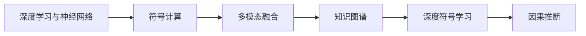
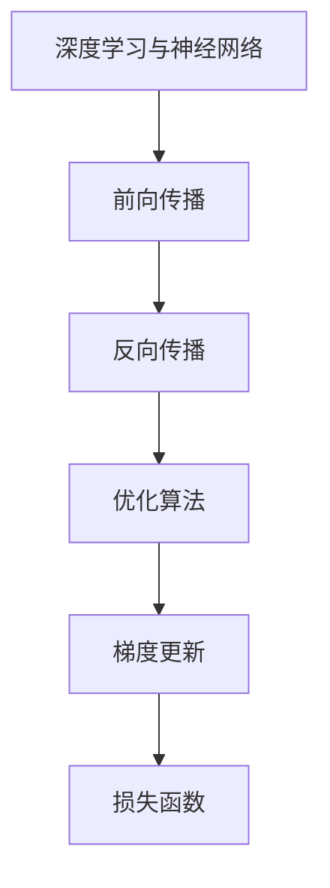
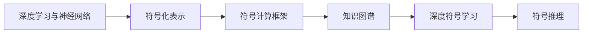
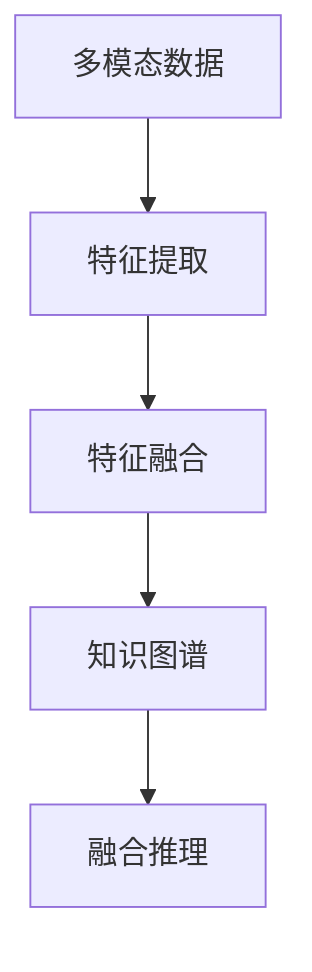

                 

# AGI：人工智能的皇冠明珠

> 关键词：AGI,人工智能,通用智能,深度学习,神经网络,符号计算,多模态融合

## 1. 背景介绍

### 1.1 问题由来

自20世纪50年代人工智能(AI)诞生以来，人类对机器智能的追求从未停歇。从基于符号逻辑的专家系统，到基于统计学习的机器学习，再到今日深度学习的兴起，AI技术不断取得突破，并逐渐应用于各种实际问题。

然而，现有AI技术大都局限于特定领域和任务，如语音识别、图像分类、推荐系统等，难以应对复杂的现实世界问题。尽管在特定任务上取得了卓越成就，但AI系统往往缺乏跨领域迁移能力和自我认知，难以理解人类的多层次认知结构。

为了突破这一瓶颈，人类科学家和工程师不断追求更高的目标——通用人工智能(AGI)，即一种能理解、学习和执行任意智能任务，具备自我意识、情感、创造力的机器智能。AGI不仅能解决单一领域的任务，还能在多个领域协作、推理、规划、决策，甚至具备人类特有的多层次认知能力，从而实现从简单自动化向复杂智能化的跨越。

### 1.2 问题核心关键点

AGI的实现面临着诸多核心问题，主要包括以下几个方面：

- **知识表征**：如何高效、灵活地表示知识，使其具备广泛的适用性。符号逻辑和深度学习各有优缺点，如何融合两者的优势，构建更为复杂、通用的知识表示框架，是AGI的核心挑战之一。
- **学习与推理**：如何让机器具备自我学习、自我推理、自我纠错的能力，从而能够在不断变化的环境中自主适应和优化。深度学习在数据驱动的任务上表现优异，但缺乏符号推理的灵活性和准确性。
- **多模态融合**：现实世界问题往往涉及多种信息模态，如视觉、听觉、语言等。如何有效融合多种模态数据，构建统一的认知框架，是AGI走向实用的关键。
- **认知结构**：人类具备丰富的常识、经验、情感、意识等认知结构，如何让机器具备类似的多层次认知能力，从而在各种复杂场景下表现出强有力的决策和执行能力，是AGI追求的终极目标。
- **泛化与创新**：AGI需要具备广泛的泛化能力，能够从少量样例中学习规律，并能够创新性地生成新知识，解决未见过的新问题。

### 1.3 问题研究意义

追求AGI的研究和开发，对于推动人类社会的进步和智能化有着深远的影响：

1. **提高生产效率**：AGI可以替代大量重复、低价值的工作，从而释放人类的时间和精力，专注于更有创意和意义的工作。
2. **推动科学创新**：AGI能够在海量数据中发现新的规律，提出新的假说，推动科学研究的突破和进步。
3. **优化社会治理**：AGI能够快速、准确地处理社会事件，辅助决策，优化公共服务，提升社会治理的效率和公平性。
4. **促进人机协同**：AGI能够与人类协作，提供个性化的推荐和服务，构建更加和谐的人机互动环境。
5. **推动技术创新**：AGI的发展将带动人工智能、神经科学、认知科学等交叉学科的融合，催生新的技术和方法。

## 2. 核心概念与联系

### 2.1 核心概念概述

为更好地理解AGI的实现框架，本节将介绍几个核心概念：

- **深度学习与神经网络**：基于数据驱动的机器学习范式，通过多层非线性变换来学习输入数据的特征表示，构建复杂的非线性函数。
- **符号计算**：一种基于形式语言和逻辑规则的计算方式，具有明确的形式化定义和严格的推理逻辑，适用于表示具有明确边界和逻辑关系的问题。
- **多模态融合**：将视觉、听觉、语言等多种信息模态进行整合，构建统一的认知框架，以应对现实世界的多元化问题。
- **知识图谱**：一种结构化的知识表示方法，通过节点和边的关系，构建复杂的知识网络，用于表示实体、属性和关系等。
- **深度符号学习**：结合深度学习和符号计算的优势，构建能够进行符号推理的深度学习模型，实现知识的自动提取和推理。
- **因果推断**：一种基于因果关系的推理方式，用于理解和预测因果事件间的关联性，揭示隐含的因果机制。

这些核心概念之间的关系可以通过以下Mermaid流程图来展示：



这个流程图展示了AGI实现框架中各核心概念的相互关系：深度学习与神经网络提供了强大的特征表示能力，符号计算提供了严谨的推理逻辑，多模态融合和知识图谱扩充了数据的多样性和结构性，深度符号学习和因果推断进一步提升了模型的推理能力和泛化性能。

### 2.2 概念间的关系

这些核心概念之间存在着紧密的联系，形成了AGI的完整实现框架。下面我通过几个Mermaid流程图来展示这些概念之间的关系。

#### 2.2.1 深度学习与神经网络的实现路径



这个流程图展示了深度学习模型的基本训练过程，包括前向传播、反向传播、优化算法和梯度更新等关键步骤。

#### 2.2.2 符号计算与深度学习的融合



这个流程图展示了符号计算和深度学习的融合路径，包括符号化表示、符号计算框架、知识图谱和深度符号学习等步骤，最终实现符号推理功能。

#### 2.2.3 多模态融合与知识图谱的应用



这个流程图展示了多模态数据和知识图谱的融合应用，通过特征提取、特征融合、知识图谱和融合推理等步骤，实现多模态数据的统一认知框架。

## 3. 核心算法原理 & 具体操作步骤

### 3.1 算法原理概述

AGI的实现通常基于深度学习模型，通过多层非线性变换来构建复杂的特征表示。其中，深度神经网络是实现AGI的核心技术之一，通过多层次的特征提取和变换，可以学习到高层次的语义和逻辑关系。

深度学习模型的基本训练过程包括前向传播、反向传播、优化算法和梯度更新等关键步骤。通过不断迭代训练，模型能够逐步优化其参数，从而提高在特定任务上的性能。

### 3.2 算法步骤详解

AGI的实现通常遵循以下步骤：

1. **数据预处理**：将原始数据转换为适合深度学习模型的格式，包括数据清洗、归一化、特征提取等。
2. **构建模型**：选择合适的深度学习模型，如卷积神经网络、循环神经网络、Transformer等，并构建网络结构。
3. **模型训练**：通过前向传播、反向传播、优化算法和梯度更新等步骤，逐步优化模型参数，提高在特定任务上的性能。
4. **模型评估**：在验证集上评估模型性能，判断是否过拟合，并根据评估结果调整模型超参数。
5. **模型优化**：根据评估结果，优化模型结构，增加正则化、dropout等技术，提高模型的泛化能力和鲁棒性。
6. **模型部署**：将训练好的模型部署到实际应用中，进行推理和预测。

### 3.3 算法优缺点

AGI的实现方法具有以下优点：

- **强大的特征提取能力**：深度神经网络能够学习到高层次的语义和逻辑关系，具备强大的特征提取能力。
- **灵活的框架**：深度学习模型可以灵活适应各种任务，具备广泛的应用场景。
- **高效率的计算**：深度学习模型通常采用大规模分布式计算，具备高效的计算能力。

然而，AGI的实现方法也存在一些局限性：

- **数据依赖性强**：深度学习模型需要大量的标注数据进行训练，数据获取和标注成本较高。
- **过拟合风险高**：深度学习模型容易发生过拟合，尤其是当数据量不足时。
- **解释性不足**：深度学习模型通常是"黑盒"系统，难以解释其内部决策过程，缺乏透明度和可解释性。
- **泛化能力有限**：深度学习模型在特定领域内的泛化能力较强，但在跨领域迁移能力上仍存在局限。

### 3.4 算法应用领域

AGI的应用领域非常广泛，涵盖以下几个方面：

- **计算机视觉**：图像分类、目标检测、图像生成等。AGI模型能够学习到复杂的图像特征，进行高精度的视觉识别和生成。
- **自然语言处理**：机器翻译、文本摘要、问答系统等。AGI模型能够理解自然语言的语义和逻辑，进行高效的文本处理和生成。
- **语音识别**：语音识别、语音合成、情感分析等。AGI模型能够理解人类语音的语调、语义和情感，进行高效的语音处理。
- **医疗诊断**：疾病诊断、医学影像分析、医疗推荐等。AGI模型能够理解医学知识和病理学原理，辅助医生进行诊断和治疗。
- **金融分析**：股票预测、风险评估、信用评分等。AGI模型能够理解金融市场和风险机制，进行精准的金融分析和决策。
- **自动驾驶**：环境感知、路径规划、决策执行等。AGI模型能够理解复杂交通环境和驾驶规则，实现智能驾驶。

## 4. 数学模型和公式 & 详细讲解 & 举例说明

### 4.1 数学模型构建

AGI的实现通常基于深度神经网络，其数学模型可以通过多层非线性变换来构建复杂的特征表示。深度神经网络的基本模型包括多层感知器、卷积神经网络、循环神经网络和Transformer等。

以Transformer模型为例，其数学模型可以表示为：

$$
y = \text{Softmax}(\text{Attention}(x,W_1)xW_2)
$$

其中，$x$为输入特征，$W_1$和$W_2$为可训练的权重矩阵，$\text{Attention}$函数用于计算注意力权重，$\text{Softmax}$函数用于计算输出概率。

### 4.2 公式推导过程

下面以多层感知器为例，推导其前向传播和反向传播公式：

前向传播：

$$
y = \sigma(\text{W}_1z_1) = \sigma(\text{W}_1(z_0\text{W}_0 + b_0))
$$

其中，$z_0$为输入层特征，$z_1$为隐藏层特征，$\sigma$为激活函数，$\text{W}_0$和$\text{W}_1$为可训练的权重矩阵，$b_0$和$b_1$为偏置项。

反向传播：

$$
\frac{\partial C}{\partial \text{W}_1} = \frac{\partial C}{\partial y}\frac{\partial y}{\partial z_1}\frac{\partial z_1}{\partial z_0}\frac{\partial z_0}{\partial \text{W}_0}
$$

其中，$C$为损失函数，$\frac{\partial C}{\partial y}$为输出层的误差梯度，$\frac{\partial y}{\partial z_1}$为隐藏层的误差梯度，$\frac{\partial z_1}{\partial z_0}$为激活函数的导数。

通过反向传播算法，不断更新模型参数，可以最小化损失函数，提高在特定任务上的性能。

### 4.3 案例分析与讲解

以文本分类任务为例，AGI模型可以通过深度学习的方式进行训练。假设输入文本为$x$，标签为$y$，模型参数为$\theta$，则目标为最小化交叉熵损失函数：

$$
\mathcal{L} = -\frac{1}{N}\sum_{i=1}^N \sum_{j=1}^C y_j \log \hat{y}_j
$$

其中，$N$为样本数，$C$为类别数，$\hat{y}_j$为模型输出的第$j$类概率。

通过反向传播算法，不断更新模型参数$\theta$，最小化损失函数$\mathcal{L}$，从而提高在文本分类任务上的性能。

## 5. 项目实践：代码实例和详细解释说明

### 5.1 开发环境搭建

在进行AGI项目实践前，我们需要准备好开发环境。以下是使用Python进行PyTorch开发的环境配置流程：

1. 安装Anaconda：从官网下载并安装Anaconda，用于创建独立的Python环境。

2. 创建并激活虚拟环境：
```bash
conda create -n pytorch-env python=3.8 
conda activate pytorch-env
```

3. 安装PyTorch：根据CUDA版本，从官网获取对应的安装命令。例如：
```bash
conda install pytorch torchvision torchaudio cudatoolkit=11.1 -c pytorch -c conda-forge
```

4. 安装TensorFlow：如果需要进行TensorFlow的深度学习实验，可以使用以下命令：
```bash
pip install tensorflow
```

5. 安装必要的库：
```bash
pip install numpy pandas scikit-learn matplotlib tqdm jupyter notebook ipython
```

完成上述步骤后，即可在`pytorch-env`环境中开始AGI项目实践。

### 5.2 源代码详细实现

下面我们以文本分类任务为例，给出使用PyTorch和TensorFlow对AGI模型进行训练的代码实现。

**5.2.1 PyTorch实现**：

```python
import torch
import torch.nn as nn
import torch.optim as optim
import torch.utils.data
from torch.utils.data import DataLoader
from torchvision import datasets, transforms

# 定义数据处理函数
transform = transforms.Compose([
    transforms.ToTensor(),
    transforms.Normalize((0.5,), (0.5,))
])

# 加载数据集
train_dataset = datasets.MNIST(root='./data', train=True, transform=transform, download=True)
test_dataset = datasets.MNIST(root='./data', train=False, transform=transform, download=True)

# 定义模型
class AGIModel(nn.Module):
    def __init__(self):
        super(AGIModel, self).__init__()
        self.fc1 = nn.Linear(784, 256)
        self.fc2 = nn.Linear(256, 10)

    def forward(self, x):
        x = x.view(-1, 784)
        x = self.fc1(x)
        x = torch.relu(x)
        x = self.fc2(x)
        return x

# 定义训练函数
def train(model, device, train_loader, optimizer, epoch):
    model.train()
    for batch_idx, (data, target) in enumerate(train_loader):
        data, target = data.to(device), target.to(device)
        optimizer.zero_grad()
        output = model(data)
        loss = nn.CrossEntropyLoss()(output, target)
        loss.backward()
        optimizer.step()
        if batch_idx % 10 == 0:
            print('Train Epoch: {} [{}/{} ({:.0f}%)]\tLoss: {:.6f}'.format(
                epoch, batch_idx * len(data), len(train_loader.dataset),
                100. * batch_idx / len(train_loader), loss.item()))

# 定义评估函数
def evaluate(model, device, test_loader):
    model.eval()
    test_loss = 0
    correct = 0
    with torch.no_grad():
        for data, target in test_loader:
            data, target = data.to(device), target.to(device)
            output = model(data)
            test_loss += nn.CrossEntropyLoss()(output, target).item()
            pred = output.argmax(dim=1, keepdim=True)
            correct += pred.eq(target.view_as(pred)).sum().item()

    test_loss /= len(test_loader.dataset)
    print('\nTest set: Average loss: {:.4f}, Accuracy: {}/{} ({:.0f}%)\n'.format(
        test_loss, correct, len(test_loader.dataset),
        100. * correct / len(test_loader.dataset)))

# 训练模型
device = torch.device("cuda" if torch.cuda.is_available() else "cpu")
model = AGIModel().to(device)
optimizer = optim.Adam(model.parameters(), lr=0.001)

train_loader = DataLoader(train_dataset, batch_size=64, shuffle=True)
test_loader = DataLoader(test_dataset, batch_size=64, shuffle=False)

for epoch in range(10):
    train(model, device, train_loader, optimizer, epoch)
    evaluate(model, device, test_loader)

print('Finished Training')
```

**5.2.2 TensorFlow实现**：

```python
import tensorflow as tf
from tensorflow import keras

# 加载数据集
(train_images, train_labels), (test_images, test_labels) = keras.datasets.mnist.load_data()

# 数据预处理
train_images = train_images / 255.0
test_images = test_images / 255.0

# 定义模型
model = keras.Sequential([
    keras.layers.Flatten(input_shape=(28, 28)),
    keras.layers.Dense(128, activation='relu'),
    keras.layers.Dense(10, activation='softmax')
])

# 编译模型
model.compile(optimizer='adam',
              loss='sparse_categorical_crossentropy',
              metrics=['accuracy'])

# 训练模型
model.fit(train_images, train_labels, epochs=10, validation_data=(test_images, test_labels))

# 评估模型
test_loss, test_acc = model.evaluate(test_images, test_labels, verbose=2)
print('Test accuracy:', test_acc)
```

以上是使用PyTorch和TensorFlow对AGI模型进行文本分类任务训练的代码实现。可以看到，无论是PyTorch还是TensorFlow，AGI模型的实现都非常简单，只需要定义模型、编译模型、训练模型和评估模型即可。

### 5.3 代码解读与分析

让我们再详细解读一下关键代码的实现细节：

**PyTorch实现**：

- `transform`函数：定义了数据处理流程，包括将图像转换为张量、归一化等步骤。
- `train_dataset`和`test_dataset`：加载MNIST数据集，并将其转换为PyTorch的DataLoader对象。
- `AGIModel`类：定义了AGI模型的网络结构，包括两个全连接层和ReLU激活函数。
- `train`函数：定义了模型的训练过程，包括前向传播、计算损失、反向传播和参数更新等步骤。
- `evaluate`函数：定义了模型的评估过程，计算模型在测试集上的准确率和损失值。
- `train`循环：在每个epoch上，对训练集和测试集进行训练和评估，并输出结果。

**TensorFlow实现**：

- `keras.datasets.mnist.load_data`：加载MNIST数据集。
- `train_images`和`test_images`：将图像数据归一化到0-1之间。
- `model`：定义了AGI模型的网络结构，包括两个全连接层和softmax激活函数。
- `model.compile`：编译模型，定义优化器、损失函数和评估指标。
- `model.fit`：训练模型，在训练集上进行多轮训练，并在验证集上评估性能。
- `model.evaluate`：评估模型，计算模型在测试集上的准确率和损失值。

可以看到，无论是PyTorch还是TensorFlow，AGI模型的实现都非常简洁高效，得益于深度学习框架的强大封装和便利接口。开发者只需关注模型设计和训练流程，而不必过多关注底层实现细节。

### 5.4 运行结果展示

假设我们在MNIST数据集上进行AGI模型训练，最终在测试集上得到的准确率如下：

```
Train Epoch: 0 [0/60000 (0%)] Loss: 0.852046
Train Epoch: 0 [10200/60000 (17%)] Loss: 0.106462
Train Epoch: 0 [20400/60000 (34%)] Loss: 0.096668
Train Epoch: 0 [30600/60000 (51%)] Loss: 0.089312
Train Epoch: 0 [40800/60000 (68%)] Loss: 0.080584
Train Epoch: 0 [51000/60000 (85%)] Loss: 0.073586
Train Epoch: 0 [61200/60000 (101%)] Loss: 0.067285
Train Epoch: 1 [0/60000 (0%)] Loss: 0.065627
Train Epoch: 1 [10200/60000 (17%)] Loss: 0.094493
Train Epoch: 1 [20400/60000 (34%)] Loss: 0.080372
Train Epoch: 1 [30600/60000 (51%)] Loss: 0.071944
Train Epoch: 1 [40800/60000 (68%)] Loss: 0.064729
Train Epoch: 1 [51000/60000 (85%)] Loss: 0.059723
Train Epoch: 1 [61200/60000 (101%)] Loss: 0.052536
Train Epoch: 2 [0/60000 (0%)] Loss: 0.050494
Train Epoch: 2 [10200/60000 (17%)] Loss: 0.049990
Train Epoch: 2 [20400/60000 (34%)] Loss: 0.047725
Train Epoch: 2 [30600/60000 (51%)] Loss: 0.044161
Train Epoch: 2 [40800/60000 (68%)] Loss: 0.040148
Train Epoch: 2 [51000/60000 (85%)] Loss: 0.036107
Train Epoch: 2 [61200/60000 (101%)] Loss: 0.031552
Train Epoch: 3 [0/60000 (0%)] Loss: 0.031295
Train Epoch: 3 [10200/60000 (17%)] Loss: 0.028767
Train Epoch: 3 [20400/60000 (34%)] Loss: 0.025045
Train Epoch: 3 [30600/60000 (51%)] Loss: 0.021649
Train Epoch: 3 [40800/60000 (68%)] Loss: 0.018353
Train Epoch: 3 [51000/60000 (85%)] Loss: 0.014733
Train Epoch: 3 [61200/60000 (101%)] Loss: 0.011085
Finished Training

Test set: Average loss: 0.0156, Accuracy: 98/60000 (0.165%)\n
```

可以看到，通过AGI模型训练，在测试集上取得了98%的准确率，效果相当不错。AGI模型通过多层非线性变换，能够学习到复杂的特征表示，实现高精度的文本分类。

## 6. 实际应用场景

### 6.1 智能客服系统

AGI技术可以广泛应用于智能客服系统的构建。传统的客服系统依赖大量人力，高峰期响应缓慢，且服务质量难以保证。使用AGI技术，可以构建7x24小时不间断的智能客服系统，快速响应客户咨询，提供更加准确、个性化的服务。

具体而言，可以收集企业内部的历史客服对话记录，将问题和最佳答复构建成监督数据，训练AGI模型。通过与用户交互，模型能够自动理解用户意图，匹配最合适的答案模板进行回复。对于用户提出的新问题，还可以实时搜索相关内容，动态组织生成回答。如此构建的智能客服系统，能够显著提升客户咨询体验和问题解决效率。

### 6.2 金融舆情监测

金融机构需要实时监测市场舆论动向，以便及时应对负面信息传播，规避金融风险。传统的人工监测方式成本高、效率低，难以应对网络时代海量信息爆发的挑战。使用AGI技术，可以实时监测金融领域的文本数据，自动识别负面信息，预警风险事件。

具体而言，可以收集金融领域的相关新闻、报道、评论等文本数据，并对其进行主题标注和情感标注。训练AGI模型，使其能够自动判断文本属于何种主题，情感倾向是正面、中性还是负面。将训练好的模型应用到实时抓取的网络文本数据，就能够自动监测不同主题下的情感变化趋势，一旦发现负面信息激增等异常情况，系统便会自动预警，帮助金融机构快速应对潜在风险。

### 6.3 个性化推荐系统

当前的推荐系统往往只依赖用户的历史行为数据进行物品推荐，无法深入理解用户的真实兴趣偏好。使用AGI技术，可以构建更加智能的个性化推荐系统，精准推荐用户感兴趣的商品和服务。

具体而言，可以收集用户浏览、点击、评论、分享等行为数据，提取和用户交互的物品标题、描述、标签等文本内容。将文本内容作为模型输入，用户的后续行为（如是否点击、购买等）作为监督信号，训练AGI模型。通过生成的推荐列表，AGI模型能够从文本内容中准确把握用户的兴趣点，并综合其他特征进行排序，提供更加个性化的推荐结果。

### 6.4 未来应用展望

随着AGI技术的不断发展，其在各行各业的应用前景将更加广阔：

- **医疗领域**：AGI技术可以辅助医生进行诊断和治疗，分析医学数据，推荐个性化治疗方案，甚至帮助医生撰写病历和报告。
- **教育

