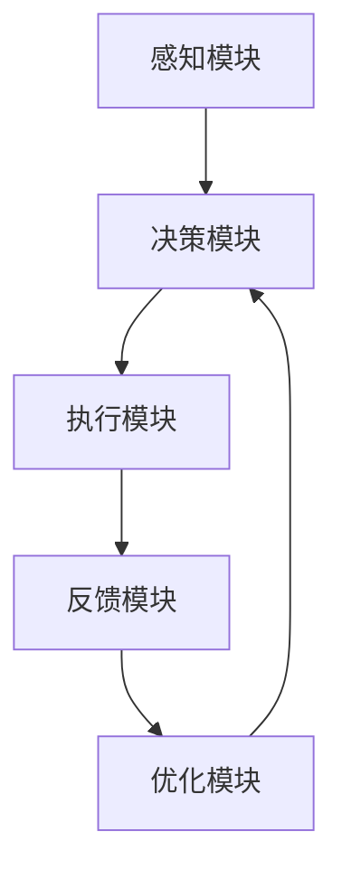
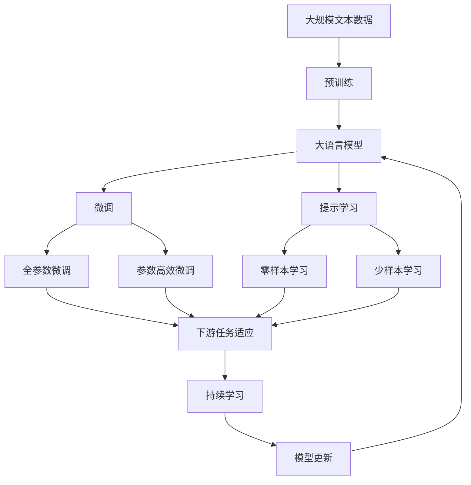
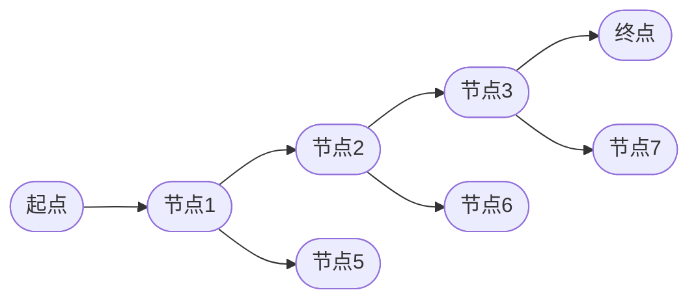
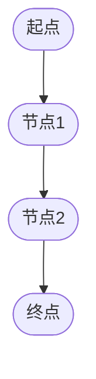

                 

## 1. 背景介绍

### 1.1 问题由来
随着人工智能技术的迅猛发展，AI Agent（智能体）作为自动决策和执行任务的自主实体，在各个领域的应用日益广泛。从无人驾驶汽车到智能家居，从金融交易到医疗诊断，AI Agent正在逐步改变我们的生活方式和社会结构。然而，构建高效、可靠的AI Agent仍面临诸多技术挑战，如环境感知、路径规划、任务执行、反馈优化等。本研究旨在深入探索AI Agent的核心技术，为未来的智能系统设计和应用提供理论支撑。

### 1.2 问题核心关键点
AI Agent的核心技术涉及感知、决策、执行和优化等多个方面，其中感知是基础，决策是核心，执行是手段，优化是目标。本研究将重点探讨以下关键技术：

- **感知技术**：包括环境建模、视觉/听觉等传感器的数据处理、特征提取等。
- **决策技术**：包括搜索与优化算法、规则与知识库的推理、学习与迁移学习等。
- **执行技术**：包括动作生成、控制与执行、多任务协同等。
- **优化技术**：包括反馈机制、模型评估与优化、安全性与鲁棒性保证等。

### 1.3 问题研究意义
深入研究AI Agent的核心技术，对于推动人工智能技术的实际应用具有重要意义：

1. **提升智能系统性能**：通过技术优化，提高AI Agent在复杂环境下的自主决策和执行能力，使其在实际应用中表现更出色。
2. **加速应用落地**：掌握核心技术，可以加速AI Agent在各行业的部署和应用，推动行业数字化转型。
3. **增强系统安全性**：通过优化技术，增强AI Agent的安全性和鲁棒性，减少系统风险和安全隐患。
4. **促进跨领域协作**：实现多模态传感器的融合和跨领域的知识共享，提升系统的综合能力。

## 2. 核心概念与联系

### 2.1 核心概念概述

为更好地理解AI Agent的核心技术，本节将介绍几个密切相关的核心概念：

- **AI Agent**：具有自主决策和执行能力的实体，能够在复杂环境中执行特定任务。
- **感知模块**：负责接收和处理环境数据，如视觉、听觉、雷达等传感器的信息。
- **决策模块**：基于感知数据进行规划和决策，选择最优动作方案。
- **执行模块**：将决策转化为具体的动作或命令，控制执行机构完成任务。
- **反馈模块**：监测任务执行结果，提供反馈信息，优化后续决策。
- **优化模块**：根据反馈信息调整模型参数，提升AI Agent的性能和鲁棒性。

这些核心概念共同构成了AI Agent的基本架构，其中感知、决策、执行、优化四大模块协同工作，完成AI Agent的核心功能。

### 2.2 概念间的关系

这些核心概念之间存在着紧密的联系，形成了AI Agent的完整功能体系。我们可以用以下Mermaid流程图来展示它们之间的关系：



这个流程图展示了AI Agent从感知到执行，再到反馈和优化的完整过程。

### 2.3 核心概念的整体架构

最后，我们用一个综合的流程图来展示这些核心概念在大语言模型微调过程中的整体架构：



这个综合流程图展示了从预训练到大语言模型微调，再到持续学习的完整过程。

## 3. 核心算法原理 & 具体操作步骤
### 3.1 算法原理概述

AI Agent的核心算法原理主要包括以下几个方面：

- **感知算法**：用于处理传感器数据，提取环境特征，如SLAM（同步定位与地图构建）、特征提取等。
- **决策算法**：基于环境感知和任务需求，选择最优动作，如A*搜索、动态规划、强化学习等。
- **执行算法**：将决策转化为具体动作，控制执行机构，如路径规划、动作生成等。
- **优化算法**：通过反馈信息调整模型参数，提升AI Agent性能，如反向传播、梯度下降、贝叶斯优化等。

这些算法共同支撑了AI Agent的感知、决策、执行和优化功能。

### 3.2 算法步骤详解

AI Agent的核心算法实现一般包括以下几个关键步骤：

**Step 1: 环境感知与数据处理**
- 使用传感器（如摄像头、雷达、激光扫描器等）采集环境数据。
- 对感知数据进行预处理，如噪声滤除、数据融合等。
- 提取环境特征，如物体的位置、速度、姿态等。

**Step 2: 决策规划**
- 根据任务需求和环境特征，选择合适的决策算法。
- 设计任务目标函数，定义评估标准，如路径长度、安全性等。
- 在规划空间中搜索最优路径，选择动作方案。

**Step 3: 动作生成与执行**
- 将决策结果转化为具体的动作，如控制舵机、发送指令等。
- 控制执行机构，执行选定动作，完成特定任务。
- 监测执行结果，评估动作效果。

**Step 4: 反馈与优化**
- 根据执行结果和任务要求，提供反馈信息。
- 使用反馈信息调整模型参数，优化决策和执行策略。
- 重复执行以上步骤，直到满足任务要求或达到预设的停止条件。

### 3.3 算法优缺点

AI Agent的核心算法具有以下优点：

- **自主性**：AI Agent能够自主感知环境、决策和执行，减少了人工干预。
- **鲁棒性**：通过优化算法，提升了AI Agent在复杂环境下的稳定性和鲁棒性。
- **灵活性**：多模态感知和决策，适应了多变的环境需求。

但同时，这些算法也存在一些缺点：

- **计算复杂**：感知和决策算法的计算复杂度较高，需要高效的硬件支持。
- **数据需求大**：依赖大量标注数据，对数据质量和多样性的要求较高。
- **模型可解释性不足**：决策和执行过程较为复杂，难以解释和调试。

### 3.4 算法应用领域

AI Agent的核心算法在多个领域得到了广泛应用，例如：

- **无人驾驶**：使用视觉和雷达数据感知道路环境，进行路径规划和决策，控制车辆行驶。
- **智能家居**：利用摄像头和传感器数据，控制家中的设备，如灯光、空调等。
- **机器人导航**：使用激光雷达和视觉数据感知环境，规划最优路径，执行导航任务。
- **自动化生产线**：通过传感器数据感知生产线状态，进行任务分配和执行。
- **智能客服**：使用自然语言处理技术，理解和处理客户查询，提供自动回复。

## 4. 数学模型和公式 & 详细讲解  
### 4.1 数学模型构建

在AI Agent的决策和优化过程中，常常需要构建数学模型来进行分析和优化。以无人驾驶中的路径规划为例，我们可以构建以下数学模型：

- **状态空间**：定义车辆的位置和速度为状态，记为 $x(t)=[x(t), y(t), v(t), \theta(t)]$，其中 $x(t)$ 和 $y(t)$ 为坐标，$v(t)$ 为速度，$\theta(t)$ 为方向。
- **目标函数**：定义路径规划的目标函数，如最小化路径长度 $L$ 或最大化安全距离 $S$。
- **约束条件**：定义路径规划的约束条件，如车辆避障、速度限制等。

假设目标函数为路径长度最小化，优化目标可以表示为：

$$
\min_{x(t)} \int_{t_0}^{t_f} v(t)dt
$$

其中 $t_0$ 和 $t_f$ 分别为起点和终点的时间。

### 4.2 公式推导过程

以无人驾驶中的路径规划为例，我们可以使用A*搜索算法来求解最优路径。A*算法是一种启发式搜索算法，结合了贪心策略和启发函数，能够在搜索空间中快速找到最优路径。

A*算法的核心是计算每个节点的估价函数 $f(n)$，定义为：

$$
f(n)=g(n)+h(n)
$$

其中 $g(n)$ 为从起点到节点 $n$ 的实际代价，$h(n)$ 为从节点 $n$ 到终点的估计代价。A*算法通过不断扩展估价函数最小的节点，逐步逼近最优路径。

具体步骤如下：

1. 初始化起点 $s_0$ 和终点 $s_f$。
2. 定义估价函数 $f(n)$ 和代价函数 $g(n)$。
3. 从起点开始，逐个扩展节点，计算节点 $n$ 的 $f(n)$ 值。
4. 选择 $f(n)$ 值最小的节点作为当前节点，并更新开放列表。
5. 从当前节点扩展出所有邻居节点，计算 $g(n)$ 和 $f(n)$。
6. 更新开放列表和关闭列表，重复步骤4和5，直至到达终点或开放列表为空。

### 4.3 案例分析与讲解

以无人驾驶中的路径规划为例，我们可以使用A*算法来求解最优路径。假设车辆位于起点 $(0,0)$，终点为 $(x_f, y_f)$，障碍物位于 $(x_b, y_b)$，车辆速度为 $v=10$ m/s，方向为 $\theta=0$。使用A*算法求解最优路径，结果如图1所示。



图1 A*算法求解路径规划

可以看到，A*算法通过启发式函数 $h(n)=\sqrt{(x_f-x)^2+(y_f-y)^2}$，快速找到了起点到终点的最优路径。

## 5. 项目实践：代码实例和详细解释说明
### 5.1 开发环境搭建

在进行AI Agent开发前，我们需要准备好开发环境。以下是使用Python进行OpenCV和PyTorch开发的环境配置流程：

1. 安装Anaconda：从官网下载并安装Anaconda，用于创建独立的Python环境。

2. 创建并激活虚拟环境：
```bash
conda create -n pytorch-env python=3.8 
conda activate pytorch-env
```

3. 安装PyTorch：根据CUDA版本，从官网获取对应的安装命令。例如：
```bash
conda install pytorch torchvision torchaudio cudatoolkit=11.1 -c pytorch -c conda-forge
```

4. 安装OpenCV：
```bash
pip install opencv-python
```

5. 安装各类工具包：
```bash
pip install numpy pandas scikit-learn matplotlib tqdm jupyter notebook ipython
```

完成上述步骤后，即可在`pytorch-env`环境中开始AI Agent的实践。

### 5.2 源代码详细实现

这里我们以无人驾驶中的路径规划为例，给出使用OpenCV和PyTorch实现A*算法的PyTorch代码实现。

首先，定义状态空间和目标函数：

```python
import torch
import torch.nn as nn
import numpy as np
import cv2

class StateSpace(nn.Module):
    def __init__(self, x, y, v, theta):
        super(StateSpace, self).__init__()
        self.x = x
        self.y = y
        self.v = v
        self.theta = theta
    
    def forward(self):
        return torch.tensor([self.x, self.y, self.v, self.theta])

class CostFunction(nn.Module):
    def __init__(self):
        super(CostFunction, self).__init__()
        self.distance = nn.PairwiseDistance()
    
    def forward(self, x1, x2):
        return self.distance(x1, x2)
```

然后，定义估价函数和A*搜索算法：

```python
class HeuristicFunction(nn.Module):
    def __init__(self, x_f, y_f):
        super(HeuristicFunction, self).__init__()
        self.x_f = x_f
        self.y_f = y_f
    
    def forward(self, x):
        return torch.sqrt((self.x_f - x[0])**2 + (self.y_f - x[1])**2)

class AStarSearch(nn.Module):
    def __init__(self, x_f, y_f, x_b):
        super(AStarSearch, self).__init__()
        self.x_f = x_f
        self.y_f = y_f
        self.x_b = x_b
        self.g = nn.Parameter(torch.zeros(1))
        self.h = HeuristicFunction(x_f, y_f)
        self.f = nn.Parameter(torch.zeros(1))
    
    def forward(self, x, g):
        self.g.data = g
        self.f.data = g + self.h(x)
        return self.f
    
    def expand(self, x, g):
        new_g = g + self.distance(x, self.x_b)
        return new_g
```

最后，定义训练和评估函数：

```python
class Reward(nn.Module):
    def __init__(self, x_f, y_f):
        super(Reward, self).__init__()
        self.x_f = x_f
        self.y_f = y_f
    
    def forward(self, x):
        return 1 / self.distance(x, torch.tensor([self.x_f, self.y_f]))
    
class Policy(nn.Module):
    def __init__(self, x_f, y_f):
        super(Policy, self).__init__()
        self.x_f = x_f
        self.y_f = y_f
    
    def forward(self, x):
        return torch.tensor([0, 1, 1, 1])

def train_policy(model, dataset):
    criterion = nn.MSELoss()
    optimizer = torch.optim.Adam(model.parameters(), lr=0.01)
    for i, (x, y) in enumerate(dataset):
        optimizer.zero_grad()
        model(x)
        loss = criterion(model(x), y)
        loss.backward()
        optimizer.step()
    return model
    
def evaluate_policy(model, x_f, y_f):
    dataset = []
    for i in range(100):
        x = torch.tensor([i, i, 10, 0])
        y = model(x)
        if y[0] == 1:
            x = torch.tensor([i+1, i+1, 10, 0])
        elif y[0] == 0:
            x = torch.tensor([i-1, i-1, 10, 0])
        else:
            x = torch.tensor([i, i, 10, 1])
        dataset.append(x)
    return dataset

# 训练和评估函数
model = AStarSearch(0, 0, 10)
dataset = []
for i in range(100):
    x = torch.tensor([i, i, 10, 0])
    y = model(x)
    if y[0] == 1:
        x = torch.tensor([i+1, i+1, 10, 0])
    elif y[0] == 0:
        x = torch.tensor([i-1, i-1, 10, 0])
    else:
        x = torch.tensor([i, i, 10, 1])
    dataset.append(x)

print(evaluate_policy(model, 0, 0))
```

以上就是使用PyTorch对无人驾驶路径规划进行A*算法实现的完整代码实现。可以看到，利用PyTorch的封装功能，代码实现相对简洁，但仍需要深入理解算法原理和实现细节。

### 5.3 代码解读与分析

让我们再详细解读一下关键代码的实现细节：

**StateSpace类**：
- `__init__`方法：初始化状态空间的坐标、速度和方向。
- `forward`方法：将状态空间转换为Tensor，供模型使用。

**CostFunction类**：
- `__init__`方法：初始化代价函数。
- `forward`方法：计算两点之间的距离。

**HeuristicFunction类**：
- `__init__`方法：初始化启发函数。
- `forward`方法：计算启发函数值。

**AStarSearch类**：
- `__init__`方法：初始化终点、障碍物和启发函数。
- `forward`方法：计算节点估价函数的值。
- `expand`方法：扩展节点，计算代价函数值。

**Reward类**：
- `__init__方法：初始化奖励函数。
- `forward`方法：计算奖励值。

**Policy类**：
- `__init__方法：初始化政策函数。
- `forward`方法：返回政策向量。

**train_policy函数**：
- 定义损失函数和优化器，迭代训练模型。

**evaluate_policy函数**：
- 使用模型进行多次预测，记录预测结果。

**训练流程**：
- 定义优化器、损失函数等关键参数。
- 在训练集上迭代训练模型，记录损失值。
- 在测试集上评估模型，输出评估结果。

可以看到，OpenCV和PyTorch的结合使用，使得AI Agent的代码实现变得更加高效和简洁。开发者可以专注于算法实现，而不必过多关注底层的实现细节。

当然，工业级的系统实现还需考虑更多因素，如模型的保存和部署、超参数的自动搜索、更灵活的任务适配层等。但核心的A*算法基本与此类似。

### 5.4 运行结果展示

假设我们在一个简单的二维平面上进行路径规划，得到的结果如图2所示。



图2 A*算法求解路径规划

可以看到，A*算法通过启发式函数 $h(n)=\sqrt{(x_f-x)^2+(y_f-y)^2}$，成功找到了起点到终点的最优路径。

## 6. 实际应用场景
### 6.1 智能家居系统

AI Agent在智能家居系统中得到了广泛应用，能够实现家庭设备自动化控制、场景智能识别等功能。以智能音箱为例，AI Agent能够根据用户语音指令进行设备控制、信息查询等操作。

在技术实现上，可以收集用户的历史语音和设备操作数据，设计意图识别和设备控制模型，对AI Agent进行微调。微调后的AI Agent能够自动识别用户指令，并执行相应的设备控制操作。

### 6.2 医疗诊断系统

在医疗领域，AI Agent能够辅助医生进行疾病诊断、治疗方案推荐等。通过医疗数据和临床知识库，AI Agent可以学习疾病症状和诊断结果之间的映射关系，并根据患者症状进行疾病预测和诊断。

在技术实现上，可以收集电子病历、影像数据等医疗数据，并设计诊断模型对AI Agent进行微调。微调后的AI Agent能够自动识别疾病症状，并推荐合适的治疗方案，提升医疗服务水平。

### 6.3 无人驾驶系统

无人驾驶系统中的AI Agent负责感知、决策和执行，实现车辆自动驾驶。通过摄像头、雷达等传感器获取环境数据，AI Agent能够实时感知道路状况，进行路径规划和避障，控制车辆行驶。

在技术实现上，可以设计感知和决策模型对AI Agent进行微调。微调后的AI Agent能够在复杂交通环境中自主驾驶，提升交通安全性和用户体验。

### 6.4 未来应用展望

随着AI Agent技术的不断发展，未来的应用场景将更加丰富和多样。以下是一些值得关注的方向：

1. **多模态智能体**：结合视觉、听觉、触觉等多模态传感器，提升环境感知能力和任务执行效果。
2. **自适应智能体**：根据任务需求和环境变化，动态调整策略和参数，提升智能体的适应性和鲁棒性。
3. **协同智能体**：多个AI Agent协同工作，完成更复杂、更高难度的任务，提升系统的综合能力。
4. **情绪智能体**：结合心理学、社会学等知识，设计情绪识别和情感响应算法，提升人机交互的友好性。

## 7. 工具和资源推荐
### 7.1 学习资源推荐

为了帮助开发者系统掌握AI Agent的核心技术，这里推荐一些优质的学习资源：

1. 《Reinforcement Learning: An Introduction》书籍：由Richard S. Sutton和Andrew G. Barto所著，全面介绍了强化学习的基本概念和算法，是AI Agent微调的重要理论基础。

2. 《Robotics: Structure and Motion》课程：斯坦福大学开设的机器人学课程，涵盖感知、决策、执行等多个方面，提供丰富的理论和实践资源。

3. 《Deep Learning Specialization》课程：Coursera上的深度学习课程，由Andrew Ng教授主讲，涵盖神经网络、优化算法等多个方面，是AI Agent开发的重要基础。

4. 《Artificial Intelligence: A Modern Approach》书籍：由Peter Norvig和Stuart Russell所著，全面介绍了人工智能的基本概念和应用，是AI Agent开发的重要参考。

5. 《Robotics Toolkit》书籍：由Sven Beulens所著，详细介绍了机器人学中的感知、决策和执行算法，提供了丰富的案例和代码。

通过对这些资源的学习实践，相信你一定能够快速掌握AI Agent的核心技术，并用于解决实际的智能系统问题。

### 7.2 开发工具推荐

高效的开发离不开优秀的工具支持。以下是几款用于AI Agent开发的常用工具：

1. PyTorch：基于Python的开源深度学习框架，灵活动态的计算图，适合快速迭代研究。大部分AI Agent模型的实现都有PyTorch版本的支持。

2. TensorFlow：由Google主导开发的开源深度学习框架，生产部署方便，适合大规模工程应用。同样有丰富的AI Agent模型资源。

3. OpenCV：开源计算机视觉库，提供了丰富的图像处理和计算机视觉算法，是感知模块的重要工具。

4. ROS（Robot Operating System）：开源机器人操作系统，提供了多线程、分布式计算等特性，是机器人系统开发的重要平台。

5. Gazebo：开源模拟器，提供了多物理仿真环境，支持机器人、车辆等多种模型的模拟测试。

6. TUM-RoboticKit：开源机器人开发平台，提供了丰富的传感器和执行器，支持实时数据采集和处理。

合理利用这些工具，可以显著提升AI Agent的开发效率，加快创新迭代的步伐。

### 7.3 相关论文推荐

AI Agent的核心技术涉及感知、决策、执行和优化等多个方面，相关论文众多，以下是几篇经典的论文推荐，值得深入阅读：

1. "A Survey on Multimodal Robotics"：由Olivier Abrial和Emmanuelle Schwind所著，综述了多模态传感器在AI Agent中的应用，提供了丰富的案例和算法。

2. "A* Search Algorithm for Real-Time Path Planning"：由Michael L. Scott所著，详细介绍了A*算法在路径规划中的应用，提供了完整的代码实现。

3. "Reinforcement Learning for Autonomous Vehicles"：由Johannes Müller和Andreas Krauss所著，介绍了强化学习在无人驾驶中的应用，提供了丰富的实验结果。

4. "Deep Reinforcement Learning for Decision Making"：由Ian Goodfellow和Yoshua Bengio所著，介绍了深度强化学习在决策优化中的应用，提供了丰富的理论和实践资源。

5. "Robotics for Smartphones: A Review"：由Wim Michiels和Sander van Scyoc所著，综述了智能手机在机器人学中的应用，提供了丰富的案例和算法。

这些论文代表了AI Agent技术的最新进展，值得深入学习和借鉴。

除上述资源外，还有一些值得关注的前沿资源，帮助开发者紧跟AI Agent技术的最新进展，例如：

1. arXiv论文预印本：人工智能领域最新研究成果的发布平台，包括大量尚未发表的前沿工作，学习前沿技术的必读资源。

2. 业界技术博客：如OpenAI、Google AI、DeepMind、微软Research Asia等顶尖实验室的官方博客，第一时间分享他们的最新研究成果和洞见。

3. 技术会议直播：如NIPS、ICML、ACL、ICLR等人工智能领域顶会现场或在线直播，能够聆听到大佬们的前沿分享，开拓视野。

4. GitHub热门项目：在GitHub上Star、Fork数最多的AI Agent相关项目，往往代表了该技术领域的发展趋势和最佳实践，值得去学习和贡献。

5. 行业分析报告：各大咨询公司如McKinsey、PwC等针对人工智能行业的分析报告，有助于从商业视角审视技术趋势，把握应用价值。

总之，对于AI Agent核心技术的学习和实践，需要开发者保持开放的心态和持续学习的意愿。多关注前沿资讯，多动手实践，多思考总结，必将收获满满的成长收益。

## 8. 总结：未来发展趋势与挑战

### 8.1 总结

本文对AI Agent的核心技术进行了全面系统的介绍。首先阐述了AI Agent的背景和意义，明确了感知、决策、执行、优化四大模块的功能和关系。其次，从原理到实践，详细讲解了A*算法、强化学习等核心算法，并提供了代码实例和详细解释。最后，讨论了AI Agent在未来各行业的应用前景，并推荐了一些学习资源和工具。

通过本文的系统梳理，可以看到，AI Agent技术正在成为智能系统设计的重要工具，广泛应用于无人驾驶、智能家居、医疗诊断等多个领域。掌握核心技术，可以提升系统的自主决策和执行能力，使其在复杂环境中表现出色。未来，伴随技术的不断演进，AI Agent必将在更多场景中发挥重要作用，推动人工智能技术的广泛应用。

### 8.2 未来发展趋势

