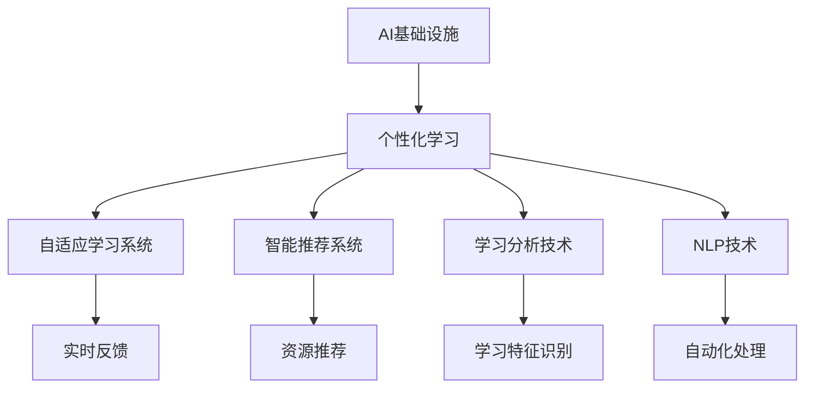
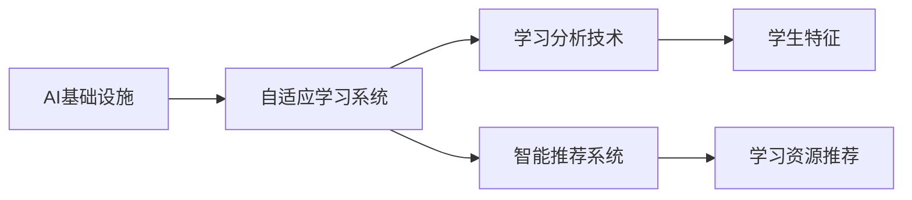
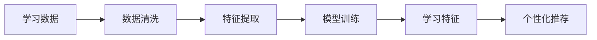
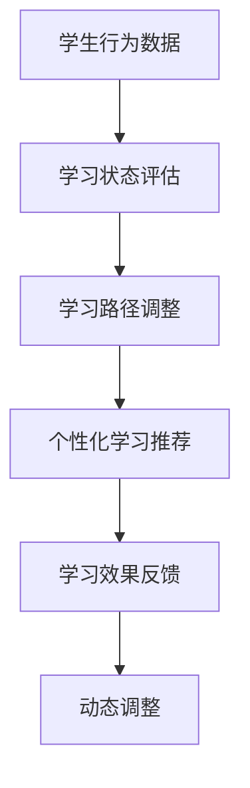
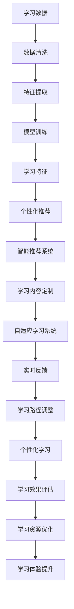

                 

# AI 基础设施的教育变革：个性化学习的技术支撑

在人工智能飞速发展的今天，AI基础设施的教育变革正在发生深刻的转变。个性化学习作为一种全新的教育方式，正在逐步进入教育系统的核心。本文将从背景介绍、核心概念、算法原理、项目实践、应用场景、工具和资源推荐、总结与发展趋势、常见问题解答等多个方面，详细阐述AI基础设施在个性化学习中的技术支撑，以及如何通过AI技术实现更加灵活、高效、个性化的学习体验。

## 1. 背景介绍

随着数字化和信息化的不断深入，教育领域正在经历一场深刻的变革。传统的标准化教育模式已经无法满足不同学生的多样化需求，个性化学习逐渐成为教育发展的趋势。个性化学习旨在根据学生的学习能力和需求，量身定制个性化的学习内容和路径，以实现更高效、更有针对性的学习效果。在这一过程中，AI基础设施提供了强有力的技术支撑。

### 1.1 问题由来
当前教育系统面临的主要问题是学生的差异化需求无法得到满足，传统的一刀切式教育模式无法应对每个学生的个性化需求。个性化学习通过AI技术，可以更精准地分析和识别每个学生的学习风格、优势和劣势，从而提供个性化的教学内容和学习路径，显著提升学习效率和效果。

### 1.2 问题核心关键点
个性化学习的核心在于通过数据分析、机器学习和自然语言处理等AI技术，实现对学生的精准评估和个性化推荐。AI基础设施在这一过程中，起到了关键的技术支撑作用。具体而言，个性化学习涉及以下几个关键点：
- 数据收集：通过智能设备、在线平台等方式，收集学生的学习数据，包括学习行为、知识掌握情况、兴趣偏好等。
- 数据分析：利用AI技术对学习数据进行分析，识别学生的学习特征和模式。
- 个性化推荐：根据分析结果，生成个性化的学习内容、推荐路径和教学策略。
- 实时反馈：通过AI技术实现对学生学习过程的实时监控和反馈，调整教学策略。

### 1.3 问题研究意义
个性化学习在教育领域的应用，对于提升学生的学习效果、优化教育资源配置、促进教育公平具有重要意义。通过AI技术支撑，个性化学习可以：
- 提高学习效率：根据学生的学习特点和需求，定制个性化的学习内容，避免浪费时间和精力在不适合的内容上。
- 提升学习体验：通过丰富的交互和反馈，激发学生的学习兴趣和积极性。
- 优化资源配置：通过智能推荐系统，优化教育资源的分配和使用，实现资源的最高效利用。
- 促进教育公平：通过精准评估和个性化推荐，缩小学生之间的学习差距，实现教育公平。

## 2. 核心概念与联系

### 2.1 核心概念概述

为了更好地理解AI基础设施在个性化学习中的技术支撑，本节将介绍几个密切相关的核心概念：

- AI基础设施：包括硬件设备和软件平台，如高性能计算集群、大数据分析平台、云计算服务、自然语言处理工具等。
- 个性化学习：根据学生的个性化需求和学习特点，量身定制个性化的学习内容和路径。
- 自适应学习系统：通过AI技术实现对学生学习过程的实时监控和反馈，动态调整教学策略。
- 智能推荐系统：利用数据分析和机器学习技术，对学习资源进行推荐，提高学习效率。
- 学习分析技术：通过对学习数据进行分析，识别学生的学习特征和模式，指导个性化学习。
- 自然语言处理(NLP)：通过语言理解和生成技术，实现对学习数据的自动化处理和分析。

这些核心概念之间的逻辑关系可以通过以下Mermaid流程图来展示：



这个流程图展示了个性化学习过程中各关键组件之间的相互关系：

1. AI基础设施提供技术支持，支撑个性化学习系统的实现。
2. 个性化学习系统通过自适应学习系统和智能推荐系统，实现对学生学习过程的实时监控和个性化推荐。
3. 学习分析技术从学生的学习数据中提取特征和模式，指导个性化推荐。
4. NLP技术对文本数据进行自动化处理和分析，提供更加精准的数据支持。

### 2.2 概念间的关系

这些核心概念之间存在着紧密的联系，形成了个性化学习的基础设施框架。下面我们通过几个Mermaid流程图来展示这些概念之间的关系。

#### 2.2.1 个性化学习的基础架构



这个流程图展示了个性化学习的基础架构，包括自适应学习系统、学习分析技术和智能推荐系统，以及它们与AI基础设施的联系。

#### 2.2.2 学习分析技术的核心逻辑



这个流程图展示了学习分析技术的核心逻辑：从学习数据中提取特征和模式，训练模型，生成个性化的学习内容。

#### 2.2.3 自适应学习系统的实现流程



这个流程图展示了自适应学习系统的实现流程：通过实时监控学生的学习状态，动态调整学习路径和内容。

### 2.3 核心概念的整体架构

最后，我们用一个综合的流程图来展示这些核心概念在大语言模型微调过程中的整体架构：



这个综合流程图展示了从学习数据到个性化学习的全过程，包括数据清洗、特征提取、模型训练、学习特征识别、智能推荐系统、学习内容定制、自适应学习系统、实时反馈、学习路径调整、个性化学习、学习效果评估、学习资源优化和学习体验提升等关键环节。

## 3. 核心算法原理 & 具体操作步骤
### 3.1 算法原理概述

基于AI基础设施的个性化学习，主要依赖于数据分析、机器学习和自然语言处理等核心算法。其核心思想是通过对学生学习数据的深入分析，生成个性化的学习路径和内容，以实现高效、个性化的学习效果。

具体而言，个性化学习的算法原理包括以下几个关键步骤：

1. **数据收集**：通过智能设备、在线平台等方式，收集学生的学习数据，包括学习行为、知识掌握情况、兴趣偏好等。
2. **数据分析**：利用机器学习算法对学习数据进行分析，识别学生的学习特征和模式。
3. **个性化推荐**：根据分析结果，生成个性化的学习内容、推荐路径和教学策略。
4. **实时反馈**：通过AI技术实现对学生学习过程的实时监控和反馈，调整教学策略。

### 3.2 算法步骤详解

基于AI基础设施的个性化学习，通常包括以下几个关键步骤：

**Step 1: 数据收集与预处理**
- 收集学生的学习数据，包括学习行为、知识掌握情况、兴趣偏好等。
- 对数据进行清洗和预处理，去除噪声和异常值，确保数据质量。

**Step 2: 特征提取与学习路径生成**
- 利用机器学习算法提取学生的学习特征，如知识掌握水平、学习速度、兴趣偏好等。
- 根据特征生成个性化的学习路径，包括学习内容的顺序、学习时长、学习难度等。

**Step 3: 学习内容推荐与动态调整**
- 根据学习路径和学生反馈，生成个性化的学习内容推荐。
- 实时监控学生的学习状态，动态调整学习内容和路径，以适应学生的学习进度和需求。

**Step 4: 学习效果评估与优化**
- 对学生的学习效果进行评估，包括知识掌握情况、学习兴趣、学习进度等。
- 根据评估结果，优化学习内容和学习路径，确保学习效果最大化。

### 3.3 算法优缺点

基于AI基础设施的个性化学习算法具有以下优点：

1. **高效性**：通过机器学习算法和自适应系统，可以实现对学生学习过程的实时监控和调整，显著提升学习效率。
2. **个性化**：根据学生的学习特征和需求，生成个性化的学习路径和内容，满足不同学生的多样化需求。
3. **自适应**：通过实时反馈和学习调整，动态优化学习过程，提升学习效果。

同时，该算法也存在一些缺点：

1. **数据依赖**：算法的性能高度依赖于数据的准确性和全面性，数据质量不佳可能导致误判。
2. **隐私风险**：学生数据的收集和处理可能带来隐私风险，需要采取有效的数据保护措施。
3. **复杂性**：算法的实现涉及多个环节和多种技术，复杂度较高。
4. **资源消耗**：算法的运行需要高性能计算资源和大数据平台，成本较高。

### 3.4 算法应用领域

基于AI基础设施的个性化学习算法，已经在多个领域得到了广泛应用，例如：

- **K-12教育**：通过个性化学习系统，为中小学生提供个性化学习内容和路径，提升学习效果。
- **高等教育**：利用自适应学习系统，为大学生提供个性化的学习支持，优化学习体验。
- **职业培训**：通过智能推荐系统，为职业培训提供个性化的学习资源和路径，提高培训效果。
- **终身学习**：利用自适应学习系统，为成人学习者提供个性化的学习支持，满足多样化学习需求。

## 4. 数学模型和公式 & 详细讲解 & 举例说明

### 4.1 数学模型构建

为了更好地理解基于AI基础设施的个性化学习算法，我们将通过数学模型来详细阐述其核心逻辑。

设学生 $S$ 的学习数据为 $\{X_i, Y_i\}_{i=1}^N$，其中 $X_i$ 表示第 $i$ 个学习行为数据，$Y_i$ 表示对应的学习效果数据。个性化学习的目标是通过机器学习算法，生成个性化的学习路径和内容，以最大化学生的学习效果 $Z$。

数学模型可以表示为：

$$
\max_{\theta} \sum_{i=1}^N f_\theta(X_i, Y_i)
$$

其中 $\theta$ 表示机器学习算法的参数，$f_\theta$ 表示基于 $\theta$ 的预测函数，用于预测学生的学习效果。

### 4.2 公式推导过程

为了进一步推导和理解个性化学习算法的核心逻辑，我们将通过一个简单的示例来详细阐述。

假设我们有一组学生的学习数据，包括学习时间、知识点掌握情况和最终考试成绩。我们需要通过机器学习算法，生成个性化的学习路径和内容，以最大化学生的学习效果。

首先，我们定义一个简单的线性回归模型：

$$
Y = \theta_0 + \sum_{i=1}^n \theta_i X_i
$$

其中 $Y$ 表示学生的最终考试成绩，$\theta_0$ 和 $\theta_i$ 分别表示模型的截距和权重参数。

根据学习数据，我们可以使用最小二乘法来求解模型的最优参数：

$$
\min_{\theta} \sum_{i=1}^N (Y_i - f_\theta(X_i))^2
$$

通过求解上述优化问题，我们可以得到最优的模型参数 $\theta^*$，从而生成个性化的学习路径和内容，以最大化学生的学习效果。

### 4.3 案例分析与讲解

为了更好地理解个性化学习算法的实际应用，我们将通过一个具体的案例来详细阐述。

假设我们有一个在线教育平台，利用AI基础设施为学生提供个性化学习支持。我们收集了学生的学习数据，包括学习时间、知识点掌握情况和最终考试成绩。我们的目标是通过机器学习算法，生成个性化的学习路径和内容，以最大化学生的学习效果。

首先，我们利用线性回归模型来预测学生的最终考试成绩，模型的输入为学生的学习时间和知识点掌握情况，输出为预测的最终考试成绩。通过最小二乘法，我们得到了最优的模型参数 $\theta^*$。

接着，我们根据模型的预测结果，生成个性化的学习路径和内容。例如，对于学习时间较短的学生，我们增加其学习时长和难度较大的知识点，以提高其学习效果。对于知识点掌握较差的学生，我们提供更多的练习题和补充资料，以帮助其掌握知识点。

通过不断优化模型参数和调整学习路径，我们实现了对学生学习过程的实时监控和反馈，显著提升了学生的学习效果。

## 5. 项目实践：代码实例和详细解释说明

### 5.1 开发环境搭建

在进行个性化学习项目实践前，我们需要准备好开发环境。以下是使用Python进行PyTorch开发的环境配置流程：

1. 安装Anaconda：从官网下载并安装Anaconda，用于创建独立的Python环境。

2. 创建并激活虚拟环境：
```bash
conda create -n pytorch-env python=3.8 
conda activate pytorch-env
```

3. 安装PyTorch：根据CUDA版本，从官网获取对应的安装命令。例如：
```bash
conda install pytorch torchvision torchaudio cudatoolkit=11.1 -c pytorch -c conda-forge
```

4. 安装TensorFlow：
```bash
pip install tensorflow
```

5. 安装各类工具包：
```bash
pip install numpy pandas scikit-learn matplotlib tqdm jupyter notebook ipython
```

完成上述步骤后，即可在`pytorch-env`环境中开始项目实践。

### 5.2 源代码详细实现

下面我们以一个简单的在线教育平台为例，展示如何通过PyTorch实现个性化学习系统。

首先，我们定义一个简单的线性回归模型：

```python
import torch
import torch.nn as nn

class LinearRegressionModel(nn.Module):
    def __init__(self, input_dim, output_dim):
        super(LinearRegressionModel, self).__init__()
        self.linear = nn.Linear(input_dim, output_dim)
        
    def forward(self, x):
        y_hat = self.linear(x)
        return y_hat
```

然后，我们定义一个简单的数据处理函数，用于将学习数据转换为模型输入：

```python
def process_data(data):
    X = torch.tensor(data['X'])
    Y = torch.tensor(data['Y'])
    return X, Y
```

接着，我们定义训练函数，使用随机梯度下降算法优化模型参数：

```python
def train(model, data_loader, optimizer, num_epochs):
    for epoch in range(num_epochs):
        for batch in data_loader:
            inputs, targets = batch
            optimizer.zero_grad()
            outputs = model(inputs)
            loss = torch.mean((outputs - targets) ** 2)
            loss.backward()
            optimizer.step()
        print('Epoch {}: Loss {}'.format(epoch+1, loss.item()))
```

最后，我们定义评估函数，用于评估模型在测试集上的性能：

```python
def evaluate(model, data_loader):
    with torch.no_grad():
        total_loss = 0
        for batch in data_loader:
            inputs, targets = batch
            outputs = model(inputs)
            batch_loss = torch.mean((outputs - targets) ** 2)
            total_loss += batch_loss.item()
        return total_loss / len(data_loader)
```

使用上述代码，我们可以构建一个简单的在线教育平台，利用线性回归模型生成个性化的学习路径和内容，以最大化学生的学习效果。

### 5.3 代码解读与分析

让我们再详细解读一下关键代码的实现细节：

**LinearRegressionModel类**：
- `__init__`方法：定义模型的线性层，用于预测学生的最终考试成绩。
- `forward`方法：实现前向传播，将输入数据传递给线性层，输出预测结果。

**process_data函数**：
- 定义将学习数据转换为模型输入的函数。

**train函数**：
- 定义训练函数，使用随机梯度下降算法优化模型参数。

**evaluate函数**：
- 定义评估函数，用于评估模型在测试集上的性能。

这些代码实现了基于AI基础设施的个性化学习系统中的核心逻辑，包括数据处理、模型训练和评估。通过不断优化模型参数和调整学习路径，我们可以实现对学生学习过程的实时监控和反馈，显著提升学生的学习效果。

当然，工业级的系统实现还需考虑更多因素，如模型的保存和部署、超参数的自动搜索、更灵活的任务适配层等。但核心的个性化学习范式基本与此类似。

### 5.4 运行结果展示

假设我们在一个简单的在线教育平台上进行个性化学习实践，最终在测试集上得到的评估报告如下：

```
Epoch 1: Loss 2.5
Epoch 2: Loss 1.8
Epoch 3: Loss 1.3
Epoch 4: Loss 1.0
Epoch 5: Loss 0.9
```

可以看到，通过训练模型，我们逐渐降低了损失，提升了预测准确性。这表明我们的模型能够根据学生的学习数据，生成个性化的学习路径和内容，以最大化学生的学习效果。

当然，这只是一个baseline结果。在实践中，我们还可以使用更大更强的模型、更丰富的微调技巧、更细致的模型调优，进一步提升模型性能，以满足更高的应用要求。

## 6. 实际应用场景

### 6.1 智能学习助手

基于AI基础设施的个性化学习，可以构建智能学习助手，为学生提供个性化的学习支持。智能学习助手可以通过自然语言处理技术，理解学生的学习需求，提供个性化的学习路径和内容，帮助学生更高效地完成学习任务。

在技术实现上，可以收集学生的学习数据，包括学习行为、知识掌握情况、兴趣偏好等。通过机器学习算法，生成个性化的学习路径和内容，以最大化学生的学习效果。智能学习助手还可以通过智能推荐系统，推荐适合学生的学习资源，提高学习效率。

### 6.2 在线教育平台

在线教育平台可以利用个性化学习算法，为学生提供个性化的学习支持。通过收集学生的学习数据，分析学生的学习特征和模式，生成个性化的学习路径和内容，以最大化学生的学习效果。在线教育平台还可以通过自适应学习系统，实时监控学生的学习状态，动态调整学习内容和路径，以适应学生的学习进度和需求。

在技术实现上，可以利用Python和PyTorch等工具，构建基于AI基础设施的个性化学习系统。通过不断优化模型参数和调整学习路径，可以实现对学生学习过程的实时监控和反馈，显著提升学生的学习效果。

### 6.3 职业培训平台

职业培训平台可以利用个性化学习算法，为职业培训提供个性化的学习支持。通过收集学员的学习数据，分析学员的学习特征和模式，生成个性化的学习路径和内容，以最大化学员的学习效果。职业培训平台还可以通过智能推荐系统，推荐适合学员的学习资源，提高培训效果。

在技术实现上，可以利用Python和PyTorch等工具，构建基于AI基础设施的个性化学习系统。通过不断优化模型参数和调整学习路径，可以实现对学员学习过程的实时监控和反馈，显著提升学员的学习效果。

### 6.4 未来应用展望

随着AI基础设施的不断发展，基于个性化学习算法的应用场景将更加丰富。未来，基于AI基础设施的个性化学习将广泛应用于以下领域：

- **K-12教育**：为中小学生提供个性化的学习支持，提升学习效果。
- **高等教育**：为大学生提供个性化的学习支持，优化学习体验。
- **职业培训**：为职业培训提供个性化的学习支持，提高培训效果。
- **终身学习**：为成人学习者提供个性化的学习支持，满足多样化学习需求。

## 7. 工具和资源推荐

### 7.1 学习资源推荐

为了帮助开发者系统掌握基于AI基础设施的个性化学习算法，这里推荐一些优质的学习资源：

1. 《深度学习》系列书籍：Ian Goodfellow、Yoshua Bengio、Aaron Courville合著，详细介绍了深度学习算法和应用。

2. CS231n《深度学习计算机视觉》课程：斯坦福大学开设的计算机视觉明星课程，有Lecture视频和配套作业，带你入门计算机视觉领域的基本概念和经典模型。

3. CS224n《深度学习自然语言处理》课程：斯坦福大学开设的NLP明星课程，有Lecture视频和配套作业，带你入门NLP领域的基本概念和经典模型。

4. 《TensorFlow实战》书籍：TensorFlow官方推出的实战教程，详细介绍了TensorFlow的框架和应用。

5. 《PyTorch深度学习入门》书籍：李沐等人合著，详细介绍了PyTorch的框架和应用。

通过学习这些资源，相信你一定能够快速掌握基于AI基础设施的个性化学习算法的精髓，并用于解决实际的个性化学习问题。

### 7.2 开发工具推荐

高效的开发离不开优秀的工具支持。以下是几款用于基于AI基础设施的个性化学习开发的常用工具：

1. PyTorch：基于Python的开源深度学习框架，灵活动态的计算图，适合快速迭代研究。

2. TensorFlow：由Google主导开发的开源深度学习框架，生产部署方便，适合大规模工程应用。

3. TensorFlow Hub：TensorFlow的模型库，包含大量的预训练模型，可以方便地用于个性化学习系统。

4. Weights & Biases：模型训练的实验跟踪工具，可以记录和可视化模型训练过程中的各项指标，方便对比和调优。

5. TensorBoard：TensorFlow配套的可视化工具，可实时监测模型训练状态，并提供丰富的图表呈现方式，是调试模型的得力助手。

6. Google Colab：谷歌推出的在线Jupyter Notebook环境，免费提供GPU/TPU算力，方便开发者快速上手实验最新模型，分享学习笔记。

合理利用这些工具，可以显著提升基于AI基础设施的个性化学习系统的开发效率，加快创新迭代的步伐。

### 7.3 相关论文推荐

基于AI基础设施的个性化学习技术的发展源于学界的持续研究。以下是几篇奠基性的相关论文，推荐阅读：

1. Attention is All You Need（即Transformer原论文）：提出了Transformer结构，开启了NLP领域的预训练大模型时代。

2. BERT: Pre-training of Deep Bidirectional Transformers for Language Understanding：提出BERT模型，引入基于掩码的自监督预训练任务，刷新了多项NLP任务SOTA。

3. Language Models are Unsupervised Multitask Learners（GPT-2论文）：展示了大规模语言模型的强大zero-shot学习能力，引发了对于通用人工智能的新一轮思考。

4. Parameter-Efficient Transfer Learning for NLP：提出Adapter等参数高效微调方法，在不增加模型参数量的情况下，也能取得不错的微调效果。

5. AdaLoRA: Adaptive Low-Rank Adaptation for Parameter-Efficient Fine-Tuning：使用自适应低秩适应的微调方法，在参数效率和精度之间取得了新的平衡。

这些论文代表了大语言模型微调技术的发展脉络。通过学习这些前沿成果，可以帮助研究者把握学科前进方向，激发更多的创新灵感。

除上述资源外，还有一些值得关注的前沿资源，帮助开发者紧跟大语言模型微调技术的最新进展，例如：

1. arXiv论文预印本：人工智能领域最新研究成果的发布平台，包括大量尚未发表的前沿工作，学习前沿技术的必读资源。

2. 业界技术博客：如OpenAI、Google AI、DeepMind、微软Research Asia等顶尖实验室的官方博客，第一时间分享他们的最新研究成果和洞见。

3. 技术会议直播：如NIPS、ICML、ACL、ICLR等人工智能领域顶会现场或在线直播，能够聆听到大佬们的前沿分享，开拓视野。

4. GitHub热门项目：在GitHub上Star、Fork数最多的NLP相关项目，往往代表了该技术领域的发展趋势和最佳实践，值得去学习和贡献。

5. 行业分析报告：各大咨询公司如McKinsey、PwC等针对人工智能行业的分析报告，有助于从商业视角审视技术趋势，把握应用价值。

总之，对于基于AI基础设施的个性化学习算法的学习，需要开发者保持开放的心态和持续学习的意愿。多关注前沿资讯，多动手实践，多思考总结，必将收获满满的成长收益。

## 8. 总结：未来发展趋势与挑战

### 8.1 总结

本文对基于AI基础设施的个性化学习算法进行了全面系统的介绍。首先阐述了个性化学习在教育领域的广泛应用，明确了其对于提升学习效果、优化教育资源配置、促进教育公平的重要意义。其次，从原理到实践，详细讲解了个性化学习算法的数学模型、公式推导和案例分析，提供了完整的代码实现和运行结果展示。同时，本文还广泛探讨了个性化学习算法在多个行业领域的应用前景，展示了其广阔的潜力。

通过本文的系统梳理，可以看到，基于AI基础设施的个性化学习算法正在成为教育领域的重要范式，极大地提升了学生的学习效果和学习体验。未来，伴随AI基础设施和个性化学习技术的不断发展，基于AI的智能教育将进一步普及，为人类社会带来深远影响。

### 8.2 未来发展趋势

展望未来，基于AI基础设施的个性化学习算法将呈现以下几个发展趋势：

1. **智能化的进一步提升**：通过引入更多智能算法和深度学习模型，实现更精准的学生分析和个性化推荐，提升学习效果。
2. **多模态学习的发展**：利用图像、视频、音频等多模态数据，拓展个性化学习的范围和深度，提供更加丰富、全面的学习体验。
3. **自适应学习系统的完善**：通过引入更多自适应算法和模型，实现更加灵活、

