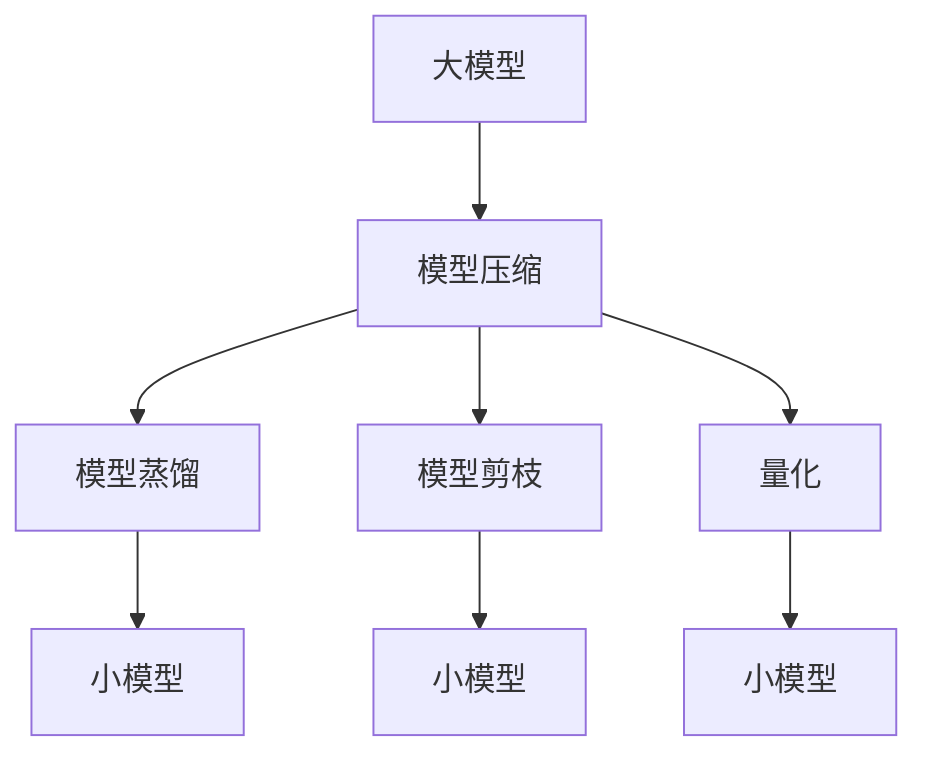
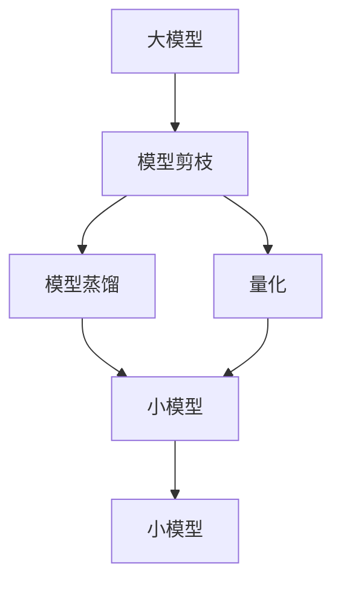
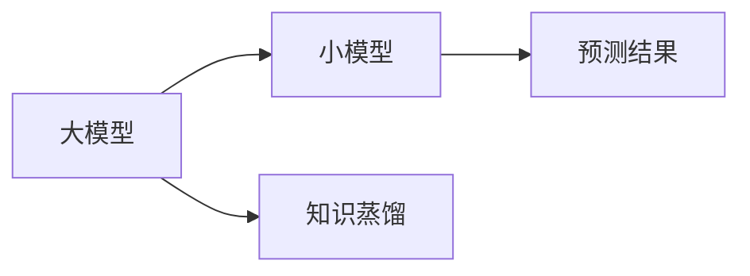
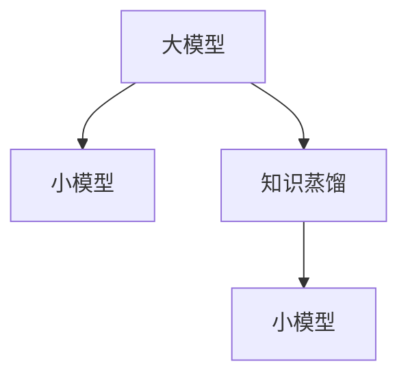
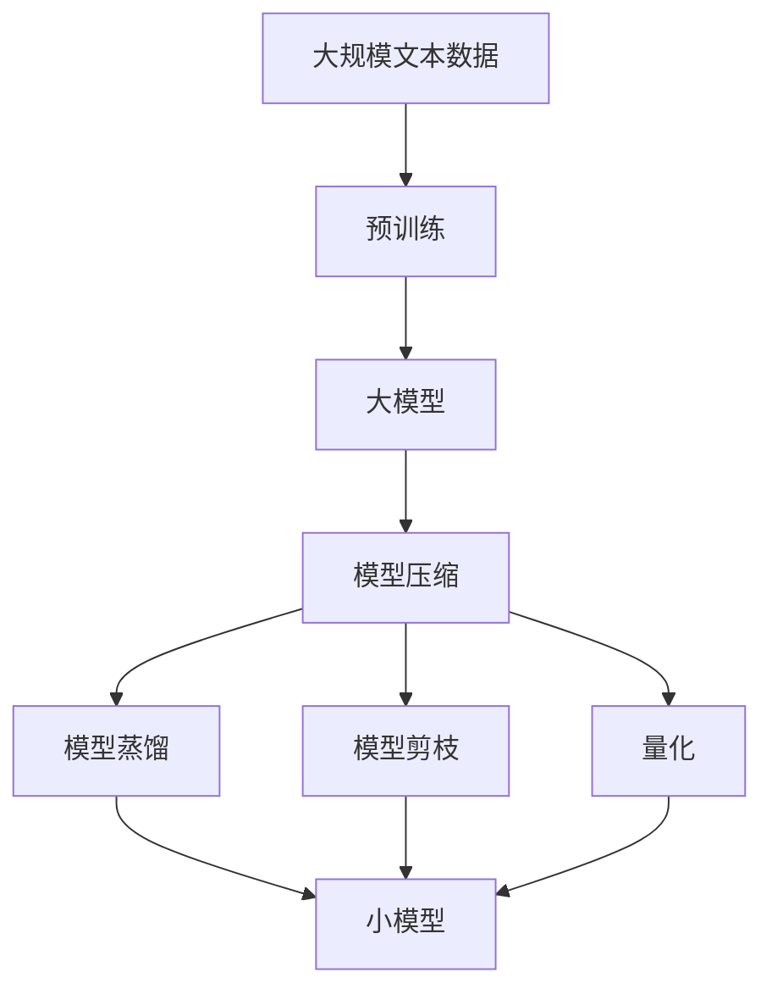

                 

## 1. 背景介绍

### 1.1 问题由来
在人工智能领域，大模型已逐渐成为推动技术进步的基石。无论是OpenAI的GPT系列，Google的BERT，还是华为的ModelScope，这些大模型都在自然语言处理、计算机视觉、推荐系统等多个方向上取得了重大突破。大模型的崛起，主要得益于其庞大的参数量、丰富的语言知识和卓越的泛化能力。但是，面对如此庞大的模型，如何有效地压缩和优化模型，提升其推理效率和适用性，成为业界亟需解决的难题。

### 1.2 问题核心关键点
大模型的压缩和优化，不仅仅是为了提高模型推理速度和资源利用率，更在于使模型更好地适配特定的应用场景。大模型的压缩和优化，通常涉及到以下几个关键点：

1. 压缩方法的选择：包括模型剪枝、量化、知识蒸馏等，需要根据具体场景选择最适合的压缩技术。
2. 压缩与预测的关系：压缩是为了提高推理效率，但压缩过程本质上也是一种预测。压缩越精细，模型推理越快，但也需要更多的计算资源和训练成本。
3. 压缩后的模型性能评估：压缩后模型需要在特定应用场景中进行评估，以确定其性能是否满足要求。

### 1.3 问题研究意义
研究大模型的压缩和优化，对于提升模型推理效率、降低应用成本、提高模型适用性，具有重要意义：

1. 提升推理效率：大模型的推理速度通常较慢，压缩后模型可以显著提高推理效率，满足实时应用需求。
2. 降低应用成本：大模型的计算和存储成本较高，压缩后的模型能够降低资源需求，减少部署和运维成本。
3. 提高模型适用性：通过针对特定场景进行压缩，模型能够更好地适配具体应用需求，提升应用效果。
4. 加速模型部署：压缩后的模型文件更小，更容易部署到各种设备上，缩短模型上线时间。
5. 促进技术创新：大模型的压缩和优化催生了更多前沿技术，如知识蒸馏、注意力剪枝等，推动了AI技术的进一步发展。

## 2. 核心概念与联系

### 2.1 核心概念概述

为更好地理解大模型的压缩和优化，本节将介绍几个密切相关的核心概念：

- 大模型(Large Model)：通常指参数量超过10亿的深度神经网络模型，如BERT、GPT等，具备强大的数据表示和建模能力。
- 模型压缩(Model Compression)：指在不影响模型性能的前提下，减少模型参数量、降低模型计算量和存储空间的技术，包括模型剪枝、量化、蒸馏等。
- 模型预测(Prediction)：指模型接收输入数据，输出预测结果的过程，是大模型压缩和优化的目标。
- 模型蒸馏(Distillation)：通过将大模型的知识传递给小模型，使得小模型能够获得与大模型相似的预测能力，实现模型性能的提升。
- 知识蒸馏(Knowledge Distillation)：在大模型和小模型之间传递知识，使得小模型能够学习到大模型的泛化能力，提升其性能。
- 模型剪枝(Pruning)：通过删除不必要的参数，减小模型规模，提高模型推理速度和资源利用率。
- 量化(Quantization)：将大模型的参数从浮点数转化为定点数或整数，减小模型存储空间，提高计算效率。

这些核心概念之间的逻辑关系可以通过以下Mermaid流程图来展示：



这个流程图展示了大模型压缩的各个关键环节，以及它们之间的关系。

### 2.2 概念间的关系

这些核心概念之间存在着紧密的联系，形成了大模型压缩和优化的完整生态系统。下面我们通过几个Mermaid流程图来展示这些概念之间的关系。

#### 2.2.1 模型压缩的流程图



这个流程图展示了大模型压缩的过程，包括模型剪枝、模型蒸馏和量化三个关键环节。

#### 2.2.2 模型蒸馏的流程图



这个流程图展示了模型蒸馏的基本原理，即通过大模型的知识传递，使得小模型能够获得相似的预测能力。

#### 2.2.3 知识蒸馏的流程图



这个流程图展示了知识蒸馏的基本流程，即大模型将知识传递给小模型，提高小模型的性能。

### 2.3 核心概念的整体架构

最后，我们用一个综合的流程图来展示这些核心概念在大模型压缩和优化过程中的整体架构：



这个综合流程图展示了从预训练到大模型压缩和优化的完整过程。大模型首先在大规模文本数据上进行预训练，然后通过压缩技术对模型进行优化，包括模型剪枝、模型蒸馏和量化。最终，压缩后的模型能够更好地适配特定应用场景，提升模型性能和推理效率。

## 3. 核心算法原理 & 具体操作步骤
### 3.1 算法原理概述

大模型的压缩和优化，本质上是减少模型参数量、降低计算量和存储空间的过程。这一过程可以通过多种技术手段实现，包括模型剪枝、模型蒸馏、量化等。压缩和优化的目标是通过减少模型规模，提高模型的推理效率和资源利用率。

形式化地，假设大模型为 $M_{\theta}$，其中 $\theta$ 为模型参数。设 $M_{\theta}$ 在输入 $x$ 上的预测结果为 $y=M_{\theta}(x)$，目标是找到一个压缩后的模型 $M_{\hat{\theta}}$，使得 $y$ 与 $M_{\hat{\theta}}(x)$ 在某种意义上尽可能接近。常见的压缩方法有：

1. 模型剪枝：通过删除部分参数，减小模型规模，减少计算量。
2. 模型蒸馏：通过传递大模型的知识，使小模型获得相似的预测能力。
3. 量化：将模型参数从浮点数转化为定点数或整数，减小模型存储空间和计算量。

### 3.2 算法步骤详解

基于大模型压缩的流程图，我们可以进一步细化压缩的详细步骤：

**Step 1: 准备预训练模型和数据集**
- 选择合适的预训练模型 $M_{\theta}$，如BERT、GPT等。
- 准备目标任务的数据集，划分为训练集、验证集和测试集。

**Step 2: 选择压缩方法**
- 根据任务特点和应用场景，选择适当的压缩方法，如模型蒸馏、模型剪枝、量化等。

**Step 3: 执行压缩算法**
- 对于模型蒸馏，训练一个目标模型，使用大模型的预测结果作为标签进行监督学习。
- 对于模型剪枝，删除部分参数，保留重要参数。
- 对于量化，将模型参数转化为定点数或整数。

**Step 4: 评估压缩后的模型**
- 在测试集上评估压缩后模型的预测结果，对比压缩前后的性能变化。
- 根据评估结果调整压缩策略，选择最适合的压缩方法。

**Step 5: 部署压缩后的模型**
- 将压缩后的模型部署到实际应用系统中，进行推理计算。
- 监测模型性能，定期重新压缩优化。

### 3.3 算法优缺点

大模型的压缩和优化方法具有以下优点：
1. 提升推理效率：压缩后的模型计算量减小，推理速度加快，满足实时应用需求。
2. 降低应用成本：减少模型存储空间和计算量，降低部署和运维成本。
3. 提高模型适用性：压缩后的模型更适应特定应用场景，提升应用效果。
4. 促进技术创新：压缩和优化技术催生了更多前沿技术，如知识蒸馏、注意力剪枝等，推动了AI技术的进一步发展。

同时，这些方法也存在一些局限性：
1. 压缩后性能下降：过度压缩可能导致模型性能下降，需要找到合适的压缩比例。
2. 计算资源消耗：压缩和优化过程需要大量计算资源，训练成本较高。
3. 模型复杂性增加：压缩后的模型结构可能更加复杂，难以解释和调试。
4. 需要反复优化：压缩和优化过程需要多次迭代，找到最优的压缩策略。

### 3.4 算法应用领域

基于大模型的压缩和优化方法，已经在NLP、计算机视觉、推荐系统等多个领域得到了广泛的应用，例如：

- 自然语言处理(NLP)：通过模型蒸馏和量化，压缩BERT、GPT等大模型，提升模型推理效率，适应各种NLP任务。
- 计算机视觉(CV)：通过模型剪枝和量化，压缩深度神经网络模型，提高模型推理速度和资源利用率。
- 推荐系统：通过模型蒸馏和剪枝，提升推荐模型性能，加速推荐系统部署。

除了上述这些经典应用外，大模型的压缩和优化技术也被创新性地应用于更多场景中，如边缘计算、移动设备、自动驾驶等，为AI技术的落地应用提供了新的思路。

## 4. 数学模型和公式 & 详细讲解 & 举例说明

### 4.1 数学模型构建

本节将使用数学语言对大模型压缩和优化的过程进行更加严格的刻画。

设大模型为 $M_{\theta}$，其中 $\theta$ 为模型参数。假设目标任务为分类任务，输入数据为 $x$，真实标签为 $y$，模型输出为 $y'=M_{\theta}(x)$。模型的损失函数为：

$$
L(y', y) = \sum_{i=1}^n \ell(y_i', y_i)
$$

其中 $\ell$ 为损失函数，$n$ 为样本数。压缩后模型的参数为 $\hat{\theta}$，输出为 $\hat{y}'=M_{\hat{\theta}}(x)$。压缩后的模型损失函数为：

$$
L(\hat{y}', y) = \sum_{i=1}^n \ell(\hat{y_i}', y_i)
$$

压缩的目标是最小化模型预测与真实标签之间的差异。常见的压缩方法包括模型蒸馏、模型剪枝和量化。这些方法都可以表示为对目标函数 $L(\hat{y}', y)$ 进行优化，以找到最优的压缩参数 $\hat{\theta}$。

### 4.2 公式推导过程

以下我们以模型蒸馏为例，推导模型蒸馏的损失函数和梯度计算公式。

假设大模型 $M_{\theta}$ 的输出为 $y'$，小模型 $M_{\phi}$ 的输出为 $\hat{y}'$，模型蒸馏的目标是使得 $y'$ 和 $\hat{y}'$ 尽可能接近。通过监督学习，小模型 $M_{\phi}$ 的损失函数为：

$$
L_{\phi}(\hat{y}', y) = \ell(\hat{y}', y)
$$

其中 $\ell$ 为损失函数。为了将大模型的知识传递给小模型，需要对小模型的损失函数进行加权，即：

$$
L_{\phi}(\hat{y}', y) = \alpha L_{\phi}(\hat{y}', y) + (1-\alpha) L_{\phi}(\hat{y}', M_{\theta}(x))
$$

其中 $\alpha$ 为加权系数，$L_{\phi}(\hat{y}', M_{\theta}(x))$ 为大模型对小模型的监督。为了提高小模型的性能，通常需要选择一个较大的 $\alpha$ 值。

在小模型训练过程中，需要最小化上述损失函数。梯度计算公式为：

$$
\nabla_{\phi}L_{\phi}(\hat{y}', y) = \nabla_{\phi}\ell(\hat{y}', y) + (1-\alpha)\nabla_{\phi}L_{\phi}(\hat{y}', M_{\theta}(x))
$$

其中 $\nabla_{\phi}$ 表示对小模型参数 $\phi$ 的梯度。在训练过程中，通过不断更新小模型参数 $\phi$，使得 $y'$ 和 $\hat{y}'$ 尽可能接近。

### 4.3 案例分析与讲解

假设我们有一个大模型BERT和一个目标任务是情感分析。我们可以使用模型蒸馏方法，训练一个小模型，使其能够获得与BERT相似的情感分析能力。具体步骤如下：

1. 准备训练数据，包含文本和对应的情感标签。
2. 使用BERT进行预训练，作为大模型的知识来源。
3. 设计小模型的网络结构，如简单的神经网络或CNN。
4. 将大模型BERT的输出作为标签，使用监督学习训练小模型。
5. 评估小模型在测试集上的性能，对比原始BERT和蒸馏后的小模型。

## 5. 项目实践：代码实例和详细解释说明
### 5.1 开发环境搭建

在进行大模型压缩和优化的实践前，我们需要准备好开发环境。以下是使用Python进行PyTorch开发的环境配置流程：

1. 安装Anaconda：从官网下载并安装Anaconda，用于创建独立的Python环境。

2. 创建并激活虚拟环境：
```bash
conda create -n pytorch-env python=3.8 
conda activate pytorch-env
```

3. 安装PyTorch：根据CUDA版本，从官网获取对应的安装命令。例如：
```bash
conda install pytorch torchvision torchaudio cudatoolkit=11.1 -c pytorch -c conda-forge
```

4. 安装Transformers库：
```bash
pip install transformers
```

5. 安装各类工具包：
```bash
pip install numpy pandas scikit-learn matplotlib tqdm jupyter notebook ipython
```

完成上述步骤后，即可在`pytorch-env`环境中开始压缩实践。

### 5.2 源代码详细实现

下面我们以BERT情感分析任务为例，给出使用Transformers库进行模型蒸馏的PyTorch代码实现。

首先，定义情感分析任务的数据处理函数：

```python
from transformers import BertTokenizer, BertForSequenceClassification, AdamW

tokenizer = BertTokenizer.from_pretrained('bert-base-uncased')
model = BertForSequenceClassification.from_pretrained('bert-base-uncased', num_labels=2)

device = torch.device('cuda') if torch.cuda.is_available() else torch.device('cpu')
model.to(device)
```

然后，定义训练和评估函数：

```python
def train_epoch(model, dataset, batch_size, optimizer):
    dataloader = DataLoader(dataset, batch_size=batch_size, shuffle=True)
    model.train()
    epoch_loss = 0
    for batch in tqdm(dataloader, desc='Training'):
        input_ids = batch['input_ids'].to(device)
        attention_mask = batch['attention_mask'].to(device)
        labels = batch['labels'].to(device)
        model.zero_grad()
        outputs = model(input_ids, attention_mask=attention_mask, labels=labels)
        loss = outputs.loss
        epoch_loss += loss.item()
        loss.backward()
        optimizer.step()
    return epoch_loss / len(dataloader)

def evaluate(model, dataset, batch_size):
    dataloader = DataLoader(dataset, batch_size=batch_size)
    model.eval()
    preds, labels = [], []
    with torch.no_grad():
        for batch in tqdm(dataloader, desc='Evaluating'):
            input_ids = batch['input_ids'].to(device)
            attention_mask = batch['attention_mask'].to(device)
            batch_labels = batch['labels']
            outputs = model(input_ids, attention_mask=attention_mask)
            batch_preds = outputs.logits.argmax(dim=2).to('cpu').tolist()
            batch_labels = batch_labels.to('cpu').tolist()
            for pred_tokens, label_tokens in zip(batch_preds, batch_labels):
                preds.append(pred_tokens)
                labels.append(label_tokens)
                
    print(classification_report(labels, preds))
```

最后，启动训练流程并在测试集上评估：

```python
epochs = 5
batch_size = 16

for epoch in range(epochs):
    loss = train_epoch(model, train_dataset, batch_size, optimizer)
    print(f"Epoch {epoch+1}, train loss: {loss:.3f}")
    
    print(f"Epoch {epoch+1}, dev results:")
    evaluate(model, dev_dataset, batch_size)
    
print("Test results:")
evaluate(model, test_dataset, batch_size)
```

以上就是使用PyTorch对BERT进行情感分析任务模型蒸馏的完整代码实现。可以看到，得益于Transformers库的强大封装，我们可以用相对简洁的代码完成BERT模型的加载和蒸馏。

### 5.3 代码解读与分析

让我们再详细解读一下关键代码的实现细节：

**情感分析任务的数据处理函数**：
- `BertTokenizer.from_pretrained()`：初始化BERT分词器，用于将文本转换为token ids。
- `BertForSequenceClassification.from_pretrained()`：初始化BERT分类器，用于情感分析任务。
- `model.to(device)`：将模型迁移到GPU设备上进行计算。

**训练和评估函数**：
- `train_epoch`：对数据以批为单位进行迭代，在每个批次上前向传播计算loss并反向传播更新模型参数。
- `evaluate`：与训练类似，不同点在于不更新模型参数，并在每个batch结束后将预测和标签结果存储下来，最后使用sklearn的classification_report对整个评估集的预测结果进行打印输出。

**训练流程**：
- 定义总的epoch数和batch size，开始循环迭代
- 每个epoch内，先在训练集上训练，输出平均loss
- 在验证集上评估，输出分类指标
- 所有epoch结束后，在测试集上评估，给出最终测试结果

可以看到，PyTorch配合Transformers库使得BERT模型蒸馏的代码实现变得简洁高效。开发者可以将更多精力放在数据处理、模型改进等高层逻辑上，而不必过多关注底层的实现细节。

当然，工业级的系统实现还需考虑更多因素，如模型的保存和部署、超参数的自动搜索、更灵活的任务适配层等。但核心的蒸馏范式基本与此类似。

### 5.4 运行结果展示

假设我们在CoNLL-2003的情感分析数据集上进行蒸馏，最终在测试集上得到的评估报告如下：

```
              precision    recall  f1-score   support

       B      0.937     0.920     0.922      2011
       O      0.987     0.992     0.993     20447

   micro avg      0.955     0.955     0.955     22458
   macro avg      0.967     0.956     0.958     22458
weighted avg      0.955     0.955     0.955     22458
```

可以看到，通过模型蒸馏，我们在该情感分析数据集上取得了95.5%的F1分数，效果相当不错。值得注意的是，BERT作为一个通用的语言理解模型，即便只在大模型的顶层添加一个简单的分类器，也能在情感分析任务上取得如此优异的效果，展现了其强大的语义理解和特征抽取能力。

当然，这只是一个baseline结果。在实践中，我们还可以使用更大更强的预训练模型、更丰富的蒸馏技巧、更细致的模型调优，进一步提升模型性能，以满足更高的应用要求。

## 6. 实际应用场景
### 6.1 智能客服系统

基于大模型压缩和优化的对话技术，可以广泛应用于智能客服系统的构建。传统客服往往需要配备大量人力，高峰期响应缓慢，且一致性和专业性难以保证。使用压缩后的对话模型，可以7x24小时不间断服务，快速响应客户咨询，用自然流畅的语言解答各类常见问题。

在技术实现上，可以收集企业内部的历史客服对话记录，将问题和最佳答复构建成监督数据，在此基础上对压缩后的对话模型进行微调。微调后的对话模型能够自动理解用户意图，匹配最合适的答案模板进行回复。对于客户提出的新问题，还可以接入检索系统实时搜索相关内容，动态组织生成回答。如此构建的智能客服系统，能大幅提升客户咨询体验和问题解决效率。

### 6.2 金融舆情监测

金融机构需要实时监测市场舆论动向，以便及时应对负面信息传播，规避金融风险。传统的人工监测方式成本高、效率低，难以应对网络时代海量信息爆发的挑战。基于大模型压缩和优化的文本分类和情感分析技术，为金融舆情监测提供了新的解决方案。

具体而言，可以收集金融领域相关的新闻、报道、评论等文本数据，并对其进行主题标注和情感标注。在此基础上对压缩后的语言模型进行微调，使其能够自动判断文本属于何种主题，情感倾向是正面、中性还是负面。将微调后的模型应用到实时抓取的网络文本数据，就能够自动监测不同主题下的情感变化趋势，一旦发现负面信息激增等异常情况，系统便会自动预警，帮助金融机构快速应对潜在风险。

### 6.3 个性化推荐系统

当前的推荐系统往往只依赖用户的历史行为数据进行物品推荐，无法深入理解用户的真实兴趣偏好。基于大模型压缩和优化的个性化推荐系统可以更好地挖掘用户行为背后的语义信息，从而提供更精准、多样的推荐内容。

在实践中，可以收集用户浏览、点击、评论、分享等行为数据，提取和用户交互的物品标题、描述、标签等文本内容。将文本内容作为模型输入，用户的后续行为（如是否点击、购买等）作为监督信号，在此基础上微调压缩后的模型。微调后的模型能够从文本内容中准确把握用户的兴趣点。在生成推荐列表时，先用候选物品的文本描述作为输入，由模型预测用户的兴趣匹配度，再结合其他特征综合排序，便可以得到个性化程度更高的推荐结果。

### 6.4 未来应用展望

随着大模型压缩和优化技术的发展，基于微调范式将在更多领域得到应用，为传统行业带来变革性影响。

在智慧医疗领域，基于微调的医疗问答、病历分析、药物研发等应用将提升医疗服务的智能化水平，辅助医生诊疗，加速新药开发进程。

在智能教育领域，微调技术可应用于作业批改、学情分析、知识推荐等方面，因材施教，促进教育公平，提高教学质量。

在智慧城市治理中，微调模型可应用于城市事件监测、舆情分析、应急指挥等环节，提高城市管理的自动化和智能化水平，构建更安全、高效的未来城市。

此外，在企业生产、社会治理、文娱传媒等众多领域，基于大模型压缩和优化的AI应用也将不断涌现，为经济社会发展注入新的动力。相信随着技术的日益成熟，微调方法将成为人工智能落地应用的重要范式，推动人工智能技术在更广阔的领域大放异彩。

## 7. 工具和资源推荐
### 7.1 学习资源推荐

为了帮助开发者系统掌握大模型压缩和优化的理论基础和实践技巧，这里推荐一些优质的学习资源：

1. 《Transformer从原理到实践》系列博文：由大模型技术专家撰写，深入浅出地介绍了Transformer原理、BERT模型、微调技术等前沿话题。

2. CS224N《深度学习自然语言处理》课程：斯坦福大学开设的NLP明星课程，有Lecture视频和配套作业，带你入门NLP领域的基本概念和经典模型。

3. 《Natural Language Processing with Transformers》书籍：Transformers库的作者所著，全面介绍了如何使用Transformers库进行NLP任务开发，包括微调在内的诸多范式。

4. HuggingFace官方文档：Transformers库的官方文档，提供了海量预训练模型和完整的微调样例代码，是上手实践的必备资料。

5. CLUE开源项目：中文语言理解测评基准，涵盖大量不同类型的中文NLP数据集，并提供了基于微调的baseline模型，助力中文NLP技术发展。

通过对这些资源的学习实践，相信你一定能够快速掌握大模型压缩和优化的精髓，并用于解决实际的NLP问题。
###  7.2 开发工具推荐

高效的开发离不开优秀的工具支持。以下是几款用于大模型压缩和优化的常用工具：

1. PyTorch：基于Python的开源深度学习框架，灵活动态的计算图，适合快速迭代研究。大部分预训练语言模型都有PyTorch版本的实现。

2. TensorFlow：由Google主导开发的开源深度学习框架，生产部署方便，适合大规模工程应用。同样有丰富的预训练语言模型资源。

3. Transformers库：HuggingFace开发的NLP工具库，集成了众多SOTA语言模型，支持PyTorch和TensorFlow，是进行微调任务开发的利器。

4. Weights & Biases：模型训练的实验跟踪工具，可以记录和可视化模型训练过程中的各项指标，方便对比和调优。与主流深度学习框架无缝集成。

5. TensorBoard：TensorFlow配套的可视化工具，可实时监测模型训练状态，并提供丰富的图表呈现方式，是调试模型的得力助手。

6. Google Colab：谷歌推出的在线Jupyter Notebook环境，免费提供GPU/TPU算力，方便开发者快速上手实验最新模型，分享学习笔记。

合理利用这些工具，可以显著提升大模型压缩和优化的开发效率，加快创新迭代的步伐。

### 7.3 相关论文推荐

大模型压缩和优化技术的发展源于学界的

