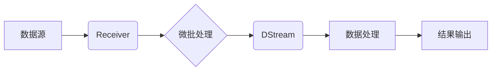

## Spark Streaming原理与代码实例讲解

> 关键词：Spark Streaming, 流式处理, 微批处理, DStream, Receiver, Resilient Distributed Datasets (RDD),  Kafka, Flink

## 1. 背景介绍

随着互联网的蓬勃发展，海量数据实时生成和处理的需求日益增长。传统的批处理模式难以满足实时分析和响应的需要。Spark Streaming应运而生，它是一个强大的开源框架，用于处理实时流式数据。Spark Streaming基于Apache Spark的分布式计算引擎，利用微批处理的方式，将流式数据划分为小的批次进行处理，从而实现高吞吐量、低延迟的实时数据分析。

## 2. 核心概念与联系

Spark Streaming的核心概念包括：

* **DStream (Discretized Stream):**  DStream是Spark Streaming处理流数据的抽象表示。它是一个无限序列的RDD，每个RDD代表一个时间窗口内的流数据批次。
* **Receiver:** Receiver是Spark Streaming接收实时数据源的组件。它负责从数据源（如Kafka、Flume等）接收数据并将其转换为DStream。
* **微批处理:** Spark Streaming采用微批处理的方式，将流数据划分为小的批次进行处理。每个批次的大小和处理时间间隔可以根据实际需求进行配置。
* **Resilient Distributed Datasets (RDD):** RDD是Spark的核心数据结构，用于存储和处理分布式数据。DStream中的每个批次都是一个RDD。

**Spark Streaming 架构流程图:**



## 3. 核心算法原理 & 具体操作步骤

### 3.1  算法原理概述

Spark Streaming的核心算法原理是微批处理。它将流数据划分为小的批次，每个批次都像一个独立的批处理任务进行处理。

### 3.2  算法步骤详解

1. **数据接收:** Receiver从数据源接收数据并将其转换为DStream。
2. **微批化:** DStream将数据划分为小的批次，每个批次的时间间隔称为“批处理间隔”。
3. **数据处理:** 每个批次的数据都像一个独立的RDD进行处理，可以使用Spark提供的各种算子进行转换、聚合、分析等操作。
4. **结果输出:** 处理后的结果可以输出到各种目标系统，如数据库、文件系统、实时监控平台等。

### 3.3  算法优缺点

**优点:**

* **高吞吐量:** 微批处理的方式可以充分利用Spark的分布式计算能力，实现高吞吐量的数据处理。
* **低延迟:** 批处理间隔可以根据实际需求进行配置，实现较低的延迟。
* **灵活性和易用性:** Spark Streaming提供了丰富的API和算子，可以方便地实现各种数据处理任务。

**缺点:**

* **状态管理:** Spark Streaming的微批处理模式需要处理状态管理问题，例如如何维护状态变量在不同批次之间的一致性。
* **数据窗口:** 数据窗口的定义和管理需要谨慎考虑，以确保数据处理的准确性和及时性。

### 3.4  算法应用领域

Spark Streaming广泛应用于以下领域:

* **实时日志分析:** 实时监控和分析应用程序日志，发现异常行为和性能瓶颈。
* **实时社交媒体分析:** 实时分析社交媒体数据，了解用户情绪、趋势和热点话题。
* **实时用户行为分析:** 实时分析用户行为数据，例如点击、浏览、购买等，优化用户体验和营销策略。
* **实时金融交易监控:** 实时监控金融交易数据，检测欺诈行为和风险事件。

## 4. 数学模型和公式 & 详细讲解 & 举例说明

### 4.1  数学模型构建

Spark Streaming的微批处理模式可以抽象为一个时间序列模型。假设数据流是一个无限序列，每个数据点的时间戳为t，则可以表示为：

```latex
D = {d_1, d_2, d_3,...}
```

其中，$d_i$表示第i个数据点。

每个批次可以表示为一个时间窗口内的数据子集，例如：

```latex
B_k = {d_i | t_{i} \in [k \cdot \Delta t, (k+1) \cdot \Delta t)}
```

其中，$k$表示批次序号，$\Delta t$表示批处理间隔。

### 4.2  公式推导过程

Spark Streaming的处理过程可以看作是对每个批次$B_k$进行独立的处理，例如计算每个批次内的平均值：

```latex
avg(B_k) = \frac{1}{|B_k|} \sum_{d_i \in B_k} d_i
```

其中，$|B_k|$表示批次$B_k$中数据点的数量。

### 4.3  案例分析与讲解

例如，假设我们有一个实时监控网站访问量的系统，需要计算每分钟网站访问量的平均值。

我们可以使用Spark Streaming将网站访问日志数据作为输入，每个批次的时间间隔为1分钟。

然后，我们可以使用Spark Streaming提供的算子对每个批次进行处理，计算平均访问量。

最终，我们可以将计算出的平均访问量输出到监控平台，实时展示网站访问量趋势。

## 5. 项目实践：代码实例和详细解释说明

### 5.1  开发环境搭建

* 安装Java JDK
* 安装Scala
* 安装Apache Spark
* 安装IDE (例如Eclipse, IntelliJ IDEA)

### 5.2  源代码详细实现

```scala
import org.apache.spark.SparkConf
import org.apache.spark.streaming.{Seconds, StreamingContext}
import org.apache.spark.streaming.kafka010._

object SparkStreamingWordCount {
  def main(args: Array[String]): Unit = {
    // 配置Spark上下文
    val conf = new SparkConf().setAppName("SparkStreamingWordCount").setMaster("local[*]")
    val ssc = new StreamingContext(conf, Seconds(1)) // 设置批处理间隔为1秒

    // Kafka配置
    val kafkaParams = Map[String, Object](
      "bootstrap.servers" -> "localhost:9092",
      "group.id" -> "my-group",
      "key.deserializer" -> "org.apache.kafka.common.serialization.StringDeserializer",
      "value.deserializer" -> "org.apache.kafka.common.serialization.StringDeserializer",
      "auto.offset.reset" -> "latest",
      "enable.auto.commit" -> (false: java.lang.Boolean)
    )

    // 定义Kafka主题
    val topics = Array("my-topic")

    // 创建Kafka流
    val kafkaStream = KafkaUtils.createDirectStream[String, String](ssc, kafkaParams, topics)

    // 对流数据进行处理
    val wordCounts = kafkaStream.flatMap(_.split(" "))
     .map(word => (word, 1))
     .reduceByKey(_ + _)

    // 将结果输出到控制台
    wordCounts.print()

    // 启动Spark Streaming应用程序
    ssc.start()
    ssc.awaitTermination()
  }
}
```

### 5.3  代码解读与分析

* **配置Spark上下文:** 创建SparkConf对象配置Spark应用程序名称和运行模式，然后创建StreamingContext对象，设置批处理间隔为1秒。
* **Kafka配置:** 配置Kafka连接参数，包括Bootstrap服务器地址、组ID、键和值反序列化器等。
* **定义Kafka主题:** 指定要消费的Kafka主题名称。
* **创建Kafka流:** 使用KafkaUtils.createDirectStream方法创建Kafka流，将Kafka数据转换为DStream。
* **对流数据进行处理:** 使用Spark Streaming提供的算子对流数据进行处理，例如：
    * `flatMap`: 将每个数据点拆分成多个单词。
    * `map`: 将每个单词转换为(单词, 1)元组。
    * `reduceByKey`: 对每个单词进行聚合，计算每个单词出现的次数。
* **输出结果:** 使用`print`方法将计算出的单词计数输出到控制台。
* **启动Spark Streaming应用程序:** 使用`ssc.start()`启动Spark Streaming应用程序，并使用`ssc.awaitTermination()`等待应用程序结束。

### 5.4  运行结果展示

运行代码后，控制台将实时显示每个单词出现的次数。

## 6. 实际应用场景

Spark Streaming在实时数据处理领域有着广泛的应用场景，例如：

* **实时监控系统:** 实时监控网站访问量、服务器性能、网络流量等数据，及时发现异常情况。
* **实时数据分析:** 实时分析社交媒体数据、用户行为数据、金融交易数据等，挖掘数据中的趋势和规律。
* **实时推荐系统:** 基于用户实时行为数据，实时推荐个性化内容。
* **实时机器学习:** 使用实时数据进行模型训练和更新，实现实时机器学习应用。

### 6.4  未来应用展望

随着物联网、大数据、人工智能等技术的快速发展，Spark Streaming在未来将有更广泛的应用场景，例如：

* **实时工业控制:** 实时监控工业设备运行状态，及时发现故障并进行预警。
* **实时医疗诊断:** 基于实时患者数据，辅助医生进行诊断和治疗。
* **实时金融风险管理:** 实时监控金融市场数据，及时识别和应对金融风险。

## 7. 工具和资源推荐

### 7.1  学习资源推荐

* **Spark Streaming官方文档:** https://spark.apache.org/docs/latest/streaming-programming-guide.html
* **Spark Streaming教程:** https://www.tutorialspoint.com/spark/spark_streaming.htm
* **Spark Streaming书籍:** "Spark Streaming Cookbook" by  Mateusz Zając

### 7.2  开发工具推荐

* **Eclipse:** https://www.eclipse.org/
* **IntelliJ IDEA:** https://www.jetbrains.com/idea/
* **Spark Shell:** https://spark.apache.org/docs/latest/api/java/index.html

### 7.3  相关论文推荐

* **Spark Streaming: Leveraging the Power of Micro-Batch Processing for Real-Time Data Analytics:** https://dl.acm.org/doi/10.1145/2508886.2508909

## 8. 总结：未来发展趋势与挑战

### 8.1  研究成果总结

Spark Streaming作为一种强大的实时数据处理框架，在处理海量流数据方面取得了显著的成果。其微批处理模式、丰富的API和算子、以及与其他大数据技术的集成，使其成为实时数据分析的理想选择。

### 8.2  未来发展趋势

* **更低延迟:** 随着对实时数据处理要求的不断提高，Spark Streaming将继续探索更低延迟的处理方式，例如使用更小的批处理间隔或采用事件驱动模型。
* **更强大的状态管理:** Spark Streaming将继续改进状态管理机制，支持更复杂的应用场景，例如窗口操作、状态聚合等。
* **更丰富的生态系统:** Spark Streaming的生态系统将不断丰富，包括更多第三方工具、库和应用，为用户提供更便捷的开发体验。

### 8.3  面临的挑战

* **状态管理复杂性:** 随着应用场景的复杂化，状态管理的复杂性也会增加，需要更有效的机制来处理状态更新、一致性和故障恢复等问题。
* **资源管理挑战:** Spark Streaming需要高效地管理资源，例如CPU、内存和网络带宽，以确保应用程序的性能和稳定性。
* **数据一致性:** 在分布式环境下，保证数据的一致性是一个重要的挑战，需要采用合适的机制来解决数据冲突和数据丢失问题。

### 8.4  研究展望

未来，Spark Streaming的研究方向将集中在以下几个方面:

* **更低延迟、更高吞吐量的处理方式:** 探索新的算法和架构，实现更低延迟、更高吞吐量的实时数据处理。
* **更强大的状态管理机制:** 开发更灵活、