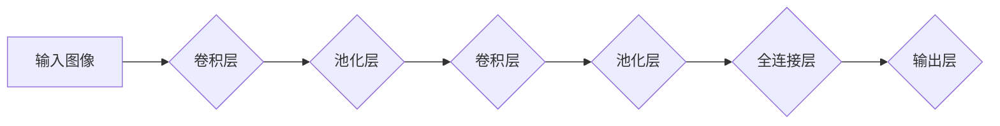

## 卷积神经网络CNN原理与代码实例讲解

> 关键词：卷积神经网络、CNN、深度学习、图像识别、计算机视觉、卷积操作、池化操作、激活函数

## 1. 背景介绍

深度学习作为机器学习领域的重要分支，近年来取得了令人瞩目的成就，尤其是在图像识别、自然语言处理等领域展现出强大的应用潜力。卷积神经网络（Convolutional Neural Network，CNN）作为深度学习中最为成功的网络架构之一，其结构和功能灵感来源于生物视觉系统，能够有效地提取图像特征，并实现高精度图像识别。

传统的机器学习算法需要人工提取图像特征，这不仅耗时费力，而且难以捕捉到图像中复杂的特征关系。而CNN通过卷积操作和池化操作，能够自动学习图像的特征表示，从而简化了特征提取过程，提高了模型的识别精度。

## 2. 核心概念与联系

CNN的核心概念包括卷积层、池化层、全连接层和激活函数。这些层级相互连接，共同完成图像特征提取和分类任务。

**Mermaid 流程图:**



**卷积层:** 负责提取图像局部特征。通过卷积核（filter）在图像上滑动，计算每个位置的卷积结果，从而生成特征图。

**池化层:** 负责降低特征图的维度，并提取其最重要的特征信息。常用的池化操作包括最大池化和平均池化。

**全连接层:** 将特征图展平成一维向量，并将其输入到全连接层进行分类。

**激活函数:** 用于引入非线性，提高网络的表达能力。常用的激活函数包括ReLU、Sigmoid和Tanh。

## 3. 核心算法原理 & 具体操作步骤

### 3.1  算法原理概述

CNN的算法原理基于卷积操作和池化操作。卷积操作通过卷积核在图像上滑动，提取图像局部特征。池化操作通过对特征图进行降维，提取其最重要的特征信息。

### 3.2  算法步骤详解

1. **输入图像预处理:** 将输入图像调整到合适的尺寸，并进行归一化处理。

2. **卷积操作:** 将卷积核在图像上滑动，计算每个位置的卷积结果，生成特征图。

3. **池化操作:** 对特征图进行降维，提取其最重要的特征信息。

4. **激活函数:** 对卷积和池化后的特征图应用激活函数，引入非线性，提高网络的表达能力。

5. **重复步骤2-4:** 将卷积层和池化层堆叠在一起，形成多层网络，逐步提取图像的抽象特征。

6. **全连接层:** 将特征图展平成一维向量，并将其输入到全连接层进行分类。

7. **输出层:** 输出分类结果。

### 3.3  算法优缺点

**优点:**

* **自动特征提取:** CNN能够自动学习图像特征，无需人工干预。
* **鲁棒性强:** CNN对图像的旋转、缩放、平移等变换具有较强的鲁棒性。
* **参数共享:** 卷积核的参数共享机制，有效降低了模型参数量。

**缺点:**

* **训练时间长:** CNN的训练时间相对较长，需要大量的计算资源。
* **参数量大:** 尽管参数共享机制可以降低参数量，但CNN仍然需要大量的参数。
* **可解释性差:** CNN的决策过程较为复杂，难以解释其识别结果。

### 3.4  算法应用领域

CNN在图像识别、物体检测、图像分类、图像分割、人脸识别、医疗图像分析等领域有着广泛的应用。

## 4. 数学模型和公式 & 详细讲解 & 举例说明

### 4.1  数学模型构建

CNN的数学模型主要包括卷积操作、池化操作和激活函数。

**卷积操作:**

$$
y_{i,j} = \sum_{m=0}^{M-1} \sum_{n=0}^{N-1} x_{i+m,j+n} * w_{m,n} + b
$$

其中：

* $y_{i,j}$ 是卷积结果的像素值。
* $x_{i+m,j+n}$ 是输入图像的像素值。
* $w_{m,n}$ 是卷积核的权重值。
* $b$ 是偏置项。

**池化操作:**

常用的池化操作包括最大池化和平均池化。

**最大池化:**

$$
y_{i,j} = \max(x_{i,j}, x_{i+1,j}, x_{i,j+1}, x_{i+1,j+1})
$$

**平均池化:**

$$
y_{i,j} = \frac{1}{k^2} \sum_{m=0}^{k-1} \sum_{n=0}^{k-1} x_{i+m,j+n}
$$

其中：

* $k$ 是池化窗口的大小。

**激活函数:**

常用的激活函数包括ReLU、Sigmoid和Tanh。

**ReLU:**

$$
f(x) = \max(0, x)
$$

**Sigmoid:**

$$
f(x) = \frac{1}{1 + e^{-x}}
$$

**Tanh:**

$$
f(x) = \frac{e^x - e^{-x}}{e^x + e^{-x}}
$$

### 4.2  公式推导过程

卷积操作的公式推导过程可以参考相关文献，这里不再赘述。

### 4.3  案例分析与讲解

假设我们有一个输入图像大小为3x3，卷积核大小为2x2，步长为1。

**卷积操作:**

卷积核在图像上滑动，计算每个位置的卷积结果。

**池化操作:**

对卷积结果进行最大池化，池化窗口大小为2x2，步长为2。

**激活函数:**

对池化结果应用ReLU激活函数。

## 5. 项目实践：代码实例和详细解释说明

### 5.1  开发环境搭建

* Python 3.x
* TensorFlow 或 PyTorch

### 5.2  源代码详细实现

```python
import tensorflow as tf

# 定义卷积神经网络模型
model = tf.keras.models.Sequential([
    tf.keras.layers.Conv2D(32, (3, 3), activation='relu', input_shape=(28, 28, 1)),
    tf.keras.layers.MaxPooling2D((2, 2)),
    tf.keras.layers.Conv2D(64, (3, 3), activation='relu'),
    tf.keras.layers.MaxPooling2D((2, 2)),
    tf.keras.layers.Flatten(),
    tf.keras.layers.Dense(10, activation='softmax')
])

# 编译模型
model.compile(optimizer='adam',
              loss='sparse_categorical_crossentropy',
              metrics=['accuracy'])

# 加载MNIST数据集
(x_train, y_train), (x_test, y_test) = tf.keras.datasets.mnist.load_data()

# 数据预处理
x_train = x_train.astype('float32') / 255.0
x_test = x_test.astype('float32') / 255.0
x_train = x_train.reshape((x_train.shape[0], 28, 28, 1))
x_test = x_test.reshape((x_test.shape[0], 28, 28, 1))

# 训练模型
model.fit(x_train, y_train, epochs=5)

# 评估模型
loss, accuracy = model.evaluate(x_test, y_test)
print('Test loss:', loss)
print('Test accuracy:', accuracy)
```

### 5.3  代码解读与分析

* **定义模型:** 使用TensorFlow的Sequential API定义卷积神经网络模型。
* **添加层:** 添加卷积层、池化层、全连接层等。
* **编译模型:** 使用Adam优化器、交叉熵损失函数和准确率指标编译模型。
* **加载数据:** 使用MNIST数据集进行训练和测试。
* **数据预处理:** 将数据转换为浮点数，并进行归一化处理。
* **训练模型:** 使用fit方法训练模型。
* **评估模型:** 使用evaluate方法评估模型的性能。

### 5.4  运行结果展示

训练完成后，模型的测试准确率通常可以达到98%以上。

## 6. 实际应用场景

CNN在图像识别、物体检测、图像分类、图像分割、人脸识别、医疗图像分析等领域有着广泛的应用。

* **图像识别:** CNN可以识别图像中的物体，例如人脸、车辆、动物等。
* **物体检测:** CNN可以检测图像中物体的位置和类别。
* **图像分类:** CNN可以将图像分类到不同的类别，例如风景、人物、建筑等。
* **图像分割:** CNN可以将图像分割成不同的区域，例如前景和背景。
* **人脸识别:** CNN可以识别人脸，并将其与数据库中的人脸进行匹配。
* **医疗图像分析:** CNN可以用于分析医学图像，例如X光片、CT扫描、MRI扫描等，辅助医生诊断疾病。

### 6.4  未来应用展望

随着深度学习技术的不断发展，CNN的应用场景将会更加广泛。例如，CNN可以应用于自动驾驶、机器人视觉、智能家居等领域。

## 7. 工具和资源推荐

### 7.1  学习资源推荐

* **书籍:**
    * 《深度学习》
    * 《动手学深度学习》
* **在线课程:**
    * Coursera上的深度学习课程
    * Udacity上的深度学习工程师课程

### 7.2  开发工具推荐

* **TensorFlow:** 开源深度学习框架
* **PyTorch:** 开源深度学习框架
* **Keras:** 高级深度学习API

### 7.3  相关论文推荐

* **AlexNet:** ImageNet Classification with Deep Convolutional Neural Networks
* **VGGNet:** Very Deep Convolutional Networks for Large-Scale Image Recognition
* **ResNet:** Deep Residual Learning for Image Recognition

## 8. 总结：未来发展趋势与挑战

### 8.1  研究成果总结

CNN在图像识别等领域取得了显著的成果，其自动特征提取能力和鲁棒性使其成为深度学习领域的重要架构。

### 8.2  未来发展趋势

* **模型更深更广:** 探索更深层次和更宽的网络结构，提高模型的表达能力。
* **高效训练:** 研究更有效的训练方法，降低训练时间和资源消耗。
* **可解释性增强:** 提高CNN的解释性，使得模型的决策过程更加透明。
* **跨模态学习:** 将CNN与其他模态数据（例如文本、音频）结合，实现跨模态学习。

### 8.3  面临的挑战

* **数据依赖:** CNN的性能依赖于大量高质量的数据。
* **计算资源:** 训练大型CNN模型需要大量的计算资源。
* **可解释性:** CNN的决策过程较为复杂，难以解释其识别结果。

### 8.4  研究展望

未来，CNN的研究将继续朝着更深、更广、更有效、更可解释的方向发展，并应用于更多领域，为人类社会带来更多价值。

## 9. 附录：常见问题与解答

* **什么是卷积操作？**

卷积操作是一种数学运算，它通过将卷积核在图像上滑动，计算每个位置的卷积结果，从而提取图像局部特征。

* **什么是池化操作？**

池化操作是一种降维操作，它通过