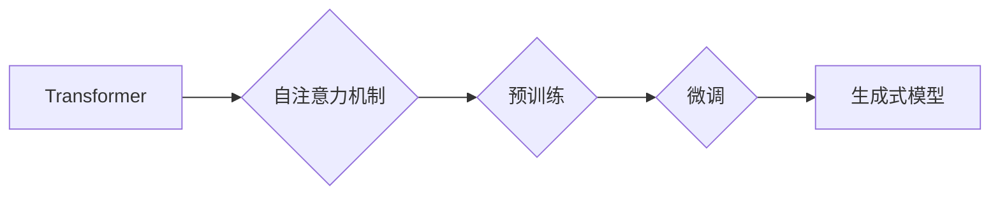

## 大语言模型原理基础与前沿 涌现能力

> 关键词：大语言模型、Transformer、自注意力机制、预训练、微调、生成式模型、自然语言处理

### 1. 背景介绍

近年来，深度学习技术取得了飞速发展，特别是基于Transformer架构的大语言模型（Large Language Model，LLM）的出现，彻底改变了自然语言处理（Natural Language Processing，NLP）领域的面貌。LLM拥有海量参数，能够理解和生成人类语言，展现出强大的文本生成、翻译、摘要、问答等能力。从ChatGPT的爆火到各行各业的应用探索，LLM已经成为人工智能领域最炙手可热的话题之一。

### 2. 核心概念与联系

大语言模型的核心概念包括：

* **Transformer:**  一种新型的神经网络架构，能够有效处理序列数据，并通过自注意力机制捕捉长距离依赖关系。
* **自注意力机制 (Self-Attention):**  允许模型关注输入序列中不同位置的词，并根据其重要性赋予不同的权重，从而更好地理解上下文关系。
* **预训练 (Pre-training):**  在海量文本数据上进行无监督学习，训练模型学习语言的通用表示。
* **微调 (Fine-tuning):**  将预训练模型应用于特定任务，通过少量标注数据进行调整，提高模型在该任务上的性能。
* **生成式模型 (Generative Model):**  能够根据训练数据生成新的文本、代码、图像等数据。

这些概念相互关联，共同构成了LLM强大的能力。

**Mermaid 流程图:**



### 3. 核心算法原理 & 具体操作步骤

#### 3.1  算法原理概述

Transformer模型的核心是自注意力机制，它允许模型在处理序列数据时，关注不同位置词之间的关系，并根据其重要性赋予不同的权重。

#### 3.2  算法步骤详解

1. **输入嵌入:** 将输入序列中的每个词转换为向量表示。
2. **多头自注意力:** 对输入序列进行多头自注意力计算，捕捉不同词之间的关系。
3. **前馈神经网络:** 对每个词的注意力输出进行非线性变换。
4. **位置编码:** 添加位置信息，使模型能够理解词的顺序。
5. **堆叠:** 将多个Transformer编码器层堆叠在一起，进一步提取语义信息。
6. **输出层:** 将编码后的序列输出为目标序列。

#### 3.3  算法优缺点

**优点:**

* 能够有效处理长距离依赖关系。
* 并行计算能力强。
* 在各种NLP任务上表现出色。

**缺点:**

* 参数量大，训练成本高。
* 对训练数据质量要求高。

#### 3.4  算法应用领域

* 文本生成
* 机器翻译
* 文本摘要
* 问答系统
* 代码生成

### 4. 数学模型和公式 & 详细讲解 & 举例说明

#### 4.1  数学模型构建

Transformer模型的核心是自注意力机制，其数学模型可以表示为：

$$
Attention(Q, K, V) = softmax(\frac{QK^T}{\sqrt{d_k}})V
$$

其中：

* $Q$：查询矩阵
* $K$：键矩阵
* $V$：值矩阵
* $d_k$：键向量的维度
* $softmax$：softmax函数

#### 4.2  公式推导过程

自注意力机制的目的是计算每个词与其他词之间的相关性。

1. 将输入序列中的每个词分别转换为查询向量 $Q$、键向量 $K$ 和值向量 $V$。
2. 计算查询向量与键向量的点积，并进行归一化处理，得到注意力权重。
3. 将注意力权重与值向量进行加权求和，得到每个词的注意力输出。

#### 4.3  案例分析与讲解

假设我们有一个句子 "The cat sat on the mat"，将其转换为词向量表示，每个词的向量维度为 128。

* $Q$、$K$ 和 $V$ 矩阵分别为 5x128 的矩阵，其中 5 代表句子中的词数。
* 计算 $QK^T$，得到一个 5x5 的矩阵，每个元素代表两个词之间的相关性。
* 对 $QK^T$ 进行归一化处理，得到注意力权重矩阵。
* 将注意力权重矩阵与 $V$ 矩阵进行加权求和，得到每个词的注意力输出。

### 5. 项目实践：代码实例和详细解释说明

#### 5.1  开发环境搭建

* Python 3.7+
* PyTorch 或 TensorFlow
* CUDA 和 cuDNN (可选，用于GPU加速)

#### 5.2  源代码详细实现

```python
import torch
import torch.nn as nn

class Transformer(nn.Module):
    def __init__(self, vocab_size, embedding_dim, num_heads, num_layers):
        super(Transformer, self).__init__()
        self.embedding = nn.Embedding(vocab_size, embedding_dim)
        self.encoder_layers = nn.ModuleList([EncoderLayer(embedding_dim, num_heads) for _ in range(num_layers)])

    def forward(self, x):
        x = self.embedding(x)
        for encoder_layer in self.encoder_layers:
            x = encoder_layer(x)
        return x

class EncoderLayer(nn.Module):
    def __init__(self, embedding_dim, num_heads):
        super(EncoderLayer, self).__init__()
        self.self_attention = nn.MultiheadAttention(embedding_dim, num_heads)
        self.feed_forward = nn.Sequential(
            nn.Linear(embedding_dim, 4 * embedding_dim),
            nn.ReLU(),
            nn.Linear(4 * embedding_dim, embedding_dim)
        )

    def forward(self, x):
        x = self.self_attention(x, x, x)[0]
        x = self.feed_forward(x)
        return x
```

#### 5.3  代码解读与分析

* `Transformer` 类定义了整个Transformer模型的结构。
* `EncoderLayer` 类定义了Transformer编码器中的一个层，包含自注意力机制和前馈神经网络。
* `forward` 方法定义了模型的输入和输出流程。

#### 5.4  运行结果展示

训练好的Transformer模型可以用于各种NLP任务，例如文本生成、机器翻译等。

### 6. 实际应用场景

LLM在各个领域都有着广泛的应用场景：

* **聊天机器人:** ChatGPT等模型可以进行自然流畅的对话，为用户提供信息和娱乐。
* **文本摘要:**  LLM可以自动生成文本摘要，帮助用户快速了解文章内容。
* **机器翻译:**  LLM可以实现高质量的机器翻译，打破语言障碍。
* **代码生成:**  LLM可以根据自然语言描述生成代码，提高开发效率。
* **教育:**  LLM可以作为智能辅导员，帮助学生学习和理解知识。

### 6.4  未来应用展望

随着LLM技术的不断发展，其应用场景将更加广泛，例如：

* **个性化教育:**  根据学生的学习情况，提供个性化的学习方案。
* **医疗诊断:**  辅助医生进行疾病诊断，提高诊断准确率。
* **科学研究:**  加速科学研究，发现新的知识。

### 7. 工具和资源推荐

#### 7.1  学习资源推荐

* **书籍:**
    * 《深度学习》
    * 《自然语言处理》
* **在线课程:**
    * Coursera: 自然语言处理
    * Udacity: 深度学习

#### 7.2  开发工具推荐

* **PyTorch:**  一个开源的深度学习框架。
* **TensorFlow:**  另一个开源的深度学习框架。
* **Hugging Face Transformers:**  一个用于加载和使用预训练Transformer模型的库。

#### 7.3  相关论文推荐

* **Attention Is All You Need:**  Transformer模型的原始论文。
* **BERT: Pre-training of Deep Bidirectional Transformers for Language Understanding:**  BERT模型的论文。
* **GPT-3: Language Models are Few-Shot Learners:**  GPT-3模型的论文。

### 8. 总结：未来发展趋势与挑战

#### 8.1  研究成果总结

LLM取得了显著的成果，在各种NLP任务上表现出色，并开始应用于各个领域。

#### 8.2  未来发展趋势

* **模型规模更大:**  更大的模型参数量将带来更强的能力。
* **训练数据更丰富:**  更丰富的训练数据将提高模型的泛化能力。
* **算法更加高效:**  新的算法将进一步提高模型的训练效率和性能。
* **多模态学习:**  LLM将与其他模态数据（如图像、音频）融合，实现更全面的理解和生成。

#### 8.3  面临的挑战

* **可解释性:**  LLM的决策过程难以理解，缺乏透明度。
* **公平性:**  LLM可能存在偏见，导致不公平的结果。
* **安全性和隐私:**  LLM可能被用于恶意目的，例如生成虚假信息。

#### 8.4  研究展望

未来研究将集中在解决上述挑战，提高LLM的可解释性、公平性和安全性，并将其应用于更多领域，为人类社会带来更多福祉。

### 9. 附录：常见问题与解答

* **什么是预训练？**

预训练是指在海量文本数据上进行无监督学习，训练模型学习语言的通用表示。

* **什么是微调？**

微调是指将预训练模型应用于特定任务，通过少量标注数据进行调整，提高模型在该任务上的性能。

* **LLM有哪些应用场景？**

LLM可以应用于文本生成、机器翻译、文本摘要、问答系统、代码生成等各种NLP任务。

作者：禅与计算机程序设计艺术 / Zen and the Art of Computer Programming


