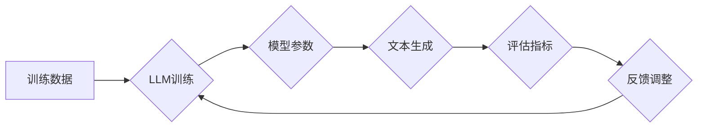

## 大语言模型应用指南：冲突的目标与不匹配的泛化

> 关键词：大语言模型、LLM、自然语言处理、NLP、泛化能力、冲突目标、应用场景、伦理问题

### 1. 背景介绍

近年来，大语言模型（LLM）在自然语言处理（NLP）领域取得了令人瞩目的成就。从文本生成、翻译到问答和代码编写，LLM展现出强大的能力，并逐渐渗透到我们的日常生活。然而，在推动LLM应用的同时，我们也必须面对其潜在的挑战和局限性。

LLM的训练通常依赖于海量文本数据，通过学习语言的统计规律和语义关系来构建复杂的语言表示。然而，这种训练方式也导致了LLM存在一些固有的问题：

* **数据偏差:** 训练数据可能包含社会偏见、歧视性内容等问题，导致LLM在生成文本时也可能表现出类似的偏差。
* **缺乏真实世界知识:** LLM主要依赖文本数据学习，缺乏对真实世界事件、概念和因果关系的理解。
* **泛化能力不足:** LLM在训练数据之外的场景下表现可能不佳，难以应对新的任务和挑战。

### 2. 核心概念与联系

**2.1  大语言模型 (LLM)**

大语言模型是指参数量巨大、训练数据海量的人工智能模型，能够理解和生成人类语言。

**2.2  冲突目标**

在LLM的训练过程中，往往存在着冲突的目标。例如，

* **准确性 vs.流畅性:**  LLM的目标是生成准确、有意义的文本，但同时也需要保证文本的流畅性和自然性。
* **多样性 vs.一致性:**  LLM需要生成多样化的文本，避免重复性，但同时也需要保持一定的文本风格和一致性。
* **安全性 vs.自由度:**  LLM需要避免生成有害、攻击性或不恰当的文本，但同时也需要保留一定的自由度，避免过度审查和限制。

**2.3  不匹配的泛化**

不匹配的泛化是指LLM在训练数据之外的场景下表现不佳，无法有效地应对新的任务和挑战。

**Mermaid 流程图**

### 3. 核心算法原理 & 具体操作步骤

**3.1  算法原理概述**

LLM的核心算法通常是基于Transformer架构的深度神经网络。Transformer网络通过自注意力机制学习文本序列之间的长距离依赖关系，并利用多头注意力机制和编码器-解码器结构实现高效的文本处理。

**3.2  算法步骤详解**

1. **数据预处理:** 将文本数据进行清洗、分词、标记等预处理操作，使其能够被模型理解。
2. **模型训练:** 使用训练数据训练LLM模型，通过反向传播算法不断调整模型参数，使其能够生成更准确、更流畅的文本。
3. **模型评估:** 使用评估指标，例如困惑度、BLEU分数等，评估模型的性能。
4. **模型调优:** 根据评估结果，调整模型参数、训练策略等，以提高模型性能。
5. **模型部署:** 将训练好的模型部署到实际应用场景中，用于文本生成、翻译、问答等任务。

**3.3  算法优缺点**

**优点:**

* 强大的文本处理能力
* 能够学习复杂的语言规律
* 泛化能力较强

**缺点:**

* 训练成本高
* 数据依赖性强
* 存在数据偏差和安全风险

**3.4  算法应用领域**

* 文本生成：小说、诗歌、剧本等
* 机器翻译：将一种语言翻译成另一种语言
* 问答系统：回答用户提出的问题
* 代码生成：自动生成代码
* 聊天机器人：与用户进行自然语言对话

### 4. 数学模型和公式 & 详细讲解 & 举例说明

**4.1  数学模型构建**

LLM通常使用基于Transformer的深度神经网络模型。Transformer网络的核心是自注意力机制，它能够学习文本序列之间的长距离依赖关系。

**4.2  公式推导过程**

自注意力机制的计算公式如下：

$$
Attention(Q, K, V) = softmax(\frac{QK^T}{\sqrt{d_k}})V
$$

其中：

* $Q$：查询矩阵
* $K$：键矩阵
* $V$：值矩阵
* $d_k$：键向量的维度
* $softmax$：softmax函数

**4.3  案例分析与讲解**

例如，在机器翻译任务中，LLM可以将源语言文本作为查询矩阵，将目标语言词典作为键矩阵，并将目标语言词嵌入作为值矩阵。通过自注意力机制，LLM可以学习源语言文本与目标语言词之间的关系，从而生成准确的翻译结果。

### 5. 项目实践：代码实例和详细解释说明

**5.1  开发环境搭建**

使用Python语言和深度学习框架TensorFlow或PyTorch搭建开发环境。

**5.2  源代码详细实现**

使用预训练的LLM模型，例如BERT或GPT-3，并进行微调以适应特定的任务。

**5.3  代码解读与分析**

代码主要包括数据加载、模型定义、模型训练、模型评估等部分。

**5.4  运行结果展示**

使用测试数据评估模型的性能，并展示模型生成的文本结果。

### 6. 实际应用场景

**6.1  文本生成**

* 自动生成新闻报道、产品描述、广告文案等。
* 创建小说、诗歌、剧本等创意内容。

**6.2  机器翻译**

* 将文本从一种语言翻译成另一种语言。
* 支持多种语言对的翻译。

**6.3  问答系统**

* 回答用户提出的问题，提供相关信息。
* 用于客服、教育、搜索等领域。

**6.4  未来应用展望**

* 更智能、更自然的对话系统
* 个性化学习和教育
* 自动化写作和内容创作
* 跨语言理解和沟通

### 7. 工具和资源推荐

**7.1  学习资源推荐**

* Transformer论文：https://arxiv.org/abs/1706.03762
* Hugging Face Transformers库：https://huggingface.co/transformers/

**7.2  开发工具推荐**

* TensorFlow：https://www.tensorflow.org/
* PyTorch：https://pytorch.org/

**7.3  相关论文推荐**

* BERT：https://arxiv.org/abs/1810.04805
* GPT-3：https://openai.com/blog/gpt-3/

### 8. 总结：未来发展趋势与挑战

**8.1  研究成果总结**

LLM在NLP领域取得了显著进展，展现出强大的文本处理能力和泛化能力。

**8.2  未来发展趋势**

* 模型规模和能力的进一步提升
* 更加高效的训练方法和算法
* 增强LLM的安全性和可靠性
* 探索LLM在其他领域的应用

**8.3  面临的挑战**

* 数据偏差和公平性问题
* 缺乏真实世界知识和推理能力
* 安全性和伦理风险

**8.4  研究展望**

未来研究将重点关注解决LLM面临的挑战，使其更加安全、可靠、高效和通用。

### 9. 附录：常见问题与解答

**9.1  LLM如何避免数据偏差？**

可以通过使用更全面、更均衡的数据集、进行数据清洗和去噪、使用对抗训练等方法来减少数据偏差。

**9.2  如何评估LLM的泛化能力？**

可以使用在训练数据之外的测试数据集评估LLM的性能，例如使用GLUE、SuperGLUE等基准数据集。

**9.3  LLM的伦理问题有哪些？**

LLM可能被用于生成虚假信息、进行恶意攻击、侵犯隐私等，因此需要关注其伦理问题，并制定相应的规范和政策。

作者：禅与计算机程序设计艺术 / Zen and the Art of Computer Programming 
