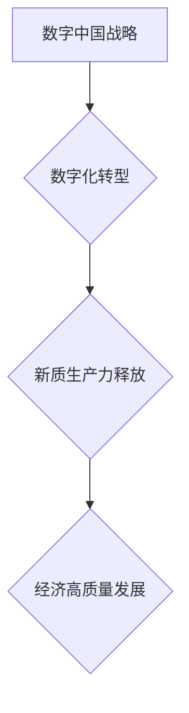

## 数字中国战略与新质生产力的结合点

> 关键词：数字中国战略、新质生产力、人工智能、大数据、云计算、区块链、物联网

### 1. 背景介绍

近年来，中国政府积极推进“数字中国”战略，旨在通过数字化转型，提升国家治理能力和经济竞争力。该战略的核心目标是构建数字经济新基础、培育数字产业新优势、促进数字社会新发展，最终实现数字中国建设。

“新质生产力”是数字经济发展的重要驱动力，它指的是以数字化、网络化、智能化为特征的生产力。新质生产力打破了传统生产方式的局限，赋予企业更强的创新能力、协同能力和效率提升能力。

数字中国战略与新质生产力的结合点在于，通过数字化转型，释放新质生产力的潜力，推动经济高质量发展。

### 2. 核心概念与联系

#### 2.1 数字中国战略

数字中国战略是指以信息化、数字化、智能化为核心，构建数字经济新基础、培育数字产业新优势、促进数字社会新发展，最终实现数字中国建设的国家战略。

#### 2.2 新质生产力

新质生产力是指以数字化、网络化、智能化为特征的生产力，它打破了传统生产方式的局限，赋予企业更强的创新能力、协同能力和效率提升能力。

#### 2.3 核心概念联系

数字中国战略与新质生产力之间存在着密切的联系。数字中国战略旨在通过数字化转型，释放新质生产力的潜力，推动经济高质量发展。

**Mermaid 流程图**



### 3. 核心算法原理 & 具体操作步骤

#### 3.1 算法原理概述

数字中国战略与新质生产力的结合点涉及到多种核心算法，例如机器学习、深度学习、自然语言处理、计算机视觉等。这些算法能够帮助企业实现数据分析、智能决策、自动化生产等，从而提升生产效率和产品质量。

#### 3.2 算法步骤详解

以机器学习为例，其核心步骤包括：

1. 数据收集和预处理：收集相关数据并进行清洗、转换、特征提取等预处理工作。
2. 模型选择：根据具体应用场景选择合适的机器学习模型，例如线性回归、逻辑回归、决策树、支持向量机等。
3. 模型训练：利用训练数据训练机器学习模型，调整模型参数，使其能够准确预测或分类。
4. 模型评估：使用测试数据评估模型的性能，例如准确率、召回率、F1-score等。
5. 模型部署：将训练好的模型部署到实际应用场景中，用于预测或分类新的数据。

#### 3.3 算法优缺点

**优点：**

* 能够自动学习数据模式，提高预测和分类精度。
* 能够处理海量数据，发现隐藏的规律。
* 能够不断学习和改进，提升模型性能。

**缺点：**

* 需要大量的数据进行训练，否则模型性能会下降。
* 模型训练过程复杂，需要专业的技术人员进行操作。
* 模型解释性较差，难以理解模型的决策过程。

#### 3.4 算法应用领域

机器学习算法广泛应用于各个领域，例如：

* **金融领域：**信用风险评估、欺诈检测、投资预测。
* **医疗领域：**疾病诊断、药物研发、患者画像。
* **电商领域：**商品推荐、用户画像、精准营销。
* **制造业：**设备故障预测、生产过程优化、质量控制。

### 4. 数学模型和公式 & 详细讲解 & 举例说明

#### 4.1 数学模型构建

机器学习算法通常基于数学模型进行构建，例如线性回归模型、逻辑回归模型、决策树模型等。这些模型通过数学公式来描述数据之间的关系，并利用这些关系进行预测或分类。

#### 4.2 公式推导过程

以线性回归模型为例，其目标是找到一条直线，使得这条直线与数据点之间的距离最小。

**公式：**

$$y = mx + c$$

其中：

* $y$ 是预测值
* $x$ 是输入特征
* $m$ 是斜率
* $c$ 是截距

**推导过程：**

线性回归模型的目标函数是均方误差，即所有数据点与预测值之间的平方差之和。

$$MSE = \frac{1}{n} \sum_{i=1}^{n} (y_i - \hat{y}_i)^2$$

其中：

* $n$ 是数据点的数量
* $y_i$ 是第 $i$ 个数据点的真实值
* $\hat{y}_i$ 是第 $i$ 个数据点的预测值

通过最小化均方误差，可以得到最佳的斜率 $m$ 和截距 $c$。

#### 4.3 案例分析与讲解

假设我们有一组数据，记录了房屋面积和房屋价格的关系。我们可以使用线性回归模型来预测房屋价格。

**数据：**

| 房屋面积 (平方米) | 房屋价格 (万元) |
|---|---|
| 60 | 1.2 |
| 80 | 1.5 |
| 100 | 1.8 |
| 120 | 2.1 |

**模型训练：**

使用上述数据训练线性回归模型，得到最佳的斜率 $m$ 和截距 $c$。

**预测：**

假设我们有一套面积为 90 平方米的房屋，可以使用训练好的模型来预测其价格。

$$y = mx + c$$

将房屋面积 90 代入公式，即可得到预测价格。

### 5. 项目实践：代码实例和详细解释说明

#### 5.1 开发环境搭建

* Python 3.x
* scikit-learn 库

#### 5.2 源代码详细实现

```python
import pandas as pd
from sklearn.linear_model import LinearRegression

# 加载数据
data = pd.read_csv('house_data.csv')

# 分割数据
X = data[['面积']]
y = data['价格']

# 创建线性回归模型
model = LinearRegression()

# 训练模型
model.fit(X, y)

# 预测价格
new_house_area = 90
predicted_price = model.predict([[new_house_area]])

# 打印预测结果
print(f'预测价格: {predicted_price[0]} 万元')
```

#### 5.3 代码解读与分析

* 首先，我们使用 pandas 库加载数据，并将数据分割成特征变量 $X$ 和目标变量 $y$。
* 然后，我们使用 scikit-learn 库中的 LinearRegression 类创建线性回归模型。
* 接着，我们使用 model.fit() 方法训练模型，将特征变量 $X$ 和目标变量 $y$ 作为输入。
* 训练完成后，我们可以使用 model.predict() 方法预测新的数据。
* 最后，我们打印预测结果。

#### 5.4 运行结果展示

运行上述代码，可以得到预测价格的结果。

### 6. 实际应用场景

数字中国战略与新质生产力的结合点在各个领域都有着广泛的应用场景，例如：

#### 6.1 智能制造

通过人工智能、大数据、物联网等技术的应用，实现生产过程的智能化、自动化和优化，提高生产效率和产品质量。

#### 6.2 数字农业

利用传感器、物联网、大数据分析等技术，实现精准农业，提高农业生产效率和产品质量。

#### 6.3 智能交通

通过人工智能、大数据、物联网等技术的应用，实现交通流量的优化、道路安全管理的提升、智能驾驶的普及等。

#### 6.4 数字医疗

利用人工智能、大数据、云计算等技术，实现疾病诊断的智能化、药物研发的加速、医疗服务的个性化等。

#### 6.5 数字金融

利用人工智能、大数据、区块链等技术，实现金融服务的智能化、风险管理的精准化、金融服务的普惠化等。

#### 6.6 未来应用展望

随着数字技术的不断发展，数字中国战略与新质生产力的结合点将更加深入，应用场景也将更加广泛。例如：

* **数字孪生：**构建数字化的虚拟世界，用于模拟和预测现实世界中的各种场景，例如城市规划、交通管理、工业生产等。
* **元宇宙：**构建沉浸式虚拟世界，为用户提供更加丰富的交互体验，例如虚拟购物、虚拟娱乐、虚拟社交等。
* **Web3.0：**构建去中心化的互联网，赋予用户更多的自主权和控制权，例如去中心化金融、去中心化社交、去中心化数据存储等。

### 7. 工具和资源推荐

#### 7.1 学习资源推荐

* **在线课程：**Coursera、edX、Udacity 等平台提供丰富的机器学习、深度学习等课程。
* **书籍：**《机器学习》、《深度学习》、《Python机器学习实战》等书籍。
* **博客和论坛：**机器学习中文社区、Kaggle 等平台提供丰富的学习资源和交流机会。

#### 7.2 开发工具推荐

* **Python：**机器学习和深度学习的常用编程语言。
* **scikit-learn：**机器学习算法库。
* **TensorFlow、PyTorch：**深度学习框架。
* **Jupyter Notebook：**交互式编程环境。

#### 7.3 相关论文推荐

* **《机器学习》** by Tom Mitchell
* **《深度学习》** by Ian Goodfellow, Yoshua Bengio, and Aaron Courville
* **《自然语言处理》** by Dan Jurafsky and James H. Martin

### 8. 总结：未来发展趋势与挑战

#### 8.1 研究成果总结

数字中国战略与新质生产力的结合点取得了显著的成果，例如：

* **智能制造：**实现生产过程的智能化、自动化和优化，提高生产效率和产品质量。
* **数字农业：**实现精准农业，提高农业生产效率和产品质量。
* **智能交通：**实现交通流量的优化、道路安全管理的提升、智能驾驶的普及等。
* **数字医疗：**实现疾病诊断的智能化、药物研发的加速、医疗服务的个性化等。

#### 8.2 未来发展趋势

未来，数字中国战略与新质生产力的结合点将朝着以下方向发展：

* **更加智能化：**人工智能、深度学习等技术的应用将更加广泛，实现更加智能化的生产和服务。
* **更加融合化：**不同领域的数字技术将更加融合，形成更加完整的数字生态系统。
* **更加普惠化：**数字技术将更加普惠地服务于各个领域和各个群体。

#### 8.3 面临的挑战

数字中国战略与新质生产力的结合点也面临着一些挑战：

* **数据安全和隐私保护：**大数据时代，数据安全和隐私保护问题更加突出。
* **算法伦理：**人工智能算法的应用需要考虑伦理问题，避免算法歧视和偏见。
* **人才短缺：**数字技术发展需要大量的人才，而目前人才供给不足。

#### 8.4 研究展望

未来，我们需要加强对数字中国战略与新质生产力的研究，解决上述挑战，推动数字技术更加健康、可持续地发展。

### 9. 附录：常见问题与解答

**问题：** 数字中国战略与新质生产力之间有什么关系？

**答案：** 数字中国战略旨在通过数字化转型，释放新质生产力的潜力，推动经济高质量发展。

**问题：** 数字中国战略与新质生产力有哪些应用场景？

**答案：** 数字中国战略与新质生产力的结合点在各个领域都有着广泛的应用场景，例如智能制造、数字农业、智能交通、数字医疗、数字金融等。

**问题：** 数字中国战略与新质生产力的发展面临哪些挑战？

**答案：** 数字中国战略与新质生产力的发展面临着数据安全和隐私保护、算法伦理、人才短缺等挑战。


