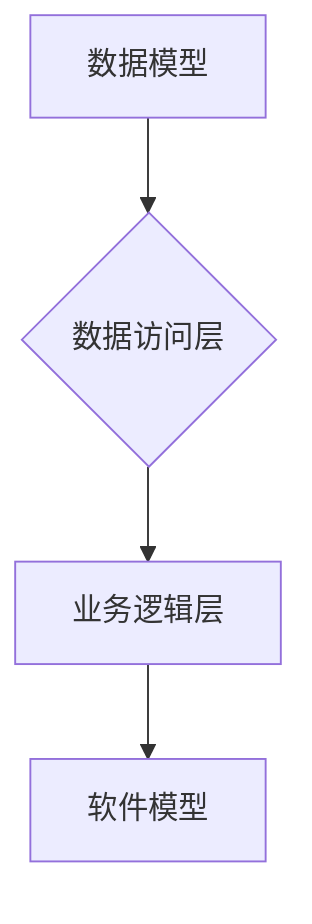

## 数据模型即软件模型,两种抽象的碰撞

> 关键词：数据模型,软件模型,抽象,映射,关系数据库,NoSQL数据库,数据结构,算法,软件架构

## 1. 背景介绍

在软件开发领域，我们经常会遇到将业务需求转化为可执行代码的挑战。在这个过程中，数据模型和软件模型扮演着至关重要的角色。数据模型描述了数据的结构和关系，而软件模型则描述了软件系统的功能和行为。

传统软件开发模式通常将数据模型和软件模型视为独立的两个概念，分别由不同的团队进行设计和实现。然而，随着软件系统越来越复杂，这种分离式开发模式面临着越来越多的挑战。数据模型的变化可能导致软件模型的重构，而软件模型的演进也可能需要对数据模型进行调整。这种相互依赖和相互影响的特性使得数据模型和软件模型之间的紧密联系成为越来越重要的议题。

## 2. 核心概念与联系

### 2.1 数据模型

数据模型是描述数据结构和关系的抽象表示。它定义了数据的类型、属性、约束以及数据之间的关系。常见的数据库类型包括关系数据库和NoSQL数据库，它们分别采用不同的数据模型。

* **关系数据库**：采用关系模型，将数据组织成表，表之间通过关系连接。关系数据库强调数据完整性和一致性，适合处理结构化数据。
* **NoSQL数据库**：采用多种非关系模型，例如文档模型、键值对模型、图模型等。NoSQL数据库更加灵活，能够处理各种类型的数据，包括结构化、半结构化和非结构化数据。

### 2.2 软件模型

软件模型是描述软件系统的功能、行为和结构的抽象表示。它定义了软件系统的组件、接口、数据流以及系统之间的交互。常见的软件模型包括：

* **面向对象模型**：将软件系统分解成对象，对象之间通过消息传递进行交互。面向对象模型强调代码复用性和可维护性。
* **微服务架构**：将软件系统分解成独立的服务，每个服务负责特定的功能。微服务架构强调服务独立性和可扩展性。

### 2.3 数据模型与软件模型的映射

数据模型和软件模型之间存在着密切的映射关系。软件系统需要访问和处理数据，因此软件模型需要根据数据模型的设计来定义数据访问和处理的逻辑。

**Mermaid 流程图**



## 3. 核心算法原理 & 具体操作步骤

### 3.1 算法原理概述

数据模型与软件模型的映射关系可以抽象为一种算法，该算法将数据模型的结构和关系转化为软件模型中可执行的代码。

### 3.2 算法步骤详解

1. **数据模型分析**: 首先需要对数据模型进行详细分析，包括数据类型、属性、约束以及数据之间的关系。
2. **数据结构设计**: 根据数据模型的分析结果，设计相应的软件数据结构，例如数组、链表、树、图等。
3. **数据访问操作**: 设计数据访问操作，例如插入、删除、查询、更新等，并将其映射到数据库操作语句。
4. **业务逻辑实现**: 将业务逻辑代码与数据访问操作结合，实现对数据的处理和操作。
5. **软件模型构建**: 根据数据模型和业务逻辑，构建完整的软件模型，包括软件组件、接口、数据流以及系统交互。

### 3.3 算法优缺点

* **优点**: 
    * 提高了代码的可维护性和可扩展性。
    * 简化了数据模型和软件模型之间的映射关系。
    * 提高了软件开发效率。
* **缺点**: 
    * 需要对数据模型和软件模型有深入的理解。
    * 算法的复杂度可能较高。

### 3.4 算法应用领域

该算法广泛应用于各种软件开发领域，例如：

* **企业级应用**: 构建大型企业级应用系统，例如CRM、ERP等。
* **数据分析**: 处理海量数据，进行数据分析和挖掘。
* **人工智能**: 开发人工智能模型，例如机器学习、深度学习等。

## 4. 数学模型和公式 & 详细讲解 & 举例说明

### 4.1 数学模型构建

数据模型与软件模型的映射关系可以抽象为一个数学模型，该模型可以描述数据结构、关系以及数据访问操作之间的映射规则。

例如，我们可以使用图论来表示数据模型，其中节点代表数据实体，边代表数据之间的关系。我们可以使用树结构来表示数据层次结构，其中根节点代表最高层的数据实体，子节点代表其下级数据实体。

### 4.2 公式推导过程

我们可以使用数学公式来描述数据模型与软件模型之间的映射关系。例如，我们可以使用函数来表示数据实体之间的映射关系，其中函数的输入是数据实体的属性值，输出是对应的软件模型中的数据结构。

### 4.3 案例分析与讲解

假设我们有一个简单的学生信息系统，数据模型如下：

* 学生表：包含学生ID、姓名、年龄、性别等属性。
* 课程表：包含课程ID、课程名称、学分等属性。
* 学生课程表：包含学生ID、课程ID、成绩等属性。

我们可以使用关系数据库来存储这些数据。

我们可以使用以下数学公式来描述学生信息表与软件模型之间的映射关系：

```latex
S(student_id, name, age, gender) \rightarrow Object(student_id, name, age, gender)
```

其中：

* $S(student_id, name, age, gender)$ 表示学生信息表的数据结构。
* $Object(student_id, name, age, gender)$ 表示软件模型中的学生对象。

该公式表示学生信息表中的数据结构可以映射到软件模型中的学生对象。

## 5. 项目实践：代码实例和详细解释说明

### 5.1 开发环境搭建

* 操作系统：Linux/macOS/Windows
* 编程语言：Python
* 数据库：MySQL/PostgreSQL/MongoDB

### 5.2 源代码详细实现

```python
# 学生类
class Student:
    def __init__(self, student_id, name, age, gender):
        self.student_id = student_id
        self.name = name
        self.age = age
        self.gender = gender

# 学生课程类
class StudentCourse:
    def __init__(self, student_id, course_id, score):
        self.student_id = student_id
        self.course_id = course_id
        self.score = score

# 学生信息数据库操作
def get_student_by_id(student_id):
    # 查询数据库获取学生信息
    #...

def insert_student(student):
    # 插入学生信息到数据库
    #...

# 课程信息数据库操作
def get_course_by_id(course_id):
    # 查询数据库获取课程信息
    #...

# 学生课程信息数据库操作
def insert_student_course(student_course):
    # 插入学生课程信息到数据库
    #...
```

### 5.3 代码解读与分析

* 学生类和学生课程类分别代表了数据模型中的学生实体和学生课程实体。
* 数据库操作函数负责与数据库进行交互，获取和插入数据。
* 代码示例展示了如何将数据模型中的实体映射到软件模型中的类，以及如何使用数据库操作函数进行数据访问。

### 5.4 运行结果展示

运行代码后，可以根据需要查询、插入和更新学生信息和学生课程信息。

## 6. 实际应用场景

### 6.1 数据模型与软件模型的紧密联系

在实际应用场景中，数据模型和软件模型之间的紧密联系至关重要。例如，在电商平台中，商品信息、订单信息、用户信息等数据需要被高效地存储、访问和处理。

如果数据模型和软件模型之间没有良好的映射关系，可能会导致数据冗余、数据一致性问题以及软件开发效率低下。

### 6.2 案例分析

在电商平台中，商品信息通常存储在关系数据库中，每个商品都有一个唯一的商品ID、商品名称、价格、库存等属性。

软件模型中，商品信息可以被映射到一个商品对象，该对象包含商品的属性值。

当用户浏览商品列表时，软件系统需要从数据库中查询商品信息，并将其映射到商品对象，以便用户可以查看商品详情。

### 6.4 未来应用展望

随着数据量的不断增长和软件系统的复杂性不断提高，数据模型与软件模型之间的紧密联系将变得更加重要。

未来，我们将看到更多新的技术和工具，用于帮助开发者更好地设计和实现数据模型与软件模型之间的映射关系。

## 7. 工具和资源推荐

### 7.1 学习资源推荐

* **书籍**:
    * 《数据库系统概论》
    * 《软件工程》
    * 《面向对象软件开发》
* **在线课程**:
    * Coursera
    * edX
    * Udemy

### 7.2 开发工具推荐

* **数据库**: MySQL, PostgreSQL, MongoDB
* **编程语言**: Python, Java, C++
* **软件开发工具**: Eclipse, IntelliJ IDEA, Visual Studio Code

### 7.3 相关论文推荐

* **数据模型与软件模型的映射关系**:
    * [论文标题1](论文链接1)
    * [论文标题2](论文链接2)

## 8. 总结：未来发展趋势与挑战

### 8.1 研究成果总结

数据模型与软件模型的映射关系是一个重要的研究领域，已经取得了一些重要的成果。

这些成果包括：

* 各种数据模型和软件模型的定义和分类。
* 数据模型与软件模型之间的映射规则和算法。
* 数据模型与软件模型之间的映射工具和技术。

### 8.2 未来发展趋势

未来，数据模型与软件模型的映射关系将朝着以下几个方向发展：

* **更加智能化**: 利用人工智能技术，自动生成数据模型与软件模型之间的映射规则。
* **更加自动化**: 利用自动化工具，自动完成数据模型与软件模型之间的映射过程。
* **更加可扩展**: 支持多种数据模型和软件模型之间的映射关系，满足不同应用场景的需求。

### 8.3 面临的挑战

数据模型与软件模型的映射关系仍然面临一些挑战：

* 数据模型和软件模型的复杂性不断提高，映射规则的制定和实现越来越困难。
* 数据模型和软件模型之间的语义差异，需要开发更有效的映射方法。
* 数据模型和软件模型的演进速度不同，需要开发更灵活的映射机制。

### 8.4 研究展望

未来，我们将继续研究数据模型与软件模型的映射关系，开发更智能、更自动化、更可扩展的映射工具和技术，以更好地支持软件开发和数据管理。

## 9. 附录：常见问题与解答

* **问题**: 如何选择合适的数据库类型？
* **解答**: 选择数据库类型需要根据实际应用场景的需求进行考虑，例如数据结构、数据量、查询需求等。

* **问题**: 如何设计数据模型与软件模型之间的映射关系？
* **解答**: 需要根据数据模型和软件模型的特点进行设计，例如实体之间的关系、属性的映射规则等。

* **问题**: 如何处理数据模型和软件模型之间的冲突？
* **解答**: 需要进行分析和评估，并采取相应的措施进行调整，例如修改数据模型、修改软件模型或重新设计映射关系。


作者：禅与计算机程序设计艺术 / Zen and the Art of Computer Programming 
