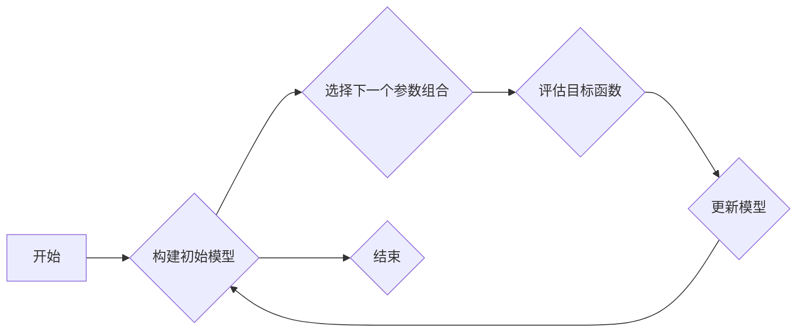

## 机器学习参数的贝叶斯优化

> 关键词：贝叶斯优化、机器学习、超参数调优、概率模型、黑盒优化

## 1. 背景介绍

在机器学习领域，模型的性能很大程度上取决于其参数的设置。这些参数，也称为超参数，通常需要通过反复尝试和调整才能找到最佳组合。传统的超参数调优方法，例如网格搜索和随机搜索，往往效率低下，并且难以探索高维参数空间。

贝叶斯优化 (Bayesian Optimization) 是一种高效的超参数调优方法，它利用概率模型来指导参数搜索过程。与传统的搜索方法不同，贝叶斯优化能够智能地选择下一个需要优化的参数组合，从而显著缩短调优时间，并找到更优的模型参数。

## 2. 核心概念与联系

贝叶斯优化基于贝叶斯理论，它将超参数调优问题看作一个黑盒优化问题。黑盒优化是指我们无法直接观测目标函数的内部结构，只能通过输入参数并观察输出结果来学习目标函数的特性。

贝叶斯优化通过构建一个概率模型来表示目标函数的分布，并利用该模型来指导参数搜索过程。

**核心概念:**

* **目标函数:** 需要优化的函数，通常是模型的性能指标，例如准确率、损失函数等。
* **超参数:** 模型的配置参数，例如学习率、正则化系数等。
* **概率模型:** 用于表示目标函数分布的模型，例如高斯过程。
* **采集函数:** 用于选择下一个需要优化的参数组合的函数。
* **代理模型:** 用于近似目标函数的模型，例如高斯过程回归。

**贝叶斯优化流程图:**



## 3. 核心算法原理 & 具体操作步骤

### 3.1  算法原理概述

贝叶斯优化算法的核心思想是利用概率模型来指导参数搜索过程。它通过以下步骤来实现：

1. **构建初始模型:** 使用有限的样本数据构建一个概率模型，例如高斯过程，来近似目标函数的分布。
2. **选择下一个参数组合:** 使用采集函数来选择下一个需要优化的参数组合，该函数通常基于模型的预测和不确定性来进行选择。
3. **评估目标函数:** 将选出的参数组合输入到目标函数中，并获得相应的输出结果。
4. **更新模型:** 使用新的样本数据更新概率模型，使其更加准确地反映目标函数的分布。
5. **重复步骤2-4:** 重复上述步骤，直到达到预设的终止条件，例如最大迭代次数或目标函数达到预设精度。

### 3.2  算法步骤详解

1. **初始化:** 随机选择一些初始参数组合，并评估其对应的目标函数值。
2. **构建代理模型:** 使用初始样本数据构建一个概率模型，例如高斯过程，来近似目标函数的分布。
3. **选择下一个参数组合:** 使用采集函数来选择下一个需要优化的参数组合。常用的采集函数包括：
    * **Expected Improvement (EI):** 选择具有最大预期改进的候选参数组合。
    * **Probability of Improvement (PI):** 选择具有最大改进概率的候选参数组合。
    * **Upper Confidence Bound (UCB):** 选择具有最大置信上限的候选参数组合。
4. **评估目标函数:** 将选出的参数组合输入到目标函数中，并获得相应的输出结果。
5. **更新代理模型:** 使用新的样本数据更新概率模型，使其更加准确地反映目标函数的分布。
6. **重复步骤3-5:** 重复上述步骤，直到达到预设的终止条件。

### 3.3  算法优缺点

**优点:**

* **高效:** 贝叶斯优化能够智能地选择下一个需要优化的参数组合，从而显著缩短调优时间。
* **全局搜索能力强:** 贝叶斯优化能够有效地探索高维参数空间，并找到全局最优解。
* **适用于黑盒优化问题:** 贝叶斯优化不需要对目标函数进行显式建模，可以应用于各种黑盒优化问题。

**缺点:**

* **计算成本高:** 贝叶斯优化需要构建和更新概率模型，计算成本相对较高。
* **模型选择敏感:** 贝叶斯优化的性能依赖于选择的概率模型，模型选择不当可能会影响算法的效率和精度。
* **参数设置复杂:** 贝叶斯优化算法需要设置一些参数，例如采集函数和模型超参数，参数设置不当可能会影响算法的性能。

### 3.4  算法应用领域

贝叶斯优化广泛应用于机器学习、深度学习、优化算法、自动控制等领域。

* **机器学习超参数调优:** 优化模型的超参数，例如学习率、正则化系数等。
* **深度学习模型训练:** 优化深度学习模型的超参数，例如网络结构、激活函数等。
* **自动控制系统设计:** 优化控制器的参数，以提高系统的性能和稳定性。
* **药物发现:** 优化药物分子结构，以提高其疗效和安全性。

## 4. 数学模型和公式 & 详细讲解 & 举例说明

### 4.1  数学模型构建

贝叶斯优化通常使用高斯过程 (Gaussian Process) 来构建代理模型。高斯过程是一种强大的非参数回归模型，它假设目标函数的输出值服从多元高斯分布。

**高斯过程的数学定义:**

设 $f(x)$ 为目标函数，其中 $x$ 为输入参数。高斯过程假设 $f(x)$ 的输出值服从多元高斯分布:

$$
f(x) \sim GP(m(x), k(x, x'))
$$

其中:

* $m(x)$ 为均值函数，表示输入参数 $x$ 对应的目标函数值期望。
* $k(x, x')$ 为协方差函数，表示输入参数 $x$ 和 $x'$ 对应的目标函数值之间的协方差。

### 4.2  公式推导过程

贝叶斯优化算法的核心是选择下一个需要优化的参数组合。常用的采集函数包括 Expected Improvement (EI) 和 Probability of Improvement (PI)。

**Expected Improvement (EI):**

$$
EI(x) = \left[ f^*(x) - f(x) \right] \Phi \left( \frac{f^*(x) - f(x)}{\sigma(x)} \right) + \sigma(x) \phi \left( \frac{f^*(x) - f(x)}{\sigma(x)} \right)
$$

其中:

* $f^*(x)$ 为目标函数的最佳值。
* $f(x)$ 为代理模型在参数 $x$ 处的预测值。
* $\sigma(x)$ 为代理模型在参数 $x$ 处的预测不确定性。
* $\Phi$ 和 $\phi$ 分别为标准正态分布的累积分布函数和概率密度函数。

**Probability of Improvement (PI):**

$$
PI(x) = \Phi \left( \frac{f^*(x) - f(x)}{\sigma(x)} \right)
$$

其中:

* $f^*(x)$ 为目标函数的最佳值。
* $f(x)$ 为代理模型在参数 $x$ 处的预测值。
* $\sigma(x)$ 为代理模型在参数 $x$ 处的预测不确定性。
* $\Phi$ 为标准正态分布的累积分布函数。

### 4.3  案例分析与讲解

假设我们想要优化一个机器学习模型的超参数，例如学习率。我们可以使用贝叶斯优化算法来进行超参数调优。

1. **构建初始模型:** 我们首先随机选择一些学习率值，并评估其对应的模型性能。然后，使用这些样本数据构建一个高斯过程模型来近似目标函数的分布。
2. **选择下一个参数组合:** 使用 EI 或 PI 采集函数来选择下一个需要优化的学习率值。
3. **评估目标函数:** 将选出的学习率值输入到模型中，并评估其对应的模型性能。
4. **更新模型:** 使用新的样本数据更新高斯过程模型，使其更加准确地反映目标函数的分布。
5. **重复步骤2-4:** 重复上述步骤，直到达到预设的终止条件。

通过贝叶斯优化算法，我们可以找到一个最佳的学习率值，从而提高模型的性能。

## 5. 项目实践：代码实例和详细解释说明

### 5.1  开发环境搭建

* Python 3.6+
* scikit-learn
* GPyOpt

### 5.2  源代码详细实现

```python
from gpyopt import BayesianOptimization

# 定义目标函数
def objective_function(x):
    #... 你的目标函数代码...
    return result

# 定义搜索空间
bounds = [
    (0.1, 0.9),  # 学习率
    (10, 100),  # 其他超参数
]

# 创建贝叶斯优化对象
optimizer = BayesianOptimization(
    f=objective_function,
    pbounds=bounds,
    acquisition_type='EI',
    n_iter=50,
)

# 执行优化
optimizer.run()

# 获取最佳参数组合
best_params = optimizer.x_opt
best_value = optimizer.y_opt

# 打印结果
print(f"最佳参数组合: {best_params}")
print(f"最佳目标函数值: {best_value}")
```

### 5.3  代码解读与分析

* `objective_function(x)`: 这是需要优化的目标函数，其中 `x` 是参数向量。
* `bounds`: 定义了每个参数的搜索范围。
* `BayesianOptimization()`: 创建贝叶斯优化对象，其中 `acquisition_type` 指定采集函数，`n_iter` 指定迭代次数。
* `optimizer.run()`: 执行贝叶斯优化算法。
* `optimizer.x_opt`, `optimizer.y_opt`: 分别获取最佳参数组合和对应的目标函数值。

### 5.4  运行结果展示

运行代码后，会输出最佳参数组合和对应的目标函数值。

## 6. 实际应用场景

贝叶斯优化在机器学习领域有着广泛的应用场景，例如：

* **深度学习模型训练:** 优化深度学习模型的超参数，例如网络结构、学习率、正则化系数等，以提高模型的性能和训练效率。
* **推荐系统:** 优化推荐系统的参数，例如用户相似度计算方法、物品特征选择等，以提高推荐的准确性和个性化程度。
* **自然语言处理:** 优化自然语言处理模型的超参数，例如词嵌入维度、模型层数等，以提高模型的文本理解和生成能力。

### 6.4  未来应用展望

随着机器学习技术的不断发展，贝叶斯优化在未来将有更广泛的应用场景，例如：

* **自动机器学习:** 贝叶斯优化可以用于自动搜索和选择机器学习模型的超参数，从而实现自动机器学习。
* **强化学习:** 贝叶斯优化可以用于优化强化学习算法的超参数，以提高算法的学习效率和性能。
* **云计算资源优化:** 贝叶斯优化可以用于优化云计算资源的分配和调度，以提高资源利用率和系统性能。

## 7. 工具和资源推荐

### 7.1  学习资源推荐

* **书籍:**
    * Gaussian Processes for Machine Learning by Carl Edward Rasmussen and Christopher K. I. Williams
    * Bayesian Optimization: A Practical Guide by Jasper Snoek, Hugo Larochelle, and Ryan P. Adams
* **在线课程:**
    * Bayesian Optimization for Machine Learning by Coursera
    * Bayesian Optimization with Python by DataCamp

### 7.2  开发工具推荐

* **GPyOpt:** Python 库，用于实现贝叶斯优化算法。
* **scikit-optimize:** Python 库，提供贝叶斯优化和其他优化算法的实现。
* **Hyperopt:** Python 库，用于超参数调优，