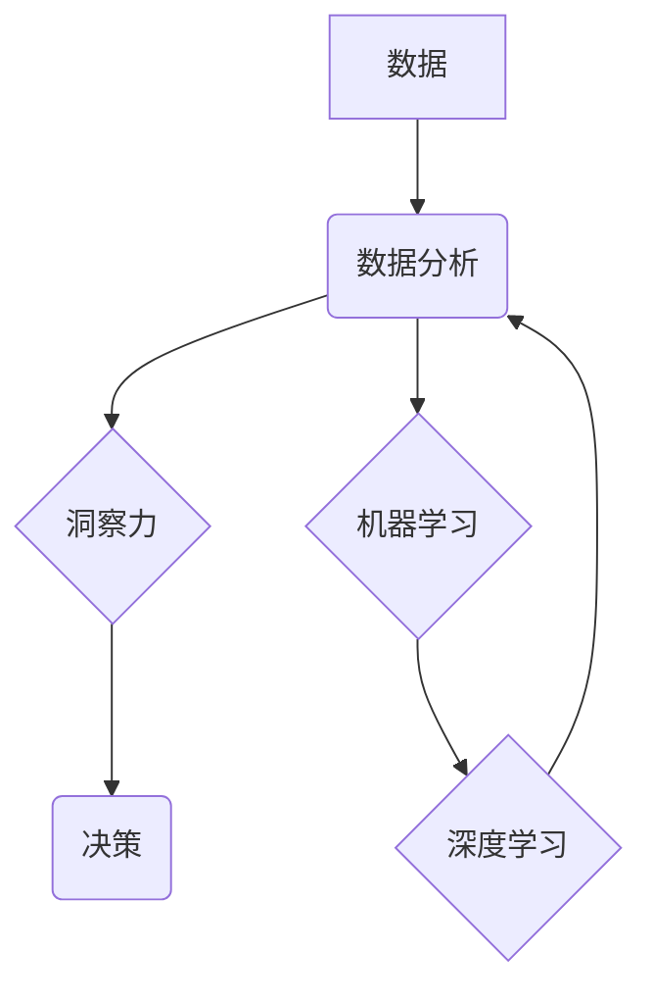

## 洞见的价值：从理解到应用

> 关键词：人工智能、洞察力、数据分析、机器学习、算法、应用场景、实践案例、未来趋势

### 1. 背景介绍

在当今数据爆炸的时代，信息量呈指数级增长。海量数据蕴藏着宝贵的洞察力，但如何从这些数据中提取有价值的信息，并将其转化为实际应用，成为了一个关键挑战。人工智能（AI）作为一种强大的工具，为我们提供了新的视角和方法，帮助我们更好地理解数据，挖掘隐藏的模式和趋势。

传统的分析方法往往依赖于人类经验和直觉，效率低下且容易受到主观因素的影响。而AI算法能够自动学习数据中的规律，并进行更深入的分析，从而发现人类难以察觉的洞察力。例如，在医疗领域，AI算法可以分析患者的病历、影像数据等信息，帮助医生更准确地诊断疾病，制定个性化的治疗方案。

### 2. 核心概念与联系

**2.1 核心概念**

* **数据分析:**  是指从数据中提取有价值信息的过程，包括数据清洗、数据挖掘、数据可视化等步骤。
* **机器学习:**  是一种人工智能技术，通过算法训练模型，使模型能够从数据中学习，并进行预测或分类。
* **深度学习:**  是一种更高级的机器学习方法，利用多层神经网络模拟人类大脑的学习过程，能够处理更复杂的数据类型，并获得更准确的预测结果。
* **洞察力:**  是指对数据背后的本质理解，并从中发现新的知识、趋势或模式。

**2.2 核心概念联系**

数据分析是获取洞察力的基础，而机器学习和深度学习则是数据分析的重要工具。通过这些技术，我们可以从海量数据中提取有价值的信息，并将其转化为洞察力。



### 3. 核心算法原理 & 具体操作步骤

**3.1 算法原理概述**

机器学习算法的核心原理是通过训练模型，使模型能够从数据中学习。训练过程通常包括以下步骤：

1. **数据收集和预处理:** 收集相关数据，并进行清洗、转换、特征工程等预处理工作。
2. **模型选择:** 根据具体任务选择合适的机器学习算法，例如分类算法、回归算法、聚类算法等。
3. **模型训练:** 使用训练数据训练模型，调整模型参数，使模型能够准确地预测或分类。
4. **模型评估:** 使用测试数据评估模型的性能，例如准确率、召回率、F1-score等指标。
5. **模型部署:** 将训练好的模型部署到实际应用场景中，用于预测或分类新的数据。

**3.2 算法步骤详解**

以分类算法为例，详细说明其训练步骤：

1. **数据收集和预处理:** 收集包含特征和标签的数据集，例如图像数据和对应的类别标签。
2. **特征工程:** 对数据进行特征提取和转换，例如对图像数据进行像素值提取、颜色特征提取等。
3. **模型选择:** 选择合适的分类算法，例如支持向量机（SVM）、决策树、随机森林等。
4. **模型训练:** 使用训练数据训练模型，调整模型参数，例如SVM中的核函数参数、决策树中的树深等。
5. **模型评估:** 使用测试数据评估模型的性能，例如准确率、召回率、F1-score等指标。
6. **模型调优:** 根据评估结果，调整模型参数，重新训练模型，以提高模型性能。
7. **模型部署:** 将训练好的模型部署到实际应用场景中，例如用于图像识别、垃圾邮件过滤等。

**3.3 算法优缺点**

* **优点:** 能够自动学习数据中的规律，并进行更深入的分析，发现人类难以察觉的洞察力。
* **缺点:** 需要大量的训练数据，训练过程耗时且资源消耗大。模型的性能受训练数据质量的影响较大，如果训练数据存在偏差，模型可能会产生错误的预测结果。

**3.4 算法应用领域**

机器学习算法广泛应用于各个领域，例如：

* **医疗保健:** 疾病诊断、药物研发、个性化治疗
* **金融服务:** 欺诈检测、风险评估、投资决策
* **电商:** 商品推荐、用户画像、精准营销
* **交通运输:** 自驾车、交通流量预测、物流优化
* **制造业:** 质量控制、设备故障预测、生产流程优化

### 4. 数学模型和公式 & 详细讲解 & 举例说明

**4.1 数学模型构建**

机器学习算法通常基于数学模型，例如线性回归模型、逻辑回归模型、支持向量机模型等。这些模型通过数学公式来描述数据之间的关系，并进行预测或分类。

**4.2 公式推导过程**

以线性回归模型为例，其目标是找到一条直线，能够最佳地拟合数据点。模型的数学公式如下：

$$y = w_0 + w_1x_1 + w_2x_2 +... + w_nx_n$$

其中：

* $y$ 是预测值
* $w_0, w_1, w_2,..., w_n$ 是模型参数
* $x_1, x_2,..., x_n$ 是输入特征

模型参数的求解可以通过最小二乘法来实现。最小二乘法旨在找到一条直线，使得预测值与实际值的差值平方和最小。

**4.3 案例分析与讲解**

假设我们有一组数据，包含房屋面积和房屋价格的信息。我们可以使用线性回归模型来预测房屋价格。

* 输入特征：房屋面积
* 输出特征：房屋价格

通过训练模型，我们可以得到模型参数 $w_0$ 和 $w_1$。然后，我们可以使用这些参数来预测新房屋的价格。例如，如果新房屋面积为 100 平方米，我们可以使用以下公式进行预测：

$$y = w_0 + w_1 * 100$$

其中 $w_0$ 和 $w_1$ 是训练好的模型参数。

### 5. 项目实践：代码实例和详细解释说明

**5.1 开发环境搭建**

* Python 3.x
* Jupyter Notebook
* scikit-learn 库

**5.2 源代码详细实现**

```python
from sklearn.linear_model import LinearRegression
from sklearn.model_selection import train_test_split
import pandas as pd

# 加载数据
data = pd.read_csv('house_data.csv')

# 分割数据
X = data[['面积']]
y = data['价格']
X_train, X_test, y_train, y_test = train_test_split(X, y, test_size=0.2, random_state=42)

# 创建线性回归模型
model = LinearRegression()

# 训练模型
model.fit(X_train, y_train)

# 预测测试数据
y_pred = model.predict(X_test)

# 评估模型性能
from sklearn.metrics import mean_squared_error
mse = mean_squared_error(y_test, y_pred)
print(f'均方误差: {mse}')
```

**5.3 代码解读与分析**

* 首先，我们加载数据并将其分割为训练集和测试集。
* 然后，我们创建线性回归模型并使用训练集进行训练。
* 训练完成后，我们可以使用模型来预测测试数据的房屋价格。
* 最后，我们使用均方误差来评估模型的性能。

**5.4 运行结果展示**

运行代码后，会输出模型的均方误差值。均方误差值越小，模型的预测性能越好。

### 6. 实际应用场景

**6.1 医疗诊断辅助**

AI算法可以分析患者的病历、影像数据等信息，帮助医生更准确地诊断疾病，制定个性化的治疗方案。例如，AI算法可以用于检测癌症、心血管疾病、神经系统疾病等。

**6.2 金融风险评估**

AI算法可以分析客户的财务数据、信用记录等信息，评估客户的信用风险，帮助金融机构做出更明智的贷款决策。

**6.3 个性化推荐系统**

AI算法可以分析用户的行为数据、偏好信息等，推荐用户感兴趣的商品、服务或内容。例如，电商平台可以使用AI算法推荐商品，音乐平台可以使用AI算法推荐歌曲。

**6.4 智能客服系统**

AI算法可以训练聊天机器人，帮助企业提供24小时在线客服服务，解答用户常见问题，提高客户满意度。

**6.5 自动驾驶技术**

AI算法可以帮助车辆感知周围环境，做出驾驶决策，实现自动驾驶功能。

**6.4 未来应用展望**

随着人工智能技术的不断发展，其应用场景将更加广泛，例如：

* **个性化教育:** AI算法可以根据学生的学习情况，提供个性化的学习方案和辅导。
* **精准农业:** AI算法可以分析土壤、气候等数据，帮助农民提高作物产量和质量。
* **智能制造:** AI算法可以帮助工厂自动化生产，提高生产效率和质量。
* **医疗机器人:** AI算法可以帮助机器人进行手术、护理等医疗任务。

### 7. 工具和资源推荐

**7.1 学习资源推荐**

* **在线课程:** Coursera、edX、Udacity 等平台提供丰富的机器学习课程。
* **书籍:** 《机器学习》 (周志华)、《深度学习》 (Ian Goodfellow) 等书籍是机器学习领域的经典著作。
* **博客和论坛:** Kaggle、Towards Data Science 等平台上有许多机器学习相关的博客文章和论坛讨论。

**7.2 开发工具推荐**

* **Python:** 机器学习开发的常用语言，拥有丰富的库和工具。
* **Jupyter Notebook:** 用于编写和运行Python代码的交互式环境。
* **scikit-learn:** Python机器学习库，提供各种算法和工具。
* **TensorFlow:** Google开发的深度学习框架。
* **PyTorch:** Facebook开发的深度学习框架。

**7.3 相关论文推荐**

* **《机器学习》 (周志华)**
* **《深度学习》 (Ian Goodfellow)**
* **《支持向量机》 (Vapnik)**

### 8. 总结：未来发展趋势与挑战

**8.1 研究成果总结**

近年来，人工智能领域取得了长足的进步，机器学习算法在各个领域得到了广泛应用。

**8.2 未来发展趋势**

* **模型更加强大:** 模型规模将继续扩大，算法更加复杂，能够处理更复杂的数据类型，并获得更准确的预测结果。
* **应用更加广泛:** AI技术将应用于更多领域，例如医疗保健、教育、金融、交通运输等。
* **伦理和安全问题:** 随着AI技术的进步，其伦理和安全问题也日益突出，需要加强研究和监管。

**8.3 面临的挑战**

* **数据质量:** AI算法的性能受训练数据质量的影响较大，需要高质量的数据来训练模型。
* **算法解释性:** 许多AI算法是黑箱模型，难以解释其决策过程，这可能会导致信任问题。
* **公平性和偏见:** AI算法可能会存在公平性和偏见问题，需要进行充分的测试和评估，以确保其公平公正。

**8.4 研究展望**

未来，人工智能研究将继续朝着更强大、更智能、更安全的方向发展。我们需要加强基础研究，探索新的算法和模型，并解决伦理和安全问题，以确保AI技术能够真正造福人类。

### 9. 附录：常见问题与解答

**9.1 如何选择合适的机器学习算法？**

选择合适的机器学习算法取决于具体的任务和数据类型。例如，对于分类任务，可以选择支持向量机、决策树、随机森林等算法；对于回归任务，可以选择线性回归、逻辑回归等算法。

**9.2 如何评估机器学习模型的性能？**

常用的评估指标包括准确率、召回率、F1-score、均方误差等。