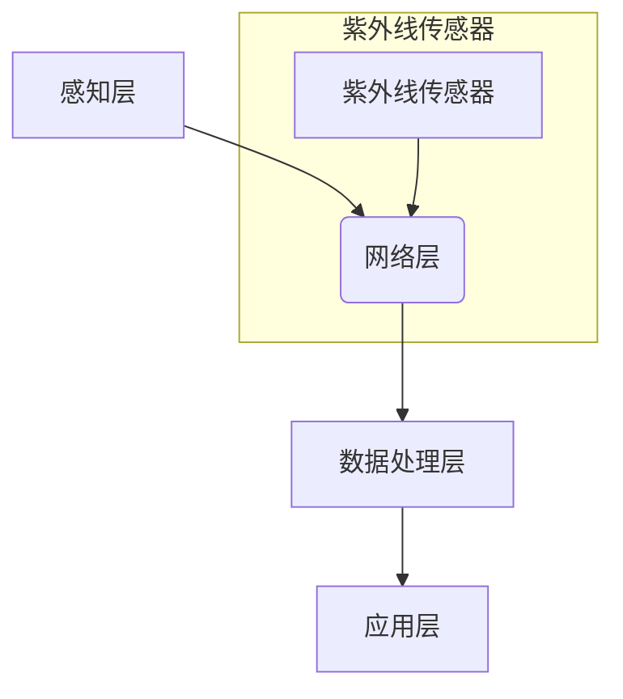

## 物联网(IoT)技术和各种传感器设备的集成：紫外线传感器的应用与发展

> 关键词：物联网、传感器、紫外线、UV传感器、数据采集、应用场景、未来趋势

## 1. 背景介绍

物联网 (IoT) 技术的快速发展，使得各种传感器设备得以广泛应用，为我们提供了收集和分析环境信息的强大工具。其中，紫外线 (UV) 传感器作为一种重要的环境监测传感器，在医疗保健、环境监测、农业生产等领域发挥着越来越重要的作用。

紫外线是一种电磁波，其波长介于可见光和X射线之间。紫外线具有杀菌、消毒、促进维生素D合成等多种特性，但也可能对人体健康造成危害。因此，准确测量和监测紫外线辐射强度对于保障人类健康和环境安全至关重要。

## 2. 核心概念与联系

### 2.1 物联网 (IoT)

物联网是指通过传感器、网络、数据处理和智能应用等技术，将物理世界和数字世界连接起来，实现万物互联的网络体系。物联网的核心概念包括：

* **感知层:** 通过传感器、执行器等设备感知物理世界的信息。
* **网络层:** 利用无线网络、有线网络等技术将感知到的信息传输到云端或其他设备。
* **数据处理层:** 对接收到的数据进行处理、分析和存储，并从中提取有价值的信息。
* **应用层:** 基于数据分析结果，提供各种应用服务，例如远程控制、智能决策、数据可视化等。

### 2.2 传感器

传感器是一种能够将物理量转化为电信号的装置。紫外线传感器是一种专门用于检测紫外线辐射强度的传感器。

### 2.3 紫外线 (UV)

紫外线是一种电磁波，其波长介于可见光和X射线之间。紫外线根据其波长分为 UVA、UVB 和 UVC 三类。其中，UVA 波长最长，对人体皮肤的影响相对较小；UVB 波长中等，对皮肤晒伤和皮肤癌的风险较高；UVC 波长最短，具有较强的杀菌消毒能力，但对人体皮肤和眼睛的危害较大。

### 2.4  架构图



## 3. 核心算法原理 & 具体操作步骤

### 3.1 算法原理概述

紫外线传感器的工作原理主要基于光电效应。当紫外线照射到传感器表面时，会使传感器材料中的电子跃迁到更高的能级，产生电流信号。通过测量电流信号的大小，可以推算出紫外线辐射强度。

### 3.2 算法步骤详解

1. **光电转换:** 紫外线照射到传感器表面，使传感器材料中的电子发生跃迁，产生电流信号。
2. **信号放大:** 将传感器产生的微弱电流信号进行放大，使其能够被后续电路处理。
3. **信号滤波:** 对放大后的信号进行滤波处理，去除噪声和干扰，提高信号的信噪比。
4. **信号转换:** 将滤波后的信号转换为数字信号，以便进行数据处理和分析。
5. **数据处理:** 对数字信号进行处理，例如计算平均值、最大值、最小值等，提取紫外线辐射强度的特征信息。
6. **数据存储和传输:** 将处理后的数据存储到本地数据库或云端数据库，并通过网络传输到其他设备或系统。

### 3.3 算法优缺点

**优点:**

* 测量精度高，能够准确测量紫外线辐射强度。
* 响应速度快，能够实时监测紫外线变化。
* 体积小，重量轻，便于携带和安装。

**缺点:**

* 对环境温度和湿度敏感，需要进行校准和补偿。
* 寿命有限，需要定期更换。
* 对强光照射容易损坏。

### 3.4 算法应用领域

紫外线传感器广泛应用于以下领域:

* **医疗保健:** 用于紫外线消毒、治疗皮肤病、监测紫外线照射量等。
* **环境监测:** 用于监测紫外线辐射强度、空气质量、水质等。
* **农业生产:** 用于监测植物生长、控制病虫害等。
* **工业生产:** 用于检测材料的紫外线吸收率、控制光固化过程等。

## 4. 数学模型和公式 & 详细讲解 & 举例说明

### 4.1 数学模型构建

紫外线传感器输出的电流信号与紫外线辐射强度之间存在一定的线性关系。我们可以用以下数学模型来描述这种关系:

$$I = kP$$

其中:

* $I$ 是传感器输出的电流信号 (单位: A)
* $P$ 是紫外线辐射强度 (单位: W/m²)
* $k$ 是传感器的光电转换系数 (单位: A/W)

### 4.2 公式推导过程

光电转换系数 $k$ 是传感器材料的固有特性，它反映了传感器材料对紫外线照射的响应程度。

### 4.3 案例分析与讲解

假设一个紫外线传感器的光电转换系数为 $k = 10^{-6}$ A/W，当紫外线辐射强度为 $P = 100$ W/m² 时，传感器输出的电流信号为:

$$I = kP = 10^{-6} \times 100 = 0.0001 A$$

## 5. 项目实践：代码实例和详细解释说明

### 5.1 开发环境搭建

* 操作系统: Ubuntu 20.04
* 编程语言: Python 3.8
* 硬件: ESP32 开发板、紫外线传感器模块

### 5.2 源代码详细实现

```python
import time
import board
import adafruit_esp32spi_adafruit_sensor

# 初始化紫外线传感器
sensor = adafruit_esp32spi_adafruit_sensor.ADS1115(board.SCK, board.MISO, board.MOSI)

# 设置数据采集频率
sampling_rate = 1

while True:
    # 读取紫外线传感器数据
    uv_reading = sensor.read_adc(0)

    # 打印数据
    print("紫外线强度:", uv_reading)

    # 等待一段时间
    time.sleep(1 / sampling_rate)
```

### 5.3 代码解读与分析

* 代码首先导入必要的库函数。
* 然后初始化紫外线传感器模块，并设置数据采集频率。
* 在循环中，读取紫外线传感器数据，并将其打印到控制台。
* 最后，等待一段时间，以便于后续数据采集。

### 5.4 运行结果展示

运行代码后，控制台将显示紫外线强度值，单位为 ADC 计数。

## 6. 实际应用场景

### 6.1 紫外线消毒

紫外线具有杀菌消毒的特性，可以用于消毒医疗器械、水源、空气等。紫外线传感器可以监测紫外线辐射强度，确保消毒过程的有效性。

### 6.2 紫外线照射量监测

紫外线照射量过高会对人体健康造成危害，因此需要监测紫外线照射量，并采取相应的防护措施。紫外线传感器可以用于监测紫外线照射量，提醒人们注意防晒。

### 6.3 植物生长监测

紫外线对植物生长有一定的影响，可以促进植物的生长和发育。紫外线传感器可以用于监测植物生长环境中的紫外线辐射强度，帮助优化植物生长条件。

### 6.4 未来应用展望

随着物联网技术的不断发展，紫外线传感器将在更多领域得到应用，例如:

* **智能家居:** 用于监测室内紫外线辐射强度，提醒人们注意防晒。
* **智慧城市:** 用于监测城市环境中的紫外线辐射强度，评估空气质量和环境污染水平。
* **精准农业:** 用于监测田间紫外线辐射强度，优化作物生长条件。

## 7. 工具和资源推荐

### 7.1 学习资源推荐

* **书籍:**
    * 物联网技术入门
    * 传感器技术原理与应用
* **网站:**
    * Adafruit 学习平台: https://learn.adafruit.com/
    * SparkFun 学习平台: https://learn.sparkfun.com/

### 7.2 开发工具推荐

* **IDE:** Arduino IDE, PlatformIO
* **传感器模块:** Adafruit UV Sensor, SparkFun UV Sensor

### 7.3 相关论文推荐

* **紫外线传感器技术综述**
* **物联网环境监测系统设计与实现**

## 8. 总结：未来发展趋势与挑战

### 8.1 研究成果总结

本文介绍了物联网技术和紫外线传感器的集成，并阐述了其核心概念、算法原理、应用场景等。紫外线传感器在医疗保健、环境监测、农业生产等领域发挥着越来越重要的作用。

### 8.2 未来发展趋势

未来，紫外线传感器将朝着以下方向发展:

* **小型化和低功耗:** 为了满足物联网设备的应用需求，紫外线传感器将更加小型化和低功耗。
* **集成化:** 紫外线传感器将与其他传感器和微控制器集成在一起，形成更加智能化的传感器节点。
* **智能化:** 紫外线传感器将结合人工智能技术，实现更加智能化的数据分析和应用。

### 8.3 面临的挑战

紫外线传感器的发展也面临着一些挑战:

* **成本:** 目前紫外线传感器的成本相对较高，需要进一步降低成本，使其更加普及。
* **稳定性:** 紫外线传感器对环境温度和湿度敏感，需要提高其稳定性和可靠性。
* **数据安全:** 紫外线传感器收集到的数据涉及到个人隐私和安全，需要采取相应的安全措施。

### 8.4 研究展望

未来，我们将继续研究紫外线传感器技术，探索其在更多领域的应用，并致力于解决其面临的挑战，推动其技术发展和产业化应用。

## 9. 附录：常见问题与解答

### 9.1 如何选择合适的紫外线传感器?

选择紫外线传感器时，需要考虑以下因素:

* **测量范围:** 紫外线传感器的测量范围应满足应用需求。
* **精度:** 紫外线传感器的精度应能够满足应用要求。
* **响应速度:** 紫外线传感器的响应速度应能够满足应用需求。
* **成本:** 紫外线传感器的成本应符合预算。

### 9.2 如何校准紫外线传感器?

紫外线传感器需要定期校准，以确保其测量精度。校准方法通常包括使用标准紫外线光源进行校准。

### 9.3 如何处理紫外线传感器数据?

紫外线传感器数据需要进行处理，例如计算平均值、最大值、最小值等，提取紫外线辐射强度的特征信息。

### 9.4 紫外线传感器如何与物联网平台集成?

紫外线传感器可以通过无线网络或有线网络与物联网平台集成，实现数据传输和远程控制。


作者：禅与计算机程序设计艺术 / Zen and the Art of Computer Programming 
