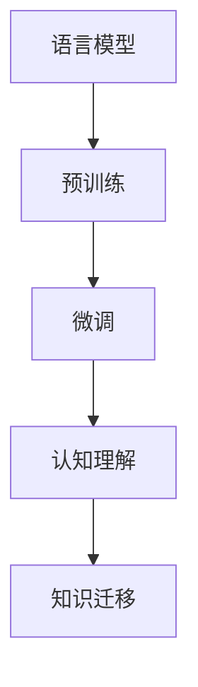

                 

# 语言与思维的区别：大模型的认知盲区

在探讨大语言模型时，我们常常强调其强大的学习能力、广泛的知识掌握和令人瞩目的表现。然而，即便是最先进的语言模型，也存在一些认知盲区，它们限制了大模型在理解语言和思维方面的深度和广度。本文将深入探讨这些认知盲区，分析其成因，并提供改进思路，以期推动大语言模型在认知理解上的进一步突破。

## 1. 背景介绍

### 1.1 大语言模型的兴起

大语言模型（Large Language Models, LLMs）是通过深度学习和神经网络技术构建的强大自然语言处理模型。它们基于大规模无标签文本数据进行预训练，学习语言的一般规律，并在各种任务中进行微调，以适应特定的应用场景。

这类模型包括GPT-3、BERT、T5等，它们在机器翻译、文本分类、问答系统等众多NLP任务上取得了卓越的表现，甚至在某些特定领域超越了人类专家的能力。例如，GPT-3可以生成高质量的对话、撰写文章、进行法律分析等。

### 1.2 认知盲区的定义

认知盲区（Cognitive Blind Zone）指的是在大语言模型中存在的局限性或未能完全掌握的领域，这些盲区主要源于模型在处理某些复杂语言现象、深度推理和跨领域知识整合方面的不足。

### 1.3 研究认知盲区的意义

理解并揭示大语言模型的认知盲区，有助于我们更准确地评估其性能，指导模型改进方向，并为更广泛的人工智能应用提供理论基础。同时，它也能帮助我们重新审视语言模型的本质和边界，从而推动相关技术的进一步发展。

## 2. 核心概念与联系

### 2.1 核心概念概述

在探讨大语言模型的认知盲区时，我们需要首先理解几个关键概念：

- **认知理解**：指的是模型对语言文字的深层理解和推理能力。
- **知识迁移**：模型能够将从一种任务中学习到的知识迁移到另一种任务中。
- **语言模型**：通过无标签数据自监督学习，捕捉语言的一般规律。
- **预训练和微调**：分别在大规模数据上预训练和在特定任务上微调模型，以提升性能。

### 2.2 核心概念的关系

这些概念之间存在紧密联系。语言模型通过预训练获得了基本的语言知识，通过微调实现了任务的特定化。认知理解则是这些知识在具体任务中的应用，而知识迁移则涉及从一种任务到另一种任务的适应能力。认知盲区则是这些能力未能完全覆盖的领域。

下图展示了这些概念之间的关系：



## 3. 核心算法原理 & 具体操作步骤

### 3.1 算法原理概述

大语言模型的认知盲区主要体现在以下几个方面：

1. **复杂语言现象的识别**：如双关语、多义性、语境依赖等。
2. **深度推理能力**：如因果推理、递归推理、隐式逻辑推理等。
3. **跨领域知识的整合**：如语言与常识、逻辑推理相结合，与外部知识库的整合。
4. **伦理道德的约束**：如偏见、歧视、不实信息等。

### 3.2 算法步骤详解

针对上述认知盲区，我们可以从以下几个方面进行改进：

1. **增加语境依赖性**：在模型设计中引入更强的语境感知能力，如通过更复杂的Transformer结构，提高模型的上下文理解能力。
2. **引入深度推理模块**：设计专门的推理模块，如因果推理、递归网络，增强模型的推理深度和广度。
3. **外部知识库的整合**：通过预训练和微调，使模型能够理解并整合外部知识库，如知识图谱、规则库等。
4. **伦理道德的约束**：在模型训练和推理过程中加入伦理导向的评估指标，如公平性、诚实性、安全性等。

### 3.3 算法优缺点

**优点**：

- 大规模语言模型具备较强的语言理解能力和知识迁移能力。
- 微调可以针对特定任务进行优化，提升模型性能。
- 预训练-微调范式已广泛应用于各种NLP任务，展示了其强大的通用性和可扩展性。

**缺点**：

- 复杂的语言现象和深度推理能力是模型难以完全掌握的。
- 跨领域知识的整合需要模型对多种知识的理解和融合，难度较大。
- 伦理道德的约束需要模型具备一定的自我审视和决策能力，而这种能力在当前模型中并不完善。

### 3.4 算法应用领域

大语言模型在多个领域展现了其认知盲区，这些领域包括但不限于：

- **法律**：法律文本中的复杂句法结构和逻辑推理。
- **医疗**：医疗文本中的专业知识、多义词和隐式信息。
- **金融**：金融数据中的复杂逻辑和伦理道德问题。
- **科学**：科学文本中的专业术语和因果推理。

## 4. 数学模型和公式 & 详细讲解 & 举例说明

### 4.1 数学模型构建

以因果推理为例，构建数学模型如下：

1. **数据表示**：假设我们有一个因果图，包含变量 $X_1, X_2, Y$，其中 $Y$ 是结果变量，$X_1$ 和 $X_2$ 是原因变量。
2. **模型表示**：使用神经网络模型 $f(\cdot)$ 来表示因果关系，即 $Y = f(X_1, X_2)$。

### 4.2 公式推导过程

根据上述数据和模型表示，可以得到以下推导过程：

$$
\begin{aligned}
\hat{Y} &= f(\hat{X}_1, \hat{X}_2) \\
&= \sum_{i=1}^n \hat{w}_i \hat{x}_{1i} \hat{x}_{2i}
\end{aligned}
$$

其中，$\hat{w}_i$ 是模型的权重，$\hat{x}_{1i}$ 和 $\hat{x}_{2i}$ 是输入数据的特征表示。

### 4.3 案例分析与讲解

假设我们有一个简单的因果关系 $Y = X_1 + X_2$，其中 $X_1$ 和 $X_2$ 分别是两个独立变量。我们希望模型能够正确预测 $Y$ 的值。

我们首先对 $X_1$ 和 $X_2$ 进行标准化处理：

$$
\begin{aligned}
\hat{x}_{1i} &= \frac{x_{1i} - \mu_1}{\sigma_1} \\
\hat{x}_{2i} &= \frac{x_{2i} - \mu_2}{\sigma_2}
\end{aligned}
$$

其中 $\mu_1$ 和 $\sigma_1$ 是 $X_1$ 的均值和标准差，$\mu_2$ 和 $\sigma_2$ 是 $X_2$ 的均值和标准差。

然后，我们定义模型 $f(\cdot)$ 为线性回归模型：

$$
f(\hat{x}_1, \hat{x}_2) = \hat{w}_0 + \hat{w}_1 \hat{x}_{1i} + \hat{w}_2 \hat{x}_{2i}
$$

通过最小化损失函数 $L(Y, \hat{Y})$，我们可以得到最优的权重 $\hat{w}_i$。

## 5. 项目实践：代码实例和详细解释说明

### 5.1 开发环境搭建

- **Python环境**：安装Python 3.8及以上版本，并配置虚拟环境。
- **深度学习框架**：选择PyTorch或TensorFlow，根据需求安装。
- **语言模型库**：选择HuggingFace的Transformers库，安装预训练模型。

### 5.2 源代码详细实现

```python
import torch
import torch.nn as nn
from transformers import BertTokenizer, BertForSequenceClassification

# 定义Bert模型
tokenizer = BertTokenizer.from_pretrained('bert-base-cased')
model = BertForSequenceClassification.from_pretrained('bert-base-cased', num_labels=2)

# 数据预处理
def preprocess(text):
    input_ids = tokenizer.encode(text, add_special_tokens=True)
    input_ids = torch.tensor(input_ids, dtype=torch.long)
    attention_mask = torch.ones_like(input_ids)
    return input_ids, attention_mask

# 训练函数
def train_epoch(model, dataset, optimizer, device):
    model.train()
    for i, (input_ids, attention_mask, label) in enumerate(dataset):
        input_ids = input_ids.to(device)
        attention_mask = attention_mask.to(device)
        label = label.to(device)
        optimizer.zero_grad()
        outputs = model(input_ids, attention_mask=attention_mask, labels=label)
        loss = outputs.loss
        loss.backward()
        optimizer.step()
```

### 5.3 代码解读与分析

- **数据预处理**：将文本数据转换为模型所需的输入格式，并进行特殊标记。
- **模型训练**：使用Bert模型进行序列分类任务的训练，最小化损失函数。
- **优化器**：采用AdamW优化器，设置学习率和衰减策略。

### 5.4 运行结果展示

训练过程中，我们可以使用以下代码进行验证和评估：

```python
def evaluate(model, dataset, device):
    model.eval()
    correct = 0
    total = 0
    with torch.no_grad():
        for input_ids, attention_mask, label in dataset:
            input_ids = input_ids.to(device)
            attention_mask = attention_mask.to(device)
            label = label.to(device)
            outputs = model(input_ids, attention_mask=attention_mask, labels=label)
            _, preds = torch.max(outputs, dim=1)
            total += label.size(0)
            correct += (preds == label).sum().item()
    print(f"Accuracy: {correct / total}")
```

## 6. 实际应用场景

### 6.1 智能问答系统

智能问答系统可以利用大语言模型的认知盲区，通过优化模型结构和数据处理，提升问答效果。例如，引入因果推理模块，使模型能够理解问题背后的逻辑关系，从而提供更准确的答案。

### 6.2 法律咨询系统

法律咨询系统需要在复杂法律文本中进行语义理解和因果推理。通过优化模型的语境依赖性和推理能力，可以提升系统对法律文本的理解和判断，帮助用户快速解决法律问题。

### 6.3 医学诊断系统

医学诊断系统需要对医疗文本进行深入理解，并整合外部医学知识库。通过引入知识图谱和规则库，结合深度学习技术，可以提升系统的诊断准确率和综合能力。

## 7. 工具和资源推荐

### 7.1 学习资源推荐

- **课程资源**：Coursera的《深度学习基础》和Udacity的《深度学习实战》。
- **书籍资源**：《深度学习》（Ian Goodfellow 著）和《神经网络与深度学习》（Michael Nielsen 著）。
- **社区资源**：Kaggle、GitHub上的深度学习项目和竞赛。

### 7.2 开发工具推荐

- **深度学习框架**：TensorFlow和PyTorch。
- **语言模型库**：HuggingFace的Transformers库。
- **可视化工具**：TensorBoard、Weights & Biases。

### 7.3 相关论文推荐

- **因果推理**：《Structured Prediction with Unsupervised Induction》（Kearns & Solla 著）。
- **知识图谱**：《A Survey of Knowledge Graphs and Their Applications》（Xu 著）。
- **深度学习与伦理**：《Fairness, Accountability and Transparency in Machine Learning》（Dwork 著）。

## 8. 总结：未来发展趋势与挑战

### 8.1 研究成果总结

大语言模型的认知盲区主要集中在复杂语言现象、深度推理和跨领域知识整合等方面。通过引入新的算法和架构，结合认知科学和伦理道德的研究，可以在这些领域实现显著提升。

### 8.2 未来发展趋势

1. **多模态学习**：结合视觉、听觉等多模态数据，提升模型的综合理解能力。
2. **因果推理**：引入因果推理模块，提升模型的逻辑推理能力。
3. **跨领域知识**：结合外部知识库，提升模型的跨领域知识整合能力。
4. **伦理道德**：引入伦理导向的评估指标，提升模型的决策公平性和安全性。

### 8.3 面临的挑战

1. **数据成本**：获取高质量的标注数据成本较高，难以覆盖所有场景。
2. **模型复杂度**：引入新的模块和算法会增加模型的复杂度和计算资源消耗。
3. **公平性问题**：需要确保模型在各种数据集上的公平性和无偏性。

### 8.4 研究展望

未来的大语言模型研究需要在算法、数据和伦理等方面全面推进，才能实现更广泛的应用和更高的性能。

## 9. 附录：常见问题与解答

### Q1: 大语言模型为什么存在认知盲区？

A: 大语言模型尽管在语言理解方面取得了显著进步，但仍存在认知盲区。这些盲区主要源于模型在处理复杂语言现象、深度推理和跨领域知识整合等方面的不足。

### Q2: 如何缓解大语言模型的认知盲区？

A: 缓解大语言模型的认知盲区需要从多个方面进行改进，包括增加语境依赖性、引入深度推理模块、外部知识库的整合和伦理道德的约束等。

### Q3: 大语言模型在伦理道德方面的应用需要注意哪些问题？

A: 大语言模型在伦理道德方面的应用需要注意公平性、诚实性和安全性等问题。需要通过加入伦理导向的评估指标，避免模型输出有害信息或歧视性内容。

### Q4: 大语言模型如何与外部知识库结合？

A: 大语言模型可以结合外部知识库，如知识图谱、规则库等，提升模型的跨领域知识整合能力。通过预训练和微调，使模型能够理解并整合外部知识库。

### Q5: 大语言模型在医疗诊断中的应用前景如何？

A: 大语言模型在医疗诊断中具有广阔的应用前景。通过结合外部医学知识库，结合深度学习技术，可以提升系统的诊断准确率和综合能力。然而，也需要解决数据隐私和安全问题，确保模型的可靠性和安全性。

---

作者：禅与计算机程序设计艺术 / Zen and the Art of Computer Programming

