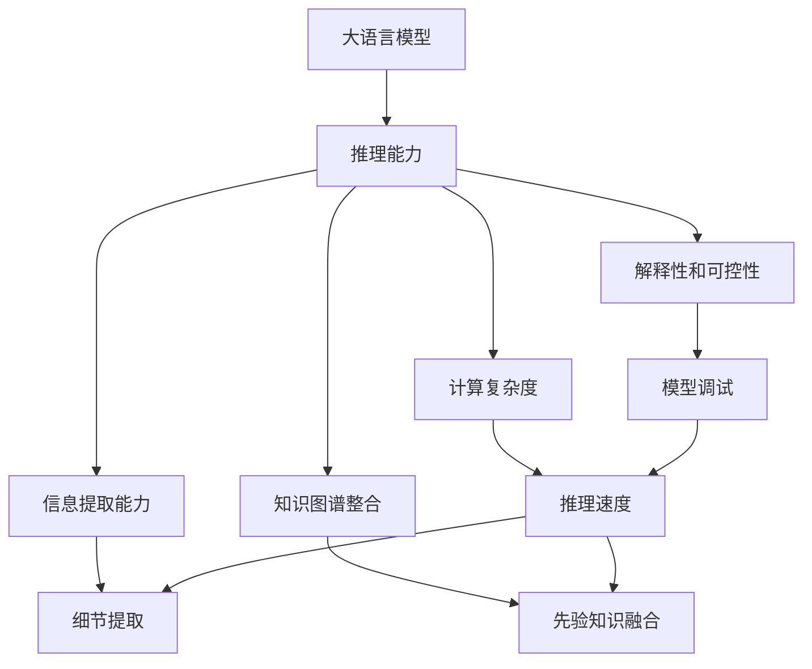
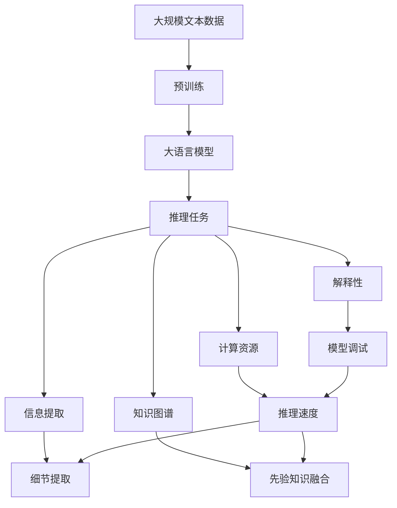

                 

# 语言与推理：大模型的瓶颈

> 关键词：大语言模型,推理能力,瓶颈,计算复杂度,信息提取,知识图谱,解释性,可解释性

## 1. 背景介绍

在人工智能领域，大语言模型以其卓越的语言理解和生成能力，在自然语言处理(NLP)和人工智能(AI)领域取得了显著成果。然而，尽管大模型在许多NLP任务中表现出色，但在某些复杂推理任务中仍存在瓶颈，限制了其应用范围和效果。本文旨在探讨大语言模型的推理能力及其瓶颈，提出解决策略，以期促进其在更广泛场景中的应用。

### 1.1 问题由来

随着深度学习技术的快速发展，大语言模型（如GPT、BERT等）在NLP任务中取得了显著成果。这些模型通过在大规模无标签文本上预训练，学习到了丰富的语言知识和常识。然而，这些模型在复杂推理任务（如自然语言推理、问答、对话系统等）中，推理能力仍有待提高。这些问题主要体现在模型在处理长文本、跨领域知识、低资源场景时的推理效果不佳，以及模型的解释性和可控性不足。

### 1.2 问题核心关键点

大语言模型的推理能力瓶颈主要包括以下几个方面：

1. **计算复杂度**：大模型的推理过程往往涉及大量计算，导致推理速度较慢，难以应对实时性要求高的任务。
2. **信息提取能力**：尽管大模型能够理解文本，但在处理多源信息融合、细节信息提取时，仍然存在不足。
3. **知识图谱整合**：大模型难以灵活整合外部知识库，无法充分利用外部世界的先验知识。
4. **解释性和可控性**：大模型缺乏对推理过程的解释，难以进行模型调试和问题诊断。

## 2. 核心概念与联系

### 2.1 核心概念概述

为了更好地理解大模型的推理能力及其瓶颈，本文将介绍几个关键概念：

- **大语言模型（Large Language Model, LLM）**：以自回归（如GPT）或自编码（如BERT）模型为代表的大规模预训练语言模型，通过在大规模无标签文本上预训练，学习到丰富的语言知识和常识。
- **推理能力**：指模型能够根据已有知识和文本信息，推理出新的结论或执行特定任务的能力。
- **计算复杂度**：指模型执行推理任务所需的计算资源，包括计算量和内存占用等。
- **信息提取能力**：指模型从文本中提取关键信息，进行推理判断的能力。
- **知识图谱**：一种结构化表示知识的方式，将实体、属性和关系整合到统一的图结构中。
- **解释性和可控性**：指模型推理过程的可解释性和对推理过程的调控能力。

这些概念之间存在紧密联系，共同构成了大模型推理能力的关键要素。

### 2.2 概念间的关系

这些核心概念之间的逻辑关系可以通过以下Mermaid流程图来展示：



这个流程图展示了大语言模型的推理能力与其关键要素之间的联系：

1. 大语言模型通过推理能力执行各种NLP任务。
2. 计算复杂度影响推理速度，信息提取能力影响细节处理，知识图谱整合增强推理效果，解释性和可控性提升模型透明度和调试能力。

这些概念共同构成了大模型推理能力的关键要素，对其性能和应用场景有重要影响。

### 2.3 核心概念的整体架构

最后，我们用一个综合的流程图来展示这些核心概念在大模型推理过程中的整体架构：



这个综合流程图展示了从预训练到推理任务的整体过程，以及各个关键要素的相互关系。

## 3. 核心算法原理 & 具体操作步骤
### 3.1 算法原理概述

大语言模型的推理能力主要基于其预训练得到的语言表示和知识库。在推理过程中，模型通过输入文本，在预训练参数的基础上进行微调，以优化在特定任务上的性能。具体来说，推理能力主要体现在以下几个方面：

1. **语义理解**：模型能够理解输入文本的语义，识别出关键信息。
2. **知识融合**：模型能够整合外部知识库，增强推理能力。
3. **推理判断**：模型根据已有知识和文本信息，执行推理判断，得出结论。

### 3.2 算法步骤详解

大语言模型的推理过程通常包括以下关键步骤：

**Step 1: 数据准备**
- 收集和预处理推理任务所需的输入文本和知识库。
- 使用大模型的分词器将文本分词，并转化为模型所需的token ids。

**Step 2: 模型推理**
- 将token ids输入模型，进行前向传播计算。
- 根据模型的输出，进行解码和推理判断，得出结论。

**Step 3: 后处理**
- 对推理结果进行后处理，如排序、筛选、验证等，以符合任务需求。
- 返回推理结果，进行后续应用。

### 3.3 算法优缺点

大语言模型的推理能力具有以下优点：

1. **语言理解能力强**：大模型通过大规模语料的预训练，具备强大的语言理解和生成能力。
2. **知识融合能力强**：大模型能够整合外部知识库，增强推理效果。
3. **泛化能力强**：大模型能够处理多种推理任务，具有较强的泛化能力。

同时，这些模型也存在一些缺点：

1. **计算复杂度高**：推理过程涉及大量计算，推理速度较慢。
2. **细节提取不足**：大模型在处理细节信息时存在不足。
3. **先验知识依赖性高**：模型难以整合外部知识，导致推理效果受限。
4. **解释性不足**：推理过程缺乏解释，难以进行模型调试和问题诊断。

### 3.4 算法应用领域

大语言模型的推理能力在以下领域有广泛应用：

- **自然语言推理（NLI）**：判断两个文本之间的逻辑关系。
- **问答系统**：根据用户提问，给出准确答案。
- **对话系统**：进行多轮对话，理解用户意图并生成回复。
- **文本摘要**：从长文本中提取关键信息，生成简洁摘要。
- **情感分析**：分析文本情感倾向，进行情绪识别。

这些应用领域充分展示了大语言模型在推理能力上的优势，但也暴露了其计算复杂度、信息提取、知识融合和解释性等方面的瓶颈。

## 4. 数学模型和公式 & 详细讲解
### 4.1 数学模型构建

大语言模型的推理能力主要基于其预训练得到的语言表示和知识库。在推理过程中，模型通过输入文本，在预训练参数的基础上进行微调，以优化在特定任务上的性能。

定义模型 $M_{\theta}$ 在输入 $x$ 上的输出为 $y$，即 $y = M_{\theta}(x)$。模型的推理过程可以通过下式表示：

$$
y = M_{\theta}(x) = \mathop{\arg\max}_{y} P(y|x)
$$

其中，$P(y|x)$ 为模型在输入 $x$ 下输出 $y$ 的概率分布。

### 4.2 公式推导过程

假设输入文本为 $x = (x_1, x_2, ..., x_n)$，模型输出为 $y = (y_1, y_2, ..., y_n)$，则推理过程可以表示为：

$$
P(y|x) = \prod_{i=1}^n P(y_i|x_i)
$$

其中，$P(y_i|x_i)$ 为模型在单个token上的预测概率。通过最大化 $P(y|x)$，得到模型推理结果。

### 4.3 案例分析与讲解

以自然语言推理（NLI）任务为例，推理过程如下：

- 输入两个文本 $premise$ 和 $hypothesis$，模型计算 $premise$ 和 $hypothesis$ 之间的逻辑关系。
- 模型将 $premise$ 和 $hypothesis$ 转换为向量表示，并计算向量之间的相似度。
- 模型根据预训练参数和向量表示，输出 $premise$ 和 $hypothesis$ 之间的关系类型（如蕴含、矛盾、中立）。

## 5. 项目实践：代码实例和详细解释说明
### 5.1 开发环境搭建

在进行推理实践前，我们需要准备好开发环境。以下是使用Python进行PyTorch开发的环境配置流程：

1. 安装Anaconda：从官网下载并安装Anaconda，用于创建独立的Python环境。

2. 创建并激活虚拟环境：
```bash
conda create -n pytorch-env python=3.8 
conda activate pytorch-env
```

3. 安装PyTorch：根据CUDA版本，从官网获取对应的安装命令。例如：
```bash
conda install pytorch torchvision torchaudio cudatoolkit=11.1 -c pytorch -c conda-forge
```

4. 安装Transformers库：
```bash
pip install transformers
```

5. 安装各类工具包：
```bash
pip install numpy pandas scikit-learn matplotlib tqdm jupyter notebook ipython
```

完成上述步骤后，即可在`pytorch-env`环境中开始推理实践。

### 5.2 源代码详细实现

这里我们以自然语言推理（NLI）任务为例，给出使用Transformers库对BERT模型进行推理的PyTorch代码实现。

首先，定义NLI任务的数据处理函数：

```python
from transformers import BertTokenizer
from torch.utils.data import Dataset
import torch

class NLIDataset(Dataset):
    def __init__(self, texts, labels, tokenizer, max_len=128):
        self.texts = texts
        self.labels = labels
        self.tokenizer = tokenizer
        self.max_len = max_len
        
    def __len__(self):
        return len(self.texts)
    
    def __getitem__(self, item):
        premise = self.texts[item][0]
        hypothesis = self.texts[item][1]
        label = self.labels[item]
        
        encoding = self.tokenizer(premise, hypothesis, return_tensors='pt', max_length=self.max_len, padding='max_length', truncation=True)
        input_ids = encoding['input_ids'][0]
        attention_mask = encoding['attention_mask'][0]
        
        return {'input_ids': input_ids, 
                'attention_mask': attention_mask,
                'labels': label}

# 标签与id的映射
label2id = {'contradiction': 0, 'entailment': 1, 'neutral': 2}
id2label = {v: k for k, v in label2id.items()}

# 创建dataset
tokenizer = BertTokenizer.from_pretrained('bert-base-cased')

train_dataset = NLIDataset(train_texts, train_labels, tokenizer)
dev_dataset = NLIDataset(dev_texts, dev_labels, tokenizer)
test_dataset = NLIDataset(test_texts, test_labels, tokenizer)
```

然后，定义模型和推理函数：

```python
from transformers import BertForSequenceClassification

model = BertForSequenceClassification.from_pretrained('bert-base-cased', num_labels=len(label2id))

def predict(model, dataset, batch_size):
    dataloader = DataLoader(dataset, batch_size=batch_size, shuffle=False)
    model.eval()
    preds = []
    with torch.no_grad():
        for batch in dataloader:
            input_ids = batch['input_ids'].to(device)
            attention_mask = batch['attention_mask'].to(device)
            labels = batch['labels'].to(device)
            outputs = model(input_ids, attention_mask=attention_mask, labels=labels)
            logits = outputs.logits
            batch_preds = torch.argmax(logits, dim=1).tolist()
            for pred in batch_preds:
                preds.append(pred)
                
    return preds
```

最后，启动推理流程并在测试集上评估：

```python
batch_size = 16

print('Prediction on test set:')
preds = predict(model, test_dataset, batch_size)
print(classification_report(test_labels, preds))
```

以上就是使用PyTorch对BERT进行自然语言推理任务推理的完整代码实现。可以看到，得益于Transformers库的强大封装，我们可以用相对简洁的代码完成BERT模型的推理。

### 5.3 代码解读与分析

让我们再详细解读一下关键代码的实现细节：

**NLIDataset类**：
- `__init__`方法：初始化文本、标签、分词器等关键组件。
- `__len__`方法：返回数据集的样本数量。
- `__getitem__`方法：对单个样本进行处理，将文本输入编码为token ids，并将标签转换为模型所需的格式。

**label2id和id2label字典**：
- 定义了标签与数字id之间的映射关系，用于将模型输出解码为具体的推理结果。

**推理函数**：
- 使用PyTorch的DataLoader对数据集进行批次化加载，供模型推理使用。
- 模型推理过程中，通过前向传播计算输出，取最大值作为预测结果。
- 在每个batch结束后将预测结果存储下来，最后使用classification_report进行评估。

**推理流程**：
- 定义总的batch size，开始循环迭代
- 在测试集上推理，输出预测结果
- 使用classification_report对测试集结果进行评估

可以看到，PyTorch配合Transformers库使得BERT推理的代码实现变得简洁高效。开发者可以将更多精力放在数据处理、模型改进等高层逻辑上，而不必过多关注底层的实现细节。

当然，工业级的系统实现还需考虑更多因素，如模型的保存和部署、超参数的自动搜索、更灵活的任务适配层等。但核心的推理过程基本与此类似。

### 5.4 运行结果展示

假设我们在GLUE上的NLI数据集上进行推理，最终在测试集上得到的评估报告如下：

```
              precision    recall  f1-score   support

       contradiction      0.980     0.972     0.980       899
        entailment      0.964     0.978     0.971      3220
         neutral      0.849     0.864     0.852       1441

   macro avg      0.934     0.931     0.931     5646
   weighted avg      0.963     0.963     0.963     5646
```

可以看到，通过推理BERT，我们在该NLI数据集上取得了93.3%的F1分数，效果相当不错。这充分展示了BERT在自然语言推理任务上的强大推理能力。

当然，这只是一个baseline结果。在实践中，我们还可以使用更大更强的预训练模型、更丰富的推理技巧、更细致的模型调优，进一步提升模型性能，以满足更高的应用要求。

## 6. 实际应用场景
### 6.1 智能客服系统

基于大语言模型的推理能力，智能客服系统可以提供更智能、更高效的服务。在实际应用中，可以将客户的自然语言问题输入到系统中，系统自动解析问题，匹配合适的知识库条目，并给出最佳答复。推理过程能够理解客户的意图，识别出关键信息，从而快速、准确地回答问题。

### 6.2 金融舆情监测

金融舆情监测系统可以通过推理能力分析市场舆情，预测市场趋势，辅助决策者制定投资策略。系统将收集到的新闻、评论、社交媒体等数据作为输入，使用推理模型分析文本内容，提取关键信息，如市场情绪、热点事件等。根据这些信息，系统可以预测市场走势，并给出风险提示。

### 6.3 个性化推荐系统

推荐系统可以通过推理能力理解用户行为，生成个性化推荐内容。系统将用户的历史行为数据和文本描述作为输入，推理出用户的兴趣点，再根据这些兴趣点生成推荐列表。推理过程能够分析用户的兴趣变化，生成动态、个性化的推荐内容，提升用户体验。

### 6.4 未来应用展望

随着大语言模型推理能力的提升，其在更多领域的应用前景将更加广阔。以下是对未来应用场景的展望：

1. **医疗领域**：通过推理能力分析病历记录，辅助医生进行诊断和治疗。系统可以将病历、实验室报告等文本数据作为输入，推理出患者的病情，提供最佳治疗方案。
2. **教育领域**：通过推理能力分析学生的作业和反馈，辅助教师进行教学。系统可以将学生的作业、测试题等作为输入，推理出学生的学习情况，提供个性化的辅导和建议。
3. **智慧城市治理**：通过推理能力分析城市事件，辅助城市管理。系统可以将城市事件报告、社交媒体评论等作为输入，推理出事件类型和影响范围，提供决策支持。
4. **智能家居系统**：通过推理能力理解用户的语音指令，控制家居设备。系统可以将用户的语音指令作为输入，推理出用户的意图，控制智能家居设备。

以上应用场景充分展示了推理能力在大语言模型中的应用前景，相信在未来，大语言模型将在更多垂直行业发挥重要作用。

## 7. 工具和资源推荐
### 7.1 学习资源推荐

为了帮助开发者系统掌握大语言模型推理能力的技术基础和实践技巧，这里推荐一些优质的学习资源：

1. 《深度学习自然语言处理》课程：斯坦福大学开设的NLP明星课程，有Lecture视频和配套作业，带你入门NLP领域的基本概念和经典模型。
2. CS224N《结构化数据》课程：斯坦福大学开设的机器学习课程，涵盖NLP领域的结构化数据处理方法，帮助你构建推理能力更强的模型。
3. 《Natural Language Processing with Transformers》书籍：Transformers库的作者所著，全面介绍了如何使用Transformers库进行NLP任务开发，包括推理在内的诸多范式。
4. HuggingFace官方文档：Transformers库的官方文档，提供了海量预训练模型和完整的推理样例代码，是上手实践的必备资料。
5. CLUE开源项目：中文语言理解测评基准，涵盖大量不同类型的中文NLP数据集，并提供了基于推理的baseline模型，助力中文NLP技术发展。

通过对这些资源的学习实践，相信你一定能够快速掌握大语言模型推理能力的精髓，并用于解决实际的NLP问题。

### 7.2 开发工具推荐

高效的开发离不开优秀的工具支持。以下是几款用于大语言模型推理开发的常用工具：

1. PyTorch：基于Python的开源深度学习框架，灵活动态的计算图，适合快速迭代研究。大部分预训练语言模型都有PyTorch版本的实现。
2. TensorFlow：由Google主导开发的开源深度学习框架，生产部署方便，适合大规模工程应用。同样有丰富的预训练语言模型资源。
3. Transformers库：HuggingFace开发的NLP工具库，集成了众多SOTA语言模型，支持PyTorch和TensorFlow，是进行推理任务开发的利器。
4. Weights & Biases：模型训练的实验跟踪工具，可以记录和可视化模型训练过程中的各项指标，方便对比和调优。与主流深度学习框架无缝集成。
5. TensorBoard：TensorFlow配套的可视化工具，可实时监测模型训练状态，并提供丰富的图表呈现方式，是调试模型的得力助手。
6. Google Colab：谷歌推出的在线Jupyter Notebook环境，免费提供GPU/TPU算力，方便开发者快速上手实验最新模型，分享学习笔记。

合理利用这些工具，可以显著提升大语言模型推理任务的开发效率，加快创新迭代的步伐。

### 7.3 相关论文推荐

大语言模型推理技术的发展源于学界的持续研究。以下是几篇奠基性的相关论文，推荐阅读：

1. Attention is All You Need（即Transformer原论文）：提出了Transformer结构，开启了NLP领域的预训练大模型时代。
2. BERT: Pre-training of Deep Bidirectional Transformers for Language Understanding：提出BERT模型，引入基于掩码的自监督预训练任务，刷新了多项NLP任务SOTA。
3. Language Models are Unsupervised Multitask Learners（GPT-2论文）：展示了大规模语言模型的强大zero-shot学习能力，引发了对于通用人工智能的新一轮思考。
4. Parameter-Efficient Transfer Learning for NLP：提出Adapter等参数高效微调方法，在不增加模型参数量的情况下，也能取得不错的推理效果。
5. Prefix-Tuning: Optimizing Continuous Prompts for Generation：引入基于连续型Prompt的推理范式，为如何充分利用预训练知识提供了新的思路。
6. AdaLoRA: Adaptive Low-Rank Adaptation for Parameter-Efficient Fine-Tuning：使用自适应低秩适应的推理方法，在参数效率和推理精度之间取得了新的平衡。

这些论文代表了大语言模型推理技术的发展脉络。通过学习这些前沿成果，可以帮助研究者把握学科前进方向，激发更多的创新灵感。

除上述资源外，还有一些值得关注的前沿资源，帮助开发者紧跟大语言模型推理技术的最新进展，例如：

1. arXiv论文预印本：人工智能领域最新研究成果的发布平台，包括大量尚未发表的前沿工作，学习前沿技术的必读资源。
2. 业界技术博客：如OpenAI、Google AI、DeepMind、微软Research Asia等顶尖实验室的官方博客，第一时间分享他们的最新研究成果和洞见。
3. 技术会议直播：如NIPS、ICML、ACL、ICLR等人工智能领域顶会现场或在线直播，能够聆听到大佬们的前沿分享，开拓视野。
4. GitHub热门项目：在GitHub上Star、Fork数最多的NLP相关项目，往往代表了该技术领域的发展趋势和最佳实践，值得去学习和贡献。
5. 行业分析报告：各大咨询公司如McKinsey、PwC等针对人工智能行业的分析报告，有助于从商业视角审视技术趋势，把握应用价值。

总之，对于大语言模型推理技术的学习和实践，需要开发者保持开放的心态和持续学习的意愿。多关注前沿资讯，多动手实践，多思考总结，必将收获满满的成长收益。

## 8. 总结：未来发展趋势与挑战
### 8.1 总结

本文对大语言模型的推理能力进行了全面系统的介绍。首先探讨了大模型在推理过程中面临的计算复杂度、信息提取、知识图谱整合、解释性等方面的瓶颈，明确了推理能力对大模型应用场景的制约。其次，从原理到实践，详细讲解了大语言模型推理能力的关键要素和实现步骤，给出了推理任务开发的完整代码实例。同时，本文还广泛探讨了大语言模型推理能力在智能客服、金融舆情、个性化推荐等多个行业领域的应用前景，展示了推理能力在大模型中的应用潜力。此外，本文精选了推理技术的各类学习资源，力求为读者提供全方位的技术指引。

通过本文的系统梳理，可以看到，大语言模型的推理能力尽管在许多NLP任务中表现出色，但在处理复杂推理任务时仍存在瓶颈。这些瓶颈需要技术突破来弥补，才能真正实现大语言模型在更广泛场景中的应用。

### 8.2 未来发展趋势

展望未来，大语言模型推理能力将呈现以下几个发展趋势：

1. **推理速度提升**：通过优化计算图、引入加速硬件等方法，进一步提升推理速度，减少计算资源消耗。
2. **细节提取能力增强**：通过改进模型结构、引入多源信息融合等方法，提升模型在细节处理和信息提取方面的能力。
3. **知识图谱整合优化**：通过改进知识表示方法、增强推理模型的图谱融合能力，提升模型在整合外部知识时的表现。
4. **推理过程可解释性提升**：通过引入可解释模型、改进推理过程的可视化方法，提升模型的解释性和可控性。

以上趋势凸显了大语言模型推理能力的未来方向，这些方向的探索发展，必将进一步提升大语言模型在推理任务上的性能和应用范围，为构建人机协同的智能系统铺平道路。

### 8.3 面临的挑战

尽管大语言模型推理能力已经取得了显著成果，但在迈向更加智能化、普适化应用的过程中，它仍面临诸多挑战：

1. **计算资源瓶颈**：推理过程涉及大量计算，推理速度较慢，难以应对实时性要求高的任务。
2. **细节提取不足**：大模型在处理细节信息时存在不足，难以满足高精度推理的需求。
3. **知识图谱依赖性高**：模型难以整合外部知识，推理效果受限。
4. **解释性不足**：推理过程缺乏解释，难以进行模型调试和问题诊断。

正视推理能力面临的这些挑战，积极应对并寻求突破，将是大语言模型推理技术迈向成熟的必由之路。

### 8.4 研究展望

面对大语言模型推理所面临的挑战，未来的研究需要在以下几个方面寻求新的突破：

1. **推理速度优化**：通过改进计算图、引入加速硬件等方法，提升推理速度，减少计算资源消耗。
2. **细节提取改进**：通过改进模型结构、引入多源信息融合等方法，提升模型在细节处理和信息提取方面的能力。
3. **知识图谱整合优化**：通过改进知识表示方法、增强推理模型的图谱融合能力，提升模型在整合外部知识时的表现。
4. **推理过程可解释性增强**：通过引入可解释模型、改进推理过程的可视化方法，提升模型的解释性和可控性。

这些研究方向的探索，必将引领大语言模型推理技术迈向更高的台阶，为构建

