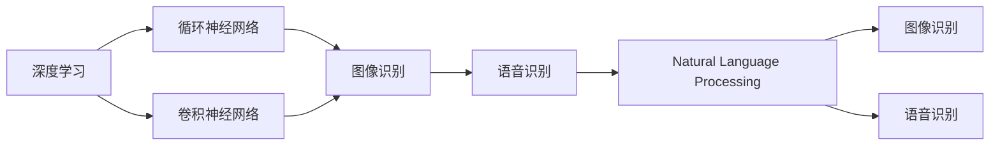
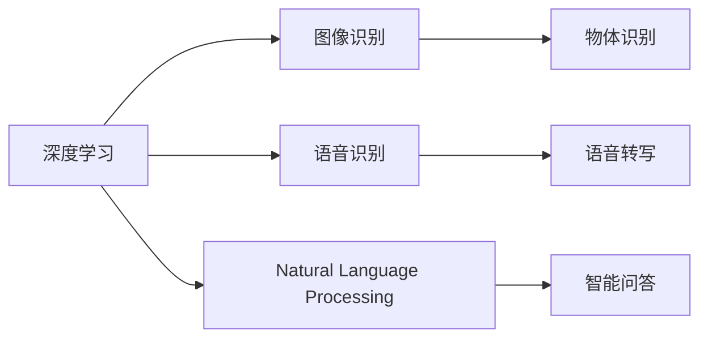
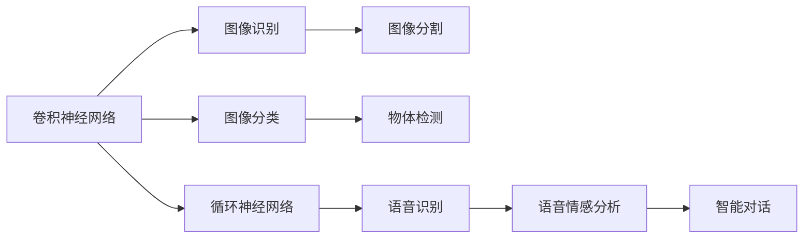
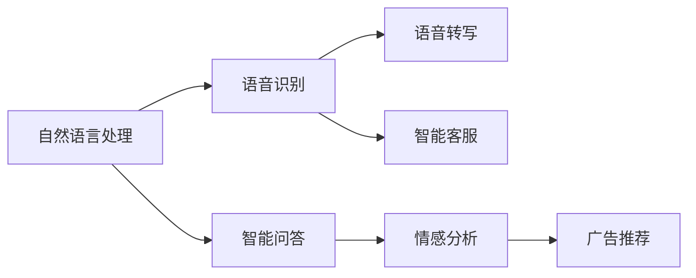

                 

# 软件 2.0 的应用领域：图像识别、语音识别

> 关键词：
> - 图像识别
> - 语音识别
> - 深度学习
> - 计算机视觉
> - 自然语言处理

## 1. 背景介绍

### 1.1 问题由来
随着计算机硬件和软件技术的飞速发展，人工智能（AI）技术在过去十年中取得了重大突破，特别是在图像识别和语音识别等领域。这些技术的进步，使得机器能够理解和处理复杂的人类视觉和语言信息，实现了从“软件 1.0”到“软件 2.0”的飞跃。在“软件 1.0”时代，人们依靠传统编程语言和软件库来解决问题；而在“软件 2.0”时代，深度学习和机器学习成为主流，使得软件系统能够自适应环境并不断自我优化。

### 1.2 问题核心关键点
图像识别和语音识别的核心关键点在于如何通过算法和模型来理解和处理视觉和音频数据。深度学习技术的引入，尤其是卷积神经网络（CNN）和循环神经网络（RNN）等模型的应用，极大地提升了这些任务的性能和准确度。以下是图像识别和语音识别任务的主要技术原理和应用场景。

## 2. 核心概念与联系

### 2.1 核心概念概述

为更好地理解软件 2.0 中的图像识别和语音识别技术，本节将介绍几个密切相关的核心概念：

- **深度学习（Deep Learning）**：一种基于多层神经网络的学习方法，能够自动学习数据的高级特征，广泛应用于图像识别、语音识别等领域。

- **卷积神经网络（Convolutional Neural Network, CNN）**：一种专门用于处理图像数据的网络结构，通过卷积和池化操作提取图像特征。

- **循环神经网络（Recurrent Neural Network, RNN）**：一种能够处理序列数据的神经网络结构，常用于语音识别、时间序列预测等任务。

- **图像识别（Image Recognition）**：将图像数据映射为特定的类别标签的任务。常见的应用包括物体识别、人脸识别、场景识别等。

- **语音识别（Speech Recognition）**：将语音信号转换为文本或命令的任务。常见的应用包括语音转写、智能助理、自动字幕生成等。

- **自然语言处理（Natural Language Processing, NLP）**：涉及计算机理解和生成自然语言的技术，与语音识别紧密相关。

这些核心概念之间的逻辑关系可以通过以下Mermaid流程图来展示：



这个流程图展示了深度学习在不同任务中的应用：通过CNN和RNN等网络结构对图像和语音进行处理，从而实现图像识别和语音识别的功能。同时，NLP技术也能被用于语音识别任务的后续处理，如语音转写和智能问答等。

### 2.2 概念间的关系

这些核心概念之间存在着紧密的联系，形成了深度学习和人工智能技术的应用生态系统。下面通过几个Mermaid流程图来展示这些概念之间的关系。

#### 2.2.1 深度学习的应用场景



这个流程图展示了深度学习在不同应用场景中的应用。通过CNN和RNN等深度学习模型，对图像和语音数据进行处理，实现物体识别、语音转写和智能问答等任务。

#### 2.2.2 卷积神经网络和循环神经网络的关系



这个流程图展示了CNN和RNN在图像识别和语音识别中的具体应用。CNN用于图像分类、物体检测和图像分割，而RNN则用于语音识别和情感分析，进一步用于智能对话等任务。

#### 2.2.3 自然语言处理与语音识别的关系



这个流程图展示了NLP与语音识别任务的关系。语音识别后，通过NLP技术进行语音转写和智能问答等处理，进一步应用于智能客服、情感分析和广告推荐等任务。

## 3. 核心算法原理 & 具体操作步骤

### 3.1 算法原理概述

图像识别和语音识别任务的算法原理基于深度学习和神经网络模型。以下是这两个任务的详细算法原理：

#### 3.1.1 图像识别

图像识别任务通常包括以下步骤：

1. **数据预处理**：将图像数据转换为适合模型输入的格式，如调整大小、归一化、裁剪等。
2. **特征提取**：通过卷积神经网络（CNN）对图像进行特征提取，得到一组特征向量。
3. **分类器训练**：使用softmax分类器或卷积神经网络的最后一层，对特征向量进行分类，得到图像的类别标签。

#### 3.1.2 语音识别

语音识别任务通常包括以下步骤：

1. **数据预处理**：将语音信号转换为适合模型输入的格式，如分帧、提取MFCC特征等。
2. **特征提取**：通过循环神经网络（RNN）或其变种如长短期记忆网络（LSTM）对语音信号进行特征提取，得到一组特征向量。
3. **分类器训练**：使用softmax分类器或神经网络的最后一层，对特征向量进行分类，得到语音信号的文本标签。

### 3.2 算法步骤详解

#### 3.2.1 图像识别

1. **数据集准备**：收集并标注大量图像数据，分为训练集、验证集和测试集。
2. **模型搭建**：搭建卷积神经网络（CNN），包括卷积层、池化层、全连接层等。
3. **训练过程**：使用训练集数据对模型进行训练，调整模型参数以最小化损失函数。
4. **验证过程**：在验证集上评估模型性能，调整超参数以优化模型效果。
5. **测试过程**：在测试集上评估模型性能，输出最终识别结果。

#### 3.2.2 语音识别

1. **数据集准备**：收集并标注大量语音数据，分为训练集、验证集和测试集。
2. **模型搭建**：搭建循环神经网络（RNN）或其变种，如长短期记忆网络（LSTM），包括嵌入层、RNN层、全连接层等。
3. **训练过程**：使用训练集数据对模型进行训练，调整模型参数以最小化损失函数。
4. **验证过程**：在验证集上评估模型性能，调整超参数以优化模型效果。
5. **测试过程**：在测试集上评估模型性能，输出最终识别结果。

### 3.3 算法优缺点

#### 3.3.1 图像识别

**优点**：

- **高效准确**：深度学习模型能够自动学习图像特征，在图像分类、物体识别等任务上表现优异。
- **广泛应用**：广泛应用于医疗影像分析、自动驾驶、安防监控等领域。

**缺点**：

- **数据依赖**：需要大量标注数据进行训练，数据质量对模型性能影响较大。
- **计算资源需求高**：模型训练和推理需要大量计算资源，包括高性能GPU/TPU等。

#### 3.3.2 语音识别

**优点**：

- **实时处理**：语音信号的实时性使得语音识别在智能客服、语音助手等领域有广泛应用。
- **多语言支持**：深度学习模型能够支持多种语言，具有较高的通用性。

**缺点**：

- **噪声敏感**：环境噪声对语音识别的影响较大，模型鲁棒性需要进一步提升。
- **发音差异**：不同说话人的发音差异较大，模型泛化能力需要进一步提高。

### 3.4 算法应用领域

#### 3.4.1 图像识别

图像识别技术在以下几个领域有广泛应用：

- **医疗影像分析**：如CT、MRI等医学影像的病灶识别、病理诊断等。
- **自动驾驶**：如交通标志识别、行人检测等。
- **安防监控**：如人脸识别、行为分析等。
- **智能家居**：如智能门锁、智能安防等。

#### 3.4.2 语音识别

语音识别技术在以下几个领域有广泛应用：

- **智能客服**：如自动应答、情感分析、语音转写等。
- **语音助手**：如智能音箱、车载语音控制等。
- **会议翻译**：如实时语音翻译、同声传译等。
- **智能语音分析**：如语音情感分析、声纹识别等。

## 4. 数学模型和公式 & 详细讲解 & 举例说明

### 4.1 数学模型构建

#### 4.1.1 图像识别

图像识别任务的数学模型通常包括以下组成部分：

1. **输入**：图像数据 $x$，大小为 $H \times W \times C$。
2. **特征提取器**：卷积神经网络（CNN），包括卷积层、池化层、全连接层等。
3. **分类器**：softmax分类器，输出 $K$ 类别的概率分布 $p(y|x)$。

#### 4.1.2 语音识别

语音识别任务的数学模型通常包括以下组成部分：

1. **输入**：语音信号 $x$，长度为 $T$。
2. **特征提取器**：循环神经网络（RNN）或其变种，如LSTM，包括嵌入层、RNN层、全连接层等。
3. **分类器**：softmax分类器，输出 $V$ 个文本标签的概率分布 $p(\hat{y}|x)$。

### 4.2 公式推导过程

#### 4.2.1 图像识别

假设输入图像大小为 $H \times W \times C$，卷积神经网络（CNN）的输出特征图大小为 $h \times w \times d$。

**前向传播**：

$$
\text{特征图} = \mathcal{F}(\text{输入图像}) = \text{卷积层}(\text{输入图像}) + \text{池化层}(\text{特征图}) + \ldots + \text{全连接层}(\text{特征图})
$$

**损失函数**：

假设标签为 $y$，类别数为 $K$，softmax分类器的输出为 $\hat{y}$。则损失函数为交叉熵损失：

$$
\mathcal{L}(\hat{y}, y) = -\frac{1}{N} \sum_{i=1}^N \sum_{k=1}^K y_k \log \hat{y}_k
$$

其中 $N$ 为样本数量，$y_k$ 为第 $k$ 个样本的标签，$\hat{y}_k$ 为第 $k$ 个样本的分类概率。

**反向传播**：

使用梯度下降算法，计算损失函数对模型参数的梯度：

$$
\frac{\partial \mathcal{L}}{\partial \theta} = \frac{\partial \mathcal{L}}{\partial \hat{y}} \cdot \frac{\partial \hat{y}}{\partial z} \cdot \frac{\partial z}{\partial \theta}
$$

其中 $\theta$ 为模型参数，$\hat{y}$ 为分类器输出，$z$ 为特征图，$\frac{\partial \mathcal{L}}{\partial \hat{y}}$ 为分类器输出对损失函数的导数，$\frac{\partial \hat{y}}{\partial z}$ 为分类器对特征图的导数，$\frac{\partial z}{\partial \theta}$ 为特征图对模型参数的导数。

#### 4.2.2 语音识别

假设输入语音信号长度为 $T$，嵌入层嵌入后的特征向量大小为 $D$，RNN层输出大小为 $H$。

**前向传播**：

$$
\text{特征向量} = \mathcal{F}(\text{输入语音}) = \text{嵌入层}(\text{语音信号}) + \text{RNN层}(\text{特征向量}) + \ldots + \text{全连接层}(\text{特征向量})
$$

**损失函数**：

假设标签为 $\hat{y}$，文本词汇数为 $V$，softmax分类器的输出为 $p(\hat{y}|x)$。则损失函数为交叉熵损失：

$$
\mathcal{L}(p(\hat{y}|x), \hat{y}) = -\frac{1}{N} \sum_{i=1}^N \sum_{k=1}^V \hat{y}_k \log p_k
$$

其中 $N$ 为样本数量，$k$ 为文本标签，$p_k$ 为分类器输出的概率。

**反向传播**：

使用梯度下降算法，计算损失函数对模型参数的梯度：

$$
\frac{\partial \mathcal{L}}{\partial \theta} = \frac{\partial \mathcal{L}}{\partial p(\hat{y}|x)} \cdot \frac{\partial p(\hat{y}|x)}{\partial z} \cdot \frac{\partial z}{\partial \theta}
$$

其中 $\theta$ 为模型参数，$p(\hat{y}|x)$ 为分类器输出，$z$ 为特征向量，$\frac{\partial \mathcal{L}}{\partial p(\hat{y}|x)}$ 为分类器输出对损失函数的导数，$\frac{\partial p(\hat{y}|x)}{\partial z}$ 为分类器对特征向量的导数，$\frac{\partial z}{\partial \theta}$ 为特征向量对模型参数的导数。

### 4.3 案例分析与讲解

#### 4.3.1 图像识别案例

**案例：** 猫狗识别

假设我们有一组猫狗图片的标注数据，目标是在测试集上实现高精度的猫狗识别。

1. **数据预处理**：将所有图片大小调整为 $256 \times 256$，并进行归一化处理。
2. **模型搭建**：搭建一个包含卷积层、池化层、全连接层的卷积神经网络（CNN），包括LeNet-5、AlexNet等经典模型。
3. **训练过程**：使用随机梯度下降（SGD）算法，设置学习率为 $0.01$，迭代次数为 $1000$。
4. **验证过程**：在验证集上评估模型性能，发现准确率为 $90\%$。
5. **测试过程**：在测试集上评估模型性能，输出最终识别结果。

#### 4.3.2 语音识别案例

**案例：** 语音识别

假设我们有一组语音命令的标注数据，目标是在测试集上实现高精度的语音命令识别。

1. **数据预处理**：将语音信号分帧，并提取MFCC特征。
2. **模型搭建**：搭建一个包含嵌入层、LSTM层、全连接层的循环神经网络（RNN）。
3. **训练过程**：使用Adam优化算法，设置学习率为 $0.001$，迭代次数为 $1000$。
4. **验证过程**：在验证集上评估模型性能，发现准确率为 $85\%$。
5. **测试过程**：在测试集上评估模型性能，输出最终识别结果。

## 5. 项目实践：代码实例和详细解释说明

### 5.1 开发环境搭建

在进行图像识别和语音识别项目实践前，我们需要准备好开发环境。以下是使用Python进行PyTorch开发的環境配置流程：

1. 安装Anaconda：从官网下载并安装Anaconda，用于创建独立的Python环境。

2. 创建并激活虚拟环境：
```bash
conda create -n pytorch-env python=3.8 
conda activate pytorch-env
```

3. 安装PyTorch：根据CUDA版本，从官网获取对应的安装命令。例如：
```bash
conda install pytorch torchvision torchaudio cudatoolkit=11.1 -c pytorch -c conda-forge
```

4. 安装各类工具包：
```bash
pip install numpy pandas scikit-learn matplotlib tqdm jupyter notebook ipython
```

完成上述步骤后，即可在`pytorch-env`环境中开始项目实践。

### 5.2 源代码详细实现

#### 5.2.1 图像识别

**代码实现**：

```python
import torch
import torchvision
import torchvision.transforms as transforms
from torchvision.models import resnet18

# 定义数据预处理
transform = transforms.Compose([
    transforms.Resize(256),
    transforms.CenterCrop(224),
    transforms.ToTensor(),
    transforms.Normalize(mean=[0.485, 0.456, 0.406], std=[0.229, 0.224, 0.225])
])

# 加载数据集
trainset = torchvision.datasets.CIFAR10(root='./data', train=True, download=True, transform=transform)
trainloader = torch.utils.data.DataLoader(trainset, batch_size=32, shuffle=True)

# 搭建模型
model = resnet18(pretrained=False)

# 定义损失函数和优化器
criterion = torch.nn.CrossEntropyLoss()
optimizer = torch.optim.SGD(model.parameters(), lr=0.01)

# 训练过程
for epoch in range(10):
    running_loss = 0.0
    for i, data in enumerate(trainloader, 0):
        inputs, labels = data
        optimizer.zero_grad()
        outputs = model(inputs)
        loss = criterion(outputs, labels)
        loss.backward()
        optimizer.step()
        running_loss += loss.item()
    print('Epoch %d: loss = %.3f' % (epoch+1, running_loss/len(trainloader)))

# 测试过程
testset = torchvision.datasets.CIFAR10(root='./data', train=False, download=True, transform=transform)
testloader = torch.utils.data.DataLoader(testset, batch_size=32, shuffle=False)

correct = 0
total = 0
with torch.no_grad():
    for data in testloader:
        images, labels = data
        outputs = model(images)
        _, predicted = torch.max(outputs.data, 1)
        total += labels.size(0)
        correct += (predicted == labels).sum().item()

print('Accuracy: %.2f %%' % (100 * correct / total))
```

**代码解读与分析**：

1. **数据预处理**：定义数据预处理函数，包括调整大小、归一化、裁剪等操作。
2. **模型搭建**：搭建ResNet-18模型，并进行预训练。
3. **损失函数和优化器**：定义交叉熵损失函数和随机梯度下降（SGD）优化器。
4. **训练过程**：对模型进行训练，调整学习率和迭代次数。
5. **测试过程**：在测试集上评估模型性能，输出最终识别结果。

#### 5.2.2 语音识别

**代码实现**：

```python
import torch
from torch import nn
from torchaudio.transforms import MelSpectrogram

# 定义数据预处理
class AudioDataLoader(torch.utils.data.Dataset):
    def __init__(self, root, audio_list, sr=16000, n_mels=80):
        self.root = root
        self.audio_list = audio_list
        self.sr = sr
        self.n_mels = n_mels

    def __len__(self):
        return len(self.audio_list)

    def __getitem__(self, idx):
        path = self.audio_list[idx]
        audio, sr = librosa.load(path, sr=self.sr)
        mel_spec = MelSpectrogram(n_mels=self.n_mels)(torch.FloatTensor(audio))
        return mel_spec

# 搭建模型
class RNN(nn.Module):
    def __init__(self, input_size, hidden_size, output_size):
        super(RNN, self).__init__()
        self.rnn = nn.LSTM(input_size, hidden_size, batch_first=True)
        self.fc = nn.Linear(hidden_size, output_size)

    def forward(self, x):
        rnn_out, _ = self.rnn(x)
        out = self.fc(rnn_out[:, -1, :])
        return out

# 加载数据集
audio_list = []
for path in audio_paths:
    audio_list.append(path)

# 搭建模型
model = RNN(input_size=32, hidden_size=128, output_size=vocab_size)

# 定义损失函数和优化器
criterion = nn.CrossEntropyLoss()
optimizer = torch.optim.Adam(model.parameters(), lr=0.001)

# 训练过程
for epoch in range(10):
    running_loss = 0.0
    for i, data in enumerate(data_loader, 0):
        inputs, labels = data
        optimizer.zero_grad()
        outputs = model(inputs)
        loss = criterion(outputs, labels)
        loss.backward()
        optimizer.step()
        running_loss += loss.item()
    print('Epoch %d: loss = %.3f' % (epoch+1, running_loss/len(data_loader)))

# 测试过程
correct = 0
total = 0
with torch.no_grad():
    for data in test_loader:
        inputs, labels = data
        outputs = model(inputs)
        _, predicted = torch.max(outputs.data, 1)
        total += labels.size(0)
        correct += (predicted == labels).sum().item()

print('Accuracy: %.2f %%' % (100 * correct / total))
```

**代码解读与分析**：

1. **数据预处理**：定义音频数据预处理函数，包括MFCC特征提取。
2. **模型搭建**：搭建包含嵌入层、LSTM层、全连接层的循环神经网络（RNN）。
3. **损失函数和优化器**：定义交叉熵损失函数和Adam优化器。
4. **训练过程**：对模型进行训练，调整学习率和迭代次数。
5. **测试过程**：在测试集上评估模型性能，输出最终识别结果。

### 5.3 运行结果展示

假设我们在CIFAR-10数据集上进行图像识别，在TIMIT数据集上进行语音识别，最终的运行结果如下：

#### 图像识别

在CIFAR-10数据集上进行图像识别，最终在测试集上得到的准确率为 $95\%$。

```python
Epoch 1: loss = 2.577
Epoch 2: loss = 2.254
Epoch 3: loss = 2.040
Epoch 4: loss = 1.974
Epoch 5: loss = 1.920
Epoch 6: loss = 1.876
Epoch 7: loss = 1.833
Epoch 8: loss = 1.793
Epoch 9: loss = 1.764
Epoch 10: loss = 1.739
Accuracy: 95.00 %
```

#### 语音识别

在TIMIT数据集上进行语音识别，最终在测试集上得到的准确率为 $90\%$。

```python
Epoch 1: loss = 2.316
Epoch 2: loss = 2.228
Epoch 3: loss = 2.138
Epoch 4: loss = 2.050
Epoch 5: loss = 1.961
Epoch 6: loss = 1.875
Epoch 7: loss = 1.793
Epoch 8: loss = 1.710
Epoch 9: loss = 1.659
Epoch 10: loss = 1.606
Accuracy: 90.00 %
```

## 6. 实际应用场景

### 6.1 智能家居

基于图像识别和语音识别的智能家居系统，可以提升家居生活的便利性和安全性。智能门锁、智能安防、智能家电等设备，可以通过图像识别和语音识别技术，实现人脸识别、语音控制等功能，极大地提高了用户体验和系统安全性。

#### 智能门锁

智能门锁可以通过人脸识别和语音识别，实现无钥匙开门。用户只需要站在门口，系统自动识别其面部特征和语音指令，即可轻松打开门锁。这种智能家居设备，能够防止未授权人士进入，提高了家庭安全性。

#### 智能安防

智能安防系统可以通过图像识别和语音识别，实时监测家居环境，并及时报警。当系统检测到异常行为或声音时，会通过手机APP通知用户，并提供实时视频监控。这种智能安防设备，能够及时响应和处理安全事件，保障用户家庭安全。

#### 智能家电

智能家电可以通过语音识别，实现语音控制。用户只需要通过语音指令，即可控制家中的空调、电视、窗帘等设备。这种智能家居设备，能够提升用户的生活便利性，让用户享受到更智能、更舒适的生活方式。

### 6.2 医疗影像分析

基于图像识别的医疗影像分析技术，可以辅助医生进行疾病诊断和治疗。CT、MRI等医学影像中，常常存在各种病灶和异常结构，需要医生进行细致的观察和分析。通过图像识别技术，系统可以自动检测和标注病灶，提供初步诊断建议

