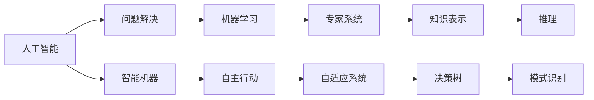

                 

# 达特茅斯会议的历史意义

> 关键词：人工智能,图灵奖,达特茅斯会议,会议背景,核心议题,会议成果,人工智能发展,历史意义

## 1. 背景介绍

### 1.1 会议背景
在20世纪50年代末到60年代初，计算机科学和人工智能的研究正处于初期阶段。科学家们正在探索如何让机器模拟人类的智能行为，从而在多个领域中实现自动化。然而，这一领域的研究进展缓慢，且方向不明确，亟需一个具有里程碑意义的会议来定义和指导研究方向。

1956年夏天，约翰·麦卡锡、克拉克·明斯基、马文·梅特卡夫、纳撒尼尔·罗切斯特、亨利·萨缪尔、约翰·肖尔以及年轻的研究生和研究助理共100多位科研人员齐聚达特茅斯学院，召开了有史以来第一次大规模的人工智能会议，这就是著名的达特茅斯会议。

### 1.2 会议的目的
达特茅斯会议的初衷是聚集一批顶尖科研人员，共同探讨人工智能的潜在发展方向和实现方法。会议组织者希望能够通过讨论和交流，为人工智能领域的发展制定一个明确的规划和研究方向。

## 2. 核心概念与联系

### 2.1 核心概念概述
在这次会议上，形成了两个关键的共识和概念：

- **人工智能**：定义了“人工智能”这一术语，指出其目标是制造“智能机器”，能够执行通常需要人类智能的任务。
- **问题解决**：认为人工智能的研究应该集中在问题解决的模型上，让机器能够解决特定领域的问题。

会议的成果可以总结为“达特茅斯宣言”，它为人工智能的发展设定了基本框架，奠定了后续研究的基础。

### 2.2 核心概念间的关系

通过一个简单的Mermaid流程图，我们可以清晰地展示这些核心概念之间的关系：



这个图展示了人工智能的多个子领域，以及它们之间的联系。例如，机器学习是问题解决的一种方法，而专家系统和决策树则利用知识表示和推理来进行问题解决。

## 3. 核心算法原理 & 具体操作步骤
### 3.1 算法原理概述
达特茅斯会议的核心算法原理是对问题解决能力的探索。会议中提到了多种问题解决模型，例如：

- **符号主义**：通过符号操作实现问题解决，如逻辑推理、规则推理。
- **连接主义**：利用人工神经网络模拟人脑的结构和功能，进行模式识别和学习。
- **行为主义**：通过观察和反馈，训练机器执行特定任务。

这些原理为后来的人工智能研究提供了重要的方向。

### 3.2 算法步骤详解
会议的讨论集中在以下几个步骤上：

1. **问题建模**：将现实世界的问题转化为机器可以理解和操作的形式。
2. **知识表示**：构建机器可操作的符号或数值表示，以便机器能够处理信息。
3. **推理机制**：开发规则或算法，让机器能够从已知信息中推导出新知识。
4. **学习算法**：训练机器能够从经验中学习，优化其问题解决能力。
5. **评价标准**：制定评价机器智能水平的标准，如执行任务的速度和准确性。

### 3.3 算法优缺点
达特茅斯会议提出的算法有其独特的优点和局限性：

**优点**：
- 提出明确的“人工智能”概念，为后续研究提供方向。
- 定义了问题解决模型，奠定了人工智能研究的理论基础。

**局限性**：
- 对问题解决的模型和算法相对单一，未能涵盖多种解决方案。
- 早期研究更多关注符号主义和逻辑推理，对机器学习的关注相对较少。

### 3.4 算法应用领域
达特茅斯会议的算法和原理被广泛应用于多个领域，例如：

- **专家系统**：用于医疗诊断、财务分析、工程技术等领域，能够基于规则和知识进行问题解决。
- **机器学习**：用于图像识别、自然语言处理、推荐系统等领域，通过数据和经验提升问题解决能力。
- **人工智能语言**：用于语言理解和生成，如自然语言处理、机器翻译等领域。

## 4. 数学模型和公式 & 详细讲解
### 4.1 数学模型构建
在达特茅斯会议中，提出的核心数学模型是符号主义问题解决模型。该模型主要基于逻辑推理，使用符号表示问题中的实体、属性和关系，并通过规则进行推理。

### 4.2 公式推导过程
以一个简单的逻辑推理问题为例，我们推导如何使用符号表示和逻辑推理解决它：

1. **问题描述**：
   - 设某地区有甲、乙两种水果，甲的价格为每公斤1元，乙的价格为每公斤2元。已知某次购买中，总共支付了10元，其中乙的数量是甲的两倍。问甲和乙各有多少公斤。

2. **符号表示**：
   - 设 $x$ 为甲的重量（公斤），$y$ 为乙的重量（公斤）。则问题可以表示为以下形式：
     - 甲的价格：$1x$
     - 乙的价格：$2y$
     - 总价：$10$
     - 乙是甲的两倍：$2x=y$

3. **逻辑推理**：
   - 将问题转化为符号表示，使用逻辑推理规则进行求解：
     - 总价等于甲的价格加乙的价格：$1x + 2y = 10$
     - 乙的数量是甲的两倍：$2x = y$
   - 联立方程组，求解得到：$x=4$, $y=8$。

### 4.3 案例分析与讲解
例如，在医学诊断中，专家系统利用知识表示和推理进行问题解决。一个典型的案例是“黄疸诊断系统”，该系统通过知识库存储医学症状、疾病、诊断标准等，使用规则推理引擎，根据患者提供的症状，推断可能患有的疾病并给出诊断建议。

## 5. 项目实践：代码实例和详细解释说明
### 5.1 开发环境搭建
为了演示达特茅斯会议的算法原理，我们使用Python语言和Sympy库构建了一个简单的逻辑推理程序。首先，安装Sympy库：

```bash
pip install sympy
```

### 5.2 源代码详细实现
以下是一个简单的Sympy程序，用于解决上面提到的逻辑推理问题：

```python
from sympy import symbols, Eq, solve

# 定义变量
x, y = symbols('x y')

# 定义方程
equation1 = Eq(1*x + 2*y, 10)
equation2 = Eq(2*x, y)

# 解方程
solution = solve((equation1, equation2), (x, y))
print(solution)
```

### 5.3 代码解读与分析
这段代码首先定义了两个符号变量 $x$ 和 $y$，然后使用Sympy的`Eq`函数创建了两个方程，分别表示甲和乙的价格总和为10元和乙是甲的两倍。最后，使用`solve`函数解这两个方程，得到甲和乙的重量。

### 5.4 运行结果展示
运行上述代码，输出结果为：

```bash
{x: 4, y: 8}
```

这表明甲有4公斤，乙有8公斤。

## 6. 实际应用场景
### 6.1 医疗诊断
在医疗领域，达特茅斯会议提出的专家系统已经得到广泛应用。例如，IBM的Watson系统通过分析患者的历史数据和最新症状，提供个性化的医疗建议和治疗方案。

### 6.2 金融分析
金融分析师利用达特茅斯会议提出的方法，构建基于规则的决策系统，用于风险评估、市场预测和投资决策。这些系统能够自动分析海量数据，提取关键信息，为金融决策提供支持。

### 6.3 工程设计
在工程设计领域，专家系统被用于复杂系统的分析和设计。例如，航空设计中的风洞测试、汽车制造中的零部件设计等，都可以通过专家系统进行优化和自动化设计。

### 6.4 未来应用展望
未来，达特茅斯会议的算法将继续影响人工智能的发展，特别是在以下几个方面：

1. **多模态融合**：将语音、图像、文本等多种数据源进行融合，构建更加全面的人工智能模型。
2. **深度学习**：结合神经网络和逻辑推理，构建更强大的问题解决能力。
3. **自适应系统**：开发能够自适应环境和任务的人工智能系统，提升系统的灵活性和泛化能力。
4. **机器学习**：利用数据和经验，不断优化问题解决模型的性能。

## 7. 工具和资源推荐
### 7.1 学习资源推荐
为了深入了解达特茅斯会议及其影响，以下是一些推荐的资源：

1. **《人工智能：一个现代的方法》**：这是Russell和Norvig所著的经典教材，详细介绍了人工智能的发展历程和核心算法。
2. **《人工智能简史》**：这本书由Hod Lipson撰写，回顾了人工智能的历史，包括达特茅斯会议的重大贡献。
3. **Coursera的“机器学习”课程**：由斯坦福大学的Andrew Ng教授授课，介绍了机器学习的基本概念和算法，是入门机器学习的绝佳资源。
4. **DeepMind的论文《Deep Architectures for Semi-Supervised Learning》**：介绍了深度学习在半监督学习中的应用，展示了其强大的问题解决能力。

### 7.2 开发工具推荐
为了构建和测试达特茅斯会议提出的算法，以下是一些推荐的开发工具：

1. **Python和Sympy**：Python是人工智能领域的主流编程语言，Sympy是一个强大的符号计算库，适合进行数学建模和逻辑推理。
2. **Jupyter Notebook**：这是一个交互式的编程环境，适合进行算法开发和调试。
3. **TensorFlow**：这是一个由Google开发的深度学习框架，适合构建和训练复杂的人工智能模型。

### 7.3 相关论文推荐
以下是一些经典论文，深入探讨了达特茅斯会议的影响和未来发展方向：

1. **《Artificial Intelligence: A Modern Approach》**：这是Russell和Norvig所著的经典教材，详细介绍了人工智能的发展历程和核心算法。
2. **《Expert Systems for Medicine: A Taxonomy》**：这篇论文介绍了专家系统在医疗诊断中的应用，是达特茅斯会议的重要后续研究。
3. **《Deep Architectures for Semi-Supervised Learning》**：这篇论文由DeepMind的研究团队撰写，介绍了深度学习在半监督学习中的应用，展示了其强大的问题解决能力。

## 8. 总结：未来发展趋势与挑战
### 8.1 研究成果总结
达特茅斯会议不仅定义了“人工智能”这一概念，还提出了问题解决模型，奠定了后续研究的基础。会议的成果影响深远，推动了人工智能的快速发展。

### 8.2 未来发展趋势
未来，人工智能将朝着更加智能化、通用化的方向发展，涵盖更多的应用场景。例如：

1. **多模态融合**：将语音、图像、文本等多种数据源进行融合，构建更加全面的人工智能模型。
2. **深度学习**：结合神经网络和逻辑推理，构建更强大的问题解决能力。
3. **自适应系统**：开发能够自适应环境和任务的人工智能系统，提升系统的灵活性和泛化能力。

### 8.3 面临的挑战
尽管人工智能取得了巨大进展，但在未来发展过程中仍面临一些挑战：

1. **伦理和法律问题**：人工智能的应用可能会带来隐私、安全等伦理和法律问题，需要建立相应的监管机制。
2. **算力限制**：大规模数据和高性能算力是人工智能发展的瓶颈，需要进一步提升计算能力和数据处理能力。
3. **可解释性**：许多人工智能模型缺乏可解释性，难以理解其内部工作机制和决策逻辑，这会影响其在关键领域的适用性。

### 8.4 研究展望
未来的人工智能研究需要在多个领域进行深入探索，例如：

1. **伦理和法律**：制定和完善人工智能应用的伦理和法律规范，确保其安全和公正性。
2. **算力提升**：发展高效的计算框架和硬件设备，提升数据处理和模型训练的速度和效率。
3. **可解释性**：研究如何让人工智能模型更易于理解和解释，增强其在关键领域的可信度和可用性。

总之，达特茅斯会议不仅奠定了人工智能研究的基础，也为未来发展指明了方向。通过不断突破技术瓶颈，解决伦理和法律问题，人工智能必将在更广阔的领域发挥其独特价值。

## 9. 附录：常见问题与解答
### 9.1 问题：达特茅斯会议对人工智能发展有哪些重要贡献？
答案：达特茅斯会议定义了“人工智能”这一概念，明确了问题解决模型的目标和研究方法，奠定了后续人工智能研究的基础。

### 9.2 问题：达特茅斯会议提出的问题解决模型有哪些？
答案：会议提出了符号主义、连接主义和行为主义三种问题解决模型，每种模型都有其独特的优势和适用场景。

### 9.3 问题：达特茅斯会议的成果对实际应用有哪些影响？
答案：会议的成果被广泛应用于医疗诊断、金融分析、工程设计等多个领域，推动了人工智能技术在实际应用中的落地和推广。

### 9.4 问题：达特茅斯会议提出的算法和原理有哪些局限性？
答案：会议提出的算法和原理对问题解决的模型和算法相对单一，未能涵盖多种解决方案。早期研究更多关注符号主义和逻辑推理，对机器学习的关注相对较少。

### 9.5 问题：未来人工智能将面临哪些挑战？
答案：未来人工智能将面临伦理和法律问题、算力限制、可解释性等挑战，需要在多个领域进行深入探索和突破。

---

作者：禅与计算机程序设计艺术 / Zen and the Art of Computer Programming

