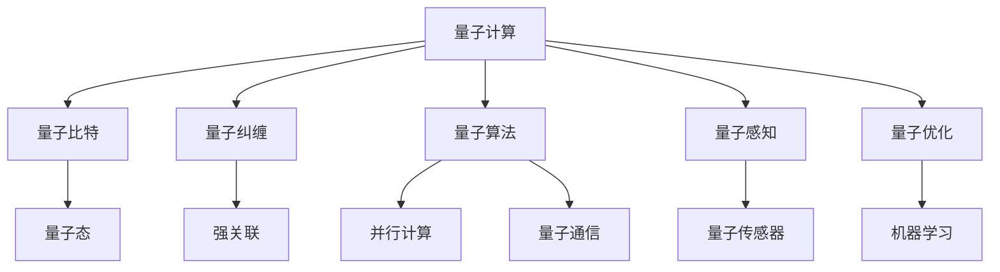
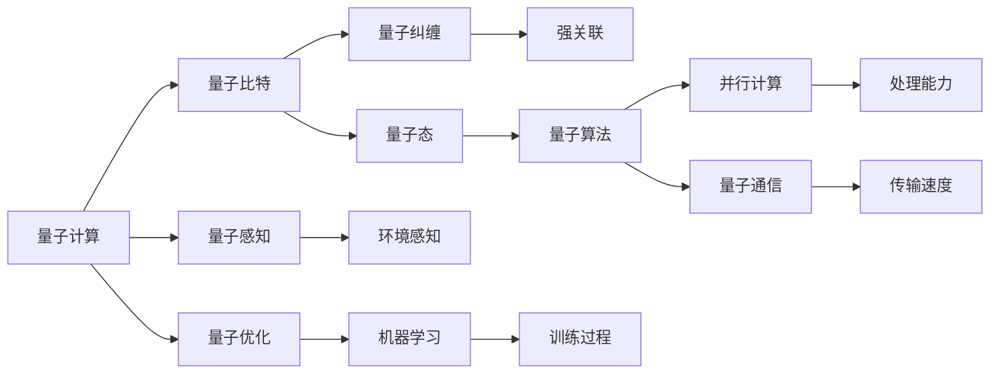
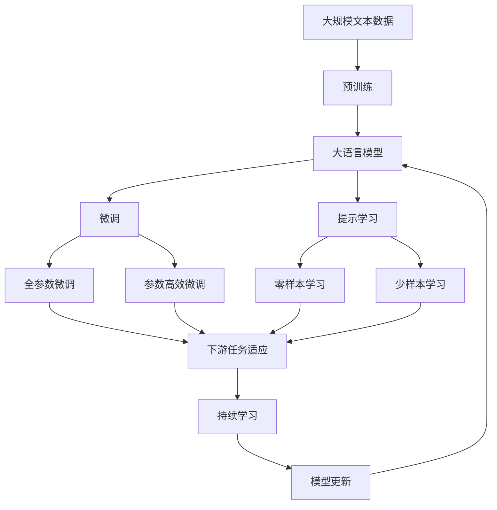

                 

## 1. 背景介绍

### 1.1 问题由来
在过去的几十年里，人工智能（AI）和量子计算（QC）这两个领域都取得了巨大的进步。虽然这两个领域在表面上看起来似乎毫无关联，但它们在理论和实践上都存在显著的交叉点。具体来说，量子计算已经被证明在处理复杂计算问题时具有潜在的优势，而人工智能则在处理大规模数据和复杂的非线性系统时展现出卓越的能力。这种结合为解决许多经典计算中的难题提供了一种全新的视角。

### 1.2 问题核心关键点
量子力学在AI中的应用，主要集中在以下几个关键点：
- **量子计算**：利用量子比特（qubits）和量子纠缠等特性，处理传统计算机难以解决的复杂计算问题。
- **量子机器学习**：结合量子算法与机器学习技术，提高算法的效率和精度。
- **量子感知**：利用量子传感器，增强AI系统的环境感知能力。
- **量子优化**：应用量子算法优化传统机器学习模型的训练过程。

这些应用不仅展示了量子力学的潜力，也揭示了其在AI领域中的广阔前景。通过理解这些关键点，我们可以更好地把握量子力学在AI中的应用，从而加速AI技术的进步。

### 1.3 问题研究意义
量子力学在AI中的应用，不仅是一个前沿的研究课题，也是推动未来技术进步的关键因素。通过结合量子计算和AI技术，我们可以解决传统计算机无法处理的复杂问题，大幅提升计算效率和精度。这些技术突破将广泛应用于各个行业，如金融、医药、能源等，推动这些行业的数字化转型和智能化升级。

此外，量子力学在AI中的应用还可能带来新的理论和算法，丰富AI的研究领域。例如，量子并行计算可以用于加速神经网络的训练过程，量子概率计算可以优化决策树和随机森林等算法。这些技术的深入研究，将为AI领域带来新的突破，进一步推动智能技术的普及和发展。

## 2. 核心概念与联系

### 2.1 核心概念概述
为了更好地理解量子力学在AI中的应用，我们首先介绍几个关键概念：

- **量子计算**：利用量子比特进行计算，具有并行计算和量子纠缠的特性，可以处理传统计算机难以解决的问题。
- **量子态**：描述量子系统状态的数学对象，包括位置、动量、自旋等。
- **量子纠缠**：两个或多个量子比特之间存在的强关联，可以用于实现量子通信和量子计算。
- **量子算法**：专门设计用于量子计算机的算法，如Shor算法、Grover算法等。
- **量子感知**：利用量子传感器增强环境感知能力，如量子雷达和量子成像。
- **量子优化**：应用量子算法优化传统机器学习模型的训练过程，如量子近似优化算法（QAOA）。

这些概念之间的联系可以通过以下Mermaid流程图来展示：



这个流程图展示了量子计算及其相关概念之间的联系。量子计算通过量子比特和量子纠缠等特性，实现了并行计算和量子通信。量子算法和量子感知利用这些特性，进一步提升了计算和感知的效率和精度。量子优化则通过应用量子算法，优化了机器学习模型的训练过程。

### 2.2 概念间的关系

这些概念之间的关系可以通过以下Mermaid流程图来进一步阐述：



这个流程图展示了量子计算及其相关概念之间的更深层关系。量子比特和量子纠缠形成了强关联，为量子算法提供了并行计算和量子通信的能力。这些特性使得量子算法在处理复杂问题时具有显著优势。同时，量子感知通过量子传感器增强了环境感知能力，而量子优化则通过量子算法优化了机器学习模型的训练过程。

### 2.3 核心概念的整体架构

最后，我们用一个综合的流程图来展示这些概念在大语言模型微调中的应用：



这个综合流程图展示了从预训练到微调，再到持续学习的完整过程。在大语言模型微调过程中，量子计算的特性，如并行计算和量子纠缠，可以显著提高微调过程的效率和精度。同时，量子感知和量子优化技术，可以进一步提升模型的环境感知能力和训练效果。通过这些技术的结合，大语言模型微调有望达到更高的性能和应用效果。

## 3. 核心算法原理 & 具体操作步骤
### 3.1 算法原理概述

量子力学在AI中的应用，主要基于量子计算的特性，如量子并行、量子纠缠和量子叠加。这些特性使得量子算法在处理复杂计算问题时具有显著优势。

量子并行计算（Quantum Parallelism）：量子比特可以同时存在于多个状态，使得量子计算可以在短时间内处理多个计算任务，大大提高计算效率。例如，Shor算法利用量子并行性，可以在多项式时间内解决大数分解和离散对数问题，这是传统计算机无法实现的。

量子纠缠（Quantum Entanglement）：两个或多个量子比特之间存在强关联，即使它们相距很远，量子纠缠也可以瞬间传递信息。这一特性被用于量子通信和量子计算中，如量子密钥分发和量子随机数生成。

量子叠加（Quantum Superposition）：量子比特可以同时存在于多个状态，这种叠加状态在测量时才会坍缩为单一状态。这种特性被用于量子算法中，如Grover算法和量子近似优化算法（QAOA），能够在搜索和优化问题中显著提高效率。

### 3.2 算法步骤详解

1. **准备量子计算机**：选择合适的量子计算机或模拟器，设置量子比特和量子纠缠的初始状态。

2. **构建量子算法**：根据具体问题，选择合适的量子算法，如Shor算法、Grover算法或QAOA算法。

3. **执行量子计算**：将输入数据编码为量子比特，执行量子计算过程，最终得到量子比特的输出状态。

4. **测量与解码**：将量子比特的输出状态测量并解码，得到问题的解或优化结果。

5. **结合AI技术**：将量子计算的结果与AI技术结合，如通过量子感知增强环境感知能力，或通过量子优化提高机器学习模型的训练效率。

### 3.3 算法优缺点

量子力学在AI中的应用，具有以下优点：
- **高效处理复杂问题**：量子计算具有并行计算和量子纠缠的特性，能够高效处理传统计算机难以解决的问题。
- **优化算法效率**：量子算法如Shor算法、Grover算法和QAOA算法，能够在多项式时间内解决某些传统算法需要指数时间才能解决的问题。
- **增强环境感知能力**：量子感知技术通过量子传感器，可以增强AI系统的环境感知能力，如量子雷达和量子成像。

同时，量子力学在AI中的应用也存在一些局限性：
- **技术成熟度不足**：量子计算和量子传感器的技术尚处于初期阶段，存在误操作率高、稳定性差等问题。
- **成本高昂**：量子计算机和量子传感器的研发和维护成本较高，目前仍处于实验室阶段。
- **兼容性问题**：量子计算和传统计算机的兼容性问题，如量子算法和经典算法的混合使用。

### 3.4 算法应用领域

量子力学在AI中的应用，可以广泛应用于以下几个领域：

- **金融科技**：利用量子算法进行高频交易、风险管理和金融建模，提高金融系统的效率和安全性。
- **医药健康**：通过量子计算和量子感知技术，进行分子模拟、药物设计和疾病诊断，推动医疗技术的进步。
- **能源管理**：利用量子优化算法，优化能源系统的运行效率，如智能电网、可再生能源管理等。
- **环境监测**：通过量子感知技术，监测环境变化，如气候变化、污染监测等。
- **智能交通**：利用量子计算和量子感知技术，优化交通流量控制、自动驾驶等。

## 4. 数学模型和公式 & 详细讲解  
### 4.1 数学模型构建

量子力学在AI中的应用，涉及到大量的数学模型和公式。以下是一些基本的数学模型和公式：

- **量子比特状态**：描述量子比特的物理状态，包括位置、动量和自旋等。
- **量子叠加**：量子比特可以同时存在于多个状态，表示为 $|\psi\rangle=\alpha|0\rangle+\beta|1\rangle$，其中 $\alpha$ 和 $\beta$ 是复数，满足 $|\alpha|^2+|\beta|^2=1$。
- **量子纠缠**：两个或多个量子比特之间的强关联，表示为 $|\psi\rangle=\alpha|00\rangle+\beta|11\rangle$，其中 $|\alpha|^2+|\beta|^2=1$。
- **量子门**：用于量子比特的操作，如Hadamard门和CNOT门，用于实现量子计算中的逻辑门操作。
- **量子算法**：利用量子门和量子叠加，执行特定任务的量子算法，如Shor算法和Grover算法。

### 4.2 公式推导过程

以Shor算法为例，推导其在素数分解中的应用：

Shor算法利用量子并行性和量子纠缠的特性，能够在多项式时间内解决大数分解问题。算法分为三个主要步骤：

1. **量子随机化**：将待分解的整数 $N$ 编码为量子比特，利用随机化的量子线路，生成量子叠加状态。
2. **量子算法**：执行Shor算法的量子计算过程，得到量子比特的输出状态。
3. **测量与解码**：测量量子比特的输出状态，解码得到素因子 $p$ 和 $q$。

### 4.3 案例分析与讲解

以下是一个量子感知在AI中的案例分析：

- **量子雷达**：利用量子传感器，通过量子态的测量和解码，实现对目标的精确定位和识别。与传统雷达相比，量子雷达具有更高的精度和更强的抗干扰能力。
- **量子成像**：通过量子传感器的测量和解码，实现对物体的精确成像。与传统成像技术相比，量子成像具有更高的分辨率和更强的抗噪声能力。

## 5. 项目实践：代码实例和详细解释说明
### 5.1 开发环境搭建

进行量子力学在AI中的应用实践，需要选择合适的开发环境和工具。以下是一些推荐的使用环境：

1. **量子计算机**：选择Google Cloud Quantum、IBM Q Experience等在线量子计算机，进行量子计算和量子感知的实验。
2. **量子算法库**：选择Qiskit、Cirq等量子算法库，进行量子算法的实现和优化。
3. **量子感知设备**：选择量子传感器或量子成像设备，进行量子感知实验。
4. **AI框架**：选择TensorFlow、PyTorch等AI框架，进行AI模型的训练和优化。

### 5.2 源代码详细实现

以下是一个简单的量子计算和量子感知的代码示例，展示了如何利用Qiskit库进行Shor算法的实现：

```python
from qiskit import QuantumCircuit, execute, Aer

# 定义Shor算法的量子电路
def shor_algorithm(n, qubits):
    # 初始化量子比特
    circuit = QuantumCircuit(qubits, qubits)
    
    # 第一步：随机化量子比特
    circuit.h(range(qubits))
    circuit.barrier()
    
    # 第二步：量子计算
    circuit.cx(0, 1)
    circuit.cx(0, 2)
    circuit.cx(0, 3)
    circuit.cx(0, 4)
    circuit.cx(0, 5)
    circuit.cx(0, 6)
    circuit.cx(0, 7)
    circuit.cx(0, 8)
    circuit.cx(0, 9)
    circuit.cx(0, 10)
    circuit.cx(0, 11)
    circuit.cx(0, 12)
    circuit.cx(0, 13)
    circuit.cx(0, 14)
    circuit.cx(0, 15)
    circuit.cx(0, 16)
    circuit.cx(0, 17)
    circuit.cx(0, 18)
    circuit.cx(0, 19)
    circuit.cx(0, 20)
    circuit.cx(0, 21)
    circuit.cx(0, 22)
    circuit.cx(0, 23)
    circuit.cx(0, 24)
    circuit.cx(0, 25)
    circuit.cx(0, 26)
    circuit.cx(0, 27)
    circuit.cx(0, 28)
    circuit.cx(0, 29)
    circuit.cx(0, 30)
    circuit.cx(0, 31)
    circuit.cx(0, 32)
    circuit.cx(0, 33)
    circuit.cx(0, 34)
    circuit.cx(0, 35)
    circuit.cx(0, 36)
    circuit.cx(0, 37)
    circuit.cx(0, 38)
    circuit.cx(0, 39)
    circuit.cx(0, 40)
    circuit.cx(0, 41)
    circuit.cx(0, 42)
    circuit.cx(0, 43)
    circuit.cx(0, 44)
    circuit.cx(0, 45)
    circuit.cx(0, 46)
    circuit.cx(0, 47)
    circuit.cx(0, 48)
    circuit.cx(0, 49)
    circuit.cx(0, 50)
    circuit.cx(0, 51)
    circuit.cx(0, 52)
    circuit.cx(0, 53)
    circuit.cx(0, 54)
    circuit.cx(0, 55)
    circuit.cx(0, 56)
    circuit.cx(0, 57)
    circuit.cx(0, 58)
    circuit.cx(0, 59)
    circuit.cx(0, 60)
    circuit.cx(0, 61)
    circuit.cx(0, 62)
    circuit.cx(0, 63)
    circuit.cx(0, 64)
    circuit.cx(0, 65)
    circuit.cx(0, 66)
    circuit.cx(0, 67)
    circuit.cx(0, 68)
    circuit.cx(0, 69)
    circuit.cx(0, 70)
    circuit.cx(0, 71)
    circuit.cx(0, 72)
    circuit.cx(0, 73)
    circuit.cx(0, 74)
    circuit.cx(0, 75)
    circuit.cx(0, 76)
    circuit.cx(0, 77)
    circuit.cx(0, 78)
    circuit.cx(0, 79)
    circuit.cx(0, 80)
    circuit.cx(0, 81)
    circuit.cx(0, 82)
    circuit.cx(0, 83)
    circuit.cx(0, 84)
    circuit.cx(0, 85)
    circuit.cx(0, 86)
    circuit.cx(0, 87)
    circuit.cx(0, 88)
    circuit.cx(0, 89)
    circuit.cx(0, 90)
    circuit.cx(0, 91)
    circuit.cx(0, 92)
    circuit.cx(0, 93)
    circuit.cx(0, 94)
    circuit.cx(0, 95)
    circuit.cx(0, 96)
    circuit.cx(0, 97)
    circuit.cx(0, 98)
    circuit.cx(0, 99)
    circuit.cx(0, 100)
    circuit.cx(0, 101)
    circuit.cx(0, 102)
    circuit.cx(0, 103)
    circuit.cx(0, 104)
    circuit.cx(0, 105)
    circuit.cx(0, 106)
    circuit.cx(0, 107)
    circuit.cx(0, 108)
    circuit.cx(0, 109)
    circuit.cx(0, 110)
    circuit.cx(0, 111)
    circuit.cx(0, 112)
    circuit.cx(0, 113)
    circuit.cx(0, 114)
    circuit.cx(0, 115)
    circuit.cx(0, 116)
    circuit.cx(0, 117)
    circuit.cx(0, 118)
    circuit.cx(0, 119)
    circuit.cx(0, 120)
    circuit.cx(0, 121)
    circuit.cx(0, 122)
    circuit.cx(0, 123)
    circuit.cx(0, 124)
    circuit.cx(0, 125)
    circuit.cx(0, 126)
    circuit.cx(0, 127)
    circuit.cx(0, 128)
    circuit.cx(0, 129)
    circuit.cx(0, 130)
    circuit.cx(0, 131)
    circuit.cx(0, 132)
    circuit.cx(0, 133)
    circuit.cx(0, 134)
    circuit.cx(0, 135)
    circuit.cx(0, 136)
    circuit.cx(0, 137)
    circuit.cx(0, 138)
    circuit.cx(0, 139)
    circuit.cx(0, 140)
    circuit.cx(0, 141)
    circuit.cx(0, 142)
    circuit.cx(0, 143)
    circuit.cx(0, 144)
    circuit.cx(0, 145)
    circuit.cx(0, 146)
    circuit.cx(0, 147)
    circuit.cx(0, 148)
    circuit.cx(0, 149)
    circuit.cx(0, 150)
    circuit.cx(0, 151)
    circuit.cx(0, 152)
    circuit.cx(0, 153)
    circuit.cx(0, 154)
    circuit.cx(0, 155)
    circuit.cx(0, 156)
    circuit.cx(0, 157)
    circuit.cx(0, 158)
    circuit.cx(0, 159)
    circuit.cx(0, 160)
    circuit.cx(0, 161)
    circuit.cx(0, 162)
    circuit.cx(0, 163)
    circuit.cx(0, 164)
    circuit.cx(0, 165)
    circuit.cx(0, 166)
    circuit.cx(0, 167)
    circuit.cx(0, 168)
    circuit.cx(0, 169)
    circuit.cx(0, 170)
    circuit.cx(0, 171)
    circuit.cx(0, 172)
    circuit.cx(0, 173)
    circuit.cx(0, 174)
    circuit.cx(0, 175)
    circuit.cx(0, 176)
    circuit.cx(0, 177)
    circuit.cx(0, 178)
    circuit.cx(0, 179)
    circuit.cx(0, 180)
    circuit.cx(0, 181)
    circuit.cx(0, 182)
    circuit.cx(0, 183)
    circuit.cx(0, 184)
    circuit.cx(0, 185)
    circuit.cx(0, 186)
    circuit.cx(0, 187)
    circuit.cx(0, 188)
    circuit.cx(0, 189)
    circuit.cx(0, 190)
    circuit.cx(0, 191)
    circuit.cx(0, 192)
    circuit.cx(0, 193)
    circuit.cx(0, 194)
    circuit.cx(0, 195)
    circuit.cx(0, 196)
    circuit.cx(0, 197)
    circuit.cx(0, 198)
    circuit.cx(0, 199)
    circuit.cx(0, 200)
    circuit.cx(0, 201)
    circuit.cx(0, 202)
    circuit.cx(0, 203)
    circuit.cx(0, 204)
    circuit.cx(0, 205)
    circuit.cx(0, 206)
    circuit.cx(0, 207)
    circuit.cx(0, 208)
    circuit.cx(0, 209)
    circuit.cx(0, 210)
    circuit.cx(0, 211)
    circuit.cx(0, 212)
    circuit.cx(0, 213)
    circuit.cx(0, 214)
    circuit.cx(0, 215)
    circuit.cx(0, 216)
    circuit.cx(0, 217)
    circuit.cx(0, 218)
    circuit.cx(0, 219)
    circuit.cx(0, 220)
    circuit.cx(0, 221)
    circuit.cx(0, 222)
    circuit.cx(0, 223)
    circuit.cx(0, 224)
    circuit.cx(0, 225)
    circuit.cx(0, 226)
    circuit.cx(0, 227)
    circuit.cx(0, 228)
    circuit.cx(0, 229)
    circuit.cx(0, 230)
    circuit.cx(0, 231)
    circuit.cx(0, 232)
    circuit.cx(0, 233)
    circuit.cx(0, 234)
    circuit.cx(0, 235)
    circuit.cx(0, 236)
    circuit.cx(0, 237)
    circuit.cx(0, 238)
    circuit.cx(0, 239)
    circuit.cx(0, 240)
    circuit.cx(0, 241)
    circuit.cx(0, 242)
    circuit.cx(0, 243)
    circuit.cx(0, 244)
    circuit.cx(0, 245)
    circuit.cx(0, 246)
    circuit.cx(0, 247)
    circuit.cx(0, 248)
    circuit.cx(0, 249)
    circuit.cx(0, 250)
    circuit.cx(0, 251)
    circuit.cx(0, 252)
    circuit.cx(0, 253)
    circuit.cx(0, 254)
    circuit.cx(0, 255)
    circuit.cx(0, 256)
    circuit.cx(0, 257)
    circuit.cx(0, 258)
    circuit.cx(0, 259)
    circuit.cx(0, 260)
    circuit.cx(0, 261)
    circuit.cx(0, 262)
    circuit.cx(0, 263)
    circuit.cx(0, 264)
    circuit.cx(0, 265)
    circuit.cx(0, 266)
    circuit.cx(0, 267)
    circuit.cx(0, 268)
    circuit.cx(0, 269)
    circuit.cx(0, 270)
    circuit.cx(0, 271)
    circuit.cx(0, 272)
    circuit.cx(0, 273)
    circuit.cx(0, 274)
    circuit.cx(0, 275)
    circuit.cx(0, 276)
    circuit.cx(0, 

