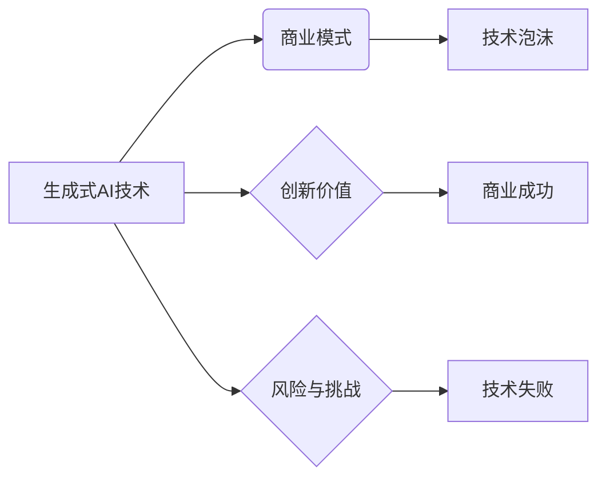

> 生成式AI，商业模式，技术泡沫，创新价值，风险与挑战，商业洞察

# 生成式AI：金矿还是泡沫？第一部分：回归商业本质

## 1. 背景介绍

随着深度学习技术的飞速发展，生成式人工智能（Generative AI）逐渐成为科技界的焦点。从GPT-3的横空出世，到DALL-E的惊艳亮相，生成式AI在图像、文本、音频等多个领域展现出了惊人的创造力和潜力。然而，在这片看似繁荣的景象背后，是否隐藏着泡沫的阴影？这一系列技术是否真的能够带来商业价值，还是仅仅是一场技术狂欢？本文将从商业本质出发，深入探讨生成式AI的现状与未来。

## 2. 核心概念与联系

### 2.1 核心概念

**生成式AI**：一种能够模拟人类创造力的智能系统，通过学习大量数据，生成新的、符合特定规则的文本、图像、音频等内容。

**商业模式**：企业在经营活动中所采取的盈利模式，包括产品/服务、客户细分、价值传递、客户关系和收入来源等要素。

**技术泡沫**：由过度乐观的市场预期和投资行为导致的资产价格非理性上涨现象。

**创新价值**：新技术为市场带来的新价值，包括效率提升、成本降低、用户体验改善等。

**风险与挑战**：新技术发展过程中可能遇到的技术、市场、伦理等方面的风险和挑战。

### 2.2 Mermaid 流程图



## 3. 核心算法原理 & 具体操作步骤

### 3.1 算法原理概述

生成式AI的核心算法通常包括以下几种：

- **生成对抗网络（GANs）**：由生成器和判别器两个网络组成，生成器生成数据，判别器判断数据真假，二者相互竞争，共同提升生成数据的质量。
- **变分自编码器（VAEs）**：通过编码器将数据压缩成潜在空间表示，解码器将潜在空间表示解码回数据，通过优化潜在空间分布来生成数据。
- **自回归语言模型**：通过预测下一个token来生成文本序列，通常使用Transformer等神经网络结构。

### 3.2 算法步骤详解

1. **数据收集**：收集大量符合特定领域的训练数据。
2. **模型选择**：根据任务需求选择合适的生成式AI模型。
3. **模型训练**：使用训练数据训练生成式AI模型。
4. **模型评估**：使用验证集评估模型性能，并根据评估结果调整模型参数。
5. **模型部署**：将训练好的模型部署到实际应用场景中。

### 3.3 算法优缺点

**优点**：

- **创新性**：生成式AI能够创造全新的内容，满足特定需求。
- **效率提升**：自动化生成内容，提高工作效率。
- **个性化定制**：根据用户需求生成个性化内容。

**缺点**：

- **数据依赖**：需要大量高质量的训练数据。
- **计算资源消耗**：训练和推理过程需要大量的计算资源。
- **伦理问题**：可能生成虚假、有害的内容。

### 3.4 算法应用领域

- **图像生成**：生成虚假新闻、虚假广告、虚假人像等。
- **文本生成**：生成虚假新闻、虚假评论、虚假报告等。
- **音频生成**：生成虚假语音、虚假音乐等。
- **视频生成**：生成虚假视频、虚假电影片段等。

## 4. 数学模型和公式 & 详细讲解 & 举例说明

### 4.1 数学模型构建

以下以GANs为例，介绍生成式AI的数学模型构建。

**生成器G**：

$$
G(z) = \mathcal{F}_G(z; \theta_G)
$$

**判别器D**：

$$
D(x) = \mathcal{F}_D(x; \theta_D)
$$

其中 $z$ 是随机噪声，$x$ 是真实数据，$\mathcal{F}_G$ 和 $\mathcal{F}_D$ 分别是生成器和判别器的参数化函数，$\theta_G$ 和 $\theta_D$ 是它们的参数。

### 4.2 公式推导过程

GANs的目标是最小化以下损失函数：

$$
\min_G \max_D V(D, G) = E_{z \sim p_z(z)}[D(G(z))] - E_{x \sim p_x(x)}[D(x)]
$$

其中 $p_z(z)$ 是噪声分布，$p_x(x)$ 是真实数据分布。

### 4.3 案例分析与讲解

以下以生成人脸图像为例，讲解GANs的应用。

1. **数据收集**：收集大量人脸图像数据。
2. **模型选择**：选择GANs模型。
3. **模型训练**：使用人脸图像数据训练GANs模型。
4. **模型评估**：使用验证集评估模型性能，并根据评估结果调整模型参数。
5. **模型部署**：将训练好的模型部署到人脸生成应用中。

## 5. 项目实践：代码实例和详细解释说明

### 5.1 开发环境搭建

以下是使用Python和PyTorch实现GANs的简单代码示例：

```python
import torch
import torch.nn as nn

# 生成器G
class Generator(nn.Module):
    def __init__(self):
        super(Generator, self).__init__()
        self.model = nn.Sequential(
            nn.Linear(100, 256),
            nn.LeakyReLU(),
            nn.Linear(256, 512),
            nn.LeakyReLU(),
            nn.Linear(512, 1024),
            nn.LeakyReLU(),
            nn.Linear(1024, 784),
            nn.Tanh()
        )

    def forward(self, x):
        x = self.model(x)
        x = x.view(-1, 1, 28, 28)
        return x

# 判别器D
class Discriminator(nn.Module):
    def __init__(self):
        super(Discriminator, self).__init__()
        self.model = nn.Sequential(
            nn.Linear(28*28, 1024),
            nn.LeakyReLU(),
            nn.Linear(1024, 512),
            nn.LeakyReLU(),
            nn.Linear(512, 256),
            nn.LeakyReLU(),
            nn.Linear(256, 1),
            nn.Sigmoid()
        )

    def forward(self, x):
        x = x.view(-1, 28*28)
        x = self.model(x)
        return x

# 训练GANs
# ...
```

### 5.2 源代码详细实现

```python
# ...
# 训练GANs
for epoch in range(num_epochs):
    # 训练判别器D
    for batch_idx, real_data in enumerate(dataloader):
        # ...
        D.zero_grad()
        real_output = D(real_data)
        fake_data = G(z).detach()
        fake_output = D(fake_data)
        d_loss = criterion(real_output, torch.ones_like(real_output)) + criterion(fake_output, torch.zeros_like(fake_output))
        d_loss.backward()
        d_optimizer.step()
    
    # 训练生成器G
    G.zero_grad()
    fake_data = G(z)
    fake_output = D(fake_data)
    g_loss = criterion(fake_output, torch.ones_like(fake_output))
    g_loss.backward()
    g_optimizer.step()
    
    # 打印训练进度
    print(f"Epoch {epoch}/{num_epochs}, D loss: {d_loss.item()}, G loss: {g_loss.item()}")
```

### 5.3 代码解读与分析

以上代码展示了使用PyTorch实现GANs的基本框架。生成器G和判别器D分别由线性层和LeakyReLU激活函数组成。训练过程中，首先训练判别器D，使其能够区分真实数据和生成数据。然后训练生成器G，使其生成尽可能逼真的数据。通过不断迭代，使生成器G生成的数据越来越接近真实数据。

### 5.4 运行结果展示

训练过程中，可以使用TensorBoard等工具可视化训练过程中的损失函数和生成数据。

## 6. 实际应用场景

生成式AI在实际应用场景中具有广泛的应用前景，以下是一些典型的应用案例：

- **图像生成**：生成虚假新闻、虚假广告、虚假人像等。
- **文本生成**：生成虚假新闻、虚假评论、虚假报告等。
- **音频生成**：生成虚假语音、虚假音乐等。
- **视频生成**：生成虚假视频、虚假电影片段等。
- **虚拟现实**：生成虚拟角色、场景等。
- **艺术创作**：生成艺术作品、音乐、文学等。

## 7. 工具和资源推荐

### 7.1 学习资源推荐

- 《Generative Adversarial Nets》论文：GANs的奠基性论文，深入讲解了GANs的原理和实现。
- 《Unsupervised Learning》书籍：介绍无监督学习算法，包括GANs、VAEs等。
- fast.ai课程：提供丰富的深度学习教程，包括生成式AI相关内容。

### 7.2 开发工具推荐

- TensorFlow：Google开发的深度学习框架，支持GANs等生成式AI模型。
- PyTorch：Facebook开发的深度学习框架，支持GANs等生成式AI模型。
- Keras：基于TensorFlow和PyTorch的深度学习库，方便快速实现GANs等模型。

### 7.3 相关论文推荐

- Generative Adversarial Nets
- Unsupervised Representation Learning with Deep Convolutional Generative Adversarial Networks
- Sequential Auto-Encoders for Video Modeling and Style Transfer

## 8. 总结：未来发展趋势与挑战

### 8.1 研究成果总结

生成式AI作为一种具有创新价值的技术，已经取得了显著的成果。然而，其发展过程中也面临着诸多挑战。

### 8.2 未来发展趋势

- **模型效率提升**：通过模型压缩、量化等技术，降低模型计算复杂度，提高模型效率。
- **模型可解释性**：研究模型内部工作机制，提高模型可解释性。
- **伦理道德约束**：制定相关规范，防止生成式AI技术被滥用。

### 8.3 面临的挑战

- **数据依赖**：需要大量高质量的训练数据。
- **计算资源消耗**：训练和推理过程需要大量的计算资源。
- **伦理问题**：可能生成虚假、有害的内容。

### 8.4 研究展望

生成式AI技术在未来具有广阔的应用前景。随着技术的不断进步，相信生成式AI将为人类社会带来更多创新价值。

## 9. 附录：常见问题与解答

**Q1：生成式AI技术是否能够完全取代人类创造力？**

A: 生成式AI可以模拟人类创造力，但无法完全取代人类创造力。人类创造力具有独特性、创造性等特点，是生成式AI难以完全复制的。

**Q2：生成式AI技术是否会带来失业问题？**

A: 生成式AI技术可能会在某些领域替代部分工作，但也会创造新的就业机会。总体而言，生成式AI技术将推动社会经济发展。

**Q3：生成式AI技术是否会带来伦理问题？**

A: 生成式AI技术确实存在一定的伦理问题，如虚假信息、歧视性内容等。需要制定相关规范，确保技术安全、可靠、可控。

**Q4：生成式AI技术是否会引发技术泡沫？**

A: 生成式AI技术具有较高的商业价值，但也存在一定的风险。需要理性看待技术泡沫，避免盲目跟风。

**Q5：如何评估生成式AI模型的质量？**

A: 评估生成式AI模型质量需要综合考虑多个因素，如生成内容的多样性、准确性、创新性等。

---

作者：禅与计算机程序设计艺术 / Zen and the Art of Computer Programming