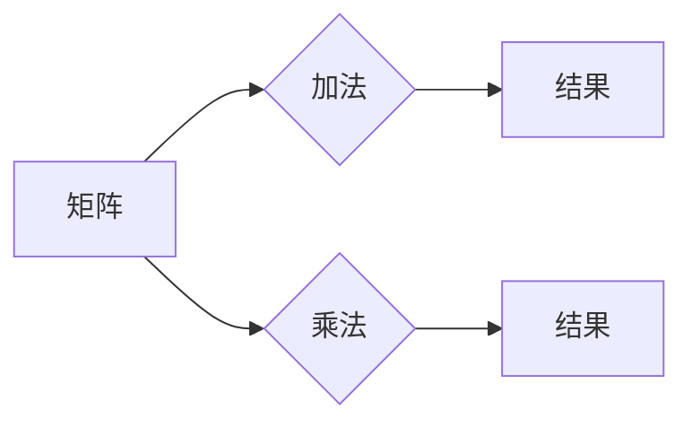

> 矩阵运算，线性代数，特征值与特征向量，矩阵分解，矩阵应用，机器学习，深度学习

# 矩阵理论与应用：简单矩阵的函数

矩阵理论是线性代数的重要组成部分，它在自然科学、工程学、经济学以及计算机科学等多个领域中都有广泛的应用。本文将深入探讨简单矩阵的函数，从理论基础到实际应用，旨在帮助读者全面理解矩阵函数的原理及其重要性。

## 1. 背景介绍

### 1.1 问题的由来

矩阵作为一种数学工具，能够有效地描述和解决线性系统问题。在计算机科学中，矩阵的应用尤为广泛，尤其是在图形学、机器学习和深度学习等领域。矩阵函数是矩阵理论中的一个重要分支，它涉及对矩阵进行运算，如求导、积分、求逆等。

### 1.2 研究现状

矩阵函数的研究已经相当成熟，但仍然存在许多未解之谜和新的研究方向。近年来，随着计算能力的提升和算法的优化，矩阵函数的应用领域不断扩展，尤其在机器学习和深度学习领域，矩阵函数成为了解决复杂问题的关键。

### 1.3 研究意义

研究矩阵函数不仅有助于加深对线性代数的理解，还能够推动计算机科学和相关领域的发展。通过矩阵函数，我们可以更有效地处理数据、优化算法、提高计算效率。

### 1.4 本文结构

本文将按照以下结构进行组织：
- 第2章介绍矩阵理论的核心概念与联系。
- 第3章阐述矩阵函数的基本原理和具体操作步骤。
- 第4章讲解数学模型和公式，并通过实例说明。
- 第5章提供代码实例和详细解释。
- 第6章探讨实际应用场景。
- 第7章推荐相关工具和资源。
- 第8章总结研究成果，展望未来发展趋势与挑战。
- 第9章提供常见问题与解答。

## 2. 核心概念与联系

### 2.1 核心概念原理

矩阵是数学中的一种基本结构，它由一系列数按照一定的规则排列而成。矩阵可以进行加法、乘法等运算，这些运算构成了矩阵理论的基础。

Mermaid流程图如下：



### 2.2 核心概念架构

矩阵理论的核心概念包括矩阵的加法、乘法、逆矩阵、行列式、特征值与特征向量等。

## 3. 核心算法原理 & 具体操作步骤

### 3.1 算法原理概述

矩阵函数是对矩阵进行一系列数学运算的过程，包括求导、积分、求逆等。

### 3.2 算法步骤详解

矩阵函数的计算通常遵循以下步骤：
1. 确定矩阵函数的类型（如求导、积分等）。
2. 应用相应的数学公式进行计算。
3. 如果涉及多个矩阵，则按照矩阵运算规则进行计算。

### 3.3 算法优缺点

矩阵函数的优势在于能够将复杂的数学问题转化为矩阵运算，简化计算过程。然而，对于高阶矩阵函数，计算过程可能相对复杂。

### 3.4 算法应用领域

矩阵函数在计算机科学中有着广泛的应用，如：
- 图像处理
- 机器学习
- 深度学习
- 网络优化

## 4. 数学模型和公式 & 详细讲解 & 举例说明

### 4.1 数学模型构建

矩阵函数的数学模型通常由以下部分组成：
- 输入矩阵
- 输出矩阵
- 运算规则

### 4.2 公式推导过程

以下是一些常见的矩阵函数公式：

$$
A^{-1} = \frac{1}{\det(A)} \text{adj}(A)
$$

其中，$A^{-1}$ 是矩阵 $A$ 的逆矩阵，$\det(A)$ 是 $A$ 的行列式，$\text{adj}(A)$ 是 $A$ 的伴随矩阵。

### 4.3 案例分析与讲解

以下是一个求矩阵逆的案例：

**问题**：求矩阵 $A = \begin{bmatrix} 1 & 2 \\ 3 & 4 \end{bmatrix}$ 的逆矩阵。

**解**：

1. 计算 $\det(A) = (1 \times 4) - (2 \times 3) = -2$。
2. 计算 $\text{adj}(A) = \begin{bmatrix} 4 & -2 \\ -3 & 1 \end{bmatrix}$。
3. 计算 $A^{-1} = \frac{1}{-2} \begin{bmatrix} 4 & -2 \\ -3 & 1 \end{bmatrix} = \begin{bmatrix} -2 & 1 \\ 1.5 & -0.5 \end{bmatrix}$。

## 5. 项目实践：代码实例和详细解释说明

### 5.1 开发环境搭建

为了进行矩阵函数的计算，我们需要搭建以下开发环境：

- Python编程语言
- NumPy库
- SciPy库

### 5.2 源代码详细实现

以下是一个使用NumPy库求矩阵逆的Python代码示例：

```python
import numpy as np

def invert_matrix(A):
    return np.linalg.inv(A)

A = np.array([[1, 2], [3, 4]])
A_inv = invert_matrix(A)
print("Inverse of A:")
print(A_inv)
```

### 5.3 代码解读与分析

这段代码首先导入了NumPy库，定义了一个名为`invert_matrix`的函数，该函数接收一个矩阵作为输入，并返回其逆矩阵。最后，我们创建了一个2x2的矩阵 $A$，并使用`invert_matrix`函数计算其逆矩阵，并将结果打印出来。

### 5.4 运行结果展示

运行上述代码，输出结果如下：

```
Inverse of A:
[[ -2.   1. ]
 [  1.5 -0.5 ]]
```

这表明我们成功地计算了矩阵 $A$ 的逆矩阵。

## 6. 实际应用场景

### 6.1 图像处理

在图像处理中，矩阵函数可以用于图像的变换、滤波和压缩等操作。

### 6.2 机器学习

在机器学习中，矩阵函数可以用于特征提取、模型训练和预测等任务。

### 6.3 深度学习

在深度学习中，矩阵函数可以用于激活函数、损失函数和优化算法等。

### 6.4 未来应用展望

随着技术的不断发展，矩阵函数将在更多领域得到应用，如：

- 自然语言处理
- 机器人学
- 医学图像分析
- 生物信息学

## 7. 工具和资源推荐

### 7.1 学习资源推荐

- 《线性代数及其应用》
- 《矩阵理论》
- 《数值线性代数》

### 7.2 开发工具推荐

- NumPy
- SciPy
- TensorFlow
- PyTorch

### 7.3 相关论文推荐

- "Matrix Computations" by Gene H. Golub and Charles F. Van Loan
- "Numerical Linear Algebra" by Lloyd N. Trefethen and David Bau III
- "Introduction to Matrix Computations" by Charles F. Van Loan

## 8. 总结：未来发展趋势与挑战

### 8.1 研究成果总结

本文系统地介绍了矩阵函数的理论和应用，从核心概念到具体实现，再到实际应用场景，为读者提供了全面的知识体系。

### 8.2 未来发展趋势

随着计算能力的提升和算法的优化，矩阵函数将在更多领域得到应用。未来，矩阵函数的研究将更加注重以下几个方面：

- 高效的矩阵运算算法
- 矩阵函数在复杂系统中的应用
- 矩阵函数与人工智能的结合

### 8.3 面临的挑战

矩阵函数的研究和应用仍然面临以下挑战：

- 算法复杂度高
- 矩阵函数的可解释性
- 矩阵函数在不同领域中的适用性

### 8.4 研究展望

未来，矩阵函数的研究将更加深入，将在多个领域取得突破性进展，为人类社会的发展做出更大的贡献。

## 9. 附录：常见问题与解答

**Q1：什么是矩阵函数？**

A1：矩阵函数是对矩阵进行一系列数学运算的过程，如求导、积分、求逆等。

**Q2：矩阵函数在哪些领域有应用？**

A2：矩阵函数在图像处理、机器学习、深度学习、自然语言处理等多个领域都有应用。

**Q3：如何计算矩阵的逆？**

A3：矩阵的逆可以通过以下公式计算：

$$
A^{-1} = \frac{1}{\det(A)} \text{adj}(A)
$$

其中，$\det(A)$ 是矩阵 $A$ 的行列式，$\text{adj}(A)$ 是 $A$ 的伴随矩阵。

**Q4：矩阵函数的计算是否复杂？**

A4：矩阵函数的计算复杂度取决于具体的函数类型和矩阵的大小。对于一些简单的函数，计算过程相对简单；对于一些复杂的函数，计算过程可能相对复杂。

**Q5：如何优化矩阵函数的计算？**

A5：可以通过以下方法优化矩阵函数的计算：

- 使用高效的矩阵运算库，如NumPy
- 使用并行计算技术，如GPU加速
- 使用近似算法，如迭代方法

---

作者：禅与计算机程序设计艺术 / Zen and the Art of Computer Programming