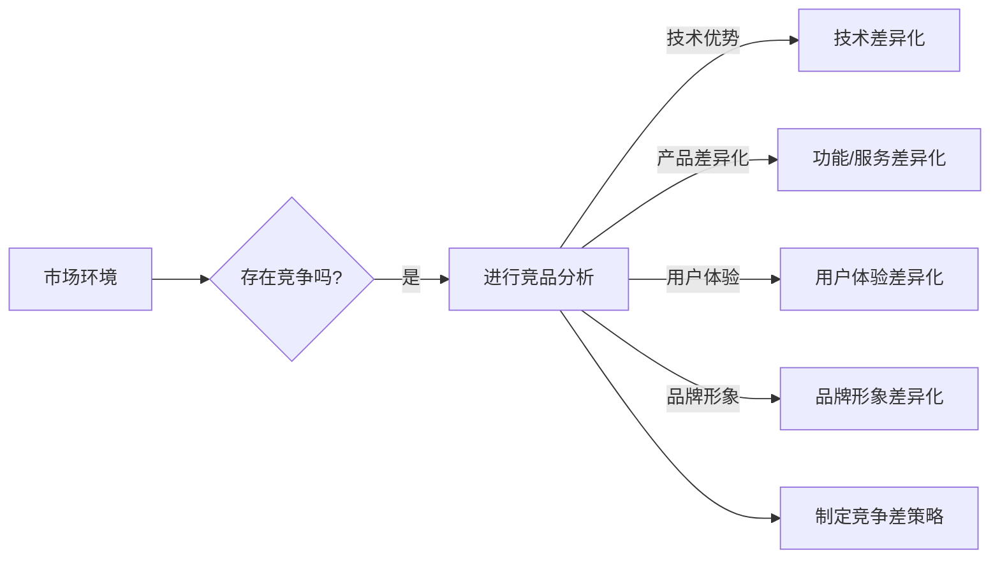

# 竞争差：你我都做，我做的比你好

> 关键词：竞争差，竞品分析，创新，市场定位，用户体验，技术优势

## 1. 背景介绍

在信息爆炸的时代，市场竞争愈发激烈。企业如何在同质化竞争中脱颖而出，成为行业的佼佼者，是每个企业都必须面对的挑战。竞争差（Competition Difference）作为一种新的竞争策略，旨在通过分析竞争对手，找到自身的差异化优势，从而在竞争中实现“你我都做，我做的比你好”的目标。本文将深入探讨竞争差的原理、实践方法以及未来发展趋势。

## 2. 核心概念与联系

### 2.1 竞争差的概念

竞争差，是指企业在产品或服务上，相对于竞争对手所具有的差异化优势。这种优势可以是技术上的、功能上的、用户体验上的，甚至是品牌形象上的。竞争差的本质是创新，是通过不断的创新来满足市场需求，超越竞争对手。

### 2.2 竞争差的构成要素

- **技术优势**：拥有先进的技术或独特的技术解决方案，使得产品或服务在性能、效率、可靠性等方面具有明显优势。
- **产品差异化**：通过独特的设计、功能或服务，使得产品在市场上具有独特的定位和吸引力。
- **用户体验**：提供卓越的用户体验，包括易用性、可靠性、个性化等方面，提高用户满意度和忠诚度。
- **品牌形象**：建立强大的品牌形象，包括品牌认知度、美誉度、忠诚度等，提升产品或服务的市场竞争力。

### 2.3 竞争差与竞品分析的关系

竞争差需要基于竞品分析来实现。竞品分析是指对竞争对手的产品、服务、市场策略等进行全面、深入的研究和分析。通过竞品分析，企业可以了解竞争对手的优势和劣势，找到自身的差异化机会，从而构建竞争差。



## 3. 核心算法原理 & 具体操作步骤

### 3.1 算法原理概述

竞争差的算法原理在于：通过对竞争对手的分析，找到自身的差异化优势，并以此为基础，制定相应的产品或服务策略，实现竞争优势。

### 3.2 算法步骤详解

1. **竞品分析**：收集竞争对手的产品、服务、市场策略等信息，进行定量和定性分析。
2. **定位自身优势**：分析自身的技术、产品、服务、品牌等方面的优势，与竞争对手进行对比。
3. **制定竞争差策略**：根据自身优势，制定相应的产品或服务策略，包括技术创新、产品差异化、用户体验优化、品牌建设等。
4. **实施和优化**：将竞争差策略付诸实践，并根据市场反馈进行调整和优化。

### 3.3 算法优缺点

**优点**：
- 有助于企业找到自身在市场上的差异化优势。
- 增强企业的市场竞争力。
- 提高产品或服务的市场占有率。

**缺点**：
- 竞品分析需要耗费大量时间和资源。
- 竞争差策略的实施需要持续投入和创新。
- 市场环境的变化可能导致竞争差优势的丧失。

### 3.4 算法应用领域

竞争差策略适用于所有行业和领域，尤其适用于竞争激烈的市场环境。以下是一些典型的应用领域：

- 信息技术行业：如软件、硬件、互联网服务等。
- 制造业：如电子产品、汽车、家电等。
- 零售业：如服装、家居、食品等。
- 服务业：如金融、教育、医疗等。

## 4. 数学模型和公式 & 详细讲解 & 举例说明

### 4.1 数学模型构建

竞争差的数学模型可以表示为：

$$
CD = f(IA, PD, UE, BI)
$$

其中，$CD$ 表示竞争差，$IA$ 表示技术优势，$PD$ 表示产品差异化，$UE$ 表示用户体验，$BI$ 表示品牌形象。

### 4.2 公式推导过程

- $IA$ 的计算可以通过比较自身技术与竞争对手技术的差异来实现。
- $PD$ 的计算可以通过比较自身产品与竞争对手产品的差异来实现。
- $UE$ 的计算可以通过用户调查、用户反馈等方式来实现。
- $BI$ 的计算可以通过品牌调查、品牌口碑等方式来实现。

### 4.3 案例分析与讲解

以智能手机市场为例，某品牌在技术、产品、用户体验和品牌形象方面均具有明显优势，因此其竞争差可以表示为：

$$
CD = f(IA, PD, UE, BI) = f(T1, P1, U1, B1)
$$

其中，$T1$ 表示该品牌在技术方面的优势，$P1$ 表示该品牌在产品方面的优势，$U1$ 表示该品牌在用户体验方面的优势，$B1$ 表示该品牌在品牌形象方面的优势。

## 5. 项目实践：代码实例和详细解释说明

### 5.1 开发环境搭建

由于竞争差是一个综合性的策略，没有特定的开发环境要求。以下是使用Python进行竞品分析的一个简单示例。

### 5.2 源代码详细实现

```python
import pandas as pd

# 假设已经收集了以下竞品信息
data = {
    '品牌': ['品牌A', '品牌B', '品牌C'],
    '技术优势': [9, 8, 7],
    '产品差异化': [8, 7, 6],
    '用户体验': [9, 7, 8],
    '品牌形象': [9, 8, 7]
}

df = pd.DataFrame(data)

# 计算竞争差
df['竞争差'] = df[['技术优势', '产品差异化', '用户体验', '品牌形象']].mean()

print(df)
```

### 5.3 代码解读与分析

该代码首先创建了一个包含竞品信息的DataFrame，然后计算了每个品牌的平均竞争差，并打印出来。

## 6. 实际应用场景

### 6.1 信息技术行业

在信息技术行业，竞争差可以通过以下方式实现：

- 技术优势：开发先进的软件、硬件或平台。
- 产品差异化：提供独特的功能或服务。
- 用户体验：提供简洁、易用的界面和流程。
- 品牌形象：打造专业、可信的品牌形象。

### 6.2 制造业

在制造业，竞争差可以通过以下方式实现：

- 技术优势：采用先进的生产技术或工艺。
- 产品差异化：提供独特的设计或功能。
- 用户体验：提供优质的产品和服务。
- 品牌形象：打造高端、品质保证的品牌形象。

### 6.3 零售业

在零售业，竞争差可以通过以下方式实现：

- 产品差异化：提供独特的商品或服务。
- 用户体验：提供舒适的购物环境和优质的客户服务。
- 品牌形象：打造时尚、潮流的品牌形象。

### 6.4 服务业

在服务业，竞争差可以通过以下方式实现：

- 用户体验：提供高效、专业的服务。
- 品牌形象：打造专业、可信赖的品牌形象。

## 7. 工具和资源推荐

### 7.1 学习资源推荐

- 《竞争战略》：迈克尔·波特的作品，详细介绍了竞争战略的理论和实践。
- 《蓝海战略》：魏斯曼的作品，提出了蓝海战略的概念，帮助企业在竞争激烈的市场中找到新的市场空间。

### 7.2 开发工具推荐

- Python：用于数据分析和可视化。
- Excel：用于数据整理和分析。

### 7.3 相关论文推荐

- 《竞争战略的数学理论》：克劳迪奥·阿尔瓦雷斯的论文，从数学角度分析了竞争战略。
- 《蓝海战略的实证研究》：刘润的论文，对蓝海战略进行了实证研究。

## 8. 总结：未来发展趋势与挑战

### 8.1 研究成果总结

竞争差作为一种新的竞争策略，在帮助企业实现差异化竞争优势方面具有重要作用。通过分析竞争对手，找到自身的差异化优势，企业可以制定相应的竞争差策略，从而在市场上脱颖而出。

### 8.2 未来发展趋势

未来，竞争差策略将呈现出以下发展趋势：

- 竞争差策略将更加精细化、个性化。
- 竞争差将更加注重用户体验和品牌建设。
- 竞争差将更加依赖于数据分析和人工智能技术。

### 8.3 面临的挑战

竞争差策略在实施过程中也面临着以下挑战：

- 竞品分析需要耗费大量时间和资源。
- 竞争差策略的实施需要持续投入和创新。
- 市场环境的变化可能导致竞争差优势的丧失。

### 8.4 研究展望

未来，竞争差策略的研究将更加注重以下几个方面：

- 如何更有效地进行竞品分析。
- 如何制定更加精细化的竞争差策略。
- 如何将竞争差策略与其他竞争策略相结合。

## 9. 附录：常见问题与解答

**Q1：竞争差策略是否适用于所有行业？**

A：竞争差策略适用于所有行业和领域，尤其适用于竞争激烈的市场环境。

**Q2：如何进行有效的竞品分析？**

A：进行有效的竞品分析需要以下步骤：

1. 确定竞品范围。
2. 收集竞品信息。
3. 分析竞品信息。
4. 总结竞品优势和劣势。

**Q3：竞争差策略的实施需要哪些资源？**

A：竞争差策略的实施需要以下资源：

1. 竞品分析团队。
2. 创新团队。
3. 市场营销团队。

**Q4：如何评估竞争差策略的效果？**

A：评估竞争差策略的效果可以从以下方面进行：

1. 市场份额。
2. 利润率。
3. 用户满意度。

---

作者：禅与计算机程序设计艺术 / Zen and the Art of Computer Programming