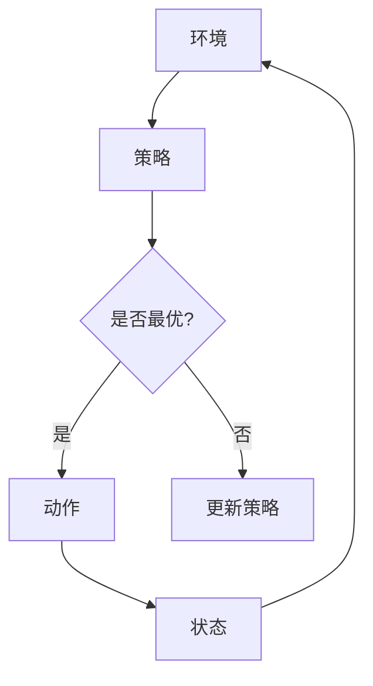
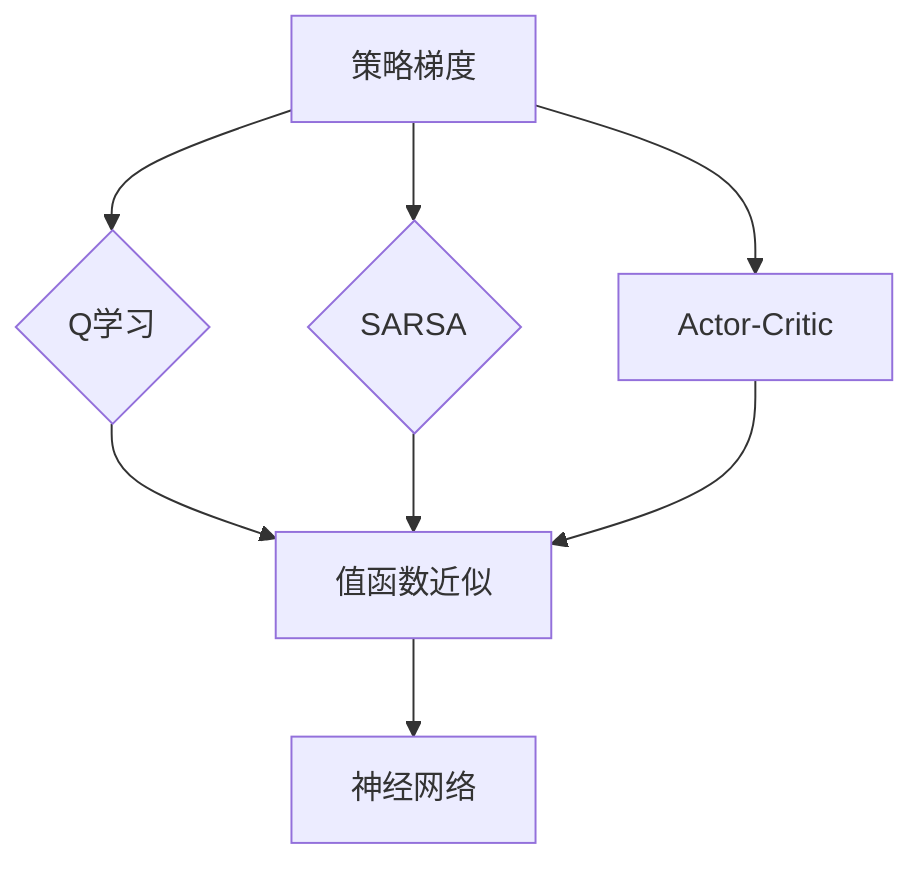

# 策略梯度Policy Gradient原理与代码实例讲解

> 关键词：策略梯度，强化学习，Markov决策过程，Q学习，SARSA，Actor-Critic，深度强化学习，神经网络，环境模拟

## 1. 背景介绍

强化学习（Reinforcement Learning, RL）是机器学习的一个分支，它通过智能体（Agent）与环境（Environment）的交互，学习一个最优策略（Policy），以实现目标最大化。策略梯度（Policy Gradient）是强化学习中的一种经典算法，它通过直接优化策略参数来学习最优策略，无需显式地计算值函数。本文将深入探讨策略梯度的原理、具体操作步骤，并通过代码实例进行详细讲解。

## 2. 核心概念与联系

### 2.1 核心概念原理

#### Mermaid 流程图



#### 核心概念

- **环境（Environment）**：环境是强化学习中的实体，它定义了智能体可以与之交互的规则和状态空间。环境可以是物理环境，如机器人导航，也可以是虚拟环境，如电子游戏。

- **智能体（Agent）**：智能体是执行动作并从环境中获取奖励的实体。智能体的目标是学习一个策略，以最大化其累积奖励。

- **策略（Policy）**：策略是智能体在给定状态下选择动作的概率分布。

- **值函数（Value Function）**：值函数表示智能体在某个状态下采取特定策略所能获得的期望累积奖励。

- **奖励（Reward）**：奖励是环境对智能体的动作所给予的即时反馈。

### 2.2 核心概念联系

在强化学习框架中，智能体通过与环境交互，不断调整策略，以期最大化累积奖励。策略梯度方法直接优化策略参数，而无需显式计算值函数。以下是策略梯度与其他强化学习方法的关系：



## 3. 核心算法原理 & 具体操作步骤

### 3.1 算法原理概述

策略梯度方法通过最大化策略的期望回报来学习最优策略。具体而言，策略梯度算法基于如下原理：

- **策略梯度定理**：给定策略 $\pi(\theta)$ 和奖励函数 $r(s, a)$，策略梯度可以用以下公式表示：

  $$
\nabla_{\theta} J(\pi(\theta)) = \sum_{s \in S} \pi(\theta)(s) \nabla_{\theta} \left[ \sum_{a \in A(s)} \pi(\theta)(a) r(s, a) \right]
$$

  其中 $S$ 为状态空间，$A$ 为动作空间，$\theta$ 为策略参数。

### 3.2 算法步骤详解

策略梯度算法的基本步骤如下：

1. **初始化策略参数**：随机初始化策略参数 $\theta$。
2. **环境交互**：智能体根据策略 $\pi(\theta)$ 在环境中执行动作，并获取状态转移概率和奖励。
3. **计算回报**：计算累积回报，用于评估策略的优劣。
4. **计算策略梯度**：根据策略梯度定理，计算策略参数的梯度。
5. **更新策略参数**：使用梯度下降或其他优化算法更新策略参数 $\theta$。
6. **重复步骤2-5**：不断重复上述步骤，直到满足停止条件（如达到一定迭代次数、策略收敛等）。

### 3.3 算法优缺点

#### 优点

- **无需显式值函数**：策略梯度方法直接优化策略参数，无需显式计算值函数，减少了计算量。
- **适用于连续动作空间**：策略梯度方法可以应用于具有连续动作空间的强化学习任务。

#### 缺点

- **难以处理高维连续动作空间**：在高维连续动作空间中，策略梯度方法可能难以收敛。
- **对噪声敏感**：策略梯度方法对噪声数据较为敏感，可能导致收敛不稳定。

### 3.4 算法应用领域

策略梯度方法在多个领域有广泛的应用，包括：

- **机器人控制**：例如无人机控制、机器人导航等。
- **游戏AI**：例如电子游戏、棋类游戏等。
- **资源分配**：例如交通流量控制、能源管理等。

## 4. 数学模型和公式 & 详细讲解 & 举例说明

### 4.1 数学模型构建

假设智能体处于状态 $s$，采取动作 $a$，状态转移概率为 $P(s' | s, a)$，奖励函数为 $r(s, a)$，策略 $\pi(a | s)$ 为智能体在状态 $s$ 采取动作 $a$ 的概率。

### 4.2 公式推导过程

策略梯度的核心公式如下：

$$
\nabla_{\theta} J(\pi(\theta)) = \sum_{s \in S} \pi(\theta)(s) \nabla_{\theta} \left[ \sum_{a \in A(s)} \pi(\theta)(a) r(s, a) \right]
$$

其中，$\nabla_{\theta} J(\pi(\theta))$ 表示策略参数 $\theta$ 的梯度，$\pi(\theta)(s)$ 表示在状态 $s$ 下采取动作 $a$ 的概率。

### 4.3 案例分析与讲解

假设智能体在状态空间 $S = \{s_1, s_2, s_3\}$ 中选择动作 $A = \{a_1, a_2, a_3\}$，奖励函数为 $r(s, a) = s \cdot a$，策略为 $\pi(a | s) = \frac{1}{3}$（均匀分布）。

根据策略梯度公式，我们可以计算策略参数的梯度：

$$
\nabla_{\theta} J(\pi(\theta)) = \sum_{s=1}^3 \frac{1}{3} \left[ \nabla_{\theta} \left( \frac{1}{3} r(s_1, a_1) + \frac{1}{3} r(s_2, a_2) + \frac{1}{3} r(s_3, a_3) \right) \right]
$$

$$
= \frac{1}{3} \left( \nabla_{\theta} \left( \frac{1}{3} s_1 \cdot a_1 + \frac{1}{3} s_2 \cdot a_2 + \frac{1}{3} s_3 \cdot a_3 \right) \right)
$$

$$
= \frac{1}{3} \left( \frac{1}{3} a_1 + \frac{1}{3} a_2 + \frac{1}{3} a_3 \right)
$$

因此，策略参数的梯度为 $\frac{1}{3} (a_1 + a_2 + a_3)$。

## 5. 项目实践：代码实例和详细解释说明

### 5.1 开发环境搭建

在进行策略梯度实践前，我们需要搭建以下开发环境：

1. 安装Python和PyTorch
2. 安装 gym 库

### 5.2 源代码详细实现

以下是一个简单的策略梯度算法实现，用于解决 CartPole 环境的强化学习问题：

```python
import gym
import torch
import torch.nn as nn
import torch.optim as optim

# 定义策略网络
class Policy(nn.Module):
    def __init__(self, input_size, hidden_size, output_size):
        super(Policy, self).__init__()
        self.fc1 = nn.Linear(input_size, hidden_size)
        self.fc2 = nn.Linear(hidden_size, output_size)

    def forward(self, x):
        x = torch.relu(self.fc1(x))
        x = self.fc2(x)
        return x

# 定义策略梯度算法
def policy_gradient(env, policy, num_episodes, alpha=0.01):
    optimizer = optim.Adam(policy.parameters(), lr=alpha)

    for episode in range(num_episodes):
        state = env.reset()
        done = False
        rewards = 0

        while not done:
            action = policy(torch.from_numpy(state).float()).detach().numpy()
            next_state, reward, done, _ = env.step(action)

            rewards += reward
            optimizer.zero_grad()
            loss = -torch.log(action[0]) * reward
            loss.backward()
            optimizer.step()

            state = next_state

        print(f"Episode {episode}, Reward: {rewards}")

if __name__ == "__main__":
    env = gym.make("CartPole-v0")
    policy = Policy(env.observation_space.shape[0], 64, env.action_space.n)
    policy_gradient(env, policy, num_episodes=1000)
```

### 5.3 代码解读与分析

- **Policy 类**：定义了一个简单的策略网络，包含两个全连接层。
- **policy_gradient 函数**：实现了策略梯度算法的核心逻辑，包括环境初始化、策略参数更新、奖励计算等。
- **main 函数**：创建 CartPole 环境和策略网络，调用 policy_gradient 函数进行训练。

### 5.4 运行结果展示

运行上述代码，可以看到策略网络在 CartPole 环境中学习到了一个稳定控制杆的方法。

## 6. 实际应用场景

策略梯度方法在多个领域有广泛的应用，以下是一些实际应用场景：

- **自动驾驶**：用于控制车辆的行驶方向和速度，实现自动驾驶功能。
- **机器人控制**：用于控制机器人的运动，实现自主导航和任务执行。
- **游戏AI**：用于控制游戏角色，实现人工智能对手。
- **推荐系统**：用于优化推荐算法，提高推荐效果。

## 7. 工具和资源推荐

### 7.1 学习资源推荐

- 《Reinforcement Learning: An Introduction》
- 《Deep Reinforcement Learning Hands-On》
- OpenAI Gym
- PyTorch
- TensorFlow

### 7.2 开发工具推荐

- gym：一个开源的强化学习环境库。
- OpenAI Baselines：一个包含多个强化学习算法的库。
- PyTorch：一个开源的深度学习框架。

### 7.3 相关论文推荐

- "Reinforcement Learning: An Introduction" by Richard S. Sutton and Andrew G. Barto
- "Deep Reinforcement Learning" by David Silver, Alekh Agarwal, John Lehman, and Sergey Levine
- "Playing Atari with Deep Reinforcement Learning" by Volodymyr Mnih et al.

## 8. 总结：未来发展趋势与挑战

### 8.1 研究成果总结

策略梯度方法在强化学习领域取得了显著的成果，为解决连续动作空间中的强化学习问题提供了有效的方法。然而，策略梯度方法仍面临一些挑战，如高维连续动作空间、噪声数据、收敛速度慢等。

### 8.2 未来发展趋势

未来，策略梯度方法的研究将主要集中在以下几个方面：

- **改进算法性能**：提高算法在连续动作空间中的收敛速度和稳定性。
- **扩展应用范围**：将策略梯度方法应用于更多领域，如机器人控制、游戏AI、推荐系统等。
- **与其他方法的结合**：将策略梯度方法与其他强化学习方法（如Q学习、SARSA）结合，以发挥各自优势。

### 8.3 面临的挑战

策略梯度方法面临的挑战包括：

- **高维连续动作空间**：如何高效地在高维连续动作空间中进行优化。
- **噪声数据**：如何处理噪声数据对算法性能的影响。
- **收敛速度**：如何提高算法的收敛速度。

### 8.4 研究展望

随着深度学习技术的不断发展，策略梯度方法将在未来得到更广泛的应用。通过不断改进算法性能和扩展应用范围，策略梯度方法将为解决更多实际问题提供有力支持。

## 9. 附录：常见问题与解答

**Q1：策略梯度方法适用于哪些类型的强化学习问题？**

A1：策略梯度方法适用于连续动作空间的强化学习问题，如机器人控制、自动驾驶等。

**Q2：策略梯度方法与Q学习方法有何区别？**

A2：策略梯度方法和Q学习方法都是强化学习中的常用算法。策略梯度方法直接优化策略参数，而Q学习方法直接优化值函数。

**Q3：如何提高策略梯度算法的收敛速度？**

A3：提高策略梯度算法的收敛速度可以尝试以下方法：
- 使用更高效的优化算法，如Adam。
- 使用不同的策略更新规则，如GAE。
- 增加训练样本数量。
- 使用更加合适的策略网络结构。

**Q4：策略梯度方法在哪些实际应用中取得了成功？**

A4：策略梯度方法在多个实际应用中取得了成功，如自动驾驶、机器人控制、游戏AI、推荐系统等。

作者：禅与计算机程序设计艺术 / Zen and the Art of Computer Programming