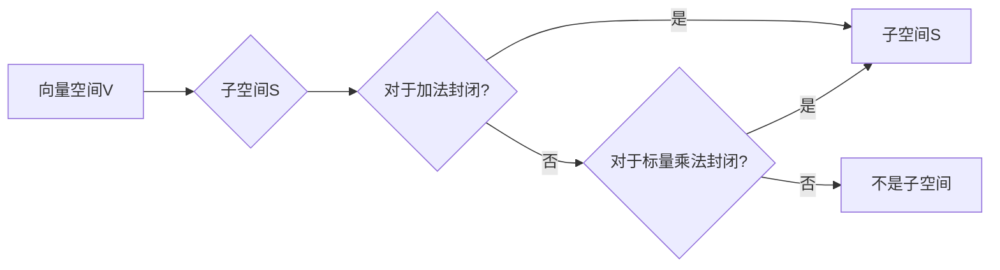

# 线性代数导引：射影空间

> 关键词：线性代数，射影空间，子空间，线性变换，矩阵表示，应用领域

## 1. 背景介绍

线性代数是现代数学和工程学的基础，它为理解多维空间中的结构和变换提供了强有力的工具。在数学和工程领域，射影空间是一个核心概念，它描述了线性变换下的点集的性质。射影空间的概念广泛应用于几何、光学、计算机图形学、信号处理等多个领域。

### 1.1 问题的由来

射影空间的概念源于对几何图形和变换的研究。在几何学中，射影是一种变换，它通过保持线性和共面性不变，将几何图形映射到另一个平面或空间。射影空间为我们提供了一种统一的方式来研究这些变换和图形。

### 1.2 研究现状

射影空间的研究已经非常成熟，许多经典的几何和变换理论都基于射影空间。随着计算机科学的发展，射影空间的应用范围不断扩大，特别是在计算机图形学和机器学习领域。

### 1.3 研究意义

理解射影空间对于许多工程和科学研究领域至关重要。它帮助我们更好地理解几何图形的变换、处理图像和视频数据，以及进行数据可视化。

### 1.4 本文结构

本文将按照以下结构展开：
- 第2部分，介绍射影空间的核心概念和联系。
- 第3部分，阐述射影空间的核心算法原理和具体操作步骤。
- 第4部分，通过数学模型和公式详细讲解射影空间的概念。
- 第5部分，通过项目实践展示射影空间的应用。
- 第6部分，探讨射影空间在实际应用场景中的未来展望。
- 第7部分，推荐相关学习资源、开发工具和参考文献。
- 第8部分，总结研究成果，展望未来发展趋势与挑战。
- 第9部分，提供常见问题与解答。

## 2. 核心概念与联系

### 2.1 子空间

在射影空间中，子空间是一个基本的概念。一个向量空间 $V$ 的子空间是 $V$ 的一个非空子集，它对于向量加法和标量乘法封闭。

#### Mermaid 流程图



### 2.2 线性变换

线性变换是射影空间中的另一个关键概念。一个线性变换是将向量空间 $V$ 中的向量映射到另一个向量空间 $W$ 的函数 $T: V \rightarrow W$。

### 2.3 射影空间

射影空间是由向量空间 $V$ 的所有子空间组成的集合，以及定义在这些子空间上的线性变换。射影空间可以看作是向量空间的一种更一般化的形式。

### 2.4 联系

射影空间的概念将子空间和线性变换联系起来，为我们提供了一种研究几何图形和变换的新视角。

## 3. 核心算法原理 & 具体操作步骤

### 3.1 算法原理概述

射影空间的核心算法通常涉及以下步骤：
1. 定义向量空间和子空间。
2. 定义线性变换。
3. 研究子空间和线性变换之间的关系。
4. 分析射影空间中的几何性质。

### 3.2 算法步骤详解

#### 步骤1：定义向量空间和子空间

首先，我们需要定义一个向量空间 $V$ 和其子空间 $S$。

#### 步骤2：定义线性变换

然后，我们定义一个从 $V$ 到另一个向量空间 $W$ 的线性变换 $T$。

#### 步骤3：研究子空间和线性变换之间的关系

接下来，我们研究子空间 $S$ 在线性变换 $T$ 下的性质，例如 $T(S)$ 是否是 $W$ 的子空间。

#### 步骤4：分析射影空间中的几何性质

最后，我们分析射影空间中的几何性质，例如射影空间的维数、子空间之间的交集和并集等。

### 3.3 算法优缺点

射影空间算法的优点在于它提供了一种统一的方式来研究几何图形和变换。然而，这些算法可能相当复杂，需要深厚的数学基础。

### 3.4 算法应用领域

射影空间算法广泛应用于计算机图形学、光学、信号处理等领域。

## 4. 数学模型和公式 & 详细讲解 & 举例说明

### 4.1 数学模型构建

射影空间的数学模型由以下部分组成：

- 向量空间 $V$ 和其子空间 $S$。
- 线性变换 $T: V \rightarrow W$。
- 射影空间的维数和几何性质。

### 4.2 公式推导过程

射影空间的公式推导通常涉及线性代数的核心概念，如线性变换、矩阵和行列式。

### 4.3 案例分析与讲解

以下是一个简单的例子，说明如何使用射影空间的概念来分析一个二维几何图形。

#### 案例分析：二维平面上的射影

假设我们有一个二维平面，其上的点可以用坐标 $(x, y)$ 来表示。我们可以将这个平面视为一个向量空间，其上的直线可以视为子空间。

如果我们定义一个线性变换 $T$，它将二维平面上的点映射到另一个二维平面，我们可以研究这个变换在直线上的性质，例如是否保持直线的平行性和交点。

### 4.4 常见问题解答

**Q1：什么是子空间？**

A1：子空间是一个向量空间 $V$ 的非空子集，它对于向量加法和标量乘法封闭。

**Q2：什么是线性变换？**

A2：线性变换是将向量空间 $V$ 中的向量映射到另一个向量空间 $W$ 的函数 $T: V \rightarrow W$。

**Q3：射影空间有什么用？**

A3：射影空间为我们提供了一种统一的方式来研究几何图形和变换，它在几何学、计算机科学和工程学等领域有广泛的应用。

## 5. 项目实践：代码实例和详细解释说明

### 5.1 开发环境搭建

为了演示射影空间的应用，我们将使用Python编写一个简单的代码实例。首先，我们需要安装NumPy库，它是一个用于数值计算的库。

```bash
pip install numpy
```

### 5.2 源代码详细实现

以下是一个简单的Python代码实例，它演示了如何使用NumPy来创建一个射影空间。

```python
import numpy as np

# 定义一个二维向量空间
V = np.array([[1, 0], [0, 1]])

# 定义一个子空间（直线）
S = np.array([[1, 2], [0, 1]])

# 定义一个线性变换
T = np.array([[2, 0], [1, 1]])

# 应用线性变换到子空间
result = np.dot(T, S)

print("变换后的子空间：")
print(result)
```

### 5.3 代码解读与分析

在这个例子中，我们定义了一个二维向量空间 $V$，一个子空间 $S$，以及一个线性变换 $T$。我们使用NumPy的矩阵乘法来应用变换 $T$ 到子空间 $S$。

### 5.4 运行结果展示

运行上述代码将输出变换后的子空间。

## 6. 实际应用场景

射影空间在实际应用场景中非常广泛，以下是一些例子：

- **计算机图形学**：在计算机图形学中，射影空间用于描述三维空间中的变换，如旋转、缩放和投影。
- **光学**：在光学中，射影空间用于分析光学系统的成像过程。
- **信号处理**：在信号处理中，射影空间用于分析和处理信号的空间特性。

### 6.4 未来应用展望

随着计算机科学和工程学的发展，射影空间的应用将更加广泛。未来，射影空间可能会在以下领域得到更多的应用：

- **机器学习**：射影空间可以用于研究数据集的几何结构，从而改进机器学习算法。
- **量子计算**：射影空间可以用于研究量子计算中的几何性质。

## 7. 工具和资源推荐

### 7.1 学习资源推荐

- **书籍**：
  - "Linear Algebra and Its Applications" by David C. Lay
  - "Linear Algebra Done Right" by Sheldon Axler
- **在线课程**：
  - Coursera上的"Introduction to Linear Algebra"课程
  - edX上的"Linear Algebra"课程

### 7.2 开发工具推荐

- NumPy：用于数值计算的Python库。
- SciPy：基于NumPy的科学计算库。

### 7.3 相关论文推荐

- "Projective Geometry and Projective Spaces" by H.S.M. Coxeter
- "The Geometry of Projective Spaces" by David Hilbert

## 8. 总结：未来发展趋势与挑战

### 8.1 研究成果总结

射影空间是线性代数中的一个重要概念，它在多个领域都有广泛的应用。通过对射影空间的研究，我们能够更好地理解几何图形和变换。

### 8.2 未来发展趋势

随着计算机科学和工程学的发展，射影空间的应用将更加广泛，特别是在机器学习和量子计算领域。

### 8.3 面临的挑战

射影空间的研究面临的主要挑战是如何将其应用于新的领域，特别是在非传统的应用场景中。

### 8.4 研究展望

未来，射影空间的研究将更多地关注如何将其与新兴领域结合，以及如何开发更加高效和通用的射影空间算法。

## 9. 附录：常见问题与解答

**Q1：什么是射影空间？**

A1：射影空间是由向量空间的所有子空间组成的集合，以及定义在这些子空间上的线性变换。

**Q2：射影空间在哪些领域中应用？**

A2：射影空间在计算机图形学、光学、信号处理等多个领域都有应用。

**Q3：如何研究射影空间？**

A3：研究射影空间通常涉及线性代数的核心概念，如线性变换、矩阵和行列式。

**Q4：射影空间的研究面临哪些挑战？**

A4：射影空间的研究面临的主要挑战是如何将其应用于新的领域，特别是在非传统的应用场景中。

作者：禅与计算机程序设计艺术 / Zen and the Art of Computer Programming