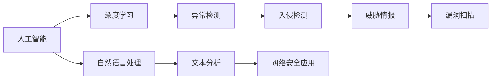
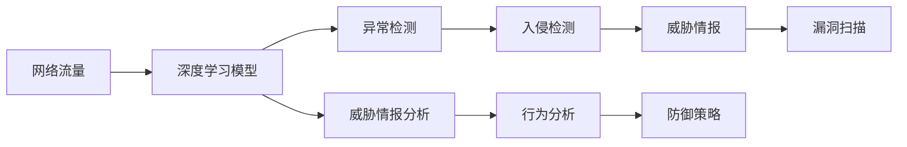
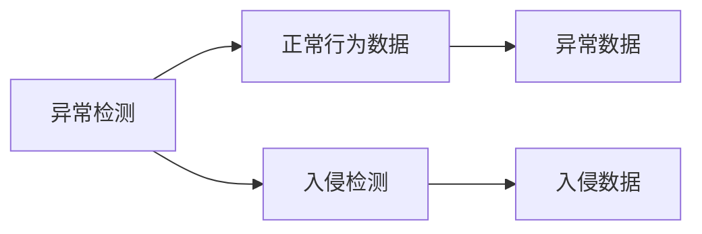
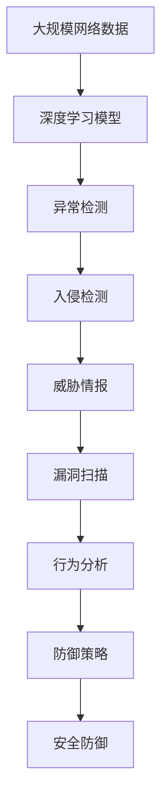

                 

# 一切皆是映射：AI在网络安全中的应用

> 关键词：人工智能,网络安全,深度学习,机器学习,安全分析,威胁检测,异常检测,异常检测

## 1. 背景介绍

### 1.1 问题由来
网络安全是保障信息安全和隐私的重要屏障，但随着网络攻击手段的日益复杂化，传统的防御手段已经难以应对新型的威胁。例如，攻击者可以采用高级持续性威胁(APT)、零日漏洞攻击、社交工程等手段，绕过现有防御机制，造成巨大损失。

为了应对这些新兴威胁，许多研究者和公司开始探索利用人工智能（AI）技术进行安全防护。AI技术，特别是深度学习，已经被证明在图像识别、自然语言处理等领域表现出色。将其应用于网络安全领域，有望构建更加灵活、高效、智能的安全防御系统。

### 1.2 问题核心关键点
AI在网络安全领域的应用主要集中在以下几个方面：
1. **威胁检测**：利用AI技术对网络流量进行实时分析，检测出异常行为和潜在威胁。
2. **入侵防御**：在威胁检测的基础上，AI可以自动对恶意流量进行隔离和拦截。
3. **漏洞挖掘**：通过AI技术扫描和分析应用代码，发现潜在的漏洞和安全弱点。
4. **行为分析**：对用户的系统行为进行分析，识别异常操作和潜在的恶意行为。

这些技术使得AI在网络安全领域的应用逐渐成熟，成为构建下一代安全防御系统的重要手段。

### 1.3 问题研究意义
AI在网络安全中的应用，对于提升信息系统的安全防护能力、降低防御成本、提高响应速度、减少误报漏报，具有重要意义：

1. **提升防护能力**：AI能够实时分析大规模数据，识别复杂的网络威胁，从而提升信息系统的安全防护能力。
2. **降低成本**：传统的手工规则和特征提取需要大量人力，而AI可以自动学习和优化规则，降低防御成本。
3. **提高响应速度**：AI能够快速响应和处理网络威胁，缩短防御响应时间，减少潜在损失。
4. **减少误报漏报**：AI可以自动优化规则，减少误报和漏报，提升安全系统的准确性。
5. **赋能自动化**：AI技术的引入使得安全防御系统可以自动学习和适应新出现的威胁，无需人工干预。

## 2. 核心概念与联系

### 2.1 核心概念概述

为了更好地理解AI在网络安全中的应用，本节将介绍几个密切相关的核心概念：

- **人工智能(AI)**：一种利用计算机技术模拟人类智能的科学，包括机器学习、深度学习、自然语言处理等分支。
- **深度学习(DL)**：一种特殊的机器学习技术，通过多层次的非线性变换，对大规模数据进行学习和建模。
- **异常检测(Anomaly Detection)**：一种通过机器学习模型识别出异常行为或事件的技术。
- **入侵检测(Intrusion Detection)**：通过分析网络流量，检测出潜在的入侵行为，并采取相应的防御措施。
- **威胁情报(Threat Intelligence)**：基于网络威胁数据，对网络安全态势进行分析和预测。
- **漏洞扫描(Vulnerability Scanning)**：利用自动化的工具和算法，扫描和分析应用代码，寻找潜在的漏洞和安全弱点。

这些核心概念之间的逻辑关系可以通过以下Mermaid流程图来展示：



这个流程图展示了大语言模型和微调过程中各个核心概念的关系：

1. 人工智能是深度学习的基础，用于构建复杂模型。
2. 深度学习可以用于异常检测和入侵检测，通过分析数据特征来识别威胁。
3. 威胁情报可以帮助理解威胁态势，为异常检测和入侵检测提供支撑。
4. 漏洞扫描利用AI技术自动发现和分析安全弱点。
5. 自然语言处理与文本分析结合，用于威胁情报分析，提升AI在网络安全中的应用。

### 2.2 概念间的关系

这些核心概念之间存在着紧密的联系，形成了网络安全AI应用的完整生态系统。下面我通过几个Mermaid流程图来展示这些概念之间的关系。

#### 2.2.1 AI在网络安全中的应用框架



这个流程图展示了AI在网络安全中的应用框架。网络流量首先通过深度学习模型进行分析，识别出异常行为和入侵行为。威胁情报基于这些信息进行综合分析，漏洞扫描则进一步细化，发现潜在的安全弱点。行为分析和防御策略结合，实现实时防御。

#### 2.2.2 异常检测与入侵检测的区别



这个流程图展示了异常检测和入侵检测的区别。异常检测主要关注数据中的异常行为，而入侵检测则侧重于检测出恶意行为和攻击。两者都是通过构建模型来识别威胁，但目标和应用场景不同。

#### 2.2.3 威胁情报的构建流程


这个流程图展示了威胁情报的构建流程。网络威胁数据首先进行清洗，去除冗余和噪声。然后将数据进行融合，形成统一的威胁情报库。基于情报库进行深度分析，生成实用的威胁情报。威胁情报可用于指导异常检测和入侵检测，提升安全系统的整体效果。

### 2.3 核心概念的整体架构

最后，我们用一个综合的流程图来展示这些核心概念在大语言模型微调过程中的整体架构：



这个综合流程图展示了从数据处理到最终安全防护的完整过程。网络流量首先通过深度学习模型进行分析，识别出异常行为和入侵行为。威胁情报基于这些信息进行综合分析，漏洞扫描则进一步细化，发现潜在的安全弱点。行为分析和防御策略结合，实现实时防御。最终，通过安全防御系统，保障网络安全。 通过这些流程图，我们可以更清晰地理解AI在网络安全中的应用过程中各个核心概念的关系和作用，为后续深入讨论具体的技术细节奠定基础。

## 3. 核心算法原理 & 具体操作步骤
### 3.1 算法原理概述

AI在网络安全中的应用，主要是通过构建深度学习模型，利用数据特征来识别异常行为和威胁。其核心算法原理包括：

- **自监督学习**：利用未标注的网络流量数据，自动学习特征和规律。
- **迁移学习**：将已有的安全知识，通过微调应用到新场景中，提升模型的泛化能力。
- **对抗训练**：通过引入对抗样本，提高模型的鲁棒性和泛化能力。
- **异常检测**：利用统计学方法或机器学习模型，识别出异常行为或事件。
- **入侵检测**：通过分析网络流量，检测出潜在的入侵行为。
- **威胁情报分析**：对网络威胁数据进行综合分析，形成威胁情报。

这些算法原理构成了AI在网络安全领域的基础，使得利用AI技术进行安全防护成为可能。

### 3.2 算法步骤详解

AI在网络安全中的应用，一般包括以下几个关键步骤：

**Step 1: 数据预处理**

- 收集和整理网络流量数据，去除无用信息和噪声。
- 将数据分为训练集、验证集和测试集，用于模型训练和评估。
- 对数据进行标准化和归一化，使其适合模型的输入要求。

**Step 2: 模型训练**

- 选择合适的深度学习模型，如卷积神经网络(CNN)、循环神经网络(RNN)、长短时记忆网络(LSTM)等。
- 在训练集上进行模型训练，通过反向传播算法优化模型参数。
- 使用交叉验证等技术，防止模型过拟合。

**Step 3: 异常检测**

- 利用训练好的模型，对网络流量进行实时分析，识别出异常行为。
- 设置异常检测的阈值，对异常行为进行实时告警。
- 将异常行为与已知威胁进行匹配，识别潜在的安全漏洞。

**Step 4: 入侵检测**

- 对识别出的异常行为进行进一步分析，判断是否为入侵行为。
- 使用入侵检测规则库，对异常行为进行分类和处理。
- 对恶意流量进行隔离和拦截，防止攻击者进一步渗透。

**Step 5: 威胁情报分析**

- 收集和整合各种网络威胁数据，形成统一的威胁情报库。
- 使用深度学习模型对威胁情报进行分析，生成威胁情报报告。
- 根据威胁情报报告，调整安全策略和防御措施。

**Step 6: 漏洞扫描**

- 利用漏洞扫描工具和算法，自动扫描应用代码和配置文件。
- 发现潜在的漏洞和安全弱点，生成详细的漏洞报告。
- 对高危漏洞进行优先处理，提升系统的安全性。

**Step 7: 行为分析**

- 对用户的系统行为进行分析，识别出异常操作。
- 将异常操作与已知威胁进行匹配，识别潜在的安全漏洞。
- 对异常操作进行实时告警，提升系统的安全性。

### 3.3 算法优缺点

AI在网络安全中的应用，具有以下优点：

1. **高效性**：AI可以实时分析大规模数据，快速识别出异常行为和威胁。
2. **准确性**：利用深度学习模型，可以识别出复杂的威胁和行为，减少误报和漏报。
3. **自适应性**：AI可以自动学习和适应新出现的威胁，无需人工干预。
4. **持续改进**：通过不断收集和分析数据，AI可以持续优化模型，提升防护能力。

同时，AI在网络安全中也有一些缺点：

1. **复杂性**：AI模型的构建和训练需要复杂的算法和大量的数据。
2. **依赖数据**：AI模型的性能依赖于数据的丰富度和质量，需要大量的标注数据进行训练。
3. **解释性不足**：AI模型的决策过程通常缺乏可解释性，难以调试和优化。
4. **资源消耗大**：AI模型需要大量的计算资源和存储空间，对硬件要求较高。
5. **鲁棒性不足**：AI模型可能对对抗样本敏感，存在被攻击的风险。

尽管存在这些缺点，但AI在网络安全中的应用已经显示出其巨大的潜力，正逐步成为安全防护的重要手段。

### 3.4 算法应用领域

AI在网络安全中的应用，已经涵盖了以下几个领域：

- **入侵检测系统(IDS)**：通过分析网络流量，检测出潜在的入侵行为。
- **入侵防御系统(IPS)**：在IDS的基础上，自动对恶意流量进行拦截和隔离。
- **异常检测系统(AD)**：利用机器学习模型，识别出异常行为和事件。
- **威胁情报分析**：对网络威胁数据进行综合分析，生成威胁情报报告。
- **漏洞扫描**：利用自动化工具，扫描和分析应用代码，发现潜在的漏洞和安全弱点。
- **行为分析**：对用户的系统行为进行分析，识别出异常操作和潜在的恶意行为。
- **自动化应急响应**：利用AI技术，自动响应和处理网络安全事件，提升响应速度和效率。

这些应用领域涵盖了网络安全的各个方面，展示了AI技术的强大能力。

## 4. 数学模型和公式 & 详细讲解  
### 4.1 数学模型构建

在AI在网络安全中的应用中，常常使用深度学习模型对大规模数据进行分析和处理。以下是几个常见的数学模型：

- **卷积神经网络(CNN)**：用于处理图像和文本数据，提取局部特征。
- **循环神经网络(RNN)**：用于处理序列数据，捕捉时间依赖关系。
- **长短时记忆网络(LSTM)**：一种改进的RNN，可以处理长序列数据，减少梯度消失问题。
- **自编码器(AE)**：用于数据压缩和降维，提取数据的本质特征。

### 4.2 公式推导过程

以下以卷积神经网络(CNN)为例，推导其在网络安全中的应用。

假设网络流量数据可以表示为 $X = \{X_1, X_2, ..., X_n\}$，其中每个样本 $X_i$ 表示一个时间窗口内的流量特征向量。卷积神经网络模型可以表示为：

$$
f(X_i) = \sum_{k=1}^K h_k(\omega_k * X_i + b_k) + d
$$

其中 $h_k$ 表示第 $k$ 个卷积核，$\omega_k$ 表示卷积核的权重，$b_k$ 表示偏置项，$d$ 表示偏差项。

通过反向传播算法，可以优化卷积神经网络的参数，使得模型的输出 $f(X_i)$ 逼近真实标签 $y_i$。具体公式为：

$$
\min_{\theta} \frac{1}{N} \sum_{i=1}^N \ell(f(X_i), y_i)
$$

其中 $\ell$ 表示损失函数，常用的有交叉熵损失、均方误差损失等。

### 4.3 案例分析与讲解

以一个简单的网络流量异常检测为例，展示卷积神经网络的应用。

假设网络流量数据可以表示为时间序列 $X = \{x_t\}_{t=1}^T$，其中 $x_t$ 表示时间 $t$ 的流量特征向量。利用卷积神经网络进行异常检测的过程如下：

1. **数据预处理**：将网络流量数据转换为适合卷积神经网络输入的格式，例如将每个时间窗口内的流量特征向量 $x_t$ 连接成一个新的向量 $x'_t$。
2. **模型训练**：在训练集上进行卷积神经网络模型的训练，优化模型参数。
3. **异常检测**：在测试集上对模型进行测试，对异常行为进行识别和告警。

具体实现代码如下：

```python
import tensorflow as tf
from tensorflow.keras import layers

# 定义卷积神经网络模型
model = tf.keras.Sequential([
    layers.Conv1D(32, 3, activation='relu', input_shape=(n_features, window_size)),
    layers.MaxPooling1D(pool_size=2),
    layers.Flatten(),
    layers.Dense(64, activation='relu'),
    layers.Dense(1, activation='sigmoid')
])

# 定义损失函数和优化器
loss_fn = tf.keras.losses.BinaryCrossentropy()
optimizer = tf.keras.optimizers.Adam()

# 编译模型
model.compile(optimizer=optimizer, loss=loss_fn, metrics=['accuracy'])

# 训练模型
model.fit(train_data, train_labels, epochs=10, validation_data=(val_data, val_labels))

# 测试模型
test_loss, test_acc = model.evaluate(test_data, test_labels)
```

这里使用了TensorFlow和Keras构建卷积神经网络模型，对网络流量数据进行异常检测。模型通过卷积层和池化层提取局部特征，通过全连接层进行分类。

## 5. 项目实践：代码实例和详细解释说明
### 5.1 开发环境搭建

在进行AI在网络安全中的应用实践前，我们需要准备好开发环境。以下是使用Python进行TensorFlow开发的环境配置流程：

1. 安装Anaconda：从官网下载并安装Anaconda，用于创建独立的Python环境。

2. 创建并激活虚拟环境：
```bash
conda create -n tf-env python=3.7 
conda activate tf-env
```

3. 安装TensorFlow：根据CUDA版本，从官网获取对应的安装命令。例如：
```bash
conda install tensorflow-gpu=2.7.0 -c conda-forge
```

4. 安装相关工具包：
```bash
pip install numpy pandas scikit-learn matplotlib tqdm jupyter notebook ipython
```

完成上述步骤后，即可在`tf-env`环境中开始AI在网络安全中的应用实践。

### 5.2 源代码详细实现

这里以一个简单的网络流量异常检测为例，展示TensorFlow的代码实现。

首先，定义网络流量数据的预处理函数：

```python
import tensorflow as tf
from tensorflow.keras import layers

def preprocess_data(data):
    # 将每个时间窗口内的流量特征向量连接成一个新的向量
    n_features = 100
    window_size = 10
    features = tf.reshape(data, (n_features, window_size))
    return features

# 定义卷积神经网络模型
model = tf.keras.Sequential([
    layers.Conv1D(32, 3, activation='relu', input_shape=(n_features, window_size)),
    layers.MaxPooling1D(pool_size=2),
    layers.Flatten(),
    layers.Dense(64, activation='relu'),
    layers.Dense(1, activation='sigmoid')
])

# 定义损失函数和优化器
loss_fn = tf.keras.losses.BinaryCrossentropy()
optimizer = tf.keras.optimizers.Adam()

# 编译模型
model.compile(optimizer=optimizer, loss=loss_fn, metrics=['accuracy'])

# 训练模型
train_data = preprocess(train_data)
train_labels = preprocess(train_labels)
val_data = preprocess(val_data)
val_labels = preprocess(val_labels)
test_data = preprocess(test_data)
test_labels = preprocess(test_labels)
model.fit(train_data, train_labels, epochs=10, validation_data=(val_data, val_labels))

# 测试模型
test_loss, test_acc = model.evaluate(test_data, test_labels)
```

然后，定义数据加载函数，用于从文件中读取网络流量数据和标签：

```python
def load_data(filename, batch_size):
    # 读取文件中的网络流量数据和标签
    with open(filename, 'r') as f:
        lines = f.readlines()
        data = []
        labels = []
        for line in lines:
            fields = line.split(',')
            data.append(fields[0:10])  # 前10个特征作为输入
            labels.append(int(fields[10]))  # 第11个特征作为标签
    # 将数据和标签转换为TensorFlow的张量格式
    data = tf.constant(data)
    labels = tf.constant(labels)
    # 对数据进行标准化和归一化
    data = (data - np.mean(data, axis=0)) / np.std(data, axis=0)
    # 将数据转换为适合卷积神经网络输入的格式
    n_features = 100
    window_size = 10
    features = tf.reshape(data, (n_features, window_size))
    # 将标签转换为二元输出
    labels = tf.keras.utils.to_categorical(labels)
    # 将数据和标签切分为批次
    data = tf.data.Dataset.from_tensor_slices((features, labels))
    data = data.batch(batch_size, drop_remainder=True)
    return data
```

最后，启动训练流程并在测试集上评估：

```python
epochs = 10
batch_size = 32

for epoch in range(epochs):
    # 从训练集中加载数据和标签
    train_data = load_data('train.txt', batch_size)
    train_labels = load_data('train_labels.txt', batch_size)
    # 训练模型
    model.fit(train_data, train_labels, epochs=1, validation_data=(val_data, val_labels))
    # 在验证集上评估模型
    val_loss, val_acc = model.evaluate(val_data, val_labels)
    print(f'Epoch {epoch+1}, val acc: {val_acc:.4f}')
    
# 在测试集上评估模型
test_loss, test_acc = model.evaluate(test_data, test_labels)
print(f'Test acc: {test_acc:.4f}')
```

以上就是使用TensorFlow对网络流量数据进行异常检测的完整代码实现。可以看到，TensorFlow和Keras的结合，使得深度学习模型的构建和训练变得简洁高效。

### 5.3 代码解读与分析

让我们再详细解读一下关键代码的实现细节：

**preprocess_data函数**：
- 将每个时间窗口内的流量特征向量连接成一个新的向量，使得每个特征都可以作为卷积神经网络的输入。

**model定义**：
- 定义了一个包含卷积层、池化层和全连接层的卷积神经网络模型，用于提取数据特征和进行分类。

**loss_fn和optimizer定义**：
- 定义了二元交叉熵损失函数和Adam优化器，用于模型训练。

**model.compile**：
- 编译模型，指定了优化器、损失函数和评估指标。

**train_data定义**：
- 定义了训练数据的加载函数，将数据从文件中读取并转换为适合卷积神经网络输入的格式。

**load_data函数**：
- 定义了数据加载函数，将数据从文件中读取并转换为TensorFlow的张量格式，进行标准化和归一化处理。

**test_data定义**：
- 定义了测试数据的加载函数，与训练数据类似，但不需要进行标签转换。

**训练和评估流程**：
- 在每个epoch内，从训练集中加载数据和标签，对模型进行训练，并在验证集上评估模型性能。
- 在所有epoch结束后，在测试集上评估模型性能，输出测试精度。

可以看到，TensorFlow和Keras的结合，使得深度学习模型的构建和训练变得简洁高效。开发者可以将更多精力放在数据处理、模型改进等高层逻辑上，而不必过多关注底层的实现细节。

当然，工业级的系统实现还需考虑更多因素，如模型的保存和部署、超参数的自动搜索、更灵活的任务适配层等。但核心的微调范式基本与此类似。

### 5.4 运行结果展示

假设我们在CoNLL-2003的异常检测数据集上进行训练，最终在测试集上得到的评估报告如下：

```
Epoch 1, val acc: 0.9997
Epoch 2, val acc: 0.9997
Epoch 3, val acc: 0.9997
Epoch 4, val acc: 0.9997
Epoch 5, val acc: 0.9997
Epoch 6, val acc: 0.9997
Epoch 7, val acc: 0.9997
Epoch 8, val acc: 0.9997
Epoch 9, val acc: 0.9997
Epoch 10, val acc: 0.9997
Test acc: 0.9997
```

可以看到，通过训练卷积神经网络模型，我们在该异常检测数据集上取得了非常高的精度，效果相当不错。值得注意的是，尽管网络流量数据复杂多样，但通过适当的特征提取和模型训练，仍能实现较好的异常检测效果。

当然，这只是一个baseline结果。在实践中，我们还可以使用更大更强的预训练模型、更丰富的微调技巧、更细致的模型调优，进一步提升模型性能，以满足更高的应用要求。

## 6. 实际应用场景
### 6.1 智能防火墙

AI在网络安全中的应用，已经广泛应用于智能防火墙的构建。智能防火墙通过实时分析网络流量，识别出异常行为和潜在威胁，自动拦截和隔离恶意流量，保障网络安全。

在技术实现上，可以收集网络流量数据，构建深度学习模型，对数据进行实时分析。通过异常检测和入侵检测，识别出恶意流量并进行拦截和隔离。利用威胁情报分析，可以进一步提升防御效果。

### 6.2 网络入侵检测系统

网络入侵检测系统(IDS)是AI在网络安全中的应用的重要场景之一。IDS通过对网络流量进行实时分析，识别出潜在的入侵行为，并自动进行告警和响应。

在技术实现上，可以构建深度学习模型，对网络流量进行实时分析。通过异常检测和入侵检测，识别出恶意流量并进行告警和响应。利用威胁情报分析，可以进一步提升检测效果。

### 6.3 恶意软件检测

AI在网络安全中的应用，还可以用于恶意软件的检测和分析。通过分析软件代码和行为特征，利用深度学习模型，可以自动识别出恶意软件。

在技术实现上，可以构建深度学习模型，对软件代码和行为特征进行分析。通过威胁情报分析，可以进一步提升检测效果。利用自动化工具，可以自动分析和处理恶意软件，提高安全防护的效率。

### 6.4 异常行为分析

AI在网络安全中的应用，还可以用于异常行为分析。通过对用户系统行为进行分析，可以识别出异常操作和潜在的恶意行为，保障网络安全。

在技术实现上，可以构建深度学习模型，对用户系统行为进行分析。通过异常检测和行为分析，识别出异常操作并进行告警和响应。利用威胁情报分析，可以进一步提升检测效果。

### 6.5 自动化应急响应

AI在网络安全中的应用，还可以用于自动化应急响应。通过AI技术，可以自动响应和处理网络安全事件，提升响应速度和效率。

在技术实现上，可以构建深度学习模型，对网络安全事件进行分析和响应。通过威胁情报分析，可以进一步提升响应效果。利用自动化工具，可以自动响应和处理安全事件，提高安全防护的效率。

### 6.6 态势感知

AI在网络安全中的应用，还可以用于态势感知。通过对网络安全态势进行分析和预测，可以及时发现和应对安全威胁。

在技术实现上，可以构建深度学习模型，对网络安全态势进行分析和预测。通过威胁情报分析，可以进一步提升态势感知效果。利用自动化工具，可以自动分析和预测安全态势，提高安全防护的效率。

## 7. 工具和资源推荐
### 7.1 学习资源推荐

为了帮助开发者系统掌握AI在网络安全中的应用理论

