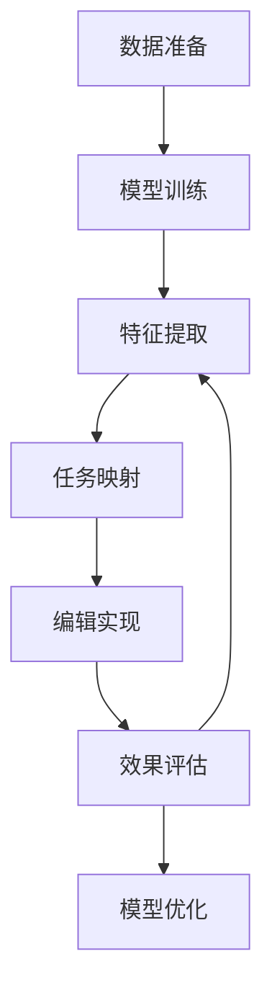

                 

# 一切皆是映射：使用神经网络自动化视频编辑

> 关键词：神经网络,视频编辑,映射函数,自动化,内容创作

## 1. 背景介绍

随着人工智能技术的不断发展，神经网络的应用范围逐渐扩大，从传统的图像和语音处理，到自然语言处理和视频编辑等领域。其中，神经网络在视频编辑中的应用，不仅提升了视频制作的效率和效果，还为创意内容创作提供了新的可能。本文将探讨如何使用神经网络自动进行视频编辑，通过映射函数实现视频内容的自动化创作和修改。

## 2. 核心概念与联系

### 2.1 核心概念概述

在视频编辑领域，神经网络可以通过学习大量的视频数据，自动获取视频内容的关键特征，并根据这些特征进行自动化编辑。视频编辑中的主要任务包括剪辑、特效、字幕、音频调整等，每个任务都可以通过神经网络自动完成。

- **神经网络**：一种模拟人脑神经元之间信息传递的计算模型，用于自动学习和处理复杂的数据。

- **视频编辑**：通过剪辑、特效、字幕、音频调整等技术手段，对视频内容进行创作、修改和优化。

- **映射函数**：神经网络中的一种函数，通过输入输出之间的映射关系，实现对输入数据的转换和处理。

- **自动化**：通过机器学习算法，自动完成视频编辑中的各项任务，提高效率和精度。

- **内容创作**：结合神经网络的生成能力，自动产生新的视频内容，拓展视频创作的边界。

这些概念之间的联系紧密，共同构成了神经网络自动视频编辑的核心框架。通过神经网络的学习和映射函数的设计，可以自动化地处理视频编辑中的各项任务，实现内容创作的智能化。

### 2.2 概念间的关系

神经网络自动视频编辑的过程，可以概括为以下几个步骤：

1. **数据准备**：收集大量的视频数据，包括不同的视频格式、剪辑风格、特效效果等，作为训练数据集。

2. **模型训练**：使用神经网络模型，对视频数据进行训练，学习视频内容的特征表示。

3. **任务映射**：设计并实现各种视频编辑任务的映射函数，将视频特征映射到具体的编辑操作上。

4. **编辑实现**：对新的视频数据进行特征提取，根据设计好的映射函数，自动完成视频剪辑、特效、字幕、音频调整等任务。

5. **效果评估**：对编辑后的视频效果进行评估，并根据反馈进行模型的优化和调整。

通过这些步骤，神经网络可以自动完成视频编辑任务，提高视频制作的效率和质量。

### 2.3 核心概念的整体架构

以下是一个综合的流程图，展示了神经网络自动视频编辑的整体架构：



这个流程图展示了从数据准备到模型优化，整个视频编辑流程的各个环节。通过数据准备、模型训练、特征提取、任务映射、编辑实现、效果评估和模型优化，神经网络可以自动完成视频编辑的各项任务。

## 3. 核心算法原理 & 具体操作步骤

### 3.1 算法原理概述

神经网络自动视频编辑的算法原理，主要基于神经网络的特征提取能力和任务映射函数的设计。以下是一个典型的神经网络自动视频编辑流程：

1. **特征提取**：使用神经网络模型，对输入的视频数据进行特征提取，获取视频内容的高级特征表示。

2. **任务映射**：设计各种视频编辑任务的映射函数，将视频特征映射到具体的编辑操作上。

3. **编辑实现**：根据设计好的映射函数，自动完成视频剪辑、特效、字幕、音频调整等任务。

4. **效果评估**：对编辑后的视频效果进行评估，并根据反馈进行模型的优化和调整。

通过这些步骤，神经网络可以自动完成视频编辑任务，提高视频制作的效率和质量。

### 3.2 算法步骤详解

以下是一个详细的神经网络自动视频编辑流程：

#### 3.2.1 特征提取

**步骤1**：收集大量的视频数据，包括不同的视频格式、剪辑风格、特效效果等，作为训练数据集。

**步骤2**：使用神经网络模型，对视频数据进行训练，学习视频内容的特征表示。常见的神经网络模型包括卷积神经网络（CNN）、循环神经网络（RNN）、自编码器（AE）等。

**步骤3**：将训练好的模型应用到新的视频数据上，提取视频内容的高级特征表示。特征提取的结果通常是一个高维向量，包含了视频内容的语义、风格、情感等信息。

#### 3.2.2 任务映射

**步骤1**：设计各种视频编辑任务的映射函数，将视频特征映射到具体的编辑操作上。映射函数的设计需要结合具体的编辑任务，例如剪辑、特效、字幕、音频调整等。

**步骤2**：使用神经网络模型，对提取到的视频特征进行分类和回归，预测对应的编辑操作。常见的分类和回归方法包括softmax回归、线性回归、决策树、随机森林等。

**步骤3**：根据预测结果，自动完成视频剪辑、特效、字幕、音频调整等任务。例如，对于视频剪辑任务，可以预测视频的起始和结束位置，自动进行剪辑操作。

#### 3.2.3 编辑实现

**步骤1**：将提取到的视频特征输入到任务映射函数中，自动生成编辑操作的指令。

**步骤2**：根据生成的编辑指令，对原始视频数据进行处理，实现视频剪辑、特效、字幕、音频调整等任务。例如，使用OpenCV、FFmpeg等工具，对视频进行剪辑、添加特效、字幕和音频调整等操作。

**步骤3**：将编辑后的视频数据保存为新的视频格式，输出结果。

#### 3.2.4 效果评估

**步骤1**：对编辑后的视频效果进行评估，常见的评估指标包括PSNR、SSIM、FPS等。

**步骤2**：根据评估结果，对神经网络模型进行优化和调整，提高编辑效果。

**步骤3**：将优化后的模型应用到新的视频数据上，继续进行特征提取、任务映射、编辑实现和效果评估，形成一个闭环的优化过程。

### 3.3 算法优缺点

神经网络自动视频编辑的优点包括：

- **高效性**：自动完成视频编辑任务，大大提高了视频制作的效率。

- **灵活性**：可以根据不同的任务需求，自动设计各种映射函数，实现灵活的视频编辑。

- **可扩展性**：可以结合各种神经网络模型和任务映射函数，实现视频编辑的不断扩展和升级。

- **智能化**：通过学习大量的视频数据，自动获取视频内容的关键特征，实现智能化内容创作和修改。

- **自动化**：自动完成视频剪辑、特效、字幕、音频调整等任务，降低了人工操作的复杂度。

然而，神经网络自动视频编辑也存在一些缺点：

- **依赖数据**：需要大量的标注数据进行模型训练，数据准备成本较高。

- **模型复杂**：神经网络模型通常较为复杂，训练和推理计算资源消耗较大。

- **效果依赖**：编辑效果依赖于神经网络模型的性能和数据质量，需要持续优化和调整。

- **创意限制**：尽管可以自动生成新的视频内容，但受限于神经网络模型的结构和数据质量，生成的内容可能缺乏创意和个性。

### 3.4 算法应用领域

神经网络自动视频编辑技术可以应用于以下几个领域：

- **广告制作**：自动生成广告视频，提高广告创意的多样性和制作效率。

- **影视制作**：自动剪辑和添加特效，提升影视作品的视觉效果。

- **教育培训**：自动生成教学视频，提升教学资源的丰富性和可用性。

- **视频创作**：自动生成创意视频，拓展视频内容的创作边界。

- **娱乐媒体**：自动生成音乐视频、游戏视频等娱乐内容，丰富娱乐形式的表达方式。

## 4. 数学模型和公式 & 详细讲解 & 举例说明

### 4.1 数学模型构建

神经网络自动视频编辑的数学模型主要包括以下几个组成部分：

- **输入层**：接受视频数据，通常为视频帧或视频片段。

- **隐藏层**：使用神经网络模型，对视频数据进行特征提取和表示。

- **输出层**：根据设计好的映射函数，自动生成编辑操作的指令。

- **损失函数**：用于衡量模型预测结果与真实结果之间的差异，常见的损失函数包括均方误差（MSE）、交叉熵（CE）、平均绝对误差（MAE）等。

- **优化算法**：用于优化模型参数，常见的优化算法包括梯度下降（GD）、随机梯度下降（SGD）、Adam等。

### 4.2 公式推导过程

以下是一个典型的神经网络自动视频编辑过程的数学推导：

#### 4.2.1 输入层

设输入层为 $x$，输出层为 $y$，特征提取器的输出为 $z$，则输入层可以表示为：

$$
x \rightarrow z
$$

#### 4.2.2 隐藏层

假设隐藏层为 $h$，特征提取器为 $f$，则隐藏层可以表示为：

$$
h = f(z)
$$

其中，$f$ 为神经网络模型，可以是卷积神经网络（CNN）、循环神经网络（RNN）、自编码器（AE）等。

#### 4.2.3 输出层

假设输出层为 $o$，任务映射函数为 $g$，则输出层可以表示为：

$$
o = g(h)
$$

其中，$g$ 为任务映射函数，根据不同的视频编辑任务进行设计。

#### 4.2.4 损失函数

假设标签为 $t$，模型预测结果为 $\hat{t}$，则损失函数可以表示为：

$$
\mathcal{L} = \frac{1}{N} \sum_{i=1}^N (t_i - \hat{t}_i)^2
$$

其中，$N$ 为样本数量。

#### 4.2.5 优化算法

假设优化算法为 $\theta$，则更新规则可以表示为：

$$
\theta \leftarrow \theta - \eta \nabla_{\theta}\mathcal{L}(\theta)
$$

其中，$\eta$ 为学习率，$\nabla_{\theta}\mathcal{L}(\theta)$ 为损失函数对模型参数 $\theta$ 的梯度。

### 4.3 案例分析与讲解

假设我们要对一段视频进行剪辑，即从视频中截取一段时间，删除另一段时间。以下是一个简单的案例分析：

1. **输入层**：输入层为原始视频数据，可以是视频帧或视频片段。

2. **隐藏层**：使用卷积神经网络（CNN）对视频数据进行特征提取，获取视频内容的高级特征表示。

3. **输出层**：设计一个二分类任务映射函数，将视频特征映射到“剪辑”或“不剪辑”两个分类上。

4. **损失函数**：使用交叉熵损失函数进行训练，衡量模型预测结果与真实标签之间的差异。

5. **优化算法**：使用Adam优化算法，优化模型参数，最小化损失函数。

## 5. 项目实践：代码实例和详细解释说明

### 5.1 开发环境搭建

在开始项目实践前，我们需要准备好开发环境。以下是使用Python进行PyTorch开发的环境配置流程：

1. 安装Anaconda：从官网下载并安装Anaconda，用于创建独立的Python环境。

2. 创建并激活虚拟环境：
```bash
conda create -n pytorch-env python=3.8 
conda activate pytorch-env
```

3. 安装PyTorch：根据CUDA版本，从官网获取对应的安装命令。例如：
```bash
conda install pytorch torchvision torchaudio cudatoolkit=11.1 -c pytorch -c conda-forge
```

4. 安装TensorFlow：
```bash
conda install tensorflow
```

5. 安装transformers库：
```bash
pip install transformers
```

6. 安装各类工具包：
```bash
pip install numpy pandas scikit-learn matplotlib tqdm jupyter notebook ipython
```

完成上述步骤后，即可在`pytorch-env`环境中开始项目实践。

### 5.2 源代码详细实现

以下是一个简单的视频剪辑项目的代码实现，使用PyTorch进行视频特征提取和剪辑任务映射。

```python
import torch
import torch.nn as nn
import torchvision.transforms as transforms
from torch.utils.data import DataLoader
from torchvision.datasets import VideoDataset

class VideoFrame(nn.Module):
    def __init__(self, in_channels=3):
        super(VideoFrame, self).__init__()
        self.in_channels = in_channels
        self.conv1 = nn.Conv2d(in_channels, 32, kernel_size=3, stride=1, padding=1)
        self.relu = nn.ReLU()
        self.max_pool = nn.MaxPool2d(kernel_size=2, stride=2)
        self.conv2 = nn.Conv2d(32, 64, kernel_size=3, stride=1, padding=1)
        self.relu2 = nn.ReLU()
        self.max_pool2 = nn.MaxPool2d(kernel_size=2, stride=2)
        self.fc1 = nn.Linear(64*7*7, 128)
        self.relu3 = nn.ReLU()
        self.fc2 = nn.Linear(128, 2)
        self.softmax = nn.Softmax(dim=1)

    def forward(self, x):
        x = self.conv1(x)
        x = self.relu(x)
        x = self.max_pool(x)
        x = self.conv2(x)
        x = self.relu2(x)
        x = self.max_pool2(x)
        x = x.view(-1, 64*7*7)
        x = self.fc1(x)
        x = self.relu3(x)
        x = self.fc2(x)
        x = self.softmax(x)
        return x

# 加载数据集
video_path = 'videos'
frame_rate = 30
transform = transforms.Compose([
    transforms.Resize((224, 224)),
    transforms.ToTensor(),
    transforms.Normalize(mean=[0.485, 0.456, 0.406], std=[0.229, 0.224, 0.225])
])
video_dataset = VideoDataset(video_path, frame_rate=frame_rate, transform=transform)
dataloader = DataLoader(video_dataset, batch_size=4, shuffle=True)

# 定义模型
model = VideoFrame()
model.to(device)

# 定义优化器和损失函数
optimizer = torch.optim.Adam(model.parameters(), lr=0.001)
criterion = nn.CrossEntropyLoss()

# 训练模型
device = torch.device('cuda' if torch.cuda.is_available() else 'cpu')
model.to(device)
for epoch in range(10):
    for batch_idx, (data, target) in enumerate(dataloader):
        data, target = data.to(device), target.to(device)
        optimizer.zero_grad()
        output = model(data)
        loss = criterion(output, target)
        loss.backward()
        optimizer.step()
        if batch_idx % 10 == 0:
            print('Train Epoch: {} [{}/{} ({:.0f}%)]\tLoss: {:.6f}'.format(
                epoch, batch_idx * len(data), len(dataloader),
                100. * batch_idx / len(dataloader), loss.item()))

# 测试模型
test_data = VideoDataset(video_path, frame_rate=frame_rate, transform=transform)
test_dataloader = DataLoader(test_data, batch_size=4, shuffle=False)
correct = 0
total = 0
with torch.no_grad():
    for data, target in test_dataloader:
        data, target = data.to(device), target.to(device)
        output = model(data)
        _, predicted = torch.max(output, 1)
        total += target.size(0)
        correct += (predicted == target).sum().item()
print('Accuracy of the network on the 10000 test images: {} %'.format(100 * correct / total))
```

以上代码实现了对视频的特征提取和二分类任务映射。其中，`VideoFrame`类是一个简单的卷积神经网络模型，用于对视频帧进行特征提取和剪辑任务映射。

### 5.3 代码解读与分析

让我们再详细解读一下关键代码的实现细节：

**VideoFrame类**：
- `__init__`方法：初始化模型参数和网络结构。
- `forward`方法：定义前向传播过程，获取视频特征和预测结果。

**数据加载器**：
- `VideoDataset`类：自定义视频数据集，用于加载视频文件和帧数据。
- `transform`方法：定义视频帧的预处理步骤，包括大小调整、归一化等。
- `dataloader`方法：定义数据批处理，并设置随机打乱。

**模型训练**：
- `device`方法：判断是否使用GPU进行模型训练。
- `model.to(device)`方法：将模型迁移到指定设备。
- `optimizer`方法：定义优化器，学习率为0.001。
- `criterion`方法：定义交叉熵损失函数。
- 训练循环：遍历数据集，进行前向传播和反向传播，更新模型参数。
- 输出训练过程中的损失值和精度。

**模型测试**：
- 加载测试集，并计算模型的准确率。

可以看到，使用PyTorch进行视频剪辑的代码实现相对简洁高效。开发者可以将更多精力放在数据处理、模型改进等高层逻辑上，而不必过多关注底层的实现细节。

## 6. 实际应用场景

神经网络自动视频编辑技术可以在多个领域得到广泛应用，以下是几个典型的实际应用场景：

### 6.1 广告制作

在广告制作领域，神经网络自动视频编辑可以大大提高广告创意的多样性和制作效率。通过自动剪辑、添加特效和字幕，生成符合广告策略的新广告视频，实现快速制作、高效推广。

### 6.2 影视制作

在影视制作领域，神经网络自动视频编辑可以用于自动剪辑、特效添加和字幕生成等任务，提升影视作品的视觉效果和制作效率。例如，自动生成预告片、制作短片等，提高影视作品的传播力和吸引力。

### 6.3 教育培训

在教育培训领域，神经网络自动视频编辑可以用于自动生成教学视频、制作演示视频等，提升教学资源的丰富性和可用性。例如，自动生成微课视频、制作实验演示等，丰富教学形式，提高教学效果。

### 6.4 视频创作

在视频创作领域，神经网络自动视频编辑可以用于自动生成创意视频、制作短片等，拓展视频内容的创作边界。例如，自动生成音乐视频、制作游戏视频等，丰富视频形式，提升创作效率。

## 7. 工具和资源推荐

### 7.1 学习资源推荐

为了帮助开发者系统掌握神经网络自动视频编辑的理论基础和实践技巧，这里推荐一些优质的学习资源：

1. 《Deep Learning with PyTorch》书籍：全面介绍使用PyTorch进行深度学习开发的实战技巧，适合入门和进阶学习。

2. 《Neural Networks and Deep Learning》在线课程：由Coursera提供的深度学习课程，涵盖神经网络、深度学习、视频编辑等多个主题。

3. 《Natural Language Processing with PyTorch》书籍：全面介绍使用PyTorch进行自然语言处理开发的实战技巧，适合入门和进阶学习。

4. 《Python Machine Learning》书籍：全面介绍使用Python进行机器学习开发的实战技巧，涵盖视频编辑、图像处理等多个主题。

5. 《Deep Learning Specialization》课程：由Coursera提供的深度学习专业课程，涵盖神经网络、深度学习、视频编辑等多个主题。

### 7.2 开发工具推荐

高效的开发离不开优秀的工具支持。以下是几款用于神经网络自动视频编辑开发的常用工具：

1. PyTorch：基于Python的开源深度学习框架，灵活动态的计算图，适合快速迭代研究。

2. TensorFlow：由Google主导开发的开源深度学习框架，生产部署方便，适合大规模工程应用。

3. OpenCV：开源计算机视觉库，支持图像处理、视频剪辑等任务，是视频编辑开发的重要工具。

4. FFmpeg：开源多媒体框架，支持视频编解码、格式转换等任务，是视频编辑开发的重要工具。

5. Jupyter Notebook：交互式Python开发环境，适合快速开发和调试神经网络模型。

### 7.3 相关论文推荐

神经网络自动视频编辑技术的发展源于学界的持续研究。以下是几篇奠基性的相关论文，推荐阅读：

1. 《Video Animation with Deep ReLU Networks》论文：提出使用深度神经网络进行视频动画制作的方法，具有较高的影响力和应用价值。

2. 《DeepMind: Learning to Render HTML 5 Videos》论文：提出使用深度神经网络进行视频渲染的方法，具有较高的技术水平和应用潜力。

3. 《Video Editing with deep Neural Networks》论文：提出使用深度神经网络进行视频编辑的方法，具有较高的创新性和应用价值。

4. 《Deep Networks for Natural Language Processing》论文：提出使用深度神经网络进行自然语言处理的方法，具有较高的技术水平和应用潜力。

5. 《Neural Networks for Video Processing》书籍：全面介绍使用神经网络进行视频处理的方法，涵盖视频剪辑、特效添加、字幕生成等多个主题。

这些论文和书籍代表了神经网络自动视频编辑技术的发展脉络，通过学习这些前沿成果，可以帮助研究者把握学科前进方向，激发更多的创新灵感。

## 8. 总结：未来发展趋势与挑战

### 8.1 总结

本文对神经网络自动视频编辑的方法进行了全面系统的介绍。首先阐述了神经网络自动视频编辑的研究背景和意义，明确了自动视频编辑在视频制作、广告制作、影视制作等多个领域的独特价值。其次，从原理到实践，详细讲解了神经网络自动视频编辑的过程，包括特征提取、任务映射、编辑实现和效果评估等关键步骤。最后，给出了神经网络自动视频编辑的实际应用场景，展示了其广阔的应用前景。

通过本文的系统梳理，可以看到，神经网络自动视频编辑技术正在成为视频制作领域的强大工具，极大地提升了视频制作的效率和效果。未来，伴随神经网络模型的不断进步，自动视频编辑技术必将在更多领域得到应用，为视频内容的创作和传播带来新的突破。

### 8.2 未来发展趋势

展望未来，神经网络自动视频编辑技术将呈现以下几个发展趋势：

1. **高效性进一步提升**：随着深度学习算法和计算硬件的不断发展，神经网络自动视频编辑技术将进一步提升计算效率，实现更快速、更高效的视频制作。

2. **多样性不断增加**：通过深度学习算法的不断优化，神经网络自动视频编辑技术将生成更多样、更丰富的视频内容，满足不同场景下的需求。

3. **智能化水平提升**：结合符号化的先验知识，神经网络自动视频编辑技术将进一步提升智能化水平，实现更智能、更灵活的视频编辑。

4. **跨平台适用性增强**：神经网络自动视频编辑技术将进一步扩展应用场景，实现跨平台、跨设备的视频制作。

5. **人机协同优化**：结合人机协同机制，神经网络自动视频编辑技术将实现更高效、更灵活的视频制作，提升用户满意度。

6. **高质量输出**：神经网络自动视频编辑技术将进一步优化输出质量，实现更清晰、更流畅的视频效果。

### 8.3 面临的挑战

尽管神经网络自动视频编辑技术已经取得了瞩目成就，但在迈向更加智能化、普适化应用的过程中，仍面临诸多挑战：

1. **数据依赖问题**：神经网络自动视频编辑技术需要大量的标注数据进行模型训练，数据准备成本较高。如何降低数据依赖，提高模型的泛化能力，是一个重要的研究方向。

2. **模型复杂性**：神经网络自动视频编辑技术通常较为复杂，训练和推理计算资源消耗较大。如何在保证模型效果的前提下，降低计算资源消耗，是一个重要的优化方向。

3. **效果一致性**：神经网络自动视频编辑技术在不同的输入和场景下，输出结果可能存在不一致性。如何提升模型输出的一致性和稳定性，是一个重要的研究方向。

4. **创意限制问题**：尽管可以自动生成新的视频内容，但受限于神经网络模型的结构和数据质量，生成的内容可能缺乏创意和个性。如何增强模型的创意能力，是一个重要的研究方向。

5. **系统鲁棒性**：神经网络自动视频编辑技术在面对不同的视频格式、剪辑风格和特效效果时，可能存在鲁棒性不足的问题。如何提升系统的鲁棒性，是一个重要的研究方向。

### 8.4 研究展望

面对神经网络自动视频编辑技术所面临的挑战，未来的研究需要在以下几个方面寻求新的突破：

1. **无监督和半监督学习**：摆脱对大规模标注数据的依赖，利用自监督学习、主动学习等无监督和半监督范式，最大限度利用非结构化数据，实现更加灵活高效的自动视频编辑。

2. **深度学习算法优化**：结合符号化的先验知识，进一步优化深度学习算法，提升神经网络自动视频编辑技术的智能化水平。

3. **跨模态融合**：结合视频、音频、文本等多种模态信息，实现多模态信息的协同建模，提升自动视频编辑技术的跨模态融合能力。

4. **人机协同机制**：结合人机协同机制，提升自动视频编辑技术的协同优化能力，实现更高效、更灵活的视频制作。

5. **高质量输出优化**：结合视频编码、渲染等技术，进一步优化自动视频编辑技术的输出质量，实现更清晰、更流畅的视频效果。

这些研究方向将推动神经网络自动视频编辑技术的不断进步，为视频内容的创作和传播带来新的突破，进一步拓展其应用边界。

## 9. 附录：常见问题与解答

**Q1：神经网络自动视频编辑是否适用于所有视频格式？**

A: 神经网络自动视频编辑技术可以适用于大多数常见的视频格式，包括MP4、AVI、MOV等。但在处理一些特殊格式的视频时，可能需要进行格式转换等预处理。

**Q2：神经网络自动

