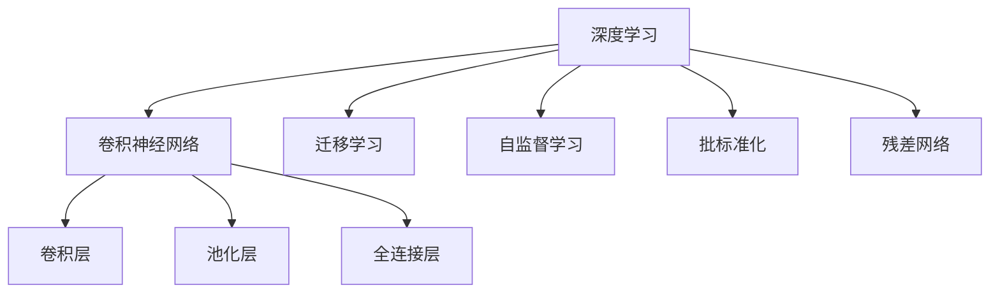
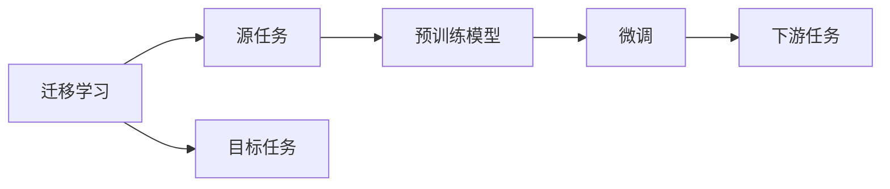
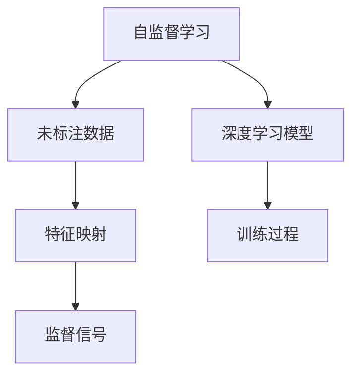
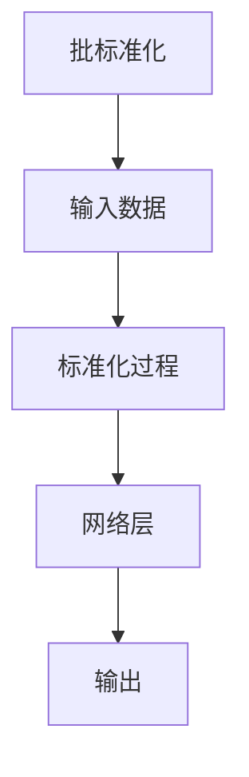
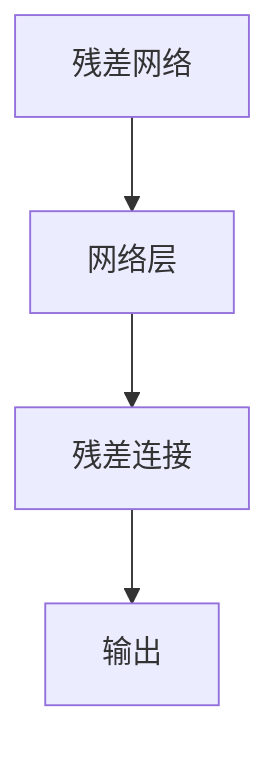
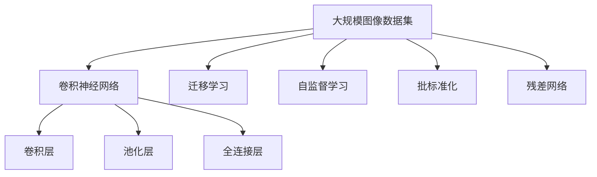

                 

# 一切皆是映射：大规模图像数据集上的深度学习

> 关键词：深度学习,大规模图像数据集,特征映射,卷积神经网络,卷积层,池化层,残差网络,批标准化,迁移学习

## 1. 背景介绍

### 1.1 问题由来
随着深度学习技术的快速发展，尤其是卷积神经网络(Convolutional Neural Networks, CNNs)的诞生，图像识别和计算机视觉领域取得了巨大突破。然而，传统的CNNs往往需要大量的标注数据进行训练，这对于高成本的标注任务来说是一个重大挑战。近年来，深度学习技术在无监督学习和迁移学习方面的进展，使得在大规模无标签数据集上进行特征提取和迁移学习成为可能，这在一定程度上缓解了数据标注的瓶颈问题。

### 1.2 问题核心关键点
目前，深度学习在大规模图像数据集上的特征提取和迁移学习主要依赖于卷积神经网络(CNNs)。CNNs通过卷积层、池化层和全连接层等组件，对图像数据进行特征提取和分类。常见的CNN模型包括LeNet、AlexNet、VGGNet、ResNet、InceptionNet等，它们在ImageNet等大规模图像数据集上的性能已经接近人类水平。

CNNs的核心思想是通过卷积层对输入图像进行特征提取，通过池化层对特征进行降维，最后通过全连接层进行分类。卷积层通过滤波器对图像进行卷积操作，提取出局部特征。池化层对卷积层输出的特征图进行降维，减少计算量并增强特征的鲁棒性。全连接层则将池化层输出的特征图进行扁平化，再通过多个全连接层进行分类。

CNNs的迁移学习能力依赖于其在大规模数据集上学习到的通用特征。通过迁移学习，可以将在大规模数据集上预训练得到的模型迁移到小规模数据集上进行微调，从而提升模型在小样本情况下的性能。

### 1.3 问题研究意义
研究基于大规模图像数据集的深度学习特征提取和迁移学习，对于拓展深度学习技术的应用范围，提升计算机视觉任务的性能，加速图像处理和分析技术的产业化进程，具有重要意义：

1. 降低应用开发成本。通过大规模无标签数据的迁移学习，可以显著减少标注数据的需求，降低开发和部署成本。
2. 提升模型效果。迁移学习使得通用深度学习模型更好地适应特定任务，在应用场景中取得更优表现。
3. 加速开发进度。利用预训练的深度学习模型，可以加快新应用的开发速度，缩短项目周期。
4. 带来技术创新。迁移学习促进了对深度学习的深入研究，催生了迁移学习、自监督学习等新的研究方向。
5. 赋能产业升级。深度学习技术在计算机视觉领域的普及和应用，为传统行业数字化转型升级提供了新的技术路径。

## 2. 核心概念与联系

### 2.1 核心概念概述

为更好地理解基于大规模图像数据集的深度学习特征提取和迁移学习方法，本节将介绍几个密切相关的核心概念：

- 深度学习(Deep Learning)：指通过多层神经网络模型进行复杂任务学习的技术，包括卷积神经网络(CNNs)、循环神经网络(RNNs)等。
- 卷积神经网络(CNN)：一种特殊的神经网络结构，主要应用于图像和视频处理任务，通过卷积层和池化层等组件进行特征提取。
- 特征映射(Feature Mapping)：指深度学习模型对输入数据进行特征提取，形成高维特征表示的过程。
- 卷积层(Convolutional Layer)：CNNs中的关键组件，通过滤波器对输入图像进行卷积操作，提取局部特征。
- 池化层(Pooling Layer)：对卷积层输出的特征图进行降维，减少计算量并增强特征的鲁棒性。
- 全连接层(Fully Connected Layer)：将池化层输出的特征图进行扁平化，再通过多个全连接层进行分类。
- 迁移学习(Transfer Learning)：指将在一个任务上预训练得到的模型迁移到另一个相关任务上进行微调，以提高模型的泛化能力。
- 自监督学习(Self-Supervised Learning)：利用未标注数据的特征进行自监督学习，自动生成监督信号，训练深度学习模型。
- 批标准化(Batch Normalization)：通过标准化输入数据的分布，加速深度学习模型的训练，提高模型鲁棒性和泛化能力。
- 残差网络(ResNet)：通过残差连接来解决深度网络退化问题，显著提升模型的训练效果和泛化能力。

这些核心概念之间的逻辑关系可以通过以下Mermaid流程图来展示：



这个流程图展示了大规模图像数据集上深度学习的核心概念及其之间的关系：

1. 深度学习通过对输入数据进行多层非线性变换，实现复杂任务的学习。
2. CNNs通过卷积层和池化层提取图像特征，最后通过全连接层进行分类。
3. 迁移学习通过在大规模数据集上预训练模型，提高模型在小样本情况下的性能。
4. 自监督学习通过利用未标注数据进行特征提取，避免标注数据的成本。
5. 批标准化通过规范化输入数据，加速模型训练，提高模型鲁棒性。
6. 残差网络通过残差连接，解决深度网络退化问题，提升模型性能。

这些概念共同构成了大规模图像数据集上深度学习的基础，使得深度学习技术能够在图像识别、视频分析、目标检测等诸多任务上取得卓越表现。

### 2.2 概念间的关系

这些核心概念之间存在着紧密的联系，形成了大规模图像数据集上深度学习的完整生态系统。下面我们通过几个Mermaid流程图来展示这些概念之间的关系。

#### 2.2.1 深度学习范式


这个流程图展示了深度学习的基本范式，包括卷积神经网络、卷积层、池化层、全连接层等组件，以及迁移学习、自监督学习、批标准化、残差网络等技术，这些组件和技术共同构成了深度学习的核心。

#### 2.2.2 迁移学习与深度学习的关系



这个流程图展示了迁移学习的基本原理，以及它与深度学习的联系。迁移学习通过在大规模数据集上预训练模型，然后将其迁移到小规模数据集上进行微调，从而提高模型在特定任务上的性能。

#### 2.2.3 自监督学习与深度学习的关系



这个流程图展示了自监督学习的基本流程，以及它与深度学习的联系。自监督学习通过利用未标注数据进行特征提取，然后自动生成监督信号，训练深度学习模型。

#### 2.2.4 批标准化与深度学习的关系



这个流程图展示了批标准化的基本流程，以及它与深度学习的联系。批标准化通过对输入数据进行标准化，加速深度学习模型的训练，提高模型的鲁棒性和泛化能力。

#### 2.2.5 残差网络与深度学习的关系



这个流程图展示了残差网络的基本流程，以及它与深度学习的联系。残差网络通过残差连接解决深度网络退化问题，显著提升模型的训练效果和泛化能力。

### 2.3 核心概念的整体架构

最后，我们用一个综合的流程图来展示这些核心概念在大规模图像数据集上深度学习的整体架构：



这个综合流程图展示了从大规模图像数据集到卷积神经网络的完整过程。深度学习通过卷积神经网络对图像数据进行特征提取和分类，迁移学习通过在大规模数据集上预训练模型，自监督学习通过利用未标注数据进行特征提取，批标准化和残差网络则进一步优化深度学习模型的训练和性能。

## 3. 核心算法原理 & 具体操作步骤
### 3.1 算法原理概述

基于大规模图像数据集的深度学习特征提取和迁移学习，本质上是一个复杂的机器学习过程。其核心思想是：通过深度学习模型对大规模图像数据集进行特征提取，形成高维特征表示，然后通过迁移学习将在大规模数据集上预训练得到的模型迁移到小规模数据集上进行微调，以提高模型在特定任务上的性能。

形式化地，假设深度学习模型为 $M_{\theta}$，其中 $\theta$ 为模型参数。给定大规模图像数据集 $D=\{(x_i, y_i)\}_{i=1}^N$，迁移学习的目标是最小化经验风险，即找到最优参数：

$$
\theta^* = \mathop{\arg\min}_{\theta} \mathcal{L}(M_{\theta},D)
$$

其中 $\mathcal{L}$ 为针对任务 $T$ 设计的损失函数，用于衡量模型预测输出与真实标签之间的差异。常见的损失函数包括交叉熵损失、均方误差损失等。

通过梯度下降等优化算法，迁移学习过程不断更新模型参数 $\theta$，最小化损失函数 $\mathcal{L}$，使得模型输出逼近真实标签。由于 $\theta$ 已经通过在大规模数据集上进行预训练获得了较好的初始化，因此即便在小规模数据集上进行迁移学习，也能较快收敛到理想的模型参数 $\hat{\theta}$。

### 3.2 算法步骤详解

基于大规模图像数据集的深度学习特征提取和迁移学习一般包括以下几个关键步骤：

**Step 1: 准备预训练模型和数据集**
- 选择合适的深度学习模型 $M_{\theta}$ 作为初始化参数，如 VGG、ResNet、InceptionNet 等。
- 准备大规模图像数据集 $D$，划分为训练集、验证集和测试集。一般要求数据集与预训练数据的分布不要差异过大。

**Step 2: 添加任务适配层**
- 根据任务类型，在预训练模型顶层设计合适的输出层和损失函数。
- 对于分类任务，通常在顶层添加分类器，使用交叉熵损失函数。
- 对于回归任务，通常使用均方误差损失函数。

**Step 3: 设置迁移超参数**
- 选择合适的优化算法及其参数，如 Adam、SGD 等，设置学习率、批大小、迭代轮数等。
- 设置正则化技术及强度，包括权重衰减、Dropout、Early Stopping 等。
- 确定冻结预训练参数的策略，如仅微调顶层，或全部参数都参与迁移学习。

**Step 4: 执行迁移学习**
- 将训练集数据分批次输入模型，前向传播计算损失函数。
- 反向传播计算参数梯度，根据设定的优化算法和学习率更新模型参数。
- 周期性在验证集上评估模型性能，根据性能指标决定是否触发 Early Stopping。
- 重复上述步骤直到满足预设的迭代轮数或 Early Stopping 条件。

**Step 5: 测试和部署**
- 在测试集上评估迁移学习后模型 $M_{\hat{\theta}}$ 的性能，对比迁移学习前后的精度提升。
- 使用迁移学习后的模型对新样本进行推理预测，集成到实际的应用系统中。
- 持续收集新的数据，定期重新迁移学习模型，以适应数据分布的变化。

以上是基于大规模图像数据集的深度学习特征提取和迁移学习的一般流程。在实际应用中，还需要针对具体任务的特点，对迁移学习过程的各个环节进行优化设计，如改进训练目标函数，引入更多的正则化技术，搜索最优的超参数组合等，以进一步提升模型性能。

### 3.3 算法优缺点

基于大规模图像数据集的深度学习迁移学习具有以下优点：

1. 简单高效。只需准备少量标注数据，即可对预训练模型进行快速适配，获得较大的性能提升。
2. 通用适用。适用于各种计算机视觉任务，包括分类、检测、分割等，设计简单的任务适配层即可实现迁移学习。
3. 参数高效。利用迁移学习技术，在固定大部分预训练参数的情况下，仍可取得不错的性能提升。
4. 效果显著。在学术界和工业界的诸多任务上，迁移学习已经刷新了多项深度学习模型的性能指标。

同时，该方法也存在一定的局限性：

1. 依赖大规模数据集。迁移学习的效果很大程度上取决于数据集的质量和数量，获取高质量数据集的成本较高。
2. 迁移能力有限。当目标任务与预训练数据的分布差异较大时，迁移学习的性能提升有限。
3. 负面效果传递。预训练模型的固有偏见、有害信息等，可能通过迁移学习传递到下游任务，造成负面影响。
4. 可解释性不足。迁移学习模型通常缺乏可解释性，难以对其推理逻辑进行分析和调试。

尽管存在这些局限性，但就目前而言，基于大规模图像数据集的深度学习迁移学习仍是最主流的方法。未来相关研究的重点在于如何进一步降低迁移学习对标注数据的依赖，提高模型的少样本学习和跨领域迁移能力，同时兼顾可解释性和伦理安全性等因素。

### 3.4 算法应用领域

基于深度学习的迁移学习方法在计算机视觉领域已经得到了广泛的应用，覆盖了几乎所有常见任务，例如：

- 图像分类：如猫狗识别、物体识别、场景分类等。通过迁移学习使模型学习图像-类别映射。
- 目标检测：如人脸检测、车辆检测、物体定位等。通过迁移学习使模型学习物体-边界框映射。
- 图像分割：如语义分割、实例分割、全景分割等。通过迁移学习使模型学习图像-像素映射。
- 姿态估计：如人体姿态估计、手部姿态估计等。通过迁移学习使模型学习姿态-关节点映射。
- 图像生成：如图像修复、图像超分辨率、风格迁移等。通过迁移学习使模型学习图像-图像映射。

除了上述这些经典任务外，迁移学习还被创新性地应用到更多场景中，如可控图像生成、三维重建、图像增强等，为计算机视觉技术带来了全新的突破。随着深度学习模型的不断进步，相信迁移学习在更广阔的应用领域将大放异彩。

## 4. 数学模型和公式 & 详细讲解  
### 4.1 数学模型构建

本节将使用数学语言对基于大规模图像数据集的深度学习迁移学习过程进行更加严格的刻画。

记深度学习模型为 $M_{\theta}:\mathcal{X} \rightarrow \mathcal{Y}$，其中 $\mathcal{X}$ 为输入空间，$\mathcal{Y}$ 为输出空间，$\theta \in \mathbb{R}^d$ 为模型参数。假设迁移学习的训练集为 $D=\{(x_i,y_i)\}_{i=1}^N, x_i \in \mathcal{X}, y_i \in \mathcal{Y}$。

定义模型 $M_{\theta}$ 在数据样本 $(x,y)$ 上的损失函数为 $\ell(M_{\theta}(x),y)$，则在数据集 $D$ 上的经验风险为：

$$
\mathcal{L}(\theta) = \frac{1}{N} \sum_{i=1}^N \ell(M_{\theta}(x_i),y_i)
$$

迁移学习的优化目标是最小化经验风险，即找到最优参数：

$$
\theta^* = \mathop{\arg\min}_{\theta} \mathcal{L}(\theta)
$$

在实践中，我们通常使用基于梯度的优化算法（如SGD、Adam等）来近似求解上述最优化问题。设 $\eta$ 为学习率，$\lambda$ 为正则化系数，则参数的更新公式为：

$$
\theta \leftarrow \theta - \eta \nabla_{\theta}\mathcal{L}(\theta) - \eta\lambda\theta
$$

其中 $\nabla_{\theta}\mathcal{L}(\theta)$ 为损失函数对参数 $\theta$ 的梯度，可通过反向传播算法高效计算。

### 4.2 公式推导过程

以下我们以图像分类任务为例，推导交叉熵损失函数及其梯度的计算公式。

假设模型 $M_{\theta}$ 在输入 $x$ 上的输出为 $\hat{y}=M_{\theta}(x) \in [0,1]$，表示样本属于正类的概率。真实标签 $y \in \{0,1\}$。则二分类交叉熵损失函数定义为：

$$
\ell(M_{\theta}(x),y) = -[y\log \hat{y} + (1-y)\log (1-\hat{y})]
$$

将其代入经验风险公式，得：

$$
\mathcal{L}(\theta) = -\frac{1}{N}\sum_{i=1}^N [y_i\log M_{\theta}(x_i)+(1-y_i)\log(1-M_{\theta}(x_i))]
$$

根据链式法则，损失函数对参数 $\theta_k$ 的梯度为：

$$
\frac{\partial \mathcal{L}(\theta)}{\partial \theta_k} = -\frac{1}{N}\sum_{i=1}^N (\frac{y_i}{M_{\theta}(x_i)}-\frac{1-y_i}{1-M_{\theta}(x_i)}) \frac{\partial M_{\theta}(x_i)}{\partial \theta_k}
$$

其中 $\frac{\partial M_{\theta}(x_i)}{\partial \theta_k}$ 可进一步递归展开，利用自动微分技术完成计算。

在得到损失函数的梯度后，即可带入参数更新公式，完成模型的迭代优化。重复上述过程直至收敛，最终得到适应下游任务的最优模型参数 $\theta^*$。

## 5. 项目实践：代码实例和详细解释说明
### 5.1 开发环境搭建

在进行迁移学习实践前，我们需要准备好开发环境。以下是使用Python进行PyTorch开发的环境配置流程：

1. 安装Anaconda：从官网下载并安装Anaconda，用于创建独立的Python环境。

2. 创建并激活虚拟环境：
```bash
conda create -n pytorch-env python=3.8 
conda activate pytorch-env
```

3. 安装PyTorch：根据CUDA版本，从官网获取对应的安装命令。例如：
```bash
conda install pytorch torchvision torchaudio cudatoolkit=11.1 -c pytorch -c conda-forge
```

4. 安装各类工具包：
```bash
pip install numpy pandas scikit-learn matplotlib tqdm jupyter notebook ipython
```

完成上述步骤后，即可在`pytorch-env`环境中开始迁移学习实践。

### 5.2 源代码详细实现

这里我们以ImageNet上的图像分类任务为例，给出使用PyTorch对VGG16模型进行迁移学习的PyTorch代码实现。

首先，定义图像分类任务的数据处理函数：

```python
from torch.utils.data import Dataset, DataLoader
from torchvision import transforms
import torch

class ImageNetDataset(Dataset):
    def __init__(self, images, labels, transform=None):
        self.images = images
        self.labels = labels
        self.transform = transform
        
    def __len__(self):
        return len(self.images)
    
    def __getitem__(self, item):
        image = self.images[item]
        label = self.labels[item]
        
        if self.transform:
            image = self.transform(image)
        
        return {'image': image, 
                'label': label}

# 定义数据转换
transform = transforms.Compose([
    transforms.ToTensor(),
    transforms.Normalize([0.485, 0.456, 0.406], [0.229, 0.224, 0.225])
])

# 加载数据
train_dataset = ImageNetDataset(train_images, train_labels, transform=transform)
dev_dataset = ImageNetDataset(dev_images, dev_labels, transform=transform)
test_dataset = ImageNetDataset(test_images, test_labels, transform=transform)
```

然后，定义模型和优化器：

```python
from torchvision import models
import torch.nn as nn
import torch.optim as optim

model = models.vgg16(pretrained=True)

# 去除预训练模型的顶部分类器
model.classifier = nn.Sequential(*list(model.classifier)[:-1])

# 定义迁移学习的目标任务
num_classes = len(train_labels)
model.fc = nn.Linear(model.fc.in_features, num_classes)

optimizer = optim.SGD(model.parameters(), lr=0.001, momentum=0.9, weight_decay=0.0005)
```

接着，定义训练和评估函数：

```python
device = torch.device('cuda') if torch.cuda.is_available() else torch.device('cpu')
model.to(device)

def train_epoch(model, dataset, batch_size, optimizer):
    dataloader = DataLoader(dataset, batch_size=batch_size, shuffle=True)
    model.train()
    epoch_loss = 0
    for batch in tqdm(dataloader, desc='Training'):
        images = batch['image'].to(device)
        labels = batch['label'].to(device)
        model.zero_grad()
        outputs = model(images)
        loss = nn.CrossEntropyLoss()(outputs, labels)
        epoch_loss += loss.item()
        loss.backward()
        optimizer.step()
    return epoch_loss / len(dataloader)

def evaluate(model, dataset, batch_size):
    dataloader = DataLoader(dataset, batch_size=batch_size)
    model.eval()
    correct = 0
    total = 0
    with torch.no_grad():
        for batch in tqdm(dataloader, desc='Evaluating'):
            images = batch['image'].to(device)
            labels = batch['label']
            outputs = model(images)
            _, predicted = torch.max(outputs.data, 1)
            total += labels.size(0)
            correct += (predicted == labels).sum().item()
    
    print('Accuracy on the validation set: {} %'.format(100 * correct / total))

def test(model, dataset, batch_size):
    dataloader = DataLoader(dataset, batch_size=batch_size)
    model.eval()
    correct = 0
    total = 0
    with torch.no_grad():
        for batch in tqdm(dataloader, desc='Testing'):
            images = batch['image'].to(device)
            labels = batch['label']
            outputs = model(images)
            _, predicted = torch.max(outputs.data, 1)
            total += labels.size(0)
            correct += (predicted == labels).sum().item()
    
    print('Accuracy on the test set: {} %'.format(100 * correct / total))
```

最后，启动训练流程并在测试集上评估：

```python
epochs = 10
batch_size = 128

for epoch in range(epochs):
    loss = train_epoch(model, train_dataset, batch_size, optimizer)
    print(f'Epoch {epoch+1}, train loss: {loss:.3f}')
    
    print(f'Epoch {epoch+1}, validation accuracy: {evaluate(dev_dataset, batch_size)}')
    
test(model, test_dataset, batch_size)
```

以上就是使用PyTorch对VGG16模型进行迁移学习的完整代码实现。可以看到，得益于PyTorch的强大封装，我们可以用相对简洁的代码完成VGG16模型的迁移学习。

### 5.3 代码解读与分析

让我们再详细解读一下关键代码的实现细节：

**ImageNetDataset类**：
- `__init__`方法：初始化图像和标签数据，以及数据转换。
- `__len__`方法：返回数据集的样本数量。
- `__getitem__`方法：对单个样本进行处理，将图像输入转换为张量并标准化，返回图像和标签。

**数据转换**：
- `transforms.Compose`方法：定义数据转换流程，包括转换为张量、标准化等操作。

**模型定义**：
- 加载预训练的VGG16模型。
- 通过修改模型顶层，去除原模型顶部的分类器，保留卷积层。
- 在卷积层后添加新的全连接层，用于输出目标任务的类别。

**训练和评估函数**：
- `train_epoch`方法：对数据以批为单位进行迭代，在每个批次上前向传播计算损失并反向传播更新模型参数。
- `evaluate`方法：在验证集上评估模型性能，输出准确率。
- `test`方法：在测试集上评估模型性能，输出准确率。

**训练流程**：
- 定义总的epoch数和batch size，开始循环迭代
- 每个epoch内，先在训练集上训练，输出平均loss
- 在验证

