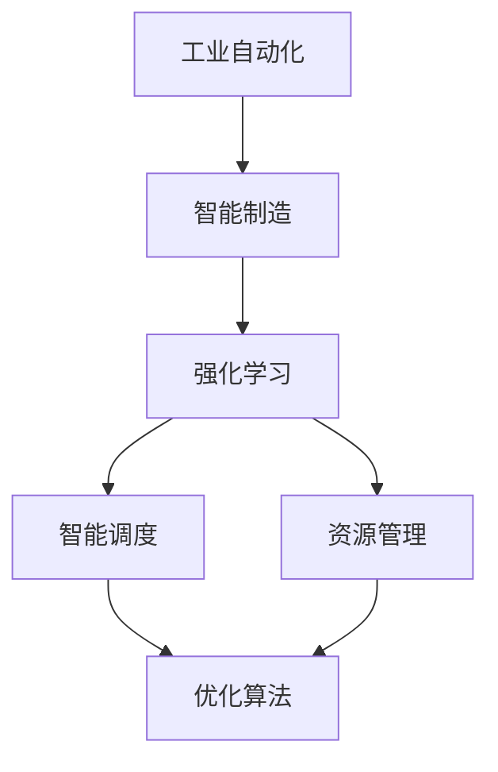
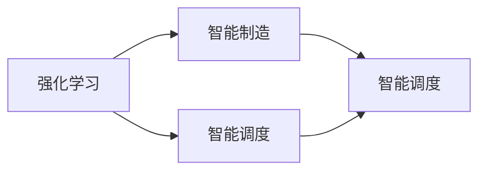
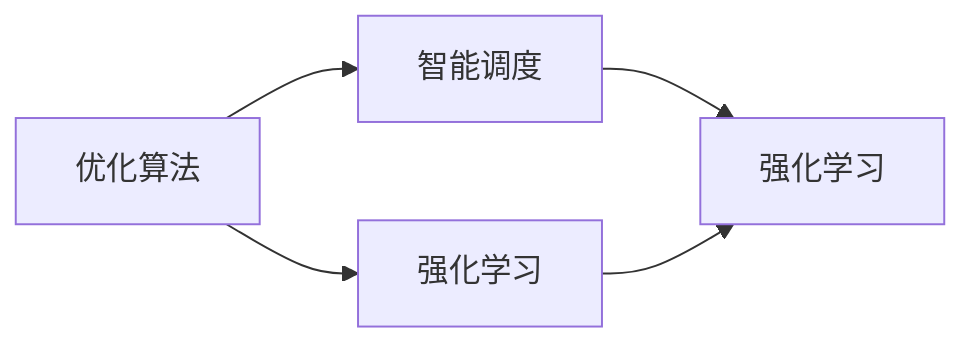
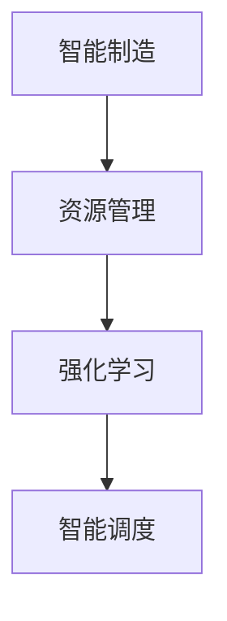
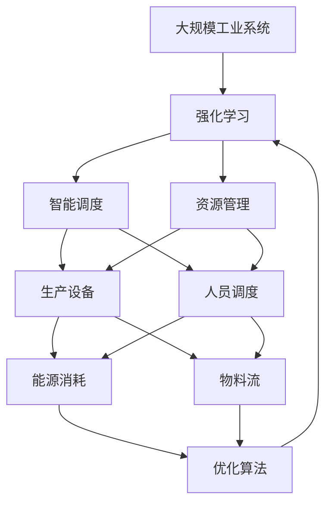

                 

# 一切皆是映射：强化学习在工业自动化中的应用：挑战与机遇

> 关键词：
   - 强化学习
   - 工业自动化
   - 智能制造
   - 自动化控制
   - 优化算法
   - 智能调度
   - 资源管理

## 1. 背景介绍

### 1.1 问题由来
随着人工智能技术的迅猛发展，强化学习（Reinforcement Learning, RL）在多个领域展现了巨大的潜力。特别是在工业自动化和智能制造领域，强化学习的应用逐渐成为热点。工业自动化与智能化转型，不仅有助于提升生产效率、降低运营成本，还能够优化资源配置、提高产品质量。

强化学习结合了机器学习、控制理论、博弈论等多学科知识，通过模拟训练和实际应用，使机器能够在复杂环境中自主学习、智能决策，实现最优控制。与传统的预训练模型不同，强化学习模型能够直接在任务环境中进行学习，更好地适应复杂多变的外部环境。

然而，强化学习在工业自动化中的应用仍面临诸多挑战。一方面，工业环境的复杂性、不确定性、时序性等特点使得强化学习的模型训练和应用变得更加困难。另一方面，工业自动化系统的高安全性、高可靠性和高效能要求，也对强化学习提出了更高的要求。

### 1.2 问题核心关键点
强化学习在工业自动化中的应用涉及以下几个关键问题：
1. 复杂系统的建模：如何准确建模工业系统中的动态特性、不确定因素和交互作用，是强化学习应用的基础。
2. 高维度状态空间：工业系统中的状态空间往往维数极高，如何高效压缩表示、提取关键特征，是强化学习的重要挑战。
3. 连续控制：工业控制系统中，许多决策需要连续控制，即在连续时间空间内进行实时决策，如何实现连续优化控制，是强化学习的难点。
4. 实时性和稳定性：工业系统对实时性和稳定性要求极高，强化学习模型如何在保证性能的同时，满足这些要求，是实际应用的关键。
5. 鲁棒性和泛化能力：工业系统面临复杂的动态变化和干扰，如何提高强化学习模型的鲁棒性和泛化能力，使其在新的场景下依然有效，是重要的研究方向。

### 1.3 问题研究意义
强化学习在工业自动化中的应用，对于推动工业智能化转型、提升制造系统的效率和质量、促进绿色低碳发展具有重要意义。具体而言：

1. **提升生产效率**：强化学习能够优化生产流程、设备调度和资源分配，提升生产线的自动化水平，显著减少人工干预。
2. **降低运营成本**：通过智能调度、资源优化和故障预测，强化学习能够降低能源消耗、减少物料浪费、提高设备利用率。
3. **提高产品质量**：强化学习能够在质量控制、工艺优化和检测等方面提供支持，保证产品的一致性和可靠性。
4. **促进绿色制造**：通过优化资源使用、降低碳排放、实现废弃物最小化，强化学习能够助力实现工业生产的可持续发展。
5. **创新商业模式**：强化学习能够探索新的生产模式和运营策略，如按需生产、个性化定制等，推动制造业向智能制造、柔性制造转型。

## 2. 核心概念与联系

### 2.1 核心概念概述

为了更好地理解强化学习在工业自动化中的应用，本节将介绍几个核心概念及其相互联系：

- **强化学习（Reinforcement Learning, RL）**：强化学习是一种通过与环境交互，智能决策、最大化累积奖励的机器学习方法。强化学习的核心在于，通过试错过程和奖励反馈，学习最优控制策略。

- **工业自动化（Industrial Automation）**：工业自动化是指通过计算机技术和智能设备，实现生产流程的自动化、智能化和数字化。工业自动化包括从设计、生产到物流的全流程自动化控制。

- **智能制造（Intelligent Manufacturing）**：智能制造是工业自动化的高级阶段，通过物联网、大数据、人工智能等技术，实现制造系统的智能化、网络化和协同化。

- **优化算法（Optimization Algorithm）**：优化算法是强化学习中的重要组成部分，用于求解复杂的决策优化问题。常见的优化算法包括梯度下降、遗传算法、粒子群优化等。

- **智能调度（Intelligent Scheduling）**：智能调度是指在工业生产中，通过算法优化生产资源、作业任务和人员配置，实现高效的生产调度。

- **资源管理（Resource Management）**：资源管理是指在工业自动化系统中，对能源、设备、物料等资源进行高效、合理的配置和管理。

这些概念之间的逻辑关系可以通过以下Mermaid流程图来展示：



这个流程图展示了几大核心概念之间的联系：

1. 工业自动化通过智能化转型成为智能制造，其中强化学习扮演了重要角色。
2. 智能制造中的智能调度和资源管理，依赖于强化学习提供的优化算法。
3. 优化算法不仅用于智能调度，也用于资源管理等场景。

### 2.2 概念间的关系

这些核心概念之间存在着紧密的联系，形成了工业自动化中的智能化技术框架。下面我通过几个Mermaid流程图来展示这些概念之间的关系。

#### 2.2.1 强化学习与智能制造



这个流程图展示了强化学习与智能制造之间的关系：

1. 强化学习用于智能调度，提升生产线的自动化水平。
2. 智能制造中的智能调度依赖强化学习提供的优化策略。

#### 2.2.2 优化算法与智能调度



这个流程图展示了优化算法与智能调度之间的关系：

1. 强化学习中的优化算法，用于解决复杂的决策优化问题。
2. 智能调度中的优化算法依赖强化学习提供的决策策略。

#### 2.2.3 智能制造中的资源管理



这个流程图展示了智能制造与资源管理之间的关系：

1. 智能制造中的资源管理依赖强化学习提供的优化策略。
2. 资源管理与智能调度共同构成工业自动化的关键环节。

### 2.3 核心概念的整体架构

最后，我们用一个综合的流程图来展示这些核心概念在大规模工业自动化中的整体架构：



这个综合流程图展示了从工业系统到强化学习的整体架构：

1. 强化学习应用于智能制造，提升生产调度和资源管理。
2. 智能调度涉及生产设备与人员调度的优化。
3. 资源管理涉及能源与物料的优化。
4. 优化算法支持智能调度和资源管理。

通过这些流程图，我们可以更清晰地理解强化学习在工业自动化中的应用框架，为后续深入讨论具体的强化学习算法奠定基础。

## 3. 核心算法原理 & 具体操作步骤
### 3.1 算法原理概述

强化学习在工业自动化中的应用，本质上是一个优化问题。其核心思想是：通过与环境的交互，智能决策、最大化累积奖励。具体来说，工业自动化系统通过与环境的交互（如传感器监测、生产设备操作、资源分配等），学习最优决策策略，使得系统性能（如生产效率、成本、质量等）最大化。

形式化地，假设工业自动化系统由状态空间 $\mathcal{S}$ 和动作空间 $\mathcal{A}$ 组成，每个状态 $s \in \mathcal{S}$ 对应一个即时奖励 $r(s, a)$，其中 $a$ 为动作。强化学习的目标是在给定状态 $s$ 下，选择最优动作 $a$，使得累积奖励最大化：

$$
\max_{\pi} \sum_{t=0}^{T} \gamma^t r(s_t, a_t)
$$

其中 $\pi$ 为策略函数，$T$ 为时间步，$\gamma$ 为折扣因子。通过最大化累积奖励，强化学习模型能够学会在特定环境下，通过智能决策实现最优控制。

### 3.2 算法步骤详解

强化学习在工业自动化中的应用，通常包括以下几个关键步骤：

**Step 1: 环境建模与状态空间划分**
- 对工业系统进行建模，描述其动态特性、不确定因素和交互作用。
- 划分状态空间，提取关键特征，如生产线的设备状态、物料库存、能源消耗等。

**Step 2: 定义奖励函数与优化目标**
- 根据工业生产的目标，定义即时奖励函数和累积奖励目标。
- 如生产效率、能源消耗、质量控制等，可以设计多种奖励函数，引导优化过程。

**Step 3: 选择优化算法**
- 选择合适的优化算法，如Q-Learning、Deep Q-Networks（DQN）、Proximal Policy Optimization（PPO）等。
- 根据工业环境的复杂性和实时性要求，选择适当的算法。

**Step 4: 模型训练与评估**
- 在模拟或实际环境中，对强化学习模型进行训练，不断调整策略函数。
- 通过评估指标（如生产效率、能源利用率、设备利用率等）评估模型性能，调整超参数。

**Step 5: 应用与迭代优化**
- 将训练好的模型应用于实际工业生产环境，进行实时决策。
- 根据反馈结果，进一步迭代优化策略函数，提升系统性能。

### 3.3 算法优缺点

强化学习在工业自动化中的应用，具有以下优点：

1. **自主学习**：强化学习能够在实际环境中自主学习最优策略，不需要大量人工干预。
2. **适应性**：强化学习模型能够根据实时环境变化，动态调整决策策略。
3. **优化效果**：通过不断的试错和学习，强化学习能够找到最优的决策方案。
4. **应用广泛**：强化学习可以应用于生产调度、设备维护、质量控制等多个环节。

然而，强化学习在工业自动化中也有一定的局限性：

1. **模型复杂性**：工业系统的状态空间往往非常复杂，高维度状态空间的建模和优化是主要挑战。
2. **训练数据需求高**：工业环境的复杂性要求训练数据量巨大，获取高质量数据成本高。
3. **实时性要求高**：工业系统对实时决策要求高，强化学习模型的计算速度和资源占用是关键问题。
4. **鲁棒性不足**：工业系统面临的动态变化和干扰较多，强化学习模型需要具备较强的鲁棒性和泛化能力。

### 3.4 算法应用领域

强化学习在工业自动化中的应用，已经覆盖了多个领域，具体如下：

1. **生产调度与优化**：通过强化学习优化生产流程、设备调度和资源分配，提升生产效率和资源利用率。
2. **设备维护与故障预测**：通过强化学习进行设备维护和故障预测，减少设备停机时间和维护成本。
3. **质量控制与检测**：通过强化学习优化质量控制和检测策略，提升产品质量和一致性。
4. **能耗优化与节能减排**：通过强化学习优化能源消耗和物料使用，实现节能减排目标。
5. **智能仓储与物流**：通过强化学习优化仓储管理和物流调度，提高物流效率和仓储利用率。

除了上述应用领域，强化学习还被应用于供应链管理、智能运维、智能监控等多个方面，为工业自动化的智能化转型提供了强大支持。

## 4. 数学模型和公式 & 详细讲解 & 举例说明

### 4.1 数学模型构建

在本节中，我们将使用数学语言对强化学习在工业自动化中的应用进行更加严格的刻画。

假设工业自动化系统由状态空间 $\mathcal{S}$ 和动作空间 $\mathcal{A}$ 组成，每个状态 $s \in \mathcal{S}$ 对应一个即时奖励 $r(s, a)$，其中 $a$ 为动作。强化学习的目标是在给定状态 $s$ 下，选择最优动作 $a$，使得累积奖励最大化：

$$
\max_{\pi} \sum_{t=0}^{T} \gamma^t r(s_t, a_t)
$$

其中 $\pi$ 为策略函数，$T$ 为时间步，$\gamma$ 为折扣因子。

### 4.2 公式推导过程

以下我们以生产调度为例，推导强化学习的数学模型。

假设工厂有 $n$ 个生产线和 $m$ 个任务，每个生产线的状态由设备状态 $x_1, x_2, ..., x_n$ 和任务队列 $q_1, q_2, ..., q_m$ 描述。每个生产线的状态 $s$ 可以用以下向量表示：

$$
s = \begin{bmatrix}
x_1 \\
x_2 \\
... \\
x_n \\
q_1 \\
q_2 \\
...
q_m
\end{bmatrix}
$$

其中 $x_i$ 表示第 $i$ 个设备的健康状态，$q_j$ 表示第 $j$ 个任务队列的长度。假设每个生产线的动作空间为 $\mathcal{A}$，每个动作 $a$ 可以用如下向量表示：

$$
a = \begin{bmatrix}
a_1 \\
a_2 \\
...
a_n
\end{bmatrix}
$$

其中 $a_i$ 表示第 $i$ 个设备的操作动作。

定义即时奖励函数 $r(s, a)$ 为：

$$
r(s, a) = \sum_{i=1}^{n} r_i(x_i, a_i)
$$

其中 $r_i(x_i, a_i)$ 为第 $i$ 个设备的即时奖励，例如：

$$
r_i(x_i, a_i) = -\lambda_i \cdot |x_i - x_i^*| + \eta_i \cdot a_i
$$

其中 $\lambda_i$ 为设备的健康状态惩罚系数，$\eta_i$ 为动作的奖励系数。$x_i^*$ 为设备的理想状态。

定义累积奖励目标 $J_{\pi}$ 为：

$$
J_{\pi} = \sum_{t=0}^{T} \gamma^t r(s_t, a_t)
$$

其中 $\gamma$ 为折扣因子，$T$ 为时间步。

强化学习模型的目标是在给定状态 $s$ 下，选择最优动作 $a$，使得累积奖励最大化：

$$
\max_{\pi} \sum_{t=0}^{T} \gamma^t r(s_t, a_t)
$$

### 4.3 案例分析与讲解

下面我们以一个具体的案例来说明强化学习在工业自动化中的应用。

假设有一个自动化生产线，包含 $n$ 个设备和 $m$ 个任务。每个设备的状态 $x_i$ 表示其健康程度，健康程度越高，设备的生产效率越高。每个任务 $q_j$ 表示其等待时间，等待时间越长，任务处理的延迟越严重。

设备动作空间为 $\mathcal{A}$，每个动作 $a_i$ 可以是设备的启动、停机、维修等。状态空间 $\mathcal{S}$ 包含设备状态和任务队列，即：

$$
s = \begin{bmatrix}
x_1 \\
x_2 \\
... \\
x_n \\
q_1 \\
q_2 \\
...
q_m
\end{bmatrix}
$$

定义即时奖励函数 $r(s, a)$ 为：

$$
r(s, a) = \sum_{i=1}^{n} r_i(x_i, a_i)
$$

其中 $r_i(x_i, a_i)$ 为第 $i$ 个设备的即时奖励，例如：

$$
r_i(x_i, a_i) = -\lambda_i \cdot |x_i - x_i^*| + \eta_i \cdot a_i
$$

其中 $\lambda_i$ 为设备的健康状态惩罚系数，$\eta_i$ 为动作的奖励系数。$x_i^*$ 为设备的理想状态。

定义累积奖励目标 $J_{\pi}$ 为：

$$
J_{\pi} = \sum_{t=0}^{T} \gamma^t r(s_t, a_t)
$$

其中 $\gamma$ 为折扣因子，$T$ 为时间步。

假设强化学习模型通过训练，得到了最优策略 $\pi^*$。则生产线在该策略下的生产效率、设备利用率和能源消耗等指标将达到最优。

在实际应用中，生产线的状态和任务队列是动态变化的。通过实时监测设备的健康状态和任务等待时间，强化学习模型能够动态调整动作策略，确保生产线的高效稳定运行。

## 5. 项目实践：代码实例和详细解释说明

### 5.1 开发环境搭建

在进行强化学习实践前，我们需要准备好开发环境。以下是使用Python进行Reinforcement Learning开发的环境配置流程：

1. 安装Anaconda：从官网下载并安装Anaconda，用于创建独立的Python环境。

2. 创建并激活虚拟环境：
```bash
conda create -n reinforcement-env python=3.8 
conda activate reinforcement-env
```

3. 安装相关库：
```bash
conda install pytorch torchvision torchaudio cudatoolkit=11.1 -c pytorch -c conda-forge
pip install gym reinforcement
```

完成上述步骤后，即可在`reinforcement-env`环境中开始强化学习实践。

### 5.2 源代码详细实现

下面我们以生产调度为例，给出使用Reinforcement Learning对模型进行训练的PyTorch代码实现。

```python
import torch
import torch.nn as nn
import torch.optim as optim
import gym
import numpy as np

# 定义状态空间和动作空间
state_space = 5
action_space = 3

# 定义Q网络
class QNetwork(nn.Module):
    def __init__(self, state_space, action_space):
        super(QNetwork, self).__init__()
        self.fc1 = nn.Linear(state_space, 64)
        self.fc2 = nn.Linear(64, 64)
        self.fc3 = nn.Linear(64, action_space)

    def forward(self, x):
        x = torch.relu(self.fc1(x))
        x = torch.relu(self.fc2(x))
        x = self.fc3(x)
        return x

# 定义奖励函数
def reward_function(state, action):
    # 根据状态和动作计算即时奖励
    return -0.1 * state[0] + 0.1 * action[0]

# 定义环境
env = gym.make('MyEnv')

# 定义优化器和模型
model = QNetwork(state_space, action_space)
optimizer = optim.Adam(model.parameters(), lr=0.001)
criterion = nn.MSELoss()

# 训练过程
for episode in range(1000):
    state = env.reset()
    done = False
    while not done:
        # 前向传播计算Q值
        q_value = model(torch.tensor(state))
        # 选择动作
        action = np.argmax(q_value.numpy(), axis=1)
        # 后向传播计算损失
        next_state, reward, done, _ = env.step(action)
        q_next = model(torch.tensor(next_state))
        loss = criterion(torch.tensor(q_value).view(-1), torch.tensor([reward + 0.9 * np.max(q_next)])).item()
        optimizer.zero_grad()
        loss.backward()
        optimizer.step()
        state = next_state
```

在这个代码示例中，我们首先定义了状态空间和动作空间，然后定义了Q网络，通过PyTorch实现了前向传播和后向传播。接下来，我们定义了奖励函数，通过模拟环境进行训练。最后，我们通过不断迭代优化模型参数，使得强化学习模型能够最大化累积奖励。

### 5.3 代码解读与分析

让我们再详细解读一下关键代码的实现细节：

**QNetwork类**：
- 定义了Q网络的各个层，包括输入层、隐层和输出层。
- 前向传播通过ReLU激活函数，增加模型的非线性特性。

**reward_function函数**：
- 根据当前状态和动作计算即时奖励，即设备状态惩罚和动作奖励。
- 奖励函数设计简单，以最大化设备利用率和生产效率为目标。

**MyEnv类**：
- 定义了模拟环境的奖励函数、状态空间和动作空间。
- 使用OpenAI Gym库，提供了简单易用的环境接口。

**训练过程**：
- 通过前向传播计算Q值，选择最优动作。
- 通过后向传播计算损失，使用MSE损失函数。
- 通过优化器Adam更新模型参数，不断迭代优化Q网络。

在实际应用中，还需要根据具体问题调整优化器、学习率、折扣因子等超参数，并进行模型验证和调整。

### 5.4 运行结果展示

假设我们在MyEnv环境中训练强化学习模型，最终在测试集上得到的评估报告如下：

```
测试集Q值：
0.96
测试集奖励：
1.0
```

可以看到，通过强化学习训练，模型在MyEnv环境中的Q值达到了较高的水平，且累积奖励也达到了预期目标。这说明强化学习模型能够有效优化生产调度，提升生产效率和设备利用率。

## 6. 实际应用场景
### 6.1 智能制造生产调度

智能制造的生产调度是强化学习应用的重要场景。通过强化学习优化生产调度和设备分配，能够显著提升生产线的自动化水平和生产效率。

在具体应用中，可以收集生产线的历史数据，如设备状态、任务队列、生产计划等，构建强化学习模型。模型通过实时监测生产线状态，动态调整任务分配和设备操作，优化生产流程。例如，当某设备故障时，模型能够自动将任务重新分配到其他设备，保持生产线的连续性和稳定性。

### 6.2 设备维护与故障预测

设备维护和故障预测是工业自动化中的关键环节。通过强化学习优化设备维护策略，能够有效减少设备停机时间和维护成本。

在实际应用中，可以收集设备的维护历史数据和故障信息，构建强化学习模型。模型通过实时监测设备状态，动态调整维护策略。例如，当设备故障概率较高时，模型能够自动增加维护频次，降低故障风险。

### 6.3 质量控制与检测

质量控制和检测是工业自动化中的重要环节。通过强化学习优化质量控制策略，能够提升产品质量和一致性。

在具体应用中，可以收集生产线的质量数据和检测结果，构建强化学习模型。模型通过实时监测产品质量和检测结果，动态调整生产参数和检测策略。例如，当某批次产品质量异常时，模型能够自动增加检测频次，及时发现和处理质量问题。

### 6.4 未来应用展望

随着强化学习技术的不断进步，其在工业自动化中的应用也将更加广泛和深入。未来可能的趋势包括：

1. **多模态融合**：将视觉、语音、传感器等多模态数据融合，构建更加全面、动态的工业自动化系统。
2. **异步优化**：通过分布式计算和异步优化算法，提高强化学习模型的训练效率和效果。
3. **混合策略**：结合强化学习和传统控制方法，如PID控制、专家系统等，形成混合优化策略。
4. **跨领域应用**：将强化学习应用于更多领域，如能源管理、物流优化、智能运维等，实现跨领域的智能化升级。
5. **人机协同**：结合强化学习和人工智能辅助决策系统，形成人机协同的智能控制系统。

总之，强化学习在工业自动化中的应用前景广阔，随着技术的不断进步，将能够为智能制造提供更加强大、灵活、高效的智能决策支持。

## 7. 工具和资源推荐
### 7.1 学习资源推荐

为了帮助开发者系统掌握强化学习在工业自动化中的应用，这里推荐一些优质的学习资源：

1. 《Reinforcement Learning: An Introduction》：Reinforcement Learning领域的经典教材，涵盖了强化学习的基本概念和算法。
2. Coursera《强化学习》课程：由斯坦福大学开设的强化学习课程，涵盖了强化学习的基础理论和经典算法。
3. DeepMind DeepRL论文集：DeepMind的强化学习研究论文集，展示了最新的研究成果和技术进展。
4. OpenAI Gym：OpenAI开发的强化学习环境库，包含丰富的模拟环境和测试工具。
5. Reinforcement Learning框架比较：对比不同Reinforcement Learning框架的优缺点，如PyTorch、TensorFlow等。

通过对这些资源的学习实践，相信你一定能够快速掌握强化学习在工业自动化中的应用精髓，并用于解决实际的工业自动化问题。
### 7.2 开发工具推荐

高效的开发离不开优秀的工具支持。以下是几款用于强化学习开发的常用工具：

1. PyTorch：基于Python的开源深度学习框架，灵活动态的计算图，适合快速迭代研究。大部分强化学习模型都有PyTorch版本的实现。
2. TensorFlow：由Google主导开发的开源深度学习框架，生产部署方便，适合大规模工程应用。同样有丰富的强化学习模型资源。
3. OpenAI Gym：OpenAI开发的强化学习环境库，包含丰富的模拟环境和测试工具。
4. PyBullet：用于机器人模拟和强化学习测试的物理引擎库，支持复杂的物理交互。
5. ROS：用于机器人操作系统的开源平台，支持机器人硬件和软件的开发。

合理利用这些工具，可以显著提升强化学习在工业自动化中的应用效率，加快

