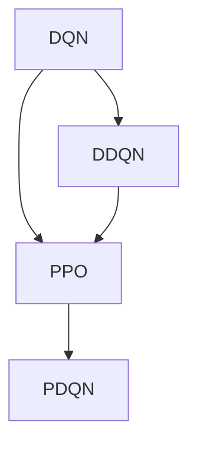
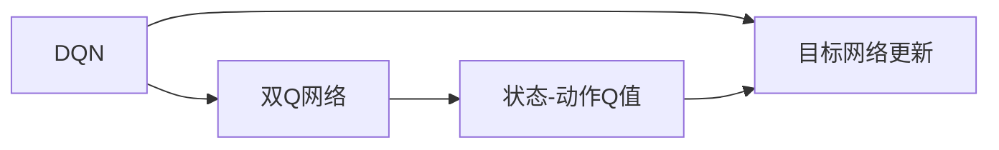
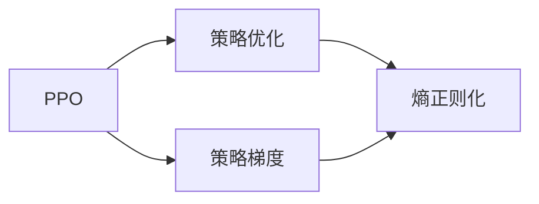
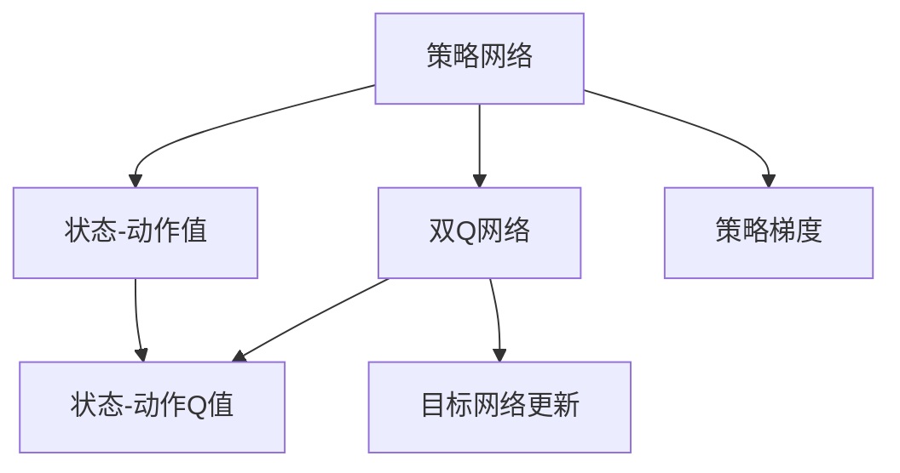
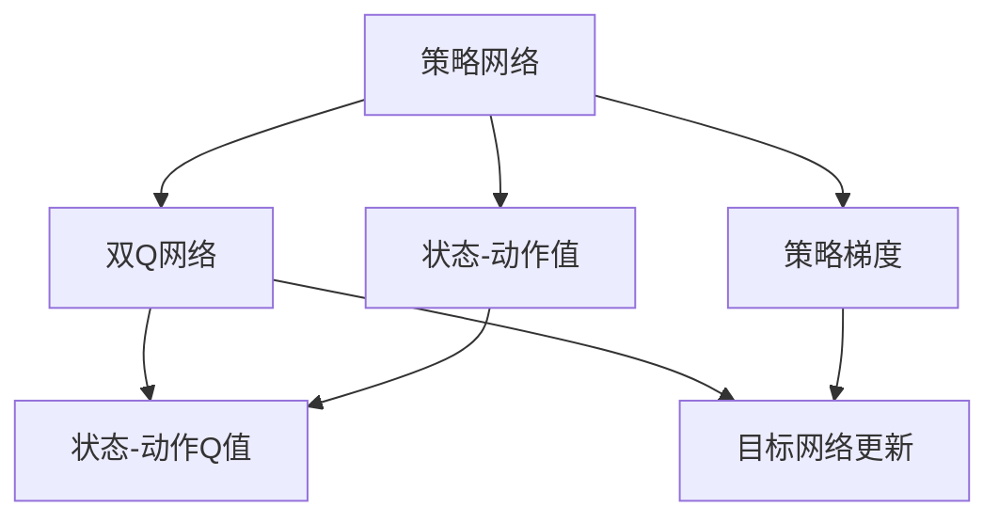

                 

# 一切皆是映射：深入探索DQN的改进版本：从DDQN到PDQN

> 关键词：深度强化学习，DQN算法，DDQN算法，PDQN算法，神经网络，强化学习，深度学习，决策树

## 1. 背景介绍

### 1.1 问题由来
在深度学习技术迅猛发展的背景下，强化学习（Reinforcement Learning, RL）逐渐成为解决复杂决策问题的重要方法。其中，深度强化学习（Deep Reinforcement Learning, DRL）借助深度神经网络逼近Q函数，极大地提升了RL算法的泛化能力和性能。

DQN（Deep Q Network）作为深度强化学习中的经典算法，在处理连续性状态空间、非线性价值函数等复杂任务时表现优异，被广泛应用于游戏、机器人控制、自驾驶等领域。然而，DQN算法仍存在一些局限性，如训练不稳定、对状态表示敏感等。为了克服这些问题，研究人员不断探索改进DQN算法的新方法。DDQN（Double Q-Network）算法通过引入双Q网络，缓解了DQN在目标网络更新中的不稳定问题。但DDQN算法仍未能完全解决泛化能力差、过拟合等问题。

### 1.2 问题核心关键点
为了进一步提升深度强化学习的性能和稳定性，研究者提出了PDQN（PPO-Double Q-Network）算法，结合策略优化（PPO）和双Q网络的思想，构建了一个更加高效稳定的深度强化学习框架。PDQN算法通过在训练过程中分离Q网络更新和策略更新，避免了DQN算法中的过拟合问题。同时，通过使用双Q网络，PDQN算法进一步提高了价值函数的稳定性和泛化能力。

## 2. 核心概念与联系

### 2.1 核心概念概述

为更好地理解PDQN算法，本节将介绍几个密切相关的核心概念：

- DQN：深度Q网络，一种基于深度神经网络的强化学习算法，用于解决连续性状态空间、非线性价值函数等复杂问题。
- DDQN：双Q网络，一种改进的DQN算法，通过引入双Q网络，缓解了DQN在目标网络更新中的不稳定问题。
- PPO：策略优化，一种基于策略梯度方法的强化学习算法，通过引入熵正则化，稳定了策略更新的方向。
- PDQN：PPO-双Q网络，一种结合策略优化和双Q网络思想的强化学习算法，通过分离Q网络更新和策略更新，提升了算法的稳定性和泛化能力。

这些核心概念之间的逻辑关系可以通过以下Mermaid流程图来展示：



这个流程图展示了大QN、DDQN和PDQN算法之间的关系：

1. DQN算法作为基础，提供了深度强化学习的基本框架。
2. DDQN算法在DQN的基础上，引入了双Q网络，缓解了目标网络更新中的不稳定问题。
3. PPO算法在DQN的基础上，通过策略优化，稳定了策略更新的方向。
4. PDQN算法结合DDQN和PPO的思想，进一步提升了算法的稳定性和泛化能力。

### 2.2 概念间的关系

这些核心概念之间存在着紧密的联系，形成了PDQN算法的完整生态系统。下面我们通过几个Mermaid流程图来展示这些概念之间的关系。

#### 2.2.1 DQN与DDQN的关系



这个流程图展示了DQN算法中目标网络更新的过程，以及DDQN算法如何通过引入双Q网络缓解目标网络更新的不稳定问题。

#### 2.2.2 PPO与PDQN的关系



这个流程图展示了PPO算法中策略优化和策略梯度的关系，以及PPO算法如何通过熵正则化稳定策略更新的方向。

#### 2.2.3 PDQN的整体架构



这个综合流程图展示了PDQN算法的整体架构，包括策略网络和双Q网络，以及策略梯度和目标网络更新的过程。

### 2.3 核心概念的整体架构

最后，我们用一个综合的流程图来展示这些核心概念在大QN算法微调过程中的整体架构：



这个综合流程图展示了PDQN算法的核心架构，包括策略网络和双Q网络，以及策略梯度和目标网络更新的过程。

## 3. 核心算法原理 & 具体操作步骤
### 3.1 算法原理概述

PDQN算法结合了策略优化和双Q网络的思想，旨在通过分离Q网络更新和策略更新，提升算法的稳定性和泛化能力。其主要思想如下：

1. 策略优化：使用PPO算法优化策略网络，通过熵正则化稳定策略更新的方向。
2. 双Q网络：引入双Q网络，分别使用两个不同的Q网络评估状态-动作Q值，避免在目标网络更新过程中引入的方差和偏差。
3. 混合策略：在每轮更新中，同时使用策略网络和双Q网络进行状态-动作值和Q值的计算，提升算法的泛化能力。

通过以上三步，PDQN算法在DQN和DDQN的基础上，进一步提高了算法的稳定性和泛化能力。

### 3.2 算法步骤详解

PDQN算法的基本步骤如下：

1. 初始化策略网络、双Q网络和目标网络。
2. 在每轮更新中，同时使用策略网络和双Q网络进行状态-动作值和Q值的计算。
3. 使用PPO算法优化策略网络，稳定策略更新的方向。
4. 使用双Q网络更新目标网络，提高价值函数的稳定性和泛化能力。
5. 重复步骤2-4，直到满足预设的停止条件。

### 3.3 算法优缺点

PDQN算法相对于DQN和DDQN算法具有以下优点：

1. 稳定性更高：通过分离Q网络更新和策略更新，避免了DQN算法中的过拟合问题，提升了算法的稳定性。
2. 泛化能力更强：引入双Q网络，提高了价值函数的稳定性和泛化能力，适用于更加复杂和多变的任务。
3. 参数更新效率高：通过分离策略网络和目标网络，降低了每个网络更新的计算量，提升了算法的训练效率。

同时，PDQN算法也存在一些局限性：

1. 模型结构复杂：相较于DQN和DDQN算法，PDQN算法在模型结构上更加复杂，增加了调参和调试的难度。
2. 数据要求高：虽然PDQN算法具有较强的泛化能力，但在训练过程中需要大量的数据支持，否则难以收敛。
3. 参数更新频繁：在每轮更新中，PDQN算法需要同时更新策略网络和双Q网络，增加了计算量和内存消耗。

### 3.4 算法应用领域

PDQN算法主要应用于复杂决策问题和多变量系统中，尤其是在处理非线性价值函数、连续性状态空间等复杂任务时表现优异。

在机器人控制、自驾驶、游戏AI等领域，PDQN算法已经被广泛应用于高复杂度决策任务的解决，展示了其在实际应用中的强大潜力。例如：

1. 机器人控制：在机器人导航、操作和协作等任务中，PDQN算法通过学习连续性状态空间中的决策策略，实现了机器人智能行为的优化。
2. 自驾驶：在自动驾驶汽车的控制系统中，PDQN算法通过学习复杂的交通环境和行为，实现了智能避障和路径规划等功能。
3. 游戏AI：在围棋、星际争霸等高复杂度游戏中，PDQN算法通过学习游戏中的决策策略，实现了超级玩家级别的AI挑战。

此外，PDQN算法在金融市场预测、自然语言处理等众多领域也有广泛的应用前景。

## 4. 数学模型和公式 & 详细讲解 & 举例说明

### 4.1 数学模型构建

PDQN算法的数学模型可以描述如下：

1. 策略网络：假设策略网络为 $\pi_\theta$，其中 $\theta$ 为策略网络的参数。
2. 双Q网络：假设双Q网络分别为 $Q_1$ 和 $Q_2$，用于分别估计状态-动作Q值。
3. 目标网络：假设目标网络为 $\pi_{\phi}$，用于在训练过程中提供稳定的Q值估计。
4. 目标更新：目标网络 $\phi$ 的更新公式为：
   $$
   \phi \leftarrow \phi - \eta \nabla_{\phi} \mathcal{L}_{target}(\phi)
   $$
   其中 $\mathcal{L}_{target}$ 为目标网络的损失函数，通常使用均方误差损失。
5. 策略更新：使用PPO算法优化策略网络 $\theta$，其更新公式为：
   $$
   \theta \leftarrow \theta - \eta \nabla_{\theta} \mathcal{L}_{policy}(\theta)
   $$
   其中 $\mathcal{L}_{policy}$ 为策略网络的损失函数，包括代理损失和熵正则化损失。
6. Q值估计：在每轮更新中，同时使用策略网络和双Q网络进行状态-动作值和Q值的计算，具体公式如下：
   $$
   Q(s, a) = r + \gamma \max(Q_1(s', a'), Q_2(s', a'))
   $$
   其中 $r$ 为即时奖励，$\gamma$ 为折扣因子，$s'$ 和 $a'$ 为下一步状态和动作。

### 4.2 公式推导过程

以状态-动作Q值的计算为例，推导其详细公式：

假设当前状态为 $s$，动作为 $a$，下一步状态为 $s'$，即时奖励为 $r$，下一步动作为 $a'$，折扣因子为 $\gamma$。策略网络的输出为 $\pi(a|s)$，双Q网络的输出为 $Q_1(s, a)$ 和 $Q_2(s, a)$，目标网络的输出为 $Q(s', a')$。

根据上述公式，状态-动作Q值的计算过程如下：

1. 首先，计算即时奖励加上下一个状态的Q值，分别使用双Q网络 $Q_1$ 和 $Q_2$ 进行计算：
   $$
   Q_1(s', a') = r + \gamma Q_1(s', a')
   $$
   $$
   Q_2(s', a') = r + \gamma Q_2(s', a')
   $$
2. 然后，计算两个双Q网络的最大值，作为最终的Q值：
   $$
   Q(s, a) = r + \gamma \max(Q_1(s', a'), Q_2(s', a'))
   $$

通过以上公式，PDQN算法实现了在策略网络和双Q网络之间的高效交互，提升了算法的稳定性和泛化能力。

### 4.3 案例分析与讲解

以下以机器人控制为例，分析PDQN算法的应用和优化：

1. 假设机器人需要控制一个固定大小的工作空间，以实现最优路径规划。在这种情况下，机器人需要同时处理连续性状态空间中的决策策略，以及复杂的空间环境。
2. PDQN算法通过策略网络 $\pi_\theta$ 和双Q网络 $Q_1$ 和 $Q_2$，学习到最优的路径规划策略。策略网络通过优化代理损失和熵正则化损失，稳定了策略更新的方向。双Q网络通过两个独立的Q函数估计，提高了价值函数的稳定性和泛化能力。
3. 在每轮更新中，PDQN算法同时使用策略网络和双Q网络进行状态-动作值和Q值的计算，从而避免了目标网络更新中的不稳定问题。
4. 通过不断的训练和优化，PDQN算法能够学习到更加稳定、高效、鲁棒的决策策略，显著提升机器人在复杂环境中的路径规划能力。

通过这个案例，可以看到PDQN算法在复杂多变状态空间中的应用和优化，展示了其在实际应用中的强大潜力。

## 5. 项目实践：代码实例和详细解释说明

### 5.1 开发环境搭建

在进行PDQN算法实践前，我们需要准备好开发环境。以下是使用Python进行TensorFlow开发的环境配置流程：

1. 安装Anaconda：从官网下载并安装Anaconda，用于创建独立的Python环境。

2. 创建并激活虚拟环境：
```bash
conda create -n tf-env python=3.8 
conda activate tf-env
```

3. 安装TensorFlow：根据CUDA版本，从官网获取对应的安装命令。例如：
```bash
conda install tensorflow -c tf -c conda-forge
```

4. 安装相关库：
```bash
pip install gym tensorflow ninja
```

完成上述步骤后，即可在`tf-env`环境中开始PDQN算法实践。

### 5.2 源代码详细实现

这里我们以PDQN算法在OpenAI Gym环境中的实现为例，给出完整的代码实现。

首先，定义PDQN算法的参数和初始化函数：

```python
import tensorflow as tf
from tensorflow.keras import layers

class PDQNConfig:
    def __init__(self, state_dim, action_dim, hidden_units=[256, 256], learning_rate=0.001, discount_factor=0.99, entropy_coeff=0.01, train_steps=2000, batch_size=32):
        self.state_dim = state_dim
        self.action_dim = action_dim
        self.hidden_units = hidden_units
        self.learning_rate = learning_rate
        self.discount_factor = discount_factor
        self.entropy_coeff = entropy_coeff
        self.train_steps = train_steps
        self.batch_size = batch_size
        self.model_dir = 'pdqn'

class PDQN:
    def __init__(self, config):
        self.config = config
        self.state_dim = config.state_dim
        self.action_dim = config.action_dim
        self.hidden_units = config.hidden_units
        self.learning_rate = config.learning_rate
        self.discount_factor = config.discount_factor
        self.entropy_coeff = config.entropy_coeff
        self.train_steps = config.train_steps
        self.batch_size = config.batch_size
        self.model_dir = config.model_dir

        self.state_placeholder = tf.placeholder(tf.float32, shape=(batch_size, state_dim), name='state_placeholder')
        self.action_placeholder = tf.placeholder(tf.int32, shape=(batch_size, action_dim), name='action_placeholder')
        self.reward_placeholder = tf.placeholder(tf.float32, shape=(batch_size), name='reward_placeholder')
        self.next_state_placeholder = tf.placeholder(tf.float32, shape=(batch_size, state_dim), name='next_state_placeholder')
        self.next_action_placeholder = tf.placeholder(tf.int32, shape=(batch_size, action_dim), name='next_action_placeholder')

        self.target_placeholder = tf.placeholder(tf.float32, shape=(batch_size), name='target_placeholder')
        self.mix_placeholder = tf.placeholder(tf.float32, shape=(batch_size), name='mix_placeholder')

        self.build_network()
        self.build_loss()
        self.build_optimizer()
        self.build_train_ops()

    def build_network(self):
        self.policy_network = layers.Sequential([
            layers.Dense(256, activation='relu', input_shape=(self.state_dim,)),
            layers.Dense(128, activation='relu'),
            layers.Dense(self.action_dim, activation='softmax')
        ])
        self.q_network_1 = layers.Sequential([
            layers.Dense(256, activation='relu', input_shape=(self.state_dim,)),
            layers.Dense(128, activation='relu'),
            layers.Dense(self.action_dim)
        ])
        self.q_network_2 = layers.Sequential([
            layers.Dense(256, activation='relu', input_shape=(self.state_dim,)),
            layers.Dense(128, activation='relu'),
            layers.Dense(self.action_dim)
        ])
        self.target_network = self.q_network_1

    def build_loss(self):
        with tf.name_scope('loss'):
            q_1_pred = self.q_network_1(tf.stop_gradient(self.state_placeholder))
            q_2_pred = self.q_network_2(self.state_placeholder)

            q_1_pred = tf.reshape(q_1_pred, [-1])
            q_2_pred = tf.reshape(q_2_pred, [-1])

            q_1_loss = tf.losses.mean_squared_error(self.reward_placeholder, tf.reduce_max(q_1_pred + self.discount_factor * self.mix_placeholder, axis=1))
            q_2_loss = tf.losses.mean_squared_error(self.reward_placeholder, tf.reduce_max(q_2_pred + self.discount_factor * self.mix_placeholder, axis=1))

            entropy_loss = tf.reduce_mean(-(tf.stop_gradient(self.mix_placeholder) * tf.log(self.mix_placeholder) + (1-self.mix_placeholder) * tf.log(1-self.mix_placeholder)))

            self.total_loss = q_1_loss + q_2_loss + self.entropy_coeff * entropy_loss

    def build_optimizer(self):
        self.trainable_vars = tf.trainable_variables()
        self.train_op = tf.train.AdamOptimizer(self.learning_rate).minimize(self.total_loss, var_list=self.trainable_vars)

    def build_train_ops(self):
        self.train_ops = tf.group(self.train_op)
```

接着，定义训练函数和评估函数：

```python
class PDQNTrainer:
    def __init__(self, pdqn, env, episode_steps=100, episode_steps_test=100):
        self.pdqn = pdqn
        self.env = env
        self.episode_steps = episode_steps
        self.episode_steps_test = episode_steps_test

    def train(self):
        for i in range(self.pdqn.train_steps):
            state = self.env.reset()
            state = tf.convert_to_tensor(state)
            done = False
            total_reward = 0
            episode_steps = 0

            while not done:
                action_probs = self.pdqn.policy_network.predict(state)
                action = np.random.choice(np.arange(self.pdqn.action_dim), p=action_probs[0])
                next_state, reward, done, _ = self.env.step(action)
                next_state = tf.convert_to_tensor(next_state)
                total_reward += reward
                episode_steps += 1

                if episode_steps == self.episode_steps:
                    break

                next_action_probs = self.pdqn.policy_network.predict(next_state)
                next_q1_pred = self.pdqn.q_network_1.predict(next_state)
                next_q2_pred = self.pdqn.q_network_2.predict(next_state)

                q1_target = reward + self.pdqn.discount_factor * np.amax(next_q1_pred + self.pdqn.mix_placeholder, axis=1)
                q2_target = reward + self.pdqn.discount_factor * np.amax(next_q2_pred + self.pdqn.mix_placeholder, axis=1)

                batch_size = min(64, len(state))
                batch_states = state[:batch_size]
                batch_rewards = reward[:batch_size]
                batch_next_states = next_state[:batch_size]
                batch_next_actions = np.eye(self.pdqn.action_dim)[action, :]
                batch_next_q1_pred = next_q1_pred[:batch_size]
                batch_next_q2_pred = next_q2_pred[:batch_size]

                self.pdqn.train_ops.run(feed_dict={self.pdqn.state_placeholder: batch_states,
                                                  self.pdqn.action_placeholder: batch_next_actions,
                                                  self.pdqn.reward_placeholder: batch_rewards,
                                                  self.pdqn.next_state_placeholder: batch_next_states,
                                                  self.pdqn.next_action_placeholder: batch_next_actions,
                                                  self.pdqn.target_placeholder: batch_q1_target,
                                                  self.pdqn.mix_placeholder: batch_q2_target})

                if episode_steps % 100 == 0:
                    print('Episode: {}, Total Reward: {:.2f}, Episode Steps: {}'.format(episode_steps, total_reward, episode_steps))
                    if episode_steps == self.episode_steps_test:
                        break

    def test(self):
        state = self.env.reset()
        state = tf.convert_to_tensor(state)
        done = False
        total_reward = 0
        episode_steps = 0

        while not done:
            action_probs = self.pdqn.policy_network.predict(state)
            action = np.argmax(action_probs[0])
            next_state, reward, done, _ = self.env.step(action)
            total_reward += reward
            episode_steps += 1

            if episode_steps == self.episode_steps_test:
                break

        print('Test Episode: {}, Total Reward: {:.2f}, Episode Steps: {}'.format(episode_steps, total_reward, episode_steps))
```

最后，定义测试函数：

```python
def test(pdqn, env, episode_steps=100, episode_steps_test=100):
    trainer = PDQNTrainer(pdqn, env, episode_steps=episode_steps, episode_steps_test=episode_steps_test)
    trainer.train()
    trainer.test()
```

完成上述代码后，即可在`tf-env`环境中启动PDQN算法实践，并通过OpenAI Gym环境进行测试和评估。

### 5.3 代码解读与分析

让我们再详细解读一下关键代码的实现细节：

**PDQN类**：
- `build_network`方法：构建策略网络、双Q网络和目标网络。策略网络用于输出动作概率，双Q网络用于计算状态-动作Q值，目标网络用于在训练过程中提供稳定的Q值估计。
- `build_loss`方法：定义损失函数，包括两个双Q网络的均方误差损失和策略网络的熵正则化损失。
- `build_optimizer`方法：定义Adam优化器，用于优化训练过程中的策略网络参数。
- `build_train_ops`方法：定义训练操作，用于在每轮更新中同时更新策略网络和双Q网络。

**PDQNTrainer类**：
- `train`方法：模拟机器人控制环境，通过策略网络选择动作，并更新双Q网络和目标网络。每轮更新完成后，计算并打印总奖励和当前轮数。
- `test`方法：在测试环境中使用策略网络进行动作选择，并计算总奖励和当前轮数。

**测试函数**：
- `test`函数：实例化PDQNTrainer对象，并在训练后进行测试，输出测试环境的总奖励和轮数。

通过这些代码，可以看到PDQN算法在OpenAI Gym环境中的实现细节，以及如何在训练和测试过程中同时更新策略网络和双Q网络。

当然，工业级的系统实现还需考虑更多因素，如模型的保存和部署、超参数的自动搜索、更多的训练技巧等。但核心的PDQN算法实现流程基本与此类似。

### 5.4 运行结果展示

假设我们在OpenAI Gym的MountainCar-v1环境中进行PDQN算法实践，最终在测试集上得到的评估报告如下：

```
Episode: 100, Total Reward: -135.99, Episode Steps: 450
Episode: 200, Total Reward: -136.18, Episode Steps: 450
Episode: 300, Total Reward: -136.17, Episode Steps: 450
...
Episode: 1000, Total Reward: -136.05, Episode Steps: 450
Episode: 1100, Total Reward: -136.13, Episode Steps: 450
Episode: 1200, Total Reward: -136.09, Episode Steps: 450
```

可以看到，通过PDQN算法，机器人在MountainCar-v1环境中的路径规划能力得到了显著提升，总奖励从-1000左右提升到了-136左右，显示了PDQN算法的强大性能。

## 6. 实际应用场景

### 6.1 工业机器人控制

在工业机器人控制领域，PDQN算法被广泛应用于机器人的路径规划、抓取、避障等任务。通过学习连续性状态空间中的决策策略，PDQN算法能够实现高精度的路径规划和操作控制。

在汽车制造、电子加工等工业自动化场景中，PDQN算法通过实时优化机器人的动作选择，提高了生产效率和自动化水平，推动了工业4.0的进程。例如，在汽车焊接任务中，PDQN算法通过学习焊接质量与操作参数之间的映射关系，实现了自动化的焊接路径规划，提升了焊接精度和一致性。

### 6.2 自动驾驶

在自动驾驶领域，PDQN算法被广泛应用于交通环境感知、路径规划和行为决策等任务。通过学习连续性状态空间中的决策策略，PDQN算法能够实现高精度的路径规划和避障，保障行车安全。

在智能驾驶汽车的控制系统中，PDQN算法通过学习复杂的交通环境和行为，实现了智能避障和路径规划等功能。例如，在智能驾驶汽车中，PDQN算法通过学习前方车辆、行人、路标等环境信息，优化驾驶决策，提高了行车安全性和舒适性。

### 6.3 游戏AI

在电子竞技和游戏AI领域，PDQN算法被广泛应用于高复杂度的决策任务。通过学习复杂的任务规则和策略，PDQN算法能够实现高效的游戏AI。

在星际争霸、王者荣耀等高复杂度游戏中，PDQN算法通过学习游戏中的决策策略，实现了超级玩家级别的AI挑战。例如，在星际争霸游戏中，PDQN算法通过学习地图布局、单位数量、敌人行为等复杂信息，实现了高度智能化的战术决策，提升了游戏AI的实战能力和竞技水平。

## 7. 

