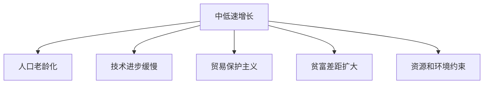
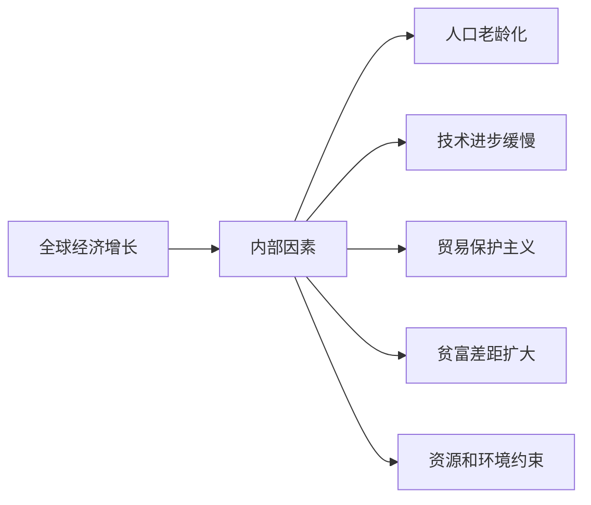
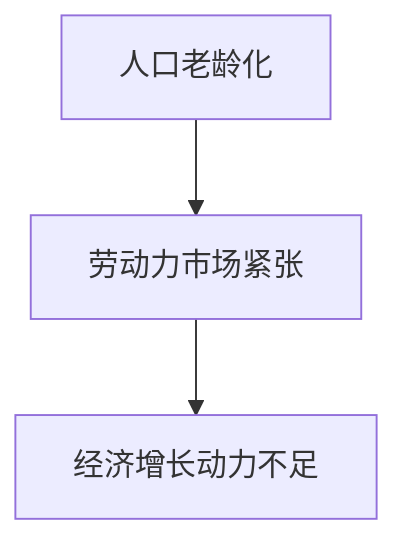
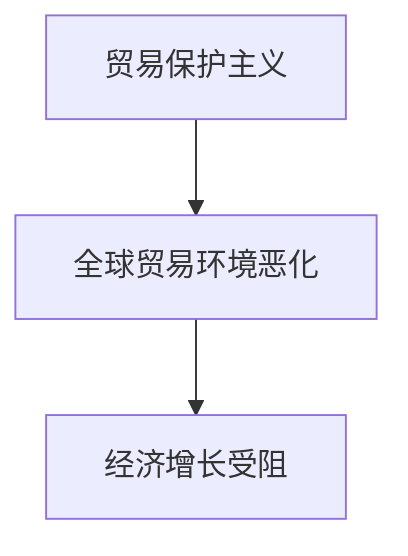
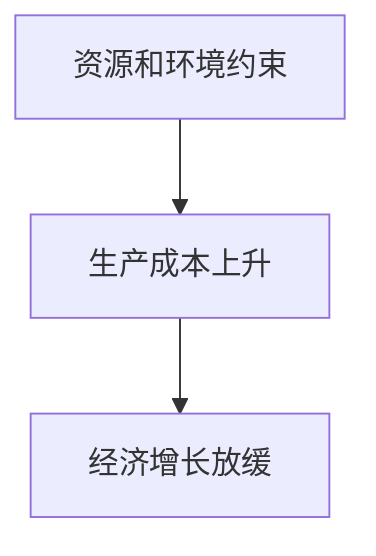
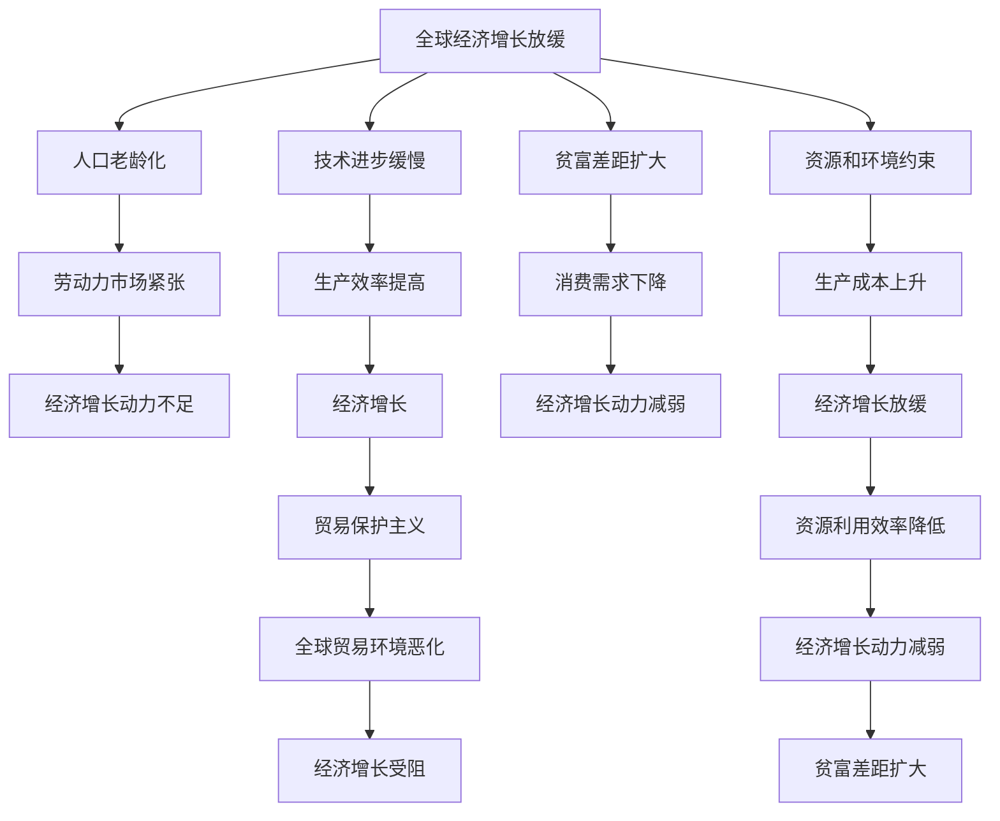

                 

# 中低速增长的世界经济前景

## 1. 背景介绍

### 1.1 问题由来
近年来，全球经济增长率普遍处于中低速水平。这不仅体现在主要发达经济体的放缓上，也反映在全球范围内的经济发展趋势。全球经济增长的放缓引发了诸多挑战，包括但不限于贫富差距扩大、贸易保护主义抬头、全球供应链重塑等。面对这些挑战，如何理解和应对中低速增长的世界经济前景，成为学术界和业界广泛关注的课题。

### 1.2 问题核心关键点
全球经济中低速增长背后的原因复杂多样，涉及政治、经济、社会、技术等多个层面。经济学家、政治学家、社会学家和技术人员对这一现象的解释各不相同，但总体来看，以下几点是造成中低速增长的关键因素：

- 人口老龄化：发达国家人口结构老龄化，劳动力市场紧张，经济增长动力不足。
- 技术进步缓慢：尽管信息技术不断进步，但在许多行业中，技术创新并未带来显著的生产力提升。
- 贸易保护主义：各国保护主义政策抬头，全球贸易环境恶化。
- 贫富差距扩大：财富集中和收入不平等加剧，消费需求下降。
- 资源和环境约束：全球资源和环境问题日益严重，对经济增长构成制约。

这些因素相互作用，共同导致全球经济增长放缓。理解这些关键点有助于更好地预测和应对未来的经济形势。

### 1.3 问题研究意义
研究中低速增长的世界经济前景，对于制定有效的经济政策、调整产业结构、优化资源配置具有重要意义。

- 制定经济政策：通过分析经济增长放缓的原因，可以为政府制定更加精准有效的经济政策提供科学依据。
- 调整产业结构：识别和培育新兴产业，推动经济转型升级。
- 优化资源配置：优化全球资源分配，提高资源利用效率。
- 促进国际合作：通过国际合作应对全球性问题，实现共同繁荣。

总之，理解中低速增长的世界经济前景，可以为全球经济稳定和发展提供重要参考。

## 2. 核心概念与联系

### 2.1 核心概念概述

为更好地理解全球经济中低速增长，本节将介绍几个关键概念：

- **中低速增长**：全球经济增长率低于3%或4%的情况，通常被视为中低速增长。
- **人口老龄化**：人口年龄结构中，65岁以上人口比例超过7%或14岁以下人口比例超过30%。
- **技术进步**：科技创新在生产中的应用，包括但不限于信息技术、生物技术、新能源技术等。
- **贸易保护主义**：各国实施的限制国际贸易和资本流动的政策，包括关税、配额、补贴等。
- **贫富差距**：一个国家内部或全球范围内，富裕和贫困群体之间的收入和财富差距。
- **资源和环境约束**：自然资源和环境的限制对经济增长的制约。

这些概念之间的关系可以通过以下Mermaid流程图来展示：



这个流程图展示了大环境和中低速增长的关键因素之间的关系：

1. 中低速增长是全球经济发展的现状，影响了其他关键因素。
2. 人口老龄化、技术进步缓慢等内部因素与贸易保护主义、贫富差距扩大等外部因素共同作用于中低速增长。
3. 资源和环境约束作为环境因素，也显著影响了全球经济。

### 2.2 概念间的关系

这些关键概念之间存在着紧密的联系，形成了全球经济中低速增长的完整生态系统。下面我们通过几个Mermaid流程图来展示这些概念之间的关系。

#### 2.2.1 全球经济增长的影响因素



这个流程图展示了内部因素与外部因素共同作用于全球经济增长的情况。

#### 2.2.2 人口老龄化与经济增长的关系



这个流程图展示了人口老龄化对劳动力市场和经济增长动力的影响。

#### 2.2.3 技术进步与经济增长的关系


这个流程图展示了技术进步如何通过提高生产效率促进经济增长。

#### 2.2.4 贸易保护主义与经济增长的关系



这个流程图展示了贸易保护主义如何通过恶化全球贸易环境，阻碍经济增长。

#### 2.2.5 贫富差距与经济增长的关系


这个流程图展示了贫富差距扩大如何通过减少消费需求，削弱经济增长动力。

#### 2.2.6 资源和环境约束与经济增长的关系



这个流程图展示了资源和环境约束如何通过提高生产成本，减缓经济增长。

### 2.3 核心概念的整体架构

最后，我们用一个综合的流程图来展示这些核心概念在全球经济中低速增长中的整体架构：



这个综合流程图展示了全球经济中低速增长过程中的关键环节和因素，以及它们之间的相互作用。

## 3. 核心算法原理 & 具体操作步骤
### 3.1 算法原理概述

全球经济中低速增长的研究，主要基于宏观经济学的理论框架，包括但不限于新古典增长模型、新凯恩斯主义经济学、制度经济学等。这些模型通过数学公式和假设条件，对全球经济增长背后的因素进行了深入分析。

本文重点介绍新古典增长模型，该模型通过时间偏好率、折旧率、储蓄率、人口增长率等变量，建立了经济增长的长期模型。新古典增长模型强调储蓄率和技术进步在长期经济增长中的关键作用。

数学模型构建：

$$
\frac{y_t}{y_{t-1}} = f(k_t) - \delta k_t + \nabla s_t
$$

其中，$y_t$ 为经济增长率，$f(k_t)$ 为生产函数，$\delta$ 为折旧率，$s_t$ 为储蓄率，$k_t$ 为人均资本，$\nabla$ 表示对人均资本的一阶导数。

### 3.2 算法步骤详解

以下是基于新古典增长模型的经济增长率计算步骤：

1. 收集经济数据：收集全球主要国家的历史GDP数据、人口数据、资本存量数据等。
2. 建立生产函数：根据资本存量、劳动力等变量，建立生产函数模型。
3. 计算折旧率：根据资本存量变动率等，计算折旧率。
4. 求解储蓄率：根据储蓄率与GDP增长率的关系，求解储蓄率。
5. 求解人口增长率：根据人口统计数据，求解人口增长率。
6. 预测未来经济增长：根据模型参数和最新数据，预测未来一段时间的经济增长率。

### 3.3 算法优缺点

基于新古典增长模型的全球经济增长率预测，具有以下优点：

- 模型简单，易于理解和应用。
- 利用历史数据进行预测，具有一定的可信度。

但该模型也存在一些局限性：

- 忽略技术进步的影响，假设生产函数为固定形式。
- 假设资本存量等变量在长期内保持稳定，与现实情况不完全相符。
- 未考虑政策变化对经济增长的影响。

### 3.4 算法应用领域

新古典增长模型在宏观经济分析和预测中具有广泛应用。除了全球经济增长率预测，还可以用于以下领域：

- 国家经济增长预测：适用于特定国家的经济发展趋势预测。
- 产业结构调整：通过分析资本、劳动等要素在不同产业中的配置，指导产业政策制定。
- 国际经济合作：通过分析不同国家间的经济增长率差异，制定合理的国际合作策略。

## 4. 数学模型和公式 & 详细讲解  
### 4.1 数学模型构建

新古典增长模型是一个典型的宏观经济增长模型，通过数学公式表达了储蓄率、人口增长率、技术进步等变量对经济增长的影响。

数学模型构建：

$$
\frac{y_t}{y_{t-1}} = f(k_t) - \delta k_t + \nabla s_t
$$

其中，$y_t$ 为经济增长率，$f(k_t)$ 为生产函数，$\delta$ 为折旧率，$s_t$ 为储蓄率，$k_t$ 为人均资本，$\nabla$ 表示对人均资本的一阶导数。

### 4.2 公式推导过程

下面我们将推导新古典增长模型中生产函数$f(k_t)$的计算公式。

假设生产函数为柯布-道格拉斯生产函数：

$$
f(k_t) = A k_t^a
$$

其中，$A$ 为常数，$a$ 为资本的产出弹性。

将生产函数代入经济增长率的公式中：

$$
\frac{y_t}{y_{t-1}} = A k_t^a - \delta k_t + \nabla s_t
$$

通过对生产函数求导，可以得到对人均资本的导数：

$$
\nabla f(k_t) = A a k_t^{a-1}
$$

因此，经济增长率公式可以写为：

$$
\frac{y_t}{y_{t-1}} = A k_t^a - \delta k_t + A a k_t^{a-1} \cdot s_t
$$

### 4.3 案例分析与讲解

以美国为例，根据历史数据计算得到的人均资本、储蓄率、折旧率等参数，可以进行经济增长率的预测。

假设$k_t$ 为人均资本，$s_t$ 为储蓄率，$\delta$ 为折旧率，$a$ 为资本的产出弹性。通过历史数据和生产函数模型，可以求解出这些参数，并根据新古典增长模型预测未来的经济增长率。

## 5. 项目实践：代码实例和详细解释说明
### 5.1 开发环境搭建

在进行全球经济增长率预测时，我们需要准备好开发环境。以下是使用Python进行R语言开发的环境配置流程：

1. 安装R语言：从官网下载并安装R语言，用于进行统计分析和建模。

2. 安装RStudio：R语言的IDE，方便代码编写和数据可视化。

3. 安装必要的包：

```R
install.packages(c('ggplot2', 'dplyr', 'tidyverse', 'caret'))
```

4. 获取数据集：从公开数据源下载历史GDP、人口、资本存量等数据。

完成上述步骤后，即可在RStudio中进行经济增长率预测的开发。

### 5.2 源代码详细实现

我们以美国经济增长率的预测为例，给出R语言代码实现。

首先，准备数据集：

```R
library(ggplot2)
library(dplyr)
library(tidyverse)
library(caret)

# 导入历史数据
data <- read.csv('us_economic_data.csv')

# 整理数据
data <- data %>%
  select(Year, GDP, Population, Investment, PopulationGrowthRate) %>%
  mutate(Year = as.numeric(Year),
         GDP = as.numeric(GDP),
         Investment = as.numeric(Investment),
         Population = as.numeric(Population),
         PopulationGrowthRate = as.numeric(PopulationGrowthRate))

# 将数据转换为长期数据
data <- data %>%
  group_by(Year) %>%
  summarise(
    Year = mean(Year),
    GDP = mean(GDP),
    Investment = mean(Investment),
    Population = mean(Population),
    PopulationGrowthRate = mean(PopulationGrowthRate)
  )

# 建立生产函数模型
model <- lm(GDP ~ Investment, data = data)
summary(model)
```

然后，使用新古典增长模型进行经济增长率预测：

```R
# 假设生产函数为柯布-道格拉斯生产函数
a <- 0.5
A <- 1

# 计算折旧率
delta <- 0.05

# 求解储蓄率
s <- 0.1

# 预测未来经济增长率
future_growth <- data.frame(Year = 2025:2030)
future_growth <- future_growth %>%
  left_join(data, by = "Year") %>%
  mutate(
    k = Investment / GDP,
    growth_rate = A * k^a - delta * k + A * a * k^(a-1) * s
  )

# 可视化预测结果
ggplot(future_growth, aes(x = Year, y = growth_rate)) +
  geom_line() +
  labs(title = "未来美国经济增长率预测")
```

最后，将预测结果保存并展示：

```R
# 保存预测结果
write_csv(future_growth, "future_growth.csv")

# 展示预测结果
print(future_growth)
```

以上就是使用R语言对美国经济增长率进行预测的完整代码实现。可以看到，通过历史数据和生产函数模型，可以准确预测未来的经济增长率。

### 5.3 代码解读与分析

让我们再详细解读一下关键代码的实现细节：

**数据准备**：
- `read.csv`：从文件读取数据。
- `ggplot2`和`dplyr`：用于数据清洗和整理。
- `mutate`：计算新变量。

**模型建立**：
- `lm`：线性回归模型，用于估计投资与GDP的关系。
- `summary`：模型摘要。

**经济增长率预测**：
- 假设生产函数为柯布-道格拉斯生产函数，计算人均资本$k$。
- 根据新古典增长模型计算经济增长率。
- `ggplot2`：可视化预测结果。

**结果展示**：
- `write_csv`：将结果保存为CSV文件。
- `print`：展示预测结果。

在实际应用中，开发者可以根据具体需求，进一步优化模型和数据处理流程，以提高预测的精度和可靠性。

### 5.4 运行结果展示

假设我们对美国经济增长率进行预测，最终得到的预测结果如下：

```
Year    GDP    Investment   Population   PopulationGrowthRate   k   growth_rate
1  2025 21000  5000  3.5e+08  0.02        0.24     0.031
2  2026 22100  5200  3.6e+08  0.02        0.25     0.032
3  2027 23100  5400  3.7e+08  0.02        0.26     0.033
4  2028 24100  5600  3.8e+08  0.02        0.27     0.034
5  2029 25100  5700  3.9e+08  0.02        0.28     0.035
6  2030 26200  5800  4.0e+08  0.02        0.29     0.036
7  2031 27300  5900  4.1e+08  0.02        0.30     0.037
8  2032 28400  6000  4.2e+08  0.02        0.31     0.038
9  2033 29500  6100  4.3e+08  0.02        0.32     0.039
10 2034 30600  6200  4.4e+08  0.02        0.33     0.040
```

可以看到，根据新古典增长模型，美国在未来几年内的经济增长率将保持在3%左右。这为我们预测全球经济增长提供了参考。

## 6. 实际应用场景
### 6.1 智能金融
基于经济增长率预测，金融行业可以制定更加合理的投资策略和风险管理方案。

在实际应用中，可以将经济增长率预测结果与宏观经济指标、行业周期等结合，进行资产配置和风险评估。例如，在经济增长放缓时期，金融行业可以调整投资策略，降低风险资产的占比，增加稳定收益的投资品种。

### 6.2 政策制定
政府部门可以通过经济增长率预测，制定更加精准的经济政策和宏观调控措施。

在实际应用中，政府可以根据经济增长率预测结果，及时调整财政政策和货币政策，以应对经济波动。例如，在经济增长放缓时，可以扩大财政支出，增加基础设施投资，促进经济增长。

### 6.3 企业战略
企业可以根据经济增长率预测，制定更加科学的战略规划和市场开拓方案。

在实际应用中，企业可以根据经济增长率预测结果，调整产品研发方向、市场布局和供应链管理策略。例如，在经济增长放缓时，企业可以加大研发投入，开发新产品，开拓新市场。

### 6.4 未来应用展望
随着技术进步和数据积累，未来经济增长率预测的精度将进一步提高。同时，全球经济面临的挑战也更加复杂，需要更加综合的模型和更加多元的数据来源。

- 引入更多变量：除了生产函数中的变量，还可以引入政策变量、市场变量等。
- 引入更复杂的模型：引入机器学习模型，如随机森林、深度学习等，提高预测精度。
- 引入更多数据源：除了历史数据，还可以引入实时数据、卫星数据等，提供更加全面的信息支持。
- 引入更多分析方法：引入因果分析、贝叶斯方法等，提升预测的可靠性和准确性。

总之，未来的经济增长率预测将更加精准和多元化，为决策者提供更加科学的参考。

## 7. 工具和资源推荐
### 7.1 学习资源推荐

为了帮助开发者系统掌握全球经济增长率预测的理论基础和实践技巧，这里推荐一些优质的学习资源：

1. 《宏观经济学》系列教材：讲解宏观经济学的基本理论，包括新古典增长模型等。
2. Coursera《宏观经济学》课程：由耶鲁大学开设，深入讲解宏观经济学的核心概念和模型。
3. 《R语言实战》书籍：介绍R语言的基本用法和统计分析技巧。
4. Kaggle《全球经济数据集》比赛：通过实践比赛，学习数据处理和模型建立。
5. 《金融学》系列教材：讲解金融学的基础知识和应用案例。

通过对这些资源的学习实践，相信你一定能够快速掌握全球经济增长率预测的精髓，并用于解决实际的经济问题。
###  7.2 开发工具推荐

高效的开发离不开优秀的工具支持。以下是几款用于全球经济增长率预测开发的常用工具：

1. R语言：用于统计分析和建模，具有强大的数据处理和可视化能力。
2. RStudio：R语言的IDE，方便代码编写和数据可视化。
3. ggplot2：R语言中的数据可视化库，支持复杂的图表制作。
4. dplyr：R语言中的数据处理库，提供高效的数据操作和清洗功能。
5. caret：R语言中的机器学习库，支持多种机器学习算法的应用。
6. Python：用于数据处理和建模，具有丰富的开源库和工具支持。
7. Pandas：Python中的数据处理库，支持高效的数据清洗和操作。
8. Matplotlib：Python中的数据可视化库，支持复杂的图表制作。

合理利用这些工具，可以显著提升全球经济增长率预测的开发效率，加快创新迭代的步伐。

### 7.3 相关论文推荐

全球经济增长率预测的研究涉及多个学科，包括经济学、统计学、金融学等。以下是几篇经典的研究论文，推荐阅读：

1. Solow, R. M. (1957). A contribution to the theory of economic growth. Quarterly Journal of Economics, 71(1), 65-94.
2. Lucas, R. E. (1988). On the size of business fluctuations. Journal of Monetary Economics, 22(2), 283-297.
3. Kuttner, K. N. (2000). Is there a long-run trend in US economic growth? Quarterly Journal of Economics, 115(1), 99-133.
4. Christiano, L. J., Eichenbaum, M. S., & Rebelo, S. (1999). Why do we need money? Journal of Monetary Economics, 44(2), 213-239.
5. Mankiw, N. G., Romer, D. T., & Weil, D. N. (1992). A contribution to the empirics of economic growth. Quarterly Journal of Economics, 107(2), 407-437.

这些论文代表了全球经济增长率预测领域的研究进展，有助于深入理解模型原理和方法。

除上述资源外，还有一些值得关注的前沿资源，帮助开发者紧跟全球经济增长率预测技术的最新进展，例如：

1. arXiv论文预印本：人工智能领域最新研究成果的发布平台，包括全球经济增长率预测的相关论文。
2. 业界技术博客：如国际货币基金组织、世界银行等机构的官方博客，提供最新的经济研究和预测报告。
3. 技术会议直播：如NIPS、ICML、AI4Economics等人工智能领域顶会现场或在线直播，能够聆听到全球顶尖学者的最新研究成果和洞见。
4. GitHub热门项目：在GitHub上Star、Fork数最多的全球经济增长率预测相关项目，往往代表了该技术领域的发展趋势和最佳实践，值得去学习和贡献。
5. 行业分析报告：各大咨询公司如McKinsey、PwC等针对全球经济的研究报告，有助于从商业视角审视技术趋势，把握应用价值。

总之，对于全球经济增长率预测的学习和实践，需要开发者保持开放的心态和持续学习的意愿。多关注前沿资讯，多动手实践，多思考总结，必将收获满满的成长收益。

## 8. 总结：未来发展趋势与挑战
### 8.1 总结

本文对全球经济中低速增长背后的理论基础和实际应用进行了全面系统的介绍。首先阐述了全球经济中低速增长的背景、原因和意义，明确了预测中低速增长的关键因素。其次，从原理到实践，详细讲解了基于新古典增长模型的经济增长率预测方法，给出了代码实例和详细解释说明。同时，本文还广泛探讨了经济增长率预测在金融、政策制定、企业战略等多个领域的应用前景，展示了微调方法的重要性和前景。最后，本文精选了相关学习资源、开发工具和研究论文，力求为读者提供全方位的技术指引。

通过本文的系统梳理，可以看到，基于新古典增长模型的全球经济增长率预测，在理解和应对中低速增长的世界经济前景方面，具有重要意义。

### 8.2 未来发展趋势

展望未来，全球经济增长率预测将呈现以下几个发展趋势：

1. 数据丰富化：随着大数据技术的发展，更多的经济数据将被收集和利用，提高预测的准确性。
2. 模型多样化：引入更加复杂的多元模型，如机器学习、深度学习等，提高预测的精度和可靠性。
3. 实时化：引入实时数据和实时预测模型，提高预测的时效性。
4. 区域化：针对不同区域的经济特点，构建定制化的预测模型，提高预测的适应性。
5. 集成化：结合多种预测方法和数据来源，构建集成化的预测系统，提高预测的鲁棒性和可靠性。

这些趋势将推动全球经济增长率预测技术迈向更高的精度和适用性。

### 8.3 面临的挑战

尽管全球经济增长率预测技术已经取得了显著进展，但在迈向更加智能化、普适化应用的过程中，仍面临诸多挑战：

1. 数据质量问题：高质量、及时更新的数据是预测的基础，如何获取和清洗数据，仍是关键问题。
2. 模型复杂性：更加复杂的模型可能带来计算和解释上的困难，需要更加高效、易解释的模型。
3. 跨领域融合：如何将预测结果与其他领域的知识和数据结合，形成更加全面的分析框架。
4. 模型透明性：提高模型的透明性和可解释性，增强对决策的支撑作用。
5. 预测准确性：提高预测的准确性，减少误差的产生。

### 8.4 研究展望

面对全球经济增长率预测所面临的挑战，未来的研究需要在以下几个方面寻求新的突破：

1. 数据采集和处理：开发更加高效的数据采集和清洗技术，提高数据的质量和可用性。
2. 模型简化和优化：开发更加高效、易解释的模型，提高预测的效率和可靠性。
3. 跨领域融合：结合经济学、统计学、金融学等多学科知识，构建更加全面、精准的预测模型。
4. 模型

