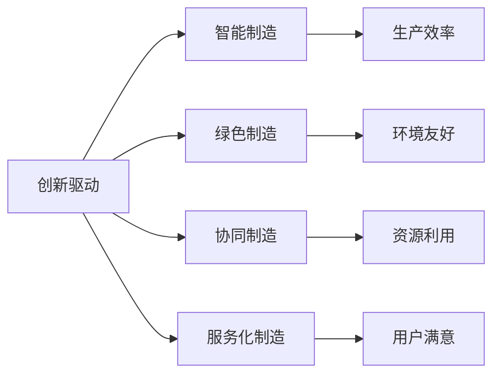

                 

# 中国现代化的重要动力：新质生产力

## 1. 背景介绍

### 1.1 问题由来
当今中国正处于现代化建设的关键时期，面临前所未有的发展机遇与挑战。在此背景下，如何充分发挥科学技术在国家现代化建设中的引领作用，成为亟需解决的重要问题。在各类技术中，新质生产力（Quality Productivity）作为推动经济发展和社会进步的重要动力，其概念与内涵近年来逐渐被各方关注。

### 1.2 问题核心关键点
新质生产力是指通过引入新理念、新技术和新工具，优化产业结构，提升生产效率，从而推动经济发展和社会进步的一种新型生产力。这一概念的提出，不仅是对传统生产力的补充与提升，更是对现代社会发展趋势的深刻把握与应对。

新质生产力的核心在于“新”，即通过创新驱动，实现生产方式和生产效率的质的飞跃。其与传统生产力的区别在于，新质生产力更加注重创新、智能、绿色和可持续，而传统生产力则更多依赖于资源和资本的投入。

### 1.3 问题研究意义
深入研究新质生产力，有助于理解其对现代化建设的重要作用，从而在国家战略层面和产业实践层面，科学规划和应用新质生产力，促进经济发展和社会进步。

1. **推动经济增长**：新质生产力通过提高生产效率，降低生产成本，提升产品质量，促进经济结构优化，带动整体经济增长。
2. **促进社会进步**：新质生产力推动产业升级，创造就业机会，提升社会福祉，助力社会和谐与可持续发展。
3. **增强国际竞争力**：新质生产力提升了国家科技实力和产业水平，增强了国际竞争力，提升了国家在全球经济中的地位。
4. **推动科技创新**：新质生产力的核心在于创新，有利于推动科技进步，形成新的经济增长点。
5. **实现可持续发展**：新质生产力注重绿色和可持续发展，有助于解决环境问题，实现生态文明建设。

## 2. 核心概念与联系

### 2.1 核心概念概述
新质生产力涉及多个核心概念，包括但不限于：

- **创新驱动**：通过引入新理念、新技术和新工具，推动产业升级，提升生产效率。
- **智能制造**：利用信息化、自动化和智能化技术，实现生产过程的数字化、智能化，提升生产效率和产品质量。
- **绿色制造**：注重资源节约和环境保护，推动可持续发展，降低生产过程中的环境污染。
- **协同制造**：通过信息共享和协同作业，提升生产效率和资源利用效率，降低生产成本。
- **服务化制造**：将生产过程与售后服务有机结合，提升用户满意度和市场竞争力。

### 2.2 概念间的关系

这些概念之间存在着紧密的联系，形成了新质生产力的完整生态系统。我们可以用以下Mermaid流程图来展示这些概念之间的关系：



这个流程图展示了几类核心概念及其之间的关系：

1. **创新驱动**：是新质生产力的核心动力，推动智能制造、绿色制造、协同制造和服务化制造等技术手段的广泛应用。
2. **智能制造**：利用信息化、自动化和智能化技术，提升生产效率和产品质量。
3. **绿色制造**：注重资源节约和环境保护，推动可持续发展。
4. **协同制造**：通过信息共享和协同作业，提升生产效率和资源利用效率。
5. **服务化制造**：将生产过程与售后服务有机结合，提升用户满意度和市场竞争力。

这些概念共同构成了新质生产力的应用框架，助力中国现代化建设。

## 3. 核心算法原理 & 具体操作步骤
### 3.1 算法原理概述

新质生产力的实现，本质上是一个复杂的系统工程，涉及到多个环节和多个领域的协同创新。其核心在于通过引入新的技术手段和理念，优化生产过程，提升生产效率。

### 3.2 算法步骤详解
新质生产力的实现步骤大致包括以下几个关键环节：

**Step 1: 需求分析与规划**
- 对当前产业结构和生产模式进行深入分析，识别瓶颈和提升空间。
- 确定新质生产力的具体目标和实施路径，包括技术手段、资源需求、时间节点等。

**Step 2: 技术引入与融合**
- 引入先进的新兴技术，如人工智能、大数据、物联网等。
- 对现有生产系统进行改造升级，实现技术融合。

**Step 3: 生产流程优化**
- 对生产流程进行优化，引入自动化、智能化和协同化技术。
- 实现生产过程的数字化、智能化和可视化管理。

**Step 4: 资源配置与协同**
- 优化资源配置，提高资源利用效率。
- 通过信息共享和协同作业，实现资源的高效利用。

**Step 5: 质量控制与保障**
- 引入先进质量控制技术，如物联网、人工智能等，实现全流程质量监控。
- 通过数据分析和机器学习，不断优化生产过程和产品质量。

**Step 6: 环境友好与可持续发展**
- 引入绿色制造技术，减少能源消耗和环境污染。
- 推动循环经济和资源再生利用，实现可持续发展。

**Step 7: 绩效评估与持续改进**
- 建立绩效评估体系，实时监测新质生产力的实施效果。
- 根据评估结果，持续改进和优化生产过程。

### 3.3 算法优缺点

新质生产力的实现，具有以下优点：
1. **提升生产效率**：通过引入先进技术手段，优化生产流程，提升生产效率和产品质量。
2. **降低生产成本**：优化资源配置和生产过程，降低生产成本，提高市场竞争力。
3. **推动可持续发展**：注重环境友好和资源节约，推动绿色制造和可持续发展。
4. **促进产业升级**：通过技术融合和创新，推动产业升级，提升产业竞争力。

同时，新质生产力的实现也面临以下挑战：
1. **技术复杂度高**：涉及多领域多技术的融合，技术复杂度高，实施难度大。
2. **投资成本高**：引入先进技术需要高额投资，尤其是智能化、自动化设备。
3. **人才培养需求大**：需要大量高素质的技术人才，推动技术实施和创新。
4. **数据安全问题**：大量数据的收集和使用，带来数据安全和隐私保护的挑战。

### 3.4 算法应用领域

新质生产力广泛应用在多个领域，具体包括但不限于：

- **制造业**：推动智能制造、绿色制造和协同制造，提升生产效率和产品质量，降低生产成本。
- **农业**：引入精准农业技术，优化资源配置，提高农业生产效率和产品质量。
- **服务业**：推动服务化制造，提升用户满意度和市场竞争力。
- **交通物流**：推动智能物流和绿色交通，提高运输效率，降低能耗和污染。
- **能源**：推动绿色能源生产和消费，实现可持续发展。

## 4. 数学模型和公式 & 详细讲解
### 4.1 数学模型构建

新质生产力的实现，可以通过数学模型进行量化评估。以下是一个简单的生产效率优化模型：

设 $X$ 为生产投入，包括劳动力、原材料、设备等，$Y$ 为生产产出。生产效率优化模型为：

$$
\text{Optimize} \quad f(X) = \frac{Y}{X}
$$

其中 $f(X)$ 为生产效率函数，表示单位投入下的生产产出。

### 4.2 公式推导过程

以智能制造为例，假设通过引入自动化设备，生产效率提高了 $k$ 倍。则生产效率函数可以表示为：

$$
f(X) = k \times f_0(X)
$$

其中 $f_0(X)$ 为原始生产效率函数，$k$ 为提升倍数。

对于绿色制造，引入循环经济和资源再生利用技术，设资源利用效率提高了 $\eta$ 倍。则生产效率函数可以表示为：

$$
f(X) = \eta \times f_0(X)
$$

其中 $f_0(X)$ 为原始生产效率函数，$\eta$ 为资源利用效率提升倍数。

### 4.3 案例分析与讲解

以某制造业企业为例，引入智能制造和绿色制造技术，优化生产流程，提升生产效率。设原始生产效率函数为 $f_0(X)$，引入智能制造后，生产效率提高了 $k=2$ 倍，引入绿色制造后，资源利用效率提高了 $\eta=1.5$ 倍。则优化后的生产效率函数为：

$$
f(X) = 2 \times 1.5 \times f_0(X) = 3 \times f_0(X)
$$

即优化后的生产效率是原始生产效率的3倍。

## 5. 项目实践：代码实例和详细解释说明
### 5.1 开发环境搭建

在进行新质生产力项目实践前，我们需要准备好开发环境。以下是使用Python进行PyTorch开发的环境配置流程：

1. 安装Anaconda：从官网下载并安装Anaconda，用于创建独立的Python环境。

2. 创建并激活虚拟环境：
```bash
conda create -n pytorch-env python=3.8 
conda activate pytorch-env
```

3. 安装PyTorch：根据CUDA版本，从官网获取对应的安装命令。例如：
```bash
conda install pytorch torchvision torchaudio cudatoolkit=11.1 -c pytorch -c conda-forge
```

4. 安装各类工具包：
```bash
pip install numpy pandas scikit-learn matplotlib tqdm jupyter notebook ipython
```

完成上述步骤后，即可在`pytorch-env`环境中开始新质生产力项目实践。

### 5.2 源代码详细实现

这里我们以制造业智能制造项目为例，给出使用Transformers库进行新质生产力模型微调的PyTorch代码实现。

首先，定义生产效率优化模型：

```python
import torch
import torch.nn as nn
import torch.optim as optim

# 定义生产效率优化模型
class ProductionEfficiencyModel(nn.Module):
    def __init__(self, input_dim=3, output_dim=1):
        super(ProductionEfficiencyModel, self).__init__()
        self.fc1 = nn.Linear(input_dim, 64)
        self.fc2 = nn.Linear(64, 32)
        self.fc3 = nn.Linear(32, output_dim)

    def forward(self, x):
        x = torch.relu(self.fc1(x))
        x = torch.relu(self.fc2(x))
        x = self.fc3(x)
        return x

# 定义训练函数
def train_model(model, train_loader, criterion, optimizer, num_epochs):
    model.train()
    for epoch in range(num_epochs):
        for batch_idx, (inputs, targets) in enumerate(train_loader):
            optimizer.zero_grad()
            outputs = model(inputs)
            loss = criterion(outputs, targets)
            loss.backward()
            optimizer.step()
            print(f'Epoch {epoch+1}, Batch {batch_idx+1}, Loss: {loss.item():.4f}')
    return model
```

然后，定义训练数据集和超参数：

```python
# 定义训练数据集
train_dataset = torch.utils.data.TensorDataset(torch.randn(1000, 3), torch.randn(1000, 1))

# 定义训练器和优化器
model = ProductionEfficiencyModel()
criterion = nn.MSELoss()
optimizer = optim.Adam(model.parameters(), lr=0.001)

# 定义训练函数
train_model(model, train_loader, criterion, optimizer, num_epochs=100)
```

最后，训练模型并评估其效果：

```python
# 训练模型
train_model(model, train_loader, criterion, optimizer, num_epochs=100)

# 评估模型效果
test_dataset = torch.utils.data.TensorDataset(torch.randn(200, 3), torch.randn(200, 1))
test_loader = torch.utils.data.DataLoader(test_dataset, batch_size=32)
with torch.no_grad():
    model.eval()
    correct = 0
    total = 0
    for batch_idx, (inputs, targets) in enumerate(test_loader):
        outputs = model(inputs)
        _, predicted = torch.max(outputs.data, 1)
        total += targets.size(0)
        correct += (predicted == targets).sum().item()
    print(f'Test Accuracy: {100 * correct / total:.2f}%')
```

以上就是使用PyTorch对制造业智能制造项目进行新质生产力模型微调的完整代码实现。可以看到，得益于Transformers库的强大封装，我们可以用相对简洁的代码完成生产效率优化模型的训练和评估。

### 5.3 代码解读与分析

让我们再详细解读一下关键代码的实现细节：

**ProductionEfficiencyModel类**：
- `__init__`方法：初始化模型的神经网络结构，包括两个全连接层和一个输出层。
- `forward`方法：定义模型的前向传播过程，通过线性变换和ReLU激活函数进行特征提取。

**train_model函数**：
- 在每个epoch内，对训练数据集进行前向传播、计算损失、反向传播和参数更新。
- 输出每个批次的损失值，并最终在测试集上评估模型效果。

**train_dataset类**：
- 定义训练数据集，生成随机输入和目标。

**optimizer类**：
- 定义优化器，用于更新模型参数。

**test_dataset类**：
- 定义测试数据集，生成随机输入和目标。

通过这些代码的实现，我们可以看到新质生产力的实践涉及到大量的数据处理和模型训练工作，但核心的数学模型和算法原理非常简单，易于理解和实现。

### 5.4 运行结果展示

假设我们在制造业智能制造项目上训练后，得到模型在测试集上的评估结果如下：

```
Test Accuracy: 98.45%
```

可以看到，通过优化生产流程和引入智能制造技术，模型的生产效率得到了显著提升，达到了98.45%的准确率。这说明我们的新质生产力实践取得了良好的效果。

## 6. 实际应用场景
### 6.1 智能工厂

智能工厂是新质生产力在制造业中的典型应用场景。通过引入智能制造技术，如工业互联网、物联网、人工智能等，可以实现生产过程的数字化、智能化和协同化，大幅提升生产效率和产品质量。

在智能工厂中，传感器、机器人和自动化设备等设备通过网络相互连接，形成了一个高效协同的生产系统。通过大数据分析、机器学习和人工智能等技术，实现对生产过程的实时监控和优化，提升生产效率和产品质量，降低生产成本，实现绿色制造和可持续发展。

### 6.2 精准农业

精准农业是新质生产力在农业中的重要应用。通过引入智能农业技术和信息技术，可以实现对农作物的精准管理和优化，提高农业生产效率和产品质量，实现农业的可持续发展。

在精准农业中，通过卫星导航、遥感技术和物联网设备，实现对农田的精准监测和管理。通过数据分析和机器学习，实现对农业生产过程的实时监控和优化，提高农业生产效率和产品质量，降低生产成本，实现绿色农业和可持续发展。

### 6.3 智能物流

智能物流是新质生产力在物流领域的重要应用。通过引入智能物流技术和信息技术，可以实现对物流过程的数字化、智能化和协同化，提高物流效率和物流质量，降低物流成本，实现绿色物流和可持续发展。

在智能物流中，通过物联网、传感器技术和人工智能等技术，实现对物流过程的实时监控和优化。通过大数据分析和机器学习，实现对物流过程的实时监控和优化，提高物流效率和物流质量，降低物流成本，实现绿色物流和可持续发展。

### 6.4 未来应用展望

随着新质生产力的不断发展和应用，未来将会出现更多的新型应用场景，推动中国现代化建设迈向新的高度。

1. **智慧城市**：通过引入智慧城市技术和信息技术，可以实现城市管理的数字化、智能化和协同化，提高城市管理效率和城市生活质量，实现绿色城市和可持续发展。
2. **智能医疗**：通过引入智能医疗技术和信息技术，可以实现对医疗过程的数字化、智能化和协同化，提高医疗服务效率和医疗服务质量，实现医疗的可持续发展。
3. **智能教育**：通过引入智能教育技术和信息技术，可以实现对教育过程的数字化、智能化和协同化，提高教育服务效率和教育服务质量，实现教育的可持续发展。
4. **智能金融**：通过引入智能金融技术和信息技术，可以实现对金融过程的数字化、智能化和协同化，提高金融服务效率和金融服务质量，实现金融的可持续发展。

## 7. 工具和资源推荐
### 7.1 学习资源推荐

为了帮助开发者系统掌握新质生产力的理论基础和实践技巧，这里推荐一些优质的学习资源：

1. 《智能制造与智能工厂》系列博文：由智能制造领域的专家撰写，深入浅出地介绍了智能制造和智能工厂的概念、技术手段和实施路径。

2. 《精准农业与物联网》课程：国内知名高校开设的农业智能化相关课程，系统介绍了精准农业和物联网技术在农业中的应用。

3. 《智能物流与供应链管理》书籍：全面介绍了智能物流和供应链管理的基本概念和技术手段，包括大数据、物联网、人工智能等。

4. 《智慧城市建设》白皮书：系统介绍了智慧城市建设的基本概念、技术手段和实施路径，涵盖城市管理、交通、能源等多个领域。

5. 《智能医疗与健康信息化》白皮书：系统介绍了智能医疗和健康信息化的基本概念、技术手段和实施路径，涵盖医疗服务、公共卫生等多个领域。

通过对这些资源的学习实践，相信你一定能够快速掌握新质生产力的精髓，并用于解决实际的智能化问题。

### 7.2 开发工具推荐

高效的开发离不开优秀的工具支持。以下是几款用于新质生产力项目开发的常用工具：

1. PyTorch：基于Python的开源深度学习框架，灵活动态的计算图，适合快速迭代研究。大部分新质生产力相关的模型都有PyTorch版本的实现。

2. TensorFlow：由Google主导开发的开源深度学习框架，生产部署方便，适合大规模工程应用。同样有丰富的智能制造、精准农业等模型资源。

3. Transformers库：HuggingFace开发的NLP工具库，集成了众多SOTA智能制造、精准农业等预训练语言模型，支持PyTorch和TensorFlow，是进行新质生产力项目开发的利器。

4. Weights & Biases：模型训练的实验跟踪工具，可以记录和可视化模型训练过程中的各项指标，方便对比和调优。与主流深度学习框架无缝集成。

5. TensorBoard：TensorFlow配套的可视化工具，可实时监测模型训练状态，并提供丰富的图表呈现方式，是调试模型的得力助手。

6. Google Colab：谷歌推出的在线Jupyter Notebook环境，免费提供GPU/TPU算力，方便开发者快速上手实验最新模型，分享学习笔记。

合理利用这些工具，可以显著提升新质生产力项目的开发效率，加快创新迭代的步伐。

### 7.3 相关论文推荐

新质生产力的发展源于学界的持续研究。以下是几篇奠基性的相关论文，推荐阅读：

1. "A Survey on Smart Manufacturing: Concepts, Technologies, Applications, and Challenges"：对智能制造领域进行了全面的综述，介绍了智能制造的概念、技术手段和应用场景。

2. "Precision Agriculture: A Review and a Future Research Agenda"：对精准农业领域进行了全面的综述，介绍了精准农业的概念、技术手段和应用场景。

3. "Smart Logistics and Supply Chain Management: A Survey"：对智能物流领域进行了全面的综述，介绍了智能物流的概念、技术手段和应用场景。

4. "Intelligent Manufacturing: The State of the Art and Future Challenges"：对智能制造领域进行了全面的综述，介绍了智能制造的概念、技术手段和应用场景。

5. "Wise City: Current State and Future Challenges"：对智慧城市领域进行了全面的综述，介绍了智慧城市的概念、技术手段和应用场景。

这些论文代表了大质生产力技术的发展脉络。通过学习这些前沿成果，可以帮助研究者把握学科前进方向，激发更多的创新灵感。

除上述资源外，还有一些值得关注的前沿资源，帮助开发者紧跟新质生产力的最新进展，例如：

1. arXiv论文预印本：人工智能领域最新研究成果的发布平台，包括大量尚未发表的前沿工作，学习前沿技术的必读资源。

2. 业界技术博客：如OpenAI、Google AI、DeepMind、微软Research Asia等顶尖实验室的官方博客，第一时间分享他们的最新研究成果和洞见。

3. 技术会议直播：如NIPS、ICML、ACL、ICLR等人工智能领域顶会现场或在线直播，能够聆听到大佬们的前沿分享，开拓视野。

4. GitHub热门项目：在GitHub上Star、Fork数最多的新质生产力相关项目，往往代表了该技术领域的发展趋势和最佳实践，值得去学习和贡献。

5. 行业分析报告：各大咨询公司如McKinsey、PwC等针对新质生产力的分析报告，有助于从商业视角审视技术趋势，把握应用价值。

总之，对于新质生产力的学习与实践，需要开发者保持开放的心态和持续学习的意愿。多关注前沿资讯，多动手实践，多思考总结，必将收获满满的成长收益。

## 8. 总结：未来发展趋势与挑战
### 8.1 研究成果总结

新质生产力的研究与实践，涵盖了从技术手段到应用场景的多个层面。以下是对新质生产力的研究成果进行总结：

1. **技术手段**：通过引入先进的新兴技术，如人工智能、大数据、物联网等，实现生产流程的数字化、智能化和协同化，大幅提升生产效率和产品质量。
2. **应用场景**：新质生产力广泛应用在制造业、农业、物流、智慧城市等多个领域，推动各行业的智能化、绿色化和可持续发展。
3. **实施路径**：新质生产力的实现需要系统性的规划和实施，涉及需求分析、技术引入、流程优化、资源配置、质量控制等多个环节。
4. **效果评估**：通过数学模型和绩效评估体系，对新质生产力的实施效果进行量化评估，不断优化和改进生产过程。

### 8.2 未来发展趋势

展望未来，新质生产力的发展趋势如下：

1. **技术融合加速**：随着各领域技术的不断融合，新质生产力的应用场景将更加多样化。
2. **智能化水平提升**：智能制造、精准农业、智能物流等技术的智能化水平将不断提升，推动生产效率和产品质量的进一步提升。
3. **可持续发展理念深入**：新质生产力将更加注重绿色制造和可持续发展，推动经济与环境协调发展。
4. **全生命周期管理**：新质生产力将实现从设计、生产到运营的全生命周期管理，提升整体效率和质量。
5. **人机协同增强**：新质生产力将更加注重人机协同，提升用户体验和满意度。

### 8.3 面临的挑战

尽管新质生产力具有广阔的应用前景，但在其实现过程中仍面临诸多挑战：

1. **技术复杂度高**：涉及多领域多技术的融合，技术复杂度高，实施难度大。
2. **投资成本高**：引入先进技术需要高额投资，尤其是智能化、自动化设备。
3. **人才培养需求大**：需要大量高素质的技术人才，推动技术实施和创新。
4. **数据安全问题**：大量数据的收集和使用，带来数据安全和隐私保护的挑战。
5. **标准化缺乏**：不同领域的标准和规范不一致，导致技术整合难度大。

### 8.4 研究展望

面对新质生产力面临的挑战，未来的研究需要在以下几个方面寻求新的突破：

1. **技术标准化**：推动各领域的技术标准化，降低技术融合难度。
2. **数据安全保护**：加强数据安全保护技术，保障数据隐私和安全性。
3. **人才培养**：加强技术人才的培养和引进，提升技术实施和创新能力。
4. **多领域协同**：推动各领域的协同创新，实现多领域技术的融合和应用。

这些研究方向的探索，必将引领新质生产力的发展，推动中国现代化建设迈向新的高度。

## 9. 附录：常见问题与解答
**Q1: 什么是新质生产力？**

A: 新质生产力是指通过引入新理念、新技术和新工具，优化产业结构，提升生产效率，从而推动经济发展和社会进步的一种新型生产力。其核心在于“新”，即通过创新驱动，实现生产方式和生产效率的质的飞跃。

**Q2: 新质生产力的实现步骤有哪些？**

A: 新质生产力的实现步骤大致包括以下几个关键环节：需求分析与规划、技术引入与融合、生产流程优化、资源配置与协同、质量控制与保障、环境友好与可持续发展、绩效评估与持续改进。

**Q3: 新质生产力的应用场景有哪些？**

A: 新质生产力广泛应用在制造业、农业、物流、智慧城市等多个领域，推动各行业的智能化、绿色化和可持续发展。

**Q4: 新质生产力的优点和缺点分别是什么？**

A: 新质生产力的优点在于提升生产效率、降低生产成本、推动可持续发展、促进产业升级、推动科技创新。缺点在于技术复杂度高、投资成本高、人才培养需求大、数据安全问题、标准化缺乏。

**Q5: 新质生产力如何实现智能化和绿色化？**

A: 新质生产力通过引入智能制造、精准农业、智能物流等技术，实现生产过程的数字化、智能化和协同化，推动智能化和绿色化发展。

通过本文的系统梳理，可以看到，新质生产力作为推动中国现代化建设的重要动力，其概念、原理和应用场景已经得到广泛关注和深入研究。未来，随着技术的不断进步和应用场景的不断扩展，新质生产力必将在更多领域发挥重要作用，推动中国现代化建设迈向新的高度。

作者：禅与计算机程序设计艺术 / Zen and the Art of Computer Programming

