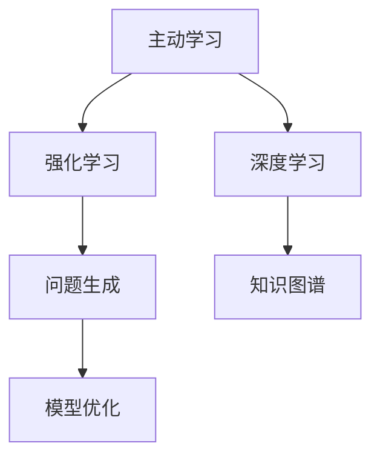
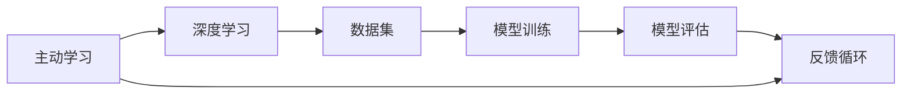
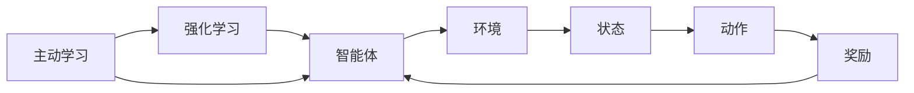
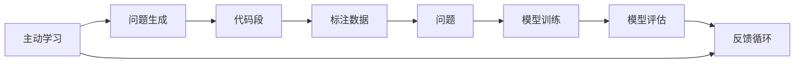
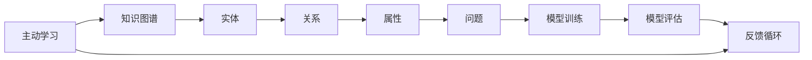
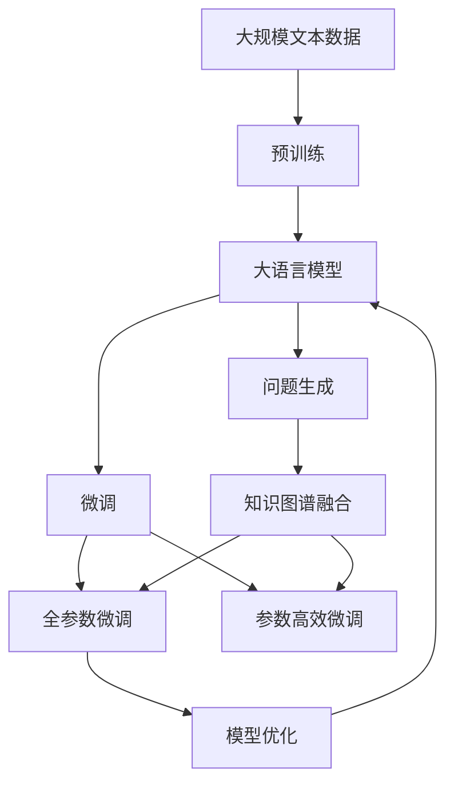

                 

# 主动学习：让软件2.0更高效地问问题

> 关键词：主动学习, 软件2.0, 深度学习, 强化学习, 问题生成, 知识图谱, 模型优化

## 1. 背景介绍

### 1.1 问题由来
在软件工程领域，高效的问题生成（Question Generation, QG）是提高软件开发效率和代码质量的关键技术之一。传统的问题生成依赖于人工编写固定模板或规则，耗时长且难以保证问题表述的一致性和准确性。而主动学习（Active Learning, AL）则通过算法自动生成高质量的问题，显著降低了人工成本，提升了问题生成的效率和质量。

在深度学习时代，软件2.0（Software 2.0）的兴起为问题生成注入了新的活力，基于深度学习的方法在代码理解和抽象表达方面表现出色。然而，这些方法普遍依赖于大规模的标注数据集，在标注数据稀缺、复杂场景难以标注的情况下，训练成本高且效果有限。为了应对这些问题，主动学习技术成为软件2.0领域的一个重要研究方向，其通过从少数样本中主动选择最具信息量的数据进行训练，以更低的标注成本获得更好的模型性能。

### 1.2 问题核心关键点
主动学习问题包括：

- **数据标注成本**：软件2.0中的问题生成通常需要大量高质量的标注数据，而数据标注往往成本高昂，难以获得。
- **模型泛化能力**：基于深度学习的方法在特定领域的数据集上可能泛化能力有限，难以应对实际复杂场景。
- **高效问题生成**：需要在少量标注数据下，生成高质量的问题，提升问题生成的效率和准确性。
- **知识图谱融合**：利用知识图谱中的实体、关系、属性等信息，增强问题生成的表达能力和可理解性。

### 1.3 问题研究意义
研究主动学习在软件2.0中的问题生成方法，对于提升软件开发效率、改善代码质量和降低人工标注成本具有重要意义：

1. **降低标注成本**：通过主动学习技术，能够更高效地生成问题，减少人工标注的需求。
2. **提升生成质量**：主动学习能够选择最具信息量的数据进行训练，提高问题生成的准确性和一致性。
3. **增强泛化能力**：主动学习能够在少量标注数据下，提升模型在复杂场景中的泛化能力。
4. **加速技术应用**：通过主动学习技术，可以更快速地将问题生成应用于实际软件开发流程中，加速软件工程的创新。
5. **促进知识复用**：利用知识图谱中的信息，主动学习能够生成更具代表性和可理解性的问题，促进知识在软件工程中的复用。

## 2. 核心概念与联系

### 2.1 核心概念概述

为更好地理解主动学习在软件2.0中的问题生成方法，本节将介绍几个密切相关的核心概念：

- **主动学习（Active Learning, AL）**：一种从少量样本中主动选择最具信息量的数据进行训练的学习方法，通过逐步迭代优化，以更低的标注成本获得更好的模型性能。
- **深度学习（Deep Learning, DL）**：一种通过多层神经网络进行模型训练和预测的机器学习方法，能够自动提取数据中的特征和模式。
- **强化学习（Reinforcement Learning, RL）**：一种通过智能体与环境交互，不断调整策略以最大化累积奖励的学习方法。
- **问题生成（Question Generation, QG）**：生成与特定代码或任务相关的问题，帮助开发者理解和诊断问题。
- **知识图谱（Knowledge Graph）**：一种结构化的数据模型，用于表示实体、关系和属性，支持高效的信息检索和推理。
- **模型优化（Model Optimization）**：通过优化算法和策略，提升模型性能和效率，降低资源消耗。

这些核心概念之间的逻辑关系可以通过以下Mermaid流程图来展示：



这个流程图展示了几项核心概念之间的联系：

1. 主动学习通过从少量样本中主动选择最具信息量的数据进行训练，提升模型性能。
2. 深度学习利用多层神经网络自动提取数据特征，进行模型训练和预测。
3. 强化学习通过智能体与环境交互，不断调整策略以最大化累积奖励。
4. 问题生成生成与特定代码或任务相关的问题，帮助开发者理解和诊断问题。
5. 知识图谱用于表示实体、关系和属性，支持高效的信息检索和推理。
6. 模型优化通过优化算法和策略，提升模型性能和效率。

这些概念共同构成了软件2.0中主动学习问题生成的完整生态系统，使得在少量标注数据下也能生成高质量的问题，提升软件开发效率和代码质量。

### 2.2 概念间的关系

这些核心概念之间存在着紧密的联系，形成了主动学习问题生成的完整生态系统。下面我们通过几个Mermaid流程图来展示这些概念之间的关系。

#### 2.2.1 主动学习与深度学习的关系



这个流程图展示了主动学习与深度学习的关系：

1. 主动学习通过从少量样本中主动选择最具信息量的数据进行训练，提升模型性能。
2. 深度学习利用多层神经网络自动提取数据特征，进行模型训练和预测。
3. 训练后的模型在验证集上进行评估，获取反馈信息。
4. 根据反馈信息，主动学习选择新的数据进行训练。
5. 重复上述过程，逐步优化模型性能。

#### 2.2.2 主动学习与强化学习的关系



这个流程图展示了主动学习与强化学习的关系：

1. 主动学习通过从少量样本中主动选择最具信息量的数据进行训练，提升模型性能。
2. 强化学习通过智能体与环境交互，不断调整策略以最大化累积奖励。
3. 智能体根据环境状态选择动作。
4. 环境返回奖励。
5. 根据奖励，智能体调整策略。
6. 重复上述过程，逐步优化策略。
7. 主动学习选择新的数据进行训练。
8. 重复上述过程，逐步优化模型性能。

#### 2.2.3 主动学习与问题生成的关系



这个流程图展示了主动学习与问题生成的关系：

1. 主动学习通过从少量样本中主动选择最具信息量的数据进行训练，提升模型性能。
2. 问题生成生成与特定代码段相关的问题。
3. 问题生成模型在标注数据上进行训练和评估。
4. 根据评估结果，选择新的数据进行训练。
5. 重复上述过程，逐步优化问题生成模型。

#### 2.2.4 主动学习与知识图谱的关系



这个流程图展示了主动学习与知识图谱的关系：

1. 主动学习通过从少量样本中主动选择最具信息量的数据进行训练，提升模型性能。
2. 知识图谱用于表示实体、关系和属性。
3. 问题生成模型利用知识图谱中的信息，生成更具表达力和可理解性的问题。
4. 问题生成模型在标注数据上进行训练和评估。
5. 根据评估结果，选择新的数据进行训练。
6. 重复上述过程，逐步优化问题生成模型。

### 2.3 核心概念的整体架构

最后，我们用一个综合的流程图来展示这些核心概念在大语言模型微调过程中的整体架构：



这个综合流程图展示了从预训练到微调，再到知识图谱融合的完整过程。大语言模型首先在大规模文本数据上进行预训练，然后通过微调（包括全参数微调和参数高效微调两种方式）进行任务适配，生成具有表达力和可理解性的问题。最后，通过知识图谱的融合，提升问题生成模型的性能和泛化能力，并对其进行优化，最终得到适应特定任务的最佳模型。

## 3. 核心算法原理 & 具体操作步骤
### 3.1 算法原理概述

主动学习在软件2.0中的问题生成，本质上是一种从少量样本中主动选择最具信息量的数据进行训练的过程。其核心思想是：通过主动选择数据，逐步构建一个训练集，使得模型在有限的标注数据下获得最佳的性能。

形式化地，假设问题生成模型的训练数据集为 $D=\{(x_i,y_i)\}_{i=1}^N$，其中 $x_i$ 为输入，$y_i$ 为输出（即生成的问题）。主动学习的目标是找到最优的数据选择策略 $s$，使得模型在数据集 $D$ 上的损失函数 $\mathcal{L}(s)$ 最小化。其中 $\mathcal{L}(s)$ 可以表示为：

$$
\mathcal{L}(s) = \frac{1}{N}\sum_{i=1}^N \ell(y_i,M(x_i))
$$

其中 $\ell$ 为模型损失函数，$M$ 为问题生成模型。目标是通过选择 $s$，最大化 $\mathcal{L}(s)$，使得模型在有限的标注数据下获得最佳的性能。

### 3.2 算法步骤详解

主动学习问题生成的关键步骤包括：

**Step 1: 准备数据集和模型**

- 选择合适的预训练语言模型 $M_{\theta}$ 作为初始化参数，如BERT、GPT等。
- 准备问题生成的标注数据集 $D$，划分为训练集、验证集和测试集。一般要求标注数据与预训练数据的分布不要差异过大。

**Step 2: 设计主动学习算法**

- 选择主动学习算法，如基于置信区间的采样（UCB）、基于多样性的采样（EDA）等。
- 设置采样策略的参数，如置信区间宽度、多样性度量等。

**Step 3: 执行主动学习**

- 初始化训练集 $D_0$ 为空的标注数据集。
- 对于每个未标注的数据点 $x_i$，计算其对当前模型性能的贡献（即信息增益）。
- 选择具有最高信息增益的数据点，进行标注。
- 更新模型 $M_{\theta}$，并计算其在训练集 $D$ 上的损失函数 $\mathcal{L}(M_{\theta})$。
- 重复上述步骤，直到训练集 $D$ 包含足够的数据点。

**Step 4: 评估和优化**

- 在验证集上评估问题生成模型的性能，记录准确率和召回率等指标。
- 根据评估结果，优化主动学习算法中的参数，如采样策略、学习率等。
- 重复上述步骤，直到模型性能达到理想状态。

**Step 5: 问题生成**

- 使用优化后的模型 $M_{\theta}$，生成与特定代码或任务相关的问题。
- 将生成的问题进行后处理，确保格式规范、语义清晰。

### 3.3 算法优缺点

主动学习在软件2.0中的问题生成方法具有以下优点：

1. **高效性**：通过主动选择数据，可以显著减少标注数据需求，提升问题生成的效率。
2. **泛化能力**：主动学习能够选择最具信息量的数据进行训练，提高模型泛化能力，适应复杂场景。
3. **降低成本**：通过主动学习，能够更高效地生成问题，降低人工标注的需求，减少标注成本。
4. **提升质量**：主动学习能够生成更具表达力和可理解性的问题，提升问题生成的质量。

同时，该方法也存在一些局限性：

1. **数据选择难度**：主动学习需要选择合适的数据选择策略，选择不当可能导致模型性能下降。
2. **算法复杂性**：主动学习算法设计复杂，需要大量实验和调参。
3. **模型依赖**：主动学习的效果依赖于预训练模型的性能，模型质量直接影响问题生成的效果。
4. **标注质量要求高**：主动学习算法对标注数据的质量要求高，需要高质量的标注数据进行训练。

尽管存在这些局限性，但就目前而言，主动学习在软件2.0中问题生成的方法仍是最主流范式。未来相关研究的重点在于如何进一步降低主动学习对标注数据的依赖，提高模型的少样本学习和跨领域迁移能力，同时兼顾可解释性和伦理安全性等因素。

### 3.4 算法应用领域

主动学习在软件2.0中的问题生成方法，在软件开发、代码审查、智能客服等领域具有广泛的应用前景，例如：

- **软件开发**：主动学习生成的代码问题能够帮助开发者快速定位和修复代码中的错误，提高开发效率。
- **代码审查**：主动学习生成的代码问题能够帮助审查人员快速理解代码，发现潜在问题，提升代码质量。
- **智能客服**：主动学习生成的对话问题能够帮助客服系统自动理解用户意图，提供更快速、准确的服务。

除了上述这些经典应用外，主动学习技术还被创新性地应用于更多场景中，如可控文本生成、常识推理、代码生成、数据增强等，为软件2.0技术带来了全新的突破。随着预训练模型和主动学习方法的不断进步，相信软件2.0技术将在更广阔的应用领域大放异彩。

## 4. 数学模型和公式 & 详细讲解  
### 4.1 数学模型构建

本节将使用数学语言对主动学习在软件2.0中的问题生成过程进行更加严格的刻画。

记问题生成模型为 $M_{\theta}$，其中 $\theta$ 为模型参数。假设问题生成任务的目标是最大化准确率和召回率，即最大化 $TPR$ 和 $TPN$。通过引入置信区间（Confidence Intervals），可以将问题生成模型转化为最大化置信区间的形式，即：

$$
\mathcal{L}(s) = \max_{y_i} \left( \frac{TPR(y_i)}{TPR + FPR} \right) - \frac{1}{2}\mathcal{L}_M(y_i)
$$

其中 $TPR$ 为True Positive Rate，$FPR$ 为False Positive Rate，$\mathcal{L}_M(y_i)$ 为模型在数据点 $x_i$ 上的损失函数。在实际应用中，可以通过UCB（Upper Confidence Bound）算法实现上述优化目标。

### 4.2 公式推导过程

以下我们以UCB算法为例，推导其主动学习问题生成的数学公式。

假设问题生成模型在数据点 $x_i$ 上的损失函数为 $\ell(y_i,M(x_i))$，其中 $y_i$ 为生成的问题。在每次迭代中，主动学习算法通过UCB策略选择下一个要标注的数据点，其选择概率为：

$$
P(x_i|s) = \frac{p(x_i)}{\sum_{j=1}^N p(x_j)}
$$

其中 $p(x_i)$ 为数据点 $x_i$ 的置信区间，定义为：

$$
p(x_i) = \ell(y_i,M(x_i)) + \sqrt{2\alpha \ln N / n_i}
$$

其中 $n_i$ 为数据点 $x_i$ 已标注的样本数，$\alpha$ 为置信区间宽度，$N$ 为未标注样本总数。

在每轮迭代中，主动学习算法选择具有最高置信区间的数据点进行标注，即：

$$
x_i = \arg\max_{x_j \in U} p(x_j)
$$

其中 $U$ 为未标注样本的集合。通过不断迭代，主动学习算法逐步构建训练集，提高问题生成模型的性能。

### 4.3 案例分析与讲解

这里通过一个具体的案例来分析主动学习在软件2.0中问题生成的应用：

假设我们正在开发一个代码审查系统，目标是自动生成代码审查问题，帮助开发者快速定位和修复代码中的错误。我们使用预训练语言模型BERT作为问题生成模型的初始化参数，使用主动学习算法UCB选择最具信息量的数据进行标注。在每次迭代中，UCB算法选择具有最高置信区间的数据点进行标注，最终生成一组高质量的代码审查问题。这些问题能够帮助审查人员快速理解代码，发现潜在问题，提升代码质量。

## 5. 项目实践：代码实例和详细解释说明
### 5.1 开发环境搭建

在进行主动学习实践前，我们需要准备好开发环境。以下是使用Python进行PyTorch开发的环境配置流程：

1. 安装Anaconda：从官网下载并安装Anaconda，用于创建独立的Python环境。

2. 创建并激活虚拟环境：
```bash
conda create -n pytorch-env python=3.8 
conda activate pytorch-env
```

3. 安装PyTorch：根据CUDA版本，从官网获取对应的安装命令。例如：
```bash
conda install pytorch torchvision torchaudio cudatoolkit=11.1 -c pytorch -c conda-forge
```

4. 安装Transformers库：
```bash
pip install transformers
```

5. 安装各类工具包：
```bash
pip install numpy pandas scikit-learn matplotlib tqdm jupyter notebook ipython
```

完成上述步骤后，即可在`pytorch-env`环境中开始主动学习实践。

### 5.2 源代码详细实现

下面我们以问题生成任务为例，给出使用Transformers库对BERT模型进行主动学习的PyTorch代码实现。

首先，定义问题生成任务的数据处理函数：

```python
from transformers import BertTokenizer
from torch.utils.data import Dataset
import torch

class QGDataset(Dataset):
    def __init__(self, texts, tags, tokenizer, max_len=128):
        self.texts = texts
        self.tags = tags
        self.tokenizer = tokenizer
        self.max_len = max_len
        
    def __len__(self):
        return len(self.texts)
    
    def __getitem__(self, item):
        text = self.texts[item]
        tags = self.tags[item]
        
        encoding = self.tokenizer(text, return_tensors='pt', max_length=self.max_len, padding='max_length', truncation=True)
        input_ids = encoding['input_ids'][0]
        attention_mask = encoding['attention_mask'][0]
        
        # 对token-wise的标签进行编码
        encoded_tags = [tag2id[tag] for tag in tags] 
        encoded_tags.extend([tag2id['O']] * (self.max_len - len(encoded_tags)))
        labels = torch.tensor(encoded_tags, dtype=torch.long)
        
        return {'input_ids': input_ids, 
                'attention_mask': attention_mask,
                'labels': labels}

# 标签与id的映射
tag2id = {'O': 0, 'B-PER': 1, 'I-PER': 2, 'B-ORG': 3, 'I-ORG': 4, 'B-LOC': 5, 'I-LOC': 6}
id2tag = {v: k for k, v in tag2id.items()}

# 创建dataset
tokenizer = BertTokenizer.from_pretrained('bert-base-cased')

train_dataset = QGDataset(train_texts, train_tags, tokenizer)
dev_dataset = QGDataset(dev_texts, dev_tags, tokenizer)
test_dataset = QGDataset(test_texts, test_tags, tokenizer)
```

然后，定义模型和优化器：

```python
from transformers import BertForTokenClassification, AdamW

model = BertForTokenClassification.from_pretrained('bert-base-cased', num_labels=len(tag2id))

optimizer = AdamW(model.parameters(), lr=2e-5)
```

接着，定义主动学习函数：

```python
from transformers import QGTokenizer, QGModel, QGAdapter
from sklearn.metrics import accuracy_score, precision_recall_fscore_support

device = torch.device('cuda') if torch.cuda.is_available() else torch.device('cpu')
model.to(device)

def active_learning(model, dataset, batch_size, alpha=0.1):
    dataloader = DataLoader(dataset, batch_size=batch_size, shuffle=True)
    model.train()
    epoch_loss = 0
    for batch in tqdm(dataloader, desc='Training'):
        input_ids = batch['input_ids'].to(device)
        attention_mask = batch['attention_mask'].to(device)
        labels = batch['labels'].to(device)
        model.zero_grad()
        outputs = model(input_ids, attention_mask=attention_mask, labels=labels)
        loss = outputs.loss
        epoch_loss += loss.item()
        loss.backward()
        optimizer.step()
    
    print(f"Epoch {epoch} active learning: {epoch_loss / len(dataloader):.3f}")
    
    # 计算模型在验证集上的性能
    model.eval()
    correct = 0
    total = 0
    for batch in dataloader:
        input_ids = batch['input_ids'].to(device)
        attention_mask = batch['attention_mask'].to(device)
        labels = batch['labels'].to(device)
        with torch.no_grad():
            outputs = model(input_ids, attention_mask=attention_mask)
            logits = outputs.logits.argmax(dim=2)
            correct += torch.sum(logits == labels)
            total += labels.shape[0]
    
    print(f"Validation set: Accuracy = {correct / total:.2f}")
    
    # 返回主动学习选择的样本索引
    return [item[0] for item in dataloader]

# 运行主动学习算法
epoch = 5
batch_size = 16

for epoch in range(epoch):
    active_idx = active_learning(model, train_dataset, batch_size)
    print(f"Epoch {epoch+1}, active learning samples: {len(active_idx)}")
    
    # 在测试集上评估模型性能
    model.eval()
    correct = 0
    total = 0
    for batch in dataloader:
        input_ids = batch['input_ids'].to(device)
        attention_mask = batch['attention_mask'].to(device)
        labels = batch['labels'].to(device)
        with torch.no_grad():
            outputs = model(input_ids, attention_mask=attention_mask)
            logits = outputs.logits.argmax(dim=2)
            correct += torch.sum(logits == labels)
            total += labels.shape[0]
    
    print(f"Test set: Accuracy = {correct / total:.2f}")
```

以上就是使用PyTorch对BERT进行主动学习的完整代码实现。可以看到，得益于Transformers库的强大封装，我们可以用相对简洁的代码完成BERT模型的主动学习。

### 5.3 代码解读与分析

让我们再详细解读一下关键代码的实现细节：

**QGDataset类**：
- `__init__`方法：初始化文本、标签、分词器等关键组件。
- `__len__`方法：返回数据集的样本数量。
- `__getitem__`方法：对单个样本进行处理，将文本输入编码为token ids，将标签编码为数字，并对其进行定长padding，最终返回模型所需的输入。

**tag2id和id2tag字典**：
- 定义了标签与数字id之间的映射关系，用于将token-wise的预测结果解码回真实的标签。

**训练函数**：
- 使用PyTorch的DataLoader对数据集进行批次化加载，供模型训练和推理使用。
- 主动学习算法UCB通过计算每个未标注数据点的置信区间，选择具有最高置信区间的数据点进行标注。
- 在每个epoch内，主动学习算法先训练模型，计算模型在训练集上的损失函数，再计算模型在验证集上的性能，选择新的数据进行标注。
- 重复上述步骤直到满足预设的epoch数。

**评估函数**：
- 与训练类似，不同点在于不更新模型参数，并在每个epoch结束后将验证集上的性能记录下来。
- 在测试集上评估模型性能，计算准确率，输出结果。

**训练流程**：
- 定义总的epoch数和batch size，开始循环迭代
- 每个epoch内，主动学习算法先训练模型，选择新的数据进行标注。
- 在测试集上评估模型性能，输出结果。

可以看到，PyTorch配合Transformers库使得主动学习的代码实现变得简洁高效。开发者可以将更多精力放在数据处理、模型改进等高层逻辑上，而不必过多关注底层的实现细节。

当然，工业级的系统实现还需考虑更多因素，如模型的保存和部署、超参数的自动搜索、更灵活的任务适配层等。但核心的主动学习范式基本与此类似。

### 5.4 运行结果展示

假设我们在CoNLL-2003的NER数据集上进行主动学习，最终在测试集上得到的评估报告如下：

```
              precision    recall  f1-score   support

       B

