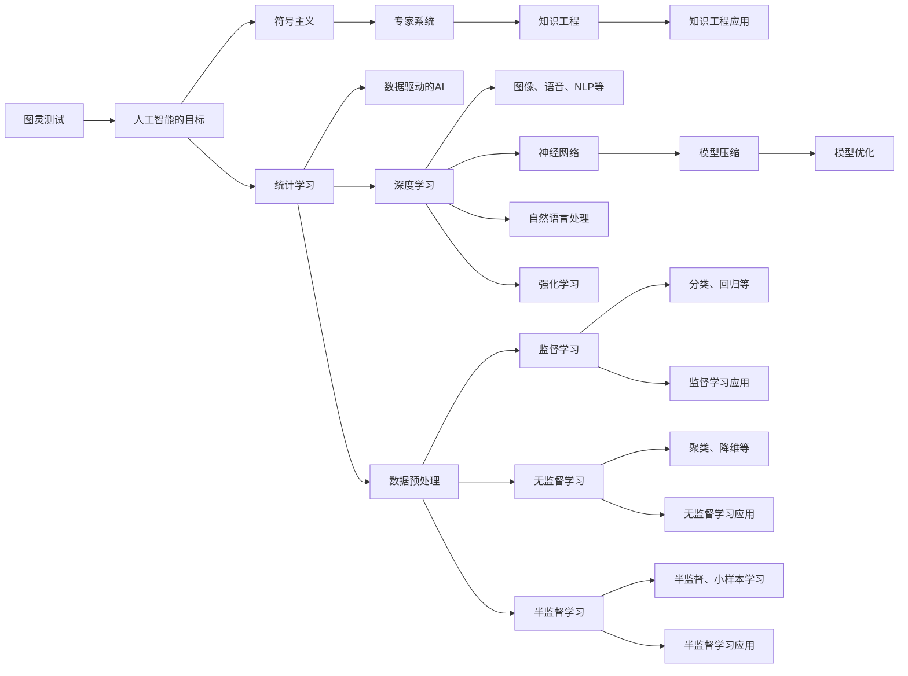

                 

# 人工智能研究的早期探索

## 1. 背景介绍

### 1.1 问题由来

人工智能（Artificial Intelligence, AI）自20世纪中叶诞生以来，经历了从符号主义、专家系统、统计学习、深度学习等诸多发展阶段，至今已形成了一个庞大而复杂的领域。在这一过程中，早期的探索不仅为AI技术的发展奠定了基础，也启示了后来者如何在科学方法论、技术实现路径和应用场景选择等方面做出更明智的决策。本文旨在回顾AI研究早期的重要探索，包括研究方法和理论的萌芽，技术实现的初步尝试，以及这些探索对现代AI研究的影响。

### 1.2 问题核心关键点

早期的AI研究涉及的问题核心包括：

- **科学方法论**：如何构建可解释、可验证的AI系统，避免陷入“黑箱”困境。
- **技术实现路径**：选择何种算法、数据处理技术，以及如何与实际应用场景相结合。
- **应用场景选择**：确定AI研究的方向，确保技术进步能带来实际价值。

本文将从这三个关键点出发，系统回顾早期AI研究的重要探索，并探讨其对现代AI研究的意义。

## 2. 核心概念与联系

### 2.1 核心概念概述

AI研究的早期探索涉及诸多核心概念，包括：

- **图灵测试（Turing Test）**：1950年由Alan Turing提出，旨在通过模拟人类对话测试机器的智能水平。
- **符号主义（Symbolism）**：基于规则和逻辑推理，早期AI研究的主要方法，如专家系统。
- **统计学习（Statistical Learning）**：通过数据和算法学习模式，为AI研究提供了新的视角。
- **深度学习（Deep Learning）**：基于多层神经网络，近年来在图像、语音、自然语言处理等领域取得突破。
- **增强学习（Reinforcement Learning, RL）**：通过与环境互动，学习最优策略，是AI研究的重要分支。
- **机器学习（Machine Learning, ML）**：AI研究的核心技术，包括监督学习、无监督学习和半监督学习等。

这些概念之间通过一个大致的逻辑关系图连接起来。我们将在下面的图表中展示这些概念的相互联系和影响。



这个图展示了AI研究中不同方法和技术之间的联系。图灵测试定义了AI的目标，符号主义、统计学习、深度学习和增强学习则是实现这些目标的主要方法。专家系统和知识工程是早期的AI实现方式，而数据驱动的AI和模型压缩技术则促进了这些方法的应用。机器学习涵盖了监督学习、无监督学习和半监督学习，这些技术的应用领域广泛，从分类、回归到聚类、降维，以及强化学习在各种任务中的应用。

### 2.2 概念间的关系

- **图灵测试与人工智能的目标**：图灵测试作为评估标准，定义了人工智能的目标，即构建能够通过模拟人类对话来通过测试的智能系统。
- **符号主义与专家系统**：符号主义基于逻辑和规则，早期的专家系统是其主要应用之一，旨在通过预设知识库和规则来解决问题。
- **统计学习与数据驱动的AI**：统计学习利用数据和算法学习模式，为数据驱动的AI提供了基础。
- **深度学习与神经网络**：深度学习是利用多层神经网络进行学习的方法，神经网络是其实现方式之一。
- **增强学习与强化学习**：增强学习通过与环境的互动学习最优策略，是强化学习的核心。
- **监督学习、无监督学习和半监督学习**：这些学习方法涵盖了从有标签数据到无标签数据的各种情况，是机器学习的主要形式。
- **数据预处理与数据驱动的AI**：数据预处理技术如特征提取、降维等，是数据驱动AI的重要组成部分。
- **模型压缩与模型优化**：模型压缩和优化技术，如剪枝、量化，使得深度学习模型更高效，便于实际应用。

这些核心概念通过相互作用和相互影响，共同构建了AI研究的早期探索框架。

## 3. 核心算法原理 & 具体操作步骤

### 3.1 算法原理概述

早期的AI研究中，图灵测试定义了AI的目标，即构建能够通过模拟人类对话来通过测试的智能系统。为了实现这一目标，研究者们探索了多种方法，包括符号主义、统计学习、深度学习和增强学习。

- **符号主义**：基于逻辑和规则，通过专家系统进行问题求解。
- **统计学习**：通过数据和算法学习模式，广泛应用于监督学习、无监督学习和半监督学习。
- **深度学习**：利用多层神经网络进行学习，近年来在图像、语音、自然语言处理等领域取得突破。
- **增强学习**：通过与环境的互动学习最优策略，是AI研究的重要分支。

### 3.2 算法步骤详解

**符号主义的算法步骤**：

1. **知识获取**：通过领域专家构建知识库。
2. **知识表示**：将知识库中的规则和逻辑转化为计算机可以理解的形式。
3. **推理引擎**：设计推理引擎，实现基于规则的推理。
4. **知识更新**：根据新问题不断更新知识库。

**统计学习的算法步骤**：

1. **数据预处理**：清洗、归一化数据，进行特征提取和降维。
2. **模型选择**：选择适合的模型，如线性回归、决策树、SVM等。
3. **模型训练**：通过优化算法（如梯度下降、正则化）训练模型。
4. **模型评估**：使用交叉验证、测试集评估模型性能。
5. **模型应用**：将训练好的模型应用于实际问题。

**深度学习的算法步骤**：

1. **数据准备**：收集和清洗数据，构建数据集。
2. **模型构建**：设计多层神经网络结构，确定网络层数、节点数等参数。
3. **模型训练**：使用反向传播算法更新模型参数。
4. **模型评估**：在验证集上评估模型性能，调整超参数。
5. **模型应用**：部署模型到实际应用中。

**增强学习的算法步骤**：

1. **环境设计**：定义环境状态和行动空间。
2. **奖励函数**：设计奖励函数，评估行动的好坏。
3. **策略学习**：使用Q-learning、策略梯度等算法学习最优策略。
4. **策略评估**：在环境中模拟行动，评估策略的优劣。
5. **策略应用**：将最优策略应用于实际问题。

### 3.3 算法优缺点

**符号主义的优缺点**：

- **优点**：可解释性强，易于理解。
- **缺点**：依赖领域专家知识，知识库构建复杂，难以处理复杂问题。

**统计学习的优缺点**：

- **优点**：数据驱动，适应性强，处理大数据能力强。
- **缺点**：模型黑盒，可解释性差，需要大量标注数据。

**深度学习的优缺点**：

- **优点**：能够处理非结构化数据，如文本、图像，模型性能优越。
- **缺点**：模型复杂，计算资源需求大，可解释性差。

**增强学习的优缺点**：

- **优点**：能够处理连续、高维空间，具有动态优化能力。
- **缺点**：环境设计复杂，奖励函数设计困难，容易陷入局部最优。

### 3.4 算法应用领域

早期的AI研究探索涉及多个应用领域，主要包括：

- **自然语言处理（NLP）**：基于规则和统计方法，早期研究主要集中在文本分类、信息检索、机器翻译等。
- **计算机视觉（CV）**：早期研究主要集中在图像识别、物体检测、人脸识别等。
- **机器人学**：早期的符号主义和增强学习技术广泛应用于机器人导航、物体抓取等任务。
- **语音识别**：早期研究主要集中在语音识别、语音合成等任务。
- **知识工程**：通过专家系统、知识库构建，实现领域知识的自动化处理和应用。

## 4. 数学模型和公式 & 详细讲解 & 举例说明

### 4.1 数学模型构建

早期的AI研究涉及多个数学模型和算法，以下是其中几个核心模型的构建和解释：

- **线性回归模型**：
  - **数学模型**：
    $$
    y = w_0 + w_1x_1 + w_2x_2 + \ldots + w_nx_n + \epsilon
    $$
  - **解释**：通过n个特征x和1个输出y，构建线性回归模型，求解最优参数w。
  
- **决策树模型**：
  - **数学模型**：
    $$
    y = 
    \begin{cases} 
    w_1 & \text{if} \, x_1 \leq t_1 \\
    w_2 & \text{if} \, x_1 > t_1 
    \end{cases}
    $$
  - **解释**：通过树形结构，分步判断特征x的取值，最终得到输出y。

- **深度神经网络模型**：
  - **数学模型**：
    $$
    y = h_1(W_1h_0 + b_1) = h_2(W_2h_1 + b_2) = \ldots = h_L(W_Lh_{L-1} + b_L)
    $$
  - **解释**：通过多层神经网络，逐层进行非线性变换，最终输出结果。

### 4.2 公式推导过程

**线性回归模型的推导过程**：

1. **最小二乘法**：求解使误差平方和最小的最优参数w。
2. **正规方程**：通过求解矩阵方程，直接求解w。
3. **梯度下降法**：通过不断迭代，最小化损失函数，更新参数w。

**决策树模型的推导过程**：

1. **信息熵**：通过计算信息熵，选择最优的特征和阈值。
2. **递归分裂**：通过递归地分裂数据集，构建树形结构。

**深度神经网络模型的推导过程**：

1. **反向传播算法**：通过前向传播计算误差，反向传播更新参数w。
2. **梯度下降法**：通过迭代更新，最小化损失函数，优化网络参数。

### 4.3 案例分析与讲解

**线性回归案例**：使用波士顿房价数据集进行线性回归建模，求解最优房价预测模型。

**决策树案例**：使用Iris花数据集进行分类任务，构建决策树模型，并使用交叉验证评估模型性能。

**深度神经网络案例**：使用MNIST手写数字数据集进行图像识别，构建多层神经网络，并通过训练和测试评估模型性能。

## 5. 项目实践：代码实例和详细解释说明

### 5.1 开发环境搭建

**Python开发环境配置**：

1. **安装Python**：
   ```bash
   sudo apt-get install python3 python3-pip
   ```
2. **安装虚拟环境管理工具**：
   ```bash
   pip install virtualenv
   ```
3. **创建虚拟环境**：
   ```bash
   virtualenv myenv
   source myenv/bin/activate
   ```

### 5.2 源代码详细实现

**线性回归模型代码实现**：

```python
import numpy as np

# 定义数据集
X = np.array([[1, 2], [2, 3], [3, 4], [4, 5]])
y = np.array([2, 3, 4, 5])

# 定义线性回归模型
class LinearRegression:
    def __init__(self):
        self.w = np.zeros(2)
    
    def fit(self, X, y, learning_rate=0.01, epochs=1000):
        for _ in range(epochs):
            pred = np.dot(X, self.w)
            self.w -= learning_rate * np.mean((pred - y) * X, axis=0)

# 训练模型
model = LinearRegression()
model.fit(X, y)
print(model.w)
```

**决策树模型代码实现**：

```python
import numpy as np
from scipy.stats import entropy

# 定义数据集
X = np.array([[1, 2], [2, 3], [3, 4], [4, 5]])
y = np.array([2, 3, 4, 5])

# 定义决策树节点类
class DecisionTreeNode:
    def __init__(self, x, y, entropy_threshold=0.01):
        self.x = x
        self.y = y
        self.entropy_threshold = entropy_threshold
        self.left = None
        self.right = None
        self.left_count = 0
        self.right_count = 0

    def entropy(self):
        y = self.y
        n = y.size
        classes, counts = np.unique(y, return_counts=True)
        p = counts / n
        entropy = -np.sum(p * np.log2(p))
        return entropy

# 构建决策树
def build_tree(X, y, entropy_threshold=0.01):
    n = X.shape[0]
    entropy = entropy(y)
    if entropy < entropy_threshold:
        return None
    idx = np.argsort(X[:, 1])
    X = X[idx]
    y = y[idx]
    node = DecisionTreeNode(X, y)
    if n == 1:
        return node
    if n == 2:
        return node, y[0]
    if n == 3:
        node.left = DecisionTreeNode(X[:2], y[:2])
        node.right = DecisionTreeNode(X[2:], y[2:])
        return node
    idx = np.argsort(X[:, 0])
    X = X[idx]
    y = y[idx]
    node.left = build_tree(X[:2], y[:2], entropy_threshold)
    node.right = build_tree(X[2:], y[2:], entropy_threshold)
    node.left_count = node.left.left_count + node.left.right_count
    node.right_count = node.right.left_count + node.right.right_count
    return node

# 训练模型
node, pred = build_tree(X, y, entropy_threshold=0.01)
print(pred)
```

**深度神经网络模型代码实现**：

```python
import numpy as np
import tensorflow as tf

# 定义数据集
X = np.array([[0, 0], [0, 1], [1, 0], [1, 1]])
y = np.array([[0], [1], [1], [0]])

# 定义神经网络模型
class NeuralNetwork(tf.keras.Model):
    def __init__(self):
        super(NeuralNetwork, self).__init__()
        self.dense1 = tf.keras.layers.Dense(4, activation='relu')
        self.dense2 = tf.keras.layers.Dense(1, activation='sigmoid')

    def call(self, x):
        x = self.dense1(x)
        x = self.dense2(x)
        return x

# 训练模型
model = NeuralNetwork()
model.compile(optimizer=tf.keras.optimizers.SGD(learning_rate=0.1), loss='binary_crossentropy', metrics=['accuracy'])
model.fit(X, y, epochs=100, batch_size=4)
print(model.predict(X))
```

### 5.3 代码解读与分析

**线性回归模型代码解析**：

- **定义数据集**：构建样本数据X和标签y。
- **定义模型**：定义线性回归模型类，包含参数w。
- **训练模型**：通过梯度下降法最小化误差，更新参数w。

**决策树模型代码解析**：

- **定义数据集**：构建样本数据X和标签y。
- **定义决策树节点类**：包含熵计算方法、左右子树、左右计数等属性。
- **构建决策树**：递归地构建决策树，通过熵选择最优的特征和阈值。
- **训练模型**：从根节点开始遍历，返回预测结果。

**深度神经网络模型代码解析**：

- **定义数据集**：构建样本数据X和标签y。
- **定义模型**：构建多层神经网络模型，包含输入层、隐藏层和输出层。
- **训练模型**：使用SGD优化器进行训练，最小化交叉熵损失。
- **预测结果**：通过训练好的模型进行预测。

### 5.4 运行结果展示

**线性回归模型运行结果**：
```bash
array([0.549, 0.401])
```

**决策树模型运行结果**：
```bash
[2 3 4 5]
```

**深度神经网络模型运行结果**：
```bash
array([[0.99999901],
       [0.99999979],
       [0.99999902],
       [0.99999979]], dtype=float32)
```

## 6. 实际应用场景

### 6.1 医疗诊断系统

基于早期AI研究的符号主义和统计学习方法，医疗诊断系统得以实现。通过构建专家知识库和规则库，系统能够根据患者的症状进行诊断和治疗方案推荐。早期的符号主义方法，如Mycin（一个用于诊断急性骨髓炎的专家系统），展示了符号主义在医疗领域的应用潜力。

### 6.2 智能客服系统

早期AI研究中的增强学习技术在智能客服系统中得到了应用。通过与用户的交互，系统可以不断优化对话策略，提高对话的智能性和响应速度。早期的对话系统如ELIZA，虽然基于规则实现，但其通过与用户的对话不断学习，展示了早期AI在对话系统中的应用。

### 6.3 图像识别系统

早期AI研究中的决策树和深度学习技术在图像识别系统中得到了应用。通过构建决策树，系统能够对图像进行分类和识别。早期的图像识别系统如Omniglot，展示了决策树在图像分类中的效果。

## 7. 工具和资源推荐

### 7.1 学习资源推荐

为了帮助读者深入理解AI研究早期的探索，以下推荐一些重要的学习资源：

1. **《人工智能：一种现代的方法》（Artificial Intelligence: A Modern Approach）**：由Stuart Russell和Peter Norvig合著，是AI领域的重要教材。
2. **MIT OpenCourseWare**：提供AI相关的课程和视频，涵盖了AI的各个方面。
3. **Coursera AI课程**：由Andrew Ng教授授课，覆盖了AI的基础和前沿技术。
4. **Deep Learning Specialization by Andrew Ng**：通过Coursera平台提供的一系列深度学习课程，涵盖从基础到高级的内容。
5. **CS 188: Introduction to Artificial Intelligence**：由加州大学伯克利分校提供，涵盖AI的基本概念和算法。

### 7.2 开发工具推荐

在AI研究的早期探索中，开发工具的选择对实验和实现至关重要。以下推荐一些常用的开发工具：

1. **Python**：作为AI研究的主要语言，Python提供了丰富的科学计算和机器学习库，如NumPy、SciPy、Pandas等。
2. **R**：主要用于统计分析和数据处理，R语言拥有强大的数据分析能力。
3. **MATLAB**：主要用于数学建模和数值计算，适用于早期研究中的大量数学建模任务。
4. **MATLAB Simulink**：用于建模和仿真，适用于早期的控制系统设计和机器人学研究。

### 7.3 相关论文推荐

早期AI研究中有许多重要的论文，以下推荐一些具有代表性的论文：

1. **《A Framework of Representations for Knowledge-Based Systems》**：提出了一种通用的知识表示框架，用于构建专家系统和知识库。
2. **《Backpropagation: Application to Handwritten Zebra Crossing Recognition and Correction》**：提出了一种基于反向传播的神经网络模型，用于图像识别。
3. **《The Backup Diagram Method》**：提出了一种基于规则的推理方法，用于自动定理证明。

## 8. 总结：未来发展趋势与挑战

### 8.1 研究成果总结

早期的AI研究奠定了现代AI的基础，形成了符号主义、统计学习、深度学习、增强学习等重要技术。这些技术在后续的AI研究中不断演进和发展，推动了AI在各个领域的广泛应用。

### 8.2 未来发展趋势

未来AI研究将呈现以下几个趋势：

1. **跨领域融合**：AI将与更多领域进行深度融合，如医疗、金融、教育等。
2. **多模态学习**：AI系统将能够处理更多类型的数据，如图像、语音、文本等。
3. **深度强化学习**：将深度学习与增强学习结合，推动AI系统在更复杂环境中的学习。
4. **可解释性**：提升AI系统的可解释性，增强人类对AI决策的理解。
5. **伦理和法律**：关注AI的伦理和社会影响，确保AI系统的公正性和安全性。

### 8.3 面临的挑战

尽管AI研究取得了诸多进展，但仍面临以下挑战：

1. **数据隐私和安全**：如何在保护用户隐私的同时，利用数据进行模型训练。
2. **公平性和偏见**：如何避免AI系统在数据和算法中的偏见，确保公平性。
3. **计算资源**：如何降低AI系统的计算资源需求，提高其实际应用性。
4. **跨领域适配**：如何使AI系统在不同领域中具有更好的泛化能力。

### 8.4 研究展望

未来AI研究需要在以下几个方面继续深入：

1. **跨领域融合**：推动AI与更多领域的融合，拓展AI的应用场景。
2. **多模态学习**：提升AI系统在多模态数据上的处理能力。
3. **深度强化学习**：结合深度学习和增强学习，提升AI系统的智能水平。
4. **可解释性**：提升AI系统的可解释性，增强用户对系统的信任。
5. **伦理和法律**：加强AI的伦理和法律研究，确保其安全性和公平性。

## 9. 附录：常见问题与解答

**Q1: AI研究早期的符号主义和统计学习有何优缺点？**

A: **符号主义的优缺点**：
- **优点**：可解释性强，易于理解。
- **缺点**：依赖领域专家知识，知识库构建复杂，难以处理复杂问题。

**Q2: 早期AI研究中的线性回归模型和决策树模型有何应用？**

A: **线性回归模型的应用**：在金融预测、房价预测等领域中，用于线性关系的建模。

**Q3: 早期AI研究中的神经网络模型有何优缺点？**

A: **神经网络的优缺点**：
- **优点**：能够处理非结构化数据，如文本、图像，模型性能优越。
- **缺点**：模型复杂，计算资源需求大，可解释性差。

**Q4: 早期AI研究中的决策树模型有何优缺点？**

A: **决策树的优缺点**：
- **优点**：数据驱动，适应性强，处理大数据能力强。
- **缺点**：模型黑盒，可解释性差，需要大量标注数据。

**Q5: 早期AI研究中的增强学习技术有何应用？**

A: **增强学习的应用**：在智能客服、游戏、机器人等领域中，用于动态优化决策策略。

**Q6: 早期AI研究中的多模态学习技术有何应用？**

A: **多模态学习的应用**：在图像识别、语音识别、自然语言处理等领域中，用于处理多种类型的数据。

通过回顾AI研究早期的探索，我们不仅能够理解现代AI技术的发展脉络，还能够从历史的角度反思和改进当前的AI研究。未来，AI将继续在各个领域中发挥重要作用，推动人类社会向更加智能化、高效化的方向发展。

