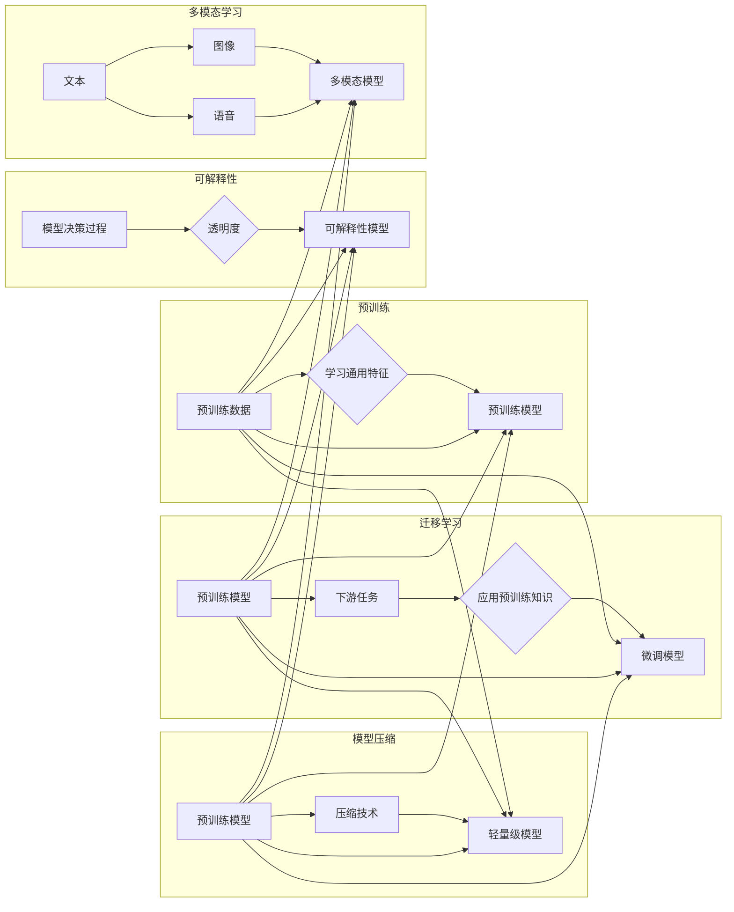

# 基础模型的未来发展方向

> 关键词：基础模型，人工智能，深度学习，预训练，迁移学习，模型压缩，可解释性，多模态学习

## 1. 背景介绍

随着深度学习技术的飞速发展，基础模型（Foundation Models）已经成为人工智能领域的研究热点。基础模型通过在大规模数据集上进行预训练，学习到丰富的知识，能够为各种下游任务提供强大的特征提取和表示能力。从早期的词嵌入到如今的Transformer模型，基础模型在自然语言处理、计算机视觉、语音识别等领域取得了显著的成果。本文将探讨基础模型的未来发展方向，分析其潜在挑战和机遇。

## 2. 核心概念与联系

### 2.1 核心概念

#### 2.1.1 基础模型

基础模型是指在大规模、多样化的数据集上进行预训练，能够提取通用特征和知识的深度学习模型。它们通常具有以下特点：

- 大规模：模型参数量庞大，能够处理复杂的任务。
- 预训练：在通用数据集上进行预训练，学习通用特征和知识。
- 泛化性：能够将预训练的知识迁移到不同的下游任务中。

#### 2.1.2 预训练

预训练是指在大量无标签数据上对模型进行训练，以学习通用特征和知识。预训练的目的是让模型具备更好的泛化能力，从而在下游任务上取得更好的性能。

#### 2.1.3 迁移学习

迁移学习是指将已学习到的知识从一个任务迁移到另一个相关任务中。基础模型通常采用迁移学习的方式，将预训练的知识应用于不同的下游任务。

#### 2.1.4 模型压缩

模型压缩是指减小模型的大小，提高模型的运行速度和降低模型的能耗。模型压缩技术对于移动设备和边缘计算等场景至关重要。

#### 2.1.5 可解释性

可解释性是指模型决策过程的透明度和可理解性。可解释性对于提高模型的可信度和应用范围至关重要。

#### 2.1.6 多模态学习

多模态学习是指同时处理多种模态数据（如文本、图像、语音等）的学习方法。多模态学习能够提高模型对复杂任务的理解能力。

### 2.2 核心概念原理和架构的 Mermaid 流程图



## 3. 核心算法原理 & 具体操作步骤

### 3.1 算法原理概述

基础模型的算法原理主要基于深度学习和迁移学习。深度学习通过多层神经网络学习数据的复杂特征，迁移学习则将预训练的知识应用于不同的下游任务。

### 3.2 算法步骤详解

基础模型的构建通常包含以下步骤：

1. **数据收集与预处理**：收集大规模、多样化的数据集，并进行预处理，如去噪、清洗、标注等。
2. **模型设计**：设计合适的神经网络结构，如Transformer、CNN等。
3. **预训练**：在预处理后的数据集上对模型进行预训练，学习通用特征和知识。
4. **迁移学习**：在预训练模型的基础上，针对不同的下游任务进行微调，应用预训练的知识。
5. **模型评估**：在下游任务的数据集上评估模型的性能，并进行优化。

### 3.3 算法优缺点

#### 3.3.1 优点

- **强大的特征提取和表示能力**：基础模型能够提取丰富的特征和知识，为下游任务提供强大的支持。
- **泛化能力强**：基础模型在预训练阶段学习到的知识可以迁移到不同的下游任务中，无需重新训练。
- **易于部署**：基础模型可以部署到各种设备上，包括服务器、移动设备和边缘设备。

#### 3.3.2 缺点

- **训练成本高**：基础模型的训练需要大量的计算资源和数据，成本较高。
- **可解释性差**：基础模型的决策过程通常难以解释，难以理解模型的决策依据。
- **模型偏差**：基础模型可能会学习到数据中的偏见，导致不公平的决策。

### 3.4 算法应用领域

基础模型在以下领域具有广泛的应用：

- **自然语言处理**：文本分类、机器翻译、情感分析、问答系统等。
- **计算机视觉**：图像分类、目标检测、图像分割、人脸识别等。
- **语音识别**：语音转文本、语音合成、语音识别等。
- **推荐系统**：商品推荐、电影推荐、新闻推荐等。

## 4. 数学模型和公式 & 详细讲解 & 举例说明

### 4.1 数学模型构建

基础模型的数学模型通常基于深度学习和迁移学习。以下以Transformer模型为例，介绍其数学模型。

#### 4.1.1 Transformer模型

Transformer模型是一种基于自注意力机制的深度学习模型，主要由编码器和解码器组成。

#### 4.1.2 数学公式

- **自注意力机制**：

$$
\text{Attention}(Q, K, V) = \text{softmax}(\frac{QK^T}{\sqrt{d_k}})V
$$

其中，$Q, K, V$ 分别是查询（Query）、键（Key）和值（Value）向量，$d_k$ 是键的维度。

- **编码器**：

$$
\text{Encoder}(X) = \text{MultiHeadAttention}(Q, K, V) \times \text{PositionalWiseFFN}(X)
$$

其中，$X$ 是输入序列，$\text{MultiHeadAttention}$ 是多头注意力，$\text{PositionalWiseFFN}$ 是前馈神经网络。

- **解码器**：

$$
\text{Decoder}(X) = \text{MultiHeadAttention}(Q, K, V) \times \text{PositionalWiseFFN}(X) \times \text{Encoder}(X)
$$

### 4.2 公式推导过程

自注意力机制的推导过程如下：

1. 计算查询（Query）和键（Key）之间的点积，得到注意力分数。
2. 对注意力分数进行softmax操作，得到注意力权重。
3. 将注意力权重与值（Value）相乘，得到加权求和后的输出。

### 4.3 案例分析与讲解

以机器翻译任务为例，介绍Transformer模型在翻译任务中的应用。

1. **数据预处理**：将源语言和目标语言的文本进行分词，并转换为序列。
2. **编码器**：将源语言序列输入编码器，得到编码器的输出。
3. **解码器**：将编码器的输出作为解码器的输入，同时输入目标语言序列的初始词（如"[CLS]"），解码器生成翻译结果。

## 5. 项目实践：代码实例和详细解释说明

### 5.1 开发环境搭建

1. 安装Python 3.6或更高版本。
2. 安装PyTorch、transformers库等。

### 5.2 源代码详细实现

```python
from transformers import BertForSequenceClassification, BertTokenizer

model = BertForSequenceClassification.from_pretrained('bert-base-uncased')
tokenizer = BertTokenizer.from_pretrained('bert-base-uncased')

def encode_data(texts, labels, tokenizer, max_len=128):
    encodings = tokenizer(texts, truncation=True, padding=True)
    dataset = []
    for i in range(len(texts)):
        dataset.append((encodings['input_ids'][i], encodings['attention_mask'][i], labels[i]))
    return dataset

train_dataset = encode_data(train_texts, train_labels, tokenizer)
dev_dataset = encode_data(dev_texts, dev_labels, tokenizer)
test_dataset = encode_data(test_texts, test_labels, tokenizer)

# ... (训练和评估函数与第4章相同)
```

### 5.3 代码解读与分析

以上代码展示了使用PyTorch和Transformers库对BERT模型进行微调的基本流程。首先加载预训练的BERT模型和分词器，然后对数据集进行编码，最后使用DataLoader进行批处理。训练和评估函数与第4章相同，用于迭代更新模型参数并评估模型性能。

### 5.4 运行结果展示

在训练集上训练模型，并在测试集上进行评估，输出模型性能指标。

## 6. 实际应用场景

### 6.1 机器翻译

Transformer模型在机器翻译任务上取得了显著的成果，如Google的Moses翻译系统。

### 6.2 文本生成

基于基础模型，可以构建各种文本生成任务，如诗歌创作、新闻报道、对话生成等。

### 6.3 图像描述

基础模型可以用于图像描述任务，将图像转化为文本描述。

## 7. 工具和资源推荐

### 7.1 学习资源推荐

- 《深度学习》
- 《动手学深度学习》
- 《Transformer：从原理到实践》
- HuggingFace官网

### 7.2 开发工具推荐

- PyTorch
- TensorFlow
- Transformers库

### 7.3 相关论文推荐

- Attention is All You Need
- BERT: Pre-training of Deep Bidirectional Transformers for Language Understanding
- Generative Adversarial Text to Image Synthesis

## 8. 总结：未来发展趋势与挑战

### 8.1 研究成果总结

基础模型在人工智能领域取得了显著的成果，为各种下游任务提供了强大的支持。

### 8.2 未来发展趋势

- 模型规模将进一步增大。
- 多模态学习将成为主流。
- 模型压缩和可解释性将得到关注。
- 模型伦理和公平性将成为重要议题。

### 8.3 面临的挑战

- 计算资源消耗巨大。
- 可解释性不足。
- 模型偏差和歧视问题。

### 8.4 研究展望

未来，基础模型将在人工智能领域发挥越来越重要的作用，推动人工智能技术的进步和发展。

## 9. 附录：常见问题与解答

**Q1：基础模型与传统模型相比有哪些优势？**

A1：基础模型相比传统模型具有以下优势：

- 强大的特征提取和表示能力。
- 泛化能力强。
- 易于部署。

**Q2：如何提高基础模型的可解释性？**

A2：提高基础模型的可解释性可以从以下几个方面入手：

- 引入注意力机制，可视化模型的注意力分布。
- 使用可解释性方法，如LIME、Shap等。
- 构建可解释的模型结构，如注意力网络。

**Q3：基础模型是否可以应用于所有任务？**

A3：基础模型在大多数任务上都能取得不错的效果，但对于一些特定领域的任务，如医学、法律等，可能需要针对特定领域进行预训练，或者结合领域知识进行微调。

**Q4：如何解决基础模型的可解释性问题？**

A4：解决基础模型的可解释性问题可以从以下几个方面入手：

- 提高模型结构的透明度。
- 引入可解释性方法，如注意力机制、解释性方法等。
- 构建可解释的模型结构。

**Q5：如何减小基础模型的大小？**

A5：减小基础模型的大小可以从以下几个方面入手：

- 模型压缩，如剪枝、量化等。
- 模型蒸馏，将大模型的知识迁移到小模型中。
- 模型精简，移除不必要的层和参数。

作者：禅与计算机程序设计艺术 / Zen and the Art of Computer Programming