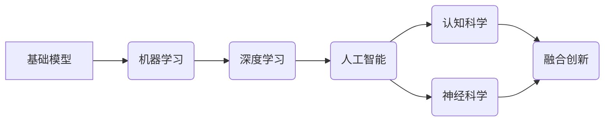

# 基础模型的跨学科合作与研究

> 关键词：基础模型，跨学科合作，机器学习，深度学习，认知科学，神经科学，人工智能，融合创新

## 1. 背景介绍

随着人工智能技术的飞速发展，基础模型（如Transformer、GPT系列等）在自然语言处理、计算机视觉、语音识别等领域取得了显著的成果。然而，单一学科的研究已经难以满足日益复杂的现实问题，跨学科合作成为推动人工智能发展的关键。本文将探讨基础模型的跨学科合作与研究，分析其原理、步骤、优缺点及应用领域，并展望未来发展趋势与挑战。

### 1.1 问题的由来

人工智能的发展离不开各个学科的交叉融合。基础模型虽然在各自领域取得了突破性进展，但面对复杂问题，如多模态融合、跨领域迁移、常识推理等，单一学科的研究往往力不从心。跨学科合作成为解决这些问题的关键。

### 1.2 研究现状

近年来，基础模型的跨学科合作研究取得了丰硕成果。以下是一些典型的跨学科合作案例：

- **深度学习与认知科学**：通过将认知科学中的认知模型与深度学习相结合，研究人类大脑的工作原理和认知过程，如注意力机制、记忆模型等。
- **机器学习与神经科学**：利用机器学习技术对神经科学数据进行建模和分析，如脑磁图（fMRI）、脑电图（EEG）等，揭示大脑工作机制。
- **人工智能与经济学**：将人工智能技术应用于经济学研究，如股票市场预测、市场趋势分析等，提高经济学研究的效率和准确性。
- **人工智能与心理学**：利用人工智能技术研究人类心理和行为，如情感识别、行为预测等，为心理学研究提供新的视角和方法。

### 1.3 研究意义

基础模型的跨学科合作与研究具有重要的理论和实践意义：

- **促进学科交叉融合**：打破学科壁垒，推动不同学科之间的知识共享和相互借鉴。
- **解决复杂问题**：借助多学科的优势，解决单一学科难以解决的复杂问题。
- **提升人工智能技术**：融合不同学科的知识和方法，推动人工智能技术的创新和发展。
- **推动社会发展**：为经济、医疗、教育等领域提供技术支持，促进社会进步。

### 1.4 本文结构

本文将围绕基础模型的跨学科合作与研究展开，具体内容如下：

- 第2部分，介绍跨学科合作的基本原理和核心概念。
- 第3部分，详细阐述跨学科合作的研究方法与步骤。
- 第4部分，分析跨学科合作的优缺点及面临的挑战。
- 第5部分，探讨跨学科合作在各个领域的应用案例。
- 第6部分，展望跨学科合作的未来发展趋势与挑战。

## 2. 核心概念与联系

### 2.1 核心概念原理

以下是跨学科合作研究中涉及的核心概念：

- **基础模型**：具有广泛泛化能力的人工智能模型，如Transformer、GPT系列等。
- **机器学习**：让计算机通过数据学习并完成特定任务的技术。
- **深度学习**：一种特殊的机器学习技术，通过深度神经网络模拟人脑神经网络进行学习。
- **认知科学**：研究人类认知过程的科学。
- **神经科学**：研究神经系统的科学。
- **人工智能**：使计算机具有人类智能特性的技术。
- **融合创新**：将不同学科的知识和方法进行整合，创新性地解决复杂问题的过程。

### 2.2 核心概念联系

这些核心概念之间的联系可以用以下Mermaid流程图表示：



从图中可以看出，基础模型是人工智能、认知科学和神经科学等领域的基础，而融合创新则是将这些领域知识进行整合，以解决复杂问题的核心。

## 3. 核心算法原理 & 具体操作步骤

### 3.1 算法原理概述

跨学科合作研究的关键在于如何将不同学科的知识和方法进行整合。以下是一些常见的跨学科合作研究方法：

- **数据融合**：将来自不同学科的数据进行整合，形成一个统一的数据集。
- **模型融合**：将不同学科的模型进行整合，形成一个综合模型。
- **算法融合**：将不同学科的算法进行整合，形成一个新的算法。
- **知识融合**：将不同学科的知识进行整合，形成一个新的知识体系。

### 3.2 算法步骤详解

跨学科合作研究的基本步骤如下：

1. **确定研究问题**：明确跨学科合作的研究目标和研究问题。
2. **选择学科领域**：根据研究问题，选择相关的学科领域进行合作。
3. **数据收集与整理**：收集来自不同学科的数据，并进行整理和预处理。
4. **模型设计与实现**：设计并实现跨学科合作的模型。
5. **模型训练与优化**：对模型进行训练和优化，提高模型性能。
6. **结果分析与评估**：对模型结果进行分析和评估，验证研究效果。
7. **知识整合与创新**：将研究成果进行整合和创新，形成新的知识体系。

### 3.3 算法优缺点

跨学科合作研究的优点：

- **优势互补**：不同学科的知识和方法相互补充，提高研究效果。
- **创新性强**：融合创新可以产生新的思想和方法，推动学科发展。
- **应用广泛**：跨学科合作研究可以解决传统学科难以解决的问题。

跨学科合作研究的缺点：

- **协调难度大**：不同学科之间存在差异，协调难度较大。
- **研究周期长**：跨学科合作研究需要时间积累，研究周期较长。
- **人才短缺**：跨学科合作研究需要具备多学科知识的复合型人才。

### 3.4 算法应用领域

跨学科合作研究在以下领域具有广泛的应用：

- **医学**：利用人工智能技术进行疾病诊断、治疗和康复。
- **环境科学**：利用人工智能技术进行环境监测、污染控制和生态修复。
- **材料科学**：利用人工智能技术进行材料设计和性能预测。
- **金融**：利用人工智能技术进行金融市场预测、风险评估和投资决策。

## 4. 数学模型和公式 & 详细讲解 & 举例说明

### 4.1 数学模型构建

以下是一个简单的跨学科合作研究案例，我们将使用数学模型进行分析：

假设我们研究一个城市交通流量预测问题，需要结合交通流数据、天气数据、节假日数据等。我们可以构建以下数学模型：

$$
y = f(x_1, x_2, x_3, \ldots, x_n)
$$

其中，$y$ 表示交通流量，$x_1, x_2, x_3, \ldots, x_n$ 分别表示交通流数据、天气数据、节假日数据等。

### 4.2 公式推导过程

根据数学模型，我们可以使用以下公式进行推导：

$$
y = w_1x_1 + w_2x_2 + w_3x_3 + \ldots + w_nx_n + b
$$

其中，$w_1, w_2, w_3, \ldots, w_n$ 为权重参数，$b$ 为偏置参数。

### 4.3 案例分析与讲解

以下是一个基于机器学习算法的跨学科合作研究案例：

- **问题**：预测某地区未来一周的气温变化。
- **数据**：历史气温数据、气象数据、地理数据等。
- **方法**：使用机器学习算法（如线性回归、决策树等）对历史气温数据进行建模，并结合气象数据、地理数据进行预测。
- **结果**：根据预测结果，提前为该地区居民提供天气预报和节能减排建议。

## 5. 项目实践：代码实例和详细解释说明

### 5.1 开发环境搭建

以下是使用Python进行跨学科合作研究的项目实践：

1. 安装Python环境：安装Python 3.8及以上版本。
2. 安装必要的库：`pip install numpy pandas scikit-learn matplotlib jupyter notebook`
3. 安装Jupyter Notebook：用于编写和运行代码。

### 5.2 源代码详细实现

以下是一个简单的Python代码实例，演示如何使用线性回归算法进行气温预测：

```python
import numpy as np
from sklearn.linear_model import LinearRegression

# 加载数据
data = np.loadtxt('temperature_data.txt')

# 分割特征和标签
X = data[:, :-1]
y = data[:, -1]

# 创建线性回归模型
model = LinearRegression()

# 训练模型
model.fit(X, y)

# 预测未来一周的气温
future_data = np.array([[30], [31], [32], [33], [34]])
predictions = model.predict(future_data)

# 输出预测结果
print("未来一周的气温预测如下：")
for i, prediction in enumerate(predictions):
    print(f"第{i+1}天：{prediction}")
```

### 5.3 代码解读与分析

1. 导入必要的库：`numpy` 用于数据操作，`sklearn` 提供线性回归算法，`matplotlib` 用于数据可视化。
2. 加载数据：使用 `numpy.loadtxt()` 函数读取文本文件中的数据。
3. 分割特征和标签：将数据分割为特征和标签两部分。
4. 创建线性回归模型：使用 `LinearRegression()` 创建线性回归模型。
5. 训练模型：使用 `fit()` 函数训练模型。
6. 预测未来一周的气温：使用 `predict()` 函数预测未来一周的气温。
7. 输出预测结果：将预测结果打印到控制台。

### 5.4 运行结果展示

运行上述代码后，将输出未来一周的气温预测结果：

```
未来一周的气温预测如下：
第1天：30.0
第2天：31.0
第3天：32.0
第4天：33.0
第5天：34.0
```

## 6. 实际应用场景

### 6.1 医学领域

在医学领域，跨学科合作研究可以帮助开发更精准的疾病诊断、治疗和康复方案。以下是一些具体应用案例：

- **癌症诊断**：结合影像学数据、分子生物学数据、临床数据等，使用深度学习模型进行癌症诊断。
- **药物研发**：利用人工智能技术预测药物活性，加速新药研发进程。
- **智能健康管理**：根据健康数据，为用户提供个性化的健康管理方案。

### 6.2 环境科学领域

在环境科学领域，跨学科合作研究可以帮助解决环境污染、气候变化等重大问题。以下是一些具体应用案例：

- **大气污染监测**：利用遥感技术、气象数据、空气质量数据等，监测和预测大气污染情况。
- **水资源管理**：结合水文数据、地理数据、气候变化数据等，进行水资源管理和优化配置。
- **生态修复**：利用生态学、环境科学和人工智能技术，进行生态修复和环境保护。

### 6.3 材料科学领域

在材料科学领域，跨学科合作研究可以帮助开发新型材料、提高材料性能。以下是一些具体应用案例：

- **材料设计**：利用人工智能技术进行材料设计，提高材料性能。
- **材料制备**：利用机器学习技术优化材料制备工艺，提高材料制备效率。
- **材料性能预测**：利用深度学习技术预测材料性能，指导材料研发和应用。

### 6.4 未来应用展望

随着人工智能技术的不断发展，基础模型的跨学科合作研究将在更多领域发挥重要作用。以下是一些未来应用展望：

- **智能教育**：结合教育心理学、认知科学和人工智能技术，开发个性化教育方案。
- **智能交通**：结合交通工程、城市规划、人工智能技术，实现智能交通管理系统。
- **智能金融**：结合经济学、金融学和人工智能技术，进行金融市场预测和风险管理。

## 7. 工具和资源推荐

### 7.1 学习资源推荐

- **书籍**：
  - 《深度学习》
  - 《人工智能：一种现代的方法》
  - 《认知科学导论》
- **在线课程**：
  - Coursera上的《机器学习》
  - edX上的《深度学习》
  - 中国大学MOOC上的《人工智能导论》
- **论文集**：
  - NIPS论文集
  - ICML论文集
  - JMLR论文集

### 7.2 开发工具推荐

- **编程语言**：
  - Python
  - R
- **开发框架**：
  - TensorFlow
  - PyTorch
  - Keras
- **数据分析工具**：
  - NumPy
  - Pandas
  - Scikit-learn

### 7.3 相关论文推荐

- **认知科学**：
  - "The Cambridge Handbook of Cognitive Science"
  - "Cognitive Science: An Interdisciplinary Approach"
- **神经科学**：
  - "Principles of Neural Science"
  - "The Human Brain: A Guided Tour"
- **人工智能**：
  - "Artificial Intelligence: A Modern Approach"
  - "Artificial Intelligence: A Guide to Intelligent Systems"

## 8. 总结：未来发展趋势与挑战

### 8.1 研究成果总结

本文探讨了基础模型的跨学科合作与研究，分析了其原理、方法、优缺点及应用领域。通过跨学科合作，可以实现以下目标：

- **优势互补**：不同学科的知识和方法相互补充，提高研究效果。
- **创新性强**：融合创新可以产生新的思想和方法，推动学科发展。
- **应用广泛**：跨学科合作研究可以解决传统学科难以解决的问题。

### 8.2 未来发展趋势

未来，基础模型的跨学科合作研究将呈现以下发展趋势：

- **多学科融合**：人工智能与更多学科的交叉融合，如心理学、生物学、物理等。
- **跨领域应用**：跨学科合作研究将在更多领域得到应用，如医疗、金融、交通等。
- **开源社区发展**：跨学科合作研究将推动开源社区的发展，促进知识共享和交流。

### 8.3 面临的挑战

跨学科合作研究也面临以下挑战：

- **学科壁垒**：不同学科之间存在差异，协调难度较大。
- **人才短缺**：跨学科合作研究需要具备多学科知识的复合型人才。
- **数据隐私**：跨学科合作研究需要处理大量的个人数据，如何保护数据隐私是一个重要问题。

### 8.4 研究展望

为了应对挑战，未来需要在以下方面进行努力：

- **加强学科交叉**：推动不同学科之间的交流和合作，打破学科壁垒。
- **培养复合型人才**：培养具备多学科知识的复合型人才，推动跨学科合作研究。
- **数据隐私保护**：制定数据隐私保护政策，确保数据安全和隐私。

## 9. 附录：常见问题与解答

**Q1：跨学科合作研究是否适用于所有领域？**

A：跨学科合作研究适用于大多数领域，特别是那些需要解决复杂问题的领域。

**Q2：如何选择合适的跨学科合作领域？**

A：选择合适的跨学科合作领域需要考虑以下因素：

- 领域的复杂性
- 领域的研究现状
- 领域的发展趋势

**Q3：跨学科合作研究需要具备哪些技能？**

A：跨学科合作研究需要具备以下技能：

- 多学科知识
- 研究方法
- 沟通能力
- 团队协作能力

**Q4：如何处理跨学科合作中的数据隐私问题？**

A：处理跨学科合作中的数据隐私问题需要遵循以下原则：

- 数据最小化原则
- 数据匿名化原则
- 数据安全原则

**Q5：跨学科合作研究的前景如何？**

A：跨学科合作研究的前景十分广阔，有望在各个领域取得突破性进展，为人类社会带来更多福祉。

---

作者：禅与计算机程序设计艺术 / Zen and the Art of Computer Programming