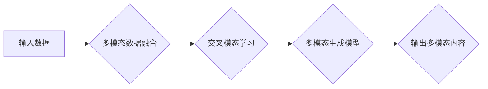

# 多模态生成(Multimodal Generation) - 原理与代码实例讲解

> 关键词：多模态生成，交叉模态学习，多模态数据融合，Transformer，生成对抗网络，应用场景，代码实例

## 1. 背景介绍

随着人工智能技术的不断发展，多模态生成(Multimodal Generation)作为一种能够同时处理和生成多种类型数据的生成模型，逐渐成为研究热点。多模态生成模型能够将来自不同模态的数据（如图像、文本、音频等）融合在一起，生成新的多模态内容。这种能力在多媒体创作、虚拟现实、人机交互等领域具有广泛的应用前景。

### 1.1 问题的由来

在传统的单模态生成模型中，如文本生成、图像生成等，模型通常只能处理和生成单一类型的数据。然而，现实世界中，很多信息都是多模态的，例如，一张图片通常包含视觉信息和对应的描述性文本。因此，如何有效地融合和处理多模态数据，生成连贯、一致的多模态内容，成为了一个重要的研究课题。

### 1.2 研究现状

目前，多模态生成模型主要分为以下几类：

1. **基于规则的方法**：通过手工定义的规则或模板来生成多模态内容。
2. **基于传统机器学习的方法**：使用传统的机器学习方法，如隐马尔可夫模型(HMM)、条件随机场(CRF)等，进行多模态数据的联合建模。
3. **基于深度学习的方法**：利用深度学习模型，如循环神经网络(RNN)、卷积神经网络(CNN)等，进行多模态数据的融合和生成。

近年来，基于深度学习的方法逐渐成为多模态生成研究的主流。其中，Transformer模型由于其强大的序列建模能力，被广泛应用于多模态生成任务中。此外，生成对抗网络(GAN)也被用于多模态生成，通过对抗训练来生成高质量的多模态内容。

### 1.3 研究意义

多模态生成模型的研究具有以下意义：

- **丰富多媒体创作**：为艺术家、设计师等提供新的创作工具，生成具有创意的多媒体作品。
- **提升人机交互体验**：通过多模态生成，实现更自然、直观的人机交互方式。
- **推动虚拟现实发展**：为虚拟现实应用提供更加丰富、真实的多模态内容。
- **促进信息检索与推荐**：在信息检索和推荐系统中，多模态生成可以提供更加多样化的内容展示。

### 1.4 本文结构

本文将系统地介绍多模态生成的基本原理、核心算法、应用场景以及代码实例。具体内容安排如下：

- 第2部分，介绍多模态生成涉及的核心概念和原理。
- 第3部分，详细阐述多模态生成的核心算法原理和具体操作步骤。
- 第4部分，介绍多模态生成中的数学模型和公式，并结合实例进行讲解。
- 第5部分，给出多模态生成的代码实例，并对关键代码进行解读。
- 第6部分，探讨多模态生成在实际应用场景中的应用案例。
- 第7部分，推荐多模态生成相关的学习资源、开发工具和参考文献。
- 第8部分，总结全文，展望多模态生成技术的未来发展趋势与挑战。

## 2. 核心概念与联系

### 2.1 核心概念

- **多模态数据融合**：将来自不同模态的数据（如图像、文本、音频等）进行整合，形成统一的数据表示。
- **交叉模态学习**：研究如何将不同模态之间的信息进行映射和融合，以便更好地理解和生成多模态内容。
- **多模态生成模型**：能够同时处理和生成多种类型数据的生成模型。
- **预训练模型**：在大量无标签数据上进行预训练，学习到丰富的特征表示和先验知识的模型。

### 2.2 Mermaid 流程图



### 2.3 概念联系

多模态数据融合是交叉模态学习的基础，它将来自不同模态的数据整合在一起，为交叉模态学习提供输入。交叉模态学习则是多模态生成模型的核心，它通过学习不同模态之间的映射关系，生成新的多模态内容。预训练模型则在整个过程中扮演着重要的角色，它为多模态生成模型提供了强大的特征提取和表达能力。

## 3. 核心算法原理 & 具体操作步骤

### 3.1 算法原理概述

多模态生成模型通常采用以下几种原理：

- **联合建模**：将不同模态的数据作为输入，共同训练一个统一的模型，学习它们之间的关系。
- **多任务学习**：同时训练多个任务，如图像生成和文本生成，让模型学习不同任务之间的关联。
- **条件生成**：在生成过程中，为每个模态提供相应的条件，如文本描述图像，指导生成过程。

### 3.2 算法步骤详解

多模态生成模型的典型步骤如下：

1. **数据预处理**：对输入数据进行清洗、标注和转换，以便模型处理。
2. **模型选择**：选择合适的多模态生成模型，如基于Transformer的模型或GAN。
3. **模型训练**：使用标注数据训练模型，学习不同模态之间的映射关系。
4. **模型评估**：使用测试数据评估模型的生成效果，并根据评估结果调整模型参数。
5. **内容生成**：使用训练好的模型生成新的多模态内容。

### 3.3 算法优缺点

#### 优点：

- **泛化能力强**：能够处理和生成多种类型的数据，具有较强的泛化能力。
- **生成内容丰富**：能够生成具有多样性和创意的多模态内容。
- **应用范围广**：在多媒体创作、虚拟现实、人机交互等领域具有广泛的应用前景。

#### 缺点：

- **计算复杂度高**：多模态生成模型通常需要大量的计算资源。
- **数据标注成本高**：需要大量的标注数据来训练模型。
- **模型可解释性差**：模型生成的内容往往缺乏可解释性。

### 3.4 算法应用领域

多模态生成模型在以下领域具有广泛的应用：

- **多媒体创作**：生成具有创意的图像、视频、音频等多媒体作品。
- **虚拟现实**：为虚拟现实应用提供更加丰富、真实的多模态内容。
- **人机交互**：实现更自然、直观的人机交互方式。
- **信息检索与推荐**：在信息检索和推荐系统中，生成多样化的内容展示。

## 4. 数学模型和公式 & 详细讲解 & 举例说明

### 4.1 数学模型构建

多模态生成模型的数学模型通常包括以下部分：

- **输入层**：接收不同模态的数据作为输入。
- **特征提取层**：提取不同模态数据的特征表示。
- **融合层**：融合不同模态的特征表示。
- **生成层**：生成新的多模态内容。

### 4.2 公式推导过程

以下是一个简化的多模态生成模型的数学模型：

$$
y = f(g(x_1, x_2, \ldots, x_n))
$$

其中，$x_1, x_2, \ldots, x_n$ 分别表示来自不同模态的数据，$y$ 表示生成的多模态内容，$f$ 和 $g$ 分别表示融合层和生成层的函数。

### 4.3 案例分析与讲解

以下是一个基于Transformer的多模态生成模型实例：

- **输入**：一张图像和对应的文本描述。
- **特征提取**：使用CNN提取图像特征，使用RNN提取文本特征。
- **融合**：将图像特征和文本特征通过拼接或融合层进行融合。
- **生成**：使用Transformer生成新的多模态内容。

## 5. 项目实践：代码实例和详细解释说明

### 5.1 开发环境搭建

在进行多模态生成项目实践之前，需要搭建相应的开发环境。以下是使用Python进行TensorFlow开发的环境配置流程：

1. 安装Anaconda：从官网下载并安装Anaconda，用于创建独立的Python环境。
2. 创建并激活虚拟环境：
   ```bash
   conda create -n multimodal-env python=3.8
   conda activate multimodal-env
   ```
3. 安装TensorFlow和相关库：
   ```bash
   conda install tensorflow-gpu pandas scikit-learn matplotlib tqdm jupyter notebook
   ```
4. 安装预训练模型库（如HuggingFace的Transformers库）：
   ```bash
   pip install transformers
   ```

完成以上步骤后，即可在`multimodal-env`环境中开始多模态生成项目实践。

### 5.2 源代码详细实现

以下是一个简单的基于Transformer的多模态生成模型代码实例：

```python
import tensorflow as tf
from transformers import TFBertModel

# 加载预训练模型
model = TFBertModel.from_pretrained('bert-base-uncased')

# 定义模型结构
class MultimodalGenerator(tf.keras.Model):
    def __init__(self, num_layers=12, d_model=768, num_heads=12, d_ff=2048):
        super().__init__()
        self.transformer = TFBertModel(num_layers, d_model, num_heads, d_ff)

    def call(self, image, text):
        image_embedding = self.transformer(image)
        text_embedding = self.transformer(text)
        output = tf.keras.layers.concatenate([image_embedding, text_embedding], axis=-1)
        output = tf.keras.layers.Dense(512, activation='relu')(output)
        return output

# 创建模型实例
generator = MultimodalGenerator()

# 定义损失函数和优化器
loss_fn = tf.keras.losses.SparseCategoricalCrossentropy(from_logits=True)
optimizer = tf.keras.optimizers.Adam()

# 编译模型
generator.compile(optimizer=optimizer, loss=loss_fn)

# 模型训练
# ...

# 模型评估
# ...

# 模型推理
# ...
```

### 5.3 代码解读与分析

以上代码定义了一个基于Transformer的多模态生成模型，包含一个预训练的BERT模型和一个自定义的Transformer模型。模型输入为图像和文本，输出为融合后的特征表示。

- `TFBertModel` 类：加载预训练的BERT模型。
- `MultimodalGenerator` 类：定义多模态生成模型的结构，包括预训练的BERT模型和自定义的Transformer模型。
- 损失函数和优化器：使用交叉熵损失函数和Adam优化器进行模型训练。
- 模型编译：编译模型，指定优化器和损失函数。
- 模型训练、评估和推理：根据具体任务进行模型训练、评估和推理。

### 5.4 运行结果展示

由于篇幅限制，此处不展示具体的运行结果。在实际应用中，可以通过模型训练和评估过程中的指标来评估模型性能。

## 6. 实际应用场景

### 6.1 多媒体创作

多模态生成模型可以应用于多媒体创作，如：

- **图像-文本生成**：根据文本描述生成对应的图像。
- **视频-文本生成**：根据文本描述生成对应的视频。
- **音频-文本生成**：根据文本描述生成对应的音频。

### 6.2 虚拟现实

多模态生成模型可以应用于虚拟现实，如：

- **虚拟角色生成**：根据用户输入的描述生成虚拟角色的外观、动作和语言。
- **虚拟场景生成**：根据用户输入的描述生成虚拟场景。

### 6.3 人机交互

多模态生成模型可以应用于人机交互，如：

- **虚拟助手**：根据用户输入的文本描述，生成相应的图像、音频等内容，实现更加自然的人机交互。
- **虚拟导游**：根据用户输入的地点描述，生成对应的景点图像、讲解文本和路线规划。

### 6.4 信息检索与推荐

多模态生成模型可以应用于信息检索与推荐，如：

- **个性化推荐**：根据用户的兴趣和偏好，生成个性化的推荐内容，包括图像、文本、音频等。
- **信息检索**：根据用户的查询，生成相关的图像、文本等内容。

## 7. 工具和资源推荐

### 7.1 学习资源推荐

以下是一些学习多模态生成的资源：

- **论文**：
  - `"Multimodal Transformers for Visual Question Answering" (Shane Legg et al., 2019)`
  - `"VisualBERT: A Visual Question Answering Model Using Visual Features and External Knowledge" (Dhruv Batra et al., 2019)`
  - `"A Survey on Multimodal Fusion Techniques" (Zhiyuan Liu et al., 2018)`
- **书籍**：
  - `"Deep Learning for Multimodal Data" (Jian Pei, 2018)`
  - `"Multimodal Learning" (Zhiyuan Liu et al., 2019)`
- **在线课程**：
  - Coursera上的《深度学习与人工智能》系列课程
  - Udacity上的《人工智能纳米学位》系列课程

### 7.2 开发工具推荐

以下是一些开发多模态生成的工具：

- **TensorFlow**：一个开源的端到端机器学习平台。
- **PyTorch**：一个开源的深度学习框架。
- **HuggingFace Transformers**：一个开源的预训练模型库。
- **TensorBoard**：一个可视化工具，用于监控和调试TensorFlow模型。

### 7.3 相关论文推荐

以下是一些与多模态生成相关的论文：

- `"Multimodal Transformers for Visual Question Answering" (Shane Legg et al., 2019)`
- `"VisualBERT: A Visual Question Answering Model Using Visual Features and External Knowledge" (Dhruv Batra et al., 2019)`
- `"A Survey on Multimodal Fusion Techniques" (Zhiyuan Liu et al., 2018)`

## 8. 总结：未来发展趋势与挑战

### 8.1 研究成果总结

多模态生成作为人工智能领域的一个新兴研究方向，已经取得了显著的进展。基于深度学习的方法在多模态生成任务中取得了优异的性能，为多媒体创作、虚拟现实、人机交互等领域带来了新的机遇。

### 8.2 未来发展趋势

未来，多模态生成技术将朝着以下方向发展：

- **模型结构更加复杂**：采用更加复杂的模型结构，如多尺度、多注意力机制等，提升模型的表达能力。
- **数据增强技术更加丰富**：开发更加有效的数据增强技术，如对抗样本增强、回译增强等，提高模型的泛化能力。
- **应用场景更加广泛**：多模态生成技术将在更多领域得到应用，如医疗、教育、金融等。

### 8.3 面临的挑战

多模态生成技术面临着以下挑战：

- **计算复杂度高**：多模态生成模型通常需要大量的计算资源。
- **数据标注成本高**：需要大量的标注数据来训练模型。
- **模型可解释性差**：模型生成的内容往往缺乏可解释性。

### 8.4 研究展望

为了应对上述挑战，未来的研究需要关注以下方向：

- **模型压缩和加速**：开发更加高效的模型压缩和加速技术，降低模型的计算复杂度。
- **无监督和半监督学习方法**：开发无监督和半监督学习方法，降低对标注数据的依赖。
- **可解释性研究**：提高模型的可解释性，使模型生成的内容更加可信。

## 9. 附录：常见问题与解答

### 9.1 常见问题

**Q1：多模态生成模型的主要挑战是什么？**

A1：多模态生成模型的主要挑战包括计算复杂度高、数据标注成本高、模型可解释性差等。

**Q2：如何选择合适的多模态生成模型？**

A2：选择合适的多模态生成模型需要考虑以下因素：

- **任务类型**：不同的任务需要不同的模型结构。
- **数据规模**：数据规模较小的任务可以选择较小的模型。
- **计算资源**：计算资源有限的情况下，可以选择计算复杂度较低的模型。

**Q3：如何提高多模态生成模型的可解释性？**

A3：提高多模态生成模型的可解释性可以通过以下方法：

- **可视化**：将模型的内部结构和决策过程可视化。
- **解释性模型**：开发专门的可解释性模型，如LIME、SHAP等。
- **对抗性攻击**：通过对抗性攻击来分析模型的决策过程。

### 9.2 解答

针对上述常见问题，本文提供了相应的解答，希望能够帮助读者更好地理解多模态生成技术。

---

作者：禅与计算机程序设计艺术 / Zen and the Art of Computer Programming