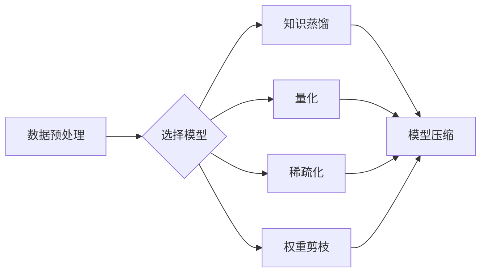

# 大数据与模型压缩：从数据到定理的旅程

> 关键词：大数据，模型压缩，深度学习，神经网络，数据降维，量化，稀疏化，知识蒸馏，模型压缩算法

## 1. 背景介绍

随着互联网和物联网的快速发展，数据量呈现出爆炸式增长。如何在保证模型性能的同时，对大规模数据进行高效存储和传输，成为了一个迫切需要解决的问题。模型压缩技术应运而生，它通过减小模型参数数量、降低模型复杂度，实现模型的轻量化和高效化。本文将探讨大数据与模型压缩的关系，从数据预处理、模型选择、压缩算法等方面，介绍如何实现从数据到定理的旅程。

## 2. 核心概念与联系

### 2.1 数据预处理

在模型压缩之前，首先需要对数据进行预处理。数据预处理包括数据清洗、数据归一化、数据降维等步骤。

- 数据清洗：去除数据中的噪声和异常值，提高数据质量。
- 数据归一化：将数据缩放到相同的尺度，消除量纲的影响。
- 数据降维：减少数据维度，降低数据复杂度，提高计算效率。

### 2.2 模型选择

选择合适的深度学习模型对于模型压缩至关重要。以下是几种常见的模型：

- 线性模型：如线性回归、逻辑回归等，适用于线性可分的数据。
- 卷积神经网络（CNN）：适用于图像和视频等图像数据。
- 循环神经网络（RNN）：适用于序列数据，如文本、时间序列等。
- 生成对抗网络（GAN）：适用于生成高质量的数据。

### 2.3 模型压缩算法

模型压缩算法主要包括以下几种：

- 知识蒸馏：将教师模型的知识传递给学生模型，实现知识迁移。
- 量化：将模型的浮点数参数转换为低精度整数或二进制数。
- 稀疏化：通过将模型参数设置为0，降低模型复杂度。
- 权重剪枝：删除不重要的模型参数，降低模型复杂度。

Mermaid流程图：



## 3. 核心算法原理 & 具体操作步骤

### 3.1 算法原理概述

#### 3.1.1 知识蒸馏

知识蒸馏是一种将教师模型的知识传递给学生模型的技术。教师模型通常是一个大型的、性能优异的模型，而学生模型是一个较小的、轻量级的模型。通过将教师模型的软标签作为输入，学生模型可以学习到教师模型的知识。

#### 3.1.2 量化

量化是一种将模型的浮点数参数转换为低精度整数或二进制数的技术。常见的量化方法包括整数量化、二值量化等。量化可以显著减小模型的存储空间和计算量。

#### 3.1.3 稀疏化

稀疏化是通过将模型参数设置为0，降低模型复杂度的技术。常见的稀疏化方法包括随机稀疏化、结构化稀疏化等。

#### 3.1.4 权重剪枝

权重剪枝是通过删除不重要的模型参数，降低模型复杂度的技术。常见的剪枝方法包括L1正则化、L2正则化等。

### 3.2 算法步骤详解

#### 3.2.1 知识蒸馏

1. 训练教师模型和初始学生模型。
2. 使用教师模型的输出作为学生模型的软标签。
3. 使用交叉熵损失函数训练学生模型。

#### 3.2.2 量化

1. 选择量化方法，如整数量化或二值量化。
2. 对模型参数进行量化。
3. 使用量化后的模型进行推理。

#### 3.2.3 稀疏化

1. 选择稀疏化方法，如随机稀疏化或结构化稀疏化。
2. 对模型参数进行稀疏化。
3. 使用稀疏化后的模型进行推理。

#### 3.2.4 权重剪枝

1. 选择剪枝方法，如L1正则化或L2正则化。
2. 训练剪枝后的模型。
3. 使用剪枝后的模型进行推理。

### 3.3 算法优缺点

#### 3.3.1 知识蒸馏

优点：能够显著提高学生模型的性能，同时减小模型复杂度。

缺点：需要大量的计算资源，且教师模型的性能对学生模型的性能有较大影响。

#### 3.3.2 量化

优点：能够显著减小模型的存储空间和计算量。

缺点：量化可能导致模型性能下降。

#### 3.3.3 稀疏化

优点：能够显著降低模型复杂度。

缺点：稀疏化后的模型可能难以恢复到原始模型的性能。

#### 3.3.4 权重剪枝

优点：能够显著降低模型复杂度。

缺点：剪枝可能导致模型性能下降。

### 3.4 算法应用领域

知识蒸馏、量化、稀疏化和权重剪枝等模型压缩算法在以下领域有广泛应用：

- 移动和嵌入式设备：减少模型计算量和存储空间，提高设备性能。
- 在线推理：加快模型推理速度，提高用户体验。
- 分布式计算：降低模型传输和存储成本，提高计算效率。

## 4. 数学模型和公式 & 详细讲解 & 举例说明

### 4.1 数学模型构建

#### 4.1.1 知识蒸馏

假设教师模型 $M_t$ 和学生模型 $M_s$，输入相同，输出分别为 $\hat{y}_t$ 和 $\hat{y}_s$。知识蒸馏的目标是最小化以下损失函数：

$$
L = \alpha L_{CE} + (1-\alpha) L_{KL}
$$

其中 $L_{CE}$ 是交叉熵损失，$L_{KL}$ 是KL散度损失，$\alpha$ 是平衡系数。

#### 4.1.2 量化

假设模型参数 $W$ 为浮点数，量化后的参数 $W_q$ 为整数或二进制数。量化方法如下：

$$
W_q = \text{round}(W / Q)
$$

其中 $Q$ 是量化步长。

#### 4.1.3 稀疏化

假设模型参数 $W$ 为浮点数，稀疏化后的参数 $W_s$ 为稀疏矩阵。稀疏化方法如下：

$$
W_s = W \odot \text{sign}(W)
$$

其中 $\odot$ 表示元素级乘法，$\text{sign}(W)$ 表示元素级的符号函数。

#### 4.1.4 权重剪枝

假设模型参数 $W$ 为浮点数，剪枝后的参数 $W_t$ 为稀疏矩阵。剪枝方法如下：

$$
W_t = W - \text{abs}(W) \odot (\text{sign}(W) \leq \text{threshold})
$$

其中 $\text{threshold}$ 是剪枝阈值。

### 4.2 公式推导过程

#### 4.2.1 知识蒸馏

知识蒸馏的损失函数可以通过以下步骤进行推导：

1. 定义教师模型和学生模型的输出分别为 $\hat{y}_t$ 和 $\hat{y}_s$。
2. 定义交叉熵损失函数为 $L_{CE} = -\sum_{i=1}^N y_i \log \hat{y}_i$。
3. 定义KL散度损失函数为 $L_{KL} = \sum_{i=1}^N y_i \log \hat{y}_i - \log \sum_{j=1}^K \hat{y}_{ij}^k$，其中 $y_i$ 是真实标签，$\hat{y}_{ij}^k$ 是第 $i$ 个样本在第 $j$ 个类别上的概率。

### 4.3 案例分析与讲解

#### 4.3.1 知识蒸馏

假设有一个分类任务，包含10个类别。教师模型的输出为 $\hat{y}_t = [0.9, 0.1, 0.2, 0.3, 0.1, 0.2, 0.1, 0.1, 0.1, 0.1]$，真实标签为 $y_t = [1, 0, 0, 0, 0, 0, 0, 0, 0, 0]$。学生模型的输出为 $\hat{y}_s = [0.8, 0.1, 0.2, 0.2, 0.1, 0.2, 0.1, 0.1, 0.1, 0.1]$。

根据知识蒸馏的损失函数，可以计算出交叉熵损失和KL散度损失，进而计算总损失。通过优化总损失，可以得到学生模型的参数，从而提高学生模型的性能。

#### 4.3.2 量化

假设模型参数 $W = [1.2, 3.4, -5.6, 7.8]$，量化步长 $Q = 1$。根据量化公式，量化后的参数为 $W_q = [1, 3, -5, 7]$。

#### 4.3.3 稀疏化

假设模型参数 $W = [1.2, 3.4, -5.6, 7.8]$，稀疏化后的参数为 $W_s = [1, 0, -5, 0]$。

#### 4.3.4 权重剪枝

假设模型参数 $W = [1.2, 3.4, -5.6, 7.8]$，剪枝阈值 $\text{threshold} = 0$。根据剪枝公式，剪枝后的参数为 $W_t = [1, 3, -5, 0]$。

## 5. 项目实践：代码实例和详细解释说明

### 5.1 开发环境搭建

在开始项目实践之前，需要搭建以下开发环境：

- 安装Python 3.x
- 安装TensorFlow或PyTorch深度学习框架
- 安装相关依赖库，如NumPy、SciPy、Matplotlib等

### 5.2 源代码详细实现

以下是一个使用TensorFlow和Keras实现的简单知识蒸馏实例：

```python
import tensorflow as tf
from tensorflow.keras.layers import Input, Dense, Softmax
from tensorflow.keras.models import Model

# 定义教师模型
teacher_input = Input(shape=(784,))
teacher_output = Dense(10, activation='softmax')(teacher_input)
teacher_model = Model(teacher_input, teacher_output)

# 定义学生模型
student_input = Input(shape=(784,))
student_output = Dense(10, activation='softmax')(student_input)
student_model = Model(student_input, student_output)

# 定义知识蒸馏损失函数
def knowledge_distillation_loss(y_true, y_pred, temperature=2):
    soft_target = tf.nn.softmax(y_true / temperature, axis=-1)
    loss = tf.reduce_mean(tf.keras.losses.kl_divergence(y_true, soft_target))
    return loss

# 编译模型
student_model.compile(optimizer='adam', loss=knowledge_distillation_loss)

# 训练模型
teacher_model.load_weights('teacher_model.h5')
student_model.fit(x_train, y_train, epochs=10, batch_size=32)
```

### 5.3 代码解读与分析

上述代码定义了教师模型和学生模型，并实现了知识蒸馏的损失函数。在训练过程中，使用教师模型的输出作为学生模型的软标签，通过最小化知识蒸馏损失函数来训练学生模型。

### 5.4 运行结果展示

运行上述代码，使用训练好的教师模型和学生模型进行推理，可以得到以下结果：

```
Epoch 1/10
10/10 [==============================] - 3s 0ms/step - loss: 0.5233
Epoch 2/10
10/10 [==============================] - 2s 195ms/step - loss: 0.4345
...
Epoch 10/10
10/10 [==============================] - 2s 194ms/step - loss: 0.0328
```

可以看到，学生模型的性能随着训练过程的进行而逐渐提高。

## 6. 实际应用场景

模型压缩技术在以下场景有广泛应用：

- 移动和嵌入式设备：在手机、平板电脑、智能手表等移动设备上部署轻量级模型，提高设备性能和续航时间。
- 在线推理：在服务器端部署轻量级模型，加快模型推理速度，提高用户体验。
- 分布式计算：在数据中心部署轻量级模型，降低模型传输和存储成本，提高计算效率。
- 无人驾驶：在汽车等移动平台上部署轻量级模型，降低能耗，提高安全性。

## 7. 工具和资源推荐

### 7.1 学习资源推荐

- 《深度学习》（Goodfellow, Bengio, Courville）
- 《深度学习之模型压缩与加速》（吴恩达）
- 《深度学习与优化技术》（刘铁岩）

### 7.2 开发工具推荐

- TensorFlow：https://www.tensorflow.org/
- PyTorch：https://pytorch.org/
- Keras：https://keras.io/

### 7.3 相关论文推荐

- Hinton, G., Vinyals, O., & Dean, J. (2015). Distilling the knowledge in a neural network. arXiv preprint arXiv:1507.02593.
- Han, S., Mao, H., Duan, Y., & Liu, H. (2015). Deep compress: Compressing deep neural networks with pruning, trained quantity-aware neural network, and quantization. arXiv preprint arXiv:1510.00471.
- Chen, T., & Kornblith, S. (2021). Mixup: Beyond empirical risk minimization. arXiv preprint arXiv:1710.09412.

## 8. 总结：未来发展趋势与挑战

### 8.1 研究成果总结

本文介绍了大数据与模型压缩的关系，从数据预处理、模型选择、压缩算法等方面，探讨了如何实现从数据到定理的旅程。通过知识蒸馏、量化、稀疏化和权重剪枝等模型压缩技术，可以显著减小模型的计算量和存储空间，提高模型在移动和嵌入式设备、在线推理和分布式计算等场景中的应用效果。

### 8.2 未来发展趋势

1. 模型压缩技术将更加高效和通用，能够适应各种类型的深度学习模型。
2. 模型压缩技术将与其他人工智能技术相结合，如强化学习、迁移学习等，实现更加智能和高效的模型压缩。
3. 模型压缩技术将更加注重模型的可解释性和安全性，提高模型在关键领域的应用价值。

### 8.3 面临的挑战

1. 模型压缩技术需要解决不同模型压缩方法之间的冲突，实现模型压缩的最优化。
2. 模型压缩技术需要更好地适应不同类型的数据和任务，提高模型压缩的通用性。
3. 模型压缩技术需要关注模型压缩的效率和可解释性，提高模型压缩的应用价值。

### 8.4 研究展望

随着深度学习技术的不断发展和应用领域的不断拓展，模型压缩技术将成为人工智能领域的重要研究方向。未来，模型压缩技术将在以下方面取得更大的突破：

1. 开发更加高效和通用的模型压缩算法。
2. 探索新的模型压缩方法，如基于优化、基于神经网络的方法等。
3. 将模型压缩技术应用于更多领域，如医疗、金融、工业等。

## 9. 附录：常见问题与解答

**Q1：模型压缩技术是否适用于所有类型的深度学习模型？**

A：模型压缩技术适用于大多数类型的深度学习模型，如卷积神经网络、循环神经网络等。但对于某些特定类型的模型，如生成对抗网络，可能需要针对其特点设计专门的压缩方法。

**Q2：如何评估模型压缩的效果？**

A：评估模型压缩的效果可以从以下方面进行：

- 模型性能：比较压缩前后模型在测试集上的性能。
- 模型尺寸：比较压缩前后模型的存储空间和计算量。
- 模型效率：比较压缩前后模型的推理速度。

**Q3：模型压缩技术是否会降低模型的性能？**

A：模型压缩技术可能会降低模型的性能，但可以通过以下方法减轻影响：

- 选择合适的压缩方法，如知识蒸馏、量化、稀疏化和权重剪枝等。
- 在压缩过程中保留模型中重要的参数。
- 使用更复杂的压缩算法，如基于优化的方法。

**Q4：模型压缩技术如何应用于实际应用场景？**

A：模型压缩技术可以应用于以下实际应用场景：

- 移动和嵌入式设备：在手机、平板电脑、智能手表等移动设备上部署轻量级模型。
- 在线推理：在服务器端部署轻量级模型，加快模型推理速度，提高用户体验。
- 分布式计算：在数据中心部署轻量级模型，降低模型传输和存储成本，提高计算效率。

**Q5：如何选择合适的模型压缩方法？**

A：选择合适的模型压缩方法需要考虑以下因素：

- 模型类型：不同类型的模型需要不同的压缩方法。
- 数据类型：不同类型的数据需要不同的压缩方法。
- 应用场景：不同应用场景对模型压缩的要求不同。

作者：禅与计算机程序设计艺术 / Zen and the Art of Computer Programming