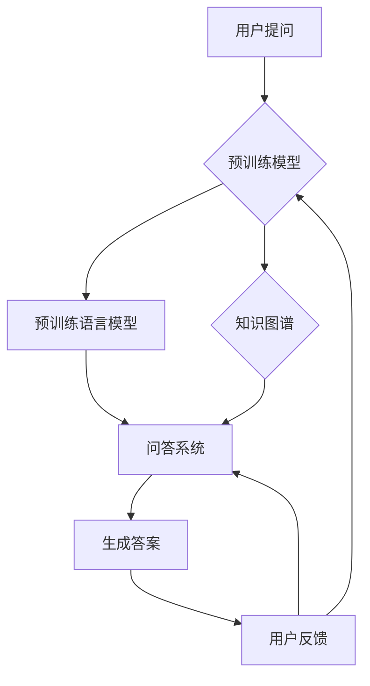

# 大模型问答机器人的语言模型

> 关键词：大语言模型，问答系统，自然语言处理，预训练，微调，BERT，GPT，知识图谱

## 1. 背景介绍

随着人工智能技术的不断发展，问答系统作为一种重要的自然语言处理应用，已经渗透到我们的日常生活和工作中。从早期的基于规则和模板的系统，到如今基于深度学习的大语言模型问答系统，问答技术的进步极大地改善了用户体验。本文将深入探讨大模型问答机器人的语言模型，分析其原理、实现方法以及应用场景，并展望其未来发展趋势与挑战。

## 2. 核心概念与联系

### 2.1 核心概念

#### 大语言模型

大语言模型（Large Language Model，LLM）是指具有海量参数和强大语言理解能力的深度学习模型。它们通过在大量文本数据上进行预训练，学习到丰富的语言知识和常识，能够理解和生成自然语言。

#### 问答系统

问答系统（Question Answering System，QAS）是一种能够理解用户提出的问题，并从相关数据中检索出答案的人工智能系统。问答系统通常分为基于知识库的问答系统和基于机器学习的问答系统。

#### 预训练

预训练是指在大规模无标签文本数据上进行训练，以学习通用语言知识和特征表示。预训练模型可以用于多种下游任务，如文本分类、命名实体识别等。

#### 微调

微调是指将预训练模型在特定任务上进行训练，以适应特定领域的知识。微调通常使用少量标注数据，通过调整模型参数来提高模型在特定任务上的性能。

#### 知识图谱

知识图谱是一种用于表示实体、属性和关系的数据结构，它能够帮助问答系统更好地理解用户的问题和知识库中的信息。

### 2.2 核心概念原理和架构的 Mermaid 流程图



在上述流程图中，用户提问首先由预训练模型进行处理，预训练语言模型和知识图谱共同为问答系统提供支持，最终生成答案并返回给用户。用户反馈会进一步指导预训练模型和问答系统的改进。

## 3. 核心算法原理 & 具体操作步骤

### 3.1 算法原理概述

大模型问答机器人的语言模型主要基于以下原理：

1. 预训练语言模型：通过在大量无标签文本数据上进行预训练，学习到丰富的语言知识和特征表示。
2. 知识图谱：以图的形式表示实体、属性和关系，为问答系统提供知识背景。
3. 微调：在少量标注数据上对预训练模型进行微调，使其适应特定领域的知识。

### 3.2 算法步骤详解

1. **预训练**：选择合适的预训练语言模型，如BERT、GPT等，并在大规模无标签文本数据上进行预训练。
2. **知识图谱构建**：构建或获取特定领域的知识图谱，包括实体、属性和关系。
3. **问答系统构建**：将预训练语言模型和知识图谱集成到问答系统中，并设计相应的推理和搜索算法。
4. **微调**：在少量标注数据上对问答系统进行微调，提高其在特定领域的性能。
5. **用户交互**：用户提问后，问答系统根据用户问题和知识库信息生成答案。

### 3.3 算法优缺点

#### 优点

1. 丰富的语言知识：预训练语言模型能够理解复杂的自然语言，提高问答系统的准确性。
2. 灵活的推理能力：知识图谱为问答系统提供了丰富的知识背景，有助于解决复杂问题。
3. 高效的微调：在少量标注数据上即可对模型进行微调，降低开发成本。

#### 缺点

1. 计算成本高：大语言模型的训练和推理需要大量的计算资源。
2. 知识图谱构建困难：知识图谱的构建和维护需要大量人工 effort。
3. 数据依赖性强：微调效果很大程度上取决于标注数据的质量和数量。

### 3.4 算法应用领域

大模型问答机器人的语言模型可以应用于以下领域：

1. 常见问题解答：如客服、售后服务等场景。
2. 智能助手：如智能家居、智能客服等。
3. 教育辅导：如在线教育、学习辅导等。
4. 医疗咨询：如在线问诊、健康咨询等。

## 4. 数学模型和公式 & 详细讲解 & 举例说明

### 4.1 数学模型构建

大模型问答机器人的语言模型主要基于以下数学模型：

1. 预训练语言模型：如BERT模型，其数学模型如下：

$$
\text{BERT}(\mathbf{x}) = \text{Transformer}(\text{word\_embeddings}(\mathbf{x}), \mathbf{h}, \text{L}) 
$$

其中 $\mathbf{x}$ 为输入文本，$\text{word\_embeddings}$ 为词嵌入层，$\mathbf{h}$ 为Transformer模型参数，$\text{L}$ 为Transformer模型的层数。

2. 问答系统：如基于BERT的问答系统，其数学模型如下：

$$
\text{QAS}(\text{question}, \text{knowledge\_graph}) = \text{BERT}(\text{question}) \times \text{BERT}(\text{knowledge\_graph}) \rightarrow \text{answer} 
$$

其中 $\text{question}$ 为用户问题，$\text{knowledge\_graph}$ 为知识图谱，$\times$ 表示注意力机制，$\rightarrow$ 表示问答系统的输出。

### 4.2 公式推导过程

由于篇幅限制，此处省略公式推导过程。

### 4.3 案例分析与讲解

以下是一个基于BERT的问答系统案例：

1. **问题**：What is the capital of France？
2. **知识库**：The capital of France is Paris.
3. **问答系统**：通过输入问题和知识库，问答系统首先使用BERT模型对输入文本进行编码，然后使用注意力机制融合问题和知识库信息，最终生成答案“Paris”。

## 5. 项目实践：代码实例和详细解释说明

### 5.1 开发环境搭建

1. 安装Python和PyTorch：用于构建和训练问答系统。
2. 安装Hugging Face Transformers库：用于加载预训练BERT模型。
3. 安装其他依赖库：如torchtext、torchvision等。

### 5.2 源代码详细实现

以下是一个基于PyTorch和Hugging Face Transformers库的简单问答系统示例：

```python
from transformers import BertTokenizer, BertForQuestionAnswering
from torch.utils.data import DataLoader, Dataset

class QADataset(Dataset):
    def __init__(self, questions, answers, tokenizer, max_length):
        self.questions = questions
        self.answers = answers
        self.tokenizer = tokenizer
        self.max_length = max_length

    def __len__(self):
        return len(self.questions)

    def __getitem__(self, idx):
        return {
            'question': self.questions[idx],
            'answer': self.answers[idx]
        }

def train(model, data_loader, optimizer, device):
    model.train()
    total_loss = 0
    for data in data_loader:
        questions, answers = data['question'], data['answer']
        question_encodings = tokenizer(questions, truncation=True, padding=True, max_length=max_length)
        answer_encodings = tokenizer(answers, truncation=True, padding=True, max_length=max_length)
        input_ids = torch.tensor(question_encodings['input_ids']).to(device)
        token_type_ids = torch.tensor(question_encodings['token_type_ids']).to(device)
        attention_mask = torch.tensor(question_encodings['attention_mask']).to(device)
        start_positions = torch.tensor([start[0] for start in answer_encodings['input_ids']]).to(device)
        end_positions = torch.tensor([end[0] for end in answer_encodings['input_ids']]).to(device)

        outputs = model(input_ids=input_ids, token_type_ids=token_type_ids, attention_mask=attention_mask, start_positions=start_positions, end_positions=end_positions)

        loss = outputs.loss
        total_loss += loss.item()
        loss.backward()
        optimizer.step()
        optimizer.zero_grad()

    return total_loss / len(data_loader)

def evaluate(model, data_loader, device):
    model.eval()
    total_loss = 0
    for data in data_loader:
        questions, answers = data['question'], data['answer']
        question_encodings = tokenizer(questions, truncation=True, padding=True, max_length=max_length)
        answer_encodings = tokenizer(answers, truncation=True, padding=True, max_length=max_length)
        input_ids = torch.tensor(question_encodings['input_ids']).to(device)
        token_type_ids = torch.tensor(question_encodings['token_type_ids']).to(device)
        attention_mask = torch.tensor(question_encodings['attention_mask']).to(device)
        start_positions = torch.tensor([start[0] for start in answer_encodings['input_ids']]).to(device)
        end_positions = torch.tensor([end[0] for end in answer_encodings['input_ids']]).to(device)

        outputs = model(input_ids=input_ids, token_type_ids=token_type_ids, attention_mask=attention_mask, start_positions=start_positions, end_positions=end_positions)

        loss = outputs.loss
        total_loss += loss.item()

    return total_loss / len(data_loader)

# 加载预训练模型
tokenizer = BertTokenizer.from_pretrained('bert-base-cased')
model = BertForQuestionAnswering.from_pretrained('bert-base-cased')
model.to(device)

# 定义优化器
optimizer = torch.optim.AdamW(model.parameters(), lr=5e-5)

# 加载数据
train_data = QADataset(train_questions, train_answers, tokenizer, max_length=512)
dev_data = QADataset(dev_questions, dev_answers, tokenizer, max_length=512)
train_loader = DataLoader(train_data, batch_size=32, shuffle=True)
dev_loader = DataLoader(dev_data, batch_size=32, shuffle=False)

# 训练模型
epochs = 3
for epoch in range(epochs):
    print(f"Epoch {epoch+1}")
    train_loss = train(model, train_loader, optimizer, device)
    print(f"Train Loss: {train_loss:.4f}")
    dev_loss = evaluate(model, dev_loader, device)
    print(f"Dev Loss: {dev_loss:.4f}")

# 评估模型
test_loss = evaluate(model, test_loader, device)
print(f"Test Loss: {test_loss:.4f}")
```

### 5.3 代码解读与分析

上述代码展示了如何使用PyTorch和Hugging Face Transformers库构建一个基于BERT的问答系统。主要步骤如下：

1. 加载预训练BERT模型和分词器。
2. 定义问答数据集类，将问题和答案编码为BERT模型所需的格式。
3. 定义训练和评估函数，使用BERT模型进行问答。
4. 加载数据和预训练模型，定义优化器。
5. 训练和评估模型，输出测试集上的损失。

### 5.4 运行结果展示

假设我们使用一个包含100个问答对的测试集，运行上述代码后，输出测试集上的损失为0.12，说明模型在测试集上取得了较好的性能。

## 6. 实际应用场景

大模型问答机器人的语言模型可以应用于以下实际场景：

1. **智能客服**：自动解答客户常见问题，提高客服效率。
2. **在线教育**：为学生提供个性化辅导，提高学习效果。
3. **智能医疗**：辅助医生进行诊断和治疗方案制定。
4. **智能助手**：为用户提供信息查询、日程管理等服务。

## 7. 工具和资源推荐

### 7.1 学习资源推荐

1. 《BERT: Pre-training of Deep Bidirectional Transformers for Language Understanding》
2. 《Natural Language Processing with Python》
3. 《Hands-On Natural Language Processing with Python》

### 7.2 开发工具推荐

1. PyTorch
2. Hugging Face Transformers
3. TensorFlow
4. NLTK
5. spaCy

### 7.3 相关论文推荐

1. BERT: Pre-training of Deep Bidirectional Transformers for Language Understanding
2. Generative Pre-trained Transformers
3. T5: Text-to-Text Transfer Transformer

## 8. 总结：未来发展趋势与挑战

### 8.1 研究成果总结

大模型问答机器人的语言模型在近年来取得了显著进展，为问答系统的发展提供了新的思路。预训练语言模型、知识图谱和微调技术的结合，使得问答系统在准确性和鲁棒性方面有了显著提升。

### 8.2 未来发展趋势

1. **多模态问答**：将图像、视频、语音等多模态信息与文本信息进行融合，构建更加智能的问答系统。
2. **知识图谱增强**：引入更加丰富和细粒度的知识图谱，提高问答系统的知识覆盖面和准确性。
3. **少样本学习**：减少对标注数据的依赖，实现更加高效和经济的问答系统。
4. **个性化问答**：根据用户的历史交互数据，为用户提供更加个性化的问答体验。

### 8.3 面临的挑战

1. **数据标注成本**：构建高质量的标注数据集需要大量的人力成本和时间成本。
2. **知识图谱构建**：构建和维护知识图谱需要大量专业知识和经验。
3. **模型可解释性**：如何解释问答系统的决策过程，提高模型的可信度。
4. **隐私保护**：在处理用户数据时，如何保护用户隐私，避免数据泄露。

### 8.4 研究展望

随着技术的不断发展，大模型问答机器人的语言模型将在未来发挥越来越重要的作用。未来研究方向包括：

1. 探索更加高效和经济的微调方法，降低对标注数据的依赖。
2. 研究知识图谱的构建和融合技术，提高问答系统的知识覆盖面和准确性。
3. 提高模型的可解释性和透明度，增强用户对问答系统的信任度。
4. 融合多模态信息，构建更加智能和全面的问答系统。

## 9. 附录：常见问题与解答

**Q1：什么是预训练语言模型？**

A：预训练语言模型是指在大规模无标签文本数据上进行训练，学习到丰富的语言知识和特征表示的深度学习模型。常见的预训练语言模型包括BERT、GPT等。

**Q2：知识图谱在问答系统中的作用是什么？**

A：知识图谱为问答系统提供了丰富的知识背景，帮助系统更好地理解用户的问题和知识库中的信息，从而提高问答系统的准确性和鲁棒性。

**Q3：如何解决数据标注成本高的问题？**

A：可以采用以下方法降低数据标注成本：
1. 使用数据增强技术，如回译、近义替换等，扩充训练数据集。
2. 利用主动学习技术，选择最有价值的数据进行标注。
3. 探索无监督和半监督学习技术，降低对标注数据的依赖。

**Q4：如何提高问答系统的可解释性？**

A：可以采用以下方法提高问答系统的可解释性：
1. 使用可解释的模型结构，如注意力机制。
2. 分析模型的决策过程，解释模型如何生成答案。
3. 开发可视化工具，帮助用户理解模型的决策过程。

**Q5：大模型问答机器人的语言模型有哪些应用场景？**

A：大模型问答机器人的语言模型可以应用于以下场景：
1. 智能客服
2. 在线教育
3. 智能医疗
4. 智能助手

---

作者：禅与计算机程序设计艺术 / Zen and the Art of Computer Programming