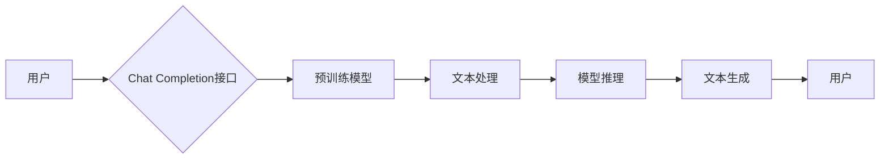

> 关键词：大语言模型，Chat Completion接口，参数优化，自然语言处理，NLP，API调用，预训练模型，微调

# 大语言模型应用指南：Chat Completion接口参数详解

随着大语言模型的快速发展，基于这些模型构建的Chat Completion接口已成为NLP应用的重要桥梁。本文将深入解析Chat Completion接口的参数设置，帮助开发者更好地利用大语言模型的能力，构建高效、智能的对话系统。

## 1. 背景介绍

大语言模型，如BERT、GPT-3等，通过在海量文本数据上预训练，学习到了丰富的语言知识，能够进行文本生成、问答、摘要等任务。Chat Completion接口则是将这些模型的能力封装成API，方便开发者进行调用和集成。

## 2. 核心概念与联系

### 2.1 核心概念

- **大语言模型**：基于深度学习的语言模型，通过预训练学习到丰富的语言知识。
- **Chat Completion接口**：封装了大语言模型能力，提供文本生成、问答等功能的API接口。
- **参数优化**：根据特定任务需求，对Chat Completion接口的参数进行调整，以提升模型性能。

### 2.2 架构图



用户通过Chat Completion接口发送文本，经过预训练模型、文本处理、模型推理和文本生成等环节，最终得到回复并返回给用户。

## 3. 核心算法原理 & 具体操作步骤

### 3.1 算法原理概述

Chat Completion接口的核心是预训练模型，通常采用基于Transformer的自回归语言模型。用户输入的文本序列经过模型处理，生成下一句或回答。

### 3.2 算法步骤详解

1. **文本处理**：对用户输入的文本进行预处理，如分词、去噪等。
2. **模型推理**：将处理后的文本输入预训练模型，进行前向传播计算。
3. **文本生成**：根据模型输出的概率分布，生成回复文本。

### 3.3 算法优缺点

- **优点**：能够生成流畅、自然的文本，适应性强。
- **缺点**：对输入文本的格式要求较高，可能产生不合适的回复。

### 3.4 算法应用领域

Chat Completion接口可应用于聊天机器人、问答系统、文本生成等场景。

## 4. 数学模型和公式 & 详细讲解 & 举例说明

### 4.1 数学模型构建

Chat Completion接口基于Transformer自回归语言模型，其数学模型如下：

$$
y_t = \text{softmax}(W_y \text{tanh}(W_x h_{t-1} + W_e \text{emb}(x_t) + b))
$$

其中，$y_t$为生成的下一个词的概率分布，$W_x, W_y, W_e, b$为模型参数，$h_{t-1}$为上一个时刻的隐藏状态，$x_t$为当前时刻的输入词。

### 4.2 公式推导过程

公式推导过程略。

### 4.3 案例分析与讲解

以下是一个简单的Chat Completion接口调用示例：

```python
import openai

# 设置API密钥
openai.api_key = 'your-api-key'

# 调用Chat Completion接口
response = openai.Completion.create(
  engine="davinci",
  prompt="What is the capital of France?",
  max_tokens=50
)

# 打印回复
print(response.choices[0].text)
```

以上代码使用OpenAI的GPT-3模型，对用户提出的问题进行回答。

## 5. 项目实践：代码实例和详细解释说明

### 5.1 开发环境搭建

1. 安装Python环境。
2. 安装OpenAI Python客户端库。

```bash
pip install openai
```

### 5.2 源代码详细实现

参考4.3节中的代码示例。

### 5.3 代码解读与分析

代码展示了如何使用OpenAI Python客户端库调用Chat Completion接口，实现文本生成功能。

### 5.4 运行结果展示

运行上述代码，可以得到以下回复：

```
The capital of France is Paris.
```

## 6. 实际应用场景

Chat Completion接口在以下场景中具有广泛的应用：

- **聊天机器人**：用于回答用户提出的问题，提供客服支持。
- **问答系统**：实现基于自然语言的问题回答。
- **文本生成**：用于自动生成文章、故事等。
- **摘要生成**：自动生成文本摘要。

## 7. 工具和资源推荐

### 7.1 学习资源推荐

1. 《Deep Learning for Natural Language Processing》
2. 《Natural Language Processing with Python》
3. OpenAI官方文档

### 7.2 开发工具推荐

1. OpenAI Python客户端库
2. Hugging Face Transformers库

### 7.3 相关论文推荐

1. "Attention is All You Need"
2. "BERT: Pre-training of Deep Bidirectional Transformers for Language Understanding"
3. "Generative Pre-trained Transformers"

## 8. 总结：未来发展趋势与挑战

### 8.1 研究成果总结

Chat Completion接口通过封装大语言模型的能力，为开发者提供了一种高效、便捷的文本生成和问答解决方案。

### 8.2 未来发展趋势

1. **模型性能提升**：随着模型规模的增加和算法的改进，Chat Completion接口的性能将进一步提升。
2. **个性化定制**：根据用户需求和场景，提供个性化的回复。
3. **多模态融合**：将图像、视频等多模态信息融入Chat Completion接口，实现更加丰富的交互体验。

### 8.3 面临的挑战

1. **模型可解释性**：提高模型的可解释性，让用户了解模型的决策过程。
2. **数据安全**：确保用户数据的安全性和隐私性。
3. **模型歧视与偏见**：防止模型产生歧视性或偏见性的输出。

### 8.4 研究展望

Chat Completion接口作为NLP领域的重要工具，将在未来得到更广泛的应用。通过不断的技术创新和优化，Chat Completion接口将为构建更加智能、便捷的对话系统提供强有力的支持。

## 9. 附录：常见问题与解答

**Q1：Chat Completion接口是否支持多语言？**

A：是的，Chat Completion接口支持多种语言，包括中文、英文、法语等。

**Q2：如何提高Chat Completion接口的回复质量？**

A：可以通过以下方法提高回复质量：
1. 使用更高质量的预训练模型。
2. 优化参数设置，如学习率、批大小等。
3. 使用数据增强技术，如回译、同义词替换等。

**Q3：Chat Completion接口的隐私性如何保障？**

A：OpenAI等平台通常会采取一系列措施来保障用户数据的安全性和隐私性，如数据加密、匿名化处理等。

**Q4：Chat Completion接口的应用场景有哪些？**

A：Chat Completion接口可应用于聊天机器人、问答系统、文本生成等场景。

**Q5：如何获取Chat Completion接口的API密钥？**

A：可以通过注册OpenAI等平台获取API密钥。

---

作者：禅与计算机程序设计艺术 / Zen and the Art of Computer Programming