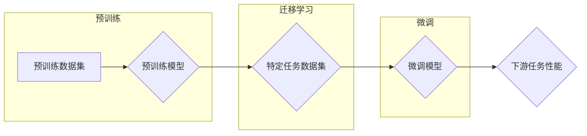

> 大语言模型, 人工智能, 深度学习, 自然语言处理, 机器学习, 预训练, 迁移学习

# 大语言模型应用指南：从人工智能的起源到大语言模型

大语言模型（Large Language Models，LLMs）是近年来人工智能领域的一项重大突破，它们通过学习海量文本数据，能够生成高质量的自然语言文本，并在各种自然语言处理任务中展现出惊人的能力。本文将带领读者从人工智能的起源出发，深入探讨大语言模型的原理、应用和实践，旨在为读者提供一个全面的大语言模型应用指南。

## 1. 背景介绍

### 1.1 人工智能的起源

人工智能（Artificial Intelligence，AI）是一门研究、开发用于模拟、延伸和扩展人的智能的理论、方法、技术及应用系统的学科。自从20世纪50年代人工智能概念被提出以来，人工智能领域经历了多次热潮和低谷，其中最具代表性的热潮包括：

- **1950年代**：人工智能概念的提出和图灵测试的提出。
- **1960-1970年代**：逻辑符号主义和知识表示方法的兴起。
- **1980年代**：专家系统和机器学习方法的初步探索。
- **1990年代**：机器学习方法的快速发展，尤其是基于统计的学习方法。
- **2000年代至今**：深度学习的兴起，特别是卷积神经网络（CNN）和循环神经网络（RNN）的广泛应用。

### 1.2 大语言模型的发展

大语言模型的发展可以追溯到20世纪60年代的早期语言模型，如基于规则的语言模型和统计模型。然而，直到深度学习的兴起，大语言模型才真正迎来了发展的春天。以下是一些关键的发展节点：

- **2013年**：深度学习在语音识别和图像识别等领域取得了突破性进展，为自然语言处理领域提供了新的动力。
- **2018年**：Transformer模型的提出，为自然语言处理领域带来了革命性的变化。
- **2020年至今**：大语言模型如BERT、GPT-3等相继发布，展现出强大的语言理解和生成能力。

## 2. 核心概念与联系

### 2.1 核心概念

- **深度学习（Deep Learning）**：一种利用深层神经网络进行学习的机器学习方法。
- **自然语言处理（Natural Language Processing，NLP）**：研究如何让计算机理解、解释和生成人类语言。
- **预训练（Pre-training）**：在特定数据集上训练模型，以学习通用语言表示。
- **迁移学习（Transfer Learning）**：利用在特定任务上预训练的模型来提高其他相关任务的性能。
- **微调（Fine-Tuning）**：在预训练模型的基础上，使用特定任务的数据集进行进一步训练。

### 2.2 架构流程图



## 3. 核心算法原理 & 具体操作步骤

### 3.1 算法原理概述

大语言模型通常基于深度神经网络，特别是Transformer模型，它能够通过自注意力机制（Self-Attention Mechanism）有效地捕捉长距离依赖关系，从而在自然语言处理任务中取得优异的性能。

### 3.2 算法步骤详解

1. **数据收集**：收集大量文本数据，用于预训练模型。
2. **预训练**：在收集到的数据上训练模型，学习通用语言表示。
3. **迁移学习**：在特定任务数据集上对预训练模型进行微调。
4. **微调**：在微调数据集上进一步优化模型参数，提高模型在特定任务上的性能。

### 3.3 算法优缺点

**优点**：

- **强大的语言理解能力**：能够理解复杂的语言结构和语义关系。
- **高效的生成能力**：能够生成高质量的自然语言文本。
- **泛化能力强**：在多个自然语言处理任务上表现出色。

**缺点**：

- **计算资源需求高**：需要大量的计算资源和存储空间。
- **对数据质量要求高**：需要高质量的数据进行预训练和微调。
- **可解释性差**：模型的决策过程难以解释。

### 3.4 算法应用领域

大语言模型在以下自然语言处理任务中得到了广泛应用：

- **文本分类**：如情感分析、主题分类、垃圾邮件检测等。
- **问答系统**：如机器阅读理解、对话系统等。
- **机器翻译**：将一种语言翻译成另一种语言。
- **文本生成**：如文本摘要、故事生成等。

## 4. 数学模型和公式 & 详细讲解 & 举例说明

### 4.1 数学模型构建

大语言模型通常基于深度神经网络，以下是一个简化的Transformer模型的数学模型：

$$
y = f(W_L \cdot f(W_{L-1} \cdot f(...f(W_1 \cdot x)...)...) + b_L)
$$

其中，$W_i$ 是权重，$f$ 是激活函数，$x$ 是输入，$y$ 是输出。

### 4.2 公式推导过程

由于篇幅限制，此处省略公式推导过程。

### 4.3 案例分析与讲解

以BERT模型为例，它是一种基于Transformer的预训练语言模型，通过掩码语言模型（Masked Language Model，MLM）和下一句预测（Next Sentence Prediction，NSP）等任务进行预训练，从而学习到丰富的语言表示。

## 5. 项目实践：代码实例和详细解释说明

### 5.1 开发环境搭建

- 安装Python、PyTorch、transformers库等。
- 准备预训练模型和数据集。

### 5.2 源代码详细实现

```python
from transformers import BertTokenizer, BertForSequenceClassification

# 加载预训练模型和分词器
tokenizer = BertTokenizer.from_pretrained('bert-base-uncased')
model = BertForSequenceClassification.from_pretrained('bert-base-uncased')

# 加载数据集
texts = [...]  # 文本数据
labels = [...]  # 标签数据

# 将数据转化为模型输入格式
encodings = tokenizer(texts, truncation=True, padding=True)
input_ids = encodings['input_ids']
attention_mask = encodings['attention_mask']
labels = torch.tensor(labels)

# 训练模型
model.train()
optimizer = torch.optim.Adam(model.parameters(), lr=2e-5)
for epoch in range(3):  # 训练3个epoch
    optimizer.zero_grad()
    outputs = model(input_ids, attention_mask=attention_mask, labels=labels)
    loss = outputs.loss
    loss.backward()
    optimizer.step()

# 评估模型
model.eval()
with torch.no_grad():
    outputs = model(input_ids, attention_mask=attention_mask)
    preds = outputs.logits.argmax(dim=1)
    print(preds)
```

### 5.3 代码解读与分析

- 加载预训练模型和分词器。
- 加载数据集并转化为模型输入格式。
- 训练模型。
- 评估模型。

## 6. 实际应用场景

大语言模型在以下实际应用场景中发挥着重要作用：

- **智能客服**：通过自然语言理解（NLU）和自然语言生成（NLG）技术，提供24/7的智能客服服务。
- **机器翻译**：将一种语言翻译成另一种语言，打破语言障碍。
- **文本摘要**：自动生成文本摘要，提高信息获取效率。
- **对话系统**：与用户进行自然对话，提供个性化服务。

### 6.4 未来应用展望

随着技术的不断发展和应用场景的不断拓展，大语言模型将在以下领域发挥更加重要的作用：

- **医疗健康**：辅助医生进行诊断、治疗和药物研发。
- **教育**：个性化教学，提高教育质量。
- **金融**：风险控制、欺诈检测和信用评估。
- **娱乐**：创作音乐、绘画和故事。

## 7. 工具和资源推荐

### 7.1 学习资源推荐

- 《深度学习》（Goodfellow, Bengio, Courville）
- 《自然语言处理综论》（Jurafsky, Martin）
- 《Transformers: State-of-the-Art Models for Natural Language Processing》

### 7.2 开发工具推荐

- PyTorch
- TensorFlow
- Transformers库

### 7.3 相关论文推荐

- "BERT: Pre-training of Deep Bidirectional Transformers for Language Understanding" (Devlin et al., 2018)
- "Generative Language Models: A Survey and Open Problems" (Rush et al., 2020)
- "Language Models are Few-Shot Learners" (Brown et al., 2020)

## 8. 总结：未来发展趋势与挑战

### 8.1 研究成果总结

大语言模型作为一种强大的自然语言处理工具，在各个领域都取得了显著的成果。然而，随着技术的发展，也面临着一些挑战。

### 8.2 未来发展趋势

- **模型规模将进一步扩大**：随着计算资源的提升，模型规模将进一步扩大，以学习更丰富的语言知识。
- **多模态融合**：将大语言模型与其他模态（如图像、音频）进行融合，实现跨模态理解。
- **可解释性和安全性**：提高模型的可解释性和安全性，使其更加可靠和可信。

### 8.3 面临的挑战

- **计算资源**：大语言模型需要大量的计算资源，这对普通用户来说是一个挑战。
- **数据质量**：数据质量对模型的性能至关重要，如何保证数据质量是一个挑战。
- **伦理问题**：大语言模型的伦理问题不容忽视，如何避免歧视、偏见等问题是一个挑战。

### 8.4 研究展望

未来，大语言模型的研究将更加注重以下几个方面：

- **可解释性和安全性**：提高模型的可解释性和安全性，使其更加可靠和可信。
- **跨模态理解**：将大语言模型与其他模态进行融合，实现跨模态理解。
- **个性化学习**：根据用户的需求，为用户提供个性化的服务。

## 9. 附录：常见问题与解答

**Q1：大语言模型如何工作？**

A1：大语言模型通常基于深度神经网络，如Transformer，通过学习海量文本数据，能够理解、生成和预测语言。

**Q2：大语言模型的应用场景有哪些？**

A2：大语言模型的应用场景非常广泛，包括智能客服、机器翻译、文本摘要、对话系统等。

**Q3：如何提高大语言模型的可解释性？**

A3：提高大语言模型的可解释性是一个复杂的问题，目前有几种方法，如可视化、注意力机制分析等。

**Q4：大语言模型的伦理问题有哪些？**

A4：大语言模型的伦理问题包括歧视、偏见、隐私泄露等。

**Q5：未来大语言模型的研究方向有哪些？**

A5：未来大语言模型的研究方向包括可解释性和安全性、跨模态理解、个性化学习等。

---

作者：禅与计算机程序设计艺术 / Zen and the Art of Computer Programming