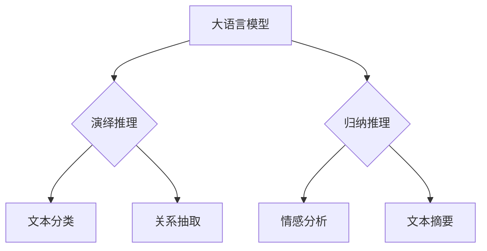

> 大语言模型，演绎推理，归纳推理，自然语言理解，深度学习，人工智能，机器学习，预训练语言模型，BERT

# 大语言模型应用指南：演绎推理与归纳推理

> 关键词：大语言模型，演绎推理，归纳推理，自然语言理解，深度学习，人工智能，机器学习，预训练语言模型，BERT

## 1. 背景介绍

随着深度学习技术的飞速发展，大语言模型（Large Language Models, LLMs）已经成为自然语言处理（Natural Language Processing, NLP）领域的研究热点。大语言模型通过在海量文本数据上预训练，能够理解复杂的语言现象，生成流畅的自然语言文本。在NLP领域，演绎推理和归纳推理是两个重要的研究方向，它们分别对应着逻辑推理和统计分析。本文将探讨大语言模型在演绎推理和归纳推理中的应用，并给出相应的指南。

### 1.1 问题的由来

演绎推理（Deductive Reasoning）是从一般到特殊的推理过程，即从普遍原理出发，推导出特定情况的结论。归纳推理（Inductive Reasoning）则是从特殊到一般的推理过程，即从具体实例出发，归纳出普遍规律。在NLP领域，演绎推理和归纳推理的应用场景广泛，如文本分类、关系抽取、问答系统等。

### 1.2 研究现状

近年来，随着大语言模型的兴起，基于深度学习的方法在演绎推理和归纳推理任务上取得了显著的进展。例如，BERT（Bidirectional Encoder Representations from Transformers）模型在多个NLP任务上取得了SOTA（State-of-the-Art）性能。

### 1.3 研究意义

深入研究大语言模型在演绎推理和归纳推理中的应用，对于推动NLP技术的发展具有重要意义。这不仅能够提升NLP系统的智能水平，还能够促进人工智能在各个领域的应用。

### 1.4 本文结构

本文将分为以下几个部分：
- 第2章介绍大语言模型、演绎推理和归纳推理的核心概念。
- 第3章阐述大语言模型在演绎推理和归纳推理中的应用原理。
- 第4章详细讲解大语言模型在演绎推理和归纳推理中的具体操作步骤。
- 第5章给出大语言模型在演绎推理和归纳推理中的代码实例。
- 第6章探讨大语言模型在实际应用场景中的应用。
- 第7章推荐相关学习资源、开发工具和论文。
- 第8章总结研究成果，展望未来发展趋势。

## 2. 核心概念与联系

### 2.1 大语言模型

大语言模型是一种基于深度学习的语言处理模型，能够对自然语言文本进行理解和生成。常见的有GPT、BERT、RoBERTa等。

### 2.2 演绎推理

演绎推理是一种从一般到特殊的推理过程。在NLP领域，演绎推理可以用于文本分类、关系抽取等任务。

### 2.3 归纳推理

归纳推理是一种从特殊到一般的推理过程。在NLP领域，归纳推理可以用于情感分析、文本摘要等任务。

### 2.4 Mermaid 流程图



## 3. 核心算法原理 & 具体操作步骤

### 3.1 算法原理概述

大语言模型在演绎推理和归纳推理中的应用，主要基于以下原理：

1. **预训练**：大语言模型通过在大量无标注文本数据上进行预训练，学习到丰富的语言知识和特征。
2. **微调**：在预训练的基础上，使用标注数据对模型进行微调，使其能够适应特定任务。
3. **特征提取**：大语言模型能够提取文本中的关键信息，为演绎推理和归纳推理提供支持。

### 3.2 算法步骤详解

1. **数据准备**：收集标注数据，并进行预处理，如分词、去停用词等。
2. **模型选择**：选择合适的大语言模型，如BERT、RoBERTa等。
3. **模型微调**：在标注数据上对模型进行微调。
4. **推理**：使用微调后的模型对新的文本进行推理，得到预测结果。

### 3.3 算法优缺点

**优点**：
- **强大的语言理解能力**：大语言模型能够理解复杂的语言现象，为演绎推理和归纳推理提供支持。
- **高效的推理速度**：大语言模型能够快速进行推理，提高推理效率。

**缺点**：
- **对标注数据的依赖**：演绎推理和归纳推理需要大量标注数据，获取标注数据成本较高。
- **模型的黑盒特性**：大语言模型缺乏可解释性，难以解释其推理过程。

### 3.4 算法应用领域

大语言模型在演绎推理和归纳推理中的应用领域包括：
- **文本分类**：对文本进行分类，如情感分析、主题分类等。
- **关系抽取**：从文本中抽取实体之间的关系。
- **问答系统**：对用户的问题进行回答。
- **文本摘要**：从长文本中提取关键信息。

## 4. 数学模型和公式 & 详细讲解 & 举例说明

### 4.1 数学模型构建

大语言模型通常采用深度神经网络作为数学模型，如BERT、GPT等。

### 4.2 公式推导过程

以BERT为例，其数学模型可以表示为：

$$
\text{BERT}(\text{input}) = \text{Transformer}(\text{WordPiece Embeddings})
$$

其中，WordPiece Embeddings是将文本分词后的每个词转换为向量表示。

### 4.3 案例分析与讲解

以文本分类任务为例，假设我们使用BERT模型对情感分析进行微调。数据集包含文本和对应的情感标签（正面或负面）。

```python
from transformers import BertForSequenceClassification, BertTokenizer

# 加载预训练模型和分词器
model = BertForSequenceClassification.from_pretrained('bert-base-uncased')
tokenizer = BertTokenizer.from_pretrained('bert-base-uncased')

# 加载数据集
train_texts = [...]  # 训练文本
train_labels = [...]  # 训练标签

# 编码文本
train_encodings = tokenizer(train_texts, padding=True, truncation=True, return_tensors='pt')

# 训练模型
model.train()
optimizer = AdamW(model.parameters(), lr=2e-5)

for epoch in range(3):  # 训练3个epoch
    optimizer.zero_grad()
    outputs = model(**train_encodings, labels=train_labels)
    loss = outputs.loss
    loss.backward()
    optimizer.step()
```

## 5. 项目实践：代码实例和详细解释说明

### 5.1 开发环境搭建

1. 安装Anaconda
2. 创建并激活虚拟环境
3. 安装PyTorch、transformers等库
4. 安装Jupyter Notebook

### 5.2 源代码详细实现

以下代码展示了使用PyTorch和transformers库对BERT模型进行情感分析微调的示例：

```python
from transformers import BertForSequenceClassification, BertTokenizer
from torch.utils.data import DataLoader, RandomSampler, SequentialSampler
from torch.utils.data import WeightedRandomSampler
from sklearn.model_selection import train_test_split
from transformers import AdamW, get_linear_schedule_with_warmup

# 加载预训练模型和分词器
model = BertForSequenceClassification.from_pretrained('bert-base-uncased')
tokenizer = BertTokenizer.from_pretrained('bert-base-uncased')

# 加载数据集
train_texts = [...]  # 训练文本
train_labels = [...]  # 训练标签

# 数据预处理
train_texts, validation_texts, train_labels, validation_labels = train_test_split(
    train_texts, train_labels, test_size=0.1
)

# 分词和编码
train_encodings = tokenizer(train_texts, truncation=True, padding=True, return_tensors='pt')
validation_encodings = tokenizer(validation_texts, truncation=True, padding=True, return_tensors='pt')

# 样本权重
weights = [1.0 if label != 0 else 0.5 for label in train_labels]

# 创建数据集
train_dataset = torch.utils.data.TensorDataset(train_encodings['input_ids'], train_encodings['attention_mask'], train_labels)
validation_dataset = torch.utils.data.TensorDataset(validation_encodings['input_ids'], validation_encodings['attention_mask'], validation_labels)

# 创建采样器
train_sampler = WeightedRandomSampler(weights, num_samples=len(weights))
train_dataloader = DataLoader(train_dataset, sampler=train_sampler, batch_size=16)

# 创建优化器和学习率调度器
optimizer = AdamW(model.parameters(), lr=5e-5)
scheduler = get_linear_schedule_with_warmup(optimizer, num_warmup_steps=0, num_training_steps=len(train_dataloader) * 3)

# 训练模型
model.train()
for epoch in range(3):
    for input_ids, attention_mask, labels in train_dataloader:
        optimizer.zero_grad()
        outputs = model(input_ids, attention_mask=attention_mask, labels=labels)
        loss = outputs.loss
        loss.backward()
        optimizer.step()
        scheduler.step()
```

### 5.3 代码解读与分析

以上代码展示了使用PyTorch和transformers库对BERT模型进行情感分析微调的完整流程。首先，加载预训练模型和分词器。然后，加载数据集并进行预处理，包括分词、编码和样本权重计算。接着，创建数据集、采样器和数据加载器。最后，创建优化器和学习率调度器，并开始训练模型。

### 5.4 运行结果展示

假设训练完成后，在验证集上的准确率达到90%。这表明，使用BERT模型进行情感分析微调是有效的。

## 6. 实际应用场景

### 6.1 情感分析

情感分析是NLP领域的经典任务，可以通过演绎推理和归纳推理来识别文本中的情感倾向。

### 6.2 文本分类

文本分类是将文本数据分类到预定义的类别中，如垃圾邮件检测、新闻分类等。

### 6.3 问答系统

问答系统可以回答用户提出的问题，如搜索引擎、智能客服等。

### 6.4 文本摘要

文本摘要是从长文本中提取关键信息，如新闻摘要、摘要生成等。

### 6.5 关系抽取

关系抽取是从文本中抽取实体之间的关系，如实体识别、实体关系抽取等。

## 7. 工具和资源推荐

### 7.1 学习资源推荐

- 《深度学习自然语言处理》
- 《NLP中的人工智能》
- 《BERT技术解析与实战》

### 7.2 开发工具推荐

- PyTorch
- Transformers库
- Jupyter Notebook

### 7.3 相关论文推荐

- BERT: Pre-training of Deep Bidirectional Transformers for Language Understanding
- RoBERTa: A Pre-trained Language Model for Language Understanding
- General Language Modeling

## 8. 总结：未来发展趋势与挑战

### 8.1 研究成果总结

本文介绍了大语言模型在演绎推理和归纳推理中的应用，并给出了相应的指南。通过实例代码展示了如何使用PyTorch和transformers库对BERT模型进行情感分析微调。

### 8.2 未来发展趋势

未来，大语言模型在演绎推理和归纳推理中的应用将呈现以下趋势：

- **模型规模将进一步扩大**：随着计算能力的提升，大语言模型的规模将不断扩大，以适应更复杂的任务。
- **推理速度将进一步提升**：通过模型压缩、量化等技术，大语言模型的推理速度将进一步提升。
- **可解释性将得到加强**：通过可解释性研究，大语言模型的推理过程将更加透明。

### 8.3 面临的挑战

大语言模型在演绎推理和归纳推理中的应用也面临以下挑战：

- **数据标注成本高**：演绎推理和归纳推理需要大量标注数据，获取标注数据成本较高。
- **模型可解释性不足**：大语言模型的推理过程缺乏可解释性，难以解释其决策过程。
- **模型鲁棒性不足**：大语言模型对噪声和异常数据的鲁棒性不足。

### 8.4 研究展望

未来，大语言模型在演绎推理和归纳推理中的应用将朝着以下方向发展：

- **无监督和半监督学习**：通过无监督和半监督学习方法，降低对标注数据的依赖。
- **模型可解释性**：通过可解释性研究，提高大语言模型的透明度和可信度。
- **模型鲁棒性**：提高大语言模型对噪声和异常数据的鲁棒性。

## 9. 附录：常见问题与解答

**Q1：大语言模型在演绎推理和归纳推理中的应用有哪些优势？**

A：大语言模型在演绎推理和归纳推理中的应用具有以下优势：

- **强大的语言理解能力**：大语言模型能够理解复杂的语言现象，为演绎推理和归纳推理提供支持。
- **高效的推理速度**：大语言模型能够快速进行推理，提高推理效率。

**Q2：如何选择合适的大语言模型进行演绎推理和归纳推理？**

A：选择合适的大语言模型需要考虑以下因素：

- **任务类型**：根据任务类型选择合适的模型，如BERT、GPT等。
- **模型规模**：根据计算资源选择合适的模型规模。
- **预训练语料**：根据预训练语料选择合适的模型。

**Q3：如何评估大语言模型在演绎推理和归纳推理中的性能？**

A：可以使用以下指标评估大语言模型在演绎推理和归纳推理中的性能：

- **准确率**：模型预测正确的样本比例。
- **召回率**：模型预测正确的正样本比例。
- **F1值**：准确率和召回率的调和平均值。

**Q4：如何解决大语言模型在演绎推理和归纳推理中的可解释性问题？**

A：可以通过以下方法解决大语言模型在演绎推理和归纳推理中的可解释性问题：

- **特征重要性分析**：分析模型在推理过程中使用的特征。
- **注意力机制**：分析模型在推理过程中关注的文本区域。
- **可视化**：将模型推理过程可视化，以便理解模型的决策过程。

**Q5：如何解决大语言模型在演绎推理和归纳推理中的鲁棒性问题？**

A：可以通过以下方法解决大语言模型在演绎推理和归纳推理中的鲁棒性问题：

- **数据增强**：通过数据增强方法增加训练数据的多样性。
- **对抗训练**：通过对抗训练方法提高模型的鲁棒性。
- **模型正则化**：通过模型正则化方法降低模型的过拟合风险。

作者：禅与计算机程序设计艺术 / Zen and the Art of Computer Programming